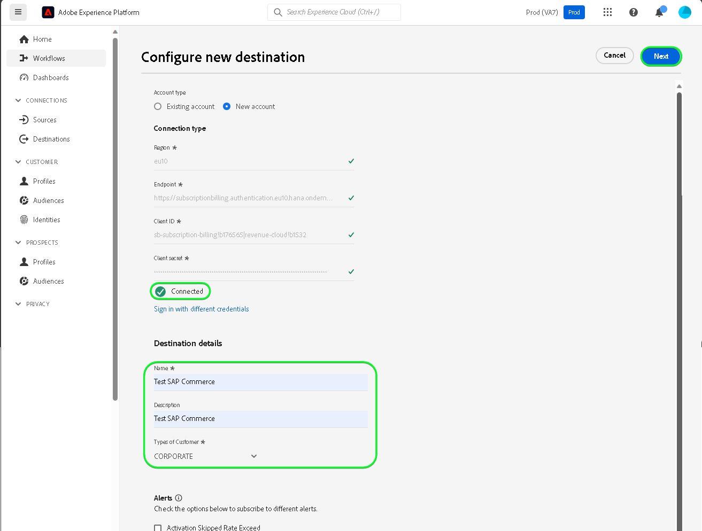

# [!DNL SAP Commerce] 接続

[!DNL SAP Commerce]（旧称：） [[!DNL Hybris]](https://www.sap.com/india/products/acquired-brands/what-is-hybris.html)は、B2B および B2C 企業向けのクラウドベースの e コマースプラットフォームソリューションで、SAP カスタマーエクスペリエンス ポートフォリオの一部として使用できます。 [[!DNL SAP] Subscription Billing](https://www.sap.com/products/financial-management/subscription-billing.html) は、ポートフォリオの下の製品であり、標準化された統合を通じてシンプルな販売および支払いエクスペリエンスで完全な購読ライフサイクル管理を可能にします。

この [!DNL Adobe Experience Platform] [宛先](/help/destinations/home.md) はを使用します [[!DNL SAP Subscription Billing] 顧客管理 API](https://api.sap.com/api/BusinessPartner_APIs/path/PUT_customers-customerNumber)で顧客の詳細情報を更新する場合 [!DNL SAP Commerce] アクティブ化後に既存のExperience Platformオーディエンスから。

[!DNL SAP Commerce] インスタンスを認証する手順は、さらに下の[宛先に対する認証](#authenticate)の節にあります。

## ユースケース {#use-cases}

[!DNL SAP Commerce] 宛先を使用する方法とタイミングを理解しやすくするために、Adobe Experience Platform のお客様がこの宛先を使用して解決できるユースケースのサンプルを以下に示します。

[!DNL SAP Commerce] 顧客は、ビジネスとやり取りする個人または組織単位に関する情報を格納します。 チームはにある顧客を使用します [!DNL SAP Commerce] Experience Platformオーディエンスを作成します。 これらのオーディエンスをに送信した後 [!DNL SAP Commerce]の各顧客の情報が更新され、顧客に割り当てられるプロパティには、顧客が属するオーディエンスを示すオーディエンス名としてその値が割り当てられます。

## 前提条件 {#prerequisites}

Experience Platformで設定する必要がある前提条件については、以下の節を参照してください。 [!DNL SAP Commerce] を使用する前に収集しておく必要がある情報について [!DNL SAP Commerce] の宛先。

### Experience Platform の前提条件 {#prerequisites-in-experience-platform}

へのデータのアクティブ化の前に [!DNL SAP Commerce] の宛先。には必要です [スキーマ](/help/xdm/schema/composition.md), a [データセット](https://experienceleague.adobe.com/docs/platform-learn/tutorials/data-ingestion/create-datasets-and-ingest-data.html)、および [オーディエンス](https://experienceleague.adobe.com/docs/platform-learn/tutorials/audiences/create-audiences.html) 作成場所 [!DNL Experience Platform].

については、Experience Platformドキュメントを参照してください。 [オーディエンスメンバーシップの詳細スキーマフィールドグループ](/help/xdm/field-groups/profile/segmentation.md) オーディエンスのステータスのガイダンスが必要な場合。

### の前提条件 [!DNL SAP Commerce] 宛先 {#prerequisites-destination}

Platform からにデータを書き出すには、次の前提条件に注意してください [!DNL SAP Commerce] アカウント :

#### 必須で、 [!DNL SAP Subscription Billing] アカウント {#prerequisites-account}

Platform からユーザーの [!DNL SAP Commerce] アカウントには、が必要です [!DNL SAP Subscription Billing] アカウント。 有効な請求アカウントがない場合は、 [!DNL SAP] アカウントマネージャー。 を参照してください。 [[!DNL SAP] プラットフォーム設定](https://help.sap.com/doc/5fd179965d5145fbbe7f2a7aa1272338/latest/en-US/PlatformConfiguration.pdf) 詳細については、を参照してください。

#### サービスキーの生成 {#prerequisites-service-key}

* この [!DNL SAP Commerce] サービスキーを使用すると、 [!DNL SAP Subscription Billing] Experience Platformを介した API を参照してください。 [!DNL SAP Commerce] [クライアント ID とクライアント秘密鍵を使用したサービスキーの作成](https://help.sap.com/docs/CLOUD_TO_CASH_OD/1216e7b79c984675b0a6f0005e351c74/87c11a0f5dc3494eaf3baa355925c030.html#create-a-service-key-with-client-id-and-client-secret) サービスキーを作成します。 [!DNL SAP Commerce] には、以下が必要です。
   * クライアント ID
   * クライアントシークレット
   * URL。 URL パターンは次のとおりです。 `https://subscriptionbilling.authentication.eu10.hana.ondemand.com`. この値は、後で値を取得するために使用されます `Region` および `Endpoint`.

+++選択して、サービスキーの例を確認します

```json
{ 
    "url": "https://eu10.revenue.cloud.sap/api",
    "uaa": {
        "clientid": "XXX",
        "clientsecret": "XXX",
        "url": "https://subscriptionbilling.authentication.eu10.hana.ondemand.com",
        "identityzone": "subscriptionbilling",
        "identityzoneid": "XXX",
        "tenantid": "XXX",
        "tenantmode": "dedicated",
        "sburl": "https://internal-xsuaa.authentication.eu10.hana.ondemand.com",
        "apiurl": "https://api.authentication.eu10.hana.ondemand.com",
        "verificationkey": "XXX",
        "xsappname": "XXX",
        "subaccountid": "XXX",
        "uaadomain": "authentication.eu10.hana.ondemand.com",
        "zoneid": "XXX",
        "credential-type": "binding-secret"
    },
    "vendor": "SAP"
}
```

+++

#### でのカスタム参照の作成 [!DNL SAP Subscription Billing] {#prerequisites-custom-reference}

でExperience Platformオーディエンスステータスを更新するには [!DNL SAP Subscription Billing]の場合、Platform で選択した各オーディエンスに対してカスタム参照フィールドが必要です。

カスタム参照を作成するには、にログインします [!DNL SAP Subscription Billing] アカウントと **[マスターデータと設定]** > **[カスタム参照]** ページ。 次に、を選択します **[!UICONTROL 作成]** platform で選択した各オーディエンスに対して新しい参照を追加します。 これらの参照フィールド名は、後続の [オーディエンスの書き出しのスケジュールと例](#schedule-segment-export-example) ステップ。

カスタムの作成方法の例 **[!UICONTROL 参照タイプ]** 内 [!DNL SAP Subscription Billing] 次に示します。


その他のガイダンスについては、を参照してください [!DNL SAP Subscription Billing] [カスタム参照](https://help.sap.com/docs/CLOUD_TO_CASH_OD/80d121f216af43648e79664efe5595f7/85696a63c8d8453a934e86c9413a25cf.html?version=2023-11-27) ドキュメント。

### 必要な資格情報の収集 {#gather-credentials}

接続する [!DNL SAP Commerce] Experience Platformするには、次の接続プロパティの値を指定する必要があります。

| 資格情報 | 説明 |
| --- | --- |
| クライアント ID | 次の値 `clientId` サービスキーから。 |
| クライアントシークレット | 次の値 `clientSecret` サービスキーから。 |
| エンドポイント | 次の値 `url` サービスキーからは、次のようになります。 `https://subscriptionbilling.authentication.eu10.hana.ondemand.com`. |
| 領域 | データセンターの場所。 この領域は、 `url` およびの値はに類似しています。 `eu10` または `us10`. 例えば、次のような場合： `url` 等しい `https://eu10.revenue.cloud.sap/api` 必要です `eu10`. |

## ガードレール {#guardrails}

への API リクエスト [!DNL SAP Cloud Management service] 次の条件に従う [レート制限](https://help.sap.com/docs/btp/sap-business-technology-platform/account-administration-rate-limiting). レート制限を超えると、 `HTTP 429 Too Many Requests` 応答ステータスコード。

## サポートされる ID {#supported-identities}

[!DNL SAP Commerce] では、以下の表で説明する ID の更新をサポートしています。[ID](/help/identity-service/features/namespaces.md) についての詳細情報。

| ターゲット ID | 説明 | 注意点 |
| --- | --- | --- |
| `customerNumberSAP` | 既にユーザーに存在する個人または法人の顧客の顧客識別子 [!DNL SAP Commerce] アカウント。 | 必須 |

## サポートされるオーディエンス {#supported-audiences}

この節では、この宛先に書き出しできるすべてのオーディエンスについて説明します。

この宛先では、Experience Platform の[セグメント化サービス](../../../segmentation/home.md)で生成したすべてのオーディエンスのアクティブ化をサポートします。

この宛先では、以下の表で説明するオーディエンスのアクティブ化もサポートされています。

| オーディエンスタイプ | サポートあり | 説明 |
| ------------- | --------- | ----------- |
| [!DNL Segmentation Service] | ✓ | Experience Platformを通じて生成されたオーディエンス [セグメント化サービス](../../../segmentation/home.md). |
| カスタムアップロード | ✓ | CSV ファイルから Experience Platform に[読み込まれた](../../../segmentation/ui/audience-portal.md#import-audience)オーディエンス。 |

{style="table-layout:auto"}

## 書き出しのタイプと頻度 {#export-type-frequency}

宛先の書き出しのタイプと頻度について詳しくは、以下の表を参照してください。

| 項目 | タイプ | メモ |
---------|----------|---------|
| 書き出しタイプ | **[!UICONTROL プロファイルベース]** | <ul><li>オーディエンスのすべてのメンバーを、目的のスキーマフィールドと共に書き出します *（例：メールアドレス、電話番号、姓）*&#x200B;フィールドマッピングに従って調整します。</li><li> Platform で選択した各オーディエンスに対して、対応する [!DNL SAP Commerce] 追加属性は、Platform からのオーディエンスステータスで更新されます。</li></ul> |
| 書き出し頻度 | **[!UICONTROL ストリーミング]** | <ul><li>ストリーミングの宛先は常に、API ベースの接続です。オーディエンスの評価に基づいてExperience Platform内でプロファイルが更新されると、コネクタは更新を宛先プラットフォームに送信します。 詳しくは、[ストリーミングの宛先](/help/destinations/destination-types.md#streaming-destinations)を参照してください。</li></ul> |

{style="table-layout:auto"}

## 宛先への接続 {#connect}

>[!IMPORTANT]
>
>宛先に接続するには、**[!UICONTROL 宛先の管理]** [アクセス制御権限](/help/access-control/home.md#permissions)が必要です。詳しくは、[アクセス制御の概要](/help/access-control/ui/overview.md)または製品管理者に問い合わせて、必要な権限を取得してください。

この宛先に接続するには、[宛先設定のチュートリアル](../../ui/connect-destination.md)の手順に従ってください。宛先の設定ワークフローで、以下の 2 つのセクションにリストされているフィールドに入力します。

内 **[!UICONTROL 宛先]** > **[!UICONTROL カタログ]**、検索： [!DNL SAP Commerce]. または、の下に配置することもできます。 **[!UICONTROL e コマース]** カテゴリ。

### 宛先に対する認証 {#authenticate}

以下の必須のフィールドに入力します。を参照してください。 [サービスキーの生成](#prerequisites-service-key) ガイダンスのセクション。

| フィールド | 説明 |
| --- | --- |
| **[!UICONTROL クライアント ID]** | 次の値 `clientId` サービスキーから。 |
| **[!UICONTROL クライアント秘密鍵]** | 次の値 `clientSecret` サービスキーから。 |
| **[!UICONTROL エンドポイント]** | 次の値 `url` サービスキーからは、次のようになります。 `https://subscriptionbilling.authentication.eu10.hana.ondemand.com`. |
| **[!UICONTROL 地域]** | データセンターの場所。 この領域は、 `url` およびの値はに類似しています。 `eu10` または `us10`. 例えば、次のような場合： `url` 等しい `https://eu10.revenue.cloud.sap/api` 必要です `eu10`. |

宛先を認証するには、「 **[!UICONTROL 宛先に接続]**」を選択します。


指定した詳細が有効な場合、UI で&#x200B;**[!UICONTROL 接続済み]**&#x200B;ステータスに緑色のチェックマークが付きます。その後、次の手順に進むことができます。

### 宛先の詳細を入力 {#destination-details}

宛先の詳細を設定するには、以下の必須フィールドとオプションフィールドに入力します。UI のフィールドの横にアスタリスクが表示される場合は、そのフィールドが必須であることを示します。


* **[!UICONTROL 名前]**：今後この宛先を認識するための名前。
* **[!UICONTROL 説明]**：今後この宛先を識別するのに役立つ説明。
* **[!UICONTROL 顧客のタイプ]**：次のいずれかを選択 ***個人*** または ***企業*** オーディエンス内のエンティティに応じて異なります。 この [!DNL SAP Subscription Billing] [スキーマ](https://api.sap.com/api/BusinessPartner_APIs/schema) にマッピングされているこの選択に応じて、必須フィールドを切り替えます。 `customerType` 属性。 選択範囲がの場合 ***企業***&#x200B;を選択した場合、のような必須のマッピングが選択されます。 `firstName` および `lastName` 個々の顧客に必要なものは無視され、 `company` は必須になり、その逆も同様です。

### アラートの有効化 {#enable-alerts}

アラートを有効にすると、宛先へのデータフローのステータスに関する通知を受け取ることができます。リストからアラートを選択して、データフローのステータスに関する通知を受け取るよう登録します。アラートについて詳しくは、[UI を使用した宛先アラートの購読](../../ui/alerts.md)についてのガイドを参照してください。

宛先接続の詳細の入力を終えたら「**[!UICONTROL 次へ]**」を選択します。

## この宛先に対してオーディエンスをアクティブ化 {#activate}

>[!IMPORTANT]
> 
>* データをアクティブ化するには、 **[!UICONTROL 宛先の表示]**, **[!UICONTROL 宛先のアクティブ化]**, **[!UICONTROL プロファイルの表示]**、および **[!UICONTROL セグメントの表示]** [アクセス制御権限](/help/access-control/home.md#permissions). [アクセス制御の概要](/help/access-control/ui/overview.md)を参照するか、製品管理者に問い合わせて必要な権限を取得してください。
>* エクスポートする *id*、が必要です **[!UICONTROL ID グラフの表示]** [アクセス制御権限](/help/access-control/home.md#permissions). <br> {width="100" zoomable="yes"}

この宛先にオーディエンスをアクティベートする手順は、[ストリーミングオーディエンスの書き出し宛先へのプロファイルとオーディエンスのアクティベート](/help/destinations/ui/activate-segment-streaming-destinations.md)を参照してください。

### 属性と ID のマッピング {#map}

Adobe Experience Platformからにオーディエンスデータを正しく送信するには、以下を行います [!DNL SAP Commerce] 宛先については、フィールドマッピングの手順を実行する必要があります。 マッピングは、Platform アカウント内の Experience Data Model（XDM）スキーマフィールドと、ターゲット宛先から対応する同等のスキーマフィールドとの間にリンクを作成して構成されます。 XDM フィールドをに正しくマッピングするには [!DNL SAP Commerce] 宛先フィールドは、次の手順に従います。

#### をマッピングします `customerNumberSAP` id

この `customerNumberSAP` id は、この宛先に必須のマッピングです。 マッピングするには、次の手順に従います。
1. **[!UICONTROL マッピング]**&#x200B;手順で、「**[!UICONTROL 新しいマッピングを追加]**」を選択します。これで、新しいマッピング行が画面に表示されます。
   
1. が含まれる **[!UICONTROL ソースフィールドを選択]** ウィンドウで、 **[!UICONTROL ID 名前空間を選択]** を選択して、 `customerNumberSAP`.
   
1. が含まれる **[!UICONTROL ターゲットフィールドを選択]** ウィンドウで、 **[!UICONTROL ID 名前空間を選択]** を選択し、 `customerNumber` id。
   

| ソースフィールド | ターゲットフィールド | 必須 |
| --- | --- | --- |
| `IdentityMap: customerNumberSAP` | `Identity: customerNumber` | ○ |

ID マッピングの例を以下に示します。


#### 属性のマッピング

XDM プロファイルスキーマとのその他の更新対象の属性を追加するには、次の手順に従います [!DNL SAP Subscription Billing] アカウントについて、次の手順を繰り返します。
1. **[!UICONTROL マッピング]**&#x200B;手順で、「**[!UICONTROL 新しいマッピングを追加]**」を選択します。これで、新しいマッピング行が画面に表示されます。
   
1. が含まれる **[!UICONTROL ソースフィールドを選択]** ウィンドウで、 **[!UICONTROL 属性を選択]** カテゴリを選択し、XDM 属性を選択します。
   
1. が含まれる **[!UICONTROL ターゲットフィールドを選択]** ウィンドウ、を選択 **[!UICONTROL カスタム属性を選択]** カテゴリと名前を入力 [!DNL SAP Subscription Billing] 顧客のリストからの属性 [スキーマ](https://api.sap.com/api/BusinessPartner_APIs/schema) 属性。
   

>[!IMPORTANT]
>
> ターゲットフィールド名では大文字と小文字が区別され、と一致する必要があります。 [!DNL SAP Subscription Billing] 属性名。 唯一の例外は次のとおりです `country` 使用する場所 `countryCode` その代わり。 [!DNL SAP Subscription Billing] は alpha-2 （ISO 3166）国コードをサポートしています。 値は大文字と小文字が区別され、0～3 文字にする必要があるので、定義したとおりに指定するとエラーが発生します。 `The country code {} does not exist` または `size must be between 0 and 3`.

#### マップ `mandatory` 選択した顧客タイプの属性

必須の属性マッピングは、によって異なります **[!UICONTROL 顧客のタイプ]** を選択しました。 必須属性をマッピングするには、以下から選択します。

>[!BEGINTABS]

>[!TAB 個人のお客様]

| ソースフィールド | ターゲットフィールド | 必須 |
| --- | --- | --- |
| `xdm: person.lastName` | `Attribute: lastName` | ○ |
| `xdm: workAddress.countryCode` | `Attribute: countryCode` | ○ |

>[!TAB 法人顧客]

| ソースフィールド | ターゲットフィールド | 必須 |
| --- | --- | --- |
| `xdm: b2b.companyName` | `Attribute: company` | ○ |
| `xdm: workAddress.countryCode` | `Attribute: countryCode` | ○ |

>[!ENDTABS]

#### 追加属性のマッピング

その後、XDM プロファイルスキーマとの間にマッピングを追加できます [!DNL SAP Subscription Billing] [スキーマ](https://api.sap.com/api/BusinessPartner_APIs/schema) 以下に示すように、顧客の属性です。

>[!BEGINTABS]

>[!TAB 個人のお客様]

| ソースフィールド | ターゲットフィールド | 必須 |
| --- | --- | --- |
| `xdm: person.name.firstName` | `Attribute: firstName` | × |
| `xdm: workAddress.street1` | `Attribute: street` | × |
| `xdm: workAddress.city` | `Attribute: city` | × |

顧客が個人である、必須の属性マッピングとオプションの属性マッピングの両方の例を次に示します。


>[!TAB 法人顧客]

| ソースフィールド | ターゲットフィールド | 必須 |
| --- | --- | --- |
| `xdm: workAddress.street1` | `Attribute: street` | × |
| `xdm: workAddress.city` | `Attribute: city` | × |

顧客が企業である、必須の属性マッピングとオプションの属性マッピングの例を次に示します。


>[!ENDTABS]

宛先接続のマッピングの指定を終えたら、次を選択します **[!UICONTROL 次]**.

### オーディエンスの書き出しのスケジュールと例 {#schedule-segment-export-example}

を実行する場合 [オーディエンスの書き出しをスケジュール](/help/destinations/ui/activate-segment-streaming-destinations.md#scheduling) 手順では、Platform オーディエンスをに手動でマッピングする必要があります [属性](#prerequisites-attribute) 。対象： [!DNL SAP Subscription Billing].

の場所を使用した、オーディエンスの書き出しをスケジュール手順の例 [!DNL SAP Commerce] **[!UICONTROL マッピング ID]** 強調表示されています。次に示します。


それには、各セグメントを選択し、からカスタム参照の名前を入力します [!DNL SAP Subscription Billing] が含まれる [!DNL SAP Commerce] **[!UICONTROL マッピング ID]** 宛先コネクタフィールド。 カスタム参照の作成に関するガイダンスについては、 [でのカスタム参照の作成 [!DNL SAP Subscription Billing]](#prerequisites-custom-reference) セクション。

>[!IMPORTANT]
>
> カスタム参照ラベルを値として使用しないでください。
>

例えば、選択したExperience Platformオーディエンスがである場合 `sap_audience1` また、そのステータスをに更新する必要があります。 [!DNL SAP Subscription Billing] カスタム参照 `SAP_1`。この値を [!DNL SAP_Commerce] **[!UICONTROL マッピング ID]** フィールド。

例 **[!UICONTROL 参照タイプ]** から [!DNL SAP Subscription Billing] 次に示します。


オーディエンスとその対応するオーディエンスを選択した状態での、オーディエンスの書き出しスケジュール手順の例 [!DNL SAP Commerce] **[!UICONTROL マッピング ID]** 強調表示されています。次に示します。


例えば、次の範囲で示された値 **[!UICONTROL マッピング ID]** フィールドはと完全に一致する必要があります [!DNL SAP Subscription Billing] **[!UICONTROL 参照タイプ]** 値。

アクティブ化された各 Platform オーディエンスに対して、このセクションを繰り返します。

2 つのオーディエンスを選択した場合の上記の画像に基づいて、マッピングは次のようになります。 | [!DNL SAP Commerce] オーディエンス名 | [!DNL SAP Subscription Billing] **[!UICONTROL 参照タイプ]** | [!DNL SAP Commerce] **[!UICONTROL マッピング ID]** value | | — | — | — | | sap_audience1 | `SAP_1` | `SAP_1` | | SAP オーディエンス 2 | `SAP_2` | `SAP_2` |

## データの書き出しを検証する {#exported-data}

宛先が正しく設定されていることを検証するには、次の手順に従います。

にログインします [!DNL SAP Subscription Billing] アカウントで、に移動します。 **[!UICONTROL 連絡先]** オーディエンスのステータスを確認するページ。 このリストは、カスタム参照の列を表示し、対応するオーディエンスステータスを表示するように設定できます。


## データの使用とガバナンス {#data-usage-governance}

[!DNL Adobe Experience Platform] のすべての宛先は、データを処理する際のデータ使用ポリシーに準拠しています。[!DNL Adobe Experience Platform] がどのようにデータガバナンスを実施するかについて詳しくは、[データガバナンスの概要](/help/data-governance/home.md)を参照してください。

## エラーとトラブルシューティング {#errors-and-troubleshooting}

を参照してください。 [[!DNL SAP Subscription Billing] エラータイプ](https://help.sap.com/docs/CLOUD_TO_CASH_OD/987aec876092428f88162e438acf80d6/1a6a0dd6129c48e8b235190a1b5409fa.html) 使用可能なエラータイプとその応答コードのリストについては、ドキュメントページを参照してください。

## その他のリソース {#additional-resources}

その他の役に立つ情報 [!DNL SAP] ドキュメントは以下のとおりです。
* [オンボーディング SAP サブスクリプション請求](https://help.sap.com/docs/CLOUD_TO_CASH_OD/1216e7b79c984675b0a6f0005e351c74/e4b8badf7d124026991e4ab6b57d2a33.html)

### 変更ログ

この節では、この宛先コネクタに対する機能の概要と重要なドキュメントの更新について説明します。

+++ 変更ログを表示

| リリース月 | 更新タイプ | 説明 |
|---|---|---|
| 2024年1月 | 初回リリース | 宛先の初回リリースとドキュメントの公開。 |

{style="table-layout:auto"}

+++
