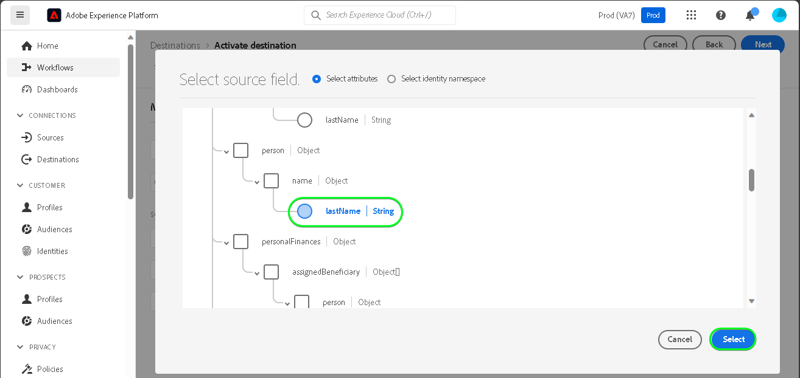
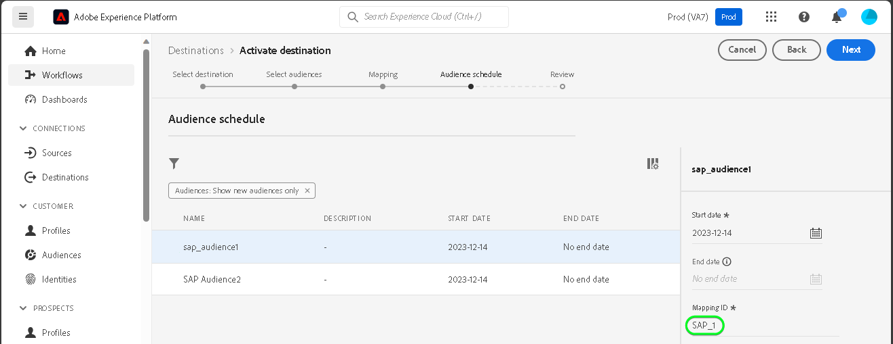

# [!DNL SAP Commerce] 接続

[!DNL SAP Commerce]（旧称： ） [[!DNL Hybris]](https://www.sap.com/india/products/acquired-brands/what-is-hybris.html)は、B2B および B2C 企業向けのクラウドベースの e コマースプラットフォームソリューションで、SAP Customer Experience ポートフォリオの一部として利用できます。 [[!DNL SAP] サブスクリプションの請求](https://www.sap.com/products/financial-management/subscription-billing.html) は、ポートフォリオの下の製品で、標準化された統合による販売と支払いの経験をシンプル化し、完全なサブスクリプションライフサイクル管理を可能にします。

この [!DNL Adobe Experience Platform] [宛先](/help/destinations/home.md) は [[!DNL SAP Subscription Billing] 顧客管理 API](https://api.sap.com/api/BusinessPartner_APIs/path/PUT_customers-customerNumber)、内で顧客の詳細を更新する [!DNL SAP Commerce] アクティブ化後に既存のExperience Platformオーディエンスから

[!DNL SAP Commerce] インスタンスを認証する手順は、さらに下の[宛先に対する認証](#authenticate)の節にあります。

## ユースケース {#use-cases}

[!DNL SAP Commerce] 宛先を使用する方法とタイミングを理解しやすくするために、Adobe Experience Platform のお客様がこの宛先を使用して解決できるユースケースのサンプルを以下に示します。

[!DNL SAP Commerce] のお客様は、ビジネスとやり取りする個人または組織エンティティに関する情報を保存します。 チームは、 [!DNL SAP Commerce] を使用して、Experience Platformオーディエンスを構築します。 これらのオーディエンスをに送信した後 [!DNL SAP Commerce]の場合、顧客の情報が更新され、各顧客にプロパティが割り当てられ、その値が、顧客が属するオーディエンスを示すオーディエンス名として割り当てられます。

## 前提条件 {#prerequisites}

Experience Platformおよびで設定する必要がある前提条件については、以下の節を参照してください。 [!DNL SAP Commerce] また、を使用する前に収集する必要がある情報についても説明します。 [!DNL SAP Commerce] 宛先。

### Experience Platform の前提条件 {#prerequisites-in-experience-platform}

に対してデータをアクティブ化する前に [!DNL SAP Commerce] 宛先の [スキーマ](/help/xdm/schema/composition.md), a [データセット](https://experienceleague.adobe.com/docs/platform-learn/tutorials/data-ingestion/create-datasets-and-ingest-data.html?lang=ja)、および [audiences](https://experienceleague.adobe.com/docs/platform-learn/tutorials/audiences/create-audiences.html) 次で作成： [!DNL Experience Platform].

詳しくは、Experience Platformドキュメントを参照してください。 [オーディエンスメンバーシップ詳細スキーマフィールドグループ](/help/xdm/field-groups/profile/segmentation.md) オーディエンスのステータスに関するガイダンスが必要な場合は、を参照してください。

### の前提条件 [!DNL SAP Commerce] 宛先 {#prerequisites-destination}

Platform からにデータを書き出すための次の前提条件に注意してください。 [!DNL SAP Commerce] アカウント：

#### 次が必要です： [!DNL SAP Subscription Billing] アカウント {#prerequisites-account}

Platform からにデータを書き出すには、以下を実行します。 [!DNL SAP Commerce] アカウントを使用するには、 [!DNL SAP Subscription Billing] アカウント。 有効な請求アカウントがない場合は、 [!DNL SAP] アカウントマネージャー。 詳しくは、 [[!DNL SAP] プラットフォーム設定](https://help.sap.com/doc/5fd179965d5145fbbe7f2a7aa1272338/latest/en-US/PlatformConfiguration.pdf) ドキュメントを参照してください。

#### サービスキーの生成 {#prerequisites-service-key}

* The [!DNL SAP Commerce] サービスキーを使用すると、 [!DNL SAP Subscription Billing] Experience Platformを介した API 詳しくは、 [!DNL SAP Commerce] [クライアント ID とクライアント秘密鍵を持つサービスキーを作成する](https://help.sap.com/docs/CLOUD_TO_CASH_OD/1216e7b79c984675b0a6f0005e351c74/87c11a0f5dc3494eaf3baa355925c030.html#create-a-service-key-with-client-id-and-client-secret) をクリックして、サービスキーを作成します。 [!DNL SAP Commerce] には、以下が必要です。
   * クライアント ID
   * クライアントシークレット
   * URL。 URL のパターンは次のとおりです。 `https://subscriptionbilling.authentication.eu10.hana.ondemand.com`. この値は後での値の取得に使用されます。 `Region` および `Endpoint`.

+++「 」を選択して、サービスキーの例を表示します。

```json
{ 
    "url": "https://eu10.revenue.cloud.sap/api",
    "uaa": {
        "clientid": "XXX",
        "clientsecret": "XXX",
        "url": "https://subscriptionbilling.authentication.eu10.hana.ondemand.com",
        "identityzone": "subscriptionbilling",
        "identityzoneid": "XXX",
        "tenantid": "XXX",
        "tenantmode": "dedicated",
        "sburl": "https://internal-xsuaa.authentication.eu10.hana.ondemand.com",
        "apiurl": "https://api.authentication.eu10.hana.ondemand.com",
        "verificationkey": "XXX",
        "xsappname": "XXX",
        "subaccountid": "XXX",
        "uaadomain": "authentication.eu10.hana.ondemand.com",
        "zoneid": "XXX",
        "credential-type": "binding-secret"
    },
    "vendor": "SAP"
}
```

+++

#### でのカスタム参照の作成 [!DNL SAP Subscription Billing] {#prerequisites-custom-reference}

でExperience Platformオーディエンスのステータスを更新するには、以下を実行します。 [!DNL SAP Subscription Billing]の場合、Platform で選択した各オーディエンスのカスタム参照フィールドが必要です。

カスタム参照を作成するには、 [!DNL SAP Subscription Billing] アカウントに移動し、 **[マスターデータと設定]** > **[カスタム参照]** ページに貼り付けます。 次に、「 **[!UICONTROL 作成]** をクリックして、Platform で選択した各オーディエンスに新しい参照を追加します。 これらの参照フィールド名は、後続の [オーディエンスのエクスポートと例のスケジュール設定](#schedule-segment-export-example) 手順

カスタムの作成方法の例 **[!UICONTROL 参照タイプ]** 範囲 [!DNL SAP Subscription Billing] は次のように表示されます。


追加のガイダンスについては、 [!DNL SAP Subscription Billing] [カスタム参照](https://help.sap.com/docs/CLOUD_TO_CASH_OD/80d121f216af43648e79664efe5595f7/85696a63c8d8453a934e86c9413a25cf.html?version=2023-11-27) ドキュメント。

### 必要な資格情報の収集 {#gather-credentials}

接続するには [!DNL SAP Commerce] をExperience Platformするには、次の接続プロパティの値を指定する必要があります。

| 資格情報 | 説明 |
| --- | --- |
| クライアント ID | の値 `clientId` サービスキーから。 |
| クライアントシークレット | の値 `clientSecret` サービスキーから。 |
| エンドポイント | の値 `url` サービスキーから、次のようになります。 `https://subscriptionbilling.authentication.eu10.hana.ondemand.com`. |
| 領域 | データセンターの場所。 地域が `url` との値は、 `eu10` または `us10`. 例えば、 `url` 次に該当 `https://eu10.revenue.cloud.sap/api` 必要な項目 `eu10`. |

## ガードレール {#guardrails}

への API リクエスト [!DNL SAP Cloud Management service] 次の条件を満たす [レート制限](https://help.sap.com/docs/btp/sap-business-technology-platform/account-administration-rate-limiting). レート制限を超えると、 `HTTP 429 Too Many Requests` 応答ステータスコード。

## サポートされる ID {#supported-identities}

[!DNL SAP Commerce] では、以下の表で説明する ID の更新をサポートしています。[ID](/help/identity-service/features/namespaces.md) についての詳細情報。

| ターゲット ID | 説明 | 注意点 |
| --- | --- | --- |
| `customerNumberSAP` | お客様に既に存在する個人または企業の顧客の顧客 ID [!DNL SAP Commerce] アカウント。 | 必須 |

## サポートされるオーディエンス {#supported-audiences}

この節では、この宛先に書き出しできるすべてのオーディエンスについて説明します。

この宛先では、Experience Platform の[セグメント化サービス](../../../segmentation/home.md)で生成したすべてのオーディエンスのアクティブ化をサポートします。

また、この宛先では、以下の表で説明するオーディエンスのアクティブ化もサポートされます。

| オーディエンスタイプ | 説明 |
---------|----------|
| [!DNL Segmentation Service] | ✓ | Experience Platform [セグメント化サービス](../../../segmentation/home.md). |
| カスタムアップロード | ✓ | CSV ファイルから Experience Platform に[読み込まれた](../../../segmentation/ui/overview.md#import-audience)オーディエンス。 |

{style="table-layout:auto"}

## 書き出しのタイプと頻度 {#export-type-frequency}

宛先の書き出しのタイプと頻度について詳しくは、以下の表を参照してください。

| 項目 | タイプ | メモ |
---------|----------|---------|
| 書き出しタイプ | **[!UICONTROL プロファイルベース]** | <ul><li>オーディエンスのすべてのメンバーを、目的のスキーマフィールドと共に書き出します *（例：電子メールアドレス、電話番号、姓）*（フィールドマッピングに従います）。</li><li> Platform で選択した各オーディエンスに対して、 [!DNL SAP Commerce] 追加の属性が、Platform からのオーディエンスステータスに応じて更新されます。</li></ul> |
| 書き出し頻度 | **[!UICONTROL ストリーミング]** | <ul><li>ストリーミングの宛先は常に、API ベースの接続です。オーディエンスの評価に基づいてExperience Platformでプロファイルが更新されると、コネクタは更新を宛先プラットフォームに送信します。 詳しくは、[ストリーミングの宛先](/help/destinations/destination-types.md#streaming-destinations)を参照してください。</li></ul> |

{style="table-layout:auto"}

## 宛先への接続 {#connect}

>[!IMPORTANT]
>
>宛先に接続するには、**[!UICONTROL 宛先の管理]** [アクセス制御権限](/help/access-control/home.md#permissions)が必要です。詳しくは、[アクセス制御の概要](/help/access-control/ui/overview.md)または製品管理者に問い合わせて、必要な権限を取得してください。

この宛先に接続するには、[宛先設定のチュートリアル](../../ui/connect-destination.md)の手順に従ってください。宛先の設定ワークフローで、以下の 2 つのセクションにリストされているフィールドに入力します。

Within **[!UICONTROL 宛先]** > **[!UICONTROL カタログ]**、を検索します。 [!DNL SAP Commerce]. または、 **[!UICONTROL e コマース]** カテゴリ。

### 宛先に対する認証 {#authenticate}

以下の必須のフィールドに入力します。詳しくは、 [サービスキーの生成](#prerequisites-service-key) 」の節を参照してください。

| フィールド | 説明 |
| --- | --- |
| **[!UICONTROL クライアント ID]** | の値 `clientId` サービスキーから。 |
| **[!UICONTROL クライアント秘密鍵]** | の値 `clientSecret` サービスキーから。 |
| **[!UICONTROL エンドポイント]** | の値 `url` サービスキーから、次のようになります。 `https://subscriptionbilling.authentication.eu10.hana.ondemand.com`. |
| **[!UICONTROL 地域]** | データセンターの場所。 地域が `url` との値は、 `eu10` または `us10`. 例えば、 `url` 次に該当 `https://eu10.revenue.cloud.sap/api` 必要な項目 `eu10`. |

宛先を認証するには、「 **[!UICONTROL 宛先に接続]**」を選択します。


指定した詳細が有効な場合、UI で&#x200B;**[!UICONTROL 接続済み]**&#x200B;ステータスに緑色のチェックマークが付きます。その後、次の手順に進むことができます。

### 宛先の詳細を入力 {#destination-details}

宛先の詳細を設定するには、以下の必須フィールドとオプションフィールドに入力します。UI のフィールドの横にアスタリスクが表示される場合は、そのフィールドが必須であることを示します。


* **[!UICONTROL 名前]**：今後この宛先を認識するための名前。
* **[!UICONTROL 説明]**：今後この宛先を識別するのに役立つ説明。
* **[!UICONTROL 顧客のタイプ]**：次のいずれかを選択します。 ***個人*** または ***企業*** オーディエンス内のエンティティに応じて異なります。 The [!DNL SAP Subscription Billing] [スキーマ](https://api.sap.com/api/BusinessPartner_APIs/schema) 必須フィールドを、 `customerType` 属性。 選択範囲が ***企業***&#x200B;を選択し、次のような必須マッピングを `firstName` および `lastName` 個々の顧客に対して必須は無視され、 `company` は必須になり、逆も同様になります。

### アラートの有効化 {#enable-alerts}

アラートを有効にすると、宛先へのデータフローのステータスに関する通知を受け取ることができます。リストからアラートを選択して、データフローのステータスに関する通知を受け取るよう登録します。アラートについて詳しくは、[UI を使用した宛先アラートの購読](../../ui/alerts.md)についてのガイドを参照してください。

宛先接続の詳細の入力を終えたら「**[!UICONTROL 次へ]**」を選択します。

## この宛先に対してオーディエンスをアクティブ化 {#activate}

>[!IMPORTANT]
> 
>* データをアクティブ化するには、 **[!UICONTROL 宛先の表示]**, **[!UICONTROL 宛先のアクティブ化]**, **[!UICONTROL プロファイルの表示]**、および **[!UICONTROL セグメントを表示]** [アクセス制御権限](/help/access-control/home.md#permissions). [アクセス制御の概要](/help/access-control/ui/overview.md)を参照するか、製品管理者に問い合わせて必要な権限を取得してください。
>* 書き出す *id*、 **[!UICONTROL ID グラフを表示]** [アクセス制御権限](/help/access-control/home.md#permissions). <br> {width="100" zoomable="yes"}

この宛先にオーディエンスをアクティベートする手順は、[ストリーミングオーディエンスの書き出し宛先へのプロファイルとオーディエンスのアクティベート](/help/destinations/ui/activate-segment-streaming-destinations.md)を参照してください。

### 属性と ID のマッピング {#map}

Adobe Experience Platformからにオーディエンスデータを正しく送信するには、以下を実行します。 [!DNL SAP Commerce] の宛先の場合は、フィールドマッピングの手順を実行する必要があります。 マッピングは、Platform アカウント内の Experience Data Model（XDM）スキーマフィールドと、ターゲット宛先から対応する同等のスキーマフィールドとの間にリンクを作成して構成されます。 XDM フィールドを [!DNL SAP Commerce] 宛先フィールドには、次の手順に従います。

#### マッピング `customerNumberSAP` id

The `customerNumberSAP` id は、この宛先での必須マッピングです。 次の手順に従って、マッピングします。
1. **[!UICONTROL マッピング]**&#x200B;手順で、「**[!UICONTROL 新しいマッピングを追加]**」を選択します。これで、新しいマッピング行が画面に表示されます。
   
1. Adobe Analytics の **[!UICONTROL ソースフィールドを選択]** ウィンドウで、 **[!UICONTROL ID 名前空間を選択]** を選択し、 `customerNumberSAP`.
   
1. Adobe Analytics の **[!UICONTROL ターゲットフィールドを選択]** ウィンドウで、 **[!UICONTROL ID 名前空間を選択]** をクリックし、 `customerNumber` ID。
   

| ソースフィールド | ターゲットフィールド | 必須 |
| --- | --- | --- |
| `IdentityMap: customerNumberSAP` | `Identity: customerNumber` | ○ |

ID マッピングの例を次に示します。


#### マッピング属性

XDM プロファイルスキーマと [!DNL SAP Subscription Billing] アカウントで、以下の手順を繰り返します。
1. **[!UICONTROL マッピング]**&#x200B;手順で、「**[!UICONTROL 新しいマッピングを追加]**」を選択します。これで、新しいマッピング行が画面に表示されます。
   
1. Adobe Analytics の **[!UICONTROL ソースフィールドを選択]** ウィンドウで、 **[!UICONTROL 属性を選択]** カテゴリを選択し、XDM 属性を選択します。
   
1. Adobe Analytics の **[!UICONTROL ターゲットフィールドを選択]** ウィンドウ：選択 **[!UICONTROL カスタム属性を選択]** カテゴリを選択し、 [!DNL SAP Subscription Billing] 顧客のリストの属性 [スキーマ](https://api.sap.com/api/BusinessPartner_APIs/schema) 属性。
   

>[!IMPORTANT]
>
> ターゲットフィールド名では大文字と小文字が区別され、 [!DNL SAP Subscription Billing] 属性名 唯一の例外は `country` 使用すべき場所 `countryCode` 代わりに、 [!DNL SAP Subscription Billing] は、アルファ —2(ISO 3166) 国コードをサポートしています。 値は大文字と小文字を区別し、0 ～ 3 文字の範囲で指定する必要があります。したがって、次のように定義されているとおりに指定する必要があります。そうしないと、エラーが発生します。 `The country code {} does not exist` または `size must be between 0 and 3`.

#### マップ `mandatory` 選択した顧客タイプの属性

必須の属性のマッピングは、 **[!UICONTROL 顧客のタイプ]** あなたが選んだ 必須の属性をマッピングするには、次のいずれかを選択します。

>[!BEGINTABS]

>[!TAB 個人顧客]

| ソースフィールド | ターゲットフィールド | 必須 |
| --- | --- | --- |
| `xdm: person.lastName` | `Attribute: lastName` | ○ |
| `xdm: workAddress.countryCode` | `Attribute: countryCode` | ○ |

>[!TAB 企業顧客]

| ソースフィールド | ターゲットフィールド | 必須 |
| --- | --- | --- |
| `xdm: b2b.companyName` | `Attribute: company` | ○ |
| `xdm: workAddress.countryCode` | `Attribute: countryCode` | ○ |

>[!ENDTABS]

#### 追加の属性のマッピング

その後、XDM プロファイルスキーマと [!DNL SAP Subscription Billing] [スキーマ](https://api.sap.com/api/BusinessPartner_APIs/schema) 顧客の属性を次に示します。

>[!BEGINTABS]

>[!TAB 個人顧客]

| ソースフィールド | ターゲットフィールド | 必須 |
| --- | --- | --- |
| `xdm: person.name.firstName` | `Attribute: firstName` | × |
| `xdm: workAddress.street1` | `Attribute: street` | × |
| `xdm: workAddress.city` | `Attribute: city` | × |

顧客が個人である、必須とオプションの両方の属性マッピングの例を次に示します。


>[!TAB 企業顧客]

| ソースフィールド | ターゲットフィールド | 必須 |
| --- | --- | --- |
| `xdm: workAddress.street1` | `Attribute: street` | × |
| `xdm: workAddress.city` | `Attribute: city` | × |

顧客が会社である、必須とオプションの両方の属性マッピングの例を次に示します。


>[!ENDTABS]

宛先接続のマッピングの指定が完了したら、「 」を選択します。 **[!UICONTROL 次へ]**.

### オーディエンスのエクスポートと例のスケジュール設定 {#schedule-segment-export-example}

実行時に、 [オーディエンスの書き出しをスケジュール](/help/destinations/ui/activate-segment-streaming-destinations.md#scheduling) 手順に従い、Platform オーディエンスを手動で [属性](#prerequisites-attribute) in [!DNL SAP Subscription Billing].

以下に示すように、オーディエンスのエクスポートをスケジュール設定手順の例と [!DNL SAP Commerce] **[!UICONTROL マッピング ID]** ハイライト表示されています。次に示します。


これをおこなうには、各セグメントを選択し、次の場所からカスタム参照の名前を入力します。 [!DNL SAP Subscription Billing] （内） [!DNL SAP Commerce] **[!UICONTROL マッピング ID]** 宛先コネクタフィールド。 カスタム参照の作成に関するガイダンスについては、 [でのカスタム参照の作成 [!DNL SAP Subscription Billing]](#prerequisites-custom-reference) 」セクションに入力します。

>[!IMPORTANT]
>
> カスタム参照ラベルを値として使用しないでください。
>

例えば、選択したExperience Platformオーディエンスが `sap_audience1` を更新し、そのステータスを [!DNL SAP Subscription Billing] カスタム参照 `SAP_1`を使用する場合は、この値を [!DNL SAP_Commerce] **[!UICONTROL マッピング ID]** フィールドに入力します。

例 **[!UICONTROL 参照タイプ]** から [!DNL SAP Subscription Billing] は次のように表示されます。


オーディエンスを選択し、対応するオーディエンスを含む、オーディエンスのエクスポート手順の例 [!DNL SAP Commerce] **[!UICONTROL マッピング ID]** ハイライト表示されています。次に示します。


例えば、 **[!UICONTROL マッピング ID]** フィールドは、 [!DNL SAP Subscription Billing] **[!UICONTROL 参照タイプ]** の値を指定します。

アクティブ化された Platform オーディエンスごとに、この節を繰り返します。

2 つのオーディエンスを選択した上記の画像に基づいて、マッピングは次のようになります。 | [!DNL SAP Commerce] オーディエンス名 | [!DNL SAP Subscription Billing] **[!UICONTROL 参照タイプ]** | [!DNL SAP Commerce] **[!UICONTROL マッピング ID]** 値 | | — | — | — | | sap_audience1 | `SAP_1` | `SAP_1` | | SAP Audience2 | `SAP_2` | `SAP_2` |

## データの書き出しを検証する {#exported-data}

宛先が正しく設定されていることを検証するには、次の手順に従います。

にログインします。 [!DNL SAP Subscription Billing] アカウントに移動し、 **[!UICONTROL 連絡先]** ページを開いて、オーディエンスのステータスを確認します。 このリストは、カスタム参照の列を表示し、対応するオーディエンスのステータスを表示するように設定できます。


## データの使用とガバナンス {#data-usage-governance}

[!DNL Adobe Experience Platform] のすべての宛先は、データを処理する際のデータ使用ポリシーに準拠しています。[!DNL Adobe Experience Platform] がどのようにデータガバナンスを実施するかについて詳しくは、[データガバナンスの概要](/help/data-governance/home.md)を参照してください。

## エラーとトラブルシューティング {#errors-and-troubleshooting}

詳しくは、 [[!DNL SAP Subscription Billing] エラータイプ](https://help.sap.com/docs/CLOUD_TO_CASH_OD/987aec876092428f88162e438acf80d6/1a6a0dd6129c48e8b235190a1b5409fa.html) 使用可能なエラータイプとその応答コードのリストに関するドキュメントページです。

## その他のリソース {#additional-resources}

以下に示すその他の役に立つ情報 [!DNL SAP] 以下のドキュメントです。
* [SAP サブスクリプション請求のオンボーディング](https://help.sap.com/docs/CLOUD_TO_CASH_OD/1216e7b79c984675b0a6f0005e351c74/e4b8badf7d124026991e4ab6b57d2a33.html)

### 変更ログ

この節では、この宛先コネクタに対する機能の概要と重要なドキュメントの更新について説明します。

+++ 変更ログを表示

| リリース月 | 更新タイプ | 説明 |
|---|---|---|
| 2024年1月 | 初回リリース | 宛先の初回リリースとドキュメントの公開。 |

{style="table-layout:auto"}

+++