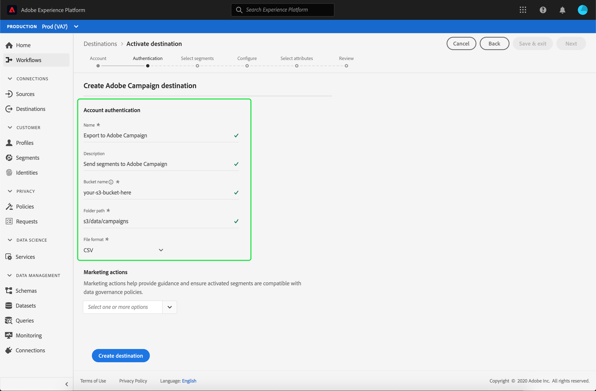

# Adobe Campaign接続

Adobe Campaign は、オンラインおよびオフラインのすべてのチャネルにまたがるキャンペーンをカスタマイズし、実施するのに役立つソリューションセットです。詳しくは、[Campaign Classic](https://experienceleague.adobe.com/docs/campaign-classic/using/getting-started/starting-with-adobe-campaign/about-adobe-campaign-classic.html)で開始するを参照してください。

セグメントデータをAdobe Campaignに送信するには、まずAdobe Experience Platformの宛先](#connect-destination)に[接続し、次に[ストレージの場所からAdobe Campaignへのデータインポート](#import-data-into-campaign)を設定する必要があります。

## エクスポートの種類{#export-type}

**プロファイルベース**  — セグメントのすべてのメンバーを、必要なスキーマフィールド(例：電子メールアドレス、電話番号、姓)。 **[!UICONTROL 宛先アクティベーションワークフローの]** 属性を [選択手順で選択され](../../ui/activate-destinations.md#select-attributes)ます。

## 宛先の接続 {#connect-destination}

**[!UICONTROL 接続]**/**[!UICONTROL 宛先]**&#x200B;で、「Adobe Campaign」を選択し、「**[!UICONTROL 設定]**」を選択します。

>[!NOTE]
>
>この宛先との接続が既に存在する場合は、宛先カードに「**[!UICONTROL Activate]**」ボタンが表示されます。 「[!UICONTROL アクティブ化]」と「[!UICONTROL 設定]」の違いについて詳しくは、保存先のワークスペースドキュメントの「[カタログ](../../ui/destinations-workspace.md#catalog)」の節を参照してください。

接続先ワークフローの&#x200B;**[!UICONTROL アカウント]**&#x200B;手順で、ストレージの場所に対して&#x200B;**[!UICONTROL 接続の種類]**&#x200B;を選択します。 Adobe Campaignの場合は、**[!UICONTROL AmazonS3]**、**[!UICONTROL SFTP with Password]**、**[!UICONTROL SFTP with SSH Key]**、**[!UICONTROL Azure Blob]**&#x200B;のいずれかを選択できます。 Adobe Campaignにデータを送信するには、[!DNL Amazon S3]または[!DNL Azure Blob]を使用することをお勧めします。 接続タイプに応じて以下の情報を入力し、「**[!UICONTROL 接続]**」を選択します。

- **[!UICONTROL AmazonS3 接続]**&#x200B;の場合、アクセスキー ID とシークレットアクセスキーを指定する必要があります。
- **[!UICONTROL SFTP（パスワード）]** で接続する場合は、ドメイン、ポート、ユーザー名、パスワードを指定する必要があります。
- **[!UICONTROL SFTP（SSH キー）]** で接続する場合は、ドメイン、ポート、ユーザー名、SSH キーを指定する必要があります。
- **[!UICONTROL Azure Blob]**&#x200B;接続の場合は、接続文字列を指定する必要があります。

必要に応じて、RSA形式の公開鍵を添付し、PGP/GPGを使用した暗号化を&#x200B;**[!UICONTROL Key]**&#x200B;セクションのエクスポートファイルに追加することができます。 この公開鍵&#x200B;**は、Base64エンコードされた文字列として書かれる必要があります。**

**[!UICONTROL アカウント認証]**&#x200B;で、宛先に関する関連情報を次のように入力します。
- **[!UICONTROL 名前]**：宛先の名前を選択します。
- **[!UICONTROL 説明]**：宛先の説明を入力します。
- **[!UICONTROL バケット名]**：*S3 接続用*。[!DNL Platform]がエクスポートデータをCSVまたはタブ区切りファイルとしてデポジットするS3バケットの場所を入力します。
- **[!UICONTROL フォルダーパス]**[!DNL Platform]： が書き出しデータを CSV またはタブ区切りファイルとして格納するストレージの場所へのパスを指定します。
- **[!UICONTROL コンテナ]**: *BLOB接続の場合*。フォルダーパスが含まれるBLOBを保持するコンテナです。
- **[!UICONTROL ファイル形式]**：**CSV** または **TAB_DELIMITED**。ストレージの場所に書き出すファイル形式を選択します。
- **[!UICONTROL マーケティングアクション]**:マーケティングアクションは、データをエクスポート先にエクスポートする意図を示します。Adobe定義のマーケティングアクションから選択するか、独自のマーケティングアクションを作成することができます。 マーケティングアクションについて詳しくは、[データ使用ポリシーの概要](../../../data-governance/policies/overview.md)ページを参照してください。 同じドキュメント内の[Adobe定義のマーケティングアクション](../../../data-governance/policies/overview.md#core-actions)も参照してください。

上記のフィールドに入力した後、「**[!UICONTROL 宛先を作成]**」を選択します。 これで宛先が接続され、宛先への[セグメントをアクティブ化](../../ui/activate-destinations.md)できます。

## セグメントのアクティブ化 {#activate-segments}

セグメントのアクティベーションワークフローについて詳しくは、「[宛先へのプロファイルとセグメントのアクティブ化](../../ui/activate-destinations.md)」を参照してください。

## 宛先属性 {#destination-attributes}

Adobe Campaign の宛先に対して[セグメントをアクティブ化する](../../ui/activate-destinations.md)場合は、[ユニオンスキーマー](../../../profile/home.md#profile-fragments-and-union-schemas)から一意の ID を選択することをお勧めします。宛先に書き出す一意の ID およびその他の XDM フィールドを選択します。詳しくは、電子メールマーケティング宛先ドキュメントの「書き出したファイル](./overview.md#destination-attributes)で、宛先属性として使用するスキーマフィールドの選択」を参照してください。[

## エクスポートされたデータ{#exported-data}

[!DNL Adobe Campaign]宛先の場合、[!DNL Platform]は、指定したストレージーの場所にタブ区切りの`.txt`ファイルまたは`.csv`ファイルを作成します。 ファイルについて詳しくは、セグメントアクティベーションチュートリアルの「電子メールマーケティングの宛先とクラウドストレージの宛先」[を参照してください。](../../ui/activate-destinations.md#esp-and-cloud-storage)

## Adobe Campaign へのデータインポートの設定 {#import-data-into-campaign}

>[!IMPORTANT]
>
>- この統合を実行する際は、Adobe Campaign契約に従って、SFTPストレージの制限、データベースストレージの制限およびアクティブなプロファイルの制限に注意してください。
>- [!DNL Campaign]ワークフローーを使用して、Adobe Campaignーでエクスポートしたセグメントのスケジュール、インポート、およびマッピングを行う必要があります。 Adobe Campaign Classicのドキュメントの[定期的なインポート](https://experienceleague.adobe.com/docs/campaign-classic/using/automating-with-workflows/use-cases/data-management/recurring-import-workflow.html)の設定、およびAdobe Campaign Standardのドキュメントの[データ管理アクティビティ](https://experienceleague.adobe.com/docs/campaign-standard/using/managing-processes-and-data/data-management-activities/about-data-management-activities.html)についてを参照してください。
>- Adobe Campaignにデータを送信するには、[!DNL Amazon S3]または[!DNL Azure Blob]を使用することをお勧めします。

[!DNL Platform]を[!DNL Amazon S3]または[!DNL Azure Blob]ストレージに接続した後、ストレージの場所からAdobe Campaignへのデータインポートを設定する必要があります。 この達成方法については、次のAdobe Campaignドキュメントページを参照してください。
- [Adobe Campaign Classicのドキュメント](https://experienceleague.adobe.com/docs/campaign-classic/using/getting-started/importing-and-exporting-data/get-started-data-import-export.html) の「データの読み込みと [書き出し」と「](https://experienceleague.adobe.com/docs/campaign-classic/using/automating-with-workflows/action-activities/data-loading--file-.html) データの読み込み（ファイル）」について説明します。
- [Adobe Campaign Standardのドキュメントのプロセスとデータ](https://experienceleague.adobe.com/docs/campaign-standard/using/managing-processes-and-data/get-started-workflows.html) 管理の使用を開始し、 [フ](https://experienceleague.adobe.com/docs/campaign-standard/using/managing-processes-and-data/data-management-activities/load-file.html) ァイルを読み込みます。