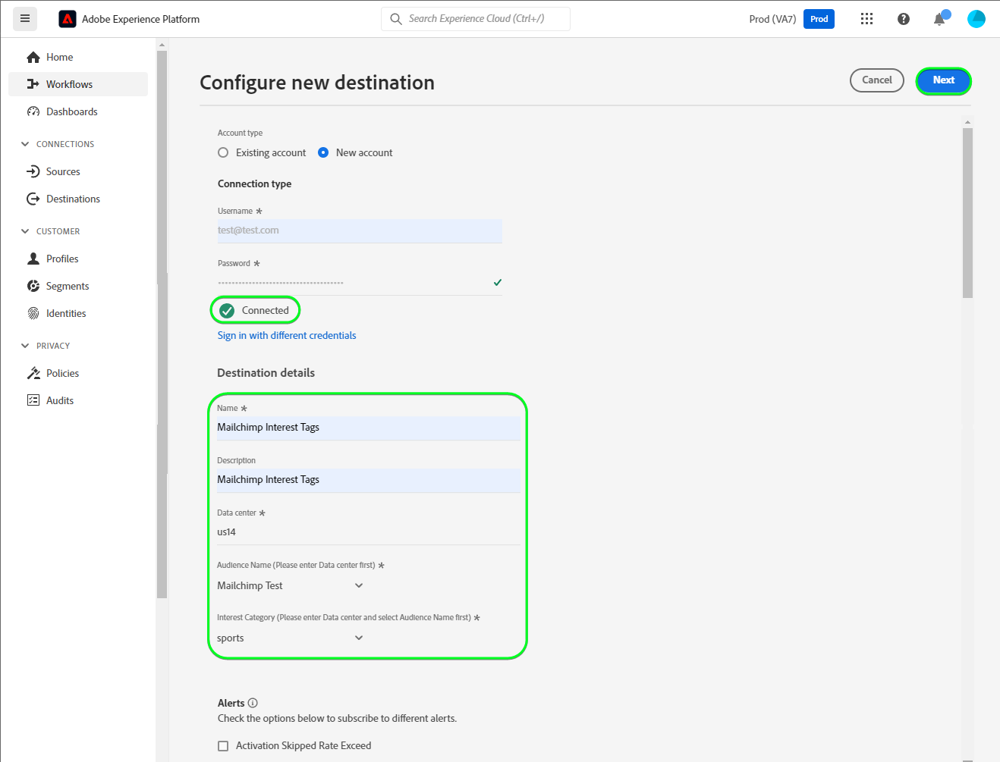

# [!DNL Mailchimp Interest Categories] 接続

[[!DNL Mailchimp]](https://mailchimp.com) は、企業が連絡先の管理や連絡に使用する、人気の高いマーケティングオートメーションプラットフォームおよび電子メールマーケティングサービスです *（顧客、顧客その他の利害関係人）* メーリングリストと電子メールマーケティングキャンペーンの使用 このコネクタを使用して、連絡先を興味と好みに基づいて並べ替えます。

[!DNL Mailchimp Interest Categories] uses [audiences](https://mailchimp.com/help/getting-started-audience/), [グループ](https://mailchimp.com/help/getting-started-with-groups/)、興味カテゴリ *（グループ名またはグループタイトルとも呼ばれます）。*. 各 [!DNL Mailchimp] group は、関心のあるカテゴリのリストです。 連絡先は、Web サイトのサインアップフォームを通じて 1 つ以上の興味カテゴリを購読する際に、興味カテゴリに関連付けられます。 オーディエンス内で、連絡先をグループに整理し、関心のあるカテゴリに関連付けることもできます。これらを使用して、セグメントを作成できます。 これらのセグメントを使用して、購読済みの連絡先にターゲットキャンペーン E メールをブロードキャストできます。

<!--
Compared to [!DNL Mailchimp Tags] which you would use for internal classification, [!DNL Mailchimp Interest Categories] is meant to manage subscriptions to topics of interest that your contacts might be interested in. *Note, Experience Platform also has a connection for [!DNL Mailchimp Tags], you can check it out on the [[!DNL Mailchimp Tags]](/help/destinations/catalog/email-marketing/mailchimp-tags.md) page.*
-->

この [!DNL Adobe Experience Platform] [宛先](/help/destinations/home.md) は [[!DNL Mailchimp batch subscribe or unsubscribe API]](https://mailchimp.com/developer/marketing/api/lists/batch-subscribe-or-unsubscribe/) 作成する API [興味カテゴリ](https://mailchimp.com/developer/marketing/api/interest-categories/) 次に、選択した各 Platform セグメントの連絡先を、対応する関心カテゴリに追加します。 以下が可能です。 **新規連絡先の追加** または **既存の情報を更新する [!DNL Mailchimp] 連絡先**&#x200B;を、 **目的のグループに追加または削除します。** 既存の [!DNL Mailchimp] オーディエンスに反映されます。 [!DNL Mailchimp Interest Groups] は、Platform で選択したセグメント名を、内の関心カテゴリとして使用します。 [!DNL Mailchimp].

## ユースケース {#use-cases}

[!DNL Mailchimp Interest Categories] 宛先を使用する方法とタイミングを理解しやすくするために、Adobe Experience Platform のお客様がこの宛先を使用して解決できるユースケースのサンプルを以下に示します。

### マーケティングキャンペーン用の連絡先へのメール送信 {#use-case-send-emails}

スポーツグッズの Web サイトの販売部門は、サッカーに興味を持つと自己識別した連絡先のリストに、電子メールベースのマーケティングキャンペーンを放送したいと考えています。 連絡先のリストは、Web サイトの開発チームから受け取ったデータ書き出しでバッチとして分けられるので、トラッキングする必要があります。 チームが既存の [!DNL Mailchimp] オーディエンスを作成し、各Experience Platformの連絡先を追加するリストセグメントの作成を開始します。 これらのセグメントを [!DNL Mailchimp Interest Categories]選択したに存在しない連絡先がある場合は、 [!DNL Mailchimp] オーディエンス訪問者が、その連絡先が属するセグメント名のグループに追加されます。 既に [!DNL Mailchimp] オーディエンスまたはグループを選択した場合、その情報が更新されます。 データがに送信された後 [!DNL Mailchimp Interest Categories]を使用している場合、セールスチームはマーケティングキャンペーンの電子メールを選択し、 [!DNL Mailchimp] オーディエンス。

## 前提条件 {#prerequisites}

Experience Platformおよびで設定する必要がある前提条件については、以下の節を参照してください。 [!DNL Mailchimp] また、を使用する前に収集する必要がある情報に対して [!DNL Mailchimp Interest Categories] 宛先。

### Experience Platformの前提条件 {#prerequisites-in-experience-platform}

[!DNL Mailchimp Interest Categories] 宛先へのデータをアクティブ化する前に、[スキーマ](/help/xdm/schema/composition.md)、[データセット](https://experienceleague.adobe.com/docs/platform-learn/tutorials/data-ingestion/create-datasets-and-ingest-data.html?lang=ja)および[セグメント](https://experienceleague.adobe.com/docs/platform-learn/tutorials/segments/create-segments.html?lang=ja)を [!DNL Experience Platform] で作成する必要があります。

### の前提条件 [!DNL Mailchimp Interest Categories] 宛先 {#prerequisites-destination}

Platform からにデータを書き出すための次の前提条件に注意してください。 [!DNL Mailchimp] アカウント：

#### 次をお持ちの場合は、 [!DNL Mailchimp] アカウント {#prerequisites-account}

事前に [!DNL Mailchimp Interest Categories] 宛先の [!DNL Mailchimp] アカウント まだない場合は、 [[!DNL Mailchimp] 登録ページ](https://login.mailchimp.com/signup/) をクリックして、アカウントを登録および作成します。

#### 収集 [!DNL Mailchimp] API キー {#gather-credentials}

次が必要： [!DNL Mailchimp] **API キー** 認証するには [!DNL Mailchimp Interest Categories] に対する宛先 [!DNL Mailchimp] アカウント この **API キー** ～の役割を果たす **パスワード** いつ [宛先の認証](#authenticate).

次の条件を満たしていない場合、 **API キー**、アカウントにログインし、 [[!DNL Mailchimp] API キーを生成する](https://mailchimp.com/developer/marketing/guides/quick-start/#generate-your-api-key) ドキュメントを参照してください。

API キーの例は次のとおりです。 `0123456789abcdef0123456789abcde-us14`.

>[!IMPORTANT]
>
>この **API キー**&#x200B;生成後はアクセスできなくなるので、書き留めてください。

#### 特定 [!DNL Mailchimp] データセンター {#identify-data-center}

次に、 [!DNL Mailchimp] データセンター これをおこなうには、 [!DNL Mailchimp] アカウントに移動し、 **API キーの節** 」をクリックします。

値は、ブラウザーに表示される URL の最初の部分です。 URL が *https://`us14`.mailchimp.com/account/api/*&#x200B;を設定した場合、データセンターは `us14`.

また、フォームの API キーにも追加されます *key-dc*;(API キーが `0123456789abcdef0123456789abcde-us14`を設定した場合、データセンターは `us14`.

データセンターの価値を書き留める *(`us14` （この例では）*&#x200B;に値を指定しない場合、 [宛先の詳細を入力](#destination-details).

詳しいガイダンスが必要な場合は、 [[!DNL Mailchimp] 基本ドキュメント](https://mailchimp.com/developer/marketing/docs/fundamentals/#api-structure).

### ガードレール {#guardrails}

各 [!DNL Mailchimp] オーディエンスには、1 つのグループに最大 60 個のグループ名（または関心カテゴリ）を含めることができます。また、同じオーディエンス内の複数のグループをまたいで、複数のグループを含めることもできます。 参照： [!DNL Mailchimp] [グループ](https://mailchimp.com/help/getting-started-with-groups/) 必要な明確化を行うために この上限に達すると、 `400 BAD_REQUEST Cannot have more than 60 interests per list (Across all categories)` 次のエラー応答としてのメッセージ： [!DNL Mailchimp] API

さらに、 [!DNL Mailchimp] [レート制限](https://mailchimp.com/developer/marketing/docs/fundamentals/#api-limits) を参照してください。 [!DNL Mailchimp] API

## サポートされている ID {#supported-identities}

[!DNL Mailchimp] では、以下の表で説明する ID のアクティベーションをサポートしています。[ID](/help/identity-service/namespaces.md) についての詳細情報。

| ターゲット ID | 説明 | 注意点 |
|---|---|---|
| メール | 連絡先の電子メールアドレス | 必須 |

{style="table-layout:auto"}

## 書き出しのタイプと頻度 {#export-type-frequency}

宛先の書き出しのタイプと頻度について詳しくは、以下の表を参照してください。

| 項目 | タイプ | メモ |
---------|----------|---------|
| 書き出しタイプ | **[!UICONTROL プロファイルベース]** | <ul><li>セグメントのすべてのメンバーを、フィールドマッピングに従って、必要なスキーマフィールドと共に書き出します&#x200B;*（例：メールアドレス、電話番号、姓）*。</li><li> Platform で選択した各セグメントに対して、 [!DNL Mailchimp Interest Categories] セグメントのステータスが、Platform からのセグメントのステータスで更新されます。</li></ul> |
| 書き出し頻度 | **[!UICONTROL ストリーミング]** | ストリーミングの宛先は常に、API ベースの接続です。セグメントの評価に基づいてExperience Platformでプロファイルが更新されると、コネクタは更新を宛先プラットフォームに送信します。 [ストリーミングの宛先](/help/destinations/destination-types.md#streaming-destinations)の詳細についてはこちらを参照してください。 |

{style="table-layout:auto"}

## 宛先への接続 {#connect}

>[!IMPORTANT]
>
>宛先に接続するには、**[!UICONTROL 宛先の管理]** [アクセス制御権限](/help/access-control/home.md#permissions)が必要です。詳しくは、[アクセス制御の概要](/help/access-control/ui/overview.md)または製品管理者に問い合わせて、必要な権限を取得してください。

この宛先に接続するには、[宛先設定のチュートリアル](../../ui/connect-destination.md)の手順に従ってください。宛先の設定ワークフローで、以下の 2 つのセクションにリストされているフィールドに入力します。

内 **[!UICONTROL 宛先]** > **[!UICONTROL カタログ]**、を検索します。 [!DNL Mailchimp Interest Categories]. または、 **[!UICONTROL 電子メールマーケティング]** カテゴリ。

### 宛先に対する認証 {#authenticate}

宛先を認証するには、以下の必須フィールドに入力し、を選択します。 **[!UICONTROL 宛先に接続]**.

| [!DNL Mailchimp] 宛先 | [!DNL Mailchimp] |
| --- | --- |
| **[!UICONTROL ユーザー名]** | お使いの [!DNL Salesforce Marketing Cloud] ドメインプレフィックス。  例えば、ドメインが  *`mcq4jrssqdlyc4lph19nnqgzzs84`.login.exacttarget.com*,  次を指定する必要があります： `mcq4jrssqdlyc4lph19nnqgzzs84` ユーザー名の値。 |
| **[!UICONTROL パスワード]** | お使いの [!DNL Mailchimp] **API キー**&#x200B;君が書いた [収集 [!DNL Mailchimp] 資格情報](#gather-credentials) 」セクションに入力します。  API キーは、 `{KEY}-{DC}`( `{KEY}` 部分は、 [[!DNL Mailchimp] API キー](#gather-credentials) セクションおよび `{DC}` 部分は [[!DNL Mailchimp] データセンター](#identify-data-center).  次のいずれかを指定できます。 `{KEY}` の一部またはフォーム全体。  例えば、API キーが  *`0123456789abcdef0123456789abcde-us14`*,  次のいずれかを指定できます。*`0123456789abcdef0123456789abcde`*または&#x200B;*`0123456789abcdef0123456789abcde-us14`*を値として使用します。 |

{style="table-layout:auto"}

指定した詳細が有効な場合、UI で&#x200B;**[!UICONTROL 接続済み]**&#x200B;ステータスに緑色のチェックマークが付きます。その後、次の手順に進むことができます。

### 宛先の詳細を入力 {#destination-details}

宛先の詳細を設定するには、以下の必須フィールドとオプションフィールドに入力します。UI のフィールドの横のアスタリスクは、そのフィールドが必須であることを示します。

| フィールド | 説明 |
| --- | --- |
| **[!UICONTROL 名前]** | 将来この宛先を認識するための名前。 |
| **[!UICONTROL 説明]** | 今後この宛先を識別するのに役立つ説明。 |
| **[!UICONTROL データセンター]** | お使いの [!DNL Mailchimp] アカウント `data center`. 詳しくは、 [特定 [!DNL Mailchimp] データセンター](#identify-data-center) 」の節を参照してください。 |
| **[!UICONTROL オーディエンス名（最初にデータセンターを選択してください）]** | 選択した後、 **[!UICONTROL データセンター]**&#x200B;の場合、このドロップダウンには、 [!DNL Mailchimp] アカウント Platform のデータで更新するオーディエンスを選択します。 |
| **[!UICONTROL 関心のあるカテゴリ（最初にデータセンターとオーディエンス名を選択してください）]** | 選択した後、 **[!UICONTROL オーディエンス名]**&#x200B;の場合、このドロップダウンには、 [!DNL Mailchimp] アカウント Platform のデータで更新するカテゴリ名を選択します。 |

{style="table-layout:auto"}

>[!TIP]
>
> API キーが **[!UICONTROL パスワード]** フィールドまたは **[!UICONTROL データセンター]** の値が正しくない場合、UI に [!DNL Mailchimp] API エラー応答： *`No options are available. Please verify the values selected for the following dependent fields: dataCenter`* 以下に示すように。 この場合、 **[!UICONTROL オーディエンス名（最初にデータセンターを選択してください）]** フィールドに入力します。 このエラーを修正するには、正しい値を指定します。

### アラートの有効化 {#enable-alerts}

アラートを有効にすると、宛先へのデータフローのステータスに関する通知を受け取ることができます。リストからアラートを選択して、データフローのステータスに関する通知を受け取るよう登録します。アラートについて詳しくは、[UI を使用した宛先アラートの購読](../../ui/alerts.md)についてのガイドを参照してください。

宛先接続の詳細の入力を終えたら「**[!UICONTROL 次へ]**」を選択します。

## この宛先に対してセグメントをアクティブ化 {#activate}

>[!IMPORTANT]
>
>データをアクティブ化するには、**[!UICONTROL 宛先の管理]**、**[!UICONTROL 宛先のアクティブ化]**、**[!UICONTROL プロファイルの表示]**&#x200B;および&#x200B;**[!UICONTROL セグメントの表示]**[に対するアクセス制御権限](/help/access-control/home.md#permissions)が必要です。詳しくは、[アクセス制御の概要](/help/access-control/ui/overview.md)または製品管理者に問い合わせて、必要な権限を取得してください。

この宛先にオーディエンスセグメントをアクティベートする手順は、[ストリーミングセグメントの書き出し宛先へのプロファイルとセグメントのアクティベート](/help/destinations/ui/activate-segment-streaming-destinations.md)を参照してください。

### マッピングの考慮事項と例 {#mapping-considerations-example}

Adobe Experience Platformからにオーディエンスデータを正しく送信するには [!DNL Mailchimp Interest Categories] の宛先の場合は、フィールドマッピングの手順を実行する必要があります。 マッピングは、Platform アカウント内の Experience Data Model（XDM）スキーマフィールドと、ターゲット宛先から対応する同等のスキーマフィールドとの間にリンクを作成して構成されます。 

XDM フィールドを [!DNL Mailchimp Interest Categories] 宛先フィールドには、次の手順に従います。

1. **[!UICONTROL マッピング]**&#x200B;手順で、「**[!UICONTROL 新しいマッピングを追加]**」を選択します。これで、新しいマッピング行が画面に表示されます。
1. 内 **[!UICONTROL ソースフィールドを選択]** ウィンドウで、 **[!UICONTROL 属性を選択]** カテゴリを選択して XDM 属性を選択するか、 **[!UICONTROL ID 名前空間を選択]** ID を選択します。
1. 内 **[!UICONTROL ターゲットフィールドを選択]** ウィンドウで、 **[!UICONTROL ID 名前空間を選択]** ID を選択するか、 **[!UICONTROL 属性を選択]** カテゴリを選択し、 [!DNL Mailchimp] API *選択したに追加したカスタム属性 [!DNL Mailchimp] オーディエンスは、ターゲットフィールドとして選択することもできます。*

   XDM プロファイルスキーマと [!DNL Mailchimp Interest Categories] は次のとおりです。 |ソースフィールド |ターゲットフィールド |メモ | | — | — | — | |`IdentityMap: Email`|`Identity: email`|必須：はい | |`xdm: person.name.firstName`|`Attribute: FNAME`| | |`xdm: person.name.lastName`|`Attribute: LNAME`| | |`xdm: person.birthDayAndMonth`|`Attribute: BIRTHDAY`| |

   また、 `ADDRESS` は、 `merge field` の [!DNL Mailchimp] オーディエンス。 この [[!DNL Mailchimp] ドキュメント](https://mailchimp.com/developer/marketing/docs/merge-fields/) 必要なキーを次のように定義します。 `addr1`, `city`, `state`、および `zip`、およびオプションのキー `addr2` および `country`. これらのフィールドの値は、文字列である必要があります。 次のいずれかの `ADDRESS` フィールドマッピングが存在する場合、宛先は `ADDRESS` オブジェクトを [!DNL Mailchimp] 更新用の API。 任意 `ADDRESS` マッピングされていないフィールドの値はデフォルトではに設定されます `NULL` デフォルトの国以外は `US`.

   に使用できるマッピング `ADDRESS` フィールドは次のとおりです。

   | ソースフィールド | ターゲットフィールド |
   | --- | --- |
   | `xdm: workAddress.street1` | `Attribute: ADDRESS.addr1` |
   | `xdm: workAddress.street2` | `Attribute: ADDRESS.addr2` |
   | `xdm: workAddress.city` | `Attribute: ADDRESS.city` |
   | `xdm: workAddress.state` | `Attribute: ADDRESS.state` |
   | `xdm: workAddress.postalCode` | `Attribute: ADDRESS.zip` |
   | `xdm: workAddress.country` | `Attribute: ADDRESS.country` |

   例えば、 `country` 連絡先の既存の住所フィールド `addr1`, `city`, `state`、および `zip` の値 `132, My Street, Kingston`, `New York`, `New York` および `12401`. 次の手順で `country` 既存の値を変更と共に渡す必要があります *（存在する場合）* 国の新しい価値を したがって、データセットの値は次のようになります。 `132, My Street, Kingston`, `New York`, `New York`, `12401`、および `US`. 繰り返すには、 `country` また、 `addr1`, `city`, `state`、および `zip` 次の条件で上書きされます。 `NULL`.

   完了したマッピングの例を次に示します。
   

宛先接続のマッピングの指定が完了したら、「 」を選択します。 **[!UICONTROL 次へ]**.

## データの書き出しを検証する {#exported-data}

宛先が正しく設定されていることを検証するには、次の手順に従います。

* にログインします。 [[!DNL Mailchimp]](https://login.mailchimp.com/) アカウント 次に、 **[!DNL Audience]** ページ。 次に、 **[!DNL Manage Contacts]** メニューと選択 **[!DNL Groups]**.

* 「グループ」を選択し、選択したセグメントが Platform のセグメント名を持つカテゴリとして作成されているかどうかを確認します。カテゴリの後に、自動生成されたサフィックスが付く場合があります。
   * この宛先では、選択したセグメントの名前を使用して、 [[!DNL Mailchimp] 興味カテゴリ API を追加](https://mailchimp.com/developer/marketing/api/interest-categories/add-interest-category/). 新しい宛先を作成し、同じセグメントを再度アクティブ化した場合、 [!DNL Mailchimp] 既存のセグメントと新しいセグメントを区別するためのサフィックスが追加されます。
* グループに E メールが存在しなかった連絡先は、新しく作成されたカテゴリに追加されます。
* グループ内に既に存在する連絡先の場合、属性フィールドのデータが更新され、新しく作成したカテゴリに追加された連絡先が更新されます。

## データの使用とガバナンス {#data-usage-governance}

[!DNL Adobe Experience Platform] のすべての宛先は、データを処理する際のデータ使用ポリシーに準拠しています。[!DNL Adobe Experience Platform] がどのようにデータガバナンスを実施するかについて詳しくは、[データガバナンスの概要](/help/data-governance/home.md)を参照してください。

## エラーとトラブルシューティング {#errors-and-troubleshooting}

### 次の場合にエラーが発生しました： [!DNL Mailchimp] API キーまたはデータセンターの値が正しくありません {#incorrect-credentials-error}

API キーが **[!UICONTROL パスワード]** フィールドまたは **[!UICONTROL データセンター]** の値が正しくない場合、UI に [!DNL Mailchimp] API エラー応答： *`No options are available. Please verify the values selected for the following dependent fields: dataCenter`* 以下に示すように。 この場合、 **[!UICONTROL オーディエンス名（最初にデータセンターを選択してください）]** フィールドに入力します。

このエラーを修正して次の手順に進むには、正しい値を指定する必要があります。 詳しくは、 [特定 [!DNL Mailchimp] データセンター](#identify-data-center) および
[収集 [!DNL Mailchimp] API キー](#gather-credentials) セクションを参照してください。

### 次の場合にエラーが発生しました： [!DNL Mailchimp] グループ名の制限を超えています {#group-name-limits-error}

宛先を作成する際に、次のエラーメッセージが表示される場合があります。 *`Cannot have more than 60 interests per list (Across all categories)`* または *`400 BAD_REQUEST`*. これは、1 つのグループで 60 個のグループ名（または関心カテゴリ）を超えた場合、または同じオーディエンス制限内の複数のグループにわたって、 [guardrail](#guardrails) 」セクションに入力します。 このエラーを修正するには、 [!DNL Mailchimp].

### [!DNL Mailchimp] ステータスおよびエラーコード

詳しくは、 [[!DNL Mailchimp] エラーページ](https://mailchimp.com/developer/marketing/docs/errors/) を参照してください。

## その他のリソース {#additional-resources}

[!DNL Mailchimp] ドキュメントからのその他の役に立つ情報は次のとおりです。
* [ [!DNL Mailchimp] 入門](https://mailchimp.com/help/getting-started-with-mailchimp/)
* [Audiences の概要](https://mailchimp.com/help/getting-started-audience/)
* [オーディエンスの作成](https://mailchimp.com/help/create-audience/)
* [グループの概要](https://mailchimp.com/help/getting-started-with-groups/)
* [新しいオーディエンスグループを作成](https://mailchimp.com/help/create-new-audience-group/)
* [興味カテゴリ](https://mailchimp.com/developer/marketing/api/interest-categories/)
* [マーケティング API](https://mailchimp.com/developer/marketing/api/)
