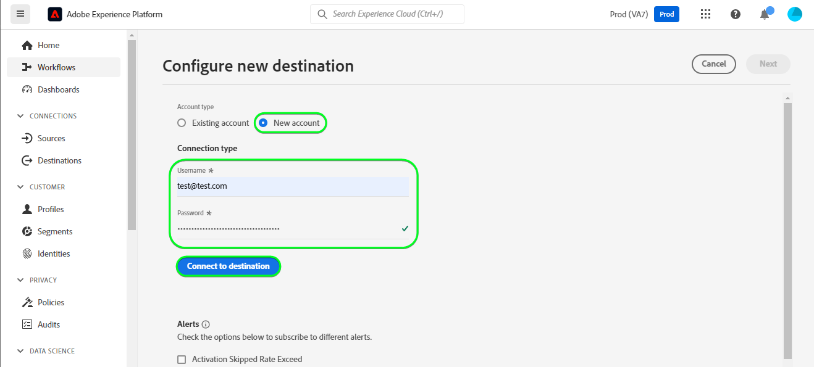
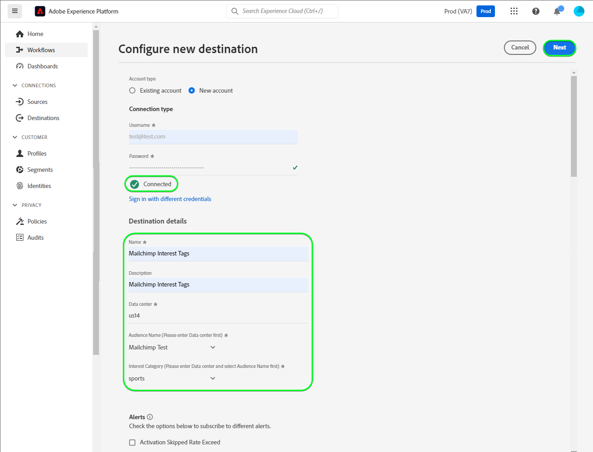
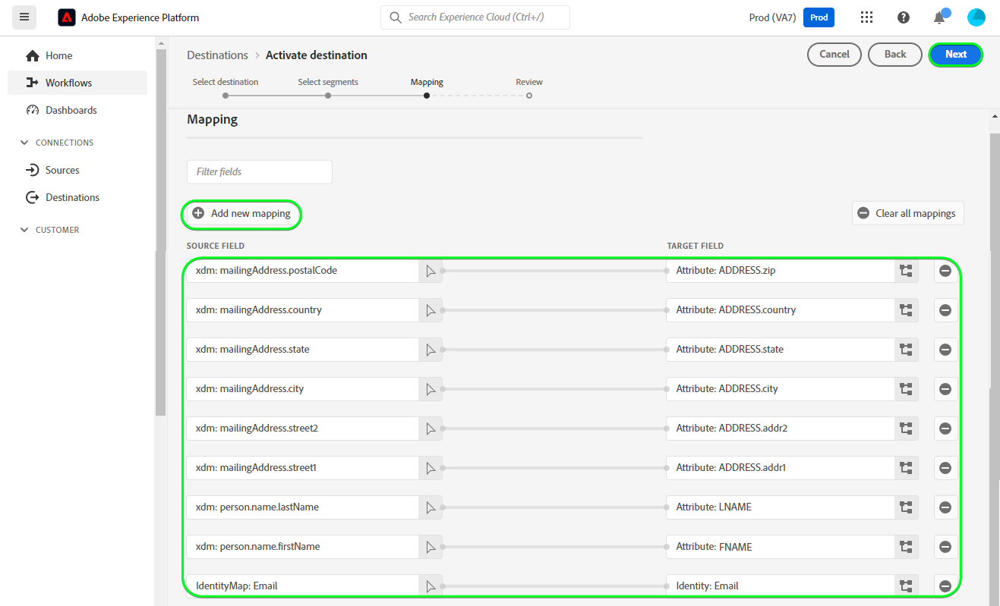
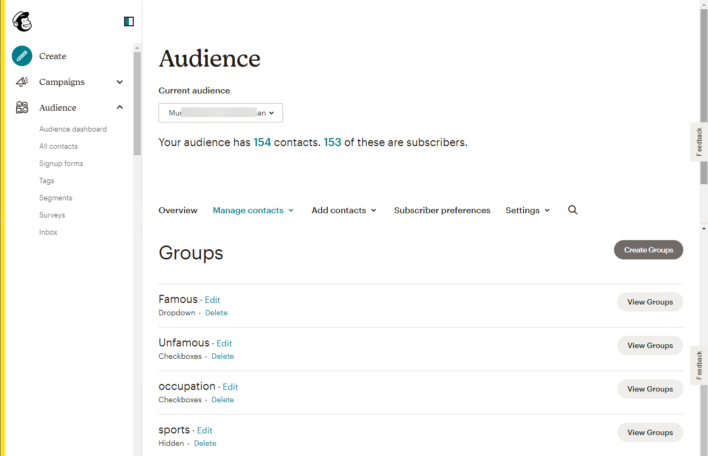
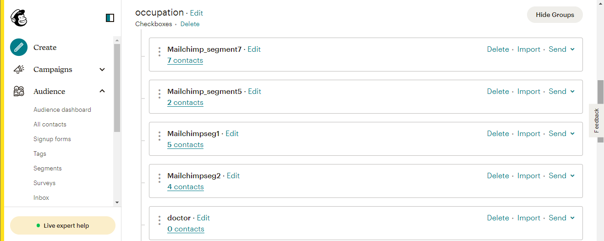
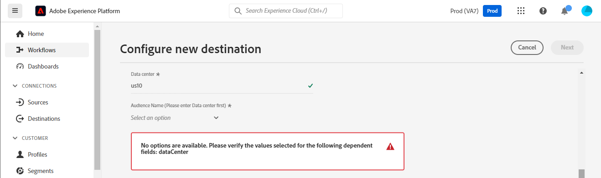

# [!DNL Mailchimp Interest Categories] 接続

[[!DNL Mailchimp]](https://mailchimp.com)は、メーリングリストとメールマーケティングキャンペーンを使用して&#x200B;*（顧客、顧客、その他の興味のある関係者）*&#x200B;の連絡先を管理し、会話するために企業が使用する人気のマーケティングオートメーションプラットフォームおよびメールマーケティングサービスです。 このコネクタを使用すると、興味や好みに基づいて連絡先を並べ替えることができます。

[!DNL Mailchimp Interest Categories]では、[&#x200B; オーディエンス &#x200B;](https://mailchimp.com/help/getting-started-audience/)、[&#x200B; グループ &#x200B;](https://mailchimp.com/help/getting-started-with-groups/)、興味のあるカテゴリ *（グループ名またはグループタイトルとも呼ばれます）*&#x200B;を使用しています。 各[!DNL Mailchimp] グループは、興味のあるカテゴリのリストです。 連絡先は、web サイトのサインアップフォームを通じて1つ以上の関心カテゴリに登録すると、関心カテゴリに関連付けられます。 オーディエンス内で、連絡先をグループに整理して興味のあるカテゴリに関連付けることもできます。これらのカテゴリを使用してセグメントを作成することもできます。 これらのオーディエンスを使用して、登録済みの連絡先にターゲットキャンペーンメールをブロードキャストできます。

<!--
Compared to [!DNL Mailchimp Tags] which you would use for internal classification, [!DNL Mailchimp Interest Categories] is meant to manage subscriptions to topics of interest that your contacts might be interested in. *Note, Experience Platform also has a connection for [!DNL Mailchimp Tags], you can check it out on the [[!DNL Mailchimp Tags]](/help/destinations/catalog/email-marketing/mailchimp-tags.md) page.*
-->

この[!DNL Adobe Experience Platform] [宛先](/help/destinations/home.md)は、[[!DNL Mailchimp batch subscribe or unsubscribe API]](https://mailchimp.com/developer/marketing/api/lists/batch-subscribe-or-unsubscribe/) APIを使用して[関心カテゴリ &#x200B;](https://mailchimp.com/developer/marketing/api/interest-categories/)を作成し、選択した各Experience Platform オーディエンスの連絡先を対応する関心カテゴリに追加します。 **新しい連絡先を追加**&#x200B;または&#x200B;**既存の[!DNL Mailchimp]連絡先**&#x200B;の情報を更新し、新しいセグメント内でアクティブ化した後、既存の&#x200B;**オーディエンス内の目的のグループ**&#x200B;から[!DNL Mailchimp]連絡先を追加または削除できます。 [!DNL Mailchimp Interest Groups]は、Experience Platformから選択したオーディエンス名を[!DNL Mailchimp]内の関心カテゴリとして使用します。

## ユースケース {#use-cases}

[!DNL Mailchimp Interest Categories]宛先を使用する方法とタイミングをより理解しやすくするために、[!DNL Adobe Experience Platform]のお客様がこの宛先を使用して解決できる使用例を次に示します。

### マーケティング施策のために連絡先にメールを送信 {#use-case-send-emails}

スポーツ用品web サイトの営業部門は、サッカーに興味を持っていると自ら判断した連絡先のリストに、メールによるマーケティングキャンペーンを配信したいと考えています。 連絡先のリストは、web サイトの開発チームから受け取ったデータ書き出しでバッチとして分類されるので、追跡する必要があります。 既存の[!DNL Mailchimp]人のオーディエンスを特定し、各リストの連絡先を追加するExperience Platformオーディエンスの構築を開始します。 これらのオーディエンスを[!DNL Mailchimp Interest Categories]に送信した後、選択した[!DNL Mailchimp] オーディエンスに連絡先が存在しない場合、連絡先が属するオーディエンス名を持つグループに追加されます。 [!DNL Mailchimp] オーディエンスまたはグループに既に連絡先が存在する場合、その情報が更新されます。 データが[!DNL Mailchimp Interest Categories]に送信されると、セールス チームは、[!DNL Mailchimp] オーディエンス内のサッカーの興味グループにマーケティングキャンペーンのメールを選択して送信できます。

## 前提条件 {#prerequisites}

Experience Platformおよび[!DNL Mailchimp]で設定する必要がある前提条件と、[!DNL Mailchimp Interest Categories]の宛先を操作する前に収集する必要がある情報については、以下の節を参照してください。

### Experience Platformの前提条件 {#prerequisites-in-experience-platform}

[!DNL Mailchimp Interest Categories] 宛先へのデータをアクティブ化する前に、[スキーマ](/help/xdm/schema/composition.md)、[データセット](https://experienceleague.adobe.com/docs/platform-learn/tutorials/data-ingestion/create-datasets-and-ingest-data.html)および[セグメント](https://experienceleague.adobe.com/docs/platform-learn/tutorials/segments/create-segments.html)を [!DNL Experience Platform] で作成する必要があります。

### [!DNL Mailchimp Interest Categories]宛先の前提条件 {#prerequisites-destination}

Experience Platformから[!DNL Mailchimp] アカウントにデータをエクスポートするには、次の前提条件に注意してください。

#### [!DNL Mailchimp] アカウントが必要です {#prerequisites-account}

[!DNL Mailchimp Interest Categories]宛先を作成する前に、まず[!DNL Mailchimp] アカウントがあることを確認する必要があります。 まだアカウントをお持ちでない場合は、[[!DNL Mailchimp] 登録ページ &#x200B;](https://login.mailchimp.com/signup/)にアクセスして、アカウントを登録および作成してください。

#### [!DNL Mailchimp] API キーを収集 {#gather-credentials}

[!DNL Mailchimp] アカウントに対して&#x200B;**宛先を認証するには、** [!DNL Mailchimp Interest Categories]API キー[!DNL Mailchimp]が必要です。 宛先&#x200B;**を**&#x200B;認証すると、**API キー**&#x200B;は[&#x200B; パスワード &#x200B;](#authenticate)として機能します。

**API キー**&#x200B;をお持ちでない場合は、アカウントにサインインし、[[!DNL Mailchimp] API キーの生成](https://mailchimp.com/developer/marketing/guides/quick-start/#generate-your-api-key) ドキュメントを参照して作成してください。

API キーの例は`0123456789abcdef0123456789abcde-us14`です。

>[!IMPORTANT]
>
>**API キー**&#x200B;を生成した場合は、生成後にアクセスできないため、書き留めます。

#### [!DNL Mailchimp] データセンターの特定 {#identify-data-center}

次に、[!DNL Mailchimp] データセンターを特定する必要があります。 これを行うには、[!DNL Mailchimp] アカウントにログインし、アカウントの&#x200B;**API キーセクション**&#x200B;に移動します。

値は、ブラウザーに表示されるURLの最初の部分です。 URLが&#x200B;*https://`us14`.mailchimp.com/account/api/*&#x200B;の場合、データセンターは`us14`です。

また、*key-dc*&#x200B;という形式でAPI キーに追加されます。API キーが`0123456789abcdef0123456789abcde-us14`の場合、データセンターは`us14`になります。

データ センターの値&#x200B;*（`us14`この例では）*&#x200B;を書き留めます。この値は、[宛先の詳細を入力](#destination-details)するときに必要です。

詳細なガイダンスが必要な場合は、[[!DNL Mailchimp] 基本ドキュメント &#x200B;](https://mailchimp.com/developer/marketing/docs/fundamentals/#api-structure)を参照してください。

### ガードレール {#guardrails}

[!DNL Mailchimp] オーディエンスごとに、1つのグループまたは同じオーディエンス内の複数のグループに対して、最大60個のグループ名（または興味のあるカテゴリ）を含めることができます。 必要な説明については、[!DNL Mailchimp] [&#x200B; グループ &#x200B;](https://mailchimp.com/help/getting-started-with-groups/)を参照してください。 この制限に達すると、`400 BAD_REQUEST Cannot have more than 60 interests per list (Across all categories)` APIからのエラー応答として[!DNL Mailchimp] メッセージが表示されます。

さらに、[!DNL Mailchimp] APIによって課される制限について詳しくは、[&#x200B; &#x200B;](https://mailchimp.com/developer/marketing/docs/fundamentals/#api-limits) レート制限[!DNL Mailchimp]を参照してください。

## サポートされている ID {#supported-identities}

[!DNL Mailchimp]は、次の表に示すIDのアクティブ化をサポートしています。 [ID](/help/identity-service/features/namespaces.md) についての詳細情報。

| ターゲット ID | 説明 | 注意点 |
|---|---|---|
| メール | 連絡先のメールアドレス | 必須 |

{style="table-layout:auto"}

## サポートされるオーディエンス {#supported-audiences}

この節では、この宛先に書き出すことができるオーディエンスのタイプについて説明します。 以下の2つの表は、このコネクタがサポートするオーディエンスを示しています。オーディエンスの由来&#x200B;_と_ オーディエンスに含まれるプロファイルタイプ _:_

| オーディエンスの由来 | サポートあり | 説明 |
|---------|----------|----------|
| [!DNL Segmentation Service] | ○ | Experience Platform [&#x200B; セグメント化サービス &#x200B;](../../../segmentation/home.md)を通じて生成されたオーディエンス。 |
| その他すべてのオーディエンスの生成元 | × | このカテゴリには、[!DNL Segmentation Service]を通じて生成されたオーディエンス以外のすべてのオーディエンスのオリジンが含まれます。 [様々なオーディエンスの起源](/help/segmentation/ui/audience-portal.md#customize)について読みます。 次に例を示します。 <ul><li> カスタムアップロードオーディエンス [がCSV ファイルからExperience Platformに](../../../segmentation/ui/audience-portal.md#import-audience)をインポートしました。</li><li> 類似オーディエンス， </li><li> 連合オーディエンス， </li><li> [!DNL Adobe Journey Optimizer]などの他のExperience Platform アプリで生成されたオーディエンス </li><li> その他。 </li></ul> |

{style="table-layout:auto"}

オーディエンスのデータタイプ別にサポートされるオーディエンス：

| オーディエンスのデータタイプ | サポートあり | 説明 | ユースケース |
|--------------------|-----------|-------------|-----------|
| [人物オーディエンス &#x200B;](/help/segmentation/types/people-audiences.md) | ○ | 顧客プロファイルにもとづいて、マーケティング施策の特定のグループをターゲットにすることができます。 | 買い物客やカートの放棄が多い |
| [&#x200B; アカウントオーディエンス &#x200B;](/help/segmentation/types/account-audiences.md) | × | アカウントベースドマーケティング戦略のために、特定の組織内の個人をターゲットにします。 | B2B マーケティング |
| [見込みオーディエンス &#x200B;](/help/segmentation/types/prospect-audiences.md) | × | まだ顧客ではないが、ターゲットオーディエンスと特徴を共有する個人をターゲットにします。 | サードパーティデータによる見込み顧客の開拓 |
| [&#x200B; データセットの書き出し](/help/catalog/datasets/overview.md) | × | [!DNL Adobe Experience Platform] データ レイクに保存されている構造化データのコレクション。 | レポート，データサイエンスワークフロー |

{style="table-layout:auto"}

## 書き出しのタイプと頻度 {#export-type-frequency}

宛先の書き出しのタイプと頻度について詳しくは、以下の表を参照してください。

| 項目 | タイプ | メモ |
|---------|----------|---------|
| 書き出しタイプ | **[!UICONTROL Profile-based]** | <ul><li>セグメントのすべてのメンバーを、フィールドマッピングに従って、必要なスキーマフィールドと共に書き出します&#x200B;*（例：メールアドレス、電話番号、姓）*。</li><li> Experience Platformで選択した各オーディエンスについて、対応する[!DNL Mailchimp Interest Categories] セグメントステータスが、Experience Platformからオーディエンスステータスで更新されます。</li></ul> |
| 書き出し頻度 | **[!UICONTROL Streaming]** | ストリーミングの宛先は常に、API ベースの接続です。オーディエンス評価に基づいてExperience Platformでプロファイルが更新されると、コネクターは更新をダウンストリームの宛先プラットフォームに送信します。 詳しくは、[ストリーミングの宛先](/help/destinations/destination-types.md#streaming-destinations)を参照してください。 |

{style="table-layout:auto"}

## 宛先への接続 {#connect}

>[!IMPORTANT]
>
>宛先に接続するには、**[!UICONTROL View Destinations]**&#x200B;および&#x200B;**[!UICONTROL Manage Destinations]** [&#x200B; アクセス制御権限](/help/access-control/home.md#permissions)が必要です。 詳しくは、[アクセス制御の概要](/help/access-control/ui/overview.md)または製品管理者に問い合わせて、必要な権限を取得してください。

この宛先に接続するには、[宛先設定のチュートリアル](../../ui/connect-destination.md)の手順に従ってください。宛先の設定ワークフローで、以下の 2 つのセクションにリストされているフィールドに入力します。

**[!UICONTROL Destinations]** > **[!UICONTROL Catalog]**&#x200B;内で、[!DNL Mailchimp Interest Categories]を検索します。 または、**[!UICONTROL Email marketing]** カテゴリの下に配置することもできます。

### 宛先に対する認証 {#authenticate}

宛先に対して認証を行うには、以下の必須フィールドに入力し、**[!UICONTROL Connect to destination]**&#x200B;を選択します。

| フィールド | 説明 |
| --- | --- |
| **[!UICONTROL Username]** | あなたの[!DNL Mailchimp Interest Categories] ユーザー名。 |
| **[!UICONTROL Password]** | [!DNL Mailchimp]収集&#x200B;**資格情報** セクションに書き留めた[&#x200B;  [!DNL Mailchimp] API キー](#gather-credentials)。 お使いのAPI キーは`{KEY}-{DC}`の形式になります。ここでは、`{KEY}`部分は[[!DNL Mailchimp] API キー](#gather-credentials) セクションに記載されている値を表し、`{DC}`部分は[[!DNL Mailchimp]  データセンター](#identify-data-center)を表します。  `{KEY}`部分またはフォーム全体を指定できます。 例えば、API キーが&#x200B; *`0123456789abcdef0123456789abcde-us14`*、 の場合、*`0123456789abcdef0123456789abcde`*または&#x200B;*`0123456789abcdef0123456789abcde-us14`*のいずれかを値として指定できます。 |

{style="table-layout:auto"}

認証方法を示す

指定された詳細が有効な場合、UIには緑色のチェックマークが付いた&#x200B;**[!UICONTROL Connected]** ステータスが表示されます。 その後、次の手順に進むことができます。

### 宛先の詳細を入力 {#destination-details}

宛先の詳細を設定するには、以下の必須フィールドとオプションフィールドに入力します。UI のフィールドの横のアスタリスクは、そのフィールドが必須であることを示します。

宛先の詳細を示す

| フィールド | 説明 |
| --- | --- |
| **[!UICONTROL Name]** | 将来この目的地を認識する名前。 |
| **[!UICONTROL Description]** | 今後この宛先を特定するのに役立つ説明です。 |
| **[!UICONTROL Data center]** | お客様の[!DNL Mailchimp] アカウント `data center` ガイダンスについては、[Identify [!DNL Mailchimp] data center](#identify-data-center) セクションを参照してください。 |
| **[!UICONTROL Audience Name (Please select Data center first)]** | **[!UICONTROL Data center]**&#x200B;を選択すると、このドロップダウンに[!DNL Mailchimp] アカウントのオーディエンス名が自動的に入力されます。 Experience Platformのデータで更新するオーディエンスを選択します。 |
| **[!UICONTROL Interest Category (Please select Data center and Audience Name first)]** | **[!UICONTROL Audience Name]**&#x200B;を選択すると、このドロップダウンには、[!DNL Mailchimp] アカウントの興味グループ カテゴリ名が自動的に入力されます。 Experience Platformのデータで更新するカテゴリ名を選択します。 |

{style="table-layout:auto"}

>[!TIP]
>
> **[!UICONTROL Password]** フィールドまたは&#x200B;**[!UICONTROL Data center]**&#x200B;値で指定したAPI キーが正しくない場合、UIには[!DNL Mailchimp] API エラー応答&#x200B;*`No options are available. Please verify the values selected for the following dependent fields: dataCenter`*&#x200B;が次のように表示されます。 この場合、**[!UICONTROL Audience Name (Please select Data center first)]** フィールドから値を選択できません。 このエラーを修正するには、正しい値を指定します。

### アラートの有効化 {#enable-alerts}

アラートを有効にすると、宛先へのデータフローのステータスに関する通知を受け取ることができます。リストからアラートを選択して、データフローのステータスに関する通知を受け取るよう登録します。アラートについて詳しくは、[UI を使用した宛先アラートの購読](../../ui/alerts.md)についてのガイドを参照してください。

宛先接続の詳細の提供が完了したら、**[!UICONTROL Next]**&#x200B;を選択します。

## この宛先に対してオーディエンスをアクティブ化 {#activate}

>[!IMPORTANT]
>
>* データをアクティブ化するには、**[!UICONTROL View Destinations]**、**[!UICONTROL Activate Destinations]**、**[!UICONTROL View Profiles]**&#x200B;および&#x200B;**[!UICONTROL View Segments]** [&#x200B; アクセス制御権限](/help/access-control/home.md#permissions)が必要です。 [アクセス制御の概要](/help/access-control/ui/overview.md)を参照するか、製品管理者に問い合わせて必要な権限を取得してください。
>* *ID*&#x200B;をエクスポートするには、**[!UICONTROL View Identity Graph]** [&#x200B; アクセス制御権限](/help/access-control/home.md#permissions)が必要です。  {width="100" zoomable="yes"}

この宛先にオーディエンスをアクティベートする手順は、[ストリーミングオーディエンスの書き出し宛先へのプロファイルとオーディエンスのアクティベート](/help/destinations/ui/activate-segment-streaming-destinations.md)を参照してください。

### マッピングの考慮事項と例 {#mapping-considerations-example}

オーディエンスデータを[!DNL Adobe Experience Platform]から[!DNL Mailchimp Interest Categories]宛先に正しく送信するには、フィールドマッピング手順を実行する必要があります。 マッピングでは、Experience Platform アカウントのExperience Data Model （XDM）スキーマフィールドと、ターゲット先の対応するスキーマフィールドとの間にリンクを作成します。

XDM フィールドを[!DNL Mailchimp Interest Categories]宛先フィールドに正しくマッピングするには、次の手順に従います。

1. **[!UICONTROL Mapping]** ステップで、**[!UICONTROL Add new mapping]**&#x200B;を選択します。 新しいマッピング行が画面に表示されるようになりました。
1. **[!UICONTROL Select source field]** ウィンドウで、**[!UICONTROL Select attributes]** カテゴリを選択してXDM属性を選択するか、**[!UICONTROL Select identity namespace]**&#x200B;を選択してIDを選択します。
1. **[!UICONTROL Select target field]** ウィンドウで、**[!UICONTROL Select identity namespace]**&#x200B;を選択してIDを選択するか、**[!UICONTROL Select attributes]** カテゴリを選択し、[!DNL Mailchimp] APIから入力された属性のリストから選択します。 *選択した[!DNL Mailchimp] オーディエンスに追加したカスタム属性は、ターゲットフィールドとして選択することもできます。*

   XDM プロファイルスキーマと[!DNL Mailchimp Interest Categories]の間で使用できるマッピングは次のとおりです。

   | ソースフィールド | ターゲットフィールド | メモ |
   | --- | --- | --- |
   | `IdentityMap: Email` | `Identity: email` | 必須：はい |
   | `xdm: person.name.firstName` | `Attribute: FNAME` | |
   | `xdm: person.name.lastName` | `Attribute: LNAME` | |
   | `xdm: person.birthDayAndMonth` | `Attribute: BIRTHDAY` | |

   さらに、`ADDRESS`は、`merge field` オーディエンス内の[!DNL Mailchimp]として知られる特別なターゲットフィールドです。 [[!DNL Mailchimp]  ドキュメント &#x200B;](https://mailchimp.com/developer/marketing/docs/merge-fields/)は、必要なキーを`addr1`、`city`、`state`、`zip`、およびオプションのキー`addr2`および`country`と定義しています。 これらのフィールドの値は文字列である必要があります。 `ADDRESS` フィールドマッピングのいずれかが存在する場合、宛先は`ADDRESS` オブジェクトを[!DNL Mailchimp] APIに渡して更新します。 マッピングされていない`ADDRESS` フィールドは、デフォルトが`NULL`の国を除き、デフォルト値が`US`になります。

   `ADDRESS` フィールドで使用できるマッピングは次のとおりです。

   | ソースフィールド | ターゲットフィールド |
   | --- | --- |
   | `xdm: workAddress.street1` | `Attribute: ADDRESS.addr1` |
   | `xdm: workAddress.street2` | `Attribute: ADDRESS.addr2` |
   | `xdm: workAddress.city` | `Attribute: ADDRESS.city` |
   | `xdm: workAddress.state` | `Attribute: ADDRESS.state` |
   | `xdm: workAddress.postalCode` | `Attribute: ADDRESS.zip` |
   | `xdm: workAddress.country` | `Attribute: ADDRESS.country` |

   例えば、連絡先の既存のアドレスフィールド `country`、`addr1`、`city`、`state`の値を`zip`、`132, My Street, Kingston`、`New York`、`New York`として`12401`の値を更新する場合などです。 `country`を更新するには、変更&#x200B;*（もしあれば）*&#x200B;と国の新しい値で既存の値を渡す必要があります。 そのため、データセットの値は`132, My Street, Kingston`、`New York`、`New York`、`12401`、`US`である必要があります。 繰り返しますが、`country`のみを渡し、`addr1`、`city`、`state`、`zip`の値を指定しない場合、`NULL`によって上書きされます。

   マッピングが完了した例を次に示します。
   

宛先接続のマッピングの提供が完了したら、**[!UICONTROL Next]**&#x200B;を選択します。

## データの書き出しを検証する {#exported-data}

宛先が正しく設定されていることを検証するには、次の手順に従います。

* [[!DNL Mailchimp]](https://login.mailchimp.com/) アカウントに移動します。 次に、**[!DNL Audience]** ページに移動します。 次に、**[!DNL Manage Contacts]** メニューを展開し、**[!DNL Groups]**&#x200B;を選択します。

オーディエンスグループページを示す

* 「グループ」を選択し、選択したオーディエンスがExperience Platformのオーディエンス名を持つカテゴリとして作成されているかどうかを確認します。その後、自動生成されたサフィックスが続く可能性があります。
   * この宛先では、選択したセグメントの名前を使用して、[[!DNL Mailchimp] 興味カテゴリの追加API](https://mailchimp.com/developer/marketing/api/interest-categories/add-interest-category/)を使用して興味カテゴリを作成します。 新しい宛先を作成し、同じオーディエンスを再びアクティブ化すると、[!DNL Mailchimp]は既存のセグメントと新しいセグメントを区別する接尾辞を追加します。
* グループにメールが存在しなかった連絡先が、新しく作成したカテゴリに追加されます。
* グループ内に既に存在する連絡先の場合、属性フィールドデータが更新され、連絡先が新しく作成されたカテゴリに追加されます。

オーディエンスグループのカテゴリを示す

## データの使用とガバナンス {#data-usage-governance}

[!DNL Adobe Experience Platform] のすべての宛先は、データを処理する際のデータ使用ポリシーに準拠しています。[!DNL Adobe Experience Platform] がどのようにデータガバナンスを実施するかについて詳しくは、[データガバナンスの概要](/help/data-governance/home.md)を参照してください。

## エラーとトラブルシューティング {#errors-and-troubleshooting}

### [!DNL Mailchimp] API キーまたはデータセンターの値が正しくない場合にエラーが発生しました {#incorrect-credentials-error}

**[!UICONTROL Password]** フィールドまたは&#x200B;**[!UICONTROL Data center]**&#x200B;値で指定したAPI キーが正しくない場合、UIには[!DNL Mailchimp] API エラー応答&#x200B;*`No options are available. Please verify the values selected for the following dependent fields: dataCenter`*&#x200B;が次のように表示されます。 この場合、**[!UICONTROL Audience Name (Please select Data center first)]** フィールドから値を選択できません。

このエラーを修正して次の手順に進むには、正しい値を指定する必要があります。 [Identify [!DNL Mailchimp] data center](#identify-data-center)を参照し、
ガイダンスが必要な場合は、[API キー [!DNL Mailchimp] のセクションを](#gather-credentials)収集してください。

### [!DNL Mailchimp] グループ名の制限を超えるとエラーが発生しました {#group-name-limits-error}

宛先の作成時に、次のエラーメッセージが表示される場合があります：*`Cannot have more than 60 interests per list (Across all categories)`*&#x200B;または&#x200B;*`400 BAD_REQUEST`*。 これは、[&#x200B; ガードレール &#x200B;](#guardrails)の節で説明しているように、1つのグループまたは同じオーディエンス制限内の複数のグループで60個のグループ名（または関心カテゴリ）を超えた場合に発生します。 このエラーを修正するには、[!DNL Mailchimp]でグループ名の制限を超えていないことを確認してください。

### [!DNL Mailchimp] ステータスとエラーコード {#mailchimp-status-error-codes}

ステータスコードとエラーコードの包括的なリストについては、[[!DNL Mailchimp]  エラーのページ &#x200B;](https://mailchimp.com/developer/marketing/docs/errors/)を参照してください。

## その他のリソース {#additional-resources}

[!DNL Mailchimp] ドキュメントのその他の有用な情報は次のとおりです。

* [はじめに [!DNL Mailchimp]](https://mailchimp.com/help/getting-started-with-mailchimp/)
* [&#x200B; オーディエンスの基本を学ぶ](https://mailchimp.com/help/getting-started-audience/)
* [オーディエンスの作成](https://mailchimp.com/help/create-audience/)
* [&#x200B; グループの概要](https://mailchimp.com/help/getting-started-with-groups/)
* [新しいオーディエンスグループを作成](https://mailchimp.com/help/create-new-audience-group/)
* [興味カテゴリ &#x200B;](https://mailchimp.com/developer/marketing/api/interest-categories/)
* [&#x200B; マーケティング API](https://mailchimp.com/developer/marketing/api/)
