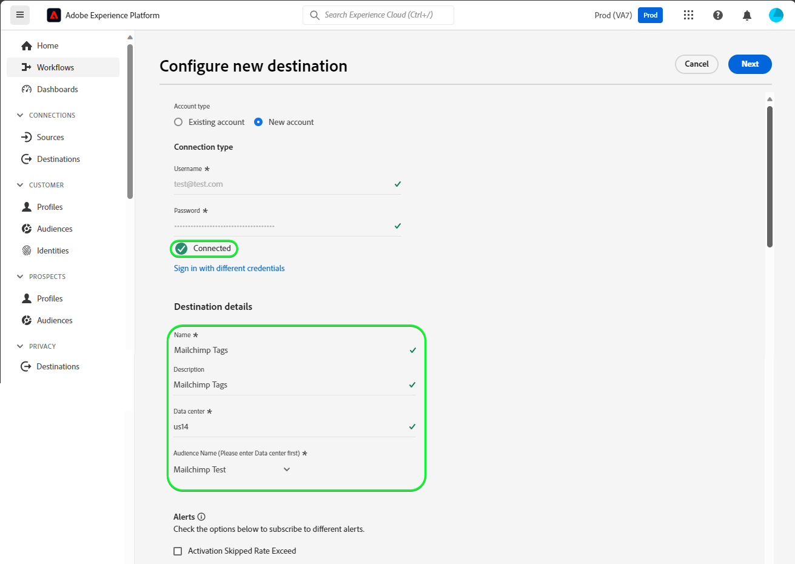
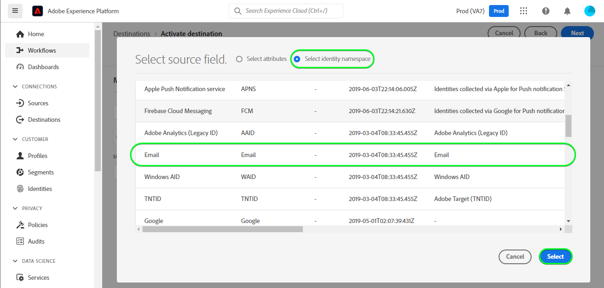
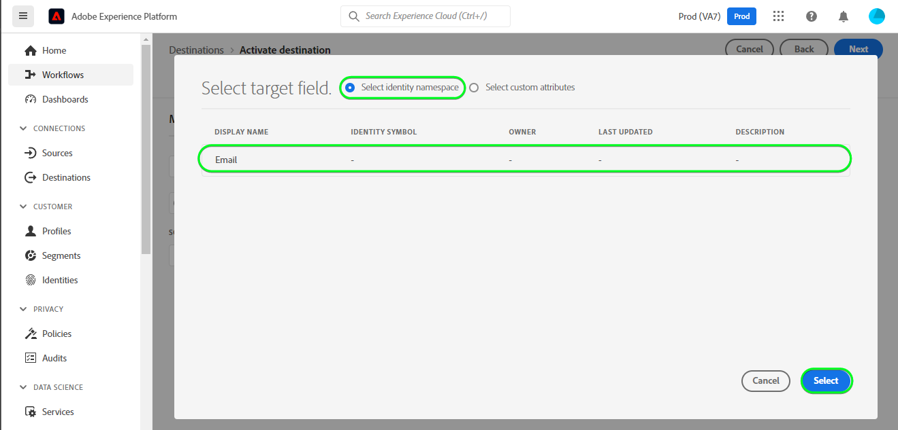
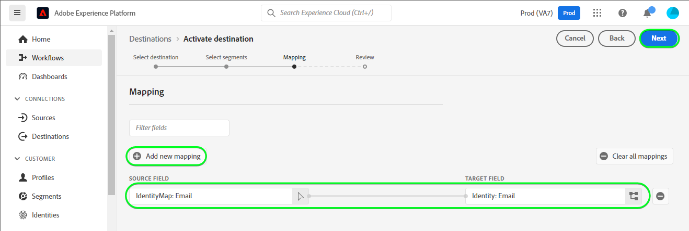
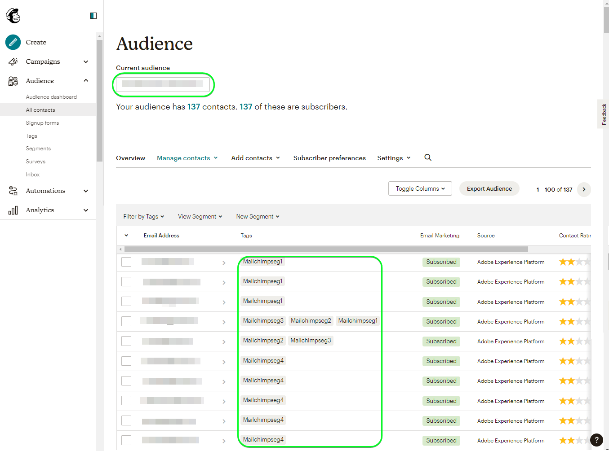

# [!DNL Mailchimp Tags] 接続

[[!DNL Mailchimp]](https://mailchimp.com) *（別名[!DNL Intuit Mailchimp]）*&#x200B;は、メーリングリストとメールマーケティングキャンペーンを使用して&#x200B;*（顧客、顧客、その他の興味のある関係者）*&#x200B;の連絡先を管理および連絡するために企業が使用する人気のマーケティングオートメーションプラットフォームおよびメールマーケティングサービスです。

[!DNL Mailchimp Tags]は[&#x200B; オーディエンス &#x200B;](https://mailchimp.com/help/getting-started-audience/)と[&#x200B; タグ &#x200B;](https://mailchimp.com/help/getting-started-tags/)を使用して、連絡先情報を管理します。 タグは、連絡先を整理し、[!DNL Mailchimp]内の内部カテゴリにラベル付けするのに使用するラベルです。

興味や好みに基づいて連絡先を並べ替えるために使用する[!DNL Mailchimp Interest Categories]と比較して、[!DNL Mailchimp Tags]は、連絡先が興味を持つ可能性のあるトピックへのサブスクリプションを管理するためのものです。 *注意：Experience Platformには[!DNL Mailchimp Interest Categories]の接続もあります。この接続は[[!DNL Mailchimp Interest Categories]](/help/destinations/catalog/email-marketing/mailchimp-interest-categories.md) ページで確認できます。*

この[!DNL Adobe Experience Platform] [宛先](/help/destinations/home.md)は、[[!DNL Mailchimp batch subscribe or unsubscribe API]](https://mailchimp.com/developer/marketing/api/lists/batch-subscribe-or-unsubscribe/) エンドポイントを活用しています。 新しいオーディエンス内で既存の&#x200B;**オーディエンス内の既存の**&#x200B;連絡先&#x200B;**のタグを[!DNL Mailchimp]新しい連絡先**&#x200B;または[!DNL Mailchimp]更新できます。 [!DNL Mailchimp Tags]は、Experience Platformから選択したオーディエンス名を[!DNL Mailchimp]内のタグ名として使用します。

## ユースケース {#use-cases}

[!DNL Mailchimp Tags]宛先を使用する方法とタイミングをより理解しやすくするために、[!DNL Adobe Experience Platform]のお客様がこの宛先を使用して解決できる使用例を次に示します。

### マーケティング施策のために連絡先にメールを送信 {#use-case-send-emails}

組織の営業部門は、メールベースのマーケティングキャンペーンを、厳選された連絡先リストにブロードキャストしたいと考えています。 連絡先リストは、オフラインソースから一括で受信されるため、追跡する必要があります。 既存の[!DNL Mailchimp]人のオーディエンスを特定し、各リストの連絡先を追加するExperience Platformオーディエンスの構築を開始します。 これらのオーディエンスを[!DNL Mailchimp Tags]に送信した後、選択した[!DNL Mailchimp] オーディエンスに連絡先が存在しない場合、連絡先が属するオーディエンス名を含む関連タグが追加されます。 [!DNL Mailchimp] オーディエンスに既に連絡先が存在する場合は、オーディエンスの名前を含む新しいタグが追加されます。 ラベルが[!DNL Mailchimp]に表示されるため、オフラインソースを簡単に識別できます。 データが[!DNL Mailchimp]に送信されると、マーケティングキャンペーンのメールがオーディエンスに送信されます。

## 前提条件 {#prerequisites}

Experience Platformおよび[!DNL Mailchimp]で設定する必要がある前提条件と、[!DNL Mailchimp Tags]の宛先を操作する前に収集する必要がある情報については、以下の節を参照してください。

### Experience Platformの前提条件 {#prerequisites-in-experience-platform}

[!DNL Mailchimp Tags]宛先にデータをアクティブ化する前に、[で](/help/xdm/schema/composition.md) スキーマ [、](https://experienceleague.adobe.com/docs/platform-learn/tutorials/data-ingestion/create-datasets-and-ingest-data.html?lang=ja) データセット [、および](https://experienceleague.adobe.com/docs/platform-learn/tutorials/audiences/create-audiences.html?lang=ja) オーディエンス [!DNL Experience Platform]を作成しておく必要があります。

### [!DNL Mailchimp Tags]宛先の前提条件 {#prerequisites-destination}

Experience Platformから[!DNL Mailchimp Tags] アカウントにデータをエクスポートするには、次の前提条件に注意してください。

#### [!DNL Mailchimp] アカウントが必要です {#prerequisites-account}

[!DNL Mailchimp Tags]宛先を作成する前に、まず[!DNL Mailchimp] アカウントがあることを確認する必要があります。 まだアカウントをお持ちでない場合は、[[!DNL Mailchimp] 登録ページ &#x200B;](https://login.mailchimp.com/signup/)にアクセスしてアカウントを登録および作成してください。

#### [!DNL Mailchimp] API キーを収集 {#gather-credentials}

[!DNL Mailchimp] アカウントに対して&#x200B;**宛先を認証するには、** [!DNL Mailchimp Interest Categories]API キー[!DNL Mailchimp]が必要です。 宛先&#x200B;**を**&#x200B;認証すると、**API キー**&#x200B;は[&#x200B; パスワード &#x200B;](#authenticate)として機能します。

**API キー**&#x200B;をお持ちでない場合は、[!DNL Mailchimp] アカウントにログインし、[!DNL Mailchimp]API キーの生成方法[に関する](https://mailchimp.com/developer/marketing/guides/quick-start/#generate-your-api-key) ドキュメントを参照してください。

API キーの例は`0123456789abcdef0123456789abcde-us14`です。

>[!IMPORTANT]
>
>**API キー**&#x200B;を生成した場合は、生成後にアクセスできないため、書き留めます。

#### [!DNL Mailchimp] データセンターの特定 {#identify-data-center}

次に、[!DNL Mailchimp] データセンターを特定する必要があります。 これを行うには、[!DNL Mailchimp] アカウントにログインし、アカウントの&#x200B;**API キーセクション**&#x200B;に移動します。

データセンターIDは、ブラウザーに表示されるURLの最初のセクションです。 URLが&#x200B;*https://`us14`.mailchimp.com/account/api/*&#x200B;の場合、データセンターは`us14`です。

データセンターIDは、API キーの形式&#x200B;*key-dc*&#x200B;にも追加されます。例えば、API キーが`0123456789abcdef0123456789abcde-us14`の場合、データセンターは`us14`になります。

データセンターの値&#x200B;*（`us14`をこの例に記載）*&#x200B;を書き留めます。 この値は、[宛先の詳細を入力](#destination-details)するときに必要になります。

詳細なガイダンスが必要な場合は、[[!DNL Mailchimp] 基本ドキュメント &#x200B;](https://mailchimp.com/developer/marketing/docs/fundamentals/#api-structure)を参照してください。

### ガードレール {#guardrails}

[!DNL Mailchimp] APIによって課される制限について詳しくは、[&#x200B; &#x200B;](https://mailchimp.com/developer/marketing/docs/fundamentals/#api-limits) レート制限[!DNL Mailchimp]を参照してください。

## サポートされている ID {#supported-identities}

[!DNL Mailchimp]は、次の表に示すIDのアクティブ化をサポートしています。 [ID](/help/identity-service/features/namespaces.md) についての詳細情報。

| ターゲット ID | 説明 | 注意点 |
|---|---|---|
| メール | 連絡先の電子メールアドレス。 | 必須 |

{style="table-layout:auto"}

## サポートされるオーディエンス {#supported-audiences}

この節では、この宛先に書き出すことができるオーディエンスのタイプについて説明します。

| オーディエンスの由来 | サポートあり | 説明 |
|---------|----------|----------|
| [!DNL Segmentation Service] | ○ | Experience Platform [&#x200B; セグメント化サービス &#x200B;](../../../segmentation/home.md)を通じて生成されたオーディエンス。 |
| その他すべてのオーディエンスの生成元 | ○ | このカテゴリには、[!DNL Segmentation Service]を通じて生成されたオーディエンス以外のすべてのオーディエンスのオリジンが含まれます。 [様々なオーディエンスの起源](/help/segmentation/ui/audience-portal.md#customize)について読みます。 次に例を示します。 <ul><li> カスタムアップロードオーディエンス [がCSV ファイルからExperience Platformに](../../../segmentation/ui/audience-portal.md#import-audience)をインポートしました。</li><li> 類似オーディエンス， </li><li> 連合オーディエンス， </li><li> [!DNL Adobe Journey Optimizer]などの他のExperience Platform アプリで生成されたオーディエンス </li><li> その他。 </li></ul> |

{style="table-layout:auto"}

オーディエンスのデータタイプ別にサポートされるオーディエンス：

| オーディエンスのデータタイプ | サポートあり | 説明 | ユースケース |
|--------------------|-----------|-------------|-----------|
| [人物オーディエンス &#x200B;](/help/segmentation/types/people-audiences.md) | ○ | 顧客プロファイルにもとづいて、マーケティング施策の特定のグループをターゲットにすることができます。 | 買い物客やカートの放棄が多い |
| [&#x200B; アカウントオーディエンス &#x200B;](/help/segmentation/types/account-audiences.md) | × | アカウントベースドマーケティング戦略のために、特定の組織内の個人をターゲットにします。 | B2B マーケティング |
| [見込みオーディエンス &#x200B;](/help/segmentation/types/prospect-audiences.md) | × | まだ顧客ではないが、ターゲットオーディエンスと特徴を共有する個人をターゲットにします。 | サードパーティデータによる見込み顧客の開拓 |
| [&#x200B; データセットの書き出し](/help/catalog/datasets/overview.md) | × | [!DNL Adobe Experience Platform] データ レイクに保存されている構造化データのコレクション。 | レポート，データサイエンスワークフロー |

{style="table-layout:auto"}

## 書き出しのタイプと頻度 {#export-type-frequency}

宛先の書き出しのタイプと頻度について詳しくは、以下の表を参照してください。

| 項目 | タイプ | メモ |
|---------|----------|---------|
| 書き出しタイプ | **[!UICONTROL Profile-based]** | <ul><li>オーディエンスのすべてのメンバーを、フィールドマッピングに従って、目的のスキーマフィールド *（例：電子メールアドレス、電話番号、姓）*&#x200B;と共に書き出します。</li><li> Experience Platformで選択された各オーディエンスについて、対応する[!DNL Mailchimp Tags] セグメントステータスがExperience Platformのオーディエンスステータスで更新されます。</li></ul> |
| 書き出し頻度 | **[!UICONTROL Streaming]** | ストリーミングの宛先は常に、API ベースの接続です。オーディエンス評価に基づいて Experience Platform 内でプロファイルが更新されるとすぐに、コネクタは更新を宛先プラットフォームに送信します。詳しくは、[ストリーミングの宛先](/help/destinations/destination-types.md#streaming-destinations)を参照してください。 |

{style="table-layout:auto"}

## 宛先への接続 {#connect}

>[!IMPORTANT]
>
>宛先に接続するには、**[!UICONTROL Manage Destinations]** [&#x200B; アクセス制御権限](/help/access-control/home.md#permissions)が必要です。 詳しくは、[アクセス制御の概要](/help/access-control/ui/overview.md)または製品管理者に問い合わせて、必要な権限を取得してください。

この宛先に接続するには、[宛先設定のチュートリアル](../../ui/connect-destination.md)の手順に従ってください。宛先の設定ワークフローで、以下の 2 つのセクションにリストされているフィールドに入力します。

**[!UICONTROL Destinations]** > **[!UICONTROL Catalog]**&#x200B;内で、[!DNL Mailchimp Tags]を検索します。 または、**[!UICONTROL Email marketing]** カテゴリの下に配置することもできます。

### 宛先に対する認証 {#authenticate}

宛先に対して認証を行うには、以下の必須フィールドに入力し、**[!UICONTROL Connect to destination]**&#x200B;を選択します。

| フィールド | 説明 |
| --- | --- |
| **[!UICONTROL Username]** | あなたの[!DNL Mailchimp] ユーザー名。 |
| **[!UICONTROL Password]** | [!DNL Mailchimp]収集&#x200B;**資格情報** セクションに書き留めた[&#x200B;  [!DNL Mailchimp] API キー](#gather-credentials)。 お使いのAPI キーは`{KEY}-{DC}`の形式になります。ここでは、`{KEY}`部分は[[!DNL Mailchimp] API キー](#gather-credentials) セクションに記載されている値を表し、`{DC}`部分は[[!DNL Mailchimp]  データセンター](#identify-data-center)を表します。  `{KEY}`部分またはフォーム全体を指定できます。 例えば、API キーが&#x200B; *`0123456789abcdef0123456789abcde-us14`*、 の場合、*`0123456789abcdef0123456789abcde`*または&#x200B;*`0123456789abcdef0123456789abcde-us14`*のいずれかを値として指定できます。 |

{style="table-layout:auto"}

認証方法を示す

指定された詳細が有効な場合、UIには緑色のチェックマークが付いた&#x200B;**[!UICONTROL Connected]** ステータスが表示されます。 その後、次の手順に進むことができます。

### 宛先の詳細を入力 {#destination-details}

宛先の詳細を設定するには、以下の必須フィールドとオプションフィールドに入力します。UI のフィールドの横のアスタリスクは、そのフィールドが必須であることを示します。

宛先の詳細を示す

| フィールド | 説明 |
| --- | --- |
| **[!UICONTROL Name]** | 将来この目的地を認識する名前。 |
| **[!UICONTROL Description]** | 今後この宛先を特定するのに役立つ説明です。 |
| **[!UICONTROL Data center]** | お客様の[!DNL Mailchimp] アカウント `data center` ガイダンスについては、[Identify [!DNL Mailchimp] data center](#identify-data-center) セクションを参照してください。 |
| **[!UICONTROL Audience Name (Please enter Data center first)]** | **[!UICONTROL Data center]**&#x200B;を入力すると、このドロップダウンには、[!DNL Mailchimp] アカウントのオーディエンス名が自動的に入力されます。 Experience Platformのデータで更新するオーディエンスを選択します。 |

{style="table-layout:auto"}

### アラートの有効化 {#enable-alerts}

アラートを有効にすると、宛先へのデータフローのステータスに関する通知を受け取ることができます。リストからアラートを選択して、データフローのステータスに関する通知を受け取るよう登録します。アラートについて詳しくは、[UI を使用した宛先アラートの購読](../../ui/alerts.md)についてのガイドを参照してください。

宛先接続の詳細の提供が完了したら、**[!UICONTROL Next]**&#x200B;を選択します。

## この宛先に対してオーディエンスをアクティブ化 {#activate}

>[!IMPORTANT]
>
>* データをアクティブ化するには、**[!UICONTROL View Destinations]**、**[!UICONTROL Activate Destinations]**、**[!UICONTROL View Profiles]**&#x200B;および&#x200B;**[!UICONTROL View Segments]** [&#x200B; アクセス制御権限](/help/access-control/home.md#permissions)が必要です。 [アクセス制御の概要](/help/access-control/ui/overview.md)を参照するか、製品管理者に問い合わせて必要な権限を取得してください。
>* *ID*&#x200B;をエクスポートするには、**[!UICONTROL View Identity Graph]** [&#x200B; アクセス制御権限](/help/access-control/home.md#permissions)が必要です。  {width="100" zoomable="yes"}

この宛先に対してオーディエンスをアクティブ化する手順については、[&#x200B; ストリーミング宛先に対するオーディエンスのアクティブ化](/help/destinations/ui/activate-segment-streaming-destinations.md)を参照してください。

### マッピングの考慮事項と例 {#mapping-considerations-example}

オーディエンスデータを[!DNL Adobe Experience Platform]から[!DNL Mailchimp Tags]宛先に正しく送信するには、フィールドマッピング手順を実行する必要があります。 マッピングでは、Experience Platform アカウントのExperience Data Model （XDM）スキーマフィールドと、ターゲット先の対応するスキーマフィールドとの間にリンクを作成します。

XDM フィールドを[!DNL Mailchimp Tags]宛先フィールドに正しくマッピングするには、次の手順に従います。

1. **[!UICONTROL Mapping]** ステップで、**[!UICONTROL Add new mapping]**&#x200B;を選択します。 画面に新しいマッピング行が表示されます。
1. **[!UICONTROL Select source field]** ウィンドウで、**[!UICONTROL Select identity namespace]**&#x200B;を選択し、`Email` ID名前空間を選択します。

   ID名前空間から電子メールとしてSource フィールドを含む

1. **[!UICONTROL Select target field]** ウィンドウで、**[!UICONTROL Select identity namespace]**&#x200B;を選択し、`Email` ID名前空間を選択します。

   ID名前空間からメールとしてTarget フィールドを含む

   XDM プロファイルスキーマと[!DNL Mailchimp Tags]間のマッピングは次のようになります。

   | ソースフィールド | ターゲットフィールド | 必須 |
   | --- | --- | --- |
   | `IdentityMap: Email` | `Identity: Email` | ○ |

   マッピングが完了した例を次に示します。
   

宛先接続のマッピングの提供が完了したら、**[!UICONTROL Next]**&#x200B;を選択します。

## データの書き出しを検証する {#exported-data}

宛先が正しく設定されていることを検証するには、次の手順に従います。

1. [[!DNL Mailchimp]](https://login.mailchimp.com/) アカウントにログインします。 次に、**[!DNL Audience]** > **[!DNL All Contacts]** ページに移動し、オーディエンスの連絡先が追加され、オーディエンス内の連絡先がオーディエンス名で更新されたかどうかを確認します。
   オーディエンスページを示す

## データの使用とガバナンス {#data-usage-governance}

[!DNL Adobe Experience Platform] のすべての宛先は、データを処理する際のデータ使用ポリシーに準拠しています。[!DNL Adobe Experience Platform] がどのようにデータガバナンスを実施するかについて詳しくは、[データガバナンスの概要](/help/data-governance/home.md)を参照してください。

## エラーとトラブルシューティング {#errors-and-troubleshooting}

ステータスコードとエラーコードの包括的なリストについては、[[!DNL Mailchimp]  エラーのページ &#x200B;](https://mailchimp.com/developer/marketing/docs/errors/)を参照してください。

## その他のリソース {#additional-resources}

[!DNL Mailchimp] ドキュメントのその他の有用な情報は次のとおりです。

* [はじめに [!DNL Mailchimp]](https://mailchimp.com/help/getting-started-with-mailchimp/)
* [&#x200B; オーディエンスの基本を学ぶ](https://mailchimp.com/help/getting-started-audience/)
* [オーディエンスの作成](https://mailchimp.com/help/create-audience/)
* [&#x200B; タグの概要](https://mailchimp.com/help/getting-started-tags/)
* [&#x200B; マーケティング API](https://mailchimp.com/developer/marketing/api/)
