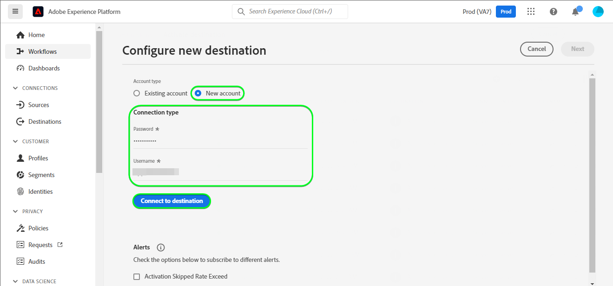
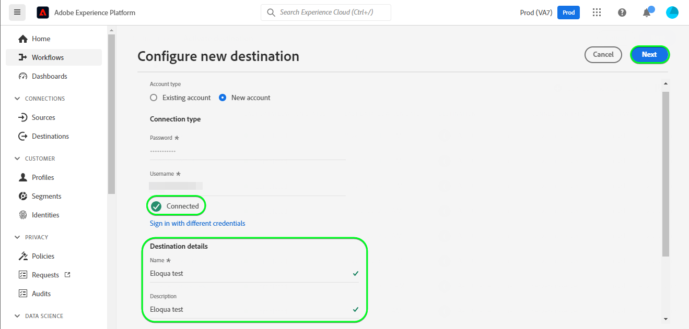
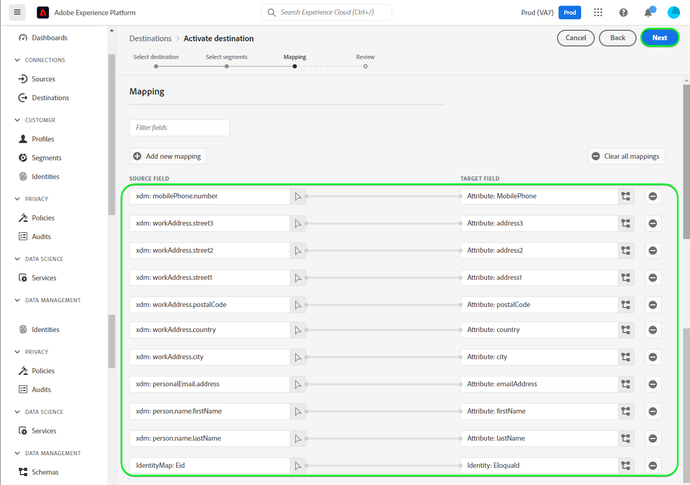
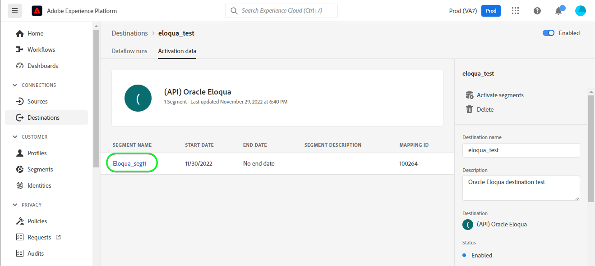
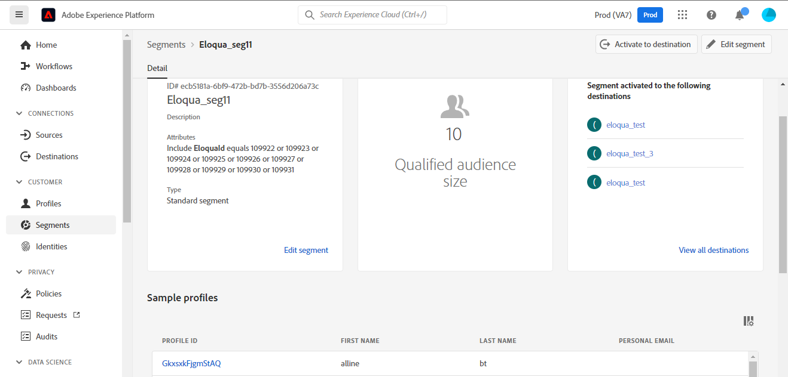
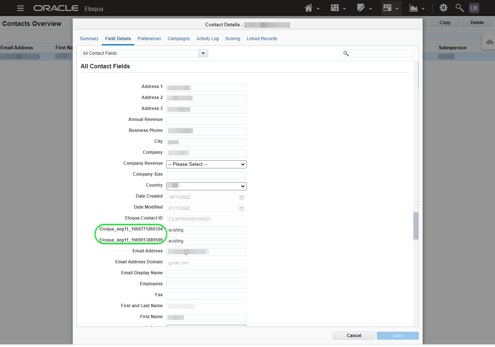
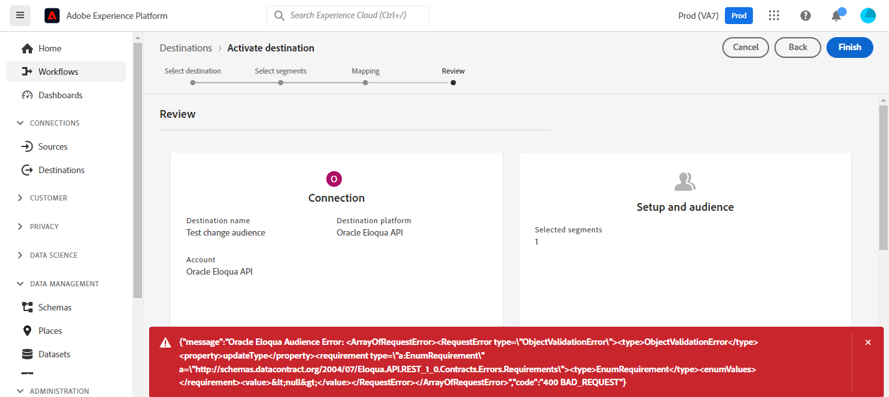

# [!DNL (API) Oracle Eloqua] 接続

[[!DNL Oracle Eloqua]](https://www.oracle.com/cx/marketing/automation/)を使用すると、マーケターはキャンペーンを計画および実行しながら、見込客にパーソナライズされた顧客体験を提供できます。 統合されたリード管理と簡単なキャンペーン作成により、マーケターはバイヤーズジャーニーにおいて適切なオーディエンスをタイミングよく惹きつけ、メール、ディスプレイ検索、動画、モバイルなどのチャネルをまたいでオーディエンスにリーチできるようにエレガントに拡張できます。 Adobe Real-Time insightを利用すれば、営業部門はより多くの商談をより迅速に成立させ、マーケティング ROIを向上できます。

この[!DNL Adobe Experience Platform] [宛先](/help/destinations/home.md)は、[ REST APIから](https://docs.oracle.com/en/cloud/saas/marketing/eloqua-rest-api/op-api-rest-1.0-data-contact-id-put.html)IDの更新[!DNL Oracle Eloqua]への&#x200B;**連絡先の更新**&#x200B;操作を[!DNL Oracle Eloqua]に利用します。

[!DNL Oracle Eloqua]は[基本認証](https://docs.oracle.com/en/cloud/saas/marketing/eloqua-rest-api/Authentication_Basic.html)を使用して[!DNL Oracle Eloqua] REST APIと通信します。 [!DNL Oracle Eloqua] インスタンスを認証する手順は、さらに下の[宛先に対する認証](#authenticate)の節にあります。

## ユースケース {#use-cases}

オンラインプラットフォームのマーケティング部門は、メールベースのマーケティングキャンペーンを、厳選されたリードのオーディエンスにブロードキャストしたいと考えています。 プラットフォームのマーケティング部門は、[!DNL Adobe Experience Platform]を通じて既存のリード情報を更新し、独自のオフラインデータからオーディエンスを構築し、これらのオーディエンスを[!DNL Oracle Eloqua]に送信し、マーケティングキャンペーンのメールを送信するために使用することができます。

## 前提条件 {#prerequisites}

### Experience Platform の前提条件 {#prerequisites-in-experience-platform}

[!DNL Oracle Eloqua] 宛先へのデータをアクティブ化する前に、[スキーマ](/help/xdm/schema/composition.md)、[データセット](https://experienceleague.adobe.com/docs/platform-learn/tutorials/data-ingestion/create-datasets-and-ingest-data.html?lang=ja)および[セグメント](https://experienceleague.adobe.com/docs/platform-learn/tutorials/segments/create-segments.html?lang=ja)を [!DNL Experience Platform] で作成する必要があります。

オーディエンスのステータスに関するガイダンスが必要な場合は、[ オーディエンスメンバーシップの詳細スキーマフィールドグループ ](/help/xdm/field-groups/profile/segmentation.md)のExperience Platform ドキュメントを参照してください。

### [!DNL Oracle Eloqua] 前提条件 {#prerequisites-destination}

Experience Platformから[!DNL Oracle Eloqua] アカウントにデータをエクスポートするには、[!DNL Oracle Eloqua] アカウントが必要です。

さらに、少なくとも&#x200B;*インスタンスに* 「高度なユーザー – マーケティング権限」 [!DNL Oracle Eloqua]が必要です。 ガイダンスについては、*セキュアユーザーアクセス* ページの[ 「セキュリティグループ」 ](https://docs.oracle.com/en/cloud/saas/marketing/eloqua-user/Help/SecurityOverview/SecuredUserAccess.htm) セクションを参照してください。 [ APIを呼び出す際に、プログラムで](https://docs.oracle.com/en/cloud/saas/marketing/eloqua-rest-api/DeterminingBaseURL.html) ベース URL[!DNL Oracle Eloqua]を決定するために、宛先がアクセスを必要とします。

#### [!DNL Oracle Eloqua] 資格情報の収集 {#gather-credentials}

[!DNL Oracle Eloqua]宛先に対する認証を行う前に、以下の項目をメモしてください。

| 資格情報 | 説明 |
| --- | --- |
| `Company Name` | [!DNL Oracle Eloqua] アカウントに関連付けられている会社名。 <br>後で`Company Name`と[!DNL Oracle Eloqua] `Username`を連結された文字列として使用し、**[!UICONTROL Username]**&#x200B;が宛先[に対する認証時に](#authenticate)として使用します。 |
| `Username` | [!DNL Oracle Eloqua] アカウントのユーザー名。 |
| `Password` | [!DNL Oracle Eloqua] アカウントのパスワード。 |
| `Pod` | [!DNL Oracle Eloqua]は、それぞれ一意のドメイン名を持つ複数のデータセンターをサポートしています。 [!DNL Oracle Eloqua]はこれらを「ポッド」と呼びます。現在、合計7つのポッドがあります（p01、p02、p03、p04、p06、p07、p08）。 どのPODを使用しているかを取得するには、[!DNL Oracle Eloqua]にログインし、正常にログインした後にブラウザーにURLをメモします。 例えば、ブラウザーのURLが`secure.p01.eloqua.com`の場合、`pod`は`p01`になります。 追加のガイダンスについては、[PODの決定](https://community.oracle.com/topliners/discussion/4470225/determining-your-pod-number-for-oracle-eloqua) ページを参照してください。 |

{style="table-layout:auto"}

ガイダンスについては、[へのログイン  [!DNL Oracle Eloqua]](https://docs.oracle.com/en/cloud/saas/marketing/eloqua-user/Help/Administration/Tasks/SigningInToEloqua.htm#Signing)を参照してください。

## ガードレール {#guardrails}

>[!NOTE]
>
>* [!DNL Oracle Eloqua]個のカスタム連絡先フィールドは、**[!UICONTROL Select segments]**&#x200B;手順で選択したオーディエンスの名前を使用して自動的に作成されます。

* [!DNL Oracle Eloqua]のカスタム連絡先フィールドの上限は250です。
* 新しいオーディエンスを書き出す前に、Experience Platform オーディエンスの数と[!DNL Oracle Eloqua]内の既存のオーディエンスの数がこの制限を超えていないことを確認してください。
* この制限を超えると、Experience Platformでエラーが発生します。 これは、[!DNL Oracle Eloqua] APIがリクエストの検証に失敗し、- *400：検証エラー* – 問題を説明するエラーメッセージが返されるためです。
* 上記の制限に達した場合は、さらにセグメントを書き出す前に、既存のマッピングを宛先から削除し、対応するカスタム連絡先フィールドを[!DNL Oracle Eloqua] アカウントで削除する必要があります。

* 追加の制限について詳しくは、[[!DNL Oracle Eloqua] 連絡先フィールドの作成](https://docs.oracle.com/en/cloud/saas/marketing/eloqua-user/Help/ContactFields/Tasks/CreatingContactFields.htm) ページを参照してください。

## サポートされる ID {#supported-identities}

[!DNL Oracle Eloqua] では、以下の表で説明する ID の更新をサポートしています。[ID](/help/identity-service/features/namespaces.md) についての詳細情報。

| ターゲット ID | 説明 | 必須 |
|---|---|---|
| `EloquaId` | 連絡先の一意のID。 | ○ |

{style="table-layout:auto"}

## サポートされるオーディエンス {#supported-audiences}

この節では、この宛先に書き出すことができるオーディエンスのタイプについて説明します。

| オーディエンスの由来 | サポートあり | 説明 |
|---------|----------|----------|
| [!DNL Segmentation Service] | ○ | Experience Platform [ セグメント化サービス ](../../../segmentation/home.md)を通じて生成されたオーディエンス。 |
| その他すべてのオーディエンスの生成元 | × | このカテゴリには、[!DNL Segmentation Service]を通じて生成されたオーディエンス以外のすべてのオーディエンスのオリジンが含まれます。 [様々なオーディエンスの起源](/help/segmentation/ui/audience-portal.md#customize)について読みます。 次に例を示します。 <ul><li> カスタムアップロードオーディエンス [がCSV ファイルからExperience Platformに](../../../segmentation/ui/audience-portal.md#import-audience)をインポートしました。</li><li> 類似オーディエンス， </li><li> 連合オーディエンス， </li><li> [!DNL Adobe Journey Optimizer]などの他のExperience Platform アプリで生成されたオーディエンス </li><li> その他。 </li></ul> |

{style="table-layout:auto"}

オーディエンスのデータタイプ別にサポートされるオーディエンス：

| オーディエンスのデータタイプ | サポートあり | 説明 | ユースケース |
|--------------------|-----------|-------------|-----------|
| [人物オーディエンス ](/help/segmentation/types/people-audiences.md) | ○ | 顧客プロファイルにもとづいて、マーケティング施策の特定のグループをターゲットにすることができます。 | 買い物客やカートの放棄が多い |
| [ アカウントオーディエンス ](/help/segmentation/types/account-audiences.md) | × | アカウントベースドマーケティング戦略のために、特定の組織内の個人をターゲットにします。 | B2B マーケティング |
| [見込みオーディエンス ](/help/segmentation/types/prospect-audiences.md) | × | まだ顧客ではないが、ターゲットオーディエンスと特徴を共有する個人をターゲットにします。 | サードパーティデータによる見込み顧客の開拓 |
| [ データセットの書き出し](/help/catalog/datasets/overview.md) | × | [!DNL Adobe Experience Platform] データ レイクに保存されている構造化データのコレクション。 | レポート，データサイエンスワークフロー |

{style="table-layout:auto"}

## 書き出しのタイプと頻度 {#export-type-frequency}

宛先の書き出しのタイプと頻度について詳しくは、以下の表を参照してください。

| 項目 | タイプ | メモ |
|---------|----------|---------|
| 書き出しタイプ | **[!UICONTROL Profile-based]** | <ul><li>セグメントのすべてのメンバーを、フィールドマッピングに従って、必要なスキーマフィールドと共に書き出します&#x200B;*（例：メールアドレス、電話番号、姓）*。</li><li> Experience Platformで選択した各オーディエンスについて、対応する[!DNL Oracle Eloqua] セグメントステータスが、Experience Platformからオーディエンスステータスで更新されます。</li></ul> |
| 書き出し頻度 | **[!UICONTROL Streaming]** | <ul><li>ストリーミングの宛先は常に、API ベースの接続です。オーディエンス評価に基づいて Experience Platform 内でプロファイルが更新されるとすぐに、コネクタは更新を宛先プラットフォームに送信します。詳しくは、[ストリーミングの宛先](/help/destinations/destination-types.md#streaming-destinations)を参照してください。</li></ul> |

{style="table-layout:auto"}

## 宛先への接続 {#connect}

>[!IMPORTANT]
>
>宛先に接続するには、**[!UICONTROL View Destinations]**&#x200B;および&#x200B;**[!UICONTROL Manage Destinations]** [ アクセス制御権限](/help/access-control/home.md#permissions)が必要です。 詳しくは、[アクセス制御の概要](/help/access-control/ui/overview.md)または製品管理者に問い合わせて、必要な権限を取得してください。

この宛先に接続するには、[宛先設定のチュートリアル](../../ui/connect-destination.md)の手順に従ってください。宛先の設定ワークフローで、以下の 2 つのセクションにリストされているフィールドに入力します。

**[!UICONTROL Destinations]** > **[!UICONTROL Catalog]**&#x200B;内で[!DNL (API) Oracle Eloqua]を検索します。 または、**[!UICONTROL Email Marketing]** カテゴリの下に配置することもできます。

### 宛先に対する認証 {#authenticate}

>[!CONTEXTUALHELP]
>id="platform_destinations_apioracleeloqua_companyname_username"
>title="会社名\ユーザー名"
>abstract="このフィールドに、会社名と Oracle Eloqua のユーザー名を `{COMPANY_NAME}\{USERNAME}` の形式で入力します"

以下の必須のフィールドに入力します。ガイダンスについては、[収集 [!DNL Oracle Eloqua] 資格情報](#gather-credentials) セクションを参照してください。

* **[!UICONTROL Password]**: [!DNL Oracle Eloqua] アカウントのパスワード。
* **[!UICONTROL Username]**: [!DNL Oracle Eloqua]会社名と[!DNL Oracle Eloqua] ユーザー名で構成される連結された文字列。<br>連結された値は`{COMPANY_NAME}\{USERNAME}`の形式になります。<br>注意してください。中括弧やスペースは使用せず、`\`を保持してください。 <br>例えば、お客様の[!DNL Oracle Eloqua]会社名が`MyCompany`、ユーザー名が[!DNL Oracle Eloqua]の場合、`Username` フィールドで使用する連結された値は&#x200B;**[!UICONTROL Username]**&#x200B;です。`MyCompany\Username`

宛先に対する認証を行うには、**[!UICONTROL Connect to destination]**を選択します。
認証方法を示す

指定された詳細が有効な場合、UIには緑色のチェックマークが付いた&#x200B;**[!UICONTROL Connected]** ステータスが表示されます。 その後、次の手順に進むことができます。

### 宛先の詳細を入力 {#destination-details}

>[!CONTEXTUALHELP]
>id="platform_destinations_apioracleeloqua_pod"
>title="ポッド"
>abstract="ポッド番号を見つけるには、Oracle Eloqua にログインします。正常にログインしたら、ブラウザーに表示される URL をメモします。 "

<!-- >additional-url="https://support.oracle.com/knowledge/Oracle%20Cloud/2307176_1.html" text="Oracle Knowledge base - find out your Pod number" -->

宛先の詳細を設定するには、以下の必須フィールドとオプションフィールドに入力します。UI のフィールドの横にアスタリスクが表示される場合は、そのフィールドが必須であることを示します。
宛先の詳細を示す

* **[!UICONTROL Name]**：今後この宛先を認識する際に使用する名前。
* **[!UICONTROL Description]**：今後この宛先を特定するのに役立つ説明です。
* **[!UICONTROL Pod]**：現在の`pod`を取得するには、[!DNL Oracle Eloqua]にログインし、正常にログインした後でブラウザーにURLを記録します。 例えば、ブラウザーのURLが`secure.p01.eloqua.com`の場合、選択する必要がある`pod`値は`p01`です。 追加のガイダンスについては、[収集 [!DNL Oracle Eloqua] 資格情報](#gather-credentials) セクションを参照してください。

### アラートの有効化 {#enable-alerts}

アラートを有効にすると、宛先へのデータフローのステータスに関する通知を受け取ることができます。リストからアラートを選択して、データフローのステータスに関する通知を受け取るよう登録します。アラートについて詳しくは、[UI を使用した宛先アラートの購読](../../ui/alerts.md)についてのガイドを参照してください。

宛先接続の詳細の提供が完了したら、**[!UICONTROL Next]**&#x200B;を選択します。

## この宛先に対してオーディエンスをアクティブ化 {#activate}

>[!IMPORTANT]
>
>* データをアクティブ化するには、**[!UICONTROL View Destinations]**、**[!UICONTROL Activate Destinations]**、**[!UICONTROL View Profiles]**&#x200B;および&#x200B;**[!UICONTROL View Segments]** [ アクセス制御権限](/help/access-control/home.md#permissions)が必要です。 [アクセス制御の概要](/help/access-control/ui/overview.md)を参照するか、製品管理者に問い合わせて必要な権限を取得してください。
>* *ID*&#x200B;をエクスポートするには、**[!UICONTROL View Identity Graph]** [ アクセス制御権限](/help/access-control/home.md#permissions)が必要です。<br> {width="100" zoomable="yes"}

この宛先にオーディエンスをアクティベートする手順は、[ストリーミングオーディエンスの書き出し宛先へのプロファイルとオーディエンスのアクティベート](/help/destinations/ui/activate-segment-streaming-destinations.md)を参照してください。

### マッピングの考慮事項と例 {#mapping-considerations-example}

オーディエンスデータを[!DNL Adobe Experience Platform]から[!DNL Oracle Eloqua]宛先に正しく送信するには、フィールドマッピング手順を実行する必要があります。 マッピングでは、Experience Platform アカウントのExperience Data Model （XDM）スキーマフィールドと、ターゲット先の対応するスキーマフィールドとの間にリンクを作成します。

XDM フィールドを[!DNL Oracle Eloqua]宛先フィールドにマッピングするには、次の手順に従います。

1. **[!UICONTROL Mapping]** ステップで、**[!UICONTROL Add new mapping]**&#x200B;を選択します。 画面に新しいマッピング行が表示されます。
1. **[!UICONTROL Select source field]** ウィンドウで、**[!UICONTROL Select attributes]** カテゴリを選択してXDM属性を選択するか、**[!UICONTROL Select identity namespace]**&#x200B;を選択してIDを選択します。
1. **[!UICONTROL Select target field]** ウィンドウで、**[!UICONTROL Select identity namespace]**&#x200B;を選択してIDを選択するか、**[!UICONTROL Select custom attributes]**&#x200B;を選択して、**[!UICONTROL Attribute name]** フィールドに目的の属性名を入力します。 指定する属性名は、[!DNL Oracle Eloqua]の既存の取引先責任者の属性と一致する必要があります。 [[!DNL create a contact]で使用できる属性名については、](https://docs.oracle.com/en/cloud/saas/marketing/eloqua-rest-api/op-api-rest-1.0-data-contact-post.html)[!DNL Oracle Eloqua]を参照してください。

   * 次の手順を繰り返して、XDM プロファイルスキーマと[!DNL Oracle Eloqua]の間に必須および任意の属性マッピングを追加します。

     | ソースフィールド | ターゲットフィールド | 必須 |
     |---|---|---|
     | `IdentityMap: Eid` | `Identity: EloquaId` | ○ |
     | `xdm: personalEmail.address` | `Attribute: emailAddress` | ○ |
     | `xdm: personName.firstName` | `Attribute: firstName` | |
     | `xdm: personName.lastName` | `Attribute: lastName` | |
     | `xdm: workAddress.street1` | `Attribute: address1` | |
     | `xdm: workAddress.street2` | `Attribute: address2` | |
     | `xdm: workAddress.street3` | `Attribute: address3` | |
     | `xdm: workAddress.postalCode` | `Attribute: postalCode` | |
     | `xdm: workAddress.country` | `Attribute: country` | |
     | `xdm: workAddress.city` | `Attribute: city` | |

   * 上記のマッピングの例を次に示します。
     

>[!IMPORTANT]
>
>* **[!UICONTROL Target field]**&#x200B;で指定された属性は、これらの属性がリクエスト本文を形成するので、[[!DNL Create a contact]](https://docs.oracle.com/en/cloud/saas/marketing/eloqua-rest-api/op-api-rest-1.0-data-contact-post.html)で指定されたとおりに正確に名前を付ける必要があります。
>* **[!UICONTROL Source field]**&#x200B;で指定された属性は、そのような制限に従っていません。 必要に応じてマッピングできますが、[!DNL Oracle Eloqua]にプッシュしたときにデータ形式が正しくない場合は、エラーが発生します。 例えば、**[!UICONTROL Source field]** ID名前空間`contact key`、`ABC ID`などをマッピングできます。 **[!UICONTROL Target field]**&#x200B;が受け入れる形式とID値が一致することを確認した後、`EloquaId`まで：[!DNL Oracle Eloqua]。
>* IDに対応する属性を更新するには、`EloquaID` マッピングが必須です。
>* `emailAddress` マッピングが必要です。 これを使用しない場合、APIは次に示すようにエラーをスローします。
>
>```json
>{
>     "type":"ObjectValidationError",
>     "container":{
>           "type":"ObjectKey",
>           "objectType":"Contact"
>     },
>     "property":"emailAddress",
>     "requirement":{
>           "type":"EmailAddressRequirement"
>     },
>     "value":"<null>"
>}
>```

宛先接続のマッピングの提供が完了したら、**[!UICONTROL Next]**&#x200B;を選択します。

>[!NOTE]
>
>宛先は、連絡先フィールド情報を[!DNL Oracle Eloqua]に送信する際に、各実行時に、選択したオーディエンス名に一意のIDを自動的にサフィックスします。 これにより、オーディエンス名に対応する連絡先フィールド名が重複しないようにします。 オーディエンス名を使用してカスタム連絡先フィールドを作成した[連絡先の詳細ページの](#exported-data) データ書き出しの検証[!DNL Oracle Eloqua] セクションのスクリーンショットの例を参照してください。

## データの書き出しを検証する {#exported-data}

宛先が正しく設定されていることを検証するには、次の手順に従います。

1. **[!UICONTROL Destinations]** > **[!UICONTROL Browse]**&#x200B;を選択し、宛先のリストに移動します。
1. 次に、宛先を選択して&#x200B;**[!UICONTROL Activation data]** タブに切り替え、オーディエンス名を選択します。
   宛先アクティベーションデータを示す

1. オーディエンスの概要を監視し、プロファイルの数がセグメント内の数に対応していることを確認します。
   セグメントを示す

1. [!DNL Oracle Eloqua] web サイトに移動し、**[!UICONTROL Contacts Overview]** ページに移動して、オーディエンスのプロファイルが追加されたかどうかを確認します。 オーディエンスのステータスを確認するには、**[!UICONTROL Contact Detail]** ページにドリルダウンし、選択したオーディエンス名が接頭辞として含まれている連絡先フィールドが作成されているかどうかを確認します。



## データの使用とガバナンス {#data-usage-governance}

[!DNL Adobe Experience Platform] のすべての宛先は、データを処理する際のデータ使用ポリシーに準拠しています。[!DNL Adobe Experience Platform] がどのようにデータガバナンスを実施するかについて詳しくは、[データガバナンスの概要](/help/data-governance/home.md)を参照してください。

## エラーとトラブルシューティング {#errors-and-troubleshooting}

宛先の作成時に、次のいずれかのエラーメッセージが表示される場合があります：`400: There was a validation error`または`400 BAD_REQUEST`。 これは、[ ガードレール ](#guardrails) セクションで説明されているように、カスタム連絡先フィールドの制限を250個を超えた場合に発生します。 このエラーを修正するには、[!DNL Oracle Eloqua]のカスタム連絡先フィールドの制限を超えていないことを確認してください。
エラーを示す

ステータスコードとエラーコードの包括的なリストについては、[[!DNL Oracle Eloqua] HTTP ステータスコード ](https://docs.oracle.com/en/cloud/saas/marketing/eloqua-rest-api/APIRequests_HTTPStatusCodes.html)および[[!DNL Oracle Eloqua] 検証エラー](https://docs.oracle.com/en/cloud/saas/marketing/eloqua-rest-api/APIRequests_HTTPValidationErrors.html) ページを参照してください。

## その他のリソース {#additional-resources}

詳細については、[!DNL Oracle Eloqua] ドキュメントを参照してください。

* [Oracle Eloqua Marketing Automation](https://docs.oracle.com/en/cloud/saas/marketing/eloqua.html)
* [Oracle Eloqua Marketing Cloud Service用REST API](https://docs.oracle.com/en/cloud/saas/marketing/eloqua-rest-api/rest-endpoints.html)

### 変更ログ {#changelog}

この節では、この宛先コネクタに対する機能の概要と重要なドキュメントの更新について説明します。

+++ 変更ログを表示

| リリース月 | 更新タイプ | 説明 |
|---|---|---|
| 2023年4月 | ドキュメントの更新 | <ul><li>[ ユースケース ](#use-cases) セクションを更新し、顧客がこの宛先を使用することでメリットを得られるタイミングをより明確に示しました。</li> <li>必須マッピングと任意マッピングの両方の明確な例を使用して、[ マッピング ](#mapping-considerations-example) セクションを更新しました。</li> <li>[会社名と](#connect) ユーザー名を使用して&#x200B;**[!UICONTROL Username]** フィールドの連結値を作成する方法の例を示す例で、[!DNL Oracle Eloqua]宛先[!DNL Oracle Eloqua]への接続セクションを更新しました。 （PLATIR-28343）</li><li>[  [!DNL Oracle Eloqua] の選択に関するガイダンスを使用して、](#gather-credentials)収集[資格情報](#destination-details)および[!DNL Oracle Eloqua]宛先の詳細&#x200B;**[!UICONTROL Pod]** セクションを更新しました。 *&quot;Pod&quot;*&#x200B;値は、宛先がAPI呼び出しのベース URLを構築するために使用します。 [[!DNL Oracle Eloqua] 前提条件](#prerequisites-destination) セクションも更新され、*インスタンスに必要な* 「セキュリティグループ」 *として* 「高度なユーザー – マーケティング権限」 [!DNL Oracle Eloqua]を割り当てる方法が示されました。</li></ul> |
| 2023年3月 | 初回リリース | 最初の宛先リリースとドキュメントの公開。 |

{style="table-layout:auto"}

+++
