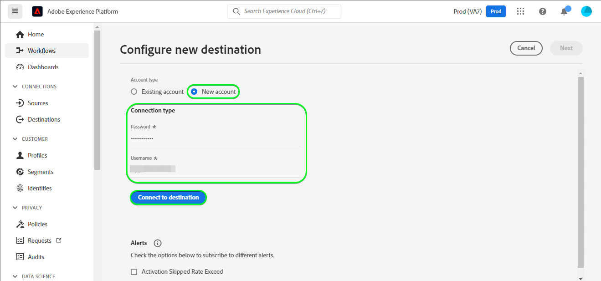

# [!DNL (API) Oracle Eloqua] 接続

[[!DNL Oracle Eloqua]](https://www.oracle.com/cx/marketing/automation/) マーケターは、キャンペーンを計画および実行しながら、パーソナライズされたカスタマーエクスペリエンスを見込み客に提供できます。 統合されたリード管理と簡単なキャンペーン作成により、マーケターがバイヤージャーニーで適切なオーディエンスを適切なタイミングで惹きつけ、メール、ディスプレイ検索、ビデオ、モバイルなどのあらゆるチャネルでオーディエンスにリーチするようにエレガントに拡張できます。 セールスチームは、より速い速度でより多くの取引をクローズし、リアルタイムインサイトを通じてマーケティングの ROI を向上させることができます。

この [!DNL Adobe Experience Platform] [宛先](/help/destinations/home.md) は [連絡先の更新](https://docs.oracle.com/en/cloud/saas/marketing/eloqua-rest-api/op-api-rest-1.0-data-contact-id-put.html) からの操作 [!DNL Oracle Eloqua] REST API。次のことが可能です。 **id の更新** ～への聴衆の中で [!DNL Oracle Eloqua].

[!DNL Oracle Eloqua] 使用 [基本認証](https://docs.oracle.com/en/cloud/saas/marketing/eloqua-rest-api/Authentication_Basic.html) と通信するには [!DNL Oracle Eloqua] REST API。 [!DNL Oracle Eloqua] インスタンスを認証する手順は、さらに下の[宛先に対する認証](#authenticate)の節にあります。

## ユースケース {#use-cases}

オンラインプラットフォームのマーケティング部門は、キュレーションされたオーディエンスにメールベースのマーケティングキャンペーンをブロードキャストしたいと考えています。 プラットフォームのマーケティングチームは、Adobe Experience Platformを使用して既存のリード情報を更新し、独自のオフラインデータからオーディエンスを作成し、これらのオーディエンスをに送信できます。 [!DNL Oracle Eloqua]を使用して、マーケティングキャンペーンメールを送信できます。

## 前提条件 {#prerequisites}

### Experience Platform の前提条件 {#prerequisites-in-experience-platform}

[!DNL Oracle Eloqua] 宛先へのデータをアクティブ化する前に、[スキーマ](/help/xdm/schema/composition.md)、[データセット](https://experienceleague.adobe.com/docs/platform-learn/tutorials/data-ingestion/create-datasets-and-ingest-data.html)および[セグメント](https://experienceleague.adobe.com/docs/platform-learn/tutorials/segments/create-segments.html)を [!DNL Experience Platform] で作成する必要があります。

のExperience Platformドキュメントを参照してください。 [オーディエンスメンバーシップの詳細スキーマフィールドグループ](/help/xdm/field-groups/profile/segmentation.md) オーディエンスのステータスのガイダンスが必要な場合。

### [!DNL Oracle Eloqua] 前提条件 {#prerequisites-destination}

Platform からユーザーの [!DNL Oracle Eloqua] 必須アカウント [!DNL Oracle Eloqua] アカウント。

さらに、少なくとも *「上級ユーザー – マーケティング権限」* の場合 [!DNL Oracle Eloqua] インスタンス。 を参照してください。 *&quot;セキュリティグループ&quot;* に関する節 [ユーザーアクセスの保護](https://docs.oracle.com/en/cloud/saas/marketing/eloqua-user/Help/SecurityOverview/SecuredUserAccess.htm) 説明のためのページ。 アクセスは、宛先によって、プログラムによって必要とされます [ベース URL の決定](https://docs.oracle.com/en/cloud/saas/marketing/eloqua-rest-api/DeterminingBaseURL.html) を呼び出す場合 [!DNL Oracle Eloqua] API です。

#### [!DNL Oracle Eloqua] 資格情報の収集 {#gather-credentials}

に対して認証を行う前に、以下の項目をメモしておきます [!DNL Oracle Eloqua] 宛先：

| 資格情報 | 説明 |
| --- | --- |
| `Company Name` | 関連付けられた会社名 [!DNL Oracle Eloqua] アカウント。 <br>後で、を使用します `Company Name` および [!DNL Oracle Eloqua] `Username` として使用される連結文字列 **[!UICONTROL ユーザー名]** 条件 [宛先への認証](#authenticate). |
| `Username` | のユーザー名 [!DNL Oracle Eloqua] アカウント。 |
| `Password` | パスワード [!DNL Oracle Eloqua] アカウント。 |
| `Pod` | [!DNL Oracle Eloqua] では、それぞれ一意のドメイン名を持つ複数のデータセンターをサポートしています。 [!DNL Oracle Eloqua] これらは「ポッド」と呼ばれ、現在、p01、p02、p03、p04、p06、p07、p08 の合計 7 つがあります。 使用している POD を取得するには、にログインします。 [!DNL Oracle Eloqua] また、正常にログインしたら、ブラウザーに URL が表示されることに注意してください。 例えば、ブラウザー URL がの場合 `secure.p01.eloqua.com` あなたの `pod` 等しい `p01`. を参照してください。 [ポッドの決定](https://community.oracle.com/topliners/discussion/4470225/determining-your-pod-number-for-oracle-eloqua) 追加のガイダンスのページ。 |

を参照してください。 [へのログイン [!DNL Oracle Eloqua]](https://docs.oracle.com/en/cloud/saas/marketing/eloqua-user/Help/Administration/Tasks/SigningInToEloqua.htm#Signing) 説明のための。

## ガードレール {#guardrails}

>[!NOTE]
>
>* [!DNL Oracle Eloqua] カスタム連絡先フィールドは、次の期間に選択したオーディエンスの名前を使用して自動的に作成されます **[!UICONTROL セグメントを選択]** ステップ。

* [!DNL Oracle Eloqua] には、最大 250 個のカスタム連絡先フィールドという制限があります。
* 新しいオーディエンスを書き出す前に、内の Platform オーディエンスの数と既存のオーディエンスの数を確認します [!DNL Oracle Eloqua] この制限を超えないようにします。
* この制限を超えると、Experience Platformでエラーが発生します。 これは、 [!DNL Oracle Eloqua] API がリクエストの検証に失敗し、応答として –  *400：検証エラーがありました*  – 問題を説明するエラーメッセージ。
* 上記の上限に達した場合は、既存のマッピングを宛先から削除し、に対応するカスタム連絡先フィールドを削除する必要があります [!DNL Oracle Eloqua] その他のセグメントを書き出すには、アカウントが必要です。

* を参照してください。 [[!DNL Oracle Eloqua] 連絡先フィールドの作成](https://docs.oracle.com/en/cloud/saas/marketing/eloqua-user/Help/ContactFields/Tasks/CreatingContactFields.htm) このページでは、追加の制限について説明します。

## サポートされる ID {#supported-identities}

[!DNL Oracle Eloqua] では、以下の表で説明する ID の更新をサポートしています。[ID](/help/identity-service/features/namespaces.md) についての詳細情報。

| ターゲット ID | 説明 | 必須 |
|---|---|---|
| `EloquaId` | 連絡先の一意の ID。 | ○ |

## 書き出しのタイプと頻度 {#export-type-frequency}

宛先の書き出しのタイプと頻度について詳しくは、以下の表を参照してください。

| 項目 | タイプ | メモ |
---------|----------|---------|
| 書き出しタイプ | **[!UICONTROL プロファイルベース]** | <ul><li>セグメントのすべてのメンバーを、フィールドマッピングに従って、必要なスキーマフィールドと共に書き出します&#x200B;*（例：メールアドレス、電話番号、姓）*。</li><li> Platform で選択した各オーディエンスに対して、対応する [!DNL Oracle Eloqua] セグメントステータスが、Platform からのオーディエンスステータスで更新されます。</li></ul> |
| 書き出し頻度 | **[!UICONTROL ストリーミング]** | <ul><li>ストリーミングの宛先は常に、API ベースの接続です。オーディエンス評価に基づいて Experience Platform 内でプロファイルが更新されるとすぐに、コネクタは更新を宛先プラットフォームに送信します。詳しくは、[ストリーミングの宛先](/help/destinations/destination-types.md#streaming-destinations)を参照してください。</li></ul> |

{style="table-layout:auto"}

## 宛先への接続 {#connect}

>[!IMPORTANT]
>
>宛先に接続するには、 **[!UICONTROL 宛先の表示]** および **[!UICONTROL 宛先の管理]** [アクセス制御権限](/help/access-control/home.md#permissions). 詳しくは、[アクセス制御の概要](/help/access-control/ui/overview.md)または製品管理者に問い合わせて、必要な権限を取得してください。

この宛先に接続するには、[宛先設定のチュートリアル](../../ui/connect-destination.md)の手順に従ってください。宛先の設定ワークフローで、以下の 2 つのセクションにリストされているフィールドに入力します。

**[!UICONTROL 宛先]**／**[!UICONTROL カタログ]**&#x200B;内で [!DNL (API) Oracle Eloqua] を検索します。または、の下に配置することもできます。 **[!UICONTROL メールマーケティング]** カテゴリ。

### 宛先に対する認証 {#authenticate}

>[!CONTEXTUALHELP]
>id="platform_destinations_apioracleeloqua_companyname_username"
>title="会社名\ユーザー名"
>abstract="このフィールドに、会社名とOracleEloqua のユーザー名をの形式で入力します `{COMPANY_NAME}\{USERNAME}`"

以下の必須のフィールドに入力します。を参照してください。 [収集 [!DNL Oracle Eloqua] 資格情報](#gather-credentials) ガイダンスのセクション。
* **[!UICONTROL パスワード]**：のパスワード [!DNL Oracle Eloqua] アカウント。
* **[!UICONTROL ユーザー名]**：で構成される連結された文字列 [!DNL Oracle Eloqua] 会社名と [!DNL Oracle Eloqua] ユーザー名。<br>連結された値は、次の形式になります `{COMPANY_NAME}\{USERNAME}`.<br> 中括弧やスペースを使用せず、 `\`. <br>例えば、次のような場合： [!DNL Oracle Eloqua] 会社名 `MyCompany` および [!DNL Oracle Eloqua] ユーザー名： `Username`：で使用する連結された値 **[!UICONTROL ユーザー名]** フィールドは `MyCompany\Username`.

宛先を認証するには、「 **[!UICONTROL 宛先に接続]**」を選択します。


指定した詳細が有効な場合、UI で&#x200B;**[!UICONTROL 接続済み]**&#x200B;ステータスに緑色のチェックマークが付きます。その後、次の手順に進むことができます。

### 宛先の詳細を入力 {#destination-details}

>[!CONTEXTUALHELP]
>id="platform_destinations_apioracleeloqua_pod"
>title="ポッド"
>abstract="ポッド番号を見つけるには、OracleEloqua にログインします。 正常にログインしたら、ブラウザーに表示される URL をメモします。 "

<!-- >additional-url="https://support.oracle.com/knowledge/Oracle%20Cloud/2307176_1.html" text="Oracle Knowledge base - find out your Pod number" -->

宛先の詳細を設定するには、以下の必須フィールドとオプションフィールドに入力します。UI のフィールドの横にアスタリスクが表示される場合は、そのフィールドが必須であることを示します。


* **[!UICONTROL 名前]**：今後この宛先を認識するための名前。
* **[!UICONTROL 説明]**：今後この宛先を識別するのに役立つ説明。
* **[!UICONTROL ポッド]**：を取得します `pod` 現在ログイン中 [!DNL Oracle Eloqua] また、正常にログインしたら、ブラウザーに URL が表示されることに注意してください。 例えば、ブラウザー URL がの場合 `secure.p01.eloqua.com` この `pod` 選択する必要がある値はです `p01`. を参照してください。 [収集 [!DNL Oracle Eloqua] 資格情報](#gather-credentials) 追加的なガイダンスの節。

### アラートの有効化 {#enable-alerts}

アラートを有効にすると、宛先へのデータフローのステータスに関する通知を受け取ることができます。リストからアラートを選択して、データフローのステータスに関する通知を受け取るよう登録します。アラートについて詳しくは、[UI を使用した宛先アラートの購読](../../ui/alerts.md)についてのガイドを参照してください。

宛先接続の詳細の入力を終えたら「**[!UICONTROL 次へ]**」を選択します。

## この宛先に対してオーディエンスをアクティブ化 {#activate}

>[!IMPORTANT]
> 
>* データをアクティブ化するには、 **[!UICONTROL 宛先の表示]**, **[!UICONTROL 宛先のアクティブ化]**, **[!UICONTROL プロファイルの表示]**、および **[!UICONTROL セグメントの表示]** [アクセス制御権限](/help/access-control/home.md#permissions). [アクセス制御の概要](/help/access-control/ui/overview.md)を参照するか、製品管理者に問い合わせて必要な権限を取得してください。
>* エクスポートする *id*、が必要です **[!UICONTROL ID グラフの表示]** [アクセス制御権限](/help/access-control/home.md#permissions). <br> {width="100" zoomable="yes"}

この宛先にオーディエンスをアクティベートする手順は、[ストリーミングオーディエンスの書き出し宛先へのプロファイルとオーディエンスのアクティベート](/help/destinations/ui/activate-segment-streaming-destinations.md)を参照してください。

### マッピングの考慮事項と例 {#mapping-considerations-example}

Adobe Experience Platform から [!DNL Oracle Eloqua] 宛先にオーディエンスデータを正しく送信するには、フィールドマッピングの手順を実行する必要があります。マッピングは、Platform アカウント内の Experience Data Model （XDM）スキーマフィールドと、ターゲット宛先から対応する同等のスキーマフィールドとの間にリンクを作成して構成されます。

XDM フィールドをにマッピングするには [!DNL Oracle Eloqua] 宛先フィールドは、次の手順に従います。

1. **[!UICONTROL マッピング]**&#x200B;手順で、「**[!UICONTROL 新しいマッピングを追加]**」を選択します。画面に新しいマッピング行が表示されます。
1. が含まれる **[!UICONTROL ソースフィールドを選択]** ウィンドウで、 **[!UICONTROL 属性を選択]** カテゴリを選択して XDM 属性を選択するか、 **[!UICONTROL ID 名前空間を選択]** ID を選択します。
1. が含まれる **[!UICONTROL ターゲットフィールドを選択]** ウィンドウ、を選択 **[!UICONTROL ID 名前空間を選択]** id を選択するか、を選択します **[!UICONTROL カスタム属性を選択]** に任意の属性名を入力します。 **[!UICONTROL 属性名]** フィールド。 指定する属性名は、の既存の連絡先属性と一致する必要があります [!DNL Oracle Eloqua]. 参照： [[!DNL create a contact]](https://docs.oracle.com/en/cloud/saas/marketing/eloqua-rest-api/op-api-rest-1.0-data-contact-post.html) で使用できる正確な属性名 [!DNL Oracle Eloqua].
   * これらの手順を繰り返して、XDM プロファイルスキーマとの間に必要な属性マッピングと必要な属性マッピングの両方を追加します [!DNL Oracle Eloqua]: | ソースフィールド | ターゲットフィールド |必須 | |—|—|—| |`IdentityMap: Eid`|`Identity: EloquaId`|はい | |`xdm: personalEmail.address`|`Attribute: emailAddress`|はい | |`xdm: personName.firstName`|`Attribute: firstName`| | |`xdm: personName.lastName`|`Attribute: lastName`| | |`xdm: workAddress.street1`|`Attribute: address1`| | |`xdm: workAddress.street2`|`Attribute: address2`| | |`xdm: workAddress.street3`|`Attribute: address3`| | |`xdm: workAddress.postalCode`|`Attribute: postalCode`| | |`xdm: workAddress.country`|`Attribute: country`| | |`xdm: workAddress.city`|`Attribute: city`| |

   * 上記のマッピングの例を以下に示します。
     

>[!IMPORTANT]
>
>* で指定された属性 **[!UICONTROL ターゲットフィールド]** は、で指定したとおりに正確に名前を付ける必要があります。 [[!DNL Create a contact]](https://docs.oracle.com/en/cloud/saas/marketing/eloqua-rest-api/op-api-rest-1.0-data-contact-post.html) これらの属性はリクエスト本文を形成するので、
>* で指定された属性 **[!UICONTROL ソースフィールド]** そのような制限に従わないでください。 ただし、にプッシュした際にデータ形式が正しくない場合は、必要に応じてマッピングできます [!DNL Oracle Eloqua] 結果として、エラーが発生します。 例えば、 **[!UICONTROL ソースフィールド]** id 名前空間 `contact key`, `ABC ID` 等。 対象： **[!UICONTROL ターゲットフィールド]** : `EloquaId` id 値がによって許可される形式に一致することを確認した後 [!DNL Oracle Eloqua].
>* この `EloquaID` id に対応する属性を更新するには、マッピングが必須です。
>* この `emailAddress` マッピングが必要です。 ない場合、次に示すように、API はエラーをスローします。
>
>```json
>{
>     "type":"ObjectValidationError",
>     "container":{
>           "type":"ObjectKey",
>           "objectType":"Contact"
>     },
>     "property":"emailAddress",
>     "requirement":{
>           "type":"EmailAddressRequirement"
>     },
>     "value":"<null>"
>}
>```

宛先接続のマッピングの指定を終えたら、次を選択します **[!UICONTROL 次]**.

>[!NOTE]
>
>宛先は、連絡先フィールド情報をに送信する際に、各実行で選択されたオーディエンス名に自動的に一意の ID を付加します [!DNL Oracle Eloqua]. これにより、オーディエンス名に対応する連絡先フィールド名が重複するのを防ぐことができます。 を参照してください。 [データの書き出しを検証](#exported-data) セクションのスクリーンショットの例 [!DNL Oracle Eloqua] オーディエンス名を使用してカスタム連絡先フィールドが作成された「連絡先詳細」ページ

## データの書き出しを検証する {#exported-data}

宛先が正しく設定されていることを検証するには、次の手順に従います。

1. を選択 **[!UICONTROL 宛先]** > **[!UICONTROL 参照]** 宛先のリストに移動します。
1. 次に、宛先を選択し、に切り替えます **[!UICONTROL アクティベーションデータ]** タブをクリックしてから、オーディエンス名を選択します。
   

1. オーディエンスの概要を監視し、プロファイルの数がセグメント内の数と一致していることを確認します。
   

1. にログインします [!DNL Oracle Eloqua] web サイトで、に移動します。 **[!UICONTROL 連絡先の概要]** オーディエンスのプロファイルが追加されたかどうかを確認するためのページ。 オーディエンスのステータスを表示するには、 **[!UICONTROL 連絡先の詳細]** ページを開いて、選択したオーディエンス名を接頭辞として持つ連絡先フィールドが作成されたかどうかを確認します。


## データの使用とガバナンス {#data-usage-governance}

[!DNL Adobe Experience Platform] のすべての宛先は、データを処理する際のデータ使用ポリシーに準拠しています。[!DNL Adobe Experience Platform] がどのようにデータガバナンスを実施するかについて詳しくは、[データガバナンスの概要](/help/data-governance/home.md)を参照してください。

## エラーとトラブルシューティング {#errors-and-troubleshooting}

宛先を作成すると、次のいずれかのエラーメッセージが表示される場合があります。 `400: There was a validation error` または `400 BAD_REQUEST`. この問題は、の説明に従って、カスタム連絡先フィールドが 250 個を超えている場合に発生します [ガードレール](#guardrails) セクション。 このエラーを修正するには、のカスタム連絡先フィールド制限を超えていないことを確認してください [!DNL Oracle Eloqua].


を参照してください。 [[!DNL Oracle Eloqua] HTTP ステータスコード](https://docs.oracle.com/en/cloud/saas/marketing/eloqua-rest-api/APIRequests_HTTPStatusCodes.html) および [[!DNL Oracle Eloqua] 検証エラー](https://docs.oracle.com/en/cloud/saas/marketing/eloqua-rest-api/APIRequests_HTTPValidationErrors.html) ステータスコードとエラーコードの包括的なリストと説明を示すページです。

## その他のリソース {#additional-resources}

詳しくは、を参照してください [!DNL Oracle Eloqua] ドキュメント：

* [Oracle Eloqua マーケティング自動処理](https://docs.oracle.com/en/cloud/saas/marketing/eloqua.html)
* [oracleEloquaMarketing Cloudサービス用 REST API](https://docs.oracle.com/en/cloud/saas/marketing/eloqua-rest-api/rest-endpoints.html)

### 変更ログ

この節では、この宛先コネクタに対する機能の概要と重要なドキュメントの更新について説明します。

+++ 変更ログを表示

| リリース月 | 更新タイプ | 説明 |
|---|---|---|
| 2023年4月 | ドキュメントの更新 | <ul><li>を更新しました [ユースケース](#use-cases) の節では、この宛先を使用することで、お客様にメリットが得られるタイミングをより明確に例を示しました。</li> <li>を更新しました [マッピング](#mapping-considerations-example) の節を参照し、必須マッピングとオプションのマッピングの両方に関する明確な例を示します。</li> <li>を更新しました [宛先への接続](#connect) の連結された値の作成方法の例を示した節 **[!UICONTROL ユーザー名]** を使用したフィールド [!DNL Oracle Eloqua] 会社名と [!DNL Oracle Eloqua] ユーザー名。 （PLATIR-28343）</li><li>を更新しました [収集 [!DNL Oracle Eloqua] 資格情報](#gather-credentials) および [宛先の詳細の入力](#destination-details) に関するガイダンスを含む節 [!DNL Oracle Eloqua] **[!UICONTROL ポッド]** 選択。 この *「ポッド」* 値は、API 呼び出しのベース URL を作成するために宛先によって使用されます。 この [[!DNL Oracle Eloqua] 前提条件](#prerequisites-destination) 節も、割り当てに関するガイダンスで更新しました *「上級ユーザー – マーケティング権限」* 必要に応じて *&quot;セキュリティグループ&quot;* の場合 [!DNL Oracle Eloqua] インスタンス。</li></ul> |
| 2023年3月 | 初回リリース | 宛先の初回リリースとドキュメントの公開。 |

{style="table-layout:auto"}

+++