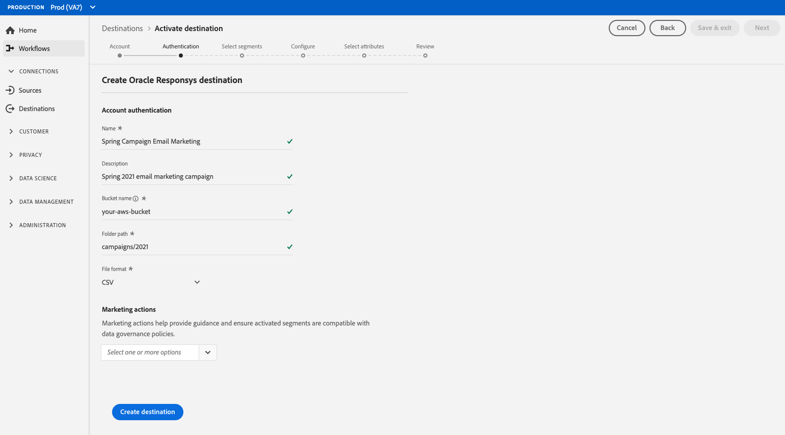

# [!DNL Oracle Responsys]

## 概要

[Responsys](https://www.oracle.com/marketingcloud/products/cross-channel-orchestration/)[!DNL Oracle] は、 が提供するクロスチャネルマーケティングキャンペーン用の大規模法人向け電子メールマーケティングツールで、電子メール、モバイル、ディスプレイおよびソーシャルでのインタラクションをパーソナライズします。

To send segment data to [!DNL Oracle Responsys], you must first [connect to the destination](#connect-destination) in Real-time Customer Data Platform, and then [set up a data import](#import-data-into-responsys) from your storage location into [!DNL Oracle Responsys].

## 書き出しタイプ {#export-type}

**プロファイルベース** — セグメントのすべてのメンバーを、必要なスキーマフィールド(例：電子メールアドレス、電話番号、姓)。 [宛先アクティベーションワークフローの属性を選択画面で選択](../../ui/activate-destinations.md#select-attributes)。

## 宛先の接続 {#connect-destination}

In **[!UICONTROL Connections]** > **[!UICONTROL Destinations]**, select [!DNL Oracle Responsys], then select **[!UICONTROL Connect destination]**.

クラウドストレージの宛先への接続を既に設定している場合は、**[!UICONTROL 認証]**&#x200B;手順で「**[!UICONTROL 既存のアカウント]**」を選択し、既存の接続を選択します。または、「**[!UICONTROL 新しいアカウント]**」を選択して、新しい接続を設定できます。アカウント認証資格情報を入力し、「**[!UICONTROL 宛先に接続]**」を選択します。For [!DNL Oracle Responsys], you can select between **[!UICONTROL SFTP with Password]** and **[!UICONTROL SFTP with SSH Key]**. 接続タイプに応じて、以下の情報を入力し、「**[!UICONTROL 宛先への接続]**」を選択します。

**[!UICONTROL SFTP（パスワード）]** で接続する場合は、ドメイン、ポート、ユーザー名、パスワードを指定する必要があります。

**[!UICONTROL SFTP（SSH キー）]** で接続する場合は、ドメイン、ポート、ユーザー名、SSH キーを指定する必要があります。

**[!UICONTROL 設定]**&#x200B;手順で、目的の宛先に関する情報を次のように入力します。
- **[!UICONTROL 名前]**：宛先の名前を選択します。
- **[!UICONTROL 説明]**：宛先の説明を入力します。
- **[!UICONTROL フォルダーパス]**：リアルタイム CDP が書き出しデータを CSV またはタブ区切りファイルとして格納するストレージの場所へのパスを指定します。
- **[!UICONTROL ファイル形式]**：**CSV** または **TAB_DELIMITED**。ストレージの場所に書き出すファイル形式を選択します。

上記のフィールドに入力した後、「**[!UICONTROL 宛先を作成]**」をクリックします。これで宛先が接続され、宛先への[セグメントをアクティブ化](../../ui/activate-destinations.md)できます。

## セグメントのアクティブ化 {#activate-segments}

セグメントのアクティベーションワークフローについて詳しくは、「[宛先へのプロファイルとセグメントのアクティブ化](../../ui/activate-destinations.md)」を参照してください。

## 宛先属性 {#destination-attributes}

When [activating segments](../../ui/activate-destinations.md) to the [!DNL Oracle Responsys] destination, we recommend that you select a unique identifier from your [union schema](../../../profile/home.md#profile-fragments-and-union-schemas). 宛先に書き出す一意の識別子およびその他の XDM フィールドを選択します。詳しくは、「電子メールマーケティングの宛先」の「[書き出したファイルの宛先属性として使用するスキーマフィールドの選択](./overview.md#destination-attributes)」を参照してください。

## 書き出されたデータ {#exported-data}

For [!DNL Oracle Responsys] destinations, Real-time CDP creates a tab-delimited `.txt` or `.csv` file in the storage location that you provided. これらのファイルについて詳しくは、セグメントアクティベーションチュートリアルの [電子メールマーケティングの宛先とクラウドストレージの宛先](../../ui/activate-destinations.md#esp-and-cloud-storage) （英語）を参照してください。

## Set up data import into [!DNL Oracle Responsys] {#import-data-into-responsys}

After connecting Real-time CDP to your [!DNL Amazon S3] or SFTP storage, you must set up the data import from your storage location into [!DNL Oracle Responsys]. To learn how to accomplish this, see [Importing contacts or accounts](https://docs.oracle.com/cloud/latest/marketingcs_gs/OMCEA/Connect_WizardUpload.htm) in the [!DNL Oracle Responsys Help Center].