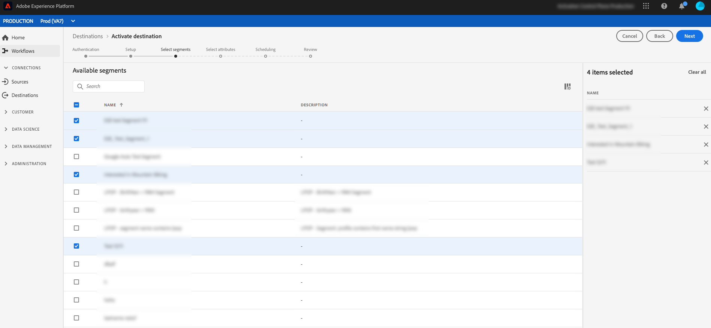

# 電子メールマーケティングの宛先の概要 {#email-marketing-destinations}

電子メールサービスプロバイダー（ESP）を使用すると、プロモーション電子メールキャンペーンの送信など、電子メールマーケティング活動を管理できます。Adobe Experience Platformは、電子メールマーケティングの宛先に対してセグメントをアクティブ化できるようにすることで、ESPと統合されます。

キャンペーンの電子メールマーケティングの宛先にセグメントを送信するには、まずPlatformが宛先に接続する必要があります。

電子メールマーケティングの宛先への接続は、3つの手順で行います（[宛先の設定](#connect-destination)、[セグメントのアクティブ化](#select-segments)、[ストレージの場所から宛先へのデータのインポート](#import-data-into-destination)）。 各手順について、このページで詳しく説明します。

次の節で説明する接続先フローで、[!DNL Amazon S3]または[!DNL SFTP]に接続します。 Platformは、セグメントを`.csv`ファイルとして書き出し、目的の場所に配信します。 [!DNL Platform]で有効になっているストレージの場所から、電子メールマーケティングプラットフォームにデータのインポートをスケジュールします。 データをインポートするプロセスは、パートナーごとに異なります。詳しくは、個々の宛先に関する記事を参照してください。

## 宛先の設定{#connect-destination}

**[!UICONTROL 接続]** > **[!UICONTROL 宛先]**&#x200B;で、接続先の電子メールマーケティングの宛先を選択し、「**[!UICONTROL 設定]**」を選択します。

**[!UICONTROL アカウント]**&#x200B;の手順で、電子メールマーケティングの宛先への接続を既に設定している場合は、「**[!UICONTROL 既存のアカウント]**」を選択し、既存の接続を選択します。 または、「**[!UICONTROL 新しいアカウント]**」を選択して、電子メールマーケティングの宛先への新しい接続を設定できます。 **[!UICONTROL 接続タイプ]**&#x200B;セレクターで、[!UICONTROL Amazon S3]、[!UICONTROL Azure Blob]、[!UICONTROL SFTP（パスワード：]）、[!UICONTROL SFTP（SSHキー：]）を選択できます。 接続タイプに応じて以下の情報を入力し、「**[!UICONTROL 接続]**」を選択します。

- **S3接続**&#x200B;の場合、AmazonアクセスキーIDとシークレットアクセスキーを指定する必要があります。
- **SFTP（パスワード**&#x200B;を使用）で接続する場合は、SFTPサーバーのドメイン、ポート、ユーザー名、パスワードを指定する必要があります。
- **SFTP（SSHキー**）で接続する場合は、SFTPサーバーにドメイン、ポート、ユーザー名、SSHキーを指定する必要があります。

必要に応じて、RSA形式の公開鍵を添付し、**[!UICONTROL Key]**&#x200B;セクションの下に書き出したファイルに暗号化を追加することもできます。 公開鍵は、[!DNL Base64]エンコードされた文字列として書き込む必要があります。

**[!UICONTROL 認証]**&#x200B;手順で、新しい宛先の名前と説明、および書き出すファイルのファイル形式を入力します。

前の手順で「 Amazon S3 」をストレージオプションとして選択した場合は、ファイルが配信されるクラウドストレージの宛先にバケット名とフォルダーパスを挿入します。 「 SFTPストレージ」オプションの場合は、ファイルが配信されるフォルダーパスを挿入します。

この手順では、この宛先に適用するマーケティングアクションも選択できます。 マーケティングアクションは、宛先にデータを書き出す目的を示します。 Adobe定義のマーケティングアクションから選択することも、独自のマーケティングアクションを作成することもできます。 マーケティングアクションの詳細については、「[データ使用ポリシーの概要](../../../data-governance/policies/overview.md)」を参照してください。

## エクスポート先に含めるセグメントメンバーを選択します{#select-segments}

**[!UICONTROL Select Segments]**&#x200B;ページで、宛先に送信するセグメントを選択します。 以下の節のフィールドについて詳しくは、を参照してください。

## ファイル名の設定

セグメントスケジュールとファイル名の編集オプションについて詳しくは、「宛先のアクティブ化」のチュートリアルの設定の手順を参照してください。

## 属性の選択 — 書き出したファイルの宛先属性として使用するスキーマフィールドを選択します。 {#destination-attributes}

この手順では、電子メールマーケティングの宛先に書き出すフィールドを選択し、必須のフィールドをマークします。
この手順について詳しくは、「宛先のアクティブ化」チュートリアルの[属性](../../ui/activate-destinations.md#select-attributes)の選択の手順を参照してください。

## ID {#identity}

Adobeでは、[和集合スキーマ](../../../profile/home.md#profile-fragments-and-union-schemas)から一意の識別子を選択することをお勧めします。 これは、ユーザーIDをキーオフにするフィールドです。 最も一般的に、このフィールドは電子メールアドレスですが、ロイヤリティープログラム ID や電話番号を指定することもできます。スキーマで最も一般的な一意の識別子とそのXDMフィールドについては、次の表を参照してください。

| 一意の ID | 統合スキーマの XDM フィールド |
|----------------- | ---------------------------|
| 電子メールアドレス | `personalEmail.address` |
| 電話番号 | `mobilePhone.number` |
| ロイヤリティープログラム ID | `Customer-defined XDM field` |

## その他の宛先属性

「スキーマ」フィールドセレクターで、電子メールの送信先に書き出しする他のフィールドを選択します。次のオプションが推奨されます。

| スキーマ | XDM フィールド |
|------ | ---------|
| 名 | `person.name.firstName` |
| 姓 | `person.name.lastName` |
| 電話番号 | `mobilePhone.number` |
| 住所（市区町村） | `homeAddress.city` |
| 住所（都道府県） | `homeAddress.stateProvince` |
| 住所（郵便番号） | `homeAddress.postalCode` |
| 誕生日 | `person.birthDayAndMonth` |
| セグメントのメンバーシップ | `segmentMembership.status` |

## ストレージの場所から宛先{#import-data-into-destination}にデータをインポートします

ストレージの場所から宛先にデータをインポートする方法については、個々の電子メールマーケティングの宛先に関する記事を参照してください。

- [Adobe Campaign](./adobe-campaign.md#import-data-into-campaign)
- [Oracle Eloqua](./oracle-eloqua.md#import-data-into-eloqua)
- [Oracle Responsys](./oracle-responsys.md#import-data-into-responsys)
- [Salesforce Marketing Cloud](./salesforce-marketing-cloud.md#import-data-into-salesforce)

## 電子メールマーケティングの宛先へのセグメントのアクティブ化

電子メールマーケティングの宛先に対してセグメントをアクティブ化する方法については、「[宛先へのプロファイルとセグメントのアクティブ化](../../ui/activate-destinations.md)」を参照してください。

## 追加のリソース

- [宛先へのデータのアクティブ化](../../ui/activate-destinations.md)
- [フローサービスAPIを使用した、電子メールマーケティングの宛先の作成とデータのアクティブ化](../../api/email-marketing.md)
