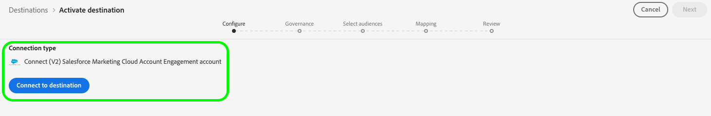
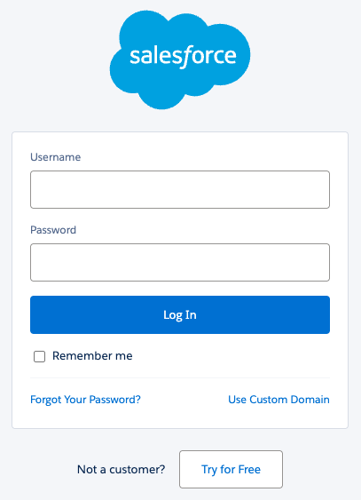
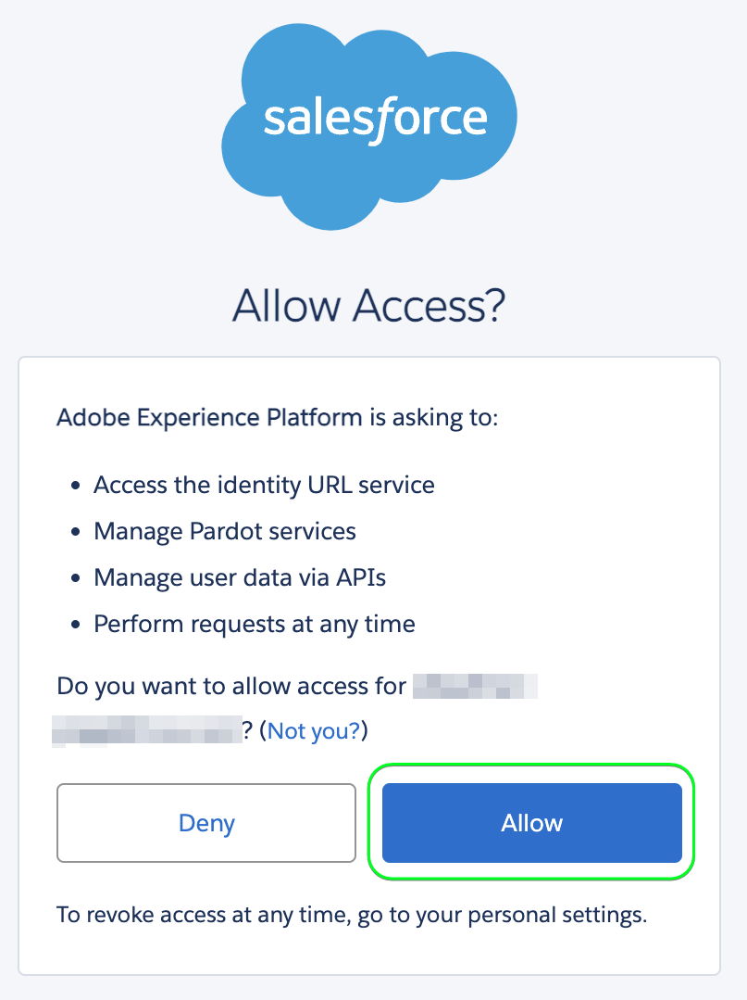
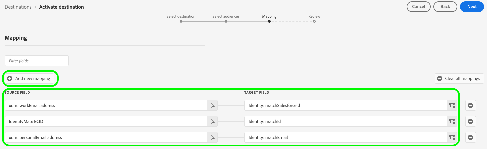
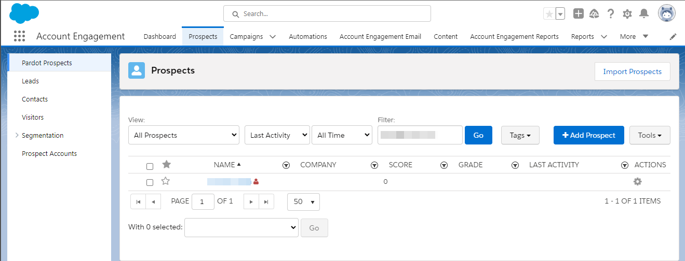

# [!DNL (V2) Salesforce Marketing Cloud Account Engagement] 接続

[[!DNL Salesforce Marketing Cloud Account Engagement]](https://www.salesforce.com/products/marketing-cloud/marketing-automation/) （旧称[!DNL Pardot]）の宛先は、[!DNL Adobe Experience Platform] プロファイルデータをSalesforceのB2B マーケティングオートメーションプラットフォームに書き出します。

この統合により、[!DNL Adobe Experience Platform]の顧客プロファイルと[!DNL Salesforce Marketing Cloud Account Engagement]のマーケティングキャンペーンとの間で、シームレスにデータを同期できるようになります。

この宛先では、[[!DNL Salesforce Import API v5]](https://developer.salesforce.com/docs/marketing/pardot/guide/import-v5.html)を使用して、バッチデータの書き出しを効率的に処理します。

>[!IMPORTANT]
>
> これは、[Salesforce Marketing Cloud Account Engagement](/help/destinations/catalog/email-marketing/salesforce-marketing-cloud-account-engagement.md)宛先のV2 バージョンです。 このバージョンは、以前の宛先に代わるもので、現在Alpha リリースにあります。
>  
> 現在[Salesforce Marketing Cloud Account Engagement](/help/destinations/catalog/email-marketing/salesforce-marketing-cloud-account-engagement.md)の以前のバージョンを使用している場合は、**2026**&#x200B;年1月2日までに、このV2 バージョンに移行する必要があります。 2026年1月以降、Adobeは以前のバージョンを廃止し、使用できなくなります。

## ユースケース {#use-cases}

[!DNL (V2) Marketing Cloud Account Engagement]宛先を使用する方法とタイミングをより理解しやすくするために、[!DNL Adobe Experience Platform]のお客様がこの宛先を使用して解決できるユースケースの例を次に示します。

### B2B リード管理 {#use-case-lead-management}

包括的なリードナーチャリングとスコアリングのために、[!DNL Adobe Experience Platform]から[!DNL Salesforce Marketing Cloud Account Engagement]までのリードデータを同期します。 マーケティング部門は、Adobe Experience Platformでリッチなオーディエンスプロファイルを構築し、それを[!DNL Salesforce Marketing Cloud Account Engagement]に書き出して、自動化されたB2B マーケティングキャンペーンを実施できます。

### キャンペーンの自動化 {#use-case-campaign-automation}

[!DNL Salesforce Marketing Cloud Account Engagement]で定義したオーディエンスを使用して、[!DNL Adobe Experience Platform]でマーケティングキャンペーンをトリガーできます。 ターゲットオーディエンスを[!DNL Salesforce]にエクスポートした後、それらを使用してメールキャンペーンを実行し、ナーチャリング、スコアリング、キャンペーンセグメンテーションを通じてリードを管理できます。

### プロファイルエンリッチメント {#use-case-profile-enrichment}

[!DNL Salesforce Marketing Cloud Account Engagement]の豊富な顧客データを使用して、[!DNL Adobe Experience Platform]の見込み客プロファイルを強化します。 包括的なプロファイル属性を書き出して、[!DNL Salesforce Marketing Cloud Account Engagement]でより詳細な見込み客レコードを作成し、ターゲティングとパーソナライゼーションを向上させます。

## 前提条件 {#prerequisites}

Experience Platformおよび[!DNL Salesforce]で設定する必要がある前提条件と、[!DNL (V2) Marketing Cloud Account Engagement]の宛先を操作する前に収集する必要がある情報については、以下の節を参照してください。

### Experience Platform の前提条件 {#prerequisites-in-experience-platform}

[!DNL (V2) Marketing Cloud Account Engagement]宛先にデータをアクティブ化する前に、[で](/help/xdm/schema/composition.md) スキーマ [、](../../../catalog/datasets/overview.md) データセット [、および](../../../segmentation/types/overview.md) オーディエンス [!DNL Experience Platform]を作成しておく必要があります。

### [!DNL Salesforce Marketing Cloud Account Engagement] 前提条件 {#prerequisites-destination}

Experience Platformから[!DNL Marketing Cloud Account Engagement] アカウントにデータをエクスポートするには、次の前提条件に注意してください。

#### [!DNL Marketing Cloud Account Engagement] アカウントが必要です {#prerequisites-account}

続行するには、[!DNL Marketing Cloud Account Engagement]Marketing Cloud Account Engagement[製品のサブスクリプションを持つ](https://www.salesforce.com/products/marketing-cloud/marketing-automation/) アカウントが必須です。

#### [!DNL Marketing Cloud Account Engagement] 資格情報の収集 {#gather-credentials}

[!DNL (V2) Marketing Cloud Account Engagement]宛先に対する認証を行う前に、以下の項目を書き留めてください。

| 資格情報 | 説明 |
| --- | --- |
| **[!UICONTROL Account Engagement Business Unit ID]** | [!DNL Salesforce] アカウントのエンゲージメント事業部ID。 IDの検索方法については、Salesforce [ ドキュメント ](https://help.salesforce.com/s/articleView?id=000381973&type=1)を参照してください。 |

{style="table-layout:auto"}

## サポートされている ID {#supported-identities}

[!DNL (V2) Marketing Cloud Account Engagement]は、次の表に示すIDのアクティブ化をサポートしています。 [ID](/help/identity-service/features/namespaces.md) についての詳細情報。

これらの識別子のいずれかを使用して一致が見つかった場合、既存のアカウントエンゲージメントの見込み顧客レコードが[!DNL Adobe Experience Platform]のデータで更新されます。 一致するものが見つからない場合は、アカウントエンゲージメントに新しい見込み客レコードが作成されます。

| ターゲット ID | 説明 | 注意点 |
|---|---|---|
| `matchId` | アカウントエンゲージメントの見込み客ID | この3つのIDのうち少なくとも1つが必要です |
| `matchSalesforceId` | 見込客のSalesforce リード/コンタクト ID | この3つのIDのうち少なくとも1つが必要です |
| `matchEmail` | 見込み客のメールアドレス | この3つのIDのうち少なくとも1つが必要です |

{style="table-layout:auto"}

## サポートされるオーディエンス {#supported-audiences}

この節では、この宛先に書き出すことができるオーディエンスのタイプについて説明します。

| オーディエンスの由来 | サポートあり | 説明 |
|---------|----------|----------|
| [!DNL Segmentation Service] | ○ | Experience Platform [ セグメント化サービス ](../../../segmentation/home.md)を通じて生成されたオーディエンス。 |
| その他すべてのオーディエンスの生成元 | ○ | このカテゴリには、[!DNL Segmentation Service]を通じて生成されたオーディエンス以外のすべてのオーディエンスのオリジンが含まれます。 [様々なオーディエンスの起源](/help/segmentation/ui/audience-portal.md#customize)について読みます。 次に例を示します。 <ul><li> カスタムアップロードオーディエンス [がCSV ファイルからExperience Platformに](../../../segmentation/ui/audience-portal.md#import-audience)をインポートしました。</li><li> 類似オーディエンス， </li><li> 連合オーディエンス， </li><li> [!DNL Adobe Journey Optimizer]などの他のExperience Platform アプリで生成されたオーディエンス </li><li> その他。 </li></ul> |

{style="table-layout:auto"}

オーディエンスのデータタイプ別にサポートされるオーディエンス：

| オーディエンスのデータタイプ | サポートあり | 説明 | ユースケース |
|--------------------|-----------|-------------|-----------|
| [人物オーディエンス ](/help/segmentation/types/people-audiences.md) | ○ | 顧客プロファイルにもとづいて、マーケティング施策の特定のグループをターゲットにすることができます。 | 買い物客やカートの放棄が多い |
| [ アカウントオーディエンス ](/help/segmentation/types/account-audiences.md) | × | アカウントベースドマーケティング戦略のために、特定の組織内の個人をターゲットにします。 | B2B マーケティング |
| [見込みオーディエンス ](/help/segmentation/types/prospect-audiences.md) | × | まだ顧客ではないが、ターゲットオーディエンスと特徴を共有する個人をターゲットにします。 | サードパーティデータによる見込み顧客の開拓 |
| [ データセットの書き出し](/help/catalog/datasets/overview.md) | × | [!DNL Adobe Experience Platform] データ レイクに保存されている構造化データのコレクション。 | レポート，データサイエンスワークフロー |

{style="table-layout:auto"}

## 書き出しのタイプと頻度 {#export-type-frequency}

宛先の書き出しのタイプと頻度について詳しくは、以下の表を参照してください。

| 項目 | タイプ | メモ |
|---------|----------|---------|
| 書き出しタイプ | **[!UICONTROL Profile-based]** | <ul><li>オーディエンスのすべてのメンバーを、フィールドマッピングに従って、目的のスキーマフィールド *（例：電子メールアドレス、電話番号、姓）*&#x200B;と共に書き出します。</li><li>この宛先は、Salesforce Import API v5を使用したプロファイルデータのバッチエクスポートをサポートしています。</li></ul> |
| 書き出し頻度 | **[!UICONTROL Batch]** | <ul><li>**初期書き出し**: マッピング直後の完全な書き出し</li><li>**その後の書き出し**:3時間ごとに増分エクスポート</li><li>このスケジュールは固定されており、Alphaではカスタマイズできません</li></ul> |

{style="table-layout:auto"}

## 宛先への接続 {#connect}

>[!IMPORTANT]
>
>宛先に接続するには、**[!UICONTROL View Destinations]**&#x200B;および&#x200B;**[!UICONTROL Manage Destinations]** [ アクセス制御権限](/help/access-control/home.md#permissions)が必要です。 詳しくは、[アクセス制御の概要](/help/access-control/ui/overview.md)または製品管理者に問い合わせて、必要な権限を取得してください。

この宛先に接続するには、[宛先設定のチュートリアル](../../ui/connect-destination.md)の手順に従ってください。宛先の設定ワークフローで、以下の 2 つのセクションにリストされているフィールドに入力します。

### 宛先に対する認証 {#authenticate}

宛先に対する認証を行うには、**[!UICONTROL Connect to destination]**&#x200B;を選択します。

[!DNL Salesforce] ログインページにリダイレクトされます。 [!DNL Marketing Cloud Account Engagement] アカウントの資格情報を入力し、**[!UICONTROL Log In]**&#x200B;を選択します。

次に、**[!UICONTROL Allow]**&#x200B;を選択して、**[!DNL Adobe Experience Platform]** アプリに[!DNL Salesforce Marketing Cloud Account Engagement] アカウントへのアクセス権を付与します。 *この操作は1回のみ行う必要があります*。

指定された詳細が有効な場合、UIに次のメッセージが表示されます。*正常に（V2） Salesforce Marketing Cloud Account Engagement account*&#x200B;に接続し、緑色のチェックマークが付いた&#x200B;**[!UICONTROL Connected]** ステータス。

### 宛先の詳細を入力 {#destination-details}

宛先の詳細を設定するには、以下の必須フィールドとオプションフィールドに入力します。UI のフィールドの横のアスタリスクは、そのフィールドが必須であることを示します。

* **[!UICONTROL Name]**：今後この宛先を認識する際に使用する名前。
* **[!UICONTROL Description]**：今後この宛先を特定するのに役立つ説明です。
* **[!UICONTROL Account Engagement Business Unit ID]**：あなたの[!DNL Salesforce] `Account Engagement Business Unit ID`。
* **[!UICONTROL Account Engagement API]**: Account Engagement APIの実稼動用（`https://pi.pardot.com`）エンドポイントとデモ用（`https://pi.demo.pardot.com`）エンドポイントのどちらを使用するかを選択します。
* **[!UICONTROL Account Engagement Campaign ID]**: [!DNL Account Engagement]件の見込み客ごとに1つのキャンペーンに関連付ける必要があります。 キャンペーン IDを設定しない場合、Salesforce アカウントにデフォルトが存在する場合、Account Engagementは自動的に割り当てようとします。

### アラートの有効化 {#enable-alerts}

アラートを有効にすると、宛先へのデータフローのステータスに関する通知を受け取ることができます。リストからアラートを選択して、データフローのステータスに関する通知を受け取るよう登録します。アラートについて詳しくは、[UI を使用した宛先アラートの購読](../../ui/alerts.md)についてのガイドを参照してください。

宛先接続の詳細の提供が完了したら、**[!UICONTROL Next]**&#x200B;を選択します。

## この宛先に対してオーディエンスをアクティブ化 {#activate}

>[!IMPORTANT]
>
>* データをアクティブ化するには、**[!UICONTROL View Destinations]**、**[!UICONTROL Activate Destinations]**、**[!UICONTROL View Profiles]**&#x200B;および&#x200B;**[!UICONTROL View Segments]** [ アクセス制御権限](/help/access-control/home.md#permissions)が必要です。 [アクセス制御の概要](/help/access-control/ui/overview.md)を参照するか、製品管理者に問い合わせて必要な権限を取得してください。
>* *ID*&#x200B;をエクスポートするには、**[!UICONTROL View Identity Graph]** [ アクセス制御権限](/help/access-control/home.md#permissions)が必要です。  {width="100" zoomable="yes"}

この宛先に対してオーディエンスをアクティブ化する手順については、[バッチプロファイル書き出し宛先に対するオーディエンスデータのアクティブ化](/help/destinations/ui/activate-batch-profile-destinations.md)を参照してください。

### マッピングの考慮事項と例 {#mapping-considerations-example}

[!DNL Adobe Experience Platform]から[!DNL (V2) Marketing Cloud Account Engagement]宛先にオーディエンスデータを送信するには、Experience Data Model （XDM）スキーマフィールドを宛先の対応するフィールドにマッピングする必要があります。

サポートされているフィールドの完全なリストについては、[Salesforce Prospect API v5 ドキュメント ](https://developer.salesforce.com/docs/marketing/pardot/guide/prospect-v5.html)を参照してください。 [ カスタムフィールド ](https://developer.salesforce.com/docs/marketing/pardot/guide/custom-field-v5.html)は、Alpha リリースではサポートされていません。

#### サポートされる属性 {#supported-attributes}

Salesforce Marketing Cloud Account Engagementの宛先は、次の表に示すターゲット属性をサポートしています。

| 属性 | タイプ | 説明 |
|---------|----------|----------|
| `salesforceId` | 文字列 | 見込客のSalesforce ID |
| `salesforceOwnerId` | 整数 | 見込客オーナーのSalesforceユーザーID |
| `salutation` | 文字列 | 見込客への挨拶（例：Mr. |
| `score` | 整数 | アカウントエンゲージメントにおける見込み客のスコア |
| `source` | 文字列 | 見込み客レコードのソース |
| `state` | 文字列 | 見込み客の都道府県 |
| `territory` | 文字列 | 見込み客に割り当てられた地域 |
| `userId` | 整数 | 見込客に関連付けられたユーザーID |
| `website` | 文字列 | 見込み客のweb サイト URL |
| `yearsInBusiness` | 文字列 | 見込み客がビジネスを開始した年数 |
| `zip` | 文字列 | 見込み客の郵便番号 |

#### 必須のマッピング {#required-mappings}

データのマッピングを開始する前に、以下の必須フィールドマッピングを確認してください。

| ターゲットフィールド | タイプ | 必須 | 使用するタイミング |
|---|---|---|---|
| `email` | 属性 | 常に必須 | 見込み客のメールアドレス。 これは、`matchId`または`matchSalesforceId`を持っていない場合に、アカウントエンゲージメントで見込み客レコードを検索して一致させるための主要な識別子です。  **注意：** アカウントエンゲージメントの「同じメールアドレスで複数の見込み客を許可」機能を使用すると、同じメールアドレスを持つ複数の見込み客がある場合、メールのみに依存すると曖昧になる可能性があります。 通常、アカウントエンゲージメントでは、最新のアクティビティを使用して見込み客を更新します。 |
| `matchId` | ID | この3つのIDのうち少なくとも1つが必要です | 個々の見込み顧客レコードに対して、アカウントエンゲージメントによって生成された一意のID。 既にアカウントエンゲージメントの見込み顧客IDがあり、複数の見込み客が同じメールアドレスを共有している場合に、特に更新が正しい見込み客に適用されるようにしたい場合に使用します。 |
| `matchSalesforceId` | ID | この3つのIDのうち少なくとも1つが必要です | Salesforceのリードまたは連絡先のSalesforce ID。 このオプションは、見込み顧客が既にSalesforceと同期されている場合に使用し、Account EngagementとSalesforceの間でデータの一貫性を維持します。 |
| `matchEmail` | ID | この3つのIDのうち少なくとも1つが必要です | 照合に使用される見込み客のメールアドレス。 これは、特定のアカウントエンゲージメント見込み顧客IDまたはSalesforce IDがない場合の代替IDとして使用します。 注意：複数の見込み客が同じメールアドレスを共有する場合、アカウントエンゲージメントは通常、最新のアクティビティで見込み客を更新します。 |

次の手順に従って、正しいフィールドをマッピングします。

1. **[!UICONTROL Mapping]** ステップで、**[!UICONTROL Add new mapping]**&#x200B;を選択します。 画面に新しいマッピング行が表示されます。
1. **[!UICONTROL Select source field]** ウィンドウで、**[!UICONTROL Select attributes]** カテゴリを選択してXDM属性を選択するか、**[!UICONTROL Select identity namespace]**&#x200B;を選択してIDを選択します。
1. **[!UICONTROL Select target field]** ウィンドウで、**[!UICONTROL Select identity namespace]**&#x200B;を選択してIDを選択するか、**[!UICONTROL Select custom attributes]** カテゴリを選択し、標準アカウントエンゲージメント見込み顧客フィールドのリストから指定します。

## データの書き出しを検証する {#exported-data}

宛先が正しく設定されていることを検証するには、次の手順に従います。

1. 選択したオーディエンスのいずれかに移動します。 「**[!DNL Activation data]**」タブを選択します。**[!UICONTROL Mapping ID]**&#x200B;列には、[!DNL Marketing Cloud Account Engagement Prospects] ページ内で生成されたカスタムフィールドの名前が表示されます。
   

1. [[!DNL Salesforce]](https://login.salesforce.com/) Web サイトに移動します。 次に、**[!DNL Account Engagement]** > **[!DNL Prospects]** > **[!DNL Pardot Prospects]** ページに移動し、オーディエンスの見込み客が追加または更新されたかどうかを確認します。 または、[[!DNL Account Engagement]](https://pi.pardot.com/)にアクセスして&#x200B;**[!DNL Prospects]** ページにアクセスすることもできます。
   

1. 見込み客が更新されたかどうかを確認するには、見込み客を選択し、カスタム見込み客フィールドがExperience Platform オーディエンスのステータスで更新されているかどうかを確認します。
   

## データの使用とガバナンス {#data-usage-governance}

[!DNL Adobe Experience Platform] のすべての宛先は、データを処理する際のデータ使用ポリシーに準拠しています。[!DNL Adobe Experience Platform] がどのようにデータガバナンスを実施するかについて詳しくは、[データガバナンスの概要](/help/data-governance/home.md)を参照してください。

## その他のリソース {#additional-resources}

* [!DNL Marketing Cloud Account Engagement] [API ドキュメント ](https://developer.salesforce.com/docs/marketing/pardot/guide/overview.html)
* [Salesforce Import API v5 ドキュメント ](https://developer.salesforce.com/docs/marketing/pardot/guide/import-v5.html)
* [Salesforce Prospect API v5 ドキュメント ](https://developer.salesforce.com/docs/marketing/pardot/guide/prospect-v5.html)
