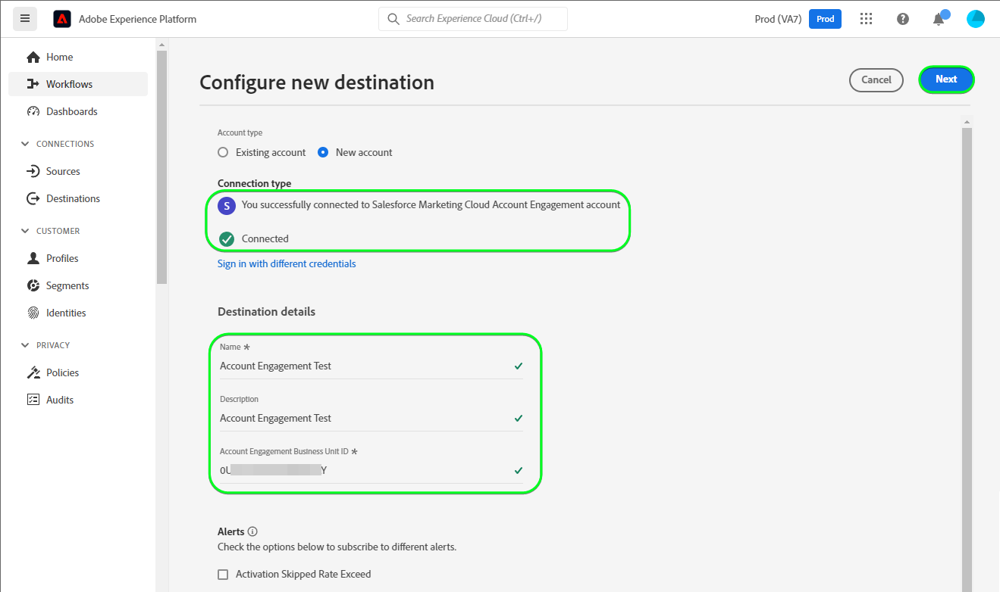

# [!DNL Salesforce Marketing Cloud Account Engagement] 接続

以下を使用します。 [[!DNL Salesforce Marketing Cloud Account Engagement]](https://www.salesforce.com/products/marketing-cloud/marketing-automation/) *( 旧称： [!DNL Pardot])* リードをキャプチャ、トラッキング、スコアリングおよびグレードする宛先。 また、電子メールドリップキャンペーンや、育成、スコアリング、キャンペーンのセグメント化を使用したリード管理を通じて、ターゲット市場のオーディエンスや顧客グループ向けに、パイプラインのすべてのステージのリードトラックを設計できます。

比較対象 [!DNL Salesforce Marketing Cloud Engagement] それはより向いている **B2C** マーケティング [!DNL Marketing Cloud Account Engagement] はに最適です。 **B2B** 販売サイクルと決定サイクルを長くする必要がある複数の部門や意思決定者が関与する使用例 また、CRM との近接性と統合を維持し、適切な販売およびマーケティングの決定を下すこともできます。 *注意：Experience Platformには、 [!DNL Salesforce Marketing Cloud Engagement]を使用する場合、 [[!DNL Salesforce Marketing Cloud]](/help/destinations/catalog/email-marketing/salesforce-marketing-cloud.md) および [[!DNL (API) Salesforce Marketing Cloud]](/help/destinations/catalog/email-marketing/salesforce-marketing-cloud-exact-target.md) ページ。*

この [!DNL Adobe Experience Platform] [宛先](/help/destinations/home.md) は、 [[!DNL Salesforce Account Engagement API > Prospect Upsert by Email]](https://developer.salesforce.com/docs/marketing/pardot/guide/prospect-v5.html#prospect-upsert-by-email) 端点、宛先 **リードを追加または更新** 新しい [!DNL Marketing Cloud Account Engagement] セグメント。

[!DNL Marketing Cloud Account Engagement] は、OAuth 2 と認証コードプロトコルを使用して、 [!DNL Account Engagement] API. [!DNL Marketing Cloud Account Engagement] インスタンスを認証する手順は、さらに下の[宛先に対する認証](#authenticate)の節にあります。

## ユースケース {#use-cases}

[!DNL Marketing Cloud Account Engagement] 宛先を使用する方法とタイミングを理解しやすくするために、Adobe Experience Platform のお客様がこの宛先を使用して解決できるユースケースのサンプルを以下に示します。

### マーケティングキャンペーン用の連絡先へのメールの送信 {#use-case-send-emails}

オンラインプラットフォームのマーケティング部門は、B2B リードの厳選されたオーディエンスに電子メールベースのマーケティングキャンペーンをブロードキャストしたいと考えています。 プラットフォームのマーケティングチームは、Adobe Experience Platformを通じて新しいリードを追加したり、既存のリード情報を更新したり、独自のオフラインデータからオーディエンスを構築したり、これらのオーディエンスを [!DNL Marketing Cloud Account Engagement]：マーケティングキャンペーンの電子メールの送信に使用できます。

## 前提条件 {#prerequisites}

Experience Platformおよびで設定する必要がある前提条件については、以下の節を参照してください。 [!DNL Salesforce] また、を使用する前に収集する必要がある情報についても同様です。 [!DNL Marketing Cloud Account Engagement] 宛先。

### Experience Platformの前提条件 {#prerequisites-in-experience-platform}

[!DNL Marketing Cloud Account Engagement] 宛先へのデータをアクティブ化する前に、[スキーマ](/help/xdm/schema/composition.md)、[データセット](https://experienceleague.adobe.com/docs/platform-learn/tutorials/data-ingestion/create-datasets-and-ingest-data.html?lang=ja)および[セグメント](https://experienceleague.adobe.com/docs/platform-learn/tutorials/segments/create-segments.html)を [!DNL Experience Platform] で作成する必要があります。

### の前提条件 [!DNL Marketing Cloud Account Engagement] {#prerequisites-destination}

Platform からにデータを書き出すための次の前提条件に注意してください。 [!DNL Marketing Cloud Account Engagement] アカウント：

#### [!DNL Marketing Cloud Account Engagement] アカウントが必要です {#prerequisites-account}

A [!DNL Marketing Cloud Account Engagement] のサブスクリプションを持つアカウント [Marketing Cloudアカウントエンゲージメント](https://www.salesforce.com/products/marketing-cloud/marketing-automation/) 続行するには、製品が必須です。

お使いの [!DNL Salesforce] アカウントには [!DNL Salesforce] `Account Engagement Administrator role`. これは次の場合に必要です。 [カスタム見込み客フィールドの作成](https://help.salesforce.com/s/articleView?id=sf.pardot_fields_create_custom_field.htm&amp;type=5).

最後に、アカウントが [[!DNL Account Engagement Lightning App]](https://help.salesforce.com/s/articleView?id=sf.pardot_lightning_enable.htm&amp;type=5).

次の場所に移動： [[!DNL Salesforce] サポート](https://www.salesforce.com/company/contact-us/?d=cta-glob-footer-10) または [!DNL Salesforce] アカウント管理者 ( アカウントがない場合や、アカウントに [!DNL Marketing Cloud Account Engagement] 配信登録または [!DNL Account Engagement Administrator role].

#### [!DNL Marketing Cloud Account Engagement] 資格情報の収集 {#gather-credentials}

を認証する前に、以下の項目をメモしておきます。 [!DNL Marketing Cloud Account Engagement] 宛先。

| 資格情報 | 説明 |
| --- | --- |
| `Username` | お使いの [!DNL Marketing Cloud Account Engagement] アカウントのユーザー名。 |
| `Password` | お使いの [!DNL Marketing Cloud Account Engagement] アカウントのパスワード。 |
| `Account Engagement Business Unit ID` | アカウントエンゲージメントビジネスユニット ID を見つけるには、 [!DNL Salesforce]. 「設定」から、 *ビジネスユニットの設定* をクリックします。 アカウントエンゲージメントビジネスユニット ID は、次の値で始まります。 `0Uv` 長さは 18 文字です。 ビジネスユニットの設定情報にアクセスできない場合は、 [!DNL Salesforce] アカウント管理者に問い合わせて、 `Account Engagement Business Unit ID`. 追加のガイダンスが必要な場合は、 [[!DNL Salesforce] 認証](https://developer.salesforce.com/docs/marketing/pardot/guide/authentication) ガイドラインページを参照してください。 |

{style="table-layout:auto"}

### ガードレール {#guardrails}

詳しくは、 [!DNL Marketing Cloud Account Engagement] [レート制限](https://developer.salesforce.com/docs/marketing/pardot/guide/overview.html#rate-limits) この制限は、計画で課せられた制限の詳細を示し、Experience Platformの実行にも適用されます。

>[!IMPORTANT]
>
>次の場合、 [!DNL Salesforce] アカウント管理者が信頼済み IP 範囲へのアクセスを制限しています。アカウント管理者に連絡して、 [Experience PlatformIP](/help/destinations/catalog/streaming/ip-address-allow-list.md) 許可リストに加える。 詳しくは、 [!DNL Salesforce] [接続アプリの信頼済み IP 範囲へのアクセスを制限する](https://help.salesforce.com/s/articleView?id=sf.connected_app_edit_ip_ranges.htm&amp;type=5) 追加のガイダンスが必要な場合は、ドキュメントを参照してください。

## サポートされている ID {#supported-identities}

[!DNL Marketing Cloud Account Engagement] では、以下の表で説明する ID のアクティベーションをサポートしています。[ID](/help/identity-service/namespaces.md) についての詳細情報。

| ターゲット ID | 説明 | 注意点 |
|---|---|---|
| メール | 見込み客のメールアドレス | 必須 |

{style="table-layout:auto"}

## 書き出しのタイプと頻度 {#export-type-frequency}

宛先の書き出しのタイプと頻度について詳しくは、以下の表を参照してください。

| 項目 | タイプ | メモ |
---------|----------|---------|
| 書き出しタイプ | **[!UICONTROL プロファイルベース]** | <ul><li>セグメントのすべてのメンバーを、フィールドマッピングに従って、必要なスキーマフィールドと共に書き出します&#x200B;*（例：メールアドレス、電話番号、姓）*。</li><li> Platform で選択した各オーディエンスに対して、 [!DNL Salesforce Marketing Cloud Account Engagement] セグメントのステータスは、Platform からのオーディエンスのステータスに合わせて更新されます。</li></ul> |
| 書き出し頻度 | **[!UICONTROL ストリーミング]** | ストリーミングの宛先は常に、API ベースの接続です。オーディエンス評価に基づいて Experience Platform 内でプロファイルが更新されるとすぐに、コネクタは更新を宛先プラットフォームに送信します。詳しくは、[ストリーミングの宛先](/help/destinations/destination-types.md#streaming-destinations)を参照してください。 |

{style="table-layout:auto"}

## 宛先への接続 {#connect}

>[!IMPORTANT]
>
>宛先に接続するには、**[!UICONTROL 宛先の管理]** [アクセス制御権限](/help/access-control/home.md#permissions)が必要です。詳しくは、[アクセス制御の概要](/help/access-control/ui/overview.md)または製品管理者に問い合わせて、必要な権限を取得してください。

この宛先に接続するには、[宛先設定のチュートリアル](../../ui/connect-destination.md)の手順に従ってください。宛先の設定ワークフローで、以下の 2 つのセクションにリストされているフィールドに入力します。

Within **[!UICONTROL 宛先]** > **[!UICONTROL カタログ]**、を検索します。 [!DNL Salesforce Marketing Cloud Account Engagement]. または、 **[!UICONTROL 電子メールマーケティング]** カテゴリ。

### 宛先に対する認証 {#authenticate}

宛先を認証するには、「 **[!UICONTROL 宛先に接続]**」を選択します。
次のページに移動します： [!DNL Salesforce] ログインページ。 を入力します。 [!DNL Marketing Cloud Account Engagement] アカウントの資格情報を選択します。 [!DNL Log In].

次に、「 [!UICONTROL 許可] を次のウィンドウに追加して、 **Adobe Experience Platform** アプリから [!DNL Salesforce Marketing Cloud Account Engagement] アカウント。 *必要な操作は 1 回だけです*.

指定した詳細が有効な場合は、UI に次のメッセージが表示されます。 *Salesforce アカウントエンゲージメントアカウントに正常にMarketing Cloudしました* メッセージと **[!UICONTROL 接続済み]** ステータスに緑色のチェックマークが付いている場合は、次の手順に進むことができます。

### 宛先の詳細を入力 {#destination-details}

宛先の詳細を設定するには、以下の必須フィールドとオプションフィールドに入力します。UI のフィールドの横のアスタリスクは、そのフィールドが必須であることを示します。詳しくは、[ [!DNL Marketing Cloud Account Engagement]  資格情報の収集](#gather-credentials)の節を参照してください。

| フィールド | 説明 |
| --- | --- |
| **[!UICONTROL 名前]** | 将来この宛先を認識するための名前。 |
| **[!UICONTROL 説明]** | 今後この宛先を識別するのに役立つ説明。 |
| **[!UICONTROL アカウントエンゲージメントビジネスユニット ID]** | お使いの [!DNL Salesforce] `Account Engagement Business Unit ID`. |

{style="table-layout:auto"}

### アラートの有効化 {#enable-alerts}

アラートを有効にすると、宛先へのデータフローのステータスに関する通知を受け取ることができます。リストからアラートを選択して、データフローのステータスに関する通知を受け取るよう登録します。アラートについて詳しくは、[UI を使用した宛先アラートの購読](../../ui/alerts.md)についてのガイドを参照してください。

宛先接続の詳細の入力を終えたら「**[!UICONTROL 次へ]**」を選択します。

## この宛先に対してオーディエンスをアクティブ化 {#activate}

>[!IMPORTANT]
> 
>* データをアクティブ化するには、**[!UICONTROL 宛先の管理]**、**[!UICONTROL 宛先のアクティブ化]**、**[!UICONTROL プロファイルの表示]**&#x200B;および&#x200B;**[!UICONTROL セグメントの表示]** [に対するアクセス制御権限](/help/access-control/home.md#permissions)が必要です。詳しくは、[アクセス制御の概要](/help/access-control/ui/overview.md)または製品管理者に問い合わせて、必要な権限を取得してください。
>* 書き出す *id*、 **[!UICONTROL ID グラフを表示]** [アクセス制御権限](/help/access-control/home.md#permissions).   {width="100" zoomable="yes"}

この宛先にオーディエンスをアクティベートする手順は、[ストリーミングオーディエンスの書き出し宛先へのプロファイルとオーディエンスのアクティベート](/help/destinations/ui/activate-segment-streaming-destinations.md)を参照してください。

### マッピングの考慮事項と例 {#mapping-considerations-example}

Adobe Experience Platform から [!DNL Marketing Cloud Account Engagement] 宛先にオーディエンスデータを正しく送信するには、フィールドマッピングの手順を実行する必要があります。マッピングは、Platform アカウント内の Experience Data Model（XDM）スキーマフィールドと、ターゲット宛先から対応する同等のスキーマフィールドとの間にリンクを作成して構成されます。 

XDM フィールドを [!DNL Marketing Cloud Account Engagement] 宛先フィールドには、次の手順に従います。

1. **[!UICONTROL マッピング]**&#x200B;手順で、「**[!UICONTROL 新しいマッピングを追加]**」を選択します。画面に新しいマッピング行が表示されます。
1. Adobe Analytics の **[!UICONTROL ソースフィールドを選択]** ウィンドウで、 **[!UICONTROL 属性を選択]** カテゴリを選択して XDM 属性を選択するか、 **[!UICONTROL ID 名前空間を選択]** ID を選択します。
1. Adobe Analytics の **[!UICONTROL ターゲットフィールドを選択]** ウィンドウで、 **[!UICONTROL ID 名前空間を選択]** ID を選択するか、 **[!UICONTROL カスタム属性を選択]** カテゴリを選択し、 [[!DNL Prospect API fields]](https://developer.salesforce.com/docs/marketing/pardot/guide/prospect-v5.html#fields) を使用可能なスキーマから取得します。

   * XDM プロファイルスキーマとのマッピングを追加するには、以下の手順を繰り返します。 [!DNL Marketing Cloud Account Engagement]: |ソースフィールド |ターゲットフィールド |必須 | | — | — | — | |`IdentityMap: Email`|`Identity: email`|はい | |`xdm: MailingAddress.city`|`xdm: city`| | |`xdm: person.name.firstName`|`Attribute: firstName`| |

   * 上記のマッピングの例を次に示します。
     

宛先接続のマッピングの指定が完了したら、「 」を選択します。 **[!UICONTROL 次へ]**.

## データの書き出しを検証する {#exported-data}

宛先が正しく設定されていることを検証するには、次の手順に従います。

1. 選択したオーディエンスの 1 つに移動します。 「**[!DNL Activation data]**」タブを選択します。The **[!UICONTROL マッピング ID]** 列には、 [!DNL Marketing Cloud Account Engagement Prospects] ページに貼り付けます。
   

1. にログインします。 [[!DNL Salesforce]](https://login.salesforce.com/) web サイト。 次に、 **[!DNL Account Engagement]** > **[!DNL Prospects]** > **[!DNL Pardot Prospects]** ページを開き、オーディエンスからの見込み客が追加/更新されたかどうかを確認します。 または、 [[!DNL Salesforce Pardot]](https://pi.pardot.com/) をクリックし、 **[!DNL Prospects]** ページに貼り付けます。
   

1. 見込み客が更新されたかどうかを確認するには、見込み客を選択し、カスタム見込み客フィールドがExperience Platformのオーディエンスステータスで更新されたかどうかを確認します。
   

## データの使用とガバナンス {#data-usage-governance}

[!DNL Adobe Experience Platform] のすべての宛先は、データを処理する際のデータ使用ポリシーに準拠しています。[!DNL Adobe Experience Platform] がどのようにデータガバナンスを実施するかについて詳しくは、[データガバナンスの概要](/help/data-governance/home.md)を参照してください。

## その他のリソース {#additional-resources}

* [!DNL Marketing Cloud Account Engagement] [API ドキュメント](https://developer.salesforce.com/docs/marketing/pardot/guide/overview.html).
