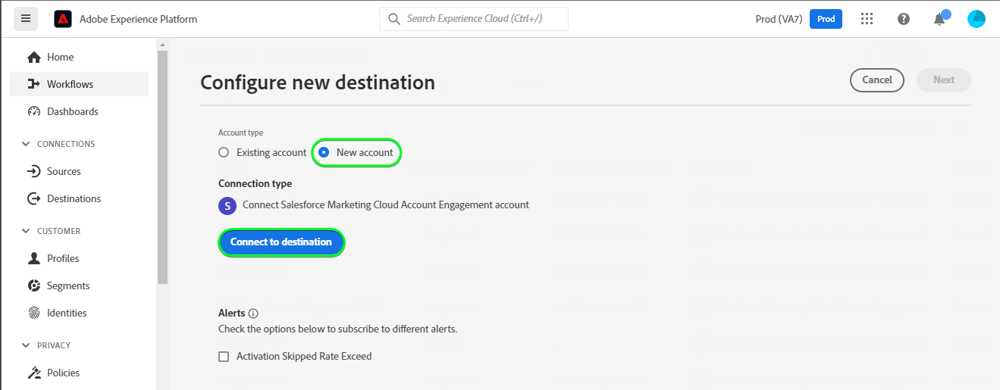
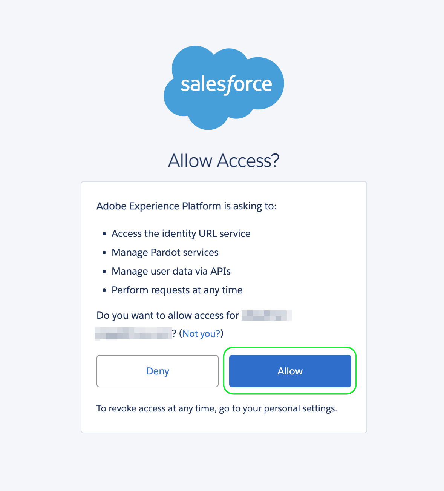
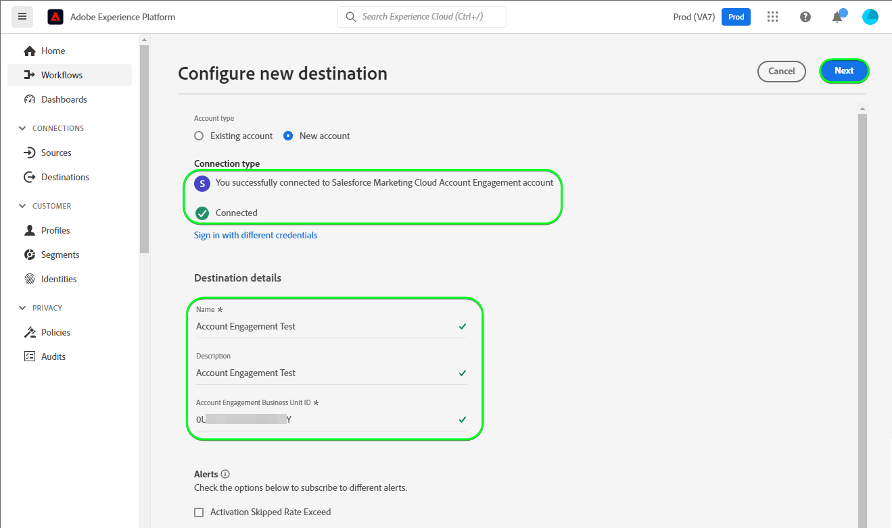
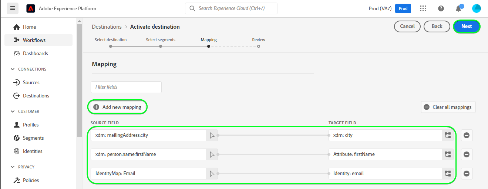
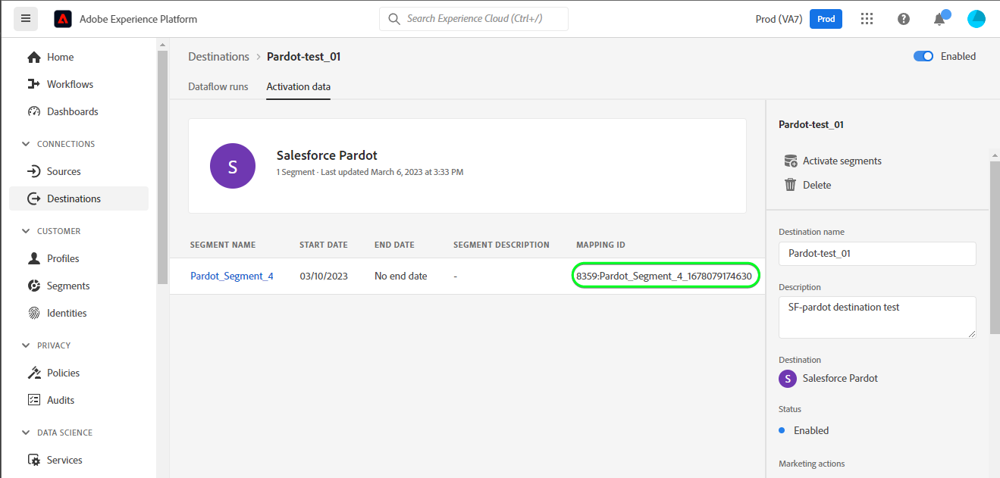
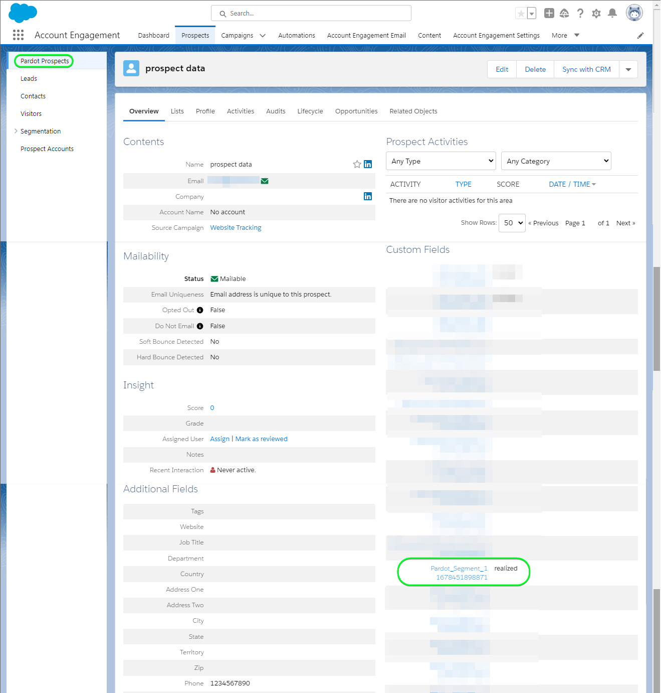

# [!DNL Salesforce Marketing Cloud Account Engagement] 接続

[[!DNL Salesforce Marketing Cloud Account Engagement]](https://www.salesforce.com/products/marketing-cloud/marketing-automation/) *（旧称[!DNL Pardot]）*&#x200B;の宛先を使用して、リードを獲得、追跡、スコアリング、採点します。 また、ドリップメール施策や、ナーチャリング、スコアリング、キャンペーンセグメンテーションによるリード管理を通じて、ターゲットを絞った市場オーディエンスや顧客グループに向けて、パイプラインのあらゆるステージのリードトラックを設計することもできます。

[!DNL Salesforce Marketing Cloud Engagement]B2C **マーケティングに重点を置く**&#x200B;に対して、[!DNL Marketing Cloud Account Engagement]は、より長いセールスサイクルと意思決定サイクルが必要な、複数の部門や意思決定者が関与する&#x200B;**B2B**&#x200B;のユースケースに最適です。 さらに、CRMとの緊密な連携を維持することで、セールスやマーケティングに関する適切な意思決定を下すことができます。 *メモ、Experience Platformには[!DNL Salesforce Marketing Cloud Engagement]の接続もあります。[[!DNL Salesforce Marketing Cloud]](/help/destinations/catalog/email-marketing/salesforce-marketing-cloud.md)および[[!DNL (API) Salesforce Marketing Cloud]](/help/destinations/catalog/email-marketing/salesforce-marketing-cloud-exact-target.md) ページで確認できます。*

この[!DNL Adobe Experience Platform] [宛先](/help/destinations/home.md)は、新しい[[!DNL Salesforce Account Engagement API > Prospect Upsert by Email] セグメント内でリードをアクティブ化した後、](https://developer.salesforce.com/docs/marketing/pardot/guide/prospect-v5.html#prospect-upsert-by-email)**エンドポイントを**&#x200B;追加または更新[!DNL Marketing Cloud Account Engagement]に活用します。

[!DNL Marketing Cloud Account Engagement]は、認証コード プロトコルを使用したOAuth 2を使用して[!DNL Account Engagement] APIに対する認証を行います。 [!DNL Marketing Cloud Account Engagement] インスタンスを認証する手順は、さらに下の[宛先に対する認証](#authenticate)の節にあります。

## ユースケース {#use-cases}

[!DNL Marketing Cloud Account Engagement]宛先を使用する方法とタイミングをより理解しやすくするために、[!DNL Adobe Experience Platform]のお客様がこの宛先を使用して解決できる使用例を次に示します。

### マーケティング施策のために連絡先にメールを送信 {#use-case-send-emails}

オンラインプラットフォームのマーケティング部門は、厳選されたB2B リードのオーディエンスに対して、メールベースのマーケティングキャンペーンをブロードキャストしたいと考えています。 プラットフォームのマーケティング部門は、[!DNL Adobe Experience Platform]を通じて新しいリードを追加したり、既存のリード情報を更新したりし、独自のオフラインデータからオーディエンスを構築し、これらのオーディエンスを[!DNL Marketing Cloud Account Engagement]に送信し、マーケティングキャンペーンのメールを送信するために使用することができます。

## 前提条件 {#prerequisites}

Experience Platformおよび[!DNL Salesforce]で設定する必要がある前提条件と、[!DNL Marketing Cloud Account Engagement]の宛先を操作する前に収集する必要がある情報については、以下の節を参照してください。

### Experience Platformの前提条件 {#prerequisites-in-experience-platform}

[!DNL Marketing Cloud Account Engagement] 宛先へのデータをアクティブ化する前に、[スキーマ](/help/xdm/schema/composition.md)、[データセット](https://experienceleague.adobe.com/docs/platform-learn/tutorials/data-ingestion/create-datasets-and-ingest-data.html)および[セグメント](https://experienceleague.adobe.com/docs/platform-learn/tutorials/segments/create-segments.html)を [!DNL Experience Platform] で作成する必要があります。

### [!DNL Marketing Cloud Account Engagement]の前提条件 {#prerequisites-destination}

Experience Platformから[!DNL Marketing Cloud Account Engagement] アカウントにデータをエクスポートするには、次の前提条件に注意してください。

#### [!DNL Marketing Cloud Account Engagement] アカウントが必要です {#prerequisites-account}

続行するには、[!DNL Marketing Cloud Account Engagement]Marketing Cloud Account Engagement[製品のサブスクリプションを持つ](https://www.salesforce.com/products/marketing-cloud/marketing-automation/) アカウントが必須です。

[!DNL Salesforce] アカウントには[!DNL Salesforce] `Account Engagement Administrator role`が必要です。 これは、[&#x200B; カスタム見込み客フィールドを作成するために必要です](https://help.salesforce.com/s/articleView?id=sf.pardot_fields_create_custom_field.htm&type=5)。

最後に、お客様のアカウントも[[!DNL Account Engagement Lightning App]](https://help.salesforce.com/s/articleView?id=sf.pardot_lightning_enable.htm&type=5)にアクセスできるようにする必要があります。

アカウントをお持ちでない場合、またはアカウントに[[!DNL Salesforce]  サブスクリプションまたは](https://www.salesforce.com/company/contact-us/?d=cta-glob-footer-10)がない場合は、[!DNL Salesforce] サポート [!DNL Marketing Cloud Account Engagement]または[!DNL Account Engagement Administrator role] アカウント管理者にお問い合わせください。

#### [!DNL Marketing Cloud Account Engagement] 資格情報の収集 {#gather-credentials}

[!DNL Marketing Cloud Account Engagement]宛先に対する認証を行う前に、以下の項目をメモしてください。

| 資格情報 | 説明 |
| --- | --- |
| `Username` | [!DNL Marketing Cloud Account Engagement] アカウントのユーザー名。 |
| `Password` | [!DNL Marketing Cloud Account Engagement] アカウントのパスワード。 |
| `Account Engagement Business Unit ID` | アカウントエンゲージメントの事業部IDを検索するには、[!DNL Salesforce]の設定を使用します。 「設定」から、「クイック検索」ボックスに「*事業部の設定*」と入力します。 アカウントエンゲージメントのビジネスユニット IDは`0Uv`で始まり、18文字です。 事業部の設定情報にアクセスできない場合は、[!DNL Salesforce] アカウント管理者に`Account Engagement Business Unit ID`の情報を提供してもらってください。 追加のガイダンスが必要な場合は、[[!DNL Salesforce] 認証](https://developer.salesforce.com/docs/marketing/pardot/guide/authentication) ガイドライン ページを参照してください。 |

{style="table-layout:auto"}

### ガードレール {#guardrails}

プランによって課される制限について詳しく説明し、Experience Platformの実行にも適用される[!DNL Marketing Cloud Account Engagement] [&#x200B; レート制限](https://developer.salesforce.com/docs/marketing/pardot/guide/overview.html#rate-limits)を参照してください。

>[!IMPORTANT]
>
>[!DNL Salesforce]のアカウント管理者が信頼できるIP範囲へのアクセスを制限している場合は、担当者に連絡して[Experience Platform IPの](/help/destinations/catalog/streaming/ip-address-allow-list.md)を許可リストに加えるしてもらう必要があります。 追加のガイダンスが必要な場合は、[!DNL Salesforce] [接続アプリの信頼できるIP範囲へのアクセスの制限](https://help.salesforce.com/s/articleView?id=sf.connected_app_edit_ip_ranges.htm&type=5) ドキュメントを参照してください。

## サポートされている ID {#supported-identities}

[!DNL Marketing Cloud Account Engagement]は、次の表に示すIDのアクティブ化をサポートしています。 [ID](/help/identity-service/features/namespaces.md) についての詳細情報。

| ターゲット ID | 説明 | 注意点 |
|---|---|---|
| メール | 見込み客のメールアドレス | 必須 |

{style="table-layout:auto"}

## サポートされるオーディエンス {#supported-audiences}

この節では、この宛先に書き出すことができるオーディエンスのタイプについて説明します。

| オーディエンスの由来 | サポートあり | 説明 |
|---------|----------|----------|
| [!DNL Segmentation Service] | ○ | Experience Platform [&#x200B; セグメント化サービス &#x200B;](../../../segmentation/home.md)を通じて生成されたオーディエンス。 |
| その他すべてのオーディエンスの生成元 | × | このカテゴリには、[!DNL Segmentation Service]を通じて生成されたオーディエンス以外のすべてのオーディエンスのオリジンが含まれます。 [様々なオーディエンスの起源](/help/segmentation/ui/audience-portal.md#customize)について読みます。 次に例を示します。 <ul><li> カスタムアップロードオーディエンス [がCSV ファイルからExperience Platformに](../../../segmentation/ui/audience-portal.md#import-audience)をインポートしました。</li><li> 類似オーディエンス， </li><li> 連合オーディエンス， </li><li> [!DNL Adobe Journey Optimizer]などの他のExperience Platform アプリで生成されたオーディエンス </li><li> その他。 </li></ul> |

{style="table-layout:auto"}

オーディエンスのデータタイプ別にサポートされるオーディエンス：

| オーディエンスのデータタイプ | サポートあり | 説明 | ユースケース |
|--------------------|-----------|-------------|-----------|
| [人物オーディエンス &#x200B;](/help/segmentation/types/people-audiences.md) | ○ | 顧客プロファイルにもとづいて、マーケティング施策の特定のグループをターゲットにすることができます。 | 買い物客やカートの放棄が多い |
| [&#x200B; アカウントオーディエンス &#x200B;](/help/segmentation/types/account-audiences.md) | × | アカウントベースドマーケティング戦略のために、特定の組織内の個人をターゲットにします。 | B2B マーケティング |
| [見込みオーディエンス &#x200B;](/help/segmentation/types/prospect-audiences.md) | × | まだ顧客ではないが、ターゲットオーディエンスと特徴を共有する個人をターゲットにします。 | サードパーティデータによる見込み顧客の開拓 |
| [&#x200B; データセットの書き出し](/help/catalog/datasets/overview.md) | × | [!DNL Adobe Experience Platform] データ レイクに保存されている構造化データのコレクション。 | レポート，データサイエンスワークフロー |

{style="table-layout:auto"}

## 書き出しのタイプと頻度 {#export-type-frequency}

宛先の書き出しのタイプと頻度について詳しくは、以下の表を参照してください。

| 項目 | タイプ | メモ |
|---------|----------|---------|
| 書き出しタイプ | **[!UICONTROL Profile-based]** | <ul><li>セグメントのすべてのメンバーを、フィールドマッピングに従って、必要なスキーマフィールドと共に書き出します&#x200B;*（例：メールアドレス、電話番号、姓）*。</li><li> Experience Platformで選択した各オーディエンスについて、対応する[!DNL Salesforce Marketing Cloud Account Engagement] セグメントステータスが、Experience Platformからオーディエンスステータスで更新されます。</li></ul> |
| 書き出し頻度 | **[!UICONTROL Streaming]** | ストリーミングの宛先は常に、API ベースの接続です。オーディエンス評価に基づいて Experience Platform 内でプロファイルが更新されるとすぐに、コネクタは更新を宛先プラットフォームに送信します。詳しくは、[ストリーミングの宛先](/help/destinations/destination-types.md#streaming-destinations)を参照してください。 |

{style="table-layout:auto"}

## 宛先への接続 {#connect}

>[!IMPORTANT]
>
>宛先に接続するには、**[!UICONTROL View Destinations]**&#x200B;および&#x200B;**[!UICONTROL Manage Destinations]** [&#x200B; アクセス制御権限](/help/access-control/home.md#permissions)が必要です。 詳しくは、[アクセス制御の概要](/help/access-control/ui/overview.md)または製品管理者に問い合わせて、必要な権限を取得してください。

この宛先に接続するには、[宛先設定のチュートリアル](../../ui/connect-destination.md)の手順に従ってください。宛先の設定ワークフローで、以下の 2 つのセクションにリストされているフィールドに入力します。

**[!UICONTROL Destinations]** > **[!UICONTROL Catalog]**&#x200B;内で、[!DNL Salesforce Marketing Cloud Account Engagement]を検索します。 または、**[!UICONTROL Email marketing]** カテゴリの下に配置することもできます。

### 宛先に対する認証 {#authenticate}

宛先に対する認証を行うには、**[!UICONTROL Connect to destination]**&#x200B;を選択します。 [!DNL Salesforce] ログインページに移動します。 [!DNL Marketing Cloud Account Engagement] アカウントの資格情報を入力し、[!DNL Log In]を選択します。

Marketing Cloud Account Engagementへの認証方法を示す

次に、後続のウィンドウで「[!UICONTROL Allow]」を選択して、**[!DNL Adobe Experience Platform]** アプリに[!DNL Salesforce Marketing Cloud Account Engagement] アカウントへのアクセス権を付与します。 *この操作は1回のみ行う必要があります*。

指定された詳細が有効な場合、UIに次のメッセージが表示されます。「*Salesforce Marketing Cloud Account Engagement account*」メッセージに正常に接続し、緑色のチェックマークが付いた&#x200B;**[!UICONTROL Connected]** ステータスが表示されたら、次の手順に進みます。

### 宛先の詳細を入力 {#destination-details}

宛先の詳細を設定するには、以下の必須フィールドとオプションフィールドに入力します。UIのフィールドの横にアスタリスク記号が表示されている場合は、そのフィールドが必須であることを示します。 ガイダンスについては、[収集 [!DNL Marketing Cloud Account Engagement] 資格情報](#gather-credentials) セクションを参照してください。

宛先の詳細を示す

| フィールド | 説明 |
| --- | --- |
| **[!UICONTROL Name]** | 将来この目的地を認識する名前。 |
| **[!UICONTROL Description]** | 今後この宛先を特定するのに役立つ説明です。 |
| **[!UICONTROL Account Engagement Business Unit ID]** | お客様の[!DNL Salesforce] `Account Engagement Business Unit ID`。 |

{style="table-layout:auto"}

### アラートの有効化 {#enable-alerts}

アラートを有効にすると、宛先へのデータフローのステータスに関する通知を受け取ることができます。リストからアラートを選択して、データフローのステータスに関する通知を受け取るよう登録します。アラートについて詳しくは、[UI を使用した宛先アラートの購読](../../ui/alerts.md)についてのガイドを参照してください。

宛先接続の詳細の提供が完了したら、**[!UICONTROL Next]**&#x200B;を選択します。

## この宛先に対してオーディエンスをアクティブ化 {#activate}

>[!IMPORTANT]
>
>* データをアクティブ化するには、**[!UICONTROL View Destinations]**、**[!UICONTROL Activate Destinations]**、**[!UICONTROL View Profiles]**&#x200B;および&#x200B;**[!UICONTROL View Segments]** [&#x200B; アクセス制御権限](/help/access-control/home.md#permissions)が必要です。 [アクセス制御の概要](/help/access-control/ui/overview.md)を参照するか、製品管理者に問い合わせて必要な権限を取得してください。
>* *ID*&#x200B;をエクスポートするには、**[!UICONTROL View Identity Graph]** [&#x200B; アクセス制御権限](/help/access-control/home.md#permissions)が必要です。  {width="100" zoomable="yes"}

この宛先にオーディエンスをアクティベートする手順は、[ストリーミングオーディエンスの書き出し宛先へのプロファイルとオーディエンスのアクティベート](/help/destinations/ui/activate-segment-streaming-destinations.md)を参照してください。

### マッピングの考慮事項と例 {#mapping-considerations-example}

オーディエンスデータを[!DNL Adobe Experience Platform]から[!DNL Marketing Cloud Account Engagement]宛先に正しく送信するには、フィールドマッピング手順を実行する必要があります。 マッピングでは、Experience Platform アカウントのExperience Data Model （XDM）スキーマフィールドと、ターゲット先の対応するスキーマフィールドとの間にリンクを作成します。

XDM フィールドを[!DNL Marketing Cloud Account Engagement]宛先フィールドに正しくマッピングするには、次の手順に従います。

1. **[!UICONTROL Mapping]** ステップで、**[!UICONTROL Add new mapping]**&#x200B;を選択します。 画面に新しいマッピング行が表示されます。
1. **[!UICONTROL Select source field]** ウィンドウで、**[!UICONTROL Select attributes]** カテゴリを選択してXDM属性を選択するか、**[!UICONTROL Select identity namespace]**&#x200B;を選択してIDを選択します。
1. **[!UICONTROL Select target field]** ウィンドウで、**[!UICONTROL Select identity namespace]**&#x200B;を選択してIDを選択するか、**[!UICONTROL Select custom attributes]** カテゴリを選択し、使用可能なスキーマから[[!DNL Prospect API fields]](https://developer.salesforce.com/docs/marketing/pardot/guide/prospect-v5.html#fields)のリストから指定します。

   * XDM プロファイルスキーマと[!DNL Marketing Cloud Account Engagement]の間にマッピングを追加するには、次の手順を繰り返します。

     | ソースフィールド | ターゲットフィールド | 必須 |
     | --- | --- | --- |
     | `IdentityMap: Email` | `Identity: email` | ○ |
     | `xdm: MailingAddress.city` | `xdm: city` | |
     | `xdm: person.name.firstName` | `Attribute: firstName` | |

   * 上記のマッピングの例を次に示します。
     

宛先接続のマッピングの提供が完了したら、**[!UICONTROL Next]**&#x200B;を選択します。

## データの書き出しを検証する {#exported-data}

宛先が正しく設定されていることを検証するには、次の手順に従います。

1. 選択したオーディエンスのいずれかに移動します。 「**[!DNL Activation data]**」タブを選択します。**[!UICONTROL Mapping ID]**&#x200B;列には、[!DNL Marketing Cloud Account Engagement Prospects] ページ内で生成されたカスタムフィールドの名前が表示されます。
   

1. [[!DNL Salesforce]](https://login.salesforce.com/) Web サイトに移動します。 次に、**[!DNL Account Engagement]** > **[!DNL Prospects]** > **[!DNL Pardot Prospects]** ページに移動し、オーディエンスの見込み客が追加または更新されたかどうかを確認します。 または、[[!DNL Salesforce Pardot]](https://pi.pardot.com/)にアクセスして&#x200B;**[!DNL Prospects]** ページにアクセスすることもできます。
   

1. 見込み客が更新されたかどうかを確認するには、見込み客を選択し、カスタム見込み客フィールドがExperience Platform オーディエンスのステータスで更新されているかどうかを確認します。
   

## データの使用とガバナンス {#data-usage-governance}

[!DNL Adobe Experience Platform] のすべての宛先は、データを処理する際のデータ使用ポリシーに準拠しています。[!DNL Adobe Experience Platform] がどのようにデータガバナンスを実施するかについて詳しくは、[データガバナンスの概要](/help/data-governance/home.md)を参照してください。

## その他のリソース {#additional-resources}

* [!DNL Marketing Cloud Account Engagement] [API ドキュメント &#x200B;](https://developer.salesforce.com/docs/marketing/pardot/guide/overview.html)。
