# [!DNL (API) Salesforce Marketing Cloud] 接続

## 概要 {#overview}

[[!DNL (API) Salesforce Marketing Cloud]](https://www.salesforce.com/products/marketing-cloud/engagement/) （旧称[!DNL ExactTarget]）は、訪問者や顧客が体験をパーソナライズするジャーニーを構築およびカスタマイズするために使用できるデジタルマーケティングスイートです。

>[!IMPORTANT]
>
> この接続と、メールマーケティングカタログセクション内に存在する他の[[!DNL Salesforce Marketing Cloud] 接続](/help/destinations/catalog/email-marketing/salesforce-marketing-cloud.md)との違いに注意してください。 もう1つのSalesforce Marketing Cloud接続は、指定した保存場所にファイルを書き出しますが、これはAPI ベースのストリーミング接続です。

[!DNL Salesforce Marketing Cloud Account Engagement]B2B **マーケティングに重点を置いている**&#x200B;と比較して、[!DNL (API) Salesforce Marketing Cloud]の宛先は、トランザクションの意思決定サイクルが短い&#x200B;**B2C**&#x200B;のユースケースに最適です。 ターゲットオーディエンスの行動を表す大きなデータセットを統合し、特に[!DNL Salesforce]外のデータセットから連絡先の優先順位付けとセグメント化をおこない、マーケティングキャンペーンの調整と改善を行うことができます。 *メモ、Experience Platformには[[!DNL Salesforce Marketing Cloud Account Engagement]](/help/destinations/catalog/email-marketing/salesforce-marketing-cloud-account-engagement.md)への接続もあります。*

この[!DNL Adobe Experience Platform] [宛先](/help/destinations/home.md)では、新しい[!DNL Salesforce Marketing Cloud] セグメント内でアクティブ化した後、ビジネスニーズに合わせて[&#x200B; &#x200B;](https://developer.salesforce.com/docs/marketing/marketing-cloud/guide/updateContacts.html)連絡先の更新&#x200B;**APIを使用して**&#x200B;連絡先を追加し、連絡先データを更新[!DNL Salesforce Marketing Cloud]します。

[!DNL Salesforce Marketing Cloud]は、[!DNL Salesforce Marketing Cloud] APIと通信するための認証メカニズムとして、クライアント認証情報を含むOAuth 2を使用しています。 [!DNL Salesforce Marketing Cloud] インスタンスを認証する手順は、さらに下の[宛先に対する認証](#authenticate)の節にあります。

## ユースケース {#use-cases}

[!DNL (API) Salesforce Marketing Cloud]宛先を使用する方法とタイミングをより理解しやすくするために、[!DNL Adobe Experience Platform]のお客様がこの宛先を使用して解決できる使用例を次に示します。

### マーケティング施策のために連絡先にメールを送信 {#use-case-send-emails}

住宅レンタルプラットフォームの営業部門は、ターゲットオーディエンスにマーケティングメールを配信したいと考えています。 プラットフォームのマーケティングチームは、新しい連絡先を追加したり、既存の連絡先&#x200B;*（およびそのメールアドレス）*～[!DNL Adobe Experience Platform]を更新したり、独自のオフラインデータからオーディエンスを構築したり、これらのオーディエンスを[!DNL Salesforce Marketing Cloud]に送信したりして、マーケティングキャンペーンのメール送信に使用できます。

## 前提条件 {#prerequisites}

### Experience Platformの前提条件 {#prerequisites-in-experience-platform}

[!DNL (API) Salesforce Marketing Cloud] 宛先へのデータをアクティブ化する前に、[スキーマ](/help/xdm/schema/composition.md)、[データセット](https://experienceleague.adobe.com/docs/platform-learn/tutorials/data-ingestion/create-datasets-and-ingest-data.html?lang=ja)および[セグメント](https://experienceleague.adobe.com/docs/platform-learn/tutorials/segments/create-segments.html?lang=ja)を [!DNL Experience Platform] で作成する必要があります。

### [!DNL (API) Salesforce Marketing Cloud]の前提条件 {#prerequisites-destination}

Experience Platformから[!DNL Salesforce Marketing Cloud] アカウントにデータをエクスポートするには、次の前提条件に注意してください。

#### [!DNL Salesforce Marketing Cloud] アカウントが必要です {#prerequisites-account}

続行するには、[!DNL Salesforce Marketing Cloud][[!DNL Marketing Cloud Engagement]製品のサブスクリプションを持つ](https://www.salesforce.com/products/marketing-cloud/engagement/) アカウントが必要です。

[[!DNL Salesforce]  アカウントをお持ちでない場合、またはアカウントに](https://www.salesforce.com/company/contact-us/?d=cta-glob-footer-10)製品サブスクリプションがない場合は、[!DNL Salesforce Marketing Cloud] サポート [!DNL Marketing Cloud Engagement]にお問い合わせください。

#### [!DNL Salesforce Marketing Cloud]内で属性を作成 {#prerequisites-attribute}

[!DNL (API) Salesforce Marketing Cloud]宛先に対してオーディエンスをアクティブ化する場合、**[!UICONTROL Mapping ID]** オーディエンススケジュール **[手順で、アクティブ化された各オーディエンスの](#schedule-segment-export-example)** フィールドに値を入力する必要があります。

[!DNL Salesforce]では、この値を使用して、Experience Platformから受信したオーディエンスを正しく読み取り、解釈し、[!DNL Salesforce Marketing Cloud]以内にオーディエンスステータスを更新する必要があります。 オーディエンスのステータスに関するガイダンスが必要な場合は、[&#x200B; オーディエンスメンバーシップの詳細スキーマフィールドグループ &#x200B;](/help/xdm/field-groups/profile/segmentation.md)のExperience Platform ドキュメントを参照してください。

Experience Platformから[!DNL Salesforce]にアクティベートする各オーディエンスについて、`Text`内の[!DNL Email Demographics] データ拡張機能にリンクされたタイプ [!DNL Salesforce Marketing Cloud]の属性が必要です。 [!DNL Salesforce Marketing Cloud] [!DNL Contact Builder]を使用して属性を作成します。 属性の作成に関するガイダンスが必要な場合は、[!DNL Salesforce Marketing Cloud]属性の作成[に関する](https://help.salesforce.com/s/articleView?id=mc_cab_create_an_attribute.htm&type=5&language=en_US) ドキュメントを参照してください。

属性フィールド名は、[!DNL (API) Salesforce Marketing Cloud] ステップの&#x200B;**[!UICONTROL Mapping]** ターゲットフィールドに使用されます。 ビジネス要件に応じて、最大4000文字のフィールド文字を定義できます。 属性タイプについて詳しくは、[!DNL Salesforce Marketing Cloud] [&#x200B; データ拡張機能データタイプ &#x200B;](https://help.salesforce.com/s/articleView?id=sf.mc_es_data_extension_data_types.htm&type=5)のドキュメントページを参照してください。

属性を追加する[!DNL Salesforce Marketing Cloud]のデータデザイナー画面の例を次に示します。
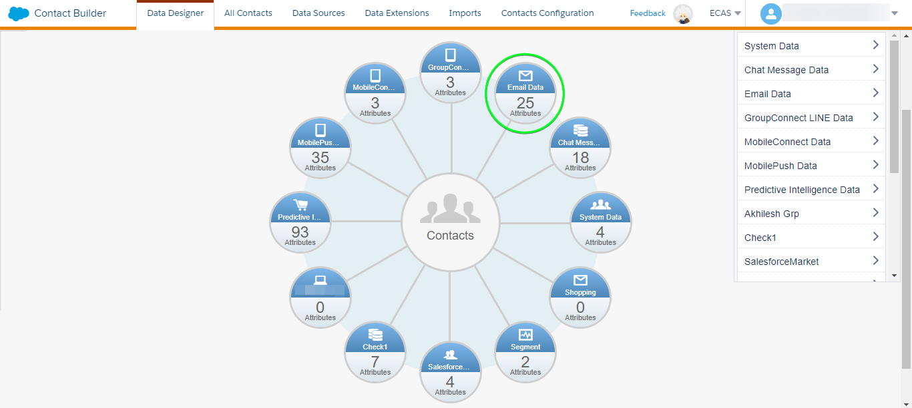

[!DNL Salesforce Marketing Cloud] データ拡張機能のオーディエンスステータスに対応する属性を持つ[!DNL Email Data] [!DNL Email Demographics]属性グループのビューを次に示します。
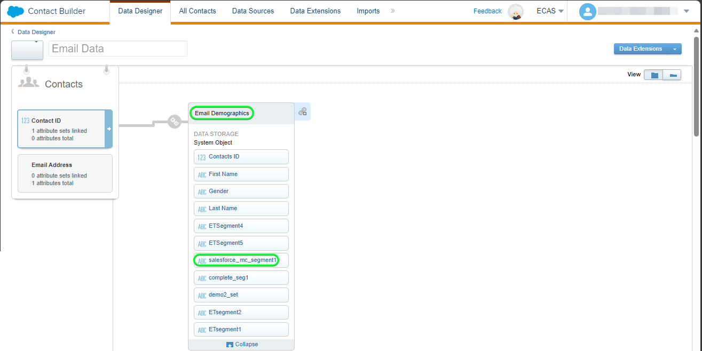

[!DNL (API) Salesforce Marketing Cloud]宛先は、[!DNL Salesforce Marketing Cloud] [!DNL Search Attribute-Set Definitions REST] [API](https://developer.salesforce.com/docs/marketing/marketing-cloud/guide/retrieveAttributeSetDefinitions.html)を使用して、[!DNL Salesforce Marketing Cloud]内で定義されたデータ拡張機能とそのリンク属性を動的に取得します。

ワークフローの&#x200B;**[!UICONTROL Target field]** マッピング [をセットアップして](#mapping-considerations-example)宛先に対するオーディエンスをアクティブ化[する場合、これらは](#activate)選択ウィンドウに表示されます。

>[!IMPORTANT]
>
> [!DNL Salesforce Marketing Cloud]内で、アクティブ化された各Experience Platform セグメントの&#x200B;**[!UICONTROL FIELD NAME]**&#x200B;内で指定された値と正確に一致する&#x200B;**[!UICONTROL Mapping ID]**&#x200B;を持つ属性を作成する必要があります。 例えば、下のスクリーンショットは`salesforce_mc_segment_1`という名前の属性を示しています。 この宛先にオーディエンスをアクティブ化する場合は、`salesforce_mc_segment_1`を&#x200B;**[!UICONTROL Mapping ID]**&#x200B;として追加して、Experience Platformからオーディエンスオーディエンスをこの属性に入力します。

[!DNL Salesforce Marketing Cloud]での属性作成の例を次に示します。
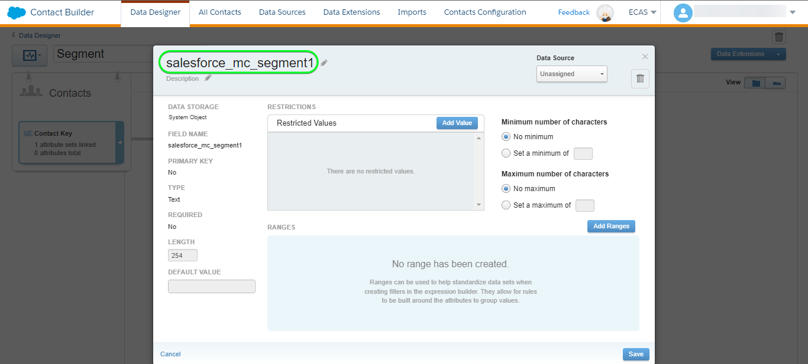

>[!TIP]
>
> * 属性を作成する場合は、フィールド名に空白文字を含めないでください。 代わりに、アンダースコア `(_)`文字を区切り文字として使用してください。
> * Experience Platform オーディエンスに使用される属性と[!DNL Salesforce Marketing Cloud]内のその他の属性を区別するには、Adobe セグメントに使用される属性に認識可能な接頭辞または接尾辞を含めることができます。 例えば、`test_segment`の代わりに、`Adobe_test_segment`または`test_segment_Adobe`を使用します。
> * [!DNL Salesforce Marketing Cloud]で既に他の属性が作成されている場合は、Experience Platform セグメントと同じ名前を使用して、[!DNL Salesforce Marketing Cloud]のオーディエンスを簡単に識別できます。

#### [!DNL Salesforce Marketing Cloud]内でユーザーの役割と権限を割り当てます {#prerequisites-roles-permissions}

[!DNL Salesforce Marketing Cloud]はユースケースに応じてカスタム役割をサポートしているため、[!DNL Salesforce Marketing Cloud]内で属性を更新するには、ユーザーに関連する役割を割り当てる必要があります。 ユーザーに割り当てられた役割の例を次に示します。
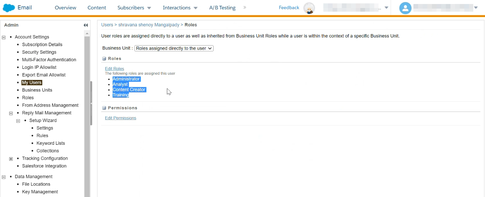

[!DNL Salesforce Marketing Cloud] ユーザーが割り当てられた役割に応じて、更新するフィールドにリンクされている[!DNL Salesforce Marketing Cloud] データ拡張機能に権限を割り当てる必要もあります。

この宛先には`[!DNL data extension]`へのアクセスが必要なため、アクセスを許可する必要があります。 例えば、`Email` [!DNL data extension]の場合、次のように許可する必要があります。

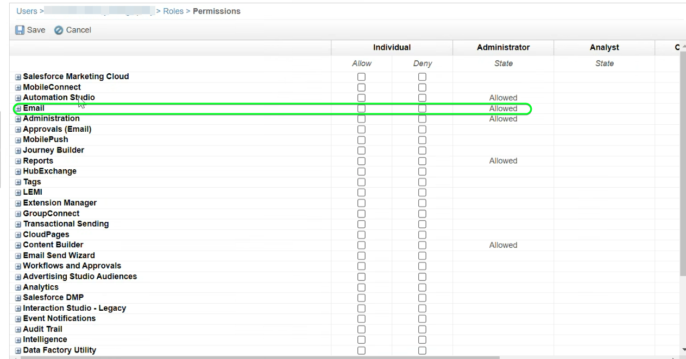

アクセスのレベルを制限するには、詳細な権限を使用して個々のアクセスを上書きすることもできます。
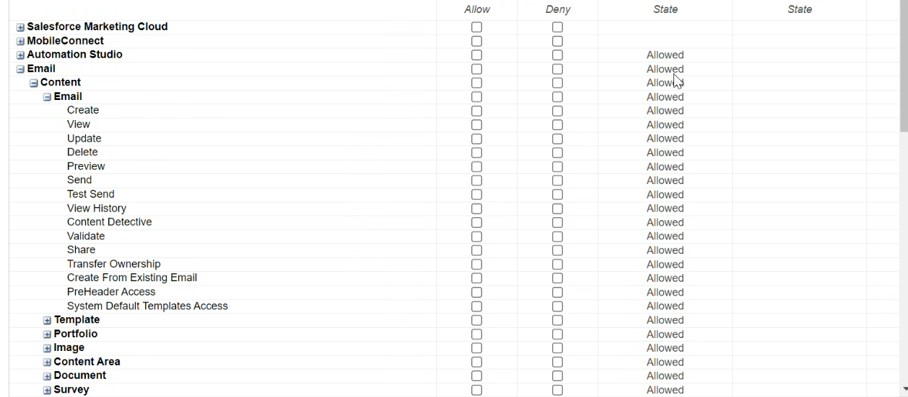

詳細なガイダンスについては、[[!DNL Marketing Cloud Roles]](https://help.salesforce.com/s/articleView?language=en_US&id=sf.mc_overview_marketing_cloud_roles.htm&type=5)および[[!DNL Marketing Cloud Roles and Permissions]](https://help.salesforce.com/s/articleView?language=en_US&id=sf.mc_overview_roles.htm&type=5) ページを参照してください。

#### [!DNL Salesforce Marketing Cloud] 資格情報の収集 {#gather-credentials}

[!DNL (API) Salesforce Marketing Cloud]宛先に対する認証を行う前に、以下の項目をメモしてください。

| 資格情報 | 説明 | 例 |
| --- | --- | --- |
| サブドメイン | [[!DNL Salesforce Marketing Cloud domain prefix] インターフェイスからこの値を取得する方法については、](https://developer.salesforce.com/docs/marketing/marketing-cloud/guide/your-subdomain-tenant-specific-endpoints.html) [!DNL Salesforce Marketing Cloud]を参照してください。 | [!DNL Salesforce Marketing Cloud] ドメインが の場合 *`mcq4jrssqdlyc4lph19nnqgzzs84`.login.exacttarget.com*、 値として`mcq4jrssqdlyc4lph19nnqgzzs84`を指定する必要があります。 |
| クライアント ID | この値を[!DNL Salesforce Marketing Cloud] インターフェイスから取得する方法については、[&#x200B; &#x200B;](https://developer.salesforce.com/docs/marketing/marketing-cloud/guide/access-token-s2s.html) ドキュメント [!DNL Salesforce Marketing Cloud]を参照してください。 | r23kxxxxxxxx0z05xxxxxx |
| クライアント秘密鍵 | この値を[!DNL Salesforce Marketing Cloud] インターフェイスから取得する方法については、[&#x200B; &#x200B;](https://developer.salesforce.com/docs/marketing/marketing-cloud/guide/access-token-s2s.html) ドキュメント [!DNL Salesforce Marketing Cloud]を参照してください。 | ipxxxxxxxxxxT4xxxxxxxxxxxxxx |

{style="table-layout:auto"}

### ガードレール {#guardrails}

* Salesforceでは、特定の[&#x200B; レート制限](https://developer.salesforce.com/docs/marketing/marketing-cloud/guide/rate-limiting.html)が適用されます。
   * 実行中に発生する可能性のある制限とエラーの削減については、[!DNL Salesforce Marketing Cloud] [&#x200B; ドキュメント &#x200B;](https://developer.salesforce.com/docs/marketing/marketing-cloud/guide/rate-limiting-errors.html)を参照してください。
   * プランによって課される制限について詳しくは、[[!DNL Salesforce Marketing Cloud]  エンゲージメント価格](https://www.salesforce.com/editions-pricing/marketing-cloud/email/) ページから&#x200B;*完全版の比較チャート*&#x200B;をPDFとしてダウンロードしてください。
   * [APIの概要](https://developer.salesforce.com/docs/marketing/marketing-cloud/guide/apis-overview.html) ページには、追加の制限が記載されています。
   * これらの詳細を照合するページについては、[こちら](https://salesforce.stackexchange.com/questions/205898/marketing-cloud-api-limits)を参照してください。
* オブジェクト *ごとに許可される* カスタムフィールドの数は、Salesforce エディションによって異なります。
   * 追加のガイダンスについては、[!DNL Salesforce] [&#x200B; ドキュメント &#x200B;](https://help.salesforce.com/s/articleView?id=sf.custom_field_allocations.htm&type=5)を参照してください。
   * *内のオブジェクト*&#x200B;ごとに許可される[!DNL Salesforce Marketing Cloud] カスタムフィールドに対して定義された制限に達した場合は、次のことが必要になります
      * [!DNL Salesforce Marketing Cloud]で新しい属性を追加する前に、古い属性を削除します。
      * これらの古い属性名を&#x200B;**[!UICONTROL Mapping ID]**&#x200B;に指定された値として、[&#x200B; オーディエンススケジュール &#x200B;](#schedule-segment-export-example)手順で使用するExperience Platformの宛先でアクティブ化されたオーディエンスを更新または削除します。

## サポートされている ID {#supported-identities}

[!DNL (API) Salesforce Marketing Cloud]は、次の表に示すIDのアクティブ化をサポートしています。 [ID](/help/identity-service/features/namespaces.md) についての詳細情報。

| ターゲット ID | 説明 | 注意点 |
|---|---|---|
| contactKey | [!DNL Salesforce Marketing Cloud]連絡先キー。 追加のガイダンスが必要な場合は、[!DNL Salesforce Marketing Cloud] [&#x200B; ドキュメント &#x200B;](https://help.salesforce.com/s/articleView?id=sf.mc_cab_contact_builder_best_practices.htm&type=5)を参照してください。 | 必須 |

{style="table-layout:auto"}

## サポートされるオーディエンス {#supported-audiences}

この節では、この宛先に書き出すことができるオーディエンスのタイプについて説明します。

| オーディエンスの由来 | サポートあり | 説明 |
|---------|----------|----------|
| [!DNL Segmentation Service] | ○ | Experience Platform [&#x200B; セグメント化サービス &#x200B;](../../../segmentation/home.md)を通じて生成されたオーディエンス。 |
| その他すべてのオーディエンスの生成元 | ○ | このカテゴリには、[!DNL Segmentation Service]を通じて生成されたオーディエンス以外のすべてのオーディエンスのオリジンが含まれます。 [様々なオーディエンスの起源](/help/segmentation/ui/audience-portal.md#customize)について読みます。 次に例を示します。 <ul><li> カスタムアップロードオーディエンス [がCSV ファイルからExperience Platformに](../../../segmentation/ui/audience-portal.md#import-audience)をインポートしました。</li><li> 類似オーディエンス， </li><li> 連合オーディエンス， </li><li> [!DNL Adobe Journey Optimizer]などの他のExperience Platform アプリで生成されたオーディエンス </li><li> その他。 </li></ul> |

{style="table-layout:auto"}

オーディエンスのデータタイプ別にサポートされるオーディエンス：

| オーディエンスのデータタイプ | サポートあり | 説明 | ユースケース |
|--------------------|-----------|-------------|-----------|
| [人物オーディエンス &#x200B;](/help/segmentation/types/people-audiences.md) | ○ | 顧客プロファイルにもとづいて、マーケティング施策の特定のグループをターゲットにすることができます。 | 買い物客やカートの放棄が多い |
| [&#x200B; アカウントオーディエンス &#x200B;](/help/segmentation/types/account-audiences.md) | × | アカウントベースドマーケティング戦略のために、特定の組織内の個人をターゲットにします。 | B2B マーケティング |
| [見込みオーディエンス &#x200B;](/help/segmentation/types/prospect-audiences.md) | × | まだ顧客ではないが、ターゲットオーディエンスと特徴を共有する個人をターゲットにします。 | サードパーティデータによる見込み顧客の開拓 |
| [&#x200B; データセットの書き出し](/help/catalog/datasets/overview.md) | × | [!DNL Adobe Experience Platform] データ レイクに保存されている構造化データのコレクション。 | レポート，データサイエンスワークフロー |

{style="table-layout:auto"}

## 書き出しのタイプと頻度 {#export-type-frequency}

宛先の書き出しのタイプと頻度について詳しくは、以下の表を参照してください。

| 項目 | タイプ | メモ |
|---------|----------|---------|
| 書き出しタイプ | **[!UICONTROL Profile-based]** | <ul><li>セグメントのすべてのメンバーを、フィールドマッピングに従って、必要なスキーマフィールドと共に書き出します&#x200B;*（例：メールアドレス、電話番号、姓）*。</li><li> [!DNL Salesforce Marketing Cloud]の各セグメントステータスは、**[!UICONTROL Mapping ID]** オーディエンススケジュール [手順で指定した](#schedule-segment-export-example)値に基づいて、Experience Platformからの対応するオーディエンスステータスで更新されます。</li></ul> |
| 書き出し頻度 | **[!UICONTROL Streaming]** | ストリーミングの宛先は常に、API ベースの接続です。オーディエンス評価に基づいて Experience Platform 内でプロファイルが更新されるとすぐに、コネクタは更新を宛先プラットフォームに送信します。詳しくは、[ストリーミングの宛先](/help/destinations/destination-types.md#streaming-destinations)を参照してください。 |

{style="table-layout:auto"}

## 宛先への接続 {#connect}

>[!IMPORTANT]
>
> 宛先に接続するには、**[!UICONTROL Manage Destinations]** [&#x200B; アクセス制御権限](/help/access-control/home.md#permissions)が必要です。 詳しくは、[アクセス制御の概要](/help/access-control/ui/overview.md)または製品管理者に問い合わせて、必要な権限を取得してください。

この宛先に接続するには、[宛先設定のチュートリアル](../../ui/connect-destination.md)の手順に従ってください。宛先の設定ワークフローで、以下の 2 つのセクションにリストされているフィールドに入力します。

**[!UICONTROL Destinations]** > **[!UICONTROL Catalog]**&#x200B;内で、[!DNL (API) Salesforce Marketing Cloud]を検索します。 または、**[!UICONTROL Email marketing]** カテゴリの下に配置することもできます。

### 宛先に対する認証 {#authenticate}

宛先に対して認証を行うには、以下の必須フィールドに入力し、**[!UICONTROL Connect to destination]**&#x200B;を選択します。 ガイダンスについては、[収集 [!DNL Salesforce Marketing Cloud] 資格情報](#gather-credentials) セクションを参照してください。

| [!DNL (API) Salesforce Marketing Cloud]宛先 | [!DNL Salesforce Marketing Cloud] |
| --- | --- |
| **[!UICONTROL Subdomain]** | [!DNL Salesforce Marketing Cloud] ドメインのプレフィックス。  例えば、ドメインが の場合 *`mcq4jrssqdlyc4lph19nnqgzzs84`.login.exacttarget.com*、 を値として`mcq4jrssqdlyc4lph19nnqgzzs84`を指定する必要があります。 |
| **[!UICONTROL Client ID]** | お客様の[!DNL Salesforce Marketing Cloud] `Client ID`。 |
| **[!UICONTROL Client Secret]** | お客様の[!DNL Salesforce Marketing Cloud] `Client Secret`。 |

{style="table-layout:auto"}

Salesforce Marketing Cloudへの認証方法を示す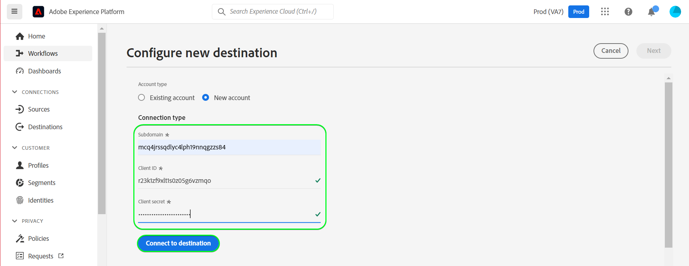

指定された詳細が有効な場合、UIに緑色のチェックマークが付いた&#x200B;**[!UICONTROL Connected]** ステータスが表示され、次の手順に進むことができます。

### 宛先の詳細を入力 {#destination-details}

宛先の詳細を設定するには、以下の必須フィールドとオプションフィールドに入力します。UI のフィールドの横にアスタリスクが表示される場合は、そのフィールドが必須であることを示します。
宛先の詳細を示す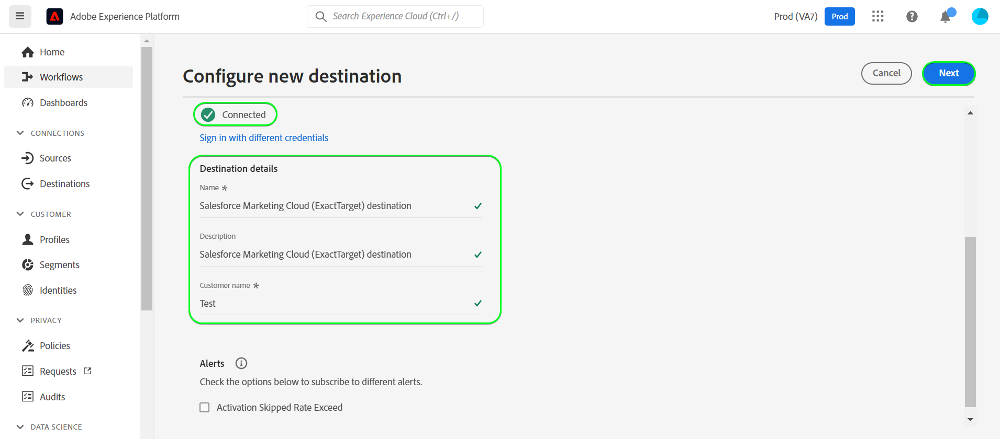

* **[!UICONTROL Name]**：今後この宛先を認識する際に使用する名前。
* **[!UICONTROL Description]**：今後この宛先を特定するのに役立つ説明です。

### アラートの有効化 {#enable-alerts}

アラートを有効にすると、宛先へのデータフローのステータスに関する通知を受け取ることができます。リストからアラートを選択して、データフローのステータスに関する通知を受け取るよう登録します。アラートについて詳しくは、[UI を使用した宛先アラートの購読](../../ui/alerts.md)についてのガイドを参照してください。

宛先接続の詳細の提供が完了したら、**[!UICONTROL Next]**&#x200B;を選択します。

## この宛先に対してオーディエンスをアクティブ化 {#activate}

>[!IMPORTANT]
>
> * データをアクティブ化するには、**[!UICONTROL View Destinations]**、**[!UICONTROL Activate Destinations]**、**[!UICONTROL View Profiles]**&#x200B;および&#x200B;**[!UICONTROL View Segments]** [&#x200B; アクセス制御権限](/help/access-control/home.md#permissions)が必要です。 [アクセス制御の概要](/help/access-control/ui/overview.md)を参照するか、製品管理者に問い合わせて必要な権限を取得してください。
> * *ID*&#x200B;をエクスポートするには、**[!UICONTROL View Identity Graph]** [&#x200B; アクセス制御権限](/help/access-control/home.md#permissions)が必要です。  {width="100" zoomable="yes"}

この宛先にオーディエンスをアクティベートする手順は、[ストリーミングオーディエンスの書き出し宛先へのプロファイルとオーディエンスのアクティベート](/help/destinations/ui/activate-segment-streaming-destinations.md)を参照してください。

### マッピングの考慮事項と例 {#mapping-considerations-example}

オーディエンスデータを[!DNL Adobe Experience Platform]から[!DNL (API) Salesforce Marketing Cloud]宛先に正しく送信するには、フィールドマッピング手順を実行する必要があります。 マッピングでは、Experience Platform アカウントのExperience Data Model （XDM）スキーマフィールドと、ターゲット先の対応するスキーマフィールドとの間にリンクを作成します。

XDM フィールドを[!DNL (API) Salesforce Marketing Cloud]宛先フィールドに正しくマッピングするには、次の手順に従います。

>[!IMPORTANT]
>
> * 属性名は[!DNL Salesforce Marketing Cloud] アカウントに従いますが、`contactKey`と`personalEmail.address`の両方のマッピングは必須です。
>
> * [!DNL Salesforce Marketing Cloud] APIとの統合では、Experience PlatformがSalesforceから取得できる属性の数のページネーション制限が適用されます。 つまり、**[!UICONTROL Mapping]** ステップ中に、ターゲットフィールドスキーマは、Salesforce アカウントから最大2,000個の属性を表示できます。

1. **[!UICONTROL Mapping]** ステップで、**[!UICONTROL Add new mapping]**&#x200B;を選択します。 画面に新しいマッピング行が表示されます。
   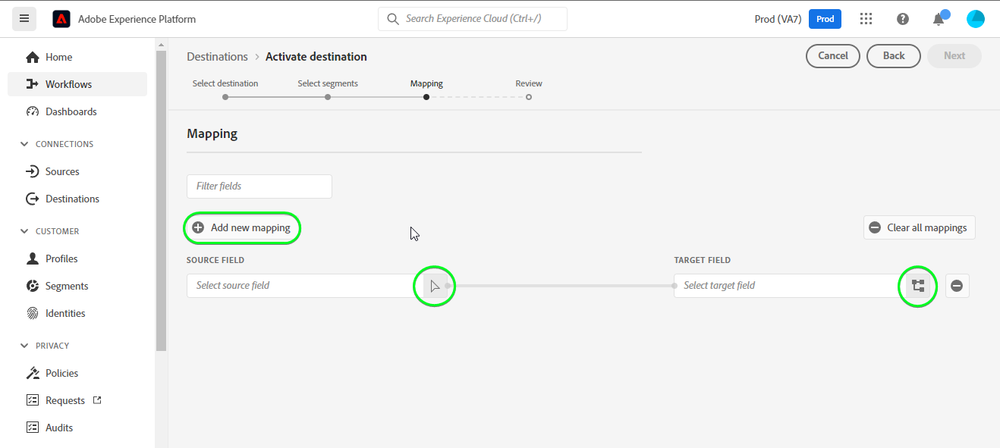
1. **[!UICONTROL Select source field]** ウィンドウで、**[!UICONTROL Select attributes]** カテゴリを選択してXDM属性を選択するか、**[!UICONTROL Select identity namespace]**&#x200B;を選択してIDを選択します。
1. **[!UICONTROL Select target field]** ウィンドウで、**[!UICONTROL Select identity namespace]**&#x200B;を選択してIDを選択するか、**[!UICONTROL Select attributes]** カテゴリを選択し、必要に応じて表示されるデータ拡張機能から属性を選択します。 [!DNL (API) Salesforce Marketing Cloud]宛先は、[!DNL Salesforce Marketing Cloud] [!DNL Search Attribute-Set Definitions REST] [API](https://developer.salesforce.com/docs/marketing/marketing-cloud/guide/retrieveAttributeSetDefinitions.html)を使用して、[!DNL Salesforce Marketing Cloud]内で定義されたデータ拡張機能とそのリンク属性を動的に取得します。 これらは、**[!UICONTROL Target field]** オーディエンスのアクティブ化ワークフロー[で](#mapping-considerations-example) マッピング [を設定すると、](#activate) ポップアップに表示されます。

   * これらの手順を繰り返して、XDM プロファイルスキーマと[!DNL (API) Salesforce Marketing Cloud]の間に次のマッピングを追加します。

     | ソースフィールド | ターゲットフィールド | 必須 |
     |---|---|---|
     | `IdentityMap: contactKey` | `Identity: salesforceContactKey` | `Mandatory` |
     | `xdm: personalEmail.address` | `Attribute: Email Address` [!DNL Salesforce Marketing Cloud] データ拡張機能の[!DNL Email Addresses]。 | `Mandatory`、新しい連絡先を追加する場合。 |
     | `xdm: person.name.firstName` | `Attribute: First Name`を目的の[!DNL Salesforce Marketing Cloud] データ拡張機能から取得します。 | - |

   * これらのマッピングの使用例を次に示します。
     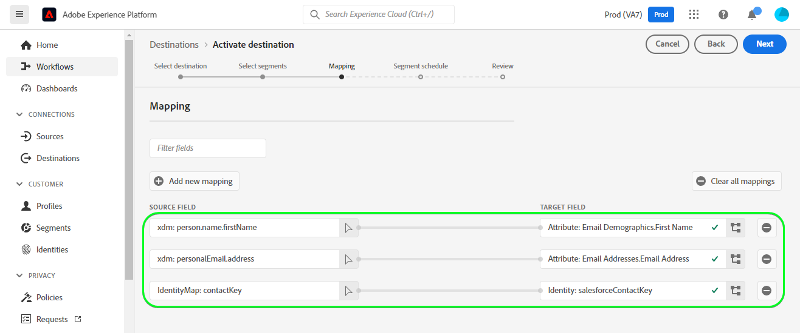

宛先接続のマッピングの提供が完了したら、**[!UICONTROL Next]**&#x200B;を選択します。

### オーディエンスの書き出しのスケジュールと例 {#schedule-segment-export-example}

[&#x200B; オーディエンスの書き出しをスケジュール &#x200B;](/help/destinations/ui/activate-segment-streaming-destinations.md#scheduling)する手順を実行する場合、[の](#prerequisites-attribute)属性[!DNL Salesforce Marketing Cloud]にExperience Platform オーディエンスを手動でマッピングする必要があります。

これを行うには、各セグメントを選択し、[!DNL Salesforce Marketing Cloud] [!DNL (API) Salesforce Marketing Cloud] フィールドに&#x200B;**[!UICONTROL Mapping ID]**&#x200B;の属性の名前を入力します。 [での属性の作成に関するガイダンスとベストプラクティスについては、 [!DNL Salesforce Marketing Cloud]](#prerequisites-custom-field)内の[!DNL Salesforce Marketing Cloud]属性の作成の節を参照してください。

例えば、[!DNL Salesforce Marketing Cloud]属性が`salesforce_mc_segment_1`の場合は、[!DNL (API) Salesforce Marketing Cloud] **[!UICONTROL Mapping ID]**&#x200B;にこの値を指定して、Experience Platformのオーディエンスオーディエンスをこの属性に入力します。

[!DNL Salesforce Marketing Cloud]の属性の例を次に示します。

[!DNL (API) Salesforce Marketing Cloud] **[!UICONTROL Mapping ID]**&#x200B;の場所を示す例を次に示します。

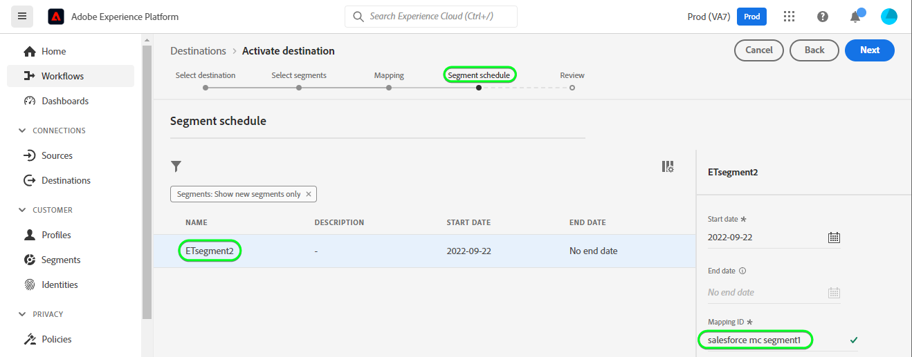

図に示すように、[!DNL (API) Salesforce Marketing Cloud] **[!UICONTROL Mapping ID]**&#x200B;は[!DNL Salesforce Marketing Cloud] **[!UICONTROL FIELD NAME]**&#x200B;内で指定された値と完全に一致する必要があります。

アクティブ化されたExperience Platform セグメントごとに、このセクションを繰り返します。

上記の画像に基づく典型的な例を以下に示す。

| [!DNL (API) Salesforce Marketing Cloud] セグメント名 | [!DNL Salesforce Marketing Cloud] **[!UICONTROL FIELD NAME]** | [!DNL (API) Salesforce Marketing Cloud] **[!UICONTROL Mapping ID]** |
| --- | --- | --- |
| salesforce mc audience 1 | `salesforce_mc_segment_1` | `salesforce_mc_segment_1` |
| salesforce mc audience 2 | `salesforce_mc_segment_2` | `salesforce_mc_segment_2` |

{style="table-layout:auto"}

## データの書き出しを検証する {#exported-data}

宛先が正しく設定されていることを検証するには、次の手順に従います。

1. 宛先のリストに移動するには、**[!UICONTROL Destinations]** > **[!UICONTROL Browse]**&#x200B;を選択します。
   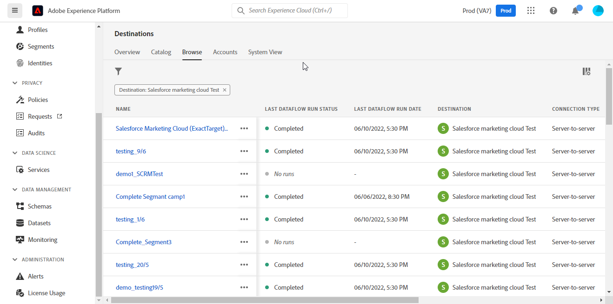

1. 宛先を選択し、ステータスが&#x200B;**[!UICONTROL enabled]**&#x200B;であることを検証します。
   宛先データフロー実行を示す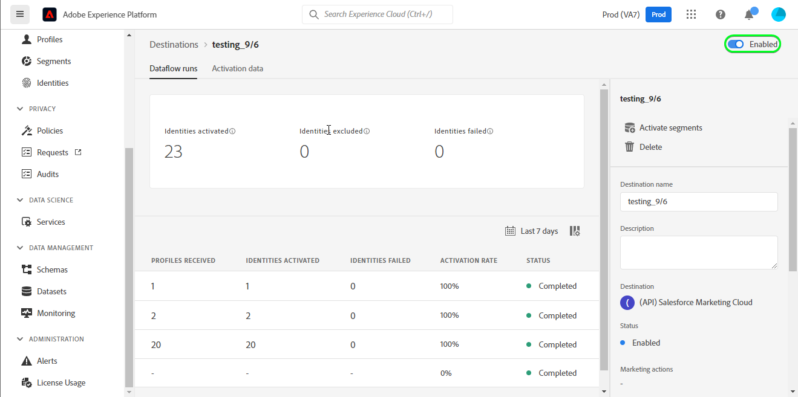

1. 「**[!DNL Activation data]**」タブに切り替えて、オーディエンス名を選択します。
   宛先アクティベーションデータを示す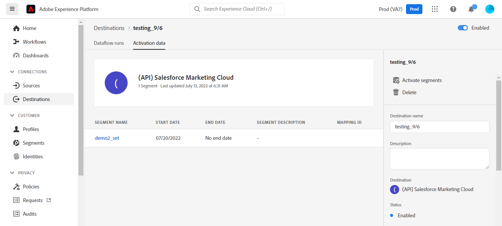

1. オーディエンスの概要を監視し、プロファイルの数がセグメント内で作成された数に対応していることを確認します。
   セグメントを示す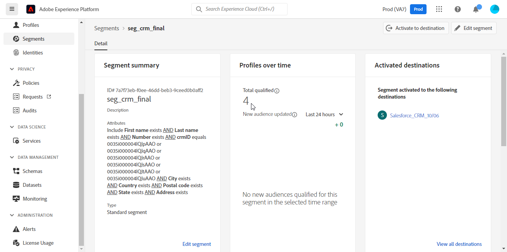

1. [[!DNL Salesforce Marketing Cloud]](https://mc.exacttarget.com/) Web サイトに移動します。 次に、**[!DNL Audience Builder]** > **[!DNL Contact Builder]** > **[!DNL All contacts]** > **[!DNL Email]** ページに移動し、オーディエンスのプロファイルが追加されているかどうかを確認します。
   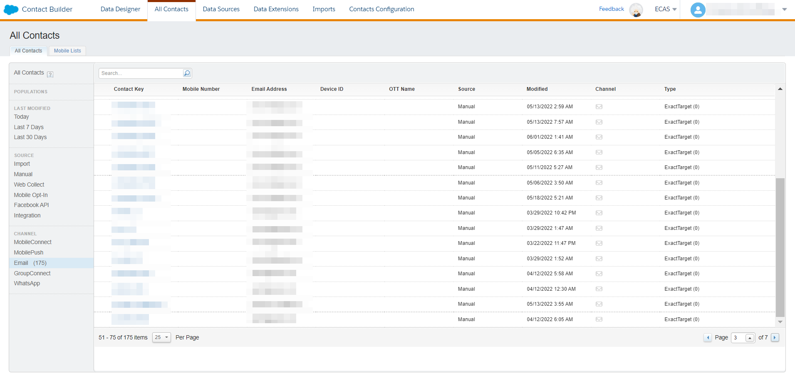

1. プロファイルが更新されたかどうかを確認するには、**[!UICONTROL Email]** ページに移動し、オーディエンスのプロファイルの属性値が更新されたかどうかを確認します。 成功した場合、[!DNL Salesforce Marketing Cloud] オーディエンススケジュール **[!UICONTROL Mapping ID]**&#x200B;手順で指定した[値に基づいて、](#schedule-segment-export-example)の各オーディエンスステータスが、Experience Platformの対応するオーディエンスステータスで更新されていることがわかります。
   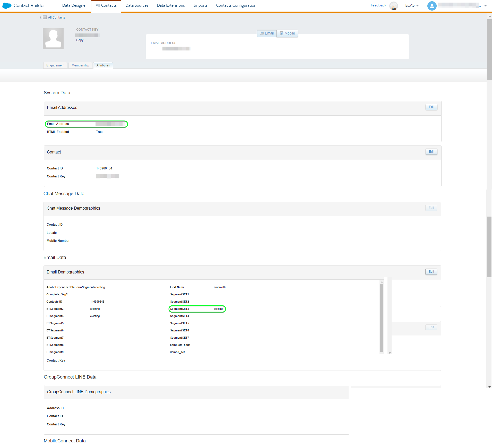

## データの使用とガバナンス {#data-usage-governance}

[!DNL Adobe Experience Platform] のすべての宛先は、データを処理する際のデータ使用ポリシーに準拠しています。[!DNL Adobe Experience Platform] がどのようにデータガバナンスを実施するかについて詳しくは、[データガバナンスの概要](/help/data-governance/home.md)を参照してください。

## エラーとトラブルシューティング {#errors-and-troubleshooting}

### Salesforce Marketing Cloudへのイベントのプッシュ中に不明なエラーが発生しました {#unknown-errors}

* データフロー実行を確認する際に、次のエラーメッセージが表示される場合があります：`Unknown errors encountered while pushing events to the destination. Please contact the administrator and try again.`
  エラーを示す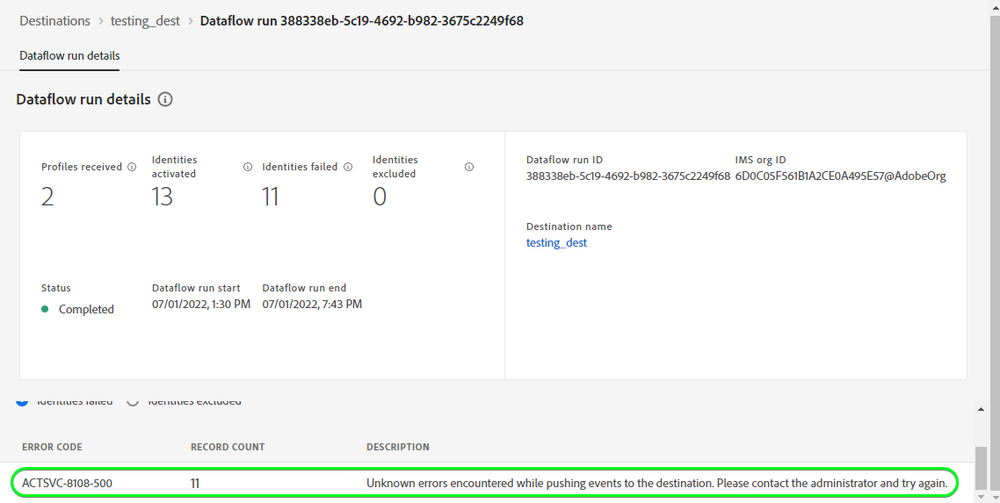

   * このエラーを修正するには、アクティベーションワークフローで&#x200B;**[!UICONTROL Mapping ID]**&#x200B;宛先に指定した[!DNL (API) Salesforce Marketing Cloud]が、[!DNL Salesforce Marketing Cloud]で作成した属性の名前と完全に一致することを確認してください。 ガイダンスについては、[内の [!DNL Salesforce Marketing Cloud]](#prerequisites-custom-field)属性の作成の節を参照してください。

* セグメントをアクティブ化すると、次のエラーメッセージが表示される場合があります：`The client's IP address is unauthorized for this account. Allowlist the client's IP address...`
   * このエラーを修正するには、[!DNL Salesforce Marketing Cloud] アカウント管理者に連絡して、[Experience Platform IP アドレス &#x200B;](/help/destinations/catalog/streaming/ip-address-allow-list.md)を[!DNL Salesforce Marketing Cloud] アカウントの信頼できるIP範囲に追加してください。 追加のガイダンスが必要な場合は、Marketing Cloud[!DNL Salesforce Marketing Cloud]のドキュメントの「[&#x200B; &#x200B;](https://help.salesforce.com/s/articleView?id=sf.mc_es_ip_addresses_for_inclusion.htm&type=5)IP アドレスを含める」を参照してください。

## その他のリソース {#additional-resources}

* [!DNL Salesforce Marketing Cloud] [API](https://developer.salesforce.com/docs/marketing/marketing-cloud/guide/apis-overview.html)
* 指定された情報を使用して連絡先を更新する方法を説明する[!DNL Salesforce Marketing Cloud] [&#x200B; ドキュメント &#x200B;](https://developer.salesforce.com/docs/marketing/marketing-cloud/guide/updateContacts.html)。

### 変更ログ {#changelog}

この節では、この宛先コネクタに対する機能の概要と重要なドキュメントの更新について説明します。

+++ 変更ログを表示

| リリース月 | 更新タイプ | 説明 |
|---|---|---|
| 2023年10月 | ドキュメントの更新 | <ul><li>（API）Salesforce Marketing Cloud[のセクションの](#prerequisites-destination)前提条件を更新し、一般的に、ドキュメント全体の属性グループへの不要な参照を削除しました。</li> <li>オーディエンスのステータスの属性は、[!DNL Salesforce Marketing Cloud] データ拡張機能でのみ[!DNL Email Demographics]以内に作成する必要があることを示すドキュメントを更新しました。</li> <li>「[&#x200B; マッピングに関する考慮事項と例](#mapping-considerations-example)」セクション内のマッピングテーブルを更新しました。`Email Address` データ拡張内の`Email Addresses`属性のマッピングは必須とマークされています。この要件は、「重要」とマークされた吹き出しに記載されていましたが、テーブルから省略されました。</li></ul> |
| 2023年4月 | ドキュメントの更新 | <ul><li>[がこの宛先を使用するための必須サブスクリプションであることを指摘するために、「（API）Salesforce Marketing Cloud](#prerequisites-destination)の前提条件」セクションのステートメントと参照リンクを修正しました。 [!DNL Salesforce Marketing Cloud Engagement]このセクションでは、先ほど誤って、Marketing Cloud **Account** Engagementへのサブスクリプションが必要であることを指摘しました。</li> <li>この宛先が機能するために[&#x200B; ユーザーに割り当てる](#prerequisites)役割と権限[について、](#prerequisites-roles-permissions)前提条件[!DNL Salesforce]の下にセクションを追加しました。 （PLATIR-26299）</li></ul> |
| 2023年2月 | ドキュメントの更新 | 「（API）Salesforce Marketing Cloud[」セクションの](#prerequisites-destination)前提条件を更新し、[!DNL Salesforce Marketing Cloud Engagement]がこの宛先を使用するための必須サブスクリプションであることを示す参照リンクを含めました。 |
| 2023年2月 | 機能アップデート | 宛先内の誤った設定により、形式が正しくないJSONがSalesforceに送信される問題を修正しました。 そのため、一部のユーザーでは、アクティベーションで失敗したIDの数が多くなりました。 （PLATIR-26299） |
| 2023年1月 | ドキュメントの更新 | <ul><li>[側で属性を作成する必要があることを呼び出すために、 [!DNL Salesforce]](#prerequisites-destination)の[!DNL Salesforce]前提条件セクションを更新しました。 この節には、その方法に関する詳細な手順と、[!DNL Salesforce]での属性の命名に関するベストプラクティスが含まれています。 （PLATIR-25602）</li><li>アクティブ化された各オーディエンスに対してマッピング IDを使用する方法に関する明確な手順を、[&#x200B; オーディエンススケジューリングステップ &#x200B;](#schedule-segment-export-example)に追加しました。 （PLATIR-25602）</li></ul> |
| 2022年10月 | 初回リリース | 最初の宛先リリースとドキュメントの公開。 |

{style="table-layout:auto"}

+++
