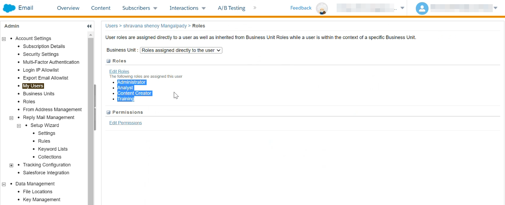

# [!DNL (API) Salesforce Marketing Cloud] 接続

## 概要 {#overview}

[[!DNL (API) Salesforce Marketing Cloud]](https://www.salesforce.com/products/marketing-cloud/engagement/) （旧称： [!DNL ExactTarget]）は、訪問者および顧客がエクスペリエンスをパーソナライズするためのジャーニーを構築し、カスタマイズできるデジタルマーケティングスイートです。

>[!IMPORTANT]
>
> この接続とその他の接続の違いに注意してください [[!DNL Salesforce Marketing Cloud] 接続](/help/destinations/catalog/email-marketing/salesforce-marketing-cloud.md) これは、メールマーケティングカタログセクション内に存在します。 もう 1 つの SalesforceMarketing Cloud接続では、指定のストレージの場所にファイルを書き出すことができます。これは API ベースのストリーミング接続です。

比較対象： [!DNL Salesforce Marketing Cloud Account Engagement] その方が指向が強い **B2B** マーケティング、 [!DNL (API) Salesforce Marketing Cloud] 宛先は次に最適です： **B2C** トランザクションの意思決定サイクルが短いユースケース。 特に外部のデータセットから連絡先を優先順位付けしてセグメント化することで、ターゲットオーディエンスの行動を表すより大きなデータセットを統合し、マーケティングキャンペーンを調整および改善できます [!DNL Salesforce]. *なお、Experience Platformには以下への接続もあります [[!DNL Salesforce Marketing Cloud Account Engagement]](/help/destinations/catalog/email-marketing/salesforce-marketing-cloud-account-engagement.md).*

この [!DNL Adobe Experience Platform] [宛先](/help/destinations/home.md) はを使用します [!DNL Salesforce Marketing Cloud] [連絡先を更新](https://developer.salesforce.com/docs/marketing/marketing-cloud/guide/updateContacts.html) API。次のことが可能です。 **連絡先の追加と連絡先データの更新** 新規内でアクティブ化した後のビジネスニーズに対応 [!DNL Salesforce Marketing Cloud] セグメント。

[!DNL Salesforce Marketing Cloud] は、と通信するための認証メカニズムとして、クライアント資格情報を含む OAuth 2 を使用します。 [!DNL Salesforce Marketing Cloud] API です。 [!DNL Salesforce Marketing Cloud] インスタンスを認証する手順は、さらに下の[宛先に対する認証](#authenticate)の節にあります。

## ユースケース {#use-cases}

[!DNL (API) Salesforce Marketing Cloud] 宛先を使用する方法とタイミングを理解しやすくするために、Adobe Experience Platform のお客様がこの宛先を使用して解決できるユースケースのサンプルを以下に示します。

### マーケティングキャンペーンの連絡先へのメールの送信 {#use-case-send-emails}

ホームレンタルプラットフォームの販売部門は、ターゲットとなる顧客オーディエンスにマーケティングメールをブロードキャストしたいと考えています。 プラットフォームのマーケティングチームは、新しい連絡先を追加/既存の連絡先を更新できます *（およびメールアドレス）* Adobe Experience Platformを通じて、独自のオフラインデータからオーディエンスを作成し、それらのオーディエンスをに送信します。 [!DNL Salesforce Marketing Cloud]を使用して、マーケティングキャンペーンメールを送信できます。

## 前提条件 {#prerequisites}

### Experience Platformの前提条件 {#prerequisites-in-experience-platform}

[!DNL (API) Salesforce Marketing Cloud] 宛先へのデータをアクティブ化する前に、[スキーマ](/help/xdm/schema/composition.md)、[データセット](https://experienceleague.adobe.com/docs/platform-learn/tutorials/data-ingestion/create-datasets-and-ingest-data.html)および[セグメント](https://experienceleague.adobe.com/docs/platform-learn/tutorials/segments/create-segments.html)を [!DNL Experience Platform] で作成する必要があります。

### の前提条件 [!DNL (API) Salesforce Marketing Cloud] {#prerequisites-destination}

Platform からにデータを書き出すには、次の前提条件に注意してください [!DNL Salesforce Marketing Cloud] アカウント :

#### [!DNL Salesforce Marketing Cloud] アカウントが必要です {#prerequisites-account}

A [!DNL Salesforce Marketing Cloud] のサブスクリプションを持つアカウント [[!DNL Marketing Cloud Engagement]](https://www.salesforce.com/products/marketing-cloud/engagement/) 続行するには製品が必須です。

～に手を伸ばす [[!DNL Salesforce] サポート](https://www.salesforce.com/company/contact-us/?d=cta-glob-footer-10) を持っていない場合： [!DNL Salesforce Marketing Cloud] アカウントまたはアカウントにがありません [!DNL Marketing Cloud Engagement] 製品サブスクリプション。

#### 内での属性の作成 [!DNL Salesforce Marketing Cloud] {#prerequisites-attribute}

に対してオーディエンスをアクティブ化する場合 [!DNL (API) Salesforce Marketing Cloud] 宛先。に値を入力してください **[!UICONTROL マッピング ID]** アクティブ化された各オーディエンスのフィールド（ **[オーディエンススケジュール](#schedule-segment-export-example)** ステップ。

[!DNL Salesforce] Experience Platformから受信するオーディエンスを正しく読み取って解釈し、内でオーディエンスステータスを更新するには、この値が必要です [!DNL Salesforce Marketing Cloud]. のExperience Platformドキュメントを参照してください。 [オーディエンスメンバーシップの詳細スキーマフィールドグループ](/help/xdm/field-groups/profile/segmentation.md) オーディエンスのステータスのガイダンスが必要な場合。

Platform からに対してアクティブ化する各オーディエンスの場合 [!DNL Salesforce]、タイプの属性が必要です `Text` にリンクされています [!DNL Email Demographics] 内のデータ拡張 [!DNL Salesforce Marketing Cloud]. の使用 [!DNL Salesforce Marketing Cloud] [!DNL Contact Builder] をクリックして属性を作成します。 を参照してください。 [!DNL Salesforce Marketing Cloud] のドキュメント化 [属性を作成](https://help.salesforce.com/s/articleView?id=mc_cab_create_an_attribute.htm&amp;type=5&amp;language=en_US) 属性の作成に関するガイダンスが必要な場合。

属性フィールド名は、 [!DNL (API) Salesforce Marketing Cloud] 次の期間のターゲットフィールド **[!UICONTROL マッピング]** ステップ。 ビジネス要件に応じて、最大 4,000 文字のフィールド文字を定義できます。 を参照してください。 [!DNL Salesforce Marketing Cloud] [データ拡張機能のデータタイプ](https://help.salesforce.com/s/articleView?id=sf.mc_es_data_extension_data_types.htm&amp;type=5) 属性タイプについて詳しくは、ドキュメントページを参照してください。

のデータデザイナー画面の例 [!DNL Salesforce Marketing Cloud]を追加する属性を次に示します。

のビュー [!DNL Salesforce Marketing Cloud] [!DNL Email Data] 内のオーディエンスステータスに対応する属性を持つ属性グループ [!DNL Email Demographics] データ拡張を次に示します。

この [!DNL (API) Salesforce Marketing Cloud] 宛先はを使用 [!DNL Salesforce Marketing Cloud] [!DNL Search Attribute-Set Definitions REST] [API](https://developer.salesforce.com/docs/marketing/marketing-cloud/guide/retrieveAttributeSetDefinitions.html) 内で定義されたデータ拡張機能とそのリンク属性を動的に取得するには、次の手順を実行します [!DNL Salesforce Marketing Cloud].

これらはに表示されます **[!UICONTROL ターゲットフィールド]** を設定したときの選択ウィンドウ [マッピング](#mapping-considerations-example) ワークフローで次へ [宛先に対してオーディエンスをアクティブ化](#activate).

>[!IMPORTANT]
>
> 内 [!DNL Salesforce Marketing Cloud]は、属性を作成する必要があります **[!UICONTROL フィールド名]** 内で指定された値と完全に一致する **[!UICONTROL マッピング ID]** アクティブ化された各 Platform セグメント用。 例えば、以下のスクリーンショットは、という名前の属性を示しています。 `salesforce_mc_segment_1`. この宛先に対してオーディエンスをアクティブ化する場合、次を追加します `salesforce_mc_segment_1` as **[!UICONTROL マッピング ID]** オーディエンスオーディエンスをExperience Platformからこの属性に入力します。

での属性作成例 [!DNL Salesforce Marketing Cloud]を以下に示します。

>[!TIP]
>
> * 属性を作成する際は、フィールド名に空白文字を含めないでください。 代わりに、アンダースコアを使用してください `(_)` 区切り文字として使用する文字。
> * Platform オーディエンスに使用される属性と内の他の属性を区別するには [!DNL Salesforce Marketing Cloud]を使用すると、Adobeセグメントに使用される属性の認識可能なプレフィックスまたはサフィックスを含めることができます。 例えば、の代わりに `test_segment`、を使用 `Adobe_test_segment` または `test_segment_Adobe`.
> * で他の属性を既に作成している場合 [!DNL Salesforce Marketing Cloud]を使用すると、Platform セグメントと同じ名前を使用して、でオーディエンスを簡単に識別できます [!DNL Salesforce Marketing Cloud].

#### 内でのユーザーの役割と権限の割り当て [!DNL Salesforce Marketing Cloud] {#prerequisites-roles-permissions}

As [!DNL Salesforce Marketing Cloud] はユースケースに応じてカスタムの役割をサポートし、内の属性を更新するには、関連する役割をユーザーに割り当てる必要があります [!DNL Salesforce Marketing Cloud]. ユーザーに割り当てられた役割の例を次に示します。

役割に応じて、 [!DNL Salesforce Marketing Cloud] がユーザーに割り当てられている。次のユーザーに権限も割り当てる必要があります [!DNL Salesforce Marketing Cloud] 更新しようとしているフィールドにリンクされているデータ拡張機能。

この宛先は、へのアクセスが必要なため `[!DNL data extension]`を許可する必要があります。 例えば、 `Email` [!DNL data extension] 次に示すように、を許可する必要があります。

アクセスレベルを制限するために、詳細な権限を使用して個々のアクセスを上書きすることもできます。

を参照してください。 [[!DNL Marketing Cloud Roles]](https://help.salesforce.com/s/articleView?language=en_US&amp;id=sf.mc_overview_marketing_cloud_roles.htm&amp;type=5) および [[!DNL Marketing Cloud Roles and Permissions]](https://help.salesforce.com/s/articleView?language=en_US&amp;id=sf.mc_overview_roles.htm&amp;type=5) 詳細なガイダンスのページ。

#### [!DNL Salesforce Marketing Cloud] 資格情報の収集 {#gather-credentials}

に対して認証を行う前に、以下の項目をメモしておきます [!DNL (API) Salesforce Marketing Cloud] の宛先。

| 資格情報 | 説明 | 例 |
| --- | --- | --- |
| サブドメイン | 参照： [[!DNL Salesforce Marketing Cloud domain prefix]](https://developer.salesforce.com/docs/marketing/marketing-cloud/guide/your-subdomain-tenant-specific-endpoints.html) から、この値を取得する方法を説明します [!DNL Salesforce Marketing Cloud] インターフェイス。 | 次の場合 [!DNL Salesforce Marketing Cloud] ドメイン：  *`mcq4jrssqdlyc4lph19nnqgzzs84`.login.exacttarget.com*,  次を指定する必要があります `mcq4jrssqdlyc4lph19nnqgzzs84` 値として。 |
| クライアント ID | を参照してください。 [!DNL Salesforce Marketing Cloud] [詳細を見る](https://developer.salesforce.com/docs/marketing/marketing-cloud/guide/access-token-s2s.html) から、この値を取得する方法を説明します [!DNL Salesforce Marketing Cloud] インターフェイス。 | r23kxxxxxxxx0z05xxxxxx |
| クライアント秘密鍵 | を参照してください。 [!DNL Salesforce Marketing Cloud] [詳細を見る](https://developer.salesforce.com/docs/marketing/marketing-cloud/guide/access-token-s2s.html) から、この値を取得する方法を説明します [!DNL Salesforce Marketing Cloud] インターフェイス。 | ipxxxxxxxxxT4xxxxxxxxxxx |

{style="table-layout:auto"}

### ガードレール {#guardrails}

* Salesforce による特定 [レート制限](https://developer.salesforce.com/docs/marketing/marketing-cloud/guide/rate-limiting.html).
   * を参照してください。 [!DNL Salesforce Marketing Cloud] [詳細を見る](https://developer.salesforce.com/docs/marketing/marketing-cloud/guide/rate-limiting-errors.html) 発生する可能性のある制限に対処し、実行中のエラーを減らします。
   * を参照してください。 [[!DNL Salesforce Marketing Cloud] エンゲージメント価格](https://www.salesforce.com/editions-pricing/marketing-cloud/email/) ページ先 *完全版の比較表をダウンロード* as a pdf：プランによって課せられる制限の詳細。
   * この [API の概要](https://developer.salesforce.com/docs/marketing/marketing-cloud/guide/apis-overview.html) ページの詳細には、追加の制限があります。
   * 参照 [こちら](https://salesforce.stackexchange.com/questions/205898/marketing-cloud-api-limits) これらの詳細を照合するページの。
* の数 *オブジェクトごとに許可されるカスタムフィールド* salesforce のエディションによって異なります。
   * を参照してください。 [!DNL Salesforce] [詳細を見る](https://help.salesforce.com/s/articleView?id=sf.custom_field_allocations.htm&amp;type=5) 追加のガイダンス用。
   * に定義された上限に達した場合 *オブジェクトごとに許可されるカスタムフィールド* 内 [!DNL Salesforce Marketing Cloud] 以下が必要になります
      * に新しい属性を追加する前に、古い属性を削除する [!DNL Salesforce Marketing Cloud].
      * Platform の宛先で、これらの古い属性名を値として使用しているアクティブ化されたオーディエンスを更新または削除します。 **[!UICONTROL マッピング ID]** 期間中に [オーディエンスのスケジュール](#schedule-segment-export-example) ステップ。

## サポートされている ID {#supported-identities}

[!DNL (API) Salesforce Marketing Cloud] では、以下の表で説明する ID のアクティブ化をサポートしています。 [ID](/help/identity-service/features/namespaces.md) についての詳細情報。

| ターゲット ID | 説明 | 注意点 |
|---|---|---|
| contactKey | [!DNL Salesforce Marketing Cloud] 連絡先キー。 を参照してください。 [!DNL Salesforce Marketing Cloud] [詳細を見る](https://help.salesforce.com/s/articleView?id=sf.mc_cab_contact_builder_best_practices.htm&amp;type=5) 追加のガイダンスが必要な場合。 | 必須 |

## サポートされるオーディエンス {#supported-audiences}

この節では、この宛先に書き出すことができるオーディエンスのタイプについて説明します。

| オーディエンスオリジン | サポートあり | 説明 |
|---------|----------|----------|
| [!DNL Segmentation Service] | ✓ | Experience Platformを通じて生成されたオーディエンス [セグメント化サービス](../../../segmentation/home.md). |
| カスタムアップロード | X | CSV ファイルから Experience Platform に[読み込まれた](../../../segmentation/ui/audience-portal.md#import-audience)オーディエンス。 |

{style="table-layout:auto"}

## 書き出しのタイプと頻度 {#export-type-frequency}

宛先の書き出しのタイプと頻度について詳しくは、以下の表を参照してください。

| 項目 | タイプ | メモ |
---------|----------|---------|
| 書き出しタイプ | **[!UICONTROL プロファイルベース]** | <ul><li>セグメントのすべてのメンバーを、フィールドマッピングに従って、必要なスキーマフィールドと共に書き出します&#x200B;*（例：メールアドレス、電話番号、姓）*。</li><li> での各セグメントのステータス [!DNL Salesforce Marketing Cloud] は、に基づいて、Platform から対応するオーディエンスステータスでを更新します。 **[!UICONTROL マッピング ID]** 次の期間に提供された値 [オーディエンスのスケジュール](#schedule-segment-export-example) ステップ。</li></ul> |
| 書き出し頻度 | **[!UICONTROL ストリーミング]** | ストリーミングの宛先は常に、API ベースの接続です。オーディエンス評価に基づいて Experience Platform 内でプロファイルが更新されるとすぐに、コネクタは更新を宛先プラットフォームに送信します。詳しくは、[ストリーミングの宛先](/help/destinations/destination-types.md#streaming-destinations)を参照してください。 |

{style="table-layout:auto"}

## 宛先への接続 {#connect}

>[!IMPORTANT]
>
> 宛先に接続するには、**[!UICONTROL 宛先の管理]** [アクセス制御権限](/help/access-control/home.md#permissions)が必要です。詳しくは、[アクセス制御の概要](/help/access-control/ui/overview.md)または製品管理者に問い合わせて、必要な権限を取得してください。

この宛先に接続するには、[宛先設定のチュートリアル](../../ui/connect-destination.md)の手順に従ってください。宛先の設定ワークフローで、以下の 2 つのセクションにリストされているフィールドに入力します。

内 **[!UICONTROL 宛先]** > **[!UICONTROL カタログ]**、検索： [!DNL (API) Salesforce Marketing Cloud]. または、の下に配置することもできます。 **[!UICONTROL メールマーケティング]** カテゴリ。

### 宛先に対する認証 {#authenticate}

宛先に対して認証するには、以下の必須フィールドに入力し、を選択します。 **[!UICONTROL 宛先への接続]**. を参照してください。 [収集 [!DNL Salesforce Marketing Cloud] 資格情報](#gather-credentials) ガイダンスのセクション。

| [!DNL (API) Salesforce Marketing Cloud] 宛先 | [!DNL Salesforce Marketing Cloud] |
| --- | --- |
| **[!UICONTROL Subdomain]** | あなたの [!DNL Salesforce Marketing Cloud] ドメインのプレフィックス。  例えば、ドメインがの場合   *`mcq4jrssqdlyc4lph19nnqgzzs84`.login.exacttarget.com*,   次を指定する必要があります `mcq4jrssqdlyc4lph19nnqgzzs84` 値として。 |
| **[!UICONTROL クライアント ID]** | あなたの [!DNL Salesforce Marketing Cloud] `Client ID`. |
| **[!UICONTROL クライアント秘密鍵]** | あなたの [!DNL Salesforce Marketing Cloud] `Client Secret`. |

指定した詳細が有効な場合、UI にが表示されます **[!UICONTROL 接続]** 緑色のチェックマークが付いているステータスは、次の手順に進むことができます。

### 宛先の詳細を入力 {#destination-details}

宛先の詳細を設定するには、以下の必須フィールドとオプションフィールドに入力します。UI のフィールドの横にアスタリスクが表示される場合は、そのフィールドが必須であることを示します。

* **[!UICONTROL 名前]**：今後この宛先を認識するための名前。
* **[!UICONTROL 説明]**：今後この宛先を識別するのに役立つ説明。

### アラートの有効化 {#enable-alerts}

アラートを有効にすると、宛先へのデータフローのステータスに関する通知を受け取ることができます。リストからアラートを選択して、データフローのステータスに関する通知を受け取るよう登録します。アラートについて詳しくは、[UI を使用した宛先アラートの購読](../../ui/alerts.md)についてのガイドを参照してください。

宛先接続の詳細の入力を終えたら「**[!UICONTROL 次へ]**」を選択します。

## この宛先に対してオーディエンスをアクティブ化 {#activate}

>[!IMPORTANT]
> 
> * データをアクティブ化するには、 **[!UICONTROL 宛先の表示]**, **[!UICONTROL 宛先のアクティブ化]**, **[!UICONTROL プロファイルの表示]**、および **[!UICONTROL セグメントの表示]** [アクセス制御権限](/help/access-control/home.md#permissions). [アクセス制御の概要](/help/access-control/ui/overview.md)を参照するか、製品管理者に問い合わせて必要な権限を取得してください。
> * エクスポートする *id*、が必要です **[!UICONTROL ID グラフの表示]** [アクセス制御権限](/help/access-control/home.md#permissions).   {width="100" zoomable="yes"}

この宛先にオーディエンスをアクティベートする手順は、[ストリーミングオーディエンスの書き出し宛先へのプロファイルとオーディエンスのアクティベート](/help/destinations/ui/activate-segment-streaming-destinations.md)を参照してください。

### マッピングの考慮事項と例 {#mapping-considerations-example}

Adobe Experience Platform から [!DNL (API) Salesforce Marketing Cloud] 宛先にオーディエンスデータを正しく送信するには、フィールドマッピングの手順を実行する必要があります。マッピングは、Platform アカウント内の Experience Data Model （XDM）スキーマフィールドと、ターゲット宛先から対応する同等のスキーマフィールドとの間にリンクを作成して構成されます。

XDM フィールドをに正しくマッピングするには [!DNL (API) Salesforce Marketing Cloud] 宛先フィールドは、次の手順に従います。

>[!IMPORTANT]
>
> * ただし、属性名は [!DNL Salesforce Marketing Cloud] アカウント、両方のマッピング `contactKey` および `personalEmail.address` は必須です。
>
> * との統合 [!DNL Salesforce Marketing Cloud] API には、Experience Platformが Salesforce から取得できる属性数のページネーション制限が適用されます。 これは、 **[!UICONTROL マッピング]** ターゲットフィールドスキーマには、Salesforce アカウントから最大 2,000 個の属性を表示できます。

1. **[!UICONTROL マッピング]**&#x200B;手順で、「**[!UICONTROL 新しいマッピングを追加]**」を選択します。画面に新しいマッピング行が表示されます。
   
1. が含まれる **[!UICONTROL ソースフィールドを選択]** ウィンドウで、 **[!UICONTROL 属性を選択]** カテゴリを選択して XDM 属性を選択するか、 **[!UICONTROL ID 名前空間を選択]** ID を選択します。
1. が含まれる **[!UICONTROL ターゲットフィールドを選択]** ウィンドウで、 **[!UICONTROL ID 名前空間を選択]** ID を選択するか、 **[!UICONTROL 属性を選択]** カテゴリを選択し、必要に応じて表示されるデータ拡張機能から属性を選択します。 この [!DNL (API) Salesforce Marketing Cloud] 宛先はを使用 [!DNL Salesforce Marketing Cloud] [!DNL Search Attribute-Set Definitions REST] [API](https://developer.salesforce.com/docs/marketing/marketing-cloud/guide/retrieveAttributeSetDefinitions.html) 内で定義されたデータ拡張機能とそのリンク属性を動的に取得するには、次の手順を実行します [!DNL Salesforce Marketing Cloud]. これらはに表示されます **[!UICONTROL ターゲットフィールド]** を設定するとポップアップされます。 [マッピング](#mapping-considerations-example) が含まれる [オーディエンスをアクティベートワークフロー](#activate).

   * これらの手順を繰り返して、XDM プロファイルスキーマとの間に次のマッピングを追加します [!DNL (API) Salesforce Marketing Cloud]:

     | ソースフィールド | ターゲットフィールド | 必須 |
     |---|---|---|
     | `IdentityMap: contactKey` | `Identity: salesforceContactKey` | `Mandatory` |
     | `xdm: personalEmail.address` | `Attribute: Email Address` から [!DNL Salesforce Marketing Cloud] [!DNL Email Addresses] データ拡張。 | `Mandatory`新しい連絡先を追加する場合。 |
     | `xdm: person.name.firstName` | `Attribute: First Name` 必要に応じて [!DNL Salesforce Marketing Cloud] データ拡張。 | - |

   * これらのマッピングの使用例を次に示します。
     

宛先接続のマッピングの指定が完了したら、以下を選択します。 **[!UICONTROL 次]**.

### オーディエンスの書き出しのスケジュールと例 {#schedule-segment-export-example}

を実行する場合 [オーディエンスの書き出しをスケジュール](/help/destinations/ui/activate-segment-streaming-destinations.md#scheduling) 手順では、Platform オーディエンスをに手動でマッピングする必要があります [属性](#prerequisites-attribute) 。対象： [!DNL Salesforce Marketing Cloud].

これを行うには、各セグメントを選択し、から属性の名前を入力します [!DNL Salesforce Marketing Cloud] が含まれる [!DNL (API) Salesforce Marketing Cloud] **[!UICONTROL マッピング ID]** フィールド。 を参照してください。 [内に属性を作成 [!DNL Salesforce Marketing Cloud]](#prerequisites-custom-field) の属性作成のガイダンスとベストプラクティスに関する節 [!DNL Salesforce Marketing Cloud].

例えば、次のような場合 [!DNL Salesforce Marketing Cloud] 属性は `salesforce_mc_segment_1`。この値を [!DNL (API) Salesforce Marketing Cloud] **[!UICONTROL マッピング ID]** オーディエンスオーディエンスをExperience Platformからこの属性に入力します。

の属性例 [!DNL Salesforce Marketing Cloud] 次に示します。

の場所を示す例 [!DNL (API) Salesforce Marketing Cloud] **[!UICONTROL マッピング ID]** 次に示します。

に示すように [!DNL (API) Salesforce Marketing Cloud] **[!UICONTROL マッピング ID]** 内で指定された値と完全に一致する必要があります [!DNL Salesforce Marketing Cloud] **[!UICONTROL フィールド名]**.

アクティブ化された各 Platform セグメントに対して、このセクションを繰り返します。

上記の画像に基づく典型的な例は、です。
| [!DNL (API) Salesforce Marketing Cloud] セグメント名 | [!DNL Salesforce Marketing Cloud] **[!UICONTROL フィールド名]** | [!DNL (API) Salesforce Marketing Cloud] **[!UICONTROL マッピング ID]** | | — | — | — | | salesforce mc オーディエンス 1 | `salesforce_mc_segment_1` | `salesforce_mc_segment_1` | | salesforce mc オーディエンス 2 | `salesforce_mc_segment_2` | `salesforce_mc_segment_2` |

## データの書き出しを検証する {#exported-data}

宛先が正しく設定されていることを検証するには、次の手順に従います。

1. **[!UICONTROL 宛先]**／**[!UICONTROL 参照]** を選択して、宛先のリストに移動します。
   

1. 宛先を選択し、ステータスが「 **[!UICONTROL 有効]**」であることを確認します。
   

1. に切り替え **[!DNL Activation data]** タブをクリックしてから、オーディエンス名を選択します。
   

1. オーディエンスの概要を監視し、プロファイルの数がセグメント内で作成された数と一致していることを確認します。
   

1. にログインします [[!DNL Salesforce Marketing Cloud]](https://mc.exacttarget.com/) web サイト。 次に、に移動します **[!DNL Audience Builder]** > **[!DNL Contact Builder]** > **[!DNL All contacts]** > **[!DNL Email]** ページに移動して、オーディエンスのプロファイルが追加されたかどうかを確認します。
   

1. プロファイルが更新されているかどうかを確認するには、に移動します。 **[!UICONTROL 電子メール]** オーディエンスのプロファイルの属性値が更新されているかどうかをページで確認します。 成功した場合は、各オーディエンスステータスがに表示されます。 [!DNL Salesforce Marketing Cloud] は、に基づいて、Platform の対応するオーディエンスステータスで更新されました **[!UICONTROL マッピング ID]** で指定された値 [オーディエンスのスケジュール](#schedule-segment-export-example) ステップ。
   

## データの使用とガバナンス {#data-usage-governance}

[!DNL Adobe Experience Platform] のすべての宛先は、データを処理する際のデータ使用ポリシーに準拠しています。[!DNL Adobe Experience Platform] がどのようにデータガバナンスを実施するかについて詳しくは、[データガバナンスの概要](/help/data-governance/home.md)を参照してください。

## エラーとトラブルシューティング {#errors-and-troubleshooting}

### イベントを Salesforce Marketing Cloudにプッシュ中に不明なエラーが発生しました {#unknown-errors}

* データフローの実行を確認すると、次のエラーメッセージが表示される場合があります。 `Unknown errors encountered while pushing events to the destination. Please contact the administrator and try again.`
  

   * このエラーを修正するには、 **[!UICONTROL マッピング ID]** アクティベーションワークフローでに指定したもの [!DNL (API) Salesforce Marketing Cloud] 宛先が、で作成した属性の名前と完全に一致する [!DNL Salesforce Marketing Cloud]. を参照してください。 [内に属性を作成 [!DNL Salesforce Marketing Cloud]](#prerequisites-custom-field) 説明のためのセクション。

* セグメントをアクティブ化すると、次のエラーメッセージが表示される場合があります。 `The client's IP address is unauthorized for this account. Allowlist the client's IP address...`
   * このエラーを修正するには、 [!DNL Salesforce Marketing Cloud] 追加するアカウント管理者 [Experience Platformの IP アドレス](/help/destinations/catalog/streaming/ip-address-allow-list.md) 宛先： [!DNL Salesforce Marketing Cloud] アカウントの信頼できる IP 範囲。 を参照してください。 [!DNL Salesforce Marketing Cloud] [Marketing Cloudの許可リストに含める IP アドレス](https://help.salesforce.com/s/articleView?id=sf.mc_es_ip_addresses_for_inclusion.htm&amp;type=5) 追加のガイダンスが必要な場合はドキュメントを参照してください。

## その他のリソース {#additional-resources}

* [!DNL Salesforce Marketing Cloud] [API](https://developer.salesforce.com/docs/marketing/marketing-cloud/guide/apis-overview.html)
* [!DNL Salesforce Marketing Cloud] [詳細を見る](https://developer.salesforce.com/docs/marketing/marketing-cloud/guide/updateContacts.html) 指定した情報を使用した連絡先の更新方法の説明。

### 変更ログ {#changelog}

この節では、この宛先コネクタに対する機能の概要と重要なドキュメントの更新について説明します。

+++ 変更ログを表示

| リリース月 | 更新タイプ | 説明 |
|---|---|---|
| 2023年10月 | ドキュメントの更新 | <ul><li>を更新しました [（API） SalesforceMarketing Cloudの前提条件](#prerequisites-destination) セクションおよびは一般に、ドキュメント全体で属性グループへの不要な参照を削除しました。</li> <li>オーディエンスステータスの属性を内で作成する必要があることを示すために、ドキュメントを更新しました [!DNL Salesforce Marketing Cloud] 内 [!DNL Email Demographics] データ拡張機能のみ。</li> <li>内のマッピングテーブルを更新しました。 [マッピングの考慮事項と例](#mapping-considerations-example) セクション、のマッピング `Email Address` 内の属性 `Email Addresses` データ拡張は必須とマークされています。この要件は、コールアウトで重要とマークされていましたが、テーブルからは省略されました。</li></ul> |
| 2023年4月 | ドキュメントの更新 | <ul><li>のステートメントと参照リンクを修正しました [（API） SalesforceMarketing Cloudの前提条件](#prerequisites-destination) を呼び出す節 [!DNL Salesforce Marketing Cloud Engagement] は、この宛先を使用するための必須のサブスクリプションです。 この節は、以前は、ユーザーがMarketing Cloudの購読を必要とする誤った呼び出しがありました **アカウント** 続行する契約。</li> <li>の下にセクションを追加しました [前提条件](#prerequisites) （用） [役割と権限](#prerequisites-roles-permissions) に割り当てられる [!DNL Salesforce] この宛先が機能するためのユーザー。 （PLATIR-26299）</li></ul> |
| 2023年2月 | ドキュメントの更新 | を更新しました [（API） SalesforceMarketing Cloudの前提条件](#prerequisites-destination) を示す参照リンクを含むセクション [!DNL Salesforce Marketing Cloud Engagement] は、この宛先を使用するための必須のサブスクリプションです。 |
| 2023年2月 | 機能の更新 | 宛先の設定が間違っていると、不正な形式の JSON が Salesforce に送信される問題を修正しました。 これにより、一部のユーザーには、アクティベーションで多数の ID が失敗していました。 （PLATIR-26299） |
| 2023年1月 | ドキュメントの更新 | <ul><li>を更新しました [の前提条件 [!DNL Salesforce]](#prerequisites-destination) で属性を作成する必要があることを呼び出すためのセクション [!DNL Salesforce] 辺。 この節では、その方法と、での属性の命名に関するベストプラクティスについて詳しく説明します [!DNL Salesforce]. （PLATIR-25602）</li><li>でアクティブ化された各オーディエンスのマッピング ID を使用する方法について、明確な手順を追加しました。 [オーディエンスのスケジュール](#schedule-segment-export-example) ステップ。 （PLATIR-25602）</li></ul> |
| 2022年10月 | 初回リリース | 宛先の初回リリースとドキュメントの公開。 |

{style="table-layout:auto"}

+++
