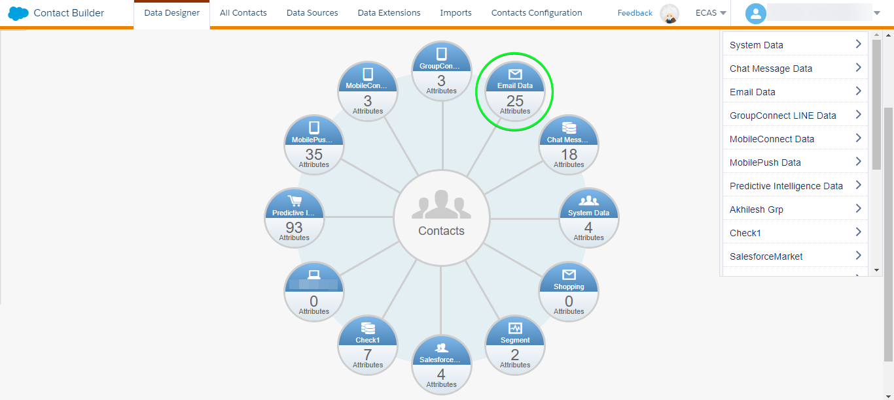

# [!DNL (API) Salesforce Marketing Cloud] 接続

## 概要 {#overview}

[[!DNL (API) Salesforce Marketing Cloud]](https://www.salesforce.com/products/marketing-cloud/overview/) ( 旧称： [!DNL ExactTarget]) は、訪問者や顧客がエクスペリエンスをパーソナライズするためのジャーニーを構築し、カスタマイズできるデジタルマーケティングスイートです。

>[!IMPORTANT]
>
>この接続と他の接続の違いに注意してください [[!DNL Salesforce Marketing Cloud] 接続](/help/destinations/catalog/email-marketing/salesforce-marketing-cloud.md) 「電子メールマーケティングカタログ」セクション内に存在する 他の SalesforceMarketing Cloud接続では、指定した格納場所にファイルを書き出すことができますが、これは API ベースのストリーミング接続です。

この [!DNL Adobe Experience Platform] [宛先](/help/destinations/home.md) は [!DNL Salesforce Marketing Cloud] [連絡先を更新](https://developer.salesforce.com/docs/marketing/marketing-cloud/guide/updateContacts.html) API（次の操作を実行できます） **連絡先の追加と連絡先データの更新** 新しい [!DNL Salesforce Marketing Cloud] セグメント。

[!DNL Salesforce Marketing Cloud] は、OAuth 2 とクライアント資格情報を使用し、 [!DNL Salesforce Marketing Cloud] API [!DNL Salesforce Marketing Cloud] インスタンスを認証する手順は、さらに下の[宛先に対する認証](#authenticate)の節にあります。

## ユースケース {#use-cases}

をいつどのように使用するかをより深く理解するのに役立ちます。 [!DNL (API) Salesforce Marketing Cloud] の宛先について、Adobe Experience Platformのお客様がこの宛先を使用して解決できる使用例を以下に示します。

### マーケティングキャンペーン用の連絡先へのメール送信 {#use-case-send-emails}

レンタルホームプラットフォームの販売部門は、ターゲットとなる顧客オーディエンスにマーケティングメールを放送したいと考えています。 プラットフォームのマーケティングチームは、新しい連絡先を追加したり、既存の連絡先を更新したりできます *（およびその電子メールアドレス）* Adobe Experience Platformを通じて、独自のオフラインデータからセグメントを作成し、それらのセグメントをに送信する [!DNL Salesforce Marketing Cloud]：マーケティングキャンペーンの電子メールの送信に使用できます。

## 前提条件 {#prerequisites}

### Experience Platformの前提条件 {#prerequisites-in-experience-platform}

[!DNL (API) Salesforce Marketing Cloud] 宛先へのデータをアクティブ化する前に、[スキーマ](/help/xdm/schema/composition.md)、[データセット](https://experienceleague.adobe.com/docs/platform-learn/tutorials/data-ingestion/create-datasets-and-ingest-data.html?lang=ja)および[セグメント](https://experienceleague.adobe.com/docs/platform-learn/tutorials/segments/create-segments.html?lang=ja)を [!DNL Experience Platform] で作成する必要があります。

### の前提条件 [!DNL (API) Salesforce Marketing Cloud] {#prerequisites-destination}

Platform からにデータを書き出すための次の前提条件に注意してください。 [!DNL Salesforce Marketing Cloud] アカウント：

#### [!DNL Salesforce Marketing Cloud] アカウントが必要です {#prerequisites-account}

A [!DNL Salesforce Marketing Cloud] のサブスクリプションを持つアカウント [Marketing Cloudアカウントエンゲージメント](https://www.salesforce.com/products/marketing-cloud/marketing-automation/) 続行するには、製品が必須です。

次の場所に移動： [[!DNL Salesforce] サポート](https://www.salesforce.com/company/contact-us/?d=cta-glob-footer-10) もし [!DNL Salesforce Marketing Cloud] アカウントまたはアカウントが見つかりません [!DNL Marketing Cloud Account Engagement] 製品の購読。

#### 内に属性を作成 [!DNL Salesforce Marketing Cloud] {#prerequisites-attribute}

次に対してセグメントをアクティブ化する場合 [!DNL (API) Salesforce Marketing Cloud] 宛先の場合、 **[!UICONTROL マッピング ID]** アクティブ化された各セグメントのフィールド ( **[セグメントスケジュール](#schedule-segment-export-example)** 手順

[!DNL Salesforce] では、この値がExperience Platformから取り込まれたセグメントを正しく読み取り、解釈し、内でセグメントステータスを更新するために必要です。 [!DNL Salesforce Marketing Cloud]. 詳しくは、Experience Platformドキュメントを参照してください。 [セグメントメンバーシップの詳細スキーマフィールドグループ](/help/xdm/field-groups/profile/segmentation.md) セグメントのステータスに関するガイダンスが必要な場合。

Platform からに対してアクティブ化した各セグメントに対して、 [!DNL Salesforce Marketing Cloud]の場合は、タイプの属性を作成する必要があります `Text` 範囲 [!DNL Salesforce]. 以下を使用： [!DNL Salesforce Marketing Cloud] [!DNL Contact Builder] 属性を作成します。 属性フィールド名は、 [!DNL (API) Salesforce Marketing Cloud] 宛先フィールドに入力し、 `[!DNL Email Demographics system attribute-set]`. ビジネス要件に応じて、フィールド文字を定義できます（最大 4,000 文字）。 詳しくは、 [!DNL Salesforce Marketing Cloud] [データ拡張機能のデータタイプ](https://help.salesforce.com/s/articleView?id=sf.mc_es_data_extension_data_types.htm&amp;type=5) 属性タイプに関する追加情報については、ドキュメントのページを参照してください。

詳しくは、 [!DNL Salesforce Marketing Cloud] ～に関する文書 [属性を作成](https://help.salesforce.com/s/articleView?id=mc_cab_create_an_attribute.htm&amp;type=5&amp;language=en_US) （属性の作成に関するガイダンスが必要な場合）

のデータデザイナー画面の例 [!DNL Salesforce Marketing Cloud]を使用して属性を追加する場合、次のようになります。

のビュー [!DNL Salesforce Marketing Cloud] [!DNL Email Demographics] attribute-set は次のように表示されます。

この [!DNL (API) Salesforce Marketing Cloud] 宛先は、 [!DNL Salesforce Marketing Cloud] [!DNL Search Attribute-Set Definitions REST] [API](https://developer.salesforce.com/docs/marketing/marketing-cloud/guide/retrieveAttributeSetDefinitions.html) で定義された属性とその属性セットを動的に検索するには [!DNL Salesforce Marketing Cloud].

これらは、 **[!UICONTROL ターゲットフィールド]** 選択ウィンドウ ( [マッピング](#mapping-considerations-example) を [宛先へのセグメントのアクティブ化](#activate). なお、 [!DNL Salesforce Marketing Cloud] `[!DNL Email Demographics]` 属性セットがサポートされています。

>[!IMPORTANT]
>
>内 [!DNL Salesforce Marketing Cloud]を使用する場合は、で属性を作成する必要があります **[!UICONTROL フィールド名]** が、 **[!UICONTROL マッピング ID]** 」と入力します。 例えば、以下のスクリーンショットには、という名前の属性が表示されます。 `salesforce_mc_segment_1`. この宛先に対してセグメントをアクティブ化する際に、 `salesforce_mc_segment_1` as **[!UICONTROL マッピング ID]** セグメントのオーディエンスをExperience Platformからこの属性に入力する場合。

での属性作成の例 [!DNL Salesforce Marketing Cloud]を使用する場合、は以下のようになります。

>[!TIP]
>
>* 属性を作成する際に、フィールド名に空白文字を含めないでください。 代わりに、アンダースコアを使用します。 `(_)` 文字を区切り文字として使用します。
>* Platform セグメントに使用する属性と、内の他の属性を区別するには [!DNL Salesforce Marketing Cloud]の場合は、Adobeセグメントに使用される属性に、認識可能なプレフィックスまたはサフィックスを含めることができます。 例えば、の代わりに `test_segment`，使用 `Adobe_test_segment` または `test_segment_Adobe`.
>* 他の属性が既にで作成されている場合は、 [!DNL Salesforce Marketing Cloud]を使用すると、Platform セグメントと同じ名前を使用して、 [!DNL Salesforce Marketing Cloud].

#### [!DNL Salesforce Marketing Cloud] 資格情報の収集 {#gather-credentials}

を認証する前に、以下の項目をメモしておきます。 [!DNL (API) Salesforce Marketing Cloud] 宛先。

| 資格情報 | 説明 | 例 |
| --- | --- | --- |
| サブドメイン | 詳しくは、 [[!DNL Salesforce Marketing Cloud domain prefix]](https://developer.salesforce.com/docs/marketing/marketing-cloud/guide/your-subdomain-tenant-specific-endpoints.html) この値を [!DNL Salesforce Marketing Cloud] インターフェイス。 | 次に、 [!DNL Salesforce Marketing Cloud] ドメインは  *`mcq4jrssqdlyc4lph19nnqgzzs84`.login.exacttarget.com*,  次を提供する必要があります： `mcq4jrssqdlyc4lph19nnqgzzs84` を値として使用します。 |
| クライアント ID | 詳しくは、 [!DNL Salesforce Marketing Cloud] [ドキュメント](https://developer.salesforce.com/docs/marketing/marketing-cloud/guide/access-token-s2s.html) この値を [!DNL Salesforce Marketing Cloud] インターフェイス。 | r23kxxxxxxxx0z05xxxxxx |
| クライアント秘密鍵 | 詳しくは、 [!DNL Salesforce Marketing Cloud] [ドキュメント](https://developer.salesforce.com/docs/marketing/marketing-cloud/guide/access-token-s2s.html) この値を [!DNL Salesforce Marketing Cloud] インターフェイス。 | ipxxxxxxxxxxT4xxxxxxxxxx |

{style="table-layout:auto"}

### ガードレール {#guardrails}

* Salesforce が特定の [レート制限](https://developer.salesforce.com/docs/marketing/marketing-cloud/guide/rate-limiting.html).
   * 詳しくは、 [!DNL Salesforce Marketing Cloud] [ドキュメント](https://developer.salesforce.com/docs/marketing/marketing-cloud/guide/rate-limiting-errors.html) を使用して、実行中に発生する可能性のある制限事項に対処し、エラーを減らします。
   * 詳しくは、 [[!DNL Salesforce Marketing Cloud] エンゲージメントの価格](https://www.salesforce.com/editions-pricing/marketing-cloud/email/) ページ *Full Edition 比較グラフのダウンロード* プランで課せられた制限の詳細を示す pdf 形式
   * この [API の概要](https://developer.salesforce.com/docs/marketing/marketing-cloud/guide/apis-overview.html) ページの詳細に関する追加の制限。
   * 参照 [ここ](https://salesforce.stackexchange.com/questions/205898/marketing-cloud-api-limits) を参照してください。
* の数 *オブジェクトごとに許可されるカスタムフィールド* Salesforce エディションに応じて異なります。
   * 詳しくは、 [!DNL Salesforce] [ドキュメント](https://help.salesforce.com/s/articleView?id=sf.custom_field_allocations.htm&amp;type=5) を参照してください。
   * が、 *オブジェクトごとに許可されるカスタムフィールド* 範囲 [!DNL Salesforce Marketing Cloud] 次が必要です：
      * で新しい属性を追加する前に、古い属性を削除します。 [!DNL Salesforce Marketing Cloud].
      * これらの古い属性名を用いて **[!UICONTROL マッピング ID]** 期間中 [セグメントスケジュール](#schedule-segment-export-example) 手順

## サポートされる ID {#supported-identities}

[!DNL (API) Salesforce Marketing Cloud] では、以下の表で説明する ID のアクティベーションをサポートしています。[ID](/help/identity-service/namespaces.md) についての詳細情報。

| ターゲット ID | 説明 | 注意点 |
|---|---|---|
| contactKey | [!DNL Salesforce Marketing Cloud] 連絡先キー。 詳しくは、 [!DNL Salesforce Marketing Cloud] [ドキュメント](https://help.salesforce.com/s/articleView?id=sf.mc_cab_contact_builder_best_practices.htm&amp;type=5) 追加のガイダンスが必要な場合は、を参照してください。 | 必須 |

## 書き出しのタイプと頻度 {#export-type-frequency}

宛先の書き出しのタイプと頻度について詳しくは、以下の表を参照してください。

| 項目 | タイプ | メモ |
---------|----------|---------|
| 書き出しタイプ | **[!UICONTROL プロファイルベース]** | <ul><li>セグメントのすべてのメンバーを、フィールドマッピングに従って、必要なスキーマフィールドと共に書き出します&#x200B;*（例：メールアドレス、電話番号、姓）*。</li><li> [!DNL Salesforce Marketing Cloud] の各セグメントのステータスは、[セグメントスケジュール](#schedule-segment-export-example)手順の最中に指定された&#x200B;**[!UICONTROL マッピング ID]** 値に基づいて、Platform の対応するセグメントステータスとともに更新されます。</li></ul> |
| 書き出し頻度 | **[!UICONTROL ストリーミング]** | ストリーミングの宛先は常に、API ベースの接続です。セグメント評価に基づいて Experience Platform 内でプロファイルが更新されるとすぐに、コネクタは更新を宛先プラットフォームに送信します。[ストリーミングの宛先](/help/destinations/destination-types.md#streaming-destinations)の詳細についてはこちらを参照してください。 |

{style="table-layout:auto"}

## 宛先への接続 {#connect}

>[!IMPORTANT]
>
>宛先に接続するには、**[!UICONTROL 宛先の管理]** [アクセス制御権限](/help/access-control/home.md#permissions)が必要です。詳しくは、[アクセス制御の概要](/help/access-control/ui/overview.md)または製品管理者に問い合わせて、必要な権限を取得してください。

この宛先に接続するには、[宛先設定のチュートリアル](../../ui/connect-destination.md)の手順に従ってください。宛先の設定ワークフローで、以下の 2 つのセクションにリストされているフィールドに入力します。

内 **[!UICONTROL 宛先]** > **[!UICONTROL カタログ]**、を検索します。 [!DNL (API) Salesforce Marketing Cloud]. または、 **[!UICONTROL 電子メールマーケティング]** カテゴリ。

### 宛先に対する認証 {#authenticate}

宛先を認証するには、以下の必須フィールドに入力し、を選択します。 **[!UICONTROL 宛先に接続]**. 詳しくは、[ [!DNL Salesforce Marketing Cloud]  資格情報の収集](#gather-credentials)の節を参照してください。

| [!DNL (API) Salesforce Marketing Cloud] 宛先 | [!DNL Salesforce Marketing Cloud] |
| --- | --- |
| **[!UICONTROL サブドメイン]** | お使いの [!DNL Salesforce Marketing Cloud] ドメインプレフィックス。  例えば、ドメインが   *`mcq4jrssqdlyc4lph19nnqgzzs84`.login.exacttarget.com*,   次を提供する必要があります： `mcq4jrssqdlyc4lph19nnqgzzs84` を値として使用します。 |
| **[!UICONTROL クライアント ID]** | お使いの [!DNL Salesforce Marketing Cloud] `Client ID`. |
| **[!UICONTROL クライアント秘密鍵]** | お使いの [!DNL Salesforce Marketing Cloud] `Client Secret`. |

指定した詳細が有効な場合、UI に **[!UICONTROL 接続済み]** ステータスに緑色のチェックマークが付いている場合は、次の手順に進むことができます。

### 宛先の詳細を入力 {#destination-details}

宛先の詳細を設定するには、以下の必須フィールドとオプションフィールドに入力します。UI のフィールドの横にアスタリスクが表示される場合は、そのフィールドが必須であることを示します。

* **[!UICONTROL 名前]**：今後この宛先を認識するための名前。
* **[!UICONTROL 説明]**：今後この宛先を識別するのに役立つ説明。

### アラートの有効化 {#enable-alerts}

アラートを有効にすると、宛先へのデータフローのステータスに関する通知を受け取ることができます。リストからアラートを選択して、データフローのステータスに関する通知を受け取るよう登録します。アラートについて詳しくは、[UI を使用した宛先アラートの購読](../../ui/alerts.md)についてのガイドを参照してください。

宛先接続の詳細の入力を終えたら「**[!UICONTROL 次へ]**」を選択します。

## この宛先に対してセグメントをアクティブ化 {#activate}

>[!IMPORTANT]
>
>データをアクティブ化するには、**[!UICONTROL 宛先の管理]**、**[!UICONTROL 宛先のアクティブ化]**、**[!UICONTROL プロファイルの表示]**&#x200B;および&#x200B;**[!UICONTROL セグメントの表示]**[に対するアクセス制御権限](/help/access-control/home.md#permissions)が必要です。詳しくは、[アクセス制御の概要](/help/access-control/ui/overview.md)または製品管理者に問い合わせて、必要な権限を取得してください。

この宛先にオーディエンスセグメントをアクティベートする手順は、[ストリーミングセグメントの書き出し宛先へのプロファイルとセグメントのアクティベート](/help/destinations/ui/activate-segment-streaming-destinations.md)を参照してください。

### マッピングの考慮事項と例 {#mapping-considerations-example}

Adobe Experience Platform から [!DNL (API) Salesforce Marketing Cloud] 宛先にオーディエンスデータを正しく送信するには、フィールドマッピングの手順を実行する必要があります。マッピングは、Platform アカウント内の Experience Data Model（XDM）スキーマフィールドと、ターゲット宛先から対応する同等のスキーマフィールドとの間にリンクを作成して構成されます。 

XDM フィールドを [!DNL (API) Salesforce Marketing Cloud] 宛先フィールドには、次の手順に従います。

>[!IMPORTANT]
>
>属性名は [!DNL Salesforce Marketing Cloud] アカウント、両方の `contactKey` および `personalEmail.address` は必須です。 属性をマッピングする場合、Experience Platformの属性のみ `Email Demographics` 属性セットは、ターゲットフィールド内で使用する必要があります。

1. **[!UICONTROL マッピング]**&#x200B;手順で、「**[!UICONTROL 新しいマッピングを追加]**」を選択します。画面に新しいマッピング行が表示されます。
   
1. 内 **[!UICONTROL ソースフィールドを選択]** ウィンドウで、 **[!UICONTROL 属性を選択]** カテゴリを選択して XDM 属性を選択するか、 **[!UICONTROL ID 名前空間を選択]** ID を選択します。
1. 内 **[!UICONTROL ターゲットフィールドを選択]** ウィンドウで、 **[!UICONTROL ID 名前空間を選択]** ID を選択するか、 **[!UICONTROL カスタム属性を選択]** カテゴリを選択し、 `Email Demographics` 必要に応じて表示される属性。 この [!DNL (API) Salesforce Marketing Cloud] 宛先は [!DNL Salesforce Marketing Cloud] [!DNL Search Attribute-Set Definitions REST] [API](https://developer.salesforce.com/docs/marketing/marketing-cloud/guide/retrieveAttributeSetDefinitions.html) で定義された属性とその属性セットを動的に取得するには [!DNL Salesforce Marketing Cloud]. これらは、 **[!UICONTROL ターゲットフィールド]** 設定時のポップアップ [マッピング](#mapping-considerations-example) 内 [ワークフローでのセグメントのアクティブ化](#activate). なお、 [!DNL Salesforce Marketing Cloud] `[!DNL Email Demographics]` 属性セットがサポートされています。

   * これらの手順を繰り返して、XDM プロファイルスキーマとの間に次のマッピングを追加します。 [!DNL (API) Salesforce Marketing Cloud]: |ソースフィールド|ターゲットフィールド|必須| |—|—|—| |`IdentityMap: contactKey`|`Identity: salesforceContactKey`| `Mandatory` |\
      |`xdm: person.name.firstName`|`Attribute: Email Demographics.First Name`| - |
|`xdm: personalEmail.address`|`Attribute: Email Addresses.Email Address`| - |

   * これらのマッピングの使用例を次に示します。
      

宛先接続のマッピングの指定が完了したら、「 」を選択します。 **[!UICONTROL 次へ]**.

### セグメントの書き出しをスケジュールと例 {#schedule-segment-export-example}

実行時に [セグメントの書き出しをスケジュール](/help/destinations/ui/activate-segment-streaming-destinations.md#scheduling) 手順に従い、Platform セグメントを [属性](#prerequisites-attribute) in [!DNL Salesforce Marketing Cloud].

これをおこなうには、各セグメントを選択し、次の場所から属性の名前を入力します。 [!DNL Salesforce Marketing Cloud] 内 [!DNL (API) Salesforce Marketing Cloud] **[!UICONTROL マッピング ID]** フィールドに入力します。 詳しくは、 [内に属性を作成 [!DNL Salesforce Marketing Cloud]](#prerequisites-custom-field) の属性の作成に関するガイダンスとベストプラクティスの節 [!DNL Salesforce Marketing Cloud].

例えば、 [!DNL Salesforce Marketing Cloud] 属性が `salesforce_mc_segment_1`を使用する場合は、この値を [!DNL (API) Salesforce Marketing Cloud] **[!UICONTROL マッピング ID]** セグメントのオーディエンスをExperience Platformからこの属性に入力する場合。

の属性の例 [!DNL Salesforce Marketing Cloud] は次のように表示されます。

の場所を示す例 [!DNL (API) Salesforce Marketing Cloud] **[!UICONTROL マッピング ID]** は次のように表示されます。

例えば、 [!DNL (API) Salesforce Marketing Cloud] **[!UICONTROL マッピング ID]** は、内で指定された値と完全に一致する必要があります [!DNL Salesforce Marketing Cloud] **[!UICONTROL フィールド名]**.

アクティブ化された Platform セグメントごとに、このセクションを繰り返します。

使用例に応じて、アクティブ化されたすべてのセグメントを同じにマッピングできます [!DNL Salesforce Marketing Cloud] **[!UICONTROL フィールド名]** または異なる **[!UICONTROL フィールド名]** in [!DNL (API) Salesforce Marketing Cloud]. 上記の画像に基づく典型的な例は、次のようになります。
| [!DNL (API) Salesforce Marketing Cloud] セグメント名 | [!DNL Salesforce Marketing Cloud] **[!UICONTROL フィールド名]** | [!DNL (API) Salesforce Marketing Cloud] **[!UICONTROL マッピング ID]** | | — | — | — | | salesforce mc segment 1 | `salesforce_mc_segment_1` | `salesforce_mc_segment_1` | | salesforce mc セグメント 2 | `salesforce_mc_segment_2` | `salesforce_mc_segment_2` |

## データの書き出しを検証する {#exported-data}

宛先が正しく設定されていることを検証するには、次の手順に従います。

1. **[!UICONTROL 宛先]**／**[!UICONTROL 参照]** を選択して、宛先のリストに移動します。
   

1. 宛先を選択し、ステータスが「 **[!UICONTROL 有効]**」であることを確認します。
   

1. 「**[!DNL Activation data]**」タブに切り替えて、セグメント名を選択します。
   

1. セグメント概要をモニターし、プロファイルの数がセグメント内で作成された数と一致していることを確認します。
   

1. にログインします。 [[!DNL Salesforce Marketing Cloud]](https://mc.exacttarget.com/) web サイト。次に、 **[!DNL Audience Builder]** > **[!DNL Contact Builder]** > **[!DNL All contacts]** > **[!DNL Email]** ページを開き、セグメントのプロファイルが追加されたかどうかを確認します。
   

1. プロファイルが更新されているかどうかを確認するには、 **[!UICONTROL 電子メール]** ページを開き、セグメントのプロファイルの属性値が更新されたかどうかを確認します。 成功した場合は、各セグメントのステータスが [!DNL Salesforce Marketing Cloud] は、 **[!UICONTROL マッピング ID]** 指定された値 [セグメントスケジュール](#schedule-segment-export-example) 手順
   

## データの使用とガバナンス {#data-usage-governance}

[!DNL Adobe Experience Platform] のすべての宛先は、データを処理する際のデータ使用ポリシーに準拠しています。[!DNL Adobe Experience Platform] がどのようにデータガバナンスを実施するかについて詳しくは、[データガバナンスの概要](/help/data-governance/home.md)を参照してください。

## エラーとトラブルシューティング {#errors-and-troubleshooting}

### イベントを SalesforceMarketing Cloudにプッシュ中に不明なエラーが発生しました {#unknown-errors}

* データフローの実行をチェックする際に、次のエラーメッセージが表示される場合があります。 `Unknown errors encountered while pushing events to the destination. Please contact the administrator and try again.`

   

   * このエラーを修正するには、 **[!UICONTROL マッピング ID]** アクティベーションワークフローで [!DNL (API) Salesforce Marketing Cloud] 宛先は、 [!DNL Salesforce Marketing Cloud]. 詳しくは、 [内に属性を作成 [!DNL Salesforce Marketing Cloud]](#prerequisites-custom-field) の節を参照してください。

* セグメントをアクティブ化すると、次のエラーメッセージが表示される場合があります。 `The client's IP address is unauthorized for this account. Allowlist the client's IP address...`
   * このエラーを修正するには、 [!DNL Salesforce Marketing Cloud] 追加するアカウント管理者 [Experience Platformの IP アドレス](/help/destinations/catalog/streaming/ip-address-allow-list.md) を [!DNL Salesforce Marketing Cloud] アカウントの信頼済み IP 範囲。 詳しくは、 [!DNL Salesforce Marketing Cloud] [Marketing Cloudのに含めるための IP許可リストアドレス](https://help.salesforce.com/s/articleView?id=sf.mc_es_ip_addresses_for_inclusion.htm&amp;type=5) 追加のガイダンスが必要な場合は、ドキュメントを参照してください。

## その他のリソース {#additional-resources}

* [!DNL Salesforce Marketing Cloud] [API](https://developer.salesforce.com/docs/marketing/marketing-cloud/guide/apis-overview.html)
* [!DNL Salesforce Marketing Cloud] [ドキュメント](https://developer.salesforce.com/docs/marketing/marketing-cloud/guide/updateContacts.html) 指定した属性グループ内の指定した情報で連絡先が更新される方法を説明します。

### 変更ログ {#changelog}

この節では、この宛先コネクタに対する機能の概要と重要なドキュメントの更新について説明します。

+++ 変更ログを表示

| リリース月 | 更新タイプ | 説明 |
|---|---|---|
| 2023年2月 | ドキュメントの更新 | 更新： [(API)SalesforceMarketing Cloudの前提条件](#prerequisites-destination) セクションに、 [!DNL Salesforce Marketing Cloud Account Engagement] は、この宛先を使用するための必須の購読です。 |
| 2023年2月 | 機能の更新 | 宛先の設定が正しくない場合に、Salesforce に不正な JSON が送信される問題を修正しました。 その結果、一部のユーザーで、アクティブ化に失敗した ID の数が多く表示されていました。 (PLATIR-26299) |
| 2023年1月 | ドキュメントの更新 | <ul><li>更新： [の前提条件 [!DNL Salesforce]](#prerequisites-destination) セクションで属性を作成する必要があることを呼び出すには、 [!DNL Salesforce] サイド。 この節では、その方法に関する詳細な手順と、 [!DNL Salesforce]. (PLATIR-25602)</li><li>アクティブ化された各セグメントのマッピング ID を [セグメントスケジュール](#schedule-segment-export-example) 手順 (PLATIR-25602)</li></ul> |
| 2022年10月 | 初回リリース | 宛先の初回リリースとドキュメントの公開。 |

{style="table-layout:auto"}

+++