# [!DNL SendGrid] 接続

## 概要 {#overview}

[SendGrid](https://www.sendgrid.com)は、トランザクションメールとマーケティングメールの一般的な顧客コミュニケーションプラットフォームです。

この[!DNL Adobe Experience Platform] [宛先](/help/destinations/home.md)は、[[!DNL SendGrid Marketing Contacts API]](https://api.sendgrid.com/v3/marketing/contacts)を活用しています。これにより、ファーストパーティのメールプロファイルを書き出し、ビジネスニーズに合わせて新しいSendGrid オーディエンス内でアクティブ化できます。

SendGridは、SendGrid APIとの通信のための認証メカニズムとしてAPI ベアラートークンを使用します。

## 前提条件 {#prerequisites}

宛先の設定を開始する前に、次の項目が必要です。

1. SendGrid アカウントが必要です。
   * SendGrid [ サインアップ ](https://signup.sendgrid.com/) ページに移動して、SendGrid アカウントを登録して作成します（まだアカウントをお持ちでない場合）。
1. SendGrid ポータルにログインした後、API トークンを生成する必要もあります。
1. SendGrid Web サイトに移動し、**[!DNL Settings]** > **[!DNL API Keys]** ページにアクセスします。 または、[SendGrid ドキュメント ](https://app.sendgrid.com/settings/api_keys)を参照して、SendGrid アプリの適切なセクションにアクセスしてください。
1. 最後に、**[!DNL Create API Key]** ボタンを選択します。
   * 実行するアクションに関するガイダンスが必要な場合は、[SendGrid ドキュメント ](https://docs.sendgrid.com/ui/account-and-settings/api-keys#creating-an-api-key)を参照してください。
   * API キーをプログラムで生成する場合は、[SendGrid ドキュメント ](https://docs.sendgrid.com/api-reference/api-keys/create-api-keys)を参照してください。

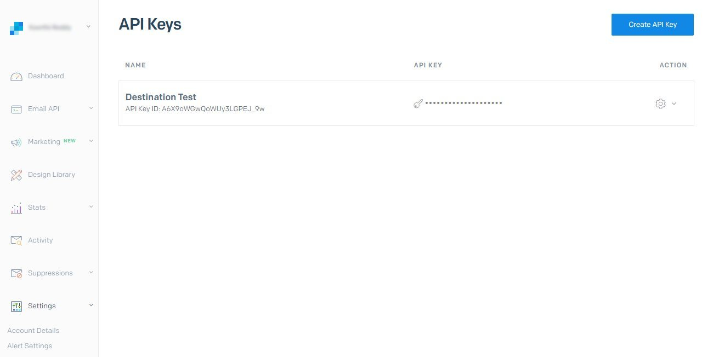

SendGrid宛先にデータをアクティブ化する前に、[で作成された](https://experienceleague.adobe.com/docs/experience-platform/xdm/schema/composition.html?lang=ja) スキーマ [、](https://experienceleague.adobe.com/docs/platform-learn/tutorials/data-ingestion/create-datasets-and-ingest-data.html) データセット [、および](https://experienceleague.adobe.com/docs/platform-learn/tutorials/segments/create-segments.html) セグメント [!DNL Experience Platform]が必要です。 このページの下にある[制限](#limits) セクションも参照してください。

>[!IMPORTANT]
>
>* メールプロファイルからメーリングリストを作成するために使用されるSendGrid APIでは、各プロファイル内で一意のメールアドレスを指定する必要があります。 これは、*email*&#x200B;または&#x200B;*代替メール*&#x200B;の値として使用されるかどうかに関係なく使用されます。 SendGrid接続では電子メールと代替メールの両方の値のマッピングがサポートされているので、使用するすべての電子メールアドレスは、*データセット*&#x200B;の各プロファイル内で一意である必要があります。 そうでない場合、メールプロファイルがSendGridに送信されると、エラーが発生し、そのメールプロファイルはデータの書き出しに表示されません。
>
>* 現在、Experience Platformのオーディエンスから削除されたプロファイルをSendGridから削除する機能はありません。

## サポートされている ID {#supported-identities}

SendGridは、以下の表に記載されているIDのアクティベーションをサポートしています。 [ID](/help/identity-service/features/namespaces.md) についての詳細情報。

| ターゲット ID | 説明 | 注意点 |
|---|---|---|
| メール | 電子メールアドレス | プレーンテキストとSHA256 ハッシュ化された電子メールアドレスの両方が[!DNL Adobe Experience Platform]でサポートされていることに注意してください。 Experience Platform ソースフィールドにハッシュ化されていない属性が含まれる場合は、**[!UICONTROL Apply transformation]** オプションをチェックして、[!DNL Experience Platform]がアクティベーション時にデータを自動的にハッシュします。   **SendGrid**&#x200B;はハッシュ化された電子メールアドレスをサポートしていないため、変換のないプレーンテキストデータのみが宛先に送信されます。 |

{style="table-layout:auto"}

## サポートされるオーディエンス {#supported-audiences}

この節では、この宛先に書き出すことができるオーディエンスのタイプについて説明します。

| オーディエンスの由来 | サポートあり | 説明 |
|---------|----------|----------|
| [!DNL Segmentation Service] | ○ | Experience Platform [ セグメント化サービス ](../../../segmentation/home.md)を通じて生成されたオーディエンス。 |
| その他すべてのオーディエンスの生成元 | × | このカテゴリには、[!DNL Segmentation Service]を通じて生成されたオーディエンス以外のすべてのオーディエンスのオリジンが含まれます。 [様々なオーディエンスの起源](/help/segmentation/ui/audience-portal.md#customize)について読みます。 次に例を示します。 <ul><li> カスタムアップロードオーディエンス [がCSV ファイルからExperience Platformに](../../../segmentation/ui/audience-portal.md#import-audience)をインポートしました。</li><li> 類似オーディエンス， </li><li> 連合オーディエンス， </li><li> [!DNL Adobe Journey Optimizer]などの他のExperience Platform アプリで生成されたオーディエンス </li><li> その他。 </li></ul> |

{style="table-layout:auto"}

オーディエンスのデータタイプ別にサポートされるオーディエンス：

| オーディエンスのデータタイプ | サポートあり | 説明 | ユースケース |
|--------------------|-----------|-------------|-----------|
| [人物オーディエンス ](/help/segmentation/types/people-audiences.md) | ○ | 顧客プロファイルにもとづいて、マーケティング施策の特定のグループをターゲットにすることができます。 | 買い物客やカートの放棄が多い |
| [ アカウントオーディエンス ](/help/segmentation/types/account-audiences.md) | × | アカウントベースドマーケティング戦略のために、特定の組織内の個人をターゲットにします。 | B2B マーケティング |
| [見込みオーディエンス ](/help/segmentation/types/prospect-audiences.md) | × | まだ顧客ではないが、ターゲットオーディエンスと特徴を共有する個人をターゲットにします。 | サードパーティデータによる見込み顧客の開拓 |
| [ データセットの書き出し](/help/catalog/datasets/overview.md) | × | [!DNL Adobe Experience Platform] データ レイクに保存されている構造化データのコレクション。 | レポート，データサイエンスワークフロー |

{style="table-layout:auto"}

## 書き出しのタイプと頻度 {#export-type-frequency}

宛先の書き出しのタイプと頻度について詳しくは、以下の表を参照してください。

| 項目 | タイプ | メモ |
|---------|----------|---------|
| 書き出しタイプ | **[!UICONTROL Profile-based]** | [宛先のアクティベーションワークフロー](/help/destinations/ui/activate-batch-profile-destinations.md#select-attributes)のプロファイル属性選択画面で選択した目的のスキーマフィールド（例：メールアドレス、電話番号、姓）と共に、セグメントのすべてのメンバーを書き出します。 |
| 書き出し頻度 | **[!UICONTROL Streaming]** | ストリーミングの宛先は常に、API ベースの接続です。オーディエンス評価に基づいて Experience Platform 内でプロファイルが更新されるとすぐに、コネクタは更新を宛先プラットフォームに送信します。[ストリーミングの宛先](/help/destinations/destination-types.md#streaming-destinations)の詳細についてはこちらを参照してください。 |

{style="table-layout:auto"}

## ユースケース {#use-cases}

SendGridの宛先を使用する方法とタイミングをより深く理解するために、[!DNL Experience Platform]のお客様がこの宛先を使用して解決できるユースケースの例を次に示します。

### 複数のマーケティング活動に対応するマーケティングリストの作成 {#create-marketing-list}

SendGridを使用しているマーケティングチームは、SendGrid内にメーリングリストを作成し、メールアドレスを入力することができます。 SendGrid内で作成されたメーリングリストは、その後、複数のマーケティング活動に使用できます。

## 宛先に接続 {#connect}

>[!IMPORTANT]
>
>宛先に接続するには、**[!UICONTROL View Destinations]**&#x200B;および&#x200B;**[!UICONTROL Manage Destinations]** [ アクセス制御権限](/help/access-control/home.md#permissions)が必要です。 詳しくは、[アクセス制御の概要](/help/access-control/ui/overview.md)または製品管理者に問い合わせて、必要な権限を取得してください。

この宛先に接続するには、[宛先設定のチュートリアル](../../ui/connect-destination.md)の手順に従ってください。宛先の設定ワークフローで、以下の 2 つのセクションにリストされているフィールドに入力します。

### 宛先に対する認証 {#authenticate}

1. [!DNL Adobe Experience Platform] コンソールで、**宛先**&#x200B;に移動します。

1. 「**カタログ**」タブを選択し、*SendGrid*&#x200B;を検索します。 次に、**設定**&#x200B;を選択します。 宛先への接続を確立すると、UI ラベルが&#x200B;**セグメントのアクティブ化**に変わります。
   「設定」ボタンがハイライト表示されたExperience Platform宛先カタログの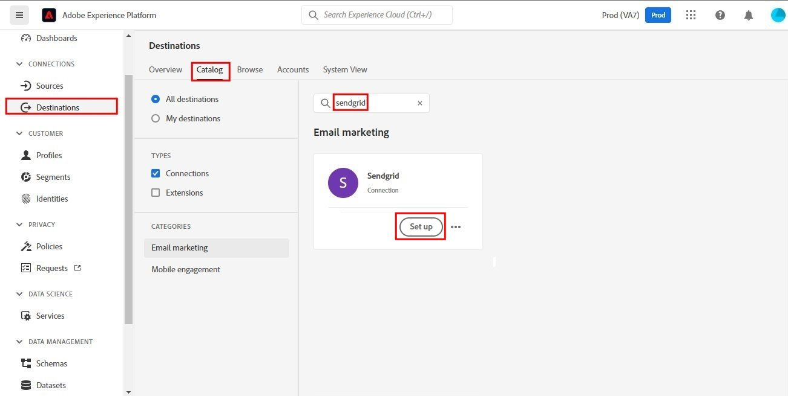

1. SendGridの宛先の設定を支援するウィザードが表示されます。 **新しい宛先を設定**を選択して、新しい宛先を作成します。
   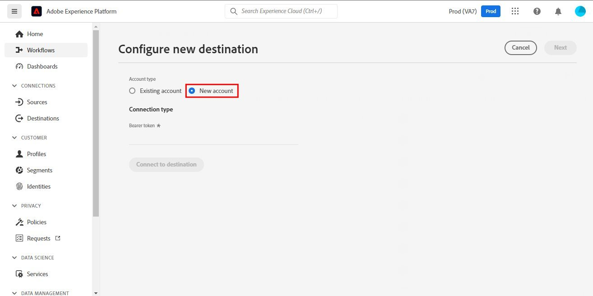

1. 「**新規アカウント**」オプションを選択し、**ベアラートークン**&#x200B;の値を入力します。 この値は、*前提条件セクション*&#x200B;で前述したSendGrid [API キー](#prerequisites)です。
   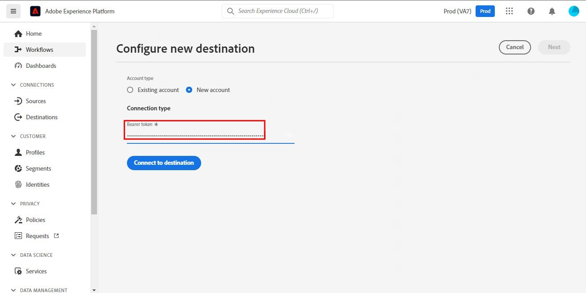

1. 「**宛先に接続**」を選択します。 指定したSendGrid *API キー*&#x200B;が有効な場合、UIに緑色のチェックマークが付いた&#x200B;**Connected**&#x200B;状態が表示されます。次の手順に進むと、追加情報フィールドに入力できます。

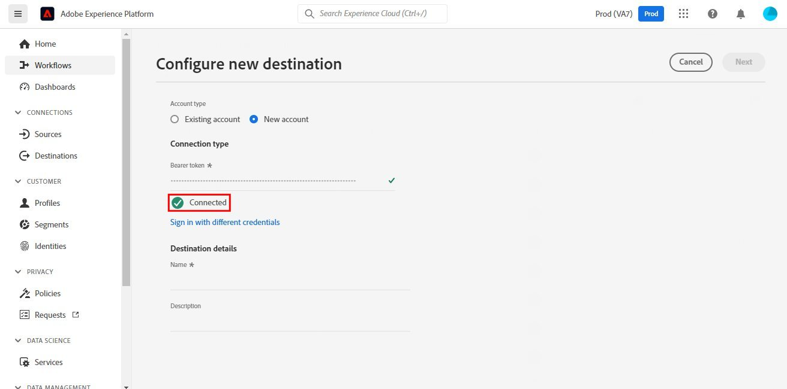

### 宛先の詳細の入力 {#destination-details}

この宛先を[設定](https://experienceleague.adobe.com/docs/experience-platform/destinations/ui/connect-destination.html?lang=ja)するとき、次の情報を指定する必要があります。

* **[!UICONTROL Name]**：今後この宛先を認識する際に使用する名前。
* **[!UICONTROL Description]**：今後この宛先を特定するのに役立つオプションの説明。

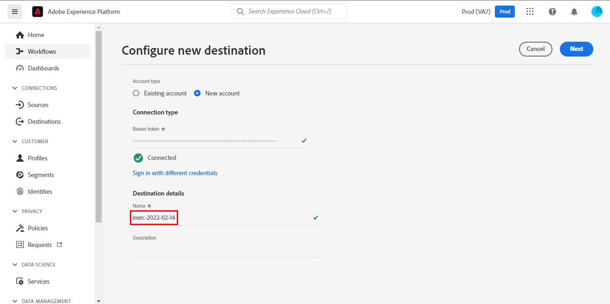

### アラートの有効化 {#enable-alerts}

アラートを有効にすると、宛先へのデータフローのステータスに関する通知を受け取ることができます。リストからアラートを選択して、データフローのステータスに関する通知を受け取るよう登録します。アラートについて詳しくは、[UI を使用した宛先アラートの購読](../../ui/alerts.md)についてのガイドを参照してください。

宛先接続の詳細の提供が完了したら、**[!UICONTROL Next]**&#x200B;を選択します。

## この宛先に対してオーディエンスをアクティブ化 {#activate}

>[!IMPORTANT]
>
>* データをアクティブ化するには、**[!UICONTROL View Destinations]**、**[!UICONTROL Activate Destinations]**、**[!UICONTROL View Profiles]**&#x200B;および&#x200B;**[!UICONTROL View Segments]** [ アクセス制御権限](/help/access-control/home.md#permissions)が必要です。 [アクセス制御の概要](/help/access-control/ui/overview.md)を参照するか、製品管理者に問い合わせて必要な権限を取得してください。
>* *ID*&#x200B;をエクスポートするには、**[!UICONTROL View Identity Graph]** [ アクセス制御権限](/help/access-control/home.md#permissions)が必要です。  {width="100" zoomable="yes"}

この宛先にオーディエンスをアクティベートする手順は、[ストリーミングオーディエンスの書き出し宛先へのプロファイルとオーディエンスのアクティベート](/help/destinations/ui/activate-segment-streaming-destinations.md)を参照してください。

この宛先に固有の詳細については、以下の画像を参照してください。

1. SendGridに書き出す1つ以上のオーディエンスを選択します。
   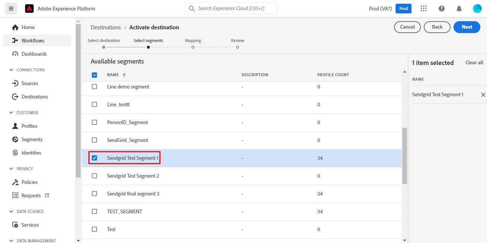

1. **[!UICONTROL Mapping]** ステップでは、**[!UICONTROL Add new mapping]**&#x200B;を選択した後、ソース XDM フィールドをSendGrid API ターゲットフィールドにマッピングするマッピングページが表示されます。 以下の画像は、Experience PlatformとSendGrid間でID名前空間をマッピングする方法を示しています。 次に示すように、**[!UICONTROL Source field]** *電子メール*&#x200B;を&#x200B;**[!UICONTROL Target field]** *external_id*にマッピングする必要があることを確認してください。
   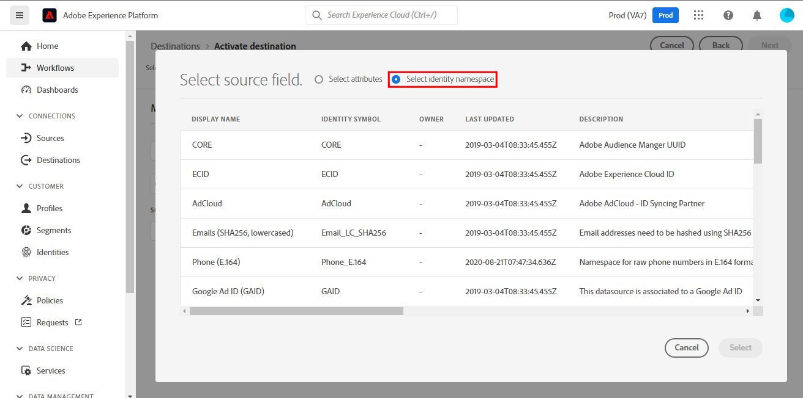
   SendGridのexternal_id ターゲットフィールドにマッピングされた電子メールソースフィールドを示す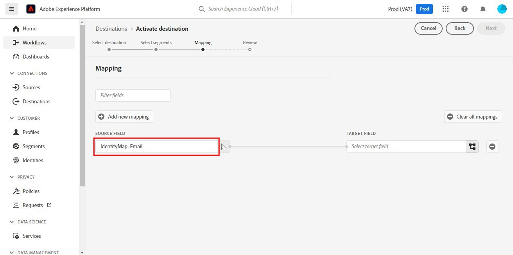
   SendGrid ターゲットフィールドにマッピングするために選択されたXDM ソース属性を示す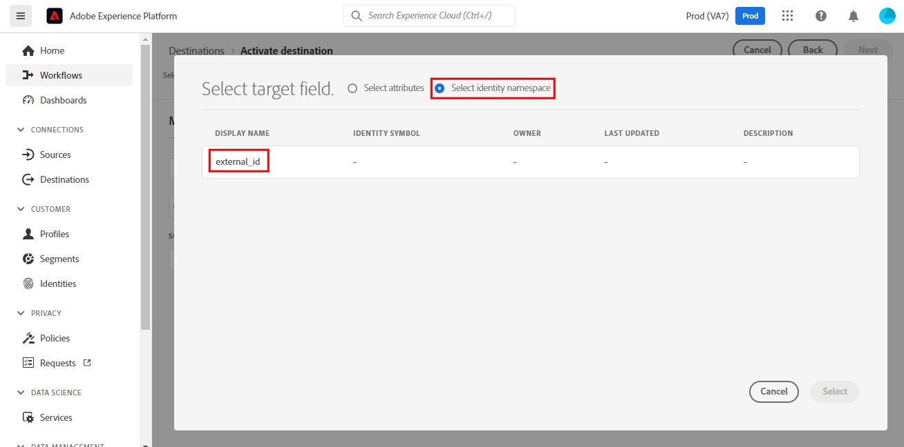
   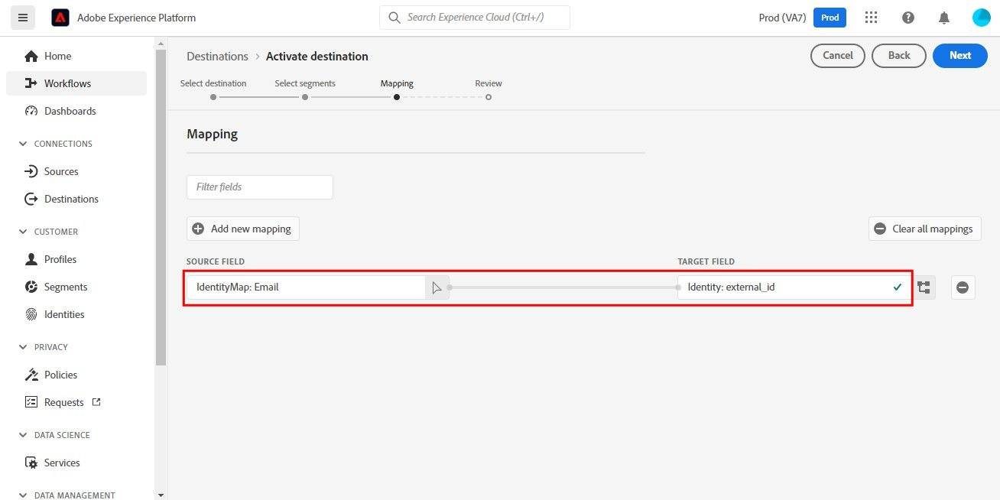

1. 同様に、SendGridの宛先に書き出す目的の[!DNL Adobe Experience Platform]属性をマッピングします。
   SendGrid エクスポートのソースフィールドとして選択されたExperience Platform プロファイル属性を示す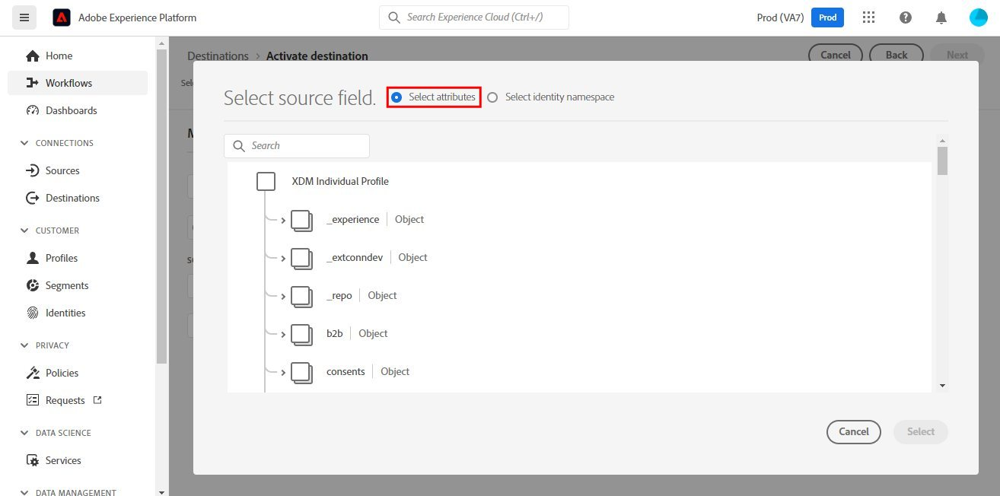
   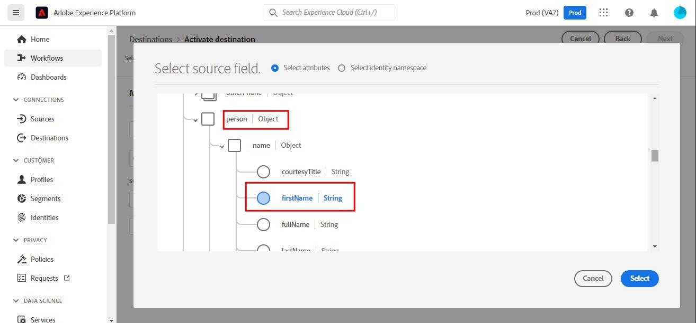

1. マッピングが完了したら、**[!UICONTROL Next]**を選択してレビュー画面に進みます。
   設定を完了する前に、設定されたマッピングの概要を示す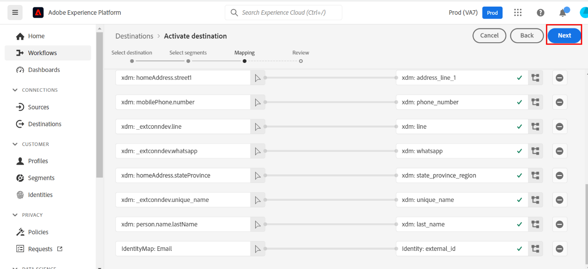

1. **[!UICONTROL Finish]**を選択して設定を完了します。
   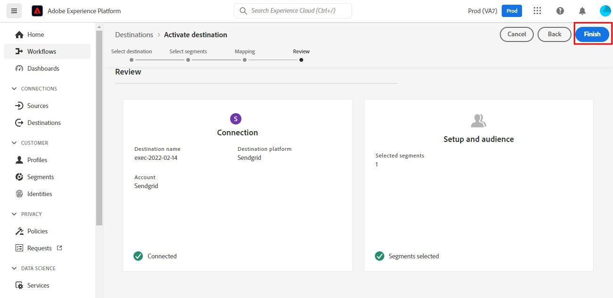

[SendGrid マーケティング連絡先/連絡先を追加または更新API](https://docs.sendgrid.com/api-reference/contacts/add-or-update-a-contact)用に設定できる、サポートされている属性マッピングの包括的なリストを以下に示します。

| ソースフィールド | ターゲットフィールド | タイプ | 説明 | 制限 |
|---|---|---|---|---|
| xdm:  homeAddress.street1 | xdm:  address_line_1 | 文字列 | アドレスの最初の行。 | 最大長：  100文字 |
| xdm:  homeAddress.street2 | xdm:  address_line_2 | 文字列 | アドレスのオプションの2行目。 | 最大長：  100文字 |
| xdm:  _extconndev.alternate_emails | xdm: 件の代替メール | 文字列の配列 | 連絡先に関連付けられた追加メール。 | <ul><li>最大：5項目</li><li>最小：0項目</li></ul> |
| xdm:  homeAddress.city | xdm: 都市 | 文字列 | 連絡先の都市。 | 最大長：  60文字 |
| xdm:  homeAddress.country | xdm: 国 | 文字列 | 連絡先の国。 フルネームまたは省略形を指定できます。 | 最大長：  50文字 |
| identityMap:  メール | ID:  external_id | 文字列 | 連絡先のプライマリメール： これは有効な電子メールである必要があります。 | 最大長：  254文字 |
| xdm:  person.name.firstName | xdm:  first_name | 文字列 | 連絡先の名前 | 最大長：  50文字 |
| xdm:  person.name.lastName | xdm:  last_name | 文字列 | 連絡先の姓 | 最大長：  50文字 |
| xdm:  homeAddress.postalCode | xdm:  postal_code | 文字列 | 連絡先の郵便番号またはその他の郵便番号。 | |
| xdm:  homeAddress.stateProvince | xdm:  state_province_region | 文字列 | 連絡先の州、都道府県、地域。 | 最大長：  50文字 |

## SendGrid内でのデータエクスポートの検証 {#validate}

宛先が正しく設定されていることを検証するには、次の手順に従います。

1. 宛先のリストに移動するには、**[!UICONTROL Destinations]** > **[!UICONTROL Browse]**を選択します。
   Experience Platformの「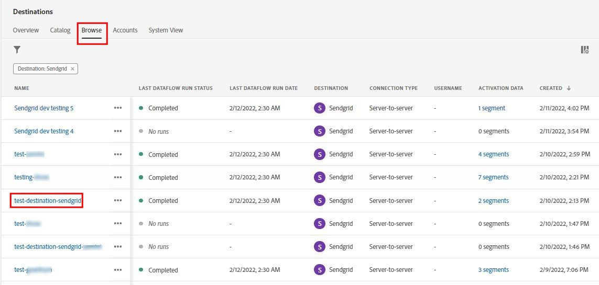

1. 宛先を選択し、ステータスが&#x200B;**[!UICONTROL enabled]**であることを検証します。
   「参照」タブの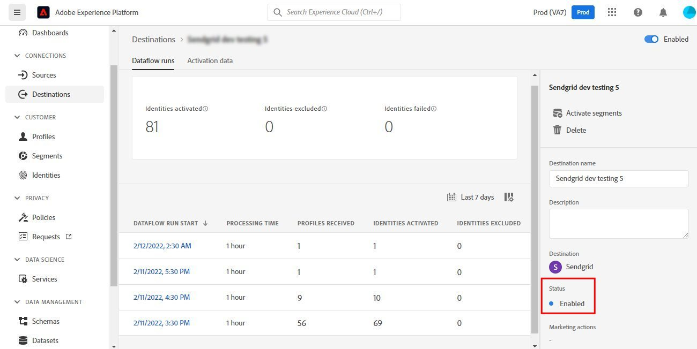

1. 「**[!DNL Activation data]**」タブに切り替えて、オーディエンス名を選択します。
   SendGrid宛先の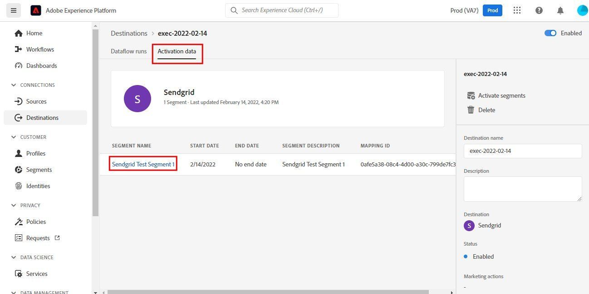

1. オーディエンスの概要を監視し、プロファイルの数がデータセット内で作成された数に対応しているかどうかを確認します。
   選択したSendGrid オーディエンスのプロファイル数を表示する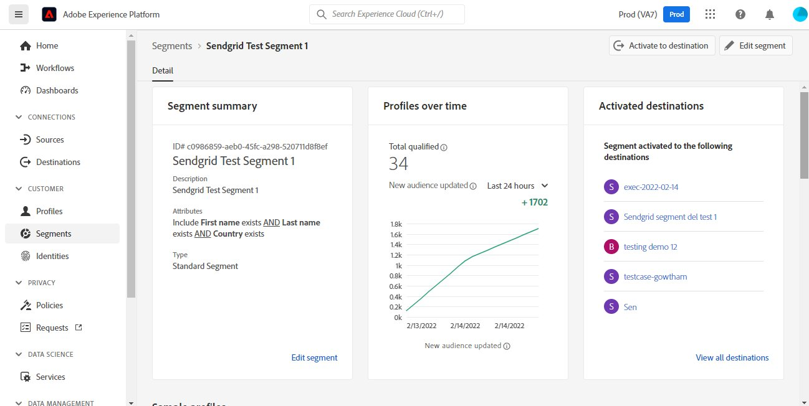

1. [SendGrid マーケティングリスト > リストを作成API](https://docs.sendgrid.com/api-reference/lists/create-list)は、*list_name*属性の値とデータ書き出しのタイムスタンプを結合することで、SendGrid内に一意の連絡先リストを作成します。 SendGrid サイトに移動し、名前パターンに準拠した新しい連絡先リストが作成されているかどうかを確認します。
   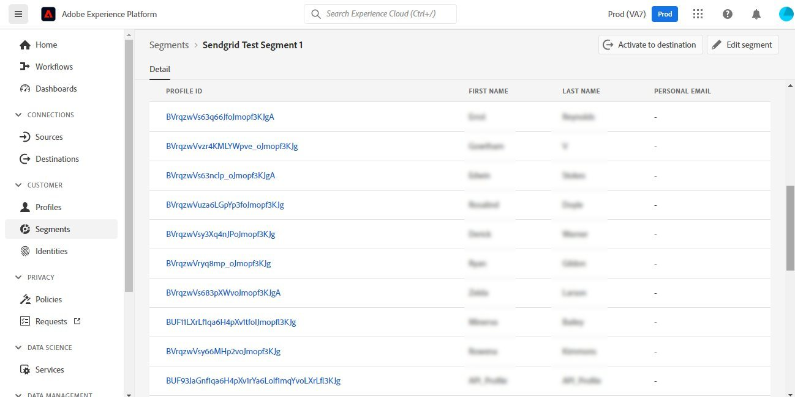
   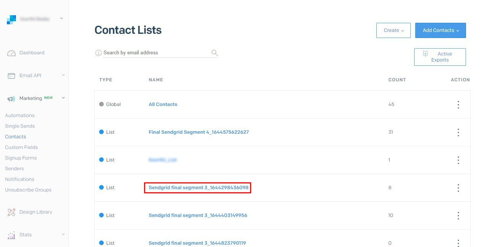

1. 新しく作成した連絡先リストを選択し、作成したデータセットの新しいメールレコードが新しい連絡先リスト内に入力されているかどうかを確認します。

1. さらに、フィールドマッピングが正しいかどうかを検証するために、いくつかのメールも確認してください。
   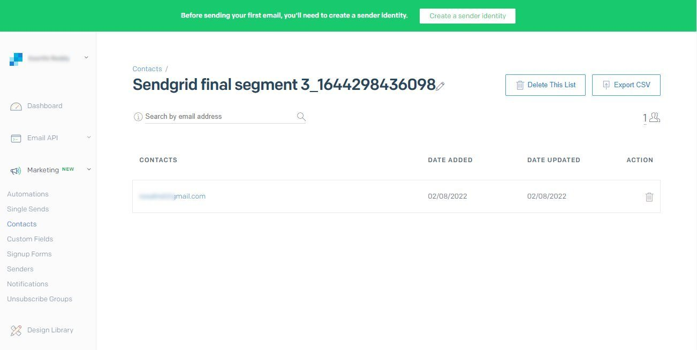
   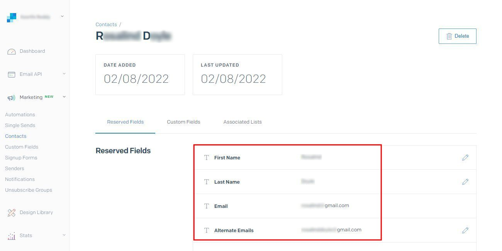

## データの使用とガバナンス {#data-usage-governance}

[!DNL Adobe Experience Platform] のすべての宛先は、データを処理する際のデータ使用ポリシーに準拠しています。[!DNL Adobe Experience Platform] がどのようにデータガバナンスを実施するかについて詳しくは、[データガバナンスの概要](/help/data-governance/home.md)を参照してください。

## その他のリソース {#additional-resources}

このSendGrid宛先は、以下のAPIを活用しています。

* [SendGrid マーケティングリスト > リストを作成API](https://docs.sendgrid.com/api-reference/lists/create-list)
* [SendGrid マーケティング連絡先>連絡先APIの追加または更新](https://docs.sendgrid.com/api-reference/contacts/add-or-update-a-contact)

### 制限 {#limits}

* [SendGrid Marketing Contacts > Add or Update Contact API](https://api.sendgrid.com/v3/marketing/contacts)では、30,000件の連絡先または6 MBのデータのいずれか少ない方を受け付けることができます。
