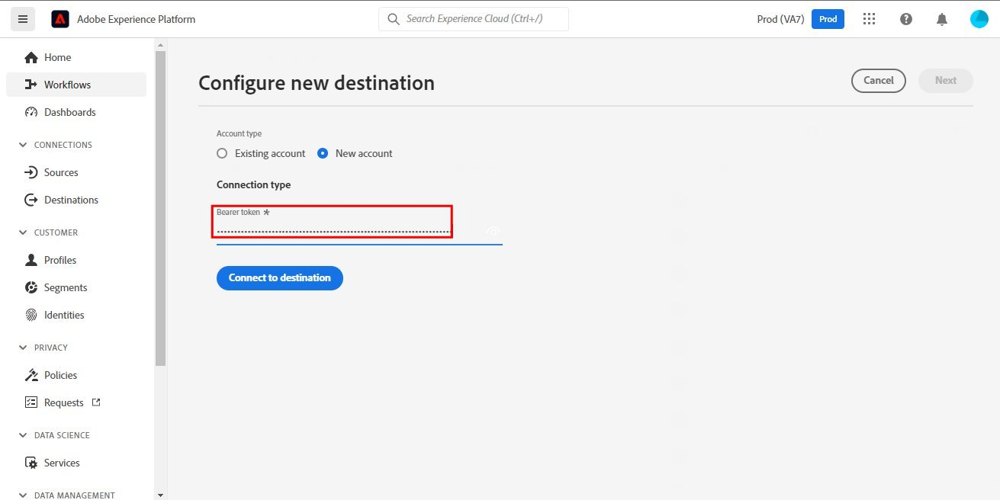
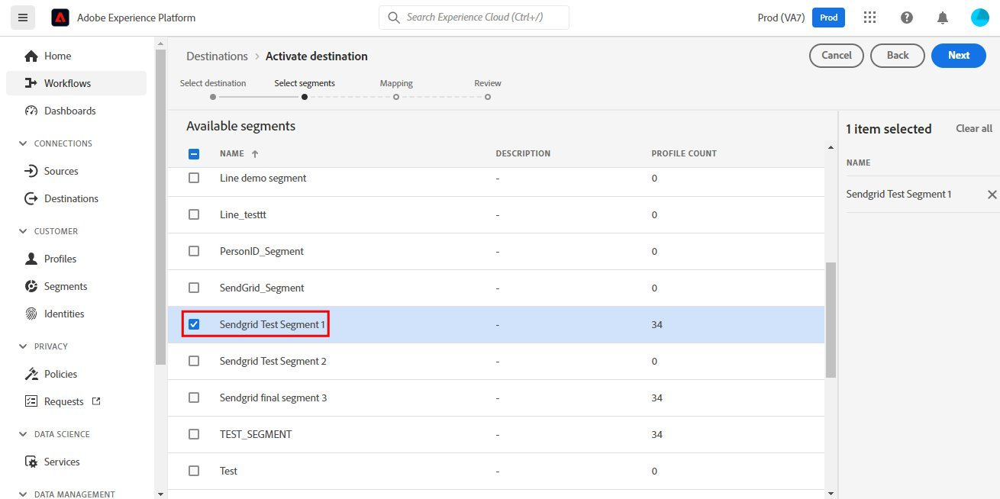

# [!DNL SendGrid] 接続

## 概要 {#overview}

[SendGrid](https://www.sendgrid.com) は、トランザクション E メールとマーケティング E メールに関する一般的な顧客通信プラットフォームです。

この [!DNL Adobe Experience Platform] [宛先](/help/destinations/home.md) は [[!DNL SendGrid Marketing Contacts API]](https://api.sendgrid.com/v3/marketing/contacts)：ファーストパーティの E メールプロファイルを書き出し、ビジネスニーズに合わせて新しい SendGrid セグメント内でアクティブ化できます。

SendGrid は、SendGrid API と通信するための認証メカニズムとして、API ベアラートークンを使用します。

## 前提条件 {#prerequisites}

宛先の設定を開始する前に、次の項目が必要です。

1. SendGrid アカウントが必要です。
   * SendGrid に移動します。 [登録](https://signup.sendgrid.com/) SendGrid アカウントを登録および作成するページ（まだ存在しない場合）。
1. SendGrid ポータルにログインした後、API トークンを生成する必要もあります。
1. SendGrid Web サイトに移動し、 **[!DNL Settings]** > **[!DNL API Keys]** ページ。 または、 [SendGrid ドキュメント](https://app.sendgrid.com/settings/api_keys) をクリックして、SendGrid アプリの適切なセクションにアクセスします。
1. 最後に、 **[!DNL Create API Key]** 」ボタンをクリックします。
   * 詳しくは、 [SendGrid ドキュメント](https://docs.sendgrid.com/ui/account-and-settings/api-keys#creating-an-api-key)実行するアクションに関するガイダンスが必要な場合は、を参照してください。
   * API キーをプログラムで生成する場合は、 [SendGrid ドキュメント](https://docs.sendgrid.com/api-reference/api-keys/create-api-keys).

SendGrid の宛先に対してデータをアクティブ化する前に、 [スキーマ](https://experienceleague.adobe.com/docs/experience-platform/xdm/schema/composition.html?lang=ja), a [データセット](https://experienceleague.adobe.com/docs/platform-learn/tutorials/data-ingestion/create-datasets-and-ingest-data.html?lang=en)、および [セグメント](https://experienceleague.adobe.com/docs/platform-learn/tutorials/segments/create-segments.html?lang=en) 次で作成： [!DNL Experience Platform]. また、 [制限](#limits) の節をこのページの後半に示します。

>[!IMPORTANT]
>
>* E メールプロファイルからメーリングリストを作成するために使用される SendGrid API では、各プロファイル内に一意の E メールアドレスを提供する必要があります。 これは、がの値として使用されているかどうかに関係ありません *電子メール* または *代替メール*. SendGrid 接続は、電子メールと代替電子メールの両方の値のマッピングをサポートしているので、使用する電子メールアドレスは、 *データセット*. そうしないと、電子メールプロファイルが SendGrid に送信された場合に、エラーが発生し、その電子メールプロファイルはデータエクスポートに存在しなくなります。
>
>* 現在、プロファイルがExperience Platformのセグメントから削除される際に、SendGrid からプロファイルを削除する機能はありません。

## サポートされる ID {#supported-identities}

SendGrid では、以下の表で説明する ID のアクティブ化がサポートされています。 詳細情報： [id](/help/identity-service/namespaces.md).

| ターゲット ID | 説明 | 注意点 |
|---|---|---|
| 電子メール | メールアドレス | プレーンテキストと SHA256 ハッシュ化された電子メールアドレスの両方が、 [!DNL Adobe Experience Platform]. Experience Platform ソースフィールドにハッシュ化されていない属性が含まれている場合は、 **[!UICONTROL 変換を適用]** オプション [!DNL Platform] 有効化時に、データを自動的にハッシュ化します。   注意： **SendGrid** では、ハッシュ化された電子メールアドレスをサポートしていないので、変換をおこなわないプレーンテキストデータのみが宛先に送信されます。 |

{style=&quot;table-layout:auto&quot;}

## エクスポートのタイプと頻度 {#export-type-frequency}

宛先の書き出しのタイプと頻度について詳しくは、次の表を参照してください。

| 項目 | タイプ | 備考 |
---------|----------|---------|
| 書き出しタイプ | **[!UICONTROL プロファイルベース]** | セグメントのすべてのメンバーを、目的のスキーマフィールド ( 例：（電子メールアドレス、電話番号、姓）。「プロファイル属性を選択」画面で選択します。 [宛先のアクティベーションワークフロー](/help/destinations/ui/activate-batch-profile-destinations.md#select-attributes). |
| 書き出し頻度 | **[!UICONTROL ストリーミング]** | ストリーミングの宛先は、API ベースの接続です。 セグメント評価に基づいてExperience Platform内でプロファイルが更新されるとすぐに、コネクタは更新を宛先プラットフォームに送信します。 詳細を表示 [ストリーミング先](/help/destinations/destination-types.md#streaming-destinations). |

{style=&quot;table-layout:auto&quot;}

## ユースケース {#use-cases}

SendGrid の宛先をいつどのように使用するかを理解しやすくするために、以下に示す使用例を示します [!DNL Experience Platform] のお客様は、この宛先を使用してを解決できます。

### 複数のマーケティングアクティビティ用のマーケティングリストの作成

SendGrid を使用するマーケティングチームは、SendGrid 内にメーリングリストを作成し、メールアドレスを設定することができます。 SendGrid 内で作成されたメーリングリストは、その後、複数のマーケティングアクティビティで使用できます。

## 宛先に接続 {#connect}

>[!IMPORTANT]
> 
>宛先に接続するには、 **[!UICONTROL 宛先の管理]** [アクセス制御権限](/help/access-control/home.md#permissions). 詳しくは、 [アクセス制御の概要](/help/access-control/ui/overview.md) または製品管理者に問い合わせて、必要な権限を取得してください。

この宛先に接続するには、[宛先設定のチュートリアル](../../ui/connect-destination.md)の手順に従ってください。宛先の設定ワークフローで、以下の 2 つのセクションに記載されているフィールドに入力します。

### 宛先に対する認証 {#authenticate}

1. 内 [!DNL Adobe Experience Platform] コンソール、に移動します。 **宛先**.

1. を選択します。 **カタログ** タブと検索 *SendGrid*. 次に、 **設定**. 宛先への接続を確立すると、UI ラベルがに変わります。 **セグメントのアクティブ化**.
   

1. SendGrid の宛先の設定に役立つウィザードが表示されます。 「 」を選択して新しい宛先を作成します **新しい宛先の設定**.
   

1. を選択します。 **新規アカウント** オプションを選択し、 **Bearer トークン** の値です。 この値は SendGrid です *API キー* 前述の [前提条件の節](#prerequisites).
   

1. 選択 **宛先に接続**. SendGrid *API キー* が有効である場合、UI に **接続済み** ステータスに緑のチェックマークが付いている場合は、次の手順に進み、追加の情報フィールドに入力できます。

### 宛先の詳細を入力 {#destination-details}

この宛先を[設定](https://experienceleague.adobe.com/docs/experience-platform/destinations/ui/connect-destination.html?lang=en)するとき、次の情報を指定する必要があります。

* **[!UICONTROL 名前]**:今後この宛先を認識するための名前。
* **[!UICONTROL 説明]**:将来この宛先を識別するのに役立つオプションの説明です。

### アラートの有効化 {#enable-alerts}

アラートを有効にして、宛先へのデータフローのステータスに関する通知を受け取ることができます。 リストからアラートを選択して、データフローのステータスに関する通知を受け取るよう登録します。アラートの詳細については、 [UI を使用した宛先アラートの購読](../../ui/alerts.md).

宛先接続の詳細の指定が完了したら、 **[!UICONTROL 次へ]**.

## この宛先に対してセグメントをアクティブ化 {#activate}

>[!IMPORTANT]
> 
>データをアクティブ化するには、 **[!UICONTROL 宛先の管理]**, **[!UICONTROL 宛先のアクティブ化]**, **[!UICONTROL プロファイルの表示]**、および **[!UICONTROL セグメントを表示]** [アクセス制御権限](/help/access-control/home.md#permissions). 詳しくは、 [アクセス制御の概要](/help/access-control/ui/overview.md) または製品管理者に問い合わせて、必要な権限を取得してください。

読み取り [ストリーミングセグメントの書き出し先に対するプロファイルとセグメントのアクティブ化](/help/destinations/ui/activate-segment-streaming-destinations.md) を参照してください。

この宛先に固有の詳細については、以下の画像を参照してください。

1. SendGrid に書き出すセグメントを 1 つ以上選択します。
   

1. 内 **[!UICONTROL マッピング]** ステップ、選択後 **[!UICONTROL 新しいマッピングを追加]**&#x200B;に値を入力すると、ソース XDM フィールドを SendGrid API ターゲットフィールドにマッピングするためのマッピングページが表示されます。 以下の画像は、ID 名前空間を SendGrid と SendGrid の間でマッピングするExperience Platformを示しています。 次の項目を確認してください： **[!UICONTROL ソースフィールド]** *電子メール* は **[!UICONTROL ターゲットフィールド]** *external_id* 以下に示すように。
   

   
   
   

1. 同様に、目的の [!DNL Adobe Experience Platform] SendGrid の宛先に書き出す属性。
   

   

1. マッピングを完了したら、 **[!UICONTROL 次へ]** をクリックして、レビュー画面に進みます。
   

1. 選択 **[!UICONTROL 完了]** をクリックして設定を完了します。
   

サポートされる属性マッピングの包括的なリスト。 [SendGrid マーケティング連絡先/連絡先 API の追加または更新](https://docs.sendgrid.com/api-reference/contacts/add-or-update-a-contact) は以下です。

| ソースフィールド | ターゲットフィールド | タイプ | 説明 | 制限 |
|---|---|---|---|---|
| xdm:  homeAddress.street1 | xdm:  address_line_1 | 文字列 | 住所の最初の行。 | 最大長：  100 文字 |
| xdm:  homeAddress.street2 | xdm:  address_line_2 | 文字列 | 住所の 2 行目（オプション）。 | 最大長：  100 文字 |
| xdm:  _extconndev.alternate_emails | xdm:  alternate_emails | 文字列の配列 | 連絡先に関連付けられた追加の電子メール。 | <ul><li>最大：5 項目</li><li>最小：0 項目</li></ul> |
| xdm:  homeAddress.city | xdm:  市区町村 | 文字列 | 連絡先の市区町村。 | 最大長：  60 文字 |
| xdm:  homeAddress.country | xdm:  国 | 文字列 | 連絡先の国。 フルネームまたは省略形を指定できます。 | 最大長：  50 文字 |
| identityMap:  電子メール | ID:  external_id | 文字列 | 連絡先のプライマリ E メール。 これは有効な E メールである必要があります。 | 最大長：  254 文字 |
| xdm:  person.name.firstName | xdm:  first_name | 文字列 | 連絡先の名前 | 最大長：  50 文字 |
| xdm:  person.name.lastName | xdm:  last_name | 文字列 | 連絡先の姓 | 最大長：  50 文字 |
| xdm:  homeAddress.postalCode | xdm:  postal_code | 文字列 | 連絡先の郵便番号。 |  |
| xdm:  homeAddress.stateProvince | xdm:  state_province_region | 文字列 | 連絡先の州、都道府県または地域。 | 最大長：  50 文字 |

## SendGrid 内でのデータエクスポートの検証 {#validate}

宛先が正しく設定されていることを検証するには、次の手順に従います。

1. 選択 **[!UICONTROL 宛先]** > **[!UICONTROL 参照]** をクリックして、宛先のリストに移動します。
   

1. 宛先を選択し、ステータスが「 **[!UICONTROL 有効]**.
   

1. 次に切り替え： **[!DNL Activation data]** 」タブをクリックし、セグメント名を選択します。
   

1. セグメントの概要を監視し、データセット内で作成された数に対応するプロファイルの数を確認します。
   

1. この [SendGrid マーケティングリスト/リスト API を作成](https://docs.sendgrid.com/api-reference/lists/create-list) は、 *list_name* 属性とデータエクスポートのタイムスタンプ。 SendGrid サイトに移動し、名前のパターンに従った新しい連絡先リストが作成されたかどうかを確認します。
   

   

1. 新しく作成した連絡先リストを選択し、作成したデータセットの新しい電子メールレコードが新しい連絡先リスト内に入力されているかどうかを確認します。

1. さらに、フィールドマッピングが正しいかどうかを検証する電子メールも 2 通チェックします。
   

   

## データの使用とガバナンス {#data-usage-governance}

[!DNL Adobe Experience Platform] のすべての宛先は、データを処理する際のデータ使用ポリシーに準拠しています。詳しくは、 [!DNL Adobe Experience Platform] データガバナンスを強制します。詳しくは、 [データガバナンスの概要](/help/data-governance/home.md).

## その他のリソース {#additional-resources}

この SendGrid 宛先は次の API を利用します。
* [SendGrid マーケティングリスト/リスト API を作成](https://docs.sendgrid.com/api-reference/lists/create-list)
* [SendGrid マーケティング連絡先/連絡先 API の追加または更新](https://docs.sendgrid.com/api-reference/contacts/add-or-update-a-contact)

### 制限 {#limits}

* この [SendGrid マーケティング連絡先/連絡先 API の追加または更新](https://api.sendgrid.com/v3/marketing/contacts) は、より小さい方の 30,000 件の連絡先または 6 MB のデータを受け取ることができます。
