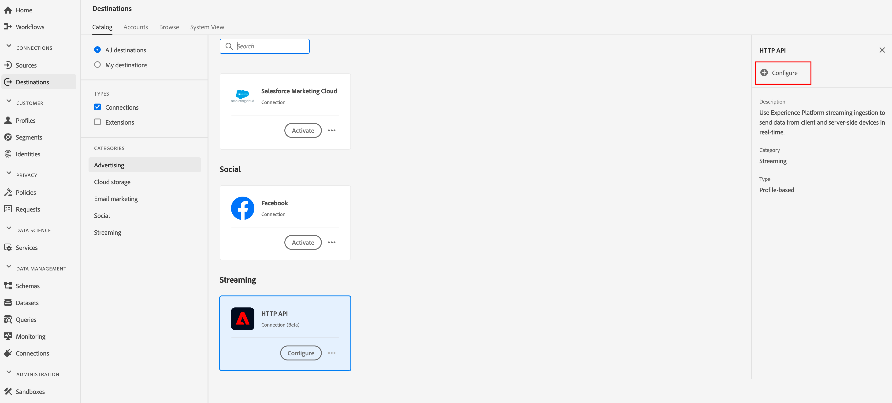

# （アルファ） [!DNL HTTP]接続

>[!IMPORTANT]
>
>プラットフォームの[!DNL HTTP]宛先は現在アルファベットです。 ドキュメントと機能は変更される場合があります。

## 概要 {#overview}

[!DNL HTTP]宛先は[!DNL Adobe Experience Platform]ストリーミング宛先で、プロファイルデータをサードパーティ[!DNL HTTP]エンドポイントに送信するのに役立ちます。

プロファイルデータを[!DNL HTTP]エンドポイントに送信するには、まず[[!DNL Adobe Experience Platform]](#connect-destination)の宛先に接続する必要があります。

## 使用例 {#use-cases}

[!DNL HTTP]宛先は、XDMプロファイルデータとオーディエンスセグメントを汎用の[!DNL HTTP]エンドポイントにエクスポートする必要があるお客様を対象としています。

[!DNL HTTP] エンドポイントは、お客様が所有するシステムまたはサードパーティのソリューションのいずれかになります。

## 宛先に接続{#connect-destination}

**[!UICONTROL 接続]**/**[!UICONTROL 宛先]**&#x200B;で、[!DNL HTTP API]を選択し、**[!UICONTROL 設定]**&#x200B;を選択します。



この宛先との接続が既に存在する場合は、宛先カードに「**[!UICONTROL Activate]**」ボタンが表示されます。 「**[!UICONTROL アクティブ化]**」と「**[!UICONTROL 設定]**」の違いについて詳しくは、保存先のワークスペースドキュメントの「[カタログ](../ui/destinations-workspace.md#catalog)」の節を参照してください。


[!UICONTROL アカウント]の手順で、HTTPエンドポイント接続の詳細を定義する必要があります。 「**[!UICONTROL 新規アカウント]**」を選択し、接続先のHTTPエンドポイントの接続の詳細を入力します。
- **[!UICONTROL httpEndpoint]**:プロファイルデータ [!DNL URL] の送信先のHTTPエンドポイントの完全な状態です。
   - 必要に応じて、[!UICONTROL httpEndpoint] [!DNL URL]にクエリパラメーターを追加できます。
- **[!UICONTROL authEndpoint]**: [!DNL URL] 認証に使用されるHTTPエンドポイント [!DNL OAuth2] の完全な状態です。
- **[!UICONTROL クライアントID]**:クライアント資格情報で使用される [!DNL clientID]  [!DNL OAuth2] パラメーター。
- **[!UICONTROL クライアントシークレット]**:クライアント資格情報で使用される [!DNL clientSecret]  [!DNL OAuth2] パラメーター。

>[!NOTE]
>
>現在、[!DNL OAuth2]個のクライアント資格情報のみがサポートされています。


[**[!UICONTROL 宛先に接続]**]をクリックします。 接続が成功したら、「**[!UICONTROL 次へ]**」をクリックします。

[!UICONTROL 認証]手順で、アカウント認証資格情報を入力します。
- **[!UICONTROL 名前]**:この宛先を認識するための名前を入力します。
- **[!UICONTROL 説明]**:この宛先を将来特定するのに役立つ説明を入力します。
- **[!UICONTROL Custom Headers]**:宛先呼び出しに含めるカスタムヘッダーを入力します。次の形式に従います。 `header1:value1,header2:value2,...headerN:valueN`.
- **[!UICONTROL マーケティングアクション]**:マーケティングアクションは、データをエクスポート先にエクスポートする意図を示します。Adobe定義のマーケティングアクションから選択するか、独自のマーケティングアクションを作成することができます。 マーケティング活動の詳細については、「[Adobe Experience Platform](/help/data-governance/policies/overview.md)のデータガバナンス」ページを参照してください。 Adobe定義の個々のマーケティングアクションについて詳しくは、[データ使用ポリシーの概要](/help/data-governance/policies/overview.md)を参照してください。

>[!IMPORTANT]
>
>現在の実装には、少なくとも1つのカスタムヘッダーが必要です。 この制限は、今後の更新で解決されます。


**[!UICONTROL マーケティングアクション]**:マーケティングアクションは、データをエクスポート先にエクスポートする意図を示します。Adobe定義のマーケティングアクションから選択するか、独自のマーケティングアクションを作成することができます。 マーケティングアクションについて詳しくは、[データ使用ポリシーの概要](../../data-governance/policies/overview.md)を参照してください。

「**[!UICONTROL 宛先を作成]**」をクリックします。

## セグメントのアクティブ化

セグメントのアクティベーションワークフローについて詳しくは、「[宛先へのプロファイルとセグメントのアクティブ化](../ui/activate-destinations.md#select-attributes)」を参照してください。

## 宛先属性

[[!UICONTROL 属性]](../ui/activate-destinations.md#select-attributes)を選択の手順中、[アクティブ化するセグメント](../ui/activate-destinations.md)を[!DNL HTTP]宛先に対して実行する場合は、[和集合スキーマ](../../profile/home.md#profile-fragments-and-union-schemas)から一意の識別子を選択することをお勧めします。 宛先に書き出す一意の ID およびその他の XDM フィールドを選択します。

## エクスポートされたデータ{#exported-data}

書き出した[!DNL Experience Platform]データは、JSON形式で[!DNL HTTP]の宛先に格納されます。 例えば、次のイベントには、特定のセグメントに該当し、別のセグメントから離脱したオーディエンスの電子メールアドレスプロファイル属性が含まれています。 この見込み客のIDは[!DNL ECID]と電子メールです。

```json
{
  "person": {
    "email": "yourstruly@adobe.con"
  },
  "segmentMembership": {
    "ups": {
      "7841ba61-23c1-4bb3-a495-00d3g5fe1e93": {
        "lastQualificationTime": "2020-05-25T21:24:39Z",
        "status": "exited"
      },
      "59bd2fkd-3c48-4b18-bf56-4f5c5e6967ae": {
        "lastQualificationTime": "2020-05-25T23:37:33Z",
        "status": "existing"
      }
    }
  },
  "identityMap": {
    "ecid": [
      {
        "id": "14575006536349286404619648085736425115"
      },
      {
        "id": "66478888669296734530114754794777368480"
      }
    ],
    "email_lc_sha256": [
      {
        "id": "655332b5fa2aea4498bf7a290cff017cb4"
      },
      {
        "id": "66baf76ef9de8b42df8903f00e0e3dc0b7"
      }
    ]
  }
}
```
