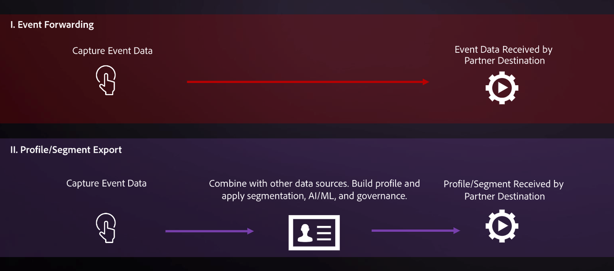

# Adobe Experience Platformのタグ拡張

Adobe Experience Platformは、Adobeが提供する次世代タグ管理機能を提供します。 Platform は、顧客体験の実現に必要なすべての分析、マーケティングおよび広告のタグをデプロイおよび管理するためのシンプルな手段を提供します。 タグは、標準装備の付加価値機能として Adobe Experience Cloud の顧客に提供されます。

タグの概要については、以下のリソースを参照してください。

- [タグの概要](../../../tags/home.md)
- [クイックスタートガイド](../../../tags/quick-start/quick-start.md)

## Platform インターフェイスでタグの拡張を見つける方法 {#how-to-find-extensions-in-interface}

Platform インターフェイスで拡張機能を見つけるには、 **[!UICONTROL 宛先]** > **[!UICONTROL カタログ]** を選択し、 **[!UICONTROL 拡張機能]** 内 **[!UICONTROL タイプ]** フィルター。

## タグ拡張の仕組み {#how-extensions-work}

A [タグ拡張](../../../tags/home.md#extensions) は、Web サイトやモバイルアプリの機能を強化するコードのパッケージです。 これには、イベントの生データを [Google Analytics](/help/destinations/catalog/analytics/google-universal-analytics.md) 他の機能も使えます

タグとイベント転送の拡張機能を区別することが重要です。 Platform の宛先ユーザーインターフェイスで表示される拡張機能は、次のとおりです *タグ拡張*. 詳しくは、イベント転送の概要を参照してください。 [タグとイベント転送の違い](/help/tags/ui/event-forwarding/overview.md#differences-between-event-forwarding-and-tags).

<!--

Extensions forward raw event data to several types of destinations. Think of extensions as an **Event Forwarding** type of destination. This is a simpler type of integration with destination platforms, which only forwards raw event data. Examples of those are the [Gainsight personalization extension](../personalization/gainsight.md) or the [Confirmit Voice of the Customer extension](../voice/confirmit-digital-feedback.md).

**Profile/Segment Export** destinations in Adobe Experience Platform capture event data, combine it with other data sources, apply segmentation, and export audiences and qualified profiles to destinations. Examples of those are the [Amazon S3 cloud storage destination](../cloud-storage/amazon-s3.md) or the [Google Display & Video 360 advertising destination](../advertising/google-dv360.md).

-->

## タグ拡張機能を使用するメリット {#extensions-benefits}

既存のプラットフォームのお客様は、Platform のタグ機能を無料でExperience Cloudできます。 このシステムは、使いやすい拡張機能を使用して、Web サイト上にタグを簡単に導入できるようにします。拡張機能は、インストール、設定、更新および削除できます。 タグを使用すると、Web サイトに小さな足跡が残り、ページをすばやく読み込むことができます。

オーディエンスをアクティブ化して拡張機能にタグを付けることはできませんが、特定の状況でイベントデータを転送するルールを設定できます。 この強力な機能により、すべてのインタラクションでイベントデータを送信するのではなく、特定の状況でのみイベントデータを転送できます。詳しくは、 [タグドキュメント](../../../tags/ui/managing-resources/rules.md).

##  の拡張機能の使用事例 {#extensions-use-cases}

拡張機能を使用すると、様々な顧客の使用例に対応できます。  の拡張機能の使用事例を以下に示します。

- Facebook ピクセル拡張機能を使用して、web サイトまたはネイティブのアプリケーションデータを Facebook に送信できます。Facebook ピクセルでは、訪問者がサイトまたはアプリケーションのどの部分にアクセスしたかを把握したり、その情報を Facebook に転送したりすることができます。また、Facebook を介して、訪問者を再ターゲティングすることができます。
- web サイトやアプリケーションのイベントデータを Google Analytics に転送してそのデータを分析し、それに基づいて決定を下すことができます。
- 設定したルールに従って、ユーザーがページとどのようにやり取りしているかに基づいて、クライアントサイドの Chatbox アプリを適切なタイミングで有効にすることができます。

## 拡張機能のカテゴリ {#extension-categories}

拡張機能は、プラットフォームでは次のカテゴリに分類されます。

- [広告](../advertising/overview.md)
- [Analytics](../analytics/overview.md)
- [データ管理プラットフォーム](../data-management/overview.md)
- [メールマーケティングの宛先](../email-marketing/overview.md)
- [パーソナライゼーション](../personalization/overview.md)
- [調査](../survey/overview.md)
- [顧客の声](../voice/overview.md)
