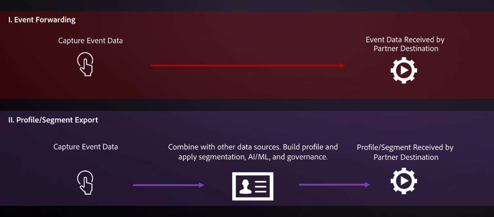

# [!DNL Adobe Experience Platform]のタグ拡張機能

[!DNL Adobe Experience Platform]は、Adobeの次世代型タグ管理機能を提供します。 Experience Platformなら、適切な顧客体験を実現するために必要なあらゆる分析タグ、マーケティングタグ、広告タグを容易にデプロイおよび管理できます。 タグは、含まれている付加価値機能として[!DNL Adobe Experience Cloud]のお客様に提供されます。

タグの概要については、以下のリソースを参照してください。

- [タグの概要](../../../tags/home.md)
- [クイックスタートガイド](../../../tags/quick-start/quick-start.md)

## Experience Platform インターフェイスでタグ拡張機能を検索する方法 {#how-to-find-extensions-in-interface}

Experience Platform インターフェイスで拡張機能を検索するには、**[!UICONTROL Destinations]** > **[!UICONTROL Catalog]**&#x200B;を参照し、**[!UICONTROL Extensions]** フィルターで&#x200B;**[!UICONTROL Types]**&#x200B;を選択します。

## タグ拡張機能の仕組み {#how-extensions-work}

[ タグ拡張機能](../../../tags/home.md#extensions)は、web サイトまたはモバイルアプリの機能を強化するコードパッケージです。 これには、生のイベントデータを[Google Analytics](/help/destinations/catalog/analytics/google-universal-analytics.md)などの宛先に送信することが含まれますが、他の機能も提供できます。

タグとイベント転送拡張機能を区別することが重要です。 Experience Platform destinations ユーザーインターフェイスで表示される拡張機能は、*タグ拡張機能*&#x200B;です。 タグとイベント転送の違い[について詳しくは、イベント転送の概要を参照してください](/help/tags/ui/event-forwarding/overview.md#differences-between-event-forwarding-and-tags)。

<!--

Extensions forward raw event data to several types of destinations. Think of extensions as an **Event Forwarding** type of destination. This is a simpler type of integration with destination platforms, which only forwards raw event data. Examples of those are the [Gainsight personalization extension](../personalization/gainsight.md) or the [Confirmit Voice of the Customer extension](../voice/confirmit-digital-feedback.md).

**Profile/Segment Export** destinations in Adobe Experience Platform capture event data, combine it with other data sources, apply segmentation, and export audiences and qualified profiles to destinations. Examples of those are the [Amazon S3 cloud storage destination](../cloud-storage/amazon-s3.md) or the [Google Display & Video 360 advertising destination](../advertising/google-dv360.md).

-->

## タグ拡張機能を使用する利点 {#extensions-benefits}

Experience Platformのタグ機能は、Experience Cloudの既存のお客様は無料で利用できます。 このシステムは、インストール、設定、更新、削除ができる使いやすい拡張機能を介して、web サイトへのタグのデプロイメントを簡素化します。 タグを利用することで、web サイトへのフットプリントを小さく抑え、ページの読み込みを維持できます。

拡張機能をタグ付けするためにオーディエンスをアクティブ化することはできませんが、特定の状況ではイベントデータのみを転送するようにルールを設定することができます。 この強力な機能により、すべてのインタラクションでイベントデータを送信するのではなく、特定の状況でのみイベントデータを転送できます。詳細については、[ タグのドキュメント ](../../../tags/ui/managing-resources/rules.md)でルールについて説明しています。

## 拡張機能の使用例 {#extensions-use-cases}

拡張機能を活用すると、さまざまな顧客ユースケースを満たすことができます。 拡張機能の使用例には、次のようなものがあります。

- Facebook ピクセル拡張機能を使用して、web サイトまたはネイティブのアプリケーションデータを Facebook に送信できます。Facebook ピクセルでは、訪問者がサイトまたはアプリケーションのどの部分にアクセスしたかを把握したり、その情報を Facebook に転送したりすることができます。また、Facebook を介して、訪問者を再ターゲティングすることができます。
- web サイトやアプリケーションのイベントデータを Google Analytics に転送してそのデータを分析し、それに基づいて決定を下すことができます。
- 設定したルールに従って、ユーザーがページとどのようにインタラクションしているかに応じて、適切なタイミングでクライアントサイドのチャットボックスアプリをオンにすることができます。

## 拡張機能のカテゴリ {#extension-categories}

Experience Platformでは、拡張機能を次のカテゴリに分類できます。

- [広告](../advertising/overview.md)
- [Analytics](../analytics/overview.md)
- [データ管理プラットフォーム](../data-management/overview.md)
- [メールマーケティングの宛先](../email-marketing/overview.md)
- [パーソナライゼーション](../personalization/overview.md)
- [調査](../survey/overview.md)
- [お客様の声](../voice/overview.md)
