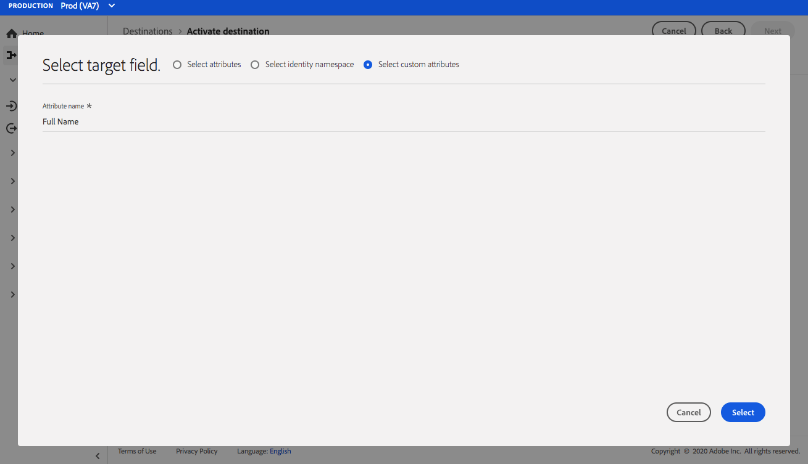

# （ベータ版） [!DNL Airship Attributes]接続{#airship-attributes-destination}

>[!IMPORTANT]
>
>Adobe Experience Platformの[!DNL Airship Attributes]宛先は現在ベータ版です。 ドキュメントと機能は変更される場合があります。

## 概要 {#overview}

[!DNL Airship] は、顧客関与プラットフォームをリードし、顧客のライフサイクルのあらゆる段階で、意味のあるパーソナライズされたチャネルのメッセージをユーザに届けるのに役立ちます。

この統合は、ターゲット化またはトリガーのために、Adobeプロファイルデータを[!DNL Airship][属性](https://docs.airship.com/guides/audience/attributes/)としてに渡します。

[!DNL Airship]の詳細については、[航空船ドキュメント](https://docs.airship.com)を参照してください。

>[!TIP]
>
>このドキュメントページは[!DNL Airship]チームが作成しました。 お問い合わせや更新のご依頼は、[support.airship.com](https://support.airship.com/)まで直接お問い合わせください。

## 前提条件 {#prerequisites}

オーディエンスセグメントを[!DNL Airship]に送信する前に、次の操作を行う必要があります。

* [!DNL Airship]プロジェクトで属性を有効にします。
* 認証用のベアラートークンを生成します。

>[!TIP]
>
>まだ[!DNL Airship]アカウントを作成していない場合は、[このサインアップリンク](https://go.airship.eu/accounts/register/plan/starter/)を経由してアカウントを作成します。

## 属性を有効にする{#enable-attributes}

Adobe Experience Platformプロファイルの属性は[!DNL Airship]属性に似ており、このページで後述するマッピングツールを使用して、プラットフォームで相互に簡単にマッピングできます。

[!DNL Airship] プロジェクトには、定義済みの属性とデフォルトの属性がいくつかあります。カスタム属性がある場合は、最初に[!DNL Airship]で定義する必要があります。 詳しくは、[属性の設定と管理](https://docs.airship.com/tutorials/audience/attributes/)を参照してください。

## ベアラトークン{#bearer-token}を生成

[Airshipダッシュボード](https://go.airship.com)の&#x200B;**[!UICONTROL 設定]**&quot; **[!UICONTROL APIs &amp; Integrations]**&#x200B;に移動し、左側のメニューで&#x200B;**[!UICONTROL トークン]**&#x200B;を選択します。

「**[!UICONTROL トークンを作成]**」をクリックします。

トークンにわかりやすい名前(例：「Adobe属性の保存先」)を指定し、ロールに「すべてのアクセス」を選択します。

「**[!UICONTROL トークン]**&#x200B;を作成」をクリックし、詳細を機密情報として保存します。

## 使用例 {#use-cases}

[!DNL Airship Attributes]の行き先の使い方と使い方を理解するために、Adobe Experience Platformのお客様がこの行き先を使って解決できる使用例を以下に示します。

### 使用例1

Adobe Experience Platform内で収集されたプロファイルデータを活用して、[!DNL Airship]のチャネル内のメッセージとリッチコンテンツをパーソナライズします。 例えば、[!DNL Experience Platform]プロファイルデータを利用して[!DNL Airship]内に位置属性を設定します。 これにより、ホテルのブランドで各ユーザーの最も近いホテルの場所の画像を表示できます。

### 使用例2

Adobe Experience Platformの属性を活用して、[!DNL Airship]プロファイルをさらに強化し、SDKまたは[!DNL Airship]予測データと組み合わせます。 例えば、ある小売業者は忠誠度のステータスと場所のデータ（プラットフォームの属性）を持つセグメントを作成し、データをチャーンと予測する[!DNL Airship]を作成して、高ターゲットのメッセージをネバダ州ラスベガスに住む金忠誠度のユーザーに送信できます。

## [!DNL Airship Attributes] {#connect-airship-attributes}に接続

**[!UICONTROL 宛先]**/**[!UICONTROL カタログ]**&#x200B;で、**[!UICONTROL モバイルエンゲージメント]**&#x200B;カテゴリまでスクロールします。 「**[!DNL Airship Attributes]**」を選択し、「**[!UICONTROL 設定]**」を選択します。

>[!NOTE]
>
>この宛先との接続が既に存在する場合は、宛先カードに「**[!UICONTROL Activate]**」ボタンが表示されます。 「**[!UICONTROL アクティブ化]**」と「**[!UICONTROL 設定]**」の違いについて詳しくは、保存先のワークスペースドキュメントの「[カタログ](../../ui/destinations-workspace.md#catalog)」の節を参照してください。

**アカウント**&#x200B;の手順で、[!DNL Airship Attributes]宛先への接続を事前に設定している場合は、「**[!UICONTROL 既存のアカウント]**」を選択し、既存の接続を選択します。 または、「**[!UICONTROL 新しいアカウント]**」を選択して、[!DNL Airship Attributes]への新しい接続を設定できます。 **[!UICONTROL 宛先]**&#x200B;に接続を選択し、[!DNL Airship]ダッシュボードから生成したベアラトークンを使用して、[!DNL Airship]プロジェクトにAdobe Experience Platformを接続します。

>[!NOTE]
>
>Adobe Experience Platformは、認証プロセスで資格情報の検証をサポートし、[!DNL Airship]アカウントに正しくない資格情報を入力するとエラーメッセージを表示します。 このため、間違った資格情報を使用すると、ワークフローを完了することができません。

資格情報が確認され、Adobe Experience Platformが[!DNL Airship]プロジェクトに接続されたら、**[!UICONTROL 次へ]**&#x200B;を選択して&#x200B;**[!UICONTROL セットアップ]**&#x200B;の手順に進むことができます。

**[!UICONTROL 認証]**&#x200B;手順で、アクティベーションフローの&#x200B;**[!UICONTROL 名前]**&#x200B;と&#x200B;**[!UICONTROL 説明]**&#x200B;を入力します。

また、この手順では、この宛先に適用する[!DNL Airship]データセンターに応じて、米国またはEUデータセンターを選択できます。 最後に、データをエクスポート先にエクスポートする1つ以上の&#x200B;**[!UICONTROL マーケティングアクション]**&#x200B;を選択します。 Adobe定義のマーケティングアクションから選択するか、独自のマーケティングアクションを作成することができます。 マーケティングアクションについて詳しくは、[データ使用ポリシーの概要](../../../data-governance/policies/overview.md)を参照してください。

上記のフィールドに入力したら、「**[!UICONTROL 宛先を作成]**」を選択します。

これで宛先が作成されました。後でセグメントをアクティブにする場合は、「**[!UICONTROL 保存して終了]**」を選択します。また、「**[!UICONTROL 次へ]**」を選択してワークフローを続行し、アクティブ化するセグメントを選択することもできます。どちらの場合も、残りのワークフローについては、次の[セグメントをアクティブにする](#activate-segments)の節を参照してください。

## セグメントのアクティブ化 {#activate-segments}

[!DNL Airship Attributes]にセグメントをアクティブ化するには、次の手順に従います。

**[!UICONTROL 宛先／参照]**&#x200B;で、セグメントをアクティブ化する宛先を選択します。[!DNL Airship Attributes]

宛先の名前をクリックします。これにより、「アクティブ化」のフローに移動します。

宛先に対するアクティベーションフローが既に存在する場合は、その宛先に現在送信されているセグメントを確認できます。右側のパネルで「**[!UICONTROL アクティベーションの編集]**」を選択し、以下の手順に従ってアクティベーションの詳細を変更します。

「**[!UICONTROL アクティブ化]**」を選択します。 **[!UICONTROL 宛先]**&#x200B;をアクティブにするワークフローの&#x200B;**[!UICONTROL セグメントを選択]**&#x200B;ページで、[!DNL Airship Attributes]に送信するセグメントを選択します。

**[!UICONTROL マッピング]**&#x200B;手順で、[XDM](../../../xdm/home.md)スキーマーから宛先スキーマーにマッピングする属性とIDを選択します。 **[!UICONTROL 追加新しいマッピング]**&#x200B;を選択して、スキーマを参照し、対応するターゲットIDにマッピングします。

[!DNL Airship] 属性は、デバイスインスタンスを表すチャネル（iPhoneなど）またはユーザー名（ユーザー名）のいずれかに設定できます。このユーザーは、すべてのユーザーのデバイスを顧客IDなどの共通の識別子にマップします。スキーマの主なIDとしてテキスト形式の（ハッシュ化されていない）電子メールアドレスがある場合は、**[!UICONTROL ソース属性]**&#x200B;で電子メールフィールドを選択し、**[!UICONTROL ターゲットID]**&#x200B;の右の列の[!DNL Airship]にマップします。

チャネルにマップする必要がある識別子（デバイスなど）の場合、ソースに基づいて適切なチャネルにマップします。 次の画像は、2つのマッピングの作成方法を示しています。

* IDFA iOS広告IDから[!DNL Airship] iOSチャネルへの
* Adobe`fullName`属性を[!DNL Airship] &quot;フルネーム&quot;属性に変更

>[!NOTE]
>
>属性マッピングのターゲットフィールドを選択する際に、[!DNL Airship]ダッシュボードに表示されるわかりやすい名前を使用します。

**IDのマップ**

ソースフィールドの選択：

ターゲットフィールドの選択：

**マップの属性**

ソース属性を選択：

ターゲット属性を選択：

マッピングの検証：

**[!UICONTROL セグメントスケジュール]**&#x200B;ページで、現在、スケジュールは無効になっています。 「**[!UICONTROL 次へ]**」をクリックしてレビュー手順に進みます。

「**[!UICONTROL 確認]**」ページには、選択の概要が表示されます。「**[!UICONTROL キャンセル]**」を選択してフローを分割するか、「**[!UICONTROL 戻る]**」を選択して設定を変更する、または、「**[!UICONTROL 完了]**」を選択して確定し、宛先へのデータの送信を開始します。

>[!IMPORTANT]
>
>この手順では、Adobe Experience Platformがデータ使用ポリシーの違反を確認します。 次に、ポリシー違反の例を示します。 セグメントアクティベーションのワークフローは、違反を解決するまで完了できません。 ポリシー違反の解決方法について詳しくは、「データ管理ドキュメント」の「[ポリシーの適用](../../../data-governance/enforcement/auto-enforcement.md)」を参照してください。

ポリシー違反が検出されなかった場合は、[**[!UICONTROL 完了]**]を選択して、選択と開始が宛先にデータを送信することを確認します。

## データの使用とガバナンス{#data-usage-governance}

すべての[!DNL Adobe Experience Platform]宛先は、データ処理時のデータ使用ポリシーに準拠しています。 [!DNL Adobe Experience Platform]によるデータガバナンスの適用方法について詳しくは、[データガバナンスの概要](../../../data-governance/home.md)を参照してください。
