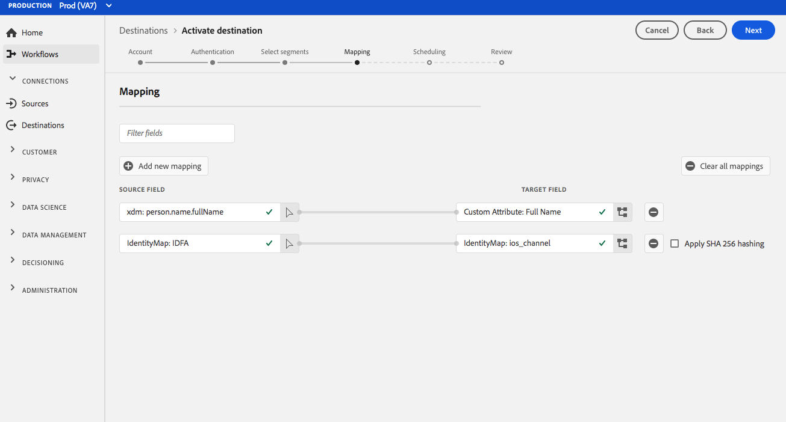
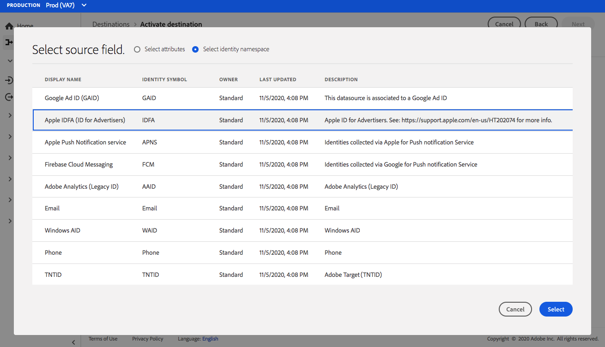
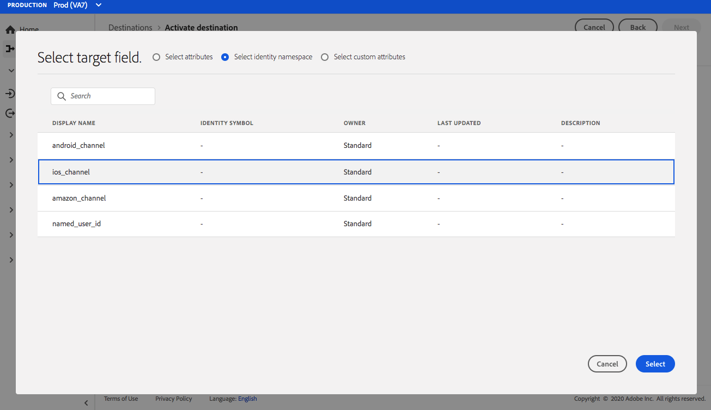
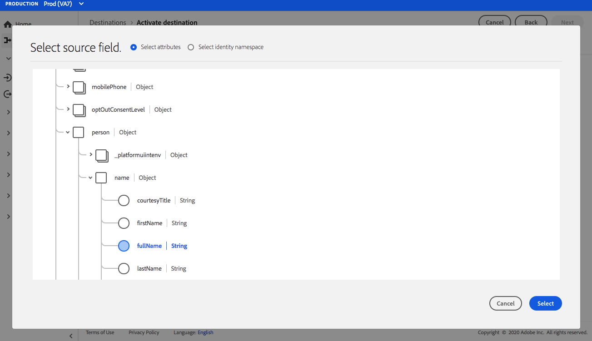
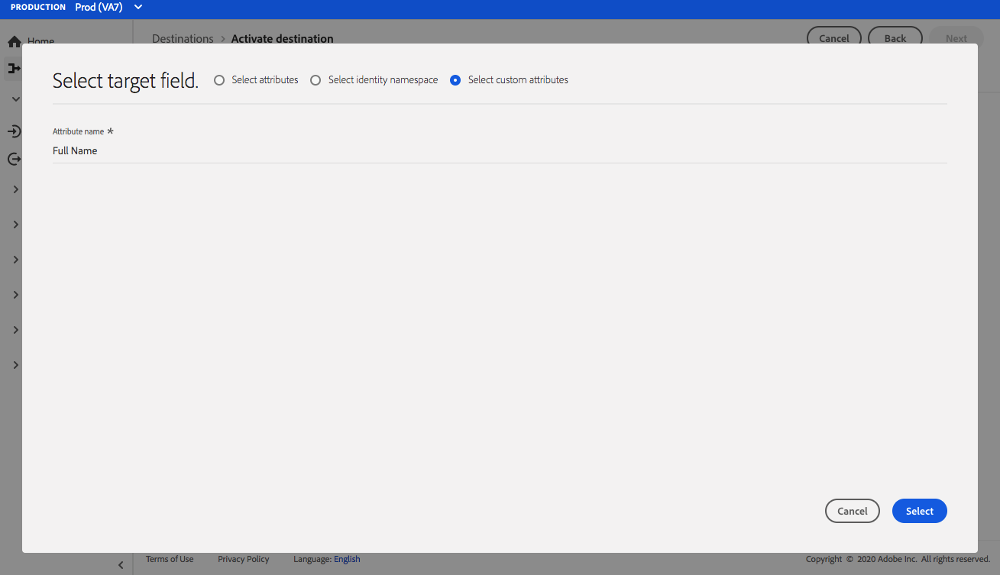

# [!DNL Airship Attributes] 接続 {#airship-attributes-destination}

## 概要 {#overview}

[!DNL Airship]は業界をリードする顧客エンゲージメント Experience Platformで、カスタマーライフサイクルのあらゆる段階で、有意義でパーソナライズされたオムニチャネルメッセージをユーザーに提供するのに役立ちます。

この統合により、Adobe プロファイルデータが[!DNL Airship]に[属性](https://docs.airship.com/guides/audience/attributes/)として渡され、ターゲティングまたはトリガーされます。

[!DNL Airship]について詳しくは、[飛行船ドキュメント ](https://docs.airship.com)を参照してください。

>[!TIP]
>
>この宛先コネクタとドキュメント ページは、[!DNL Airship] チームによって作成および管理されています。 問い合わせやアップデートのリクエストについては、[support.airship.com](https://support.airship.com/)から直接お問い合わせください。

## 前提条件 {#prerequisites}

オーディエンスを[!DNL Airship]に送信する前に、次の操作を行う必要があります。

* [!DNL Airship] プロジェクトで属性を有効にします。
* 認証用のベアラートークンを生成します。

>[!TIP]
>
>まだアカウントを作成していない場合は、[!DNL Airship]この登録リンク [を介して](https://go.airship.eu/accounts/register/plan/starter/) アカウントを作成します。

## サポートされるオーディエンス {#supported-audiences}

この節では、この宛先に書き出すことができるオーディエンスのタイプについて説明します。

| オーディエンスの由来 | サポートあり | 説明 |
|---------|----------|----------|
| [!DNL Segmentation Service] | ○ | Experience Platform [ セグメント化サービス ](../../../segmentation/home.md)を通じて生成されたオーディエンス。 |
| その他すべてのオーディエンスの生成元 | ○ | このカテゴリには、[!DNL Segmentation Service]を通じて生成されたオーディエンス以外のすべてのオーディエンスのオリジンが含まれます。 [様々なオーディエンスの起源](/help/segmentation/ui/audience-portal.md#customize)について読みます。 次に例を示します。 <ul><li> カスタムアップロードオーディエンス [がCSV ファイルからExperience Platformに](../../../segmentation/ui/audience-portal.md#import-audience)をインポートしました。</li><li> 類似オーディエンス， </li><li> 連合オーディエンス， </li><li> [!DNL Adobe Journey Optimizer]などの他のExperience Platform アプリで生成されたオーディエンス </li><li> その他。 </li></ul> |

{style="table-layout:auto"}

オーディエンスのデータタイプ別にサポートされるオーディエンス：

| オーディエンスのデータタイプ | サポートあり | 説明 | ユースケース |
|--------------------|-----------|-------------|-----------|
| [人物オーディエンス ](/help/segmentation/types/people-audiences.md) | ○ | 顧客プロファイルにもとづいて、マーケティング施策の特定のグループをターゲットにすることができます。 | 買い物客やカートの放棄が多い |
| [ アカウントオーディエンス ](/help/segmentation/types/account-audiences.md) | × | アカウントベースドマーケティング戦略のために、特定の組織内の個人をターゲットにします。 | B2B マーケティング |
| [見込みオーディエンス ](/help/segmentation/types/prospect-audiences.md) | × | まだ顧客ではないが、ターゲットオーディエンスと特徴を共有する個人をターゲットにします。 | サードパーティデータによる見込み顧客の開拓 |
| [ データセットの書き出し](/help/catalog/datasets/overview.md) | × | [!DNL Adobe Experience Platform] データ レイクに保存されている構造化データのコレクション。 | レポート，データサイエンスワークフロー |

{style="table-layout:auto"}

## 書き出しのタイプと頻度 {#export-type-frequency}

宛先の書き出しのタイプと頻度について詳しくは、以下の表を参照してください。

| 項目 | タイプ | メモ |
|---------|----------|---------|
| 書き出しタイプ | **[!UICONTROL Profile-based]** | フィールドマッピングに従って、セグメントのすべてのメンバーを、目的のスキーマフィールド（電子メールアドレス、電話番号、姓など）および/またはIDと共に書き出します。 |
| 書き出し頻度 | **[!UICONTROL Streaming]** | ストリーミングの宛先は常に、API ベースの接続です。オーディエンス評価に基づいて Experience Platform 内でプロファイルが更新されるとすぐに、コネクタは更新を宛先プラットフォームに送信します。[ストリーミングの宛先](/help/destinations/destination-types.md#streaming-destinations)の詳細についてはこちらを参照してください。 |

{style="table-layout:auto"}

## 属性を有効にする {#enable-attributes}

[!DNL Adobe Experience Platform]個のプロファイル属性は[!DNL Airship]個の属性と似ており、このページで以下に示すマッピングツールを使用して、Experience Platformで簡単にマッピングできます。

[!DNL Airship]件のプロジェクトには、事前に定義された属性と既定の属性が複数あります。 カスタム属性がある場合は、最初に[!DNL Airship]で定義する必要があります。 詳しくは、[属性の設定と管理](https://docs.airship.com/tutorials/audience/attributes/)を参照してください。

## ベアラートークンを生成 {#bearer-token}

**[!UICONTROL Settings]**&#x200B;飛行船ダッシュボード **[!UICONTROL APIs & Integrations]**&#x200B;の[ » ](https://go.airship.com)に移動し、左側のメニューで&#x200B;**[!UICONTROL Tokens]**&#x200B;を選択します。

「**[!UICONTROL Create Token]**」をクリックします。

「Adobe属性の宛先」など、トークンの使いやすい名前を指定し、ロールに「すべてのアクセス」を選択します。

**[!UICONTROL Create Token]**&#x200B;をクリックし、詳細を機密情報として保存します。

## ユースケース {#use-cases}

[!DNL Airship Attributes]宛先を使用する方法とタイミングをより理解しやすくするために、[!DNL Adobe Experience Platform]のお客様がこの宛先を使用して解決できるユースケースの例を次に示します。

### ユースケース #1 {#use-case-1}

[!DNL Adobe Experience Platform]内で収集したプロファイルデータを活用して、[!DNL Airship]のチャネル内でメッセージとリッチコンテンツをパーソナライズします。 例えば、[!DNL Experience Platform] プロファイルデータを活用して、[!DNL Airship]内の場所の属性を設定します。 これにより、ホテル企業は、各ユーザーに最も近いホテルの場所の画像を表示できるようになります。

### ユースケース #2 {#use-case-2}

[!DNL Adobe Experience Platform]の属性を活用して[!DNL Airship] プロファイルをさらに強化し、SDKまたは[!DNL Airship]の予測データと組み合わせます。 例えば、retailerでは、ロイヤルティステータスと位置情報（Experience Platformからの属性）を持つオーディエンスを作成し、データを解約すると予測された[!DNL Airship]個のオーディエンスを作成して、ネバダ州ラスベガスに住み、解約する可能性が高いゴールドロイヤルティステータスのユーザーに高度にターゲティングされたメッセージを送信できます。

## 宛先への接続 {#connect}

>[!IMPORTANT]
>
>宛先に接続するには、**[!UICONTROL View Destinations]**&#x200B;および&#x200B;**[!UICONTROL Manage Destinations]** [ アクセス制御権限](/help/access-control/home.md#permissions)が必要です。 詳しくは、[アクセス制御の概要](/help/access-control/ui/overview.md)または製品管理者に問い合わせて、必要な権限を取得してください。

この宛先に接続するには、[宛先設定のチュートリアル](../../ui/connect-destination.md)の手順に従ってください。宛先の設定ワークフローで、以下の 2 つのセクションにリストされているフィールドに入力します。

### 宛先に対する認証 {#authenticate}

宛先に対して認証を行うには、必須フィールドに入力し、**[!UICONTROL Connect to destination]**&#x200B;を選択します。

* **[!UICONTROL Bearer token]**: [!DNL Airship] ダッシュボードから生成したベアラートークン。

### 宛先の詳細を入力 {#destination-details}

宛先の詳細を設定するには、以下の必須フィールドとオプションフィールドに入力します。UI のフィールドの横のアスタリスクは、そのフィールドが必須であることを示します。

* **[!UICONTROL Name]**：この宛先を特定するのに役立つ名前を入力してください。
* **[!UICONTROL Description]**：この宛先の説明を入力します。
* **[!UICONTROL Domain]**：この宛先に適用される[!DNL Airship] データセンターに応じて、米国またはEU データセンターのいずれかを選択します。

### アラートの有効化 {#enable-alerts}

アラートを有効にすると、宛先へのデータフローのステータスに関する通知を受け取ることができます。リストからアラートを選択して、データフローのステータスに関する通知を受け取るよう登録します。アラートについて詳しくは、[UI を使用した宛先アラートの購読](../../ui/alerts.md)についてのガイドを参照してください。

宛先接続の詳細の提供が完了したら、**[!UICONTROL Next]**&#x200B;を選択します。

## この宛先に対してオーディエンスをアクティブ化 {#activate}

>[!IMPORTANT]
>
>* データをアクティブ化するには、**[!UICONTROL View Destinations]**、**[!UICONTROL Activate Destinations]**、**[!UICONTROL View Profiles]**&#x200B;および&#x200B;**[!UICONTROL View Segments]** [ アクセス制御権限](/help/access-control/home.md#permissions)が必要です。 [アクセス制御の概要](/help/access-control/ui/overview.md)を参照するか、製品管理者に問い合わせて必要な権限を取得してください。
>* *ID*&#x200B;をエクスポートするには、**[!UICONTROL View Identity Graph]** [ アクセス制御権限](/help/access-control/home.md#permissions)が必要です。  {width="100" zoomable="yes"}

この宛先にオーディエンスをアクティブ化する手順については、[ストリーミングオーディエンス書き出し宛先に対するオーディエンスデータのアクティブ化](../../ui/activate-segment-streaming-destinations.md)を参照してください。

## マッピングに関する考慮事項 {#mapping-considerations}

[!DNL Airship]属性は、iPhoneなどのデバイスインスタンスを表すチャネル、またはユーザーのすべてのデバイスを顧客IDなどの共通のIDにマッピングする名前付きユーザーのいずれかに設定できます。 スキーマにプレーンテキスト（ハッシュ化されていない）電子メールアドレスをプライマリ IDとして持っている場合は、**[!UICONTROL Source Attributes]**&#x200B;の電子メールフィールドを選択し、次に示すように、[!DNL Airship]の下の右側の列の&#x200B;**[!UICONTROL Target Identities]**&#x200B;というユーザーにマッピングします。

チャネル、つまりデバイスにマッピングする必要がある識別子の場合は、ソースに基づいて適切なチャネルにマッピングします。 次の画像は、2つのマッピングがどのように作成されるかを示しています。

* [!DNL Airship] iOS チャネルへのIDFA iOS Advertising ID
* `fullName` &quot;Full Name&quot;属性へのAdobe [!DNL Airship]属性

>[!NOTE]
>
>属性マッピングのターゲットフィールドを選択する際に、`attribute_id` ダッシュボードの属性に対応する[!DNL Airship]を使用します。

**マップ ID**

ソースフィールドを選択：

ターゲットフィールドを選択：

**マップ属性**

ソース属性を選択：

ターゲット属性を選択：

マッピングを確認：

## データの使用とガバナンス {#data-usage-governance}

[!DNL Adobe Experience Platform] のすべての宛先は、データを処理する際のデータ使用ポリシーに準拠しています。[!DNL Adobe Experience Platform] がどのようにデータガバナンスを実施するかについて詳しくは、[データガバナンスの概要](../../../data-governance/home.md)を参照してください。
