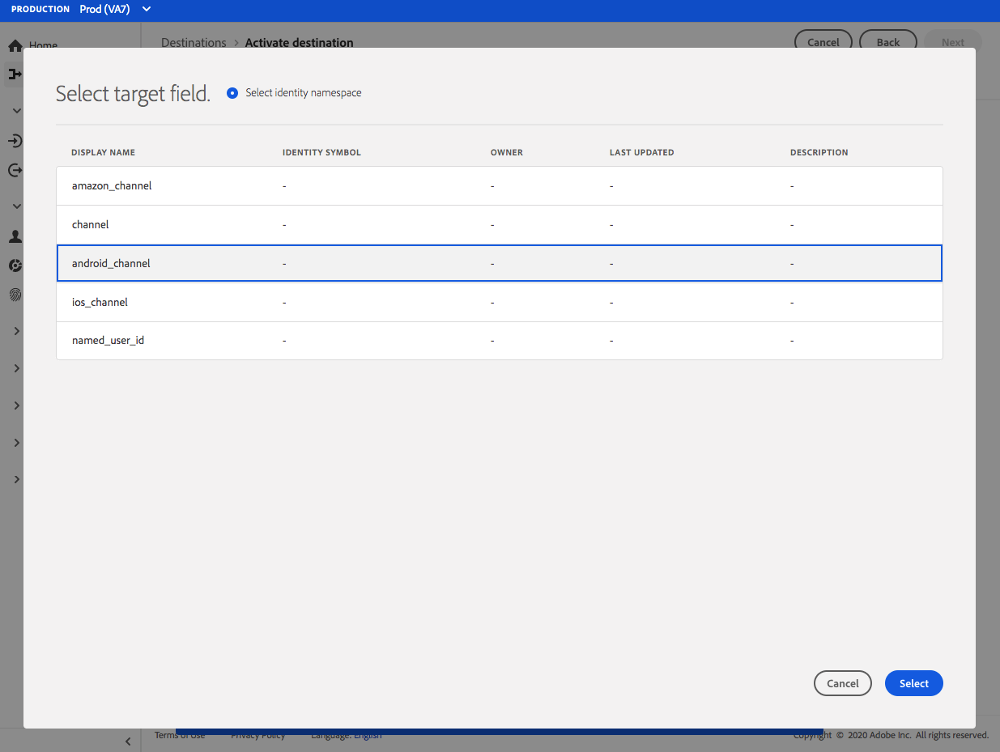

# [!DNL Airship Tags] 接続 {#airship-tags-destination}

## 概要

[!DNL Airship] は、顧客ライフサイクルの各段階で、意味のあるパーソナライズされたオムニチャネルメッセージをユーザーに届けるのに役立つ、主要な顧客エンゲージメントプラットフォームです。

この統合により、Adobe Experience Platformのセグメントデータが [!DNL Airship] as [タグ](https://docs.airship.com/guides/audience/tags/) （ターゲティングまたはトリガーの場合）

詳しくは、以下を参照してください。 [!DNL Airship]を参照し、 [航空船ドキュメント](https://docs.airship.com).

>[!TIP]
>
>このドキュメントページは、 [!DNL Airship] チーム。 お問い合わせや更新のご依頼は、直接 [support.airship.com](https://support.airship.com/).

## 前提条件

にAdobe Experience Platformセグメントを送信する前に [!DNL Airship]を使用する場合は、次の操作を行う必要があります。

* タググループを [!DNL Airship] プロジェクト。
* 認証用の bearer トークンを生成します。

>[!TIP]
> 
>の作成 [!DNL Airship] 経由のアカウント [この登録リンク](https://go.airship.eu/accounts/register/plan/starter/) まだお持ちでない場合は、

## 書き出しのタイプと頻度 {#export-type-frequency}

宛先の書き出しのタイプと頻度について詳しくは、以下の表を参照してください。

| 項目 | タイプ | メモ |
---------|----------|---------|
| 書き出しタイプ | **[!UICONTROL セグメントの書き出し]** | Airship Tags の宛先で使用される識別子を使用して、セグメント（オーディエンス）のすべてのメンバーを書き出します。 |
| 書き出し頻度 | **[!UICONTROL ストリーミング]** | ストリーミングの宛先は常に、API ベースの接続です。セグメント評価に基づいて Experience Platform 内でプロファイルが更新されるとすぐに、コネクタは更新を宛先プラットフォームに送信します。[ストリーミングの宛先](/help/destinations/destination-types.md#streaming-destinations)の詳細についてはこちらを参照してください。 |

{style="table-layout:auto"}

## タググループ

Adobe Experience Platform のセグメントの概念は、 [タグ](https://docs.airship.com/guides/audience/tags/) 飛行船では、実装のわずかな違いがあります。 この統合により、ユーザーの [Experience Platformセグメントのメンバーシップ](../../../xdm/field-groups/profile/segmentation.md) 存在または存在しない [!DNL Airship] タグを使用します。 例えば、Platform セグメントの場合、 `xdm:status` 変更 `realized`に値を指定しない場合、タグは [!DNL Airship] このプロファイルがマッピングされているチャネルまたは名前付きユーザー。 この `xdm:status` 変更 `exited`の場合、タグは削除されます。

この統合を有効にするには、 *タググループ* in [!DNL Airship] 名前付き `adobe-segments`.

>[!IMPORTANT]
>
>新しいタググループを作成する際 **チェックしない** 「[!DNL Allow these tags to be set only from your server]&quot;. これをおこなうと、Adobeタグの統合が失敗します。

詳しくは、 [タググループを管理](https://docs.airship.com/tutorials/manage-project/messaging/tag-groups) タググループの作成手順を参照してください。

## bearer トークンを生成

に移動します。 **[!UICONTROL 設定]** &quot; **[!UICONTROL API と統合]** 内 [飛行船ダッシュボード](https://go.airship.com) を選択し、 **[!UICONTROL トークン]** をクリックします。

クリック **[!UICONTROL トークンを作成]**.

トークンのわかりやすい名前 ( 例：「Adobeタグの宛先」) を指定し、役割に「すべてのアクセス」を選択します。

クリック **[!UICONTROL トークンを作成]** 詳細を機密として保存します。

## ユースケース

[!DNL Airship Tags] 宛先を使用する方法とタイミングをより深く理解するために、Adobe Experience Platform のお客様がこの宛先を使用して解決できるサンプルユースケースを以下に示します。

### 使用例#1

小売業者やエンターテイメントプラットフォームは、ロイヤルティ顧客のユーザープロファイルを作成し、それらのセグメントを [!DNL Airship] （モバイルキャンペーンでのメッセージターゲティング用）

### 使用例#2

トリガーがAdobe Experience Platform内の特定のセグメントにフォールアウトした場合に、1 対 1 のメッセージをリアルタイムで送信できます。

例えば、ある小売業者は、Platform でジーンズのブランド固有のセグメントを設定します。 あの小売業者は、誰かが特定のブランドにジーンズの好みを設定したらすぐに、モバイルメッセージをトリガーできるようになりました。

## 宛先への接続 {#connect}

>[!IMPORTANT]
> 
>宛先に接続するには、**[!UICONTROL 宛先の管理]** [アクセス制御権限](/help/access-control/home.md#permissions)が必要です。詳しくは、[アクセス制御の概要](/help/access-control/ui/overview.md)または製品管理者に問い合わせて、必要な権限を取得してください。

この宛先に接続するには、[宛先設定のチュートリアル](../../ui/connect-destination.md)の手順に従ってください。宛先の設定ワークフローで、以下の 2 つのセクションにリストされているフィールドに入力します。

### 宛先に対する認証 {#authenticate}

宛先に対して認証するには、必須フィールドに入力し、「**[!UICONTROL 宛先に接続]**」を選択します。

* **[!UICONTROL Bearer トークン]**:から生成した bearer トークン [!DNL Airship] ダッシュボード。

### 宛先の詳細を入力 {#destination-details}

宛先の詳細を設定するには、以下の必須フィールドとオプションフィールドに入力します。UI のフィールドの横のアスタリスクは、そのフィールドが必須であることを示します。

* **[!UICONTROL 名前]**：この宛先を識別するのに役立つ名前を入力します。
* **[!UICONTROL 説明]**:この宛先の説明を入力します。
* **[!UICONTROL ドメイン]**:米国または EU のデータセンターを選択します（どちらかに応じて選択します）。 [!DNL Airship] データセンターがこの宛先に適用されます。

### アラートの有効化 {#enable-alerts}

アラートを有効にすると、宛先へのデータフローのステータスに関する通知を受け取ることができます。リストからアラートを選択して、データフローのステータスに関する通知を受け取るよう登録します。アラートについて詳しくは、[UI を使用した宛先アラートの購読](../../ui/alerts.md)についてのガイドを参照してください。

宛先接続の詳細の入力を終えたら「**[!UICONTROL 次へ]**」を選択します。

## この宛先に対してセグメントをアクティブ化 {#activate}

>[!IMPORTANT]
> 
>データをアクティブ化するには、**[!UICONTROL 宛先の管理]**、**[!UICONTROL 宛先のアクティブ化]**、**[!UICONTROL プロファイルの表示]**&#x200B;および&#x200B;**[!UICONTROL セグメントの表示]**[に対するアクセス制御権限](/help/access-control/home.md#permissions)が必要です。詳しくは、[アクセス制御の概要](/help/access-control/ui/overview.md)または製品管理者に問い合わせて、必要な権限を取得してください。

この宛先にオーディエンスセグメントをアクティブ化する手順は、[ストリーミングセグメント書き出し宛先に対するオーディエンスデータのアクティブ化](../../ui/activate-segment-streaming-destinations.md)を参照してください。

## マッピングに関する考慮事項 {#mapping-considerations}

[!DNL Airship] タグは、デバイスインスタンス (iPhoneなど ) を表すチャネルに対して設定できます。また、すべてのユーザーのデバイスを、顧客 ID などの共通の識別子にマッピングする名前付きユーザーに対して設定することもできます。 スキーマにプレーンテキスト（ハッシュ化されていない）の電子メールアドレスがプライマリ ID である場合は、 **[!UICONTROL ソース属性]** と [!DNL Airship] の下の右側の列にユーザーという名前が付けられました **[!UICONTROL ターゲット ID]**、以下に示すように。

チャネルにマッピングする必要がある識別子（デバイスなど）について、ソースに基づいて適切なチャネルにマッピングします。 以下の画像は、Google Advertising ID を [!DNL Airship] Android チャネル。

## データの使用とガバナンス {#data-usage-governance}

[!DNL Adobe Experience Platform] のすべての宛先は、データを処理する際のデータ使用ポリシーに準拠しています。詳しくは、 [!DNL Adobe Experience Platform] では、データガバナンスを強制します。詳しくは、 [データガバナンスの概要](../../../data-governance/home.md).
