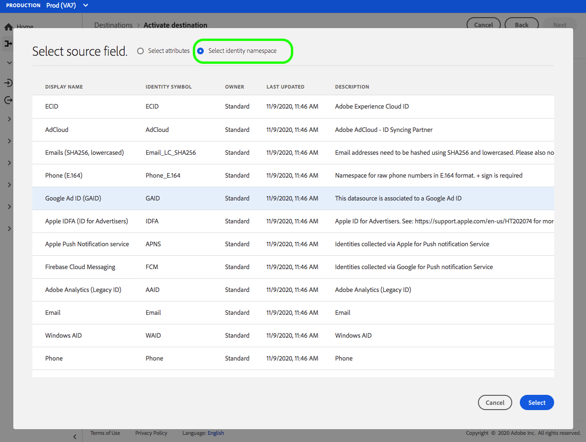
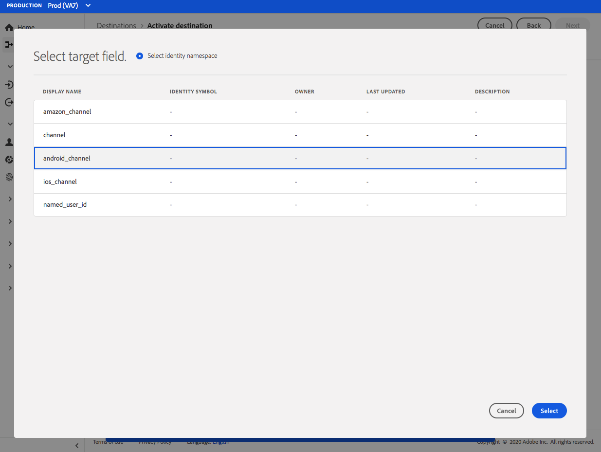
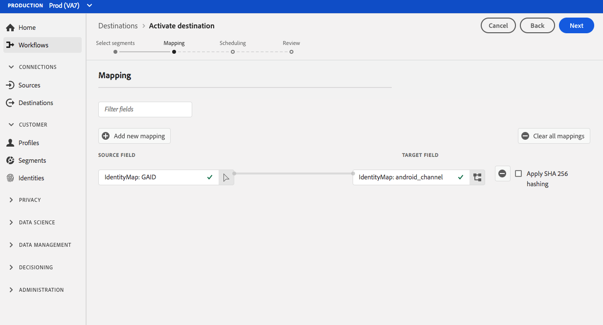

# [!DNL Airship Tags] 接続 {#airship-tags-destination}

## 概要 {#overview}

[!DNL Airship]は業界をリードする顧客エンゲージメントプラットフォームで、顧客ライフサイクルのあらゆる段階で、有意義でパーソナライズされたオムニチャネルメッセージをユーザーに提供するのに役立ちます。

この統合は、[!DNL Adobe Experience Platform]人のオーディエンスデータを[!DNL Airship]に[ タグ ](https://docs.airship.com/guides/audience/tags/)として渡し、ターゲティングまたはトリガーします。

[!DNL Airship]について詳しくは、[飛行船ドキュメント ](https://docs.airship.com)を参照してください。

>[!TIP]
>
>この宛先コネクタとドキュメント ページは、[!DNL Airship] チームによって作成および管理されています。 問い合わせやアップデートのリクエストについては、[support.airship.com](https://support.airship.com/)から直接お問い合わせください。

## 前提条件 {#prerequisites}

[!DNL Adobe Experience Platform] オーディエンスを[!DNL Airship]に送信する前に、次の操作を行う必要があります。

* [!DNL Airship] プロジェクトでタググループを作成します。
* 認証用のベアラートークンを生成します。

>[!TIP]
>
>まだアカウントを作成していない場合は、[!DNL Airship]この登録リンク [を介して](https://go.airship.eu/accounts/register/plan/starter/) アカウントを作成します。

## サポートされるオーディエンス {#supported-audiences}

この節では、この宛先に書き出すことができるオーディエンスのタイプについて説明します。

| オーディエンスの由来 | サポートあり | 説明 |
|---------|----------|----------|
| [!DNL Segmentation Service] | ○ | Experience Platform [ セグメント化サービス ](../../../segmentation/home.md)を通じて生成されたオーディエンス。 |
| その他すべてのオーディエンスの生成元 | ○ | このカテゴリには、[!DNL Segmentation Service]を通じて生成されたオーディエンス以外のすべてのオーディエンスのオリジンが含まれます。 [様々なオーディエンスの起源](/help/segmentation/ui/audience-portal.md#customize)について読みます。 次に例を示します。 <ul><li> カスタムアップロードオーディエンス [がCSV ファイルからExperience Platformに](../../../segmentation/ui/audience-portal.md#import-audience)をインポートしました。</li><li> 類似オーディエンス， </li><li> 連合オーディエンス， </li><li> [!DNL Adobe Journey Optimizer]などの他のExperience Platform アプリで生成されたオーディエンス </li><li> その他。 </li></ul> |

{style="table-layout:auto"}

オーディエンスのデータタイプ別にサポートされるオーディエンス：

| オーディエンスのデータタイプ | サポートあり | 説明 | ユースケース |
|--------------------|-----------|-------------|-----------|
| [人物オーディエンス ](/help/segmentation/types/people-audiences.md) | ○ | 顧客プロファイルにもとづいて、マーケティング施策の特定のグループをターゲットにすることができます。 | 買い物客やカートの放棄が多い |
| [ アカウントオーディエンス ](/help/segmentation/types/account-audiences.md) | × | アカウントベースドマーケティング戦略のために、特定の組織内の個人をターゲットにします。 | B2B マーケティング |
| [見込みオーディエンス ](/help/segmentation/types/prospect-audiences.md) | × | まだ顧客ではないが、ターゲットオーディエンスと特徴を共有する個人をターゲットにします。 | サードパーティデータによる見込み顧客の開拓 |
| [ データセットの書き出し](/help/catalog/datasets/overview.md) | × | [!DNL Adobe Experience Platform] データ レイクに保存されている構造化データのコレクション。 | レポート，データサイエンスワークフロー |

{style="table-layout:auto"}

## 書き出しのタイプと頻度 {#export-type-frequency}

宛先の書き出しのタイプと頻度について詳しくは、以下の表を参照してください。

| 項目 | タイプ | メモ |
|---------|----------|---------|
| 書き出しタイプ | **[!UICONTROL Audience export]** | Airship Tagsの宛先で使用されている識別子を使用して、オーディエンスのすべてのメンバーを書き出します。 |
| 書き出し頻度 | **[!UICONTROL Streaming]** | ストリーミングの宛先は常に、API ベースの接続です。オーディエンス評価に基づいて Experience Platform 内でプロファイルが更新されるとすぐに、コネクタは更新を宛先プラットフォームに送信します。[ストリーミングの宛先](/help/destinations/destination-types.md#streaming-destinations)の詳細についてはこちらを参照してください。 |

{style="table-layout:auto"}

## タググループ {#tag-groups}

Adobe Experience Platformのオーディエンスの概念は、Airshipの[Tags](https://docs.airship.com/guides/audience/tags/)と似ていますが、実装にわずかな違いがあります。 この統合により、Experience Platform セグメント [内のユーザーの](../../../xdm/field-groups/profile/segmentation.md) メンバーシップのステータスが、[!DNL Airship] タグの有無にマッピングされます。 例えば、`xdm:status`が`realized`に変わるExperience Platform オーディエンスでは、タグが[!DNL Airship] チャネルに追加されるか、このプロファイルがマッピングされるユーザーという名前のユーザーに追加されます。 `xdm:status`が`exited`に変更された場合、タグは削除されます。

この統合を有効にするには、*という名前の*&#x200B;に[!DNL Airship] タググループ `adobe-segments`を作成します。

>[!IMPORTANT]
>
>新しいタググループを作成する際に&#x200B;**「**」と書かれたラジオボタンを[!DNL Allow these tags to be set only from your server]にチェックしないでください。 そうすると、Adobe tagsの統合が失敗します。

タググループの作成手順については、[ タググループの管理](https://docs.airship.com/tutorials/manage-project/messaging/tag-groups)を参照してください。

## ベアラートークンを生成 {#generate-bearer-token}

**[!UICONTROL Settings]**&#x200B;飛行船ダッシュボード **[!UICONTROL APIs & Integrations]**&#x200B;の[ » ](https://go.airship.com)に移動し、左側のメニューで&#x200B;**[!UICONTROL Tokens]**&#x200B;を選択します。

「**[!UICONTROL Create Token]**」をクリックします。

「Adobe Tags Destination」など、トークンの使いやすい名前を指定し、ロールに「All Access」を選択します。

**[!UICONTROL Create Token]**&#x200B;をクリックし、詳細を機密情報として保存します。

## ユースケース {#use-cases}

[!DNL Airship Tags]宛先を使用する方法とタイミングをより理解しやすくするために、[!DNL Adobe Experience Platform]のお客様がこの宛先を使用して解決できるユースケースの例を次に示します。

### ユースケース #1 {#use-case-1}

小売業者やエンターテインメント プラットフォームは、ロイヤルティ顧客に関するユーザープロファイルを作成し、そのオーディエンスを[!DNL Airship]に渡して、モバイル キャンペーンでのメッセージのターゲティングを行うことができます。

### ユースケース #2 {#use-case-2}

[!DNL Adobe Experience Platform]内の特定のオーディエンスにユーザーが分類または削除された場合、リアルタイムで1対1のメッセージをトリガーします。

例えば、retailerは、Experience Platformでジーンズに特化したオーディエンスを設定します。 これにより、retailerでは、オーディエンスがジーンズの好みを特定のブランドに設定するとすぐに、モバイルメッセージをトリガーできるようになりました。

## 宛先への接続 {#connect}

>[!IMPORTANT]
>
>宛先に接続するには、**[!UICONTROL View Destinations]**&#x200B;および&#x200B;**[!UICONTROL Manage Destinations]** [ アクセス制御権限](/help/access-control/home.md#permissions)が必要です。 詳しくは、[アクセス制御の概要](/help/access-control/ui/overview.md)または製品管理者に問い合わせて、必要な権限を取得してください。

この宛先に接続するには、[宛先設定のチュートリアル](../../ui/connect-destination.md)の手順に従ってください。宛先の設定ワークフローで、以下の 2 つのセクションにリストされているフィールドに入力します。

### 宛先に対する認証 {#authenticate}

宛先に対して認証を行うには、必須フィールドに入力し、**[!UICONTROL Connect to destination]**&#x200B;を選択します。

* **[!UICONTROL Bearer token]**: [!DNL Airship] ダッシュボードから生成したベアラートークン。

### 宛先の詳細を入力 {#destination-details}

宛先の詳細を設定するには、以下の必須フィールドとオプションフィールドに入力します。UI のフィールドの横のアスタリスクは、そのフィールドが必須であることを示します。

* **[!UICONTROL Name]**：この宛先を特定するのに役立つ名前を入力してください。
* **[!UICONTROL Description]**：この宛先の説明を入力します。
* **[!UICONTROL Domain]**：この宛先に適用される[!DNL Airship] データセンターに応じて、米国またはEU データセンターのいずれかを選択します。

### アラートの有効化 {#enable-alerts}

アラートを有効にすると、宛先へのデータフローのステータスに関する通知を受け取ることができます。リストからアラートを選択して、データフローのステータスに関する通知を受け取るよう登録します。アラートについて詳しくは、[UI を使用した宛先アラートの購読](../../ui/alerts.md)についてのガイドを参照してください。

宛先接続の詳細の提供が完了したら、**[!UICONTROL Next]**&#x200B;を選択します。

## この宛先に対してオーディエンスをアクティブ化 {#activate}

>[!IMPORTANT]
>
>データをアクティブ化するには、**[!UICONTROL View Destinations]**、**[!UICONTROL Activate Destinations]**、**[!UICONTROL View Profiles]**&#x200B;および&#x200B;**[!UICONTROL View Segments]** [ アクセス制御権限](/help/access-control/home.md#permissions)が必要です。 [アクセス制御の概要](/help/access-control/ui/overview.md)を参照するか、製品管理者に問い合わせて必要な権限を取得してください。

この宛先にオーディエンスをアクティブ化する手順については、[ストリーミングオーディエンス書き出し宛先に対するオーディエンスデータのアクティブ化](../../ui/activate-segment-streaming-destinations.md)を参照してください。

## マッピングに関する考慮事項 {#mapping-considerations}

[!DNL Airship] タグは、デバイスインスタンス（例えば、iPhone）を表すチャネル上で設定できます。また、ユーザーのすべてのデバイスを顧客IDなどの共通IDにマッピングする名前付きユーザー上で設定することもできます。 スキーマにプレーンテキスト（ハッシュ化されていない）電子メールアドレスをプライマリ IDとして持っている場合は、**[!UICONTROL Source Attributes]**&#x200B;の電子メールフィールドを選択し、次に示すように、[!DNL Airship]の下の右側の列の&#x200B;**[!UICONTROL Target Identities]**&#x200B;というユーザーにマッピングします。

チャネル、つまりデバイスにマッピングする必要がある識別子の場合は、ソースに基づいて適切なチャネルにマッピングします。 次の図は、Google Advertising IDを[!DNL Airship] Android チャネルにマッピングする方法を示しています。

## データの使用とガバナンス {#data-usage-governance}

[!DNL Adobe Experience Platform] のすべての宛先は、データを処理する際のデータ使用ポリシーに準拠しています。[!DNL Adobe Experience Platform]がデータガバナンスを適用する方法について詳しくは、[ データガバナンスの概要](../../../data-governance/home.md)を参照してください。
