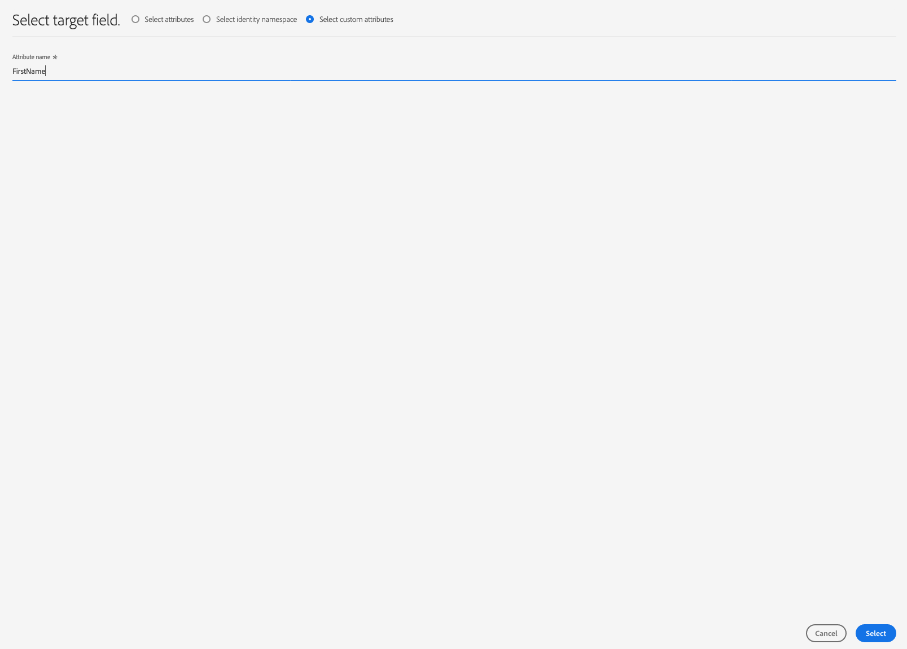

# [!DNL Braze] 接続

## 概要 {#overview}

[!DNL Braze]の宛先は、プロファイルデータを[!DNL Braze]に送信する際に役立ちます。

[!DNL Braze] は、顧客と顧客が好むブランドの間の関連性の高い思い出に残るエクスペリエンスを強化する、包括的な顧客エンゲージメントプラットフォームです。

プロファイルデータを[!DNL Braze]に送信するには、まず宛先に接続する必要があります。

## 宛先の詳細 {#specifics}

次の[!DNL Braze]宛先に固有の詳細に注意してください。

* [!DNL Adobe Experience Platform] セグメントは、属性のにエ [!DNL Braze] クスポート `AdobeExperiencePlatformSegments` されます。

>[!NOTE]
>
>追加のカスタム属性を[!DNL Braze]に送信すると、[!DNL Braze]データポイントの消費が増加する場合があることに注意してください。 追加のカスタム属性を送信する前に、[!DNL Braze]アカウントマネージャーにお問い合わせください。

## ユースケース {#use-cases}

マーケティング担当者の場合、[!DNL Adobe Experience Platform]でセグメントを構築し、モバイルエンゲージメントの宛先でユーザーをターゲットにしたいと考えています。 さらに、[!DNL Adobe Experience Platform]でセグメントとプロファイルが更新されしだい、[!DNL Adobe Experience Platform]プロファイルの属性に基づいて、パーソナライズされたエクスペリエンスをユーザーに提供したいと考えています。

## サポートされるID {#supported-identities}

[!DNL Braze] では、以下の表で説明するIDのアクティブ化をサポートしています。

| ターゲットID | 説明 | 注意点 |
|---|---|---|
| external_id | 任意のIDのマッピングをサポートするカスタムの[!DNL Braze]識別子。 | [!DNL Braze] [`external_id`](https://www.braze.com/docs/api/basics/#external-user-id-explanation)にマッピングしている限り、任意の[ID](../../../identity-service/namespaces.md)を[!DNL Braze]宛先に送信できます。 |

## 書き出しタイプ {#export-type}

**[!DNL Profile-based]** ：セグメントのすべてのメンバーを、目的のスキーマフィールド(例：フィールドマッピングに従って、電子メールアドレス、電話番号、姓)やID（またはその両方）を表示します。[!DNL Adobe Experience Platform] セグメントは、属性のにエ [!DNL Braze] クスポート `AdobeExperiencePlatformSegments` されます。

## 宛先に接続 {#connect}

この宛先に接続するには、[宛先の設定に関するチュートリアル](../../ui/connect-destination.md)で説明されている手順に従います。

### 接続パラメーター {#parameters}

[この宛先を設定](../../ui/connect-destination.md)する際に、次の情報を指定する必要があります。

* **[!UICONTROL アカウントトークンのブレーズ]**:これが鍵 [!DNL Braze] [!DNL API] です。[!DNL API]キーの入手方法の詳細は、次のURLを参照してください。[REST APIキーの概要](https://www.braze.com/docs/api/api_key/)。
* **[!UICONTROL 名前]**:この宛先が将来認識される名前を入力します。
* **[!UICONTROL 説明]**:この宛先を将来識別するのに役立つ説明を入力します。
* **[!UICONTROL エンドポイントインスタンス]**:使用する必要のあ [!DNL Braze] るエンドポイントインスタンスを担当者に問い合わせてください。

## この宛先へのセグメントのアクティブ化 {#activate}

この宛先に対してオーディエンスセグメントをアクティブ化する手順については、[ストリーミングセグメントの書き出し先へのオーディエンスデータのアクティブ化](../../ui/activate-segment-streaming-destinations.md)を参照してください。

## マッピングに関する考慮事項 {#mapping-considerations}

オーディエンスデータを[!DNL Adobe Experience Platform]から[!DNL Braze]の宛先に正しく送信するには、フィールドマッピングの手順を実行する必要があります。

マッピングは、[!DNL Platform]アカウント内の[!DNL Experience Data Model](XDM)スキーマフィールドと、対応するターゲット宛先からの対応するフィールド間のリンクの作成で構成されます。

XDMフィールドを[!DNL Braze]宛先フィールドに正しくマッピングするには、次の手順に従います。

[!UICONTROL マッピング]の手順で、「**[!UICONTROL 新しいマッピングを追加]**」をクリックします。

「[!UICONTROL ソースフィールド]」セクションで、空のフィールドの横にある矢印ボタンをクリックします。

[!UICONTROL ソースフィールドを選択]ウィンドウで、次の2つのカテゴリのXDMフィールドを選択できます。
* [!UICONTROL 属性の選択]:このオプションを使用して、XDMスキーマの特定のフィールドを属性にマッピ [!DNL Braze] ングします。

* [!UICONTROL ID名前空間の選択]:このオプションを使用して、ID名前空間を [!DNL Platform] 名前空間にマッピン [!DNL Braze] グします。

ソースフィールドを選択し、「**[!UICONTROL 選択]**」をクリックします。

「[!UICONTROL ターゲットフィールド]」セクションで、フィールドの右側にあるマッピングアイコンをクリックします。

[!UICONTROL ターゲットフィールドを選択]ウィンドウで、次の2つのカテゴリのターゲットフィールドを選択できます。
* [!UICONTROL ID名前空間の選択]:ID名前空間をID名前空間にマ [!DNL Platform] ッピングするに [!DNL Braze] は、このオプションを使用します。
* [!UICONTROL カスタム属性の選択]:このオプションを使用して、XDM属性を、アカウントで定 [!DNL Braze] 義したカスタム属性にマッピン [!DNL Braze] グします。  また、このオプションを使用して、既存のXDM属性の名前をに変更できま [!DNL Braze]す。例えば、`lastName` XDM属性を[!DNL Braze]のカスタム`Last_Name`属性にマッピングすると、[!DNL Braze]に`Last_Name`属性が作成されます（属性がまだ存在しない場合）。また、`lastName` XDM属性をマッピングします。

ターゲットフィールドを選択し、「**[!UICONTROL 選択]**」をクリックします。

これで、フィールドマッピングがリストに表示されます。

マッピングをさらに追加するには、上記の手順を繰り返します。

## マッピングの例 {#mapping-example}

例えば、XDMプロファイルスキーマと[!DNL Braze]インスタンスに次の属性とIDが含まれているとします。

|  | XDMプロファイルスキーマ | [!DNL Braze] インスタンス |
|---|---|---|
| 属性 | <ul><li>person.name.firstName</code></li><li>person.name.lastName</code></li><li>mobilePhone.number</code></li></ul> | <ul><li>名</code></li><li>姓</code></li><li>電話番号</code></li></ul> |
| ID | <ul><li>メール</code></li><li>Google広告ID(GAID)</code></li><li>広告主(IDFA)</code>向けApple ID</li></ul> | <ul><li>external_id</code></li></ul> |

正しいマッピングは次のようになります。

## エクスポートされたデータ {#exported-data}

データが[!DNL Braze]の宛先に正常に書き出されたかどうかを確認するには、[!DNL Braze]アカウントを確認します。 [!DNL Adobe Experience Platform] セグメントは、属性のにエ [!DNL Braze] クスポート `AdobeExperiencePlatformSegments` されます。

## データの使用とガバナンス {#data-usage-governance}

すべての[!DNL Adobe Experience Platform]宛先は、データを処理する際のデータ使用ポリシーに準拠しています。 [!DNL Adobe Experience Platform]によるデータガバナンスの強制方法について詳しくは、「[データガバナンスの概要](../../../data-governance/home.md)」を参照してください。
