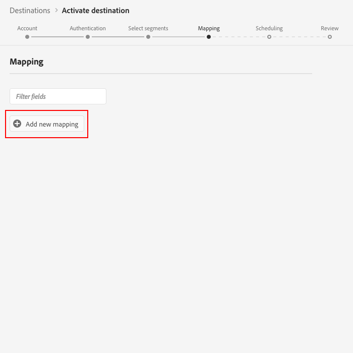
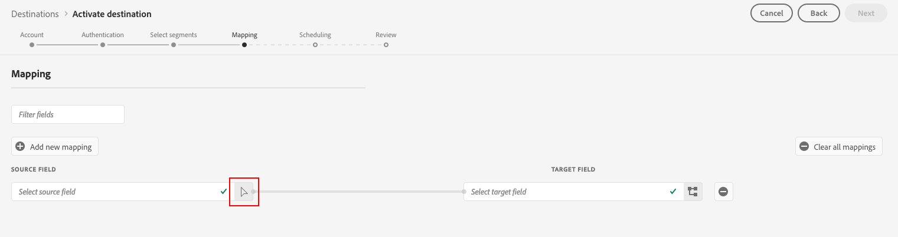
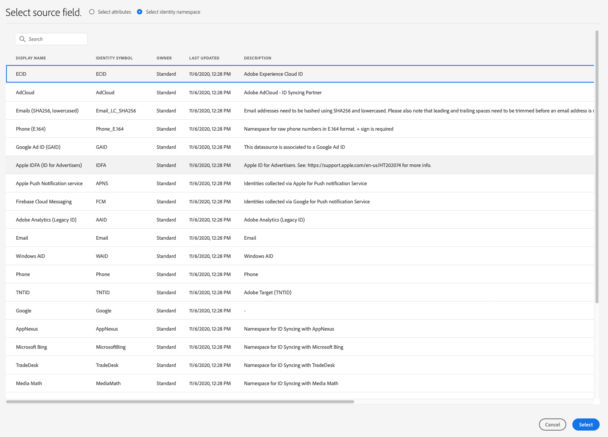
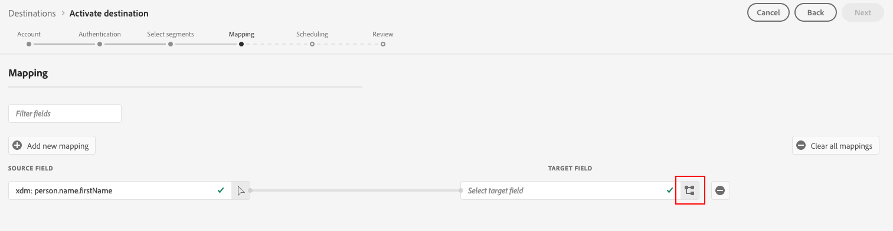
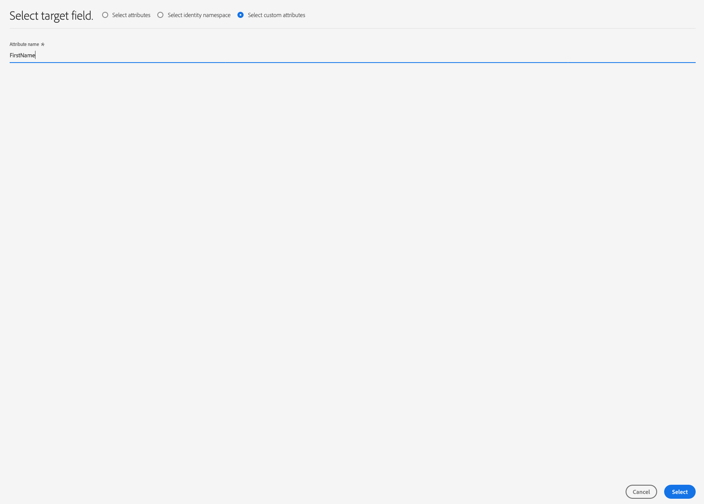
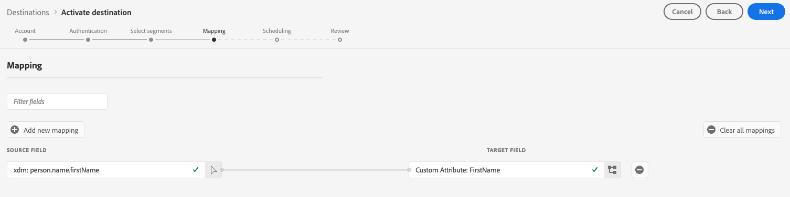
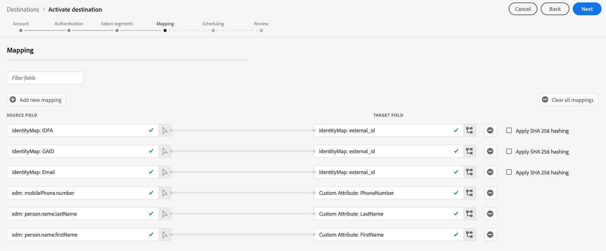

# [!DNL Braze] 接続

## 概要 {#overview}

[!DNL Braze]宛先は、プロファイルデータを[!DNL Braze]に送信するのに役立ちます。

[!DNL Braze]は、顧客とブランド間の関連性の高い記憶に残るエクスペリエンスを強化する、包括的な顧客エンゲージメントプラットフォームです。

プロファイルデータを[!DNL Braze]に送信するには、まず宛先に接続する必要があります。

## 宛先の詳細 {#specifics}

[!DNL Braze]宛先に固有の次の詳細に注意してください：

* [!DNL Adobe Experience Platform]人のオーディエンスは、[!DNL Braze]属性の`AdobeExperiencePlatformSegments`に書き出されます。

>[!NOTE]
>
>カスタム属性を[!DNL Braze]に追加すると、[!DNL Braze] データポイントの消費量が増加する可能性があることに注意してください。 カスタム属性を追加する前に、[!DNL Braze] アカウントマネージャーに相談してください。

## ユースケース {#use-cases}

マーケターとして、[!DNL Adobe Experience Platform]にオーディエンスが構築された、モバイルエンゲージメントの宛先のユーザーをターゲットにしたい。 さらに、[!DNL Adobe Experience Platform]でオーディエンスとプロファイルが更新されるとすぐに、その[!DNL Adobe Experience Platform] プロファイルの属性に基づいて、パーソナライズされたエクスペリエンスを提供したいと考えています。

## サポートされる ID {#supported-identities}

[!DNL Braze] では、以下の表で説明する ID のアクティベーションをサポートしています。

| ターゲット ID | 説明 | 注意点 |
|---|---|---|
| external_id | 任意のIDのマッピングをサポートするカスタム [!DNL Braze]識別子。 | [&#x200B; &#x200B;](../../../identity-service/features/namespaces.md) [!DNL Braze]にマッピングすれば、任意の[!DNL Braze]ID[`external_id`を](https://www.braze.com/docs/api/basics/#external-user-id-explanation)宛先に送信できます。 |

{style="table-layout:auto"}

## サポートされるオーディエンス {#supported-audiences}

この節では、この宛先に書き出すことができるオーディエンスのタイプについて説明します。

| オーディエンスの由来 | サポートあり | 説明 |
|---------|----------|----------|
| [!DNL Segmentation Service] | ○ | Experience Platform [&#x200B; セグメント化サービス &#x200B;](../../../segmentation/home.md)を通じて生成されたオーディエンス。 |
| その他すべてのオーディエンスの生成元 | ○ | このカテゴリには、[!DNL Segmentation Service]を通じて生成されたオーディエンス以外のすべてのオーディエンスのオリジンが含まれます。 [様々なオーディエンスの起源](/help/segmentation/ui/audience-portal.md#customize)について読みます。 次に例を示します。 <ul><li> カスタムアップロードオーディエンス [がCSV ファイルからExperience Platformに](../../../segmentation/ui/audience-portal.md#import-audience)をインポートしました。</li><li> 類似オーディエンス， </li><li> 連合オーディエンス， </li><li> [!DNL Adobe Journey Optimizer]などの他のExperience Platform アプリで生成されたオーディエンス </li><li> その他。 </li></ul> |

{style="table-layout:auto"}

オーディエンスのデータタイプ別にサポートされるオーディエンス：

| オーディエンスのデータタイプ | サポートあり | 説明 | ユースケース |
|--------------------|-----------|-------------|-----------|
| [人物オーディエンス &#x200B;](/help/segmentation/types/people-audiences.md) | ○ | 顧客プロファイルにもとづいて、マーケティング施策の特定のグループをターゲットにすることができます。 | 買い物客やカートの放棄が多い |
| [&#x200B; アカウントオーディエンス &#x200B;](/help/segmentation/types/account-audiences.md) | × | アカウントベースドマーケティング戦略のために、特定の組織内の個人をターゲットにします。 | B2B マーケティング |
| [見込みオーディエンス &#x200B;](/help/segmentation/types/prospect-audiences.md) | × | まだ顧客ではないが、ターゲットオーディエンスと特徴を共有する個人をターゲットにします。 | サードパーティデータによる見込み顧客の開拓 |
| [&#x200B; データセットの書き出し](/help/catalog/datasets/overview.md) | × | [!DNL Adobe Experience Platform] データ レイクに保存されている構造化データのコレクション。 | レポート，データサイエンスワークフロー |

{style="table-layout:auto"}

## 書き出しのタイプと頻度 {#export-type-frequency}

宛先の書き出しのタイプと頻度について詳しくは、以下の表を参照してください。

| 項目 | タイプ | メモ |
|---------|----------|---------|
| 書き出しタイプ | **[!UICONTROL Profile-based]** | フィールドマッピングに従って、セグメントのすべてのメンバーを、目的のスキーマフィールド（電子メールアドレス、電話番号、姓など）および/またはIDと共に書き出します。[!DNL Adobe Experience Platform]人のオーディエンスは、[!DNL Braze]属性の`AdobeExperiencePlatformSegments`に書き出されます。 |
| 書き出し頻度 | **[!UICONTROL Streaming]** | ストリーミングの宛先は常に、API ベースの接続です。オーディエンス評価に基づいて Experience Platform 内でプロファイルが更新されるとすぐに、コネクタは更新を宛先プラットフォームに送信します。詳しくは、[ストリーミングの宛先](/help/destinations/destination-types.md#streaming-destinations)を参照してください。 |

{style="table-layout:auto"}

## 宛先への接続 {#connect}

>[!IMPORTANT]
>
>宛先に接続するには、**[!UICONTROL View Destinations]**&#x200B;および&#x200B;**[!UICONTROL Manage Destinations]** [&#x200B; アクセス制御権限](/help/access-control/home.md#permissions)が必要です。 詳しくは、[アクセス制御の概要](/help/access-control/ui/overview.md)または製品管理者に問い合わせて、必要な権限を取得してください。

この宛先に接続するには、[宛先設定のチュートリアル](../../ui/connect-destination.md)の手順に従ってください。宛先の設定ワークフローで、以下の 2 つのセクションにリストされているフィールドに入力します。

### 宛先に対する認証 {#authenticate}

宛先に対して認証を行うには、必須フィールドに入力し、**[!UICONTROL Connect to destination]**&#x200B;を選択します。

* **[!UICONTROL Braze account token]**：これは[!DNL Braze] [!DNL API] キーです。 [!DNL API] キーの取得方法に関する詳細な手順については、[REST API キーの概要](https://www.braze.com/docs/api/api_key/)を参照してください。

### 宛先の詳細を入力 {#destination-details}

宛先の詳細を設定するには、以下の必須フィールドとオプションフィールドに入力します。UI のフィールドの横のアスタリスクは、そのフィールドが必須であることを示します。

* **[!UICONTROL Name]**：今後この宛先を認識する際に使用する名前を入力します。
* **[!UICONTROL Description]**：今後この宛先を特定するのに役立つ説明を入力します。
* **[!UICONTROL Endpoint Instance]**: [がサポートしているすべての](https://www.braze.com/docs/user_guide/administrative/access_braze/sdk_endpoints)地域固有のエンドポイント [!DNL Braze]を選択できます。 使用するエンドポイントインスタンスを[!DNL Braze]担当者に尋ねます。

### アラートの有効化 {#enable-alerts}

アラートを有効にすると、宛先へのデータフローのステータスに関する通知を受け取ることができます。リストからアラートを選択して、データフローのステータスに関する通知を受け取るよう登録します。アラートについて詳しくは、[UI を使用した宛先アラートの購読](../../ui/alerts.md)についてのガイドを参照してください。

宛先接続の詳細の提供が完了したら、**[!UICONTROL Next]**&#x200B;を選択します。

## この宛先に対してオーディエンスをアクティブ化 {#activate}

>[!IMPORTANT]
>
>* データをアクティブ化するには、**[!UICONTROL View Destinations]**、**[!UICONTROL Activate Destinations]**、**[!UICONTROL View Profiles]**&#x200B;および&#x200B;**[!UICONTROL View Segments]** [&#x200B; アクセス制御権限](/help/access-control/home.md#permissions)が必要です。 [アクセス制御の概要](/help/access-control/ui/overview.md)を参照するか、製品管理者に問い合わせて必要な権限を取得してください。
>* *ID*&#x200B;をエクスポートするには、**[!UICONTROL View Identity Graph]** [&#x200B; アクセス制御権限](/help/access-control/home.md#permissions)が必要です。  {width="100" zoomable="yes"}

この宛先にオーディエンスをアクティブ化する手順については、[ストリーミングオーディエンス書き出し宛先に対するオーディエンスデータのアクティブ化](../../ui/activate-segment-streaming-destinations.md)を参照してください。

## マッピングに関する考慮事項 {#mapping-considerations}

オーディエンスデータを[!DNL Adobe Experience Platform]から[!DNL Braze]宛先に正しく送信するには、フィールドマッピング手順を実行する必要があります。

マッピングは、[!DNL Experience Data Model] アカウントの[!DNL Experience Platform] （XDM） スキーマフィールドと、ターゲット宛先からの対応する同等のフィールドとの間にリンクを作成することで構成されます。

XDM フィールドを [!DNL Braze] 宛先フィールドに正しくマッピングするには、次の手順に従います。

[!UICONTROL Mapping] ステップで、**[!UICONTROL Add new mapping]**&#x200B;を選択します。

[!UICONTROL Source Field] セクションで、空のフィールドの横にある矢印ボタンをクリックします。

[!UICONTROL Select source field] ウィンドウでは、XDM フィールドの2つのカテゴリから選択できます。

* [!UICONTROL Select attributes]：このオプションを使用して、XDM スキーマから特定のフィールドを[!DNL Braze]属性にマッピングします。

* [!UICONTROL Select identity namespace]：このオプションを使用して、[!DNL Experience Platform] ID名前空間を[!DNL Braze]名前空間にマッピングします。

ソースフィールドを選択し、**[!UICONTROL Select]**&#x200B;を選択します。

[!UICONTROL Target Field] セクションで、フィールドの右側にあるマッピングアイコンをクリックします。

[!UICONTROL Select target field] ウィンドウでは、次の2つのカテゴリのターゲットフィールドから選択できます。

* [!UICONTROL Select identity namespace]：このオプションを使用して、[!DNL Experience Platform]個のID名前空間を[!DNL Braze]個のID名前空間にマッピングします。
* [!UICONTROL Select custom attributes]：このオプションを使用して、XDM属性を[!DNL Braze] アカウントで定義したカスタム [!DNL Braze]属性にマッピングします。  このオプションを使用して、既存のXDM属性の名前を[!DNL Braze]に変更することもできます。 例えば、`lastName` XDM属性を`Last_Name`のカスタム [!DNL Braze]属性にマッピングすると、まだ存在しない場合は`Last_Name`に[!DNL Braze]属性が作成され、`lastName` XDM属性がそれにマッピングされます。

ターゲットフィールドを選択し、**[!UICONTROL Select]**&#x200B;を選択します。

これで、フィールドマッピングがリストに表示されます。

さらにマッピングを追加するには、前の手順を繰り返します。

## マッピングの例 {#mapping-example}

例えば、XDM プロファイルスキーマと[!DNL Braze] インスタンスに次の属性とIDが含まれているとします。

|  | XDM プロファイルスキーマ | [!DNL Braze] インスタンス |
|---|---|---|
| 属性 | <ul><li><code>person.name.firstName</code></li><li><code>person.name.lastName</code></li><li><code>mobilePhone.number</code></li></ul> | <ul><li><code>FirstName</code></li><li><code>LastName</code></li><li><code>電話番号</code></li></ul> |
| ID | <ul><li><code> メール</code></li><li><code>Google Ad ID （GAID）</code></li><li><code>広告主向けApple ID （IDFA）</code></li></ul> | <ul><li><code>external_id</code></li></ul> |

正しいマッピングは次のようになります。

## 書き出したデータ {#exported-data}

データがに正常に [!DNL Braze] の宛先に書き出されたかどうかを確認するには、[!DNL Braze] アカウントを確認します。 [!DNL Adobe Experience Platform]人のオーディエンスは、[!DNL Braze]属性の`AdobeExperiencePlatformSegments`に書き出されます。

## トラブルシューティング {#troubleshooting}

**この宛先に対するオーディエンスのアクティブ化中にタイムアウトエラーが発生しました。 どうすればよいですか。**

この宛先へのオーディエンスのアクティベーションがタイムアウトエラーになる場合があります。 このエラーは、アクティベーションの問題を示すものではありません。

タイムアウトエラーが発生した場合は、宛先プラットフォームのオーディエンスサイズを確認します。 オーディエンスサイズが正しい場合、統合は期待どおりに機能しています。

## データの使用とガバナンス {#data-usage-governance}

[!DNL Adobe Experience Platform] のすべての宛先は、データを処理する際のデータ使用ポリシーに準拠しています。[!DNL Adobe Experience Platform]がデータガバナンスを適用する方法について詳しくは、[&#x200B; データガバナンスの概要](../../../data-governance/home.md)を参照してください。
