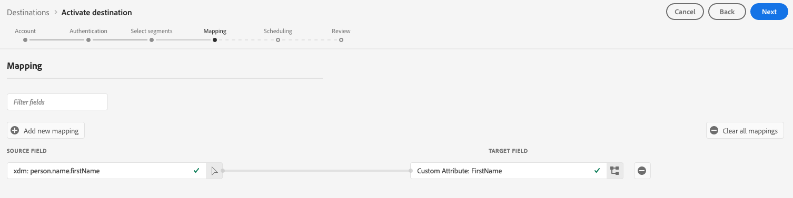

# [!DNL Braze] 接続

## 概要 {#overview}

[!DNL Braze] の宛先は、プロファイルデータを [!DNL Braze] に送信するのに役立ちます。

[!DNL Braze] は、顧客と好きなブランドの間で、関連性の高い思い出に残るエクスペリエンスを強化する包括的なカスタマーエンゲージメントプラットフォームです。

プロファイルデータを [!DNL Braze] に送信するには、まず宛先に接続する必要があります。

## 宛先の詳細 {#specifics}

[!DNL Braze] の宛先に固有な次の詳細に注意してください。

* [!DNL Adobe Experience Platform] オーディエンスは、[!DNL Braze] 属性の下の `AdobeExperiencePlatformSegments` に書き出されます。

>[!NOTE]
>
>追加のカスタム属性を [!DNL Braze] に送信すると、[!DNL Braze] データポイントの使用が増加する可能性があることに注意してください。 追加のカスタム属性を送信する前に、[!DNL Braze] のアカウントマネージャーにお問い合わせください。

## ユースケース {#use-cases}

マーケターは、[!DNL Adobe Experience Platform] に組み込まれたオーディエンスを使用して、モバイルエンゲージメントの宛先のユーザーをターゲットにしたいと考えています。 さらに、[!DNL Adobe Experience Platform] でオーディエンスとプロファイルが更新されるとすぐに、[!DNL Adobe Experience Platform] ーザープロファイルの属性に基づいてパーソナライズされたエクスペリエンスを提供したいと考えています。

## サポートされる ID {#supported-identities}

[!DNL Braze] では、以下の表で説明する ID のアクティベーションをサポートしています。

| ターゲット ID | 説明 | 注意点 |
|---|---|---|
| external_id | 任意の ID のマッピングをサポートするカスタム [!DNL Braze] 識別子。 | 任意の [ID](../../../identity-service/features/namespaces.md) を [!DNL Braze] [!DNL Braze][`external_id` にマッピングする限り、](https://www.braze.com/docs/api/basics/#external-user-id-explanation) の宛先に送信できます。 |

{style="table-layout:auto"}

## サポートされるオーディエンス {#supported-audiences}

この節では、この宛先に書き出すことができるオーディエンスのタイプについて説明します。

| オーディエンスオリジン | サポートあり | 説明 |
|---------|----------|----------|
| [!DNL Segmentation Service] | ✓ | Experience Platform [&#x200B; セグメント化サービス &#x200B;](../../../segmentation/home.md) を通じて生成されたオーディエンス。 |
| カスタムアップロード | ✓ | CSV ファイルから Experience Platform に[読み込まれた](../../../segmentation/ui/audience-portal.md#import-audience)オーディエンス。 |

{style="table-layout:auto"}

## 書き出しのタイプと頻度 {#export-type-frequency}

宛先の書き出しのタイプと頻度について詳しくは、以下の表を参照してください。

| 項目 | タイプ | メモ |
|---------|----------|---------|
| 書き出しタイプ | **[!UICONTROL Profile-based]** | セグメントのすべてのメンバーを、フィールドマッピングに従って、必要なスキーマフィールド（例：メールアドレス、電話番号、姓）や ID と共に書き出します。[!DNL Adobe Experience Platform] オーディエンスは、[!DNL Braze] 属性の下の `AdobeExperiencePlatformSegments` に書き出されます。 |
| 書き出し頻度 | **[!UICONTROL Streaming]** | ストリーミングの宛先は常に、API ベースの接続です。オーディエンス評価に基づいて Experience Platform 内でプロファイルが更新されるとすぐに、コネクタは更新を宛先プラットフォームに送信します。詳しくは、[ストリーミングの宛先](/help/destinations/destination-types.md#streaming-destinations)を参照してください。 |

{style="table-layout:auto"}

## 宛先への接続 {#connect}

>[!IMPORTANT]
> 
>宛先に接続するには、**[!UICONTROL View Destinations]** および **[!UICONTROL Manage Destinations]**&#x200B;[&#x200B; アクセス制御権限 &#x200B;](/help/access-control/home.md#permissions) が必要です。 詳しくは、[アクセス制御の概要](/help/access-control/ui/overview.md)または製品管理者に問い合わせて、必要な権限を取得してください。

この宛先に接続するには、[宛先設定のチュートリアル](../../ui/connect-destination.md)の手順に従ってください。宛先の設定ワークフローで、以下の 2 つのセクションにリストされているフィールドに入力します。

### 宛先に対する認証 {#authenticate}

宛先に対する認証を行うには、必須フィールドに入力し、「**[!UICONTROL Connect to destination]**」を選択します。

* **[!UICONTROL Braze account token]**：これは [!DNL Braze] [!DNL API] キーです。 [!DNL API] キーの取得方法に関する詳細な手順については、[REST API キーの概要 &#x200B;](https://www.braze.com/docs/api/api_key/) を参照してください。

### 宛先の詳細を入力 {#destination-details}

宛先の詳細を設定するには、以下の必須フィールドとオプションフィールドに入力します。UI のフィールドの横のアスタリスクは、そのフィールドが必須であることを示します。

* **[!UICONTROL Name]**：今後この宛先を認識するための名前を入力してください。
* **[!UICONTROL Description]**：今後この宛先を識別するのに役立つ説明を入力してください。
* **[!UICONTROL Endpoint Instance]**:[&#x200B; でサポートされているすべての &#x200B;](https://www.braze.com/docs/user_guide/administrative/access_braze/sdk_endpoints) 地域固有のエンドポイント [!DNL Braze] を選択できます。 使用するエンドポイントインスタンスを [!DNL Braze] 担当者に問い合わせます。

### アラートの有効化 {#enable-alerts}

アラートを有効にすると、宛先へのデータフローのステータスに関する通知を受け取ることができます。リストからアラートを選択して、データフローのステータスに関する通知を受け取るよう登録します。アラートについて詳しくは、[UI を使用した宛先アラートの購読](../../ui/alerts.md)についてのガイドを参照してください。

宛先接続への詳細の入力を終えたら「**[!UICONTROL Next]**」を選択します。

## この宛先に対してオーディエンスをアクティブ化 {#activate}

>[!IMPORTANT]
> 
>* データをアクティブ化するには、**[!UICONTROL View Destinations]**、**[!UICONTROL Activate Destinations]**、**[!UICONTROL View Profiles]**、**[!UICONTROL View Segments]** [&#x200B; アクセス制御権限 &#x200B;](/help/access-control/home.md#permissions) が必要です。 [アクセス制御の概要](/help/access-control/ui/overview.md)を参照するか、製品管理者に問い合わせて必要な権限を取得してください。
>* *ID* を書き出すには、**[!UICONTROL View Identity Graph]** [&#x200B; アクセス制御権限 &#x200B;](/help/access-control/home.md#permissions) が必要です。  {width="100" zoomable="yes"}

この宛先にオーディエンスをアクティブ化する手順については、[ストリーミングオーディエンス書き出し宛先に対するオーディエンスデータのアクティブ化](../../ui/activate-segment-streaming-destinations.md)を参照してください。

## マッピングに関する考慮事項 {#mapping-considerations}

オーディエンスデータを [!DNL Adobe Experience Platform] から [!DNL Braze] の宛先に正しく送信するには、フィールドマッピングの手順を実行する必要があります。

マッピングは、[!DNL Experience Data Model] アカウントの [!DNL Experience Platform] （XDM）スキーマフィールドと、ターゲット宛先から対応する同等のスキーマフィールドとの間にリンクを作成して構成されます。

XDM フィールドを [!DNL Braze] 宛先フィールドに正しくマッピングするには、次の手順に従います。

[!UICONTROL Mapping] の手順で、「**[!UICONTROL Add new mapping]**」をクリックします。

「[!UICONTROL Source Field]」セクションで、空のフィールドの横にある矢印ボタンをクリックします。

[!UICONTROL Select source field] ウィンドウでは、XDM フィールドの 2 つのカテゴリから選択できます。

* [!UICONTROL Select attributes]：このオプションを使用して、XDM スキーマの特定のフィールドを [!DNL Braze] 属性にマッピングします。

* [!UICONTROL Select identity namespace]:[!DNL Experience Platform] ID 名前空間を [!DNL Braze] 名前空間にマッピングするには、このオプションを使用します。

ソースフィールドを選択し、「**[!UICONTROL Select]**」をクリックします。

「[!UICONTROL Target Field]」セクションで、フィールドの右側にあるマッピングアイコンをクリックします。

[!UICONTROL Select target field] ウィンドウでは、ターゲットフィールドの次の 2 つのカテゴリから選択できます。

* [!UICONTROL Select identity namespace]：このオプションを使用して、ID 名前空間 [!DNL Experience Platform]ID 名前空間にマッピン [!DNL Braze] します。
* [!UICONTROL Select custom attributes]：このオプションを使用して、XDM 属性を [!DNL Braze] アカウントで定義したカスタム [!DNL Braze] 属性にマッピングします。   また、このオプションを使用して、既存の XDM 属性の名前を [!DNL Braze] に変更することもできます。 例えば、`lastName` XDM 属性を `Last_Name` のカスタム [!DNL Braze] 属性にマッピングすると、`Last_Name` 属性が存在しない場合は [!DNL Braze] に作成し、`lastName` XDM 属性をマッピングします。

ターゲットフィールドを選択し、「**[!UICONTROL Select]**」をクリックします。

これで、リストにフィールドマッピングが表示されます。

さらにマッピングを追加するには、前の手順を繰り返します。

## マッピングの例 {#mapping-example}

XDM プロファイルスキーマと [!DNL Braze] インスタンスに、次の属性と ID が含まれているとします。

|  | XDM プロファイルスキーマ | [!DNL Braze] Instance |
|---|---|---|
| 属性 | <ul><li><code>person.name.firstName</code></li><li><code>person.name.lastName</code></li><li><code>mobilePhone.number</code></li></ul> | <ul><li><code>FirstName</code></li><li><code>LastName</code></li><li><code> 電話番号</code></li></ul> |
| ID | <ul><li><code> メール</code></li><li><code>Google広告 ID （GAID）</code></li><li><code> 広告主のApple ID （IDFA）</code></li></ul> | <ul><li><code>external_id</code></li></ul> |

正しいマッピングは次のようになります。

## 書き出したデータ {#exported-data}

データがに正常に [!DNL Braze] の宛先に書き出されたかどうかを確認するには、[!DNL Braze] アカウントを確認します。 [!DNL Adobe Experience Platform] オーディエンスは、[!DNL Braze] 属性の下の `AdobeExperiencePlatformSegments` に書き出されます。

## トラブルシューティング {#troubleshooting}

**この宛先に対してオーディエンスをアクティブ化する際に、タイムアウトエラーが発生しました。 どうすればよいですか？**

この宛先に対する Audience Activation によって、タイムアウトエラーが発生する場合があります。 このエラーは、アクティベーションの問題を示しているわけではありません。

タイムアウトエラーが発生した場合は、宛先プラットフォームでオーディエンスサイズを確認します。 オーディエンスサイズが正しい場合、統合は期待どおりに動作しています。

## データの使用とガバナンス {#data-usage-governance}

[!DNL Adobe Experience Platform] のすべての宛先は、データを処理する際のデータ使用ポリシーに準拠しています。[!DNL Adobe Experience Platform] がどのようにデータガバナンスを実施するかについて詳しくは、[&#x200B; データガバナンスの概要 &#x200B;](../../../data-governance/home.md) を参照してください。
