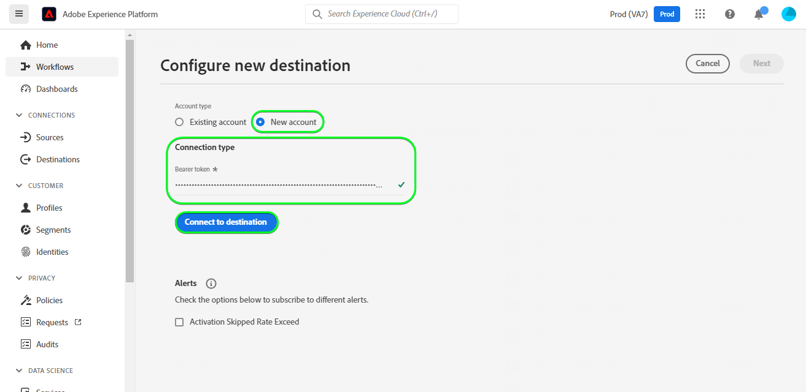
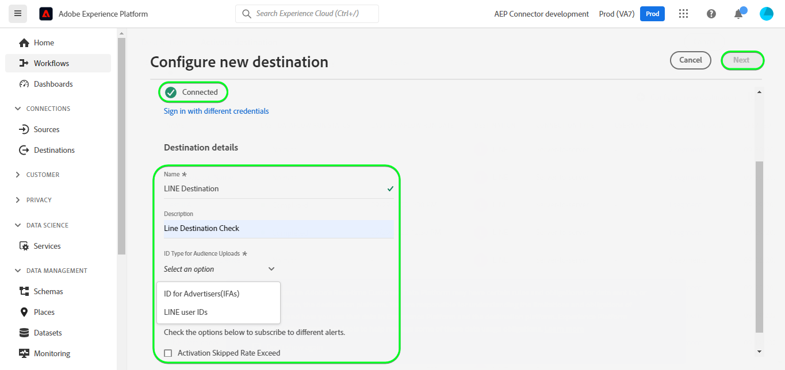
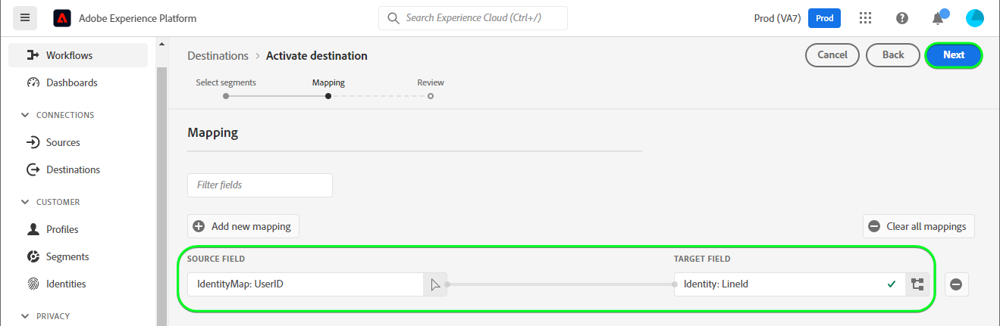
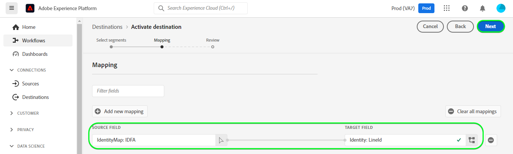
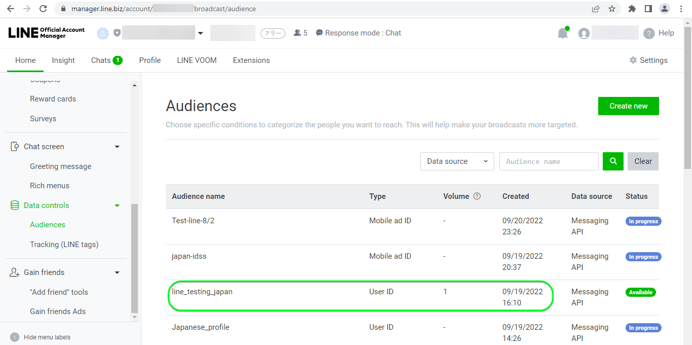

# [!DNL LINE] 接続

## 概要 {#overview}

[[!DNL LINE]](https://line.me/en/)は、人、サービス、情報を結びつけ、チャットアプリからエンターテイメント、ソーシャル、および日々のアクティビティのハブに成長した人気のあるコミュニケーション プラットフォームです。

この[!DNL Adobe Experience Platform] [宛先](/help/destinations/home.md)は、[[!DNL LINE]  メッセージング API](https://developers.line.biz/en/reference/messaging-api/)を活用しています。 Experience Platform オーディエンスのプロファイルは、ビジネスニーズに応じて[!DNL LINE]内のコネクションとしてアクティブ化できます。

[!DNL LINE]は、[!DNL LINE] Messaging APIと通信するための認証メカニズムとしてベアラートークンを使用します。 [!DNL LINE] インスタンスに対する認証手順は、[宛先に対する認証](#authenticate) セクション内で、さらに下にあります。

## ユースケース {#use-cases}

マーケターは、[!DNL Adobe Experience Platform]で構築されたオーディエンスを使用して、モバイルエンゲージメントの宛先でユーザーをターゲットにすることができます。 さらに、[!DNL Adobe Experience Platform]でオーディエンスとプロファイルが更新されるとすぐに、その[!DNL Adobe Experience Platform] プロファイルの属性に基づいて、パーソナライズされたエクスペリエンスを配信できます。

## 前提条件 {#prerequisites}

### [!DNL LINE] 前提条件 {#prerequisites-destination}

Experience Platformから[!DNL LINE] アカウントにデータをエクスポートするには、[!DNL LINE]の次の前提条件に注意してください。

#### [!DNL LINE] アカウントが必要です {#prerequisites-account}

まだ[!DNL LINE] アカウントをお持ちでない場合は、登録して作成する必要があります。 アカウントを作成するには：

1. [!DNL LINE] [&#x200B; アカウントログイン &#x200B;](https://account.line.biz/login?redirectUri=https%3A%2F%2Fmanager.line.biz%2F) ページに移動します
2. **[!UICONTROL Create an account]** を選択します。

#### [!DNL LINE channel access token (long-lived)]開発者コンソールから[!DNL LINE]を収集します {#gather-credentials}

Experience Platformが[!DNL LINE] リソースにアクセスできるようにするには、目的の&#x200B;*[!DNL Channel access token (long-lived)]* [!DNL LINE]Messaging API *チャネルの*&#x200B;が必要です。

1. [!DNL LINE] アカウントで[[!DNL LINE] 開発者コンソール &#x200B;](https://developers.line.biz/console)にログインします。
1. 次に、*[!DNL Providers]* リストにアクセスし、対象の&#x200B;*[!DNL Provider]*&#x200B;を選択し、最後に&#x200B;*Messaging API* チャネルを選択して設定にアクセスします。 開発者コンソールに初めてアクセスする場合は、[[!DNL LINE]  ドキュメント &#x200B;](https://developers.line.biz/en/docs/messaging-api/getting-started/)に従って、プロバイダーの作成に必要な手順を完了してください。
1. 最後に、***[!DNL Channel access token]*** セクションに移動し、***[!DNL Channel access token (long-lived)]***&#x200B;宛先への認証[手順で必要な](#authenticate)値をコピーします。

| 資格情報 | 説明 | 例 |
| --- | --- | --- |
| `[!DNL Channel access token (long-lived)]` | あなたの[!DNL LINE Channel access token (long-lived)]。 | `aaa2112XSMWqLXR7..........nyilFU=` |

[[!DNL LINE] 開発者コンソールを使用してチャネルを作成するか、既存の](https://developers.line.biz/en/docs/messaging-api/getting-started/) アカウントにチャネルを追加する方法については、[!DNL LINE] ドキュメント [!DNL LINE]を参照してください。

## サポートされている ID {#supported-identities}

[!DNL LINE]は、次の表に示すIDの更新と書き出しをサポートしています。 [ID](/help/identity-service/features/namespaces.md) についての詳細情報。

| ターゲット ID | 説明 |
|---|---|
| 広告主向けID （IFA） | ソース IDがIFA *（広告主向けApple ID）*&#x200B;またはGAID *（Google Advertising ID）名前空間である場合は、広告主向けID （IFA）ターゲット IDを選択します。 |
| LINE ユーザーID | ソース IDがLINE ユーザーIDの場合は、UserID ターゲット IDを選択します。 |

## サポートされるオーディエンス {#supported-audiences}

この節では、この宛先に書き出すことができるオーディエンスのタイプについて説明します。

| オーディエンスの由来 | サポートあり | 説明 |
|---------|----------|----------|
| [!DNL Segmentation Service] | ○ | Experience Platform [&#x200B; セグメント化サービス &#x200B;](../../../segmentation/home.md)を通じて生成されたオーディエンス。 |
| その他すべてのオーディエンスの生成元 | × | このカテゴリには、[!DNL Segmentation Service]を通じて生成されたオーディエンス以外のすべてのオーディエンスのオリジンが含まれます。 [様々なオーディエンスの起源](/help/segmentation/ui/audience-portal.md#customize)について読みます。 次に例を示します。 <ul><li> カスタムアップロードオーディエンス [がCSV ファイルからExperience Platformに](../../../segmentation/ui/audience-portal.md#import-audience)をインポートしました。</li><li> 類似オーディエンス， </li><li> 連合オーディエンス， </li><li> [!DNL Adobe Journey Optimizer]などの他のExperience Platform アプリで生成されたオーディエンス </li><li> その他。 </li></ul> |

{style="table-layout:auto"}

オーディエンスのデータタイプ別にサポートされるオーディエンス：

| オーディエンスのデータタイプ | サポートあり | 説明 | ユースケース |
|--------------------|-----------|-------------|-----------|
| [人物オーディエンス &#x200B;](/help/segmentation/types/people-audiences.md) | ○ | 顧客プロファイルにもとづいて、マーケティング施策の特定のグループをターゲットにすることができます。 | 買い物客やカートの放棄が多い |
| [&#x200B; アカウントオーディエンス &#x200B;](/help/segmentation/types/account-audiences.md) | × | アカウントベースドマーケティング戦略のために、特定の組織内の個人をターゲットにします。 | B2B マーケティング |
| [見込みオーディエンス &#x200B;](/help/segmentation/types/prospect-audiences.md) | × | まだ顧客ではないが、ターゲットオーディエンスと特徴を共有する個人をターゲットにします。 | サードパーティデータによる見込み顧客の開拓 |
| [&#x200B; データセットの書き出し](/help/catalog/datasets/overview.md) | × | [!DNL Adobe Experience Platform] データ レイクに保存されている構造化データのコレクション。 | レポート，データサイエンスワークフロー |

{style="table-layout:auto"}

## 書き出しのタイプと頻度 {#export-type-frequency}

宛先の書き出しのタイプと頻度について詳しくは、以下の表を参照してください。

| 項目 | タイプ | メモ |
|---------|----------|---------|
| 書き出しタイプ | **[!UICONTROL Profile-based]** | [!DNL LINE] 宛先で使用される識別子（氏名、電話番号など）を使用して、オーディエンスのすべてのメンバーを書き出します。 |
| 書き出し頻度 | **[!UICONTROL Streaming]** | ストリーミングの宛先は常に、API ベースの接続です。オーディエンス評価に基づいて Experience Platform 内でプロファイルが更新されるとすぐに、コネクタは更新を宛先プラットフォームに送信します。詳しくは、[ストリーミングの宛先](/help/destinations/destination-types.md#streaming-destinations)を参照してください。 |

{style="table-layout:auto"}

## 宛先への接続 {#connect}

>[!IMPORTANT]
>
>宛先に接続するには、**[!UICONTROL View Destinations]**&#x200B;および&#x200B;**[!UICONTROL Manage Destinations]** [&#x200B; アクセス制御権限](/help/access-control/home.md#permissions)が必要です。 詳しくは、[アクセス制御の概要](/help/access-control/ui/overview.md)または製品管理者に問い合わせて、必要な権限を取得してください。

この宛先に接続するには、[宛先設定のチュートリアル](../../ui/connect-destination.md)の手順に従ってください。宛先の設定ワークフローで、以下の 2 つのセクションにリストされているフィールドに入力します。

**[!UICONTROL Destinations]** > **[!UICONTROL Catalog]**&#x200B;内で[!DNL LINE]を検索します。 または、**[!UICONTROL Mobile engagement]** カテゴリの下に配置することもできます。

### 宛先に対する認証 {#authenticate}

宛先に対する認証を行うには、**[!UICONTROL Connect to destination]**&#x200B;を選択します。
認証方法を示す

以下の必須フィールドに入力します。

* **[!UICONTROL Bearer token]**: [!DNL LINE Channel access token (long-lived)]開発者コンソールから[!DNL LINE]を使用します。 「[資格情報の収集](#gather-credentials)」セクションを参照してください。

指定された詳細が有効な場合、UIには緑色のチェックマークが付いた&#x200B;**[!UICONTROL Connected]** ステータスが表示されます。 その後、次の手順に進むことができます。

### 宛先の詳細を入力 {#destination-details}

宛先の詳細を設定するには、以下の必須フィールドとオプションフィールドに入力します。UI のフィールドの横にアスタリスクが表示される場合は、そのフィールドが必須であることを示します。
宛先の詳細を示す

* **[!UICONTROL Name]**：今後この宛先を認識する際に使用する名前。
* **[!UICONTROL Description]**：今後この宛先を特定するのに役立つ説明です。
* **[!UICONTROL Audience Type]**：書き出すIDが広告主向け&#x200B;**[!UICONTROL ID for Advertisers(IFAs)]** IDの種類&#x200B;*である場合は、*&#x200B;を選択します。 書き出すIDがタイプ **[!UICONTROL LINE user IDs]** LINE ユーザーID *の場合は、*&#x200B;を選択します。 ID タイプについて詳しくは、[&#x200B; サポートされているID](#supported-identities)の節を参照してください。

### アラートの有効化 {#enable-alerts}

アラートを有効にすると、宛先へのデータフローのステータスに関する通知を受け取ることができます。リストからアラートを選択して、データフローのステータスに関する通知を受け取るよう登録します。アラートについて詳しくは、[UI を使用した宛先アラートの購読](../../ui/alerts.md)についてのガイドを参照してください。

宛先接続の詳細の提供が完了したら、**[!UICONTROL Next]**&#x200B;を選択します。

## この宛先に対してオーディエンスをアクティブ化 {#activate}

>[!IMPORTANT]
>
>* データをアクティブ化するには、**[!UICONTROL View Destinations]**、**[!UICONTROL Activate Destinations]**、**[!UICONTROL View Profiles]**&#x200B;および&#x200B;**[!UICONTROL View Segments]** [&#x200B; アクセス制御権限](/help/access-control/home.md#permissions)が必要です。 [アクセス制御の概要](/help/access-control/ui/overview.md)を参照するか、製品管理者に問い合わせて必要な権限を取得してください。
>* *ID*&#x200B;をエクスポートするには、**[!UICONTROL View Identity Graph]** [&#x200B; アクセス制御権限](/help/access-control/home.md#permissions)が必要です。  {width="100" zoomable="yes"}

この宛先にオーディエンスをアクティベートする手順は、[ストリーミングオーディエンスの書き出し宛先へのプロファイルとオーディエンスのアクティベート](/help/destinations/ui/activate-segment-streaming-destinations.md)を参照してください。

### 属性と ID のマッピング {#map}

オーディエンスデータを[!DNL Adobe Experience Platform]から[!DNL LINE]宛先に正しく送信するには、フィールドマッピング手順を実行する必要があります。 マッピングでは、Experience Platform アカウントのExperience Data Model （XDM）スキーマフィールドと、ターゲット先の対応するスキーマフィールドとの間にリンクを作成します。 XDM フィールドを [!DNL LINE] 宛先フィールドに正しくマッピングするには、次の手順に従います。

ソース IDに応じて、次のターゲット ID名前空間をマッピングする必要があります。

| ターゲット ID | ソースフィールド | ターゲットフィールド |
| --- | --- | --- |
| 広告主向けID （IFA） | `IDFA` または `GAID` | `LineId` |
| LINE ユーザーID | `UserID` | `LineId` |

{style="table-layout:auto"}

ターゲット IDが&#x200B;*LINE ユーザーID*の場合は、次のものが必要です。

ターゲット IDが&#x200B;*広告主向けID*の場合は、次のものが必要です。

## データの書き出しを検証する {#exported-data}

Experience Platformからのデータの書き出しに成功すると、宛先[!DNL LINE]は、選択したオーディエンス名を使用して[!DNL LINE]内に新しいオーディエンスを作成します。

宛先が正しく設定されていることを検証するには、次の手順に従います。

1. [!DNL LINE]で、[Manager コンソール &#x200B;](https://manager.line.biz/)にログインします。

1. 次に、**[!UICONTROL Data Controls]** > **[!UICONTROL Audiences]**&#x200B;に移動し、**[!UICONTROL Audience name]**&#x200B;列内の選択したオーディエンスに一致する名前を確認します。

1. 更新されたボリュームは、セグメント内のカウントと一致します。

1. 書き出したIDがタイプ *UserID*&#x200B;の場合、**[!UICONTROL UserID]** Type *列には*&#x200B;が表示されます。 同様に、書き出したIDがタイプ *IDFA*&#x200B;の場合、**[!UICONTROL Mobile ad Id]** Type *列には*&#x200B;が表示されます。

[!DNL LINE]内の設定例を次に示します。
オーディエンスボリュームを示す

## データの使用とガバナンス {#data-usage-governance}

[!DNL Adobe Experience Platform] のすべての宛先は、データを処理する際のデータ使用ポリシーに準拠しています。[!DNL Adobe Experience Platform] がどのようにデータガバナンスを実施するかについて詳しくは、[データガバナンスの概要](/help/data-governance/home.md)を参照してください。
