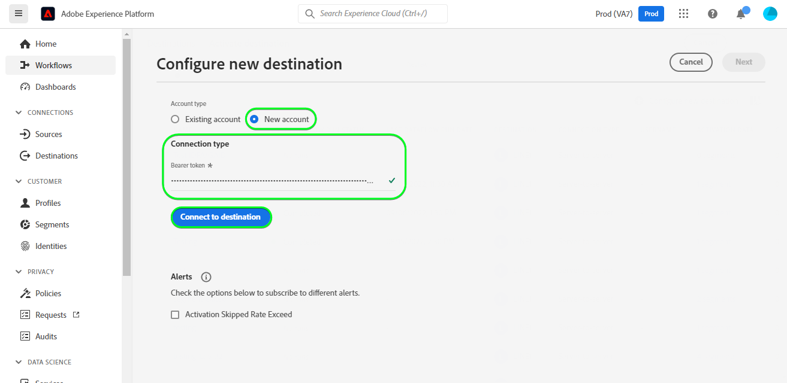

# [!DNL LINE] 接続

## 概要 {#overview}

[[!DNL LINE]](https://line.me/en/) は、人、サービス、情報を結び付け、チャットアプリからエンターテインメント、ソーシャル、日々のアクティビティのハブに成長した、人気のあるコミュニケーションプラットフォームです。

この [!DNL Adobe Experience Platform] [宛先](/help/destinations/home.md) は [[!DNL LINE] メッセージング API](https://developers.line.biz/en/reference/messaging-api/). 内で、接続としてExperience Platformセグメントからプロファイルをアクティブ化できます [!DNL LINE] ビジネスニーズに合わせて

[!DNL LINE] は、Bearer トークンを認証メカニズムとして使用し、 [!DNL LINE] メッセージング API への認証手順 [!DNL LINE] インスタンスは下、内 [宛先に対する認証](#authenticate) 」セクションに入力します。

## ユースケース {#use-cases}

マーケターは、セグメントを組み込んで、モバイルエンゲージメントの宛先でユーザーをターゲット設定できます [!DNL Adobe Experience Platform]. さらに、エクスペリエンスの属性に基づいて、パーソナライズされたエクスペリエンスを配信できます [!DNL Adobe Experience Platform] プロファイル：セグメントとプロファイルが [!DNL Adobe Experience Platform].

## 前提条件 {#prerequisites}

### [!DNL LINE] 前提条件 {#prerequisites-destination}

次の前提条件に注意してください。 [!DNL LINE]を使用して、Platform からにデータを書き出す [!DNL LINE] アカウント：

#### 次の条件を満たすには、 [!DNL LINE] アカウント {#prerequisites-account}

次に移動： [!DNL LINE] [登録](https://account.line.biz/signup) アカウントを登録および作成するページ（まだ存在しない場合）。

#### の収集 [!DNL LINE channel access token (long-lived)] から [!DNL LINE] 開発者コンソール {#gather-credentials}

Platform がにアクセスできるようにするには、以下を実行します。 [!DNL LINE] リソース、 *[!DNL Channel access token (long-lived)]* 望みの [!DNL LINE] *メッセージング API* チャネル。

1. 次を使用してログイン： [!DNL LINE] アカウント [[!DNL LINE] 開発者コンソール](https://developers.line.biz/console).
1. 次に、 *[!DNL Providers]* リストを開き、 *[!DNL Provider]* 興味を持って最後に選択する *メッセージング API* チャネルを開き、設定にアクセスします。 初めてデベロッパーコンソールにアクセスする場合は、 [[!DNL LINE] ドキュメント](https://developers.line.biz/en/docs/messaging-api/getting-started/) をクリックして、プロバイダーの作成に必要な手順を完了します。
1. 最後に、 ***[!DNL Channel access token]*** セクションを開き、 ***[!DNL Channel access token (long-lived)]*** 内で必要な値 [宛先に対する認証](#authenticate) 手順

| 認証情報 | 説明 | 例 |
| --- | --- | --- |
| `[!DNL Channel access token (long-lived)]` | お使いの「[!DNL LINE Channel access token (long-lived)]」。 | `aaa2112XSMWqLXR7..........nyilFU=` |

詳しくは、 [[!DNL LINE] ドキュメント](https://developers.line.biz/en/docs/messaging-api/getting-started/) チャネルの作成や、既存のチャネルへのチャネルの追加に関するガイダンス [!DNL LINE] を通じて説明する [!DNL LINE] 開発者コンソール。

## サポートされる ID {#supported-identities}

[!DNL LINE] では、次の表で説明する id の更新と書き出しをサポートしています。 詳細情報： [id](/help/identity-service/namespaces.md).

| ターゲット ID | 説明 |
|---|---|
| 広告主 (IFA) の ID | ソース ID が IFA の場合に、広告主 (IFA) のターゲット ID を選択します *(Apple ID for Advertisers)* または GAID *(Google Advertising ID) 名前空間。 |
| LINE ユーザー ID | ソース ID が LINE ユーザー ID の場合は、ユーザー ID ターゲット ID を選択します。 |

## エクスポートのタイプと頻度 {#export-type-frequency}

宛先の書き出しのタイプと頻度について詳しくは、次の表を参照してください。

| 項目 | タイプ | 備考 |
---------|----------|---------|
| 書き出しタイプ | **[!UICONTROL プロファイルベース]** | セグメント（オーディエンス）のすべてのメンバーを、 [!DNL LINE] 宛先。 |
| 書き出し頻度 | **[!UICONTROL ストリーミング]** | ストリーミングの宛先は、API ベースの接続です。 セグメント評価に基づいてExperience Platform内でプロファイルが更新されるとすぐに、コネクタは更新を宛先プラットフォームに送信します。 詳細を表示 [ストリーミング先](/help/destinations/destination-types.md#streaming-destinations). |

{style=&quot;table-layout:auto&quot;}

## 宛先への接続 {#connect}

>[!IMPORTANT]
>
>宛先に接続するには、 **[!UICONTROL 宛先の管理]** [アクセス制御権限](/help/access-control/home.md#permissions). 詳しくは、 [アクセス制御の概要](/help/access-control/ui/overview.md) または製品管理者に問い合わせて、必要な権限を取得してください。

この宛先に接続するには、[宛先設定のチュートリアル](../../ui/connect-destination.md)の手順に従ってください。宛先の設定ワークフローで、以下の 2 つのセクションに記載されているフィールドに入力します。

内 **[!UICONTROL 宛先]** > **[!UICONTROL カタログ]** 検索 [!DNL LINE]. または、 **[!UICONTROL モバイルエンゲージメント]** カテゴリ。

### 宛先に対する認証 {#authenticate}

宛先を認証するには、「 」を選択します。 **[!UICONTROL 宛先に接続]**.

以下の必須フィールドに入力します。
* **[!UICONTROL Bearer トークン]**:お使いの [!DNL LINE Channel access token (long-lived)] から [!DNL LINE] 開発者コンソール。 詳しくは、 [資格情報を収集](#gather-credentials) 」セクションに入力します。

指定した詳細が有効な場合、UI に **[!UICONTROL 接続済み]** ステータスに緑色のチェックマークが付きます。 その後、次の手順に進むことができます。

### 宛先の詳細を入力 {#destination-details}

宛先の詳細を設定するには、以下の必須フィールドとオプションフィールドに入力します。 UI でフィールドの横にアスタリスクが表示される場合は、そのフィールドが必須であることを示します。

* **[!UICONTROL 名前]**:将来この宛先を認識するための名前。
* **[!UICONTROL 説明]**:今後この宛先を識別するのに役立つ説明。
* **[!UICONTROL オーディエンスタイプ]**:選択 **[!UICONTROL 広告主 (IFA) の ID]** 書き出す id のタイプがの場合 *広告主 (IFA) の ID*. 選択 **[!UICONTROL LINE ユーザー ID]** 書き出す id のタイプがの場合 *LINE ユーザー ID*. 詳しくは、 [サポートされる ID](#supported-identities) 「 」セクションを参照してください。

### アラートの有効化 {#enable-alerts}

アラートを有効にして、宛先へのデータフローのステータスに関する通知を受け取ることができます。 リストからアラートを選択して、データフローのステータスに関する通知を受け取るよう登録します。アラートの詳細については、 [UI を使用した宛先アラートの購読](../../ui/alerts.md).

宛先接続の詳細の指定が完了したら、 **[!UICONTROL 次へ]**.

## この宛先に対してセグメントをアクティブ化 {#activate}

>[!IMPORTANT]
>
>データをアクティブ化するには、 **[!UICONTROL 宛先の管理]**, **[!UICONTROL 宛先のアクティブ化]**, **[!UICONTROL プロファイルの表示]**、および **[!UICONTROL セグメントを表示]** [アクセス制御権限](/help/access-control/home.md#permissions). 詳しくは、 [アクセス制御の概要](/help/access-control/ui/overview.md) または製品管理者に問い合わせて、必要な権限を取得してください。

読み取り [ストリーミングセグメントの書き出し先に対するプロファイルとセグメントのアクティブ化](/help/destinations/ui/activate-segment-streaming-destinations.md) を参照してください。

### 属性と ID のマッピング {#map}

Adobe Experience Platformからにオーディエンスデータを正しく送信するには [!DNL LINE] の宛先に移動する場合は、フィールドマッピングの手順を実行する必要があります。 マッピングは、Platform アカウント内の Experience Data Model(XDM) スキーマフィールドと、ターゲット宛先から対応する同等のスキーマフィールドとの間にリンクを作成することで構成されます。 XDM フィールドを [!DNL LINE] 宛先フィールドは、次の手順に従います。

ソース ID に応じて、次のターゲット ID 名前空間をマッピングする必要があります。 |ターゲット ID |ソースフィールド |ターゲットフィールド | | — | — | — | |広告主 (IFA) の ID | `IDFA` または `GAID` | `LineId` | | LINE ユーザー ID | `UserID` | `LineId` |

ターゲット ID が *LINE ユーザー ID* 以下が必要です。

ターゲット ID が *広告主 (IFA) の ID* 以下が必要です。

## データの書き出しを検証する {#exported-data}

データのエクスポートが正常にExperience Platformされると、 [!DNL LINE] 宛先が以下の範囲内に新しいオーディエンスを作成 [!DNL LINE] 選択したセグメント名を使用します。

宛先が正しく設定されていることを検証するには、次の手順に従います。

1. In [!DNL LINE]、にログインします。 [マネージャコンソール](https://manager.line.biz/).

1. 次に、に移動します。 **[!UICONTROL データ制御]** > **[!UICONTROL オーディエンス]** をクリックし、 **[!UICONTROL オーディエンス名]** 列。

1. 更新されたボリュームは、セグメント内のカウントと一致します。

1. この *タイプ* 列に記載されている **[!UICONTROL UserID]** 書き出した id のタイプがの場合 *UserID*. 同様に、 *タイプ* 列に記載されている **[!UICONTROL モバイル広告 ID]** 書き出した id のタイプがの場合 *IDFA*.

内の設定例 [!DNL LINE] は次のように表示されます。

## データの使用とガバナンス {#data-usage-governance}

[!DNL Adobe Experience Platform] のすべての宛先は、データを処理する際のデータ使用ポリシーに準拠しています。詳しくは、 [!DNL Adobe Experience Platform] データガバナンスを強制します。詳しくは、 [データガバナンスの概要](/help/data-governance/home.md).