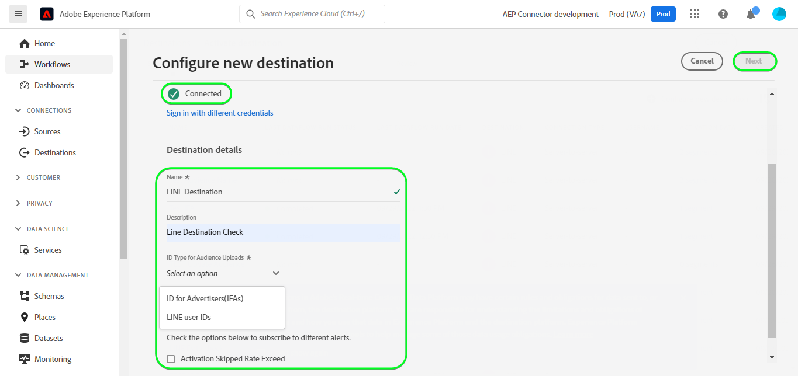

# [!DNL LINE] 接続

## 概要 {#overview}

[[!DNL LINE]](https://line.me/en/) は、人物、サービス、情報をつなぎ、チャットアプリからエンターテイメント、ソーシャル、日々のアクティビティのハブに成長した人気のコミュニケーションプラットフォームです。

この [!DNL Adobe Experience Platform][&#x200B; 宛先 &#x200B;](/help/destinations/home.md) は、[[!DNL LINE] Messaging API](https://developers.line.biz/en/reference/messaging-api/) を活用します。 ビジネスニーズに合わせて、Experience Platform オーディエンス内の接続としてプロファイル [!DNL LINE] アクティブ化できます。

[!DNL LINE] は、[!DNL LINE] Messaging API と通信するための認証メカニズムとして Bearer トークンを使用します。 [!DNL LINE] インスタンスを認証する手順は、さらに下の [&#x200B; 宛先に対する認証 &#x200B;](#authenticate) の節にあります。

## ユースケース {#use-cases}

マーケターの場合、組み込みのオーディエンスを使用して、モバイルエンゲージメントの宛先のユーザーをターゲットに設定で [!DNL Adobe Experience Platform] ます。 さらに、[!DNL Adobe Experience Platform] でオーディエンスとプロファイルが更新されるとすぐに、[!DNL Adobe Experience Platform] プロファイルの属性に基づいてパーソナライズされたエクスペリエンスを提供できます。

## 前提条件 {#prerequisites}

### [!DNL LINE] 前提条件 {#prerequisites-destination}

Experience Platformから [!DNL LINE] アカウントにデータを書き出すには、[!DNL LINE] で次の前提条件に注意してください。

#### [!DNL LINE] アカウントが必要です {#prerequisites-account}

[!DNL LINE] アカウントをまだお持ちでない場合は、登録して作成する必要があります。 アカウントを作成するには：

1. [!DNL LINE] [acount login](https://account.line.biz/login?redirectUri=https%3A%2F%2Fmanager.line.biz%2F) ページに移動します。
2. **[!UICONTROL アカウントを作成]** を選択します。

#### [!DNL LINE] Developer Console からの [!DNL LINE channel access token (long-lived)] の収集 {#gather-credentials}

Experience Platformが [!DNL LINE] リソースにアクセスできるようにするには、目的の [!DNL LINE] *Messaging API* チャネルからの *[!DNL Channel access token (long-lived)]* が必要です。

1. [!DNL LINE] アカウントで [[!DNL LINE]  開発者コンソール &#x200B;](https://developers.line.biz/console) にログインします。
1. 次に、*[!DNL Providers]* リストにアクセスして、目的の *[!DNL Provider]* を選択し、最後に *Messaging API* チャネルを選択して、その設定にアクセスします。 初めて Developer Console にアクセスする場合は、[[!DNL LINE]  ドキュメント &#x200B;](https://developers.line.biz/en/docs/messaging-api/getting-started/) に従って、プロバイダーの作成に必要な手順を完了してください。
1. 最後に、「***[!DNL Channel access token]***」セクションに移動し、[&#x200B; 宛先に対する認証 &#x200B;](#authenticate) 手順で必要な ***[!DNL Channel access token (long-lived)]*** の値をコピーします。

| 資格情報 | 説明 | 例 |
| --- | --- | --- |
| `[!DNL Channel access token (long-lived)]` | あなたの [!DNL LINE Channel access token (long-lived)]。 | `aaa2112XSMWqLXR7..........nyilFU=` |

[!DNL LINE] Developers コンソールを使用してチャネルを作成したり、既存の [!DNL LINE] アカウントにチャネルを追加したりする方法のガイダンスについては、[[!DNL LINE]  ドキュメント &#x200B;](https://developers.line.biz/en/docs/messaging-api/getting-started/) を参照してください。

## サポートされている ID {#supported-identities}

[!DNL LINE] では、以下の表で説明する ID の更新および書き出しをサポートしています。 [ID](/help/identity-service/features/namespaces.md) についての詳細情報。

| ターゲット ID | 説明 |
|---|---|
| 広告主（IFA）の ID | ソース ID が IFA *（Google ID for Advertisers）または GAID *（Apple Advertising ID）名前空間の場合* 広告主（IFA）ターゲット ID を選択します。 |
| LINE ユーザー ID | ソース ID が LINE ユーザー ID の場合は、ユーザー ID ターゲット ID を選択します。 |

## 書き出しのタイプと頻度 {#export-type-frequency}

宛先の書き出しのタイプと頻度について詳しくは、以下の表を参照してください。

| 項目 | タイプ | メモ |
---------|----------|---------|
| 書き出しタイプ | **[!UICONTROL プロファイルベース]** | [!DNL LINE] 宛先で使用される識別子（氏名、電話番号など）を使用して、オーディエンスのすべてのメンバーを書き出します。 |
| 書き出し頻度 | **[!UICONTROL ストリーミング]** | ストリーミングの宛先は常に、API ベースの接続です。オーディエンス評価に基づいて Experience Platform 内でプロファイルが更新されるとすぐに、コネクタは更新を宛先プラットフォームに送信します。詳しくは、[ストリーミングの宛先](/help/destinations/destination-types.md#streaming-destinations)を参照してください。 |

{style="table-layout:auto"}

## 宛先への接続 {#connect}

>[!IMPORTANT]
>
>宛先に接続するには、**[!UICONTROL 宛先の表示]** および **[!UICONTROL 宛先の管理]**&#x200B;[&#x200B; アクセス制御権限 &#x200B;](/help/access-control/home.md#permissions) が必要です。 詳しくは、[アクセス制御の概要](/help/access-control/ui/overview.md)または製品管理者に問い合わせて、必要な権限を取得してください。

この宛先に接続するには、[宛先設定のチュートリアル](../../ui/connect-destination.md)の手順に従ってください。宛先の設定ワークフローで、以下の 2 つのセクションにリストされているフィールドに入力します。

**[!UICONTROL 宛先]**／**[!UICONTROL カタログ]**&#x200B;内で [!DNL LINE] を検索します。または、**[!UICONTROL モバイルエンゲージメント]** カテゴリの下に配置することもできます。

### 宛先に対する認証 {#authenticate}

宛先を認証するには、「 **[!UICONTROL 宛先に接続]**」を選択します。

以下の必須フィールドに入力します。
* **[!UICONTROL ベアラートークン]**:[!DNL LINE] 開発者コンソールからの [!DNL LINE Channel access token (long-lived)]。 [&#x200B; 資格情報の収集 &#x200B;](#gather-credentials) の節を参照してください。

指定した詳細が有効な場合、UI で&#x200B;**[!UICONTROL 接続済み]**&#x200B;ステータスに緑色のチェックマークが付きます。その後、次の手順に進むことができます。

### 宛先の詳細を入力 {#destination-details}

宛先の詳細を設定するには、以下の必須フィールドとオプションフィールドに入力します。UI のフィールドの横にアスタリスクが表示される場合は、そのフィールドが必須であることを示します。

* **[!UICONTROL 名前]**：今後この宛先を認識するための名前。
* **[!UICONTROL 説明]**：今後この宛先を識別するのに役立つ説明。
* **[!UICONTROL オーディエンスタイプ]**：書き出しを探している ID のタイプが **&#x200B;**&#x200B;広告主（IFA）の ID *である場合は、* 「広告主の ID」を選択します。 書き出す ID のタイプが **[!UICONTROL LINE ユーザー ID]** の場合は、「*LINE ユーザー ID*」を選択します。 ID タイプについて詳しくは、[&#x200B; サポートされている ID](#supported-identities) の節を参照してください。

### アラートの有効化 {#enable-alerts}

アラートを有効にすると、宛先へのデータフローのステータスに関する通知を受け取ることができます。リストからアラートを選択して、データフローのステータスに関する通知を受け取るよう登録します。アラートについて詳しくは、[UI を使用した宛先アラートの購読](../../ui/alerts.md)についてのガイドを参照してください。

宛先接続の詳細の入力を終えたら「**[!UICONTROL 次へ]**」を選択します。

## この宛先に対してオーディエンスをアクティブ化 {#activate}

>[!IMPORTANT]
> 
>* データをアクティブ化するには、**[!UICONTROL 宛先の表示]**、**[!UICONTROL 宛先のアクティブ化]**、**[!UICONTROL プロファイルの表示]** および **[!UICONTROL セグメントの表示]**&#x200B;[&#x200B; アクセス制御権限 &#x200B;](/help/access-control/home.md#permissions) が必要です。 [アクセス制御の概要](/help/access-control/ui/overview.md)を参照するか、製品管理者に問い合わせて必要な権限を取得してください。
>* *ID* を書き出すには、**[!UICONTROL ID グラフの表示]**&#x200B;[&#x200B; アクセス制御権限 &#x200B;](/help/access-control/home.md#permissions) が必要です。  {width="100" zoomable="yes"}

この宛先にオーディエンスをアクティベートする手順は、[ストリーミングオーディエンスの書き出し宛先へのプロファイルとオーディエンスのアクティベート](/help/destinations/ui/activate-segment-streaming-destinations.md)を参照してください。

### 属性と ID のマッピング {#map}

Adobe Experience Platform から [!DNL LINE] 宛先にオーディエンスデータを正しく送信するには、フィールドマッピングの手順を実行する必要があります。マッピングは、Experience Platform アカウント内の Experience Data Model （XDM）スキーマフィールドと、ターゲット宛先から対応する同等のスキーマフィールドとの間にリンクを作成して構成されます。 XDM フィールドを [!DNL LINE] 宛先フィールドに正しくマッピングするには、次の手順に従います。

ソース ID に応じて、次のターゲット ID 名前空間をマッピングする必要があります。

| ターゲット ID | ソースフィールド | ターゲットフィールド |
| --- | --- | --- |
| 広告主（IFA）の ID | `IDFA` または `GAID` | `LineId` |
| LINE ユーザー ID | `UserID` | `LineId` |

ターゲット ID が *LINE ユーザー ID* の場合は、以下が必要です。

ターゲット ID が *広告主（IFA）の ID）の場合は* 以下が必要になります。

## データの書き出しを検証する {#exported-data}

Experience Platformからデータが正常に書き出されると、[!DNL LINE] の宛先は、選択されたオーディエンス名を使用して [!DNL LINE] 内に新しいオーディエンスを作成します。

宛先が正しく設定されていることを検証するには、次の手順に従います。

1. [!DNL LINE] で、[Manager コンソール &#x200B;](https://manager.line.biz/) にログインします。

1. 次に、**[!UICONTROL データコントロール]**/**[!UICONTROL オーディエンス]** に移動し、**[!UICONTROL オーディエンス名]** 列内で、選択したオーディエンスに一致する名前を確認します。

1. 更新されたボリュームは、セグメント内のカウントと一致します。

1. 書き出した ID のタイプが **[!UICONTROL UserID]** の場合、*タイプ* 列には *UserID* が表示されます。 同様に、書き出した ID のタイプが **[!UICONTROL IDFA]** の場合、*タイプ* 列には *モバイル広告 ID* が表示されます。

[!DNL LINE] 内の設定例を次に示します。

## データの使用とガバナンス {#data-usage-governance}

[!DNL Adobe Experience Platform] のすべての宛先は、データを処理する際のデータ使用ポリシーに準拠しています。[!DNL Adobe Experience Platform] がどのようにデータガバナンスを実施するかについて詳しくは、[データガバナンスの概要](/help/data-governance/home.md)を参照してください。
