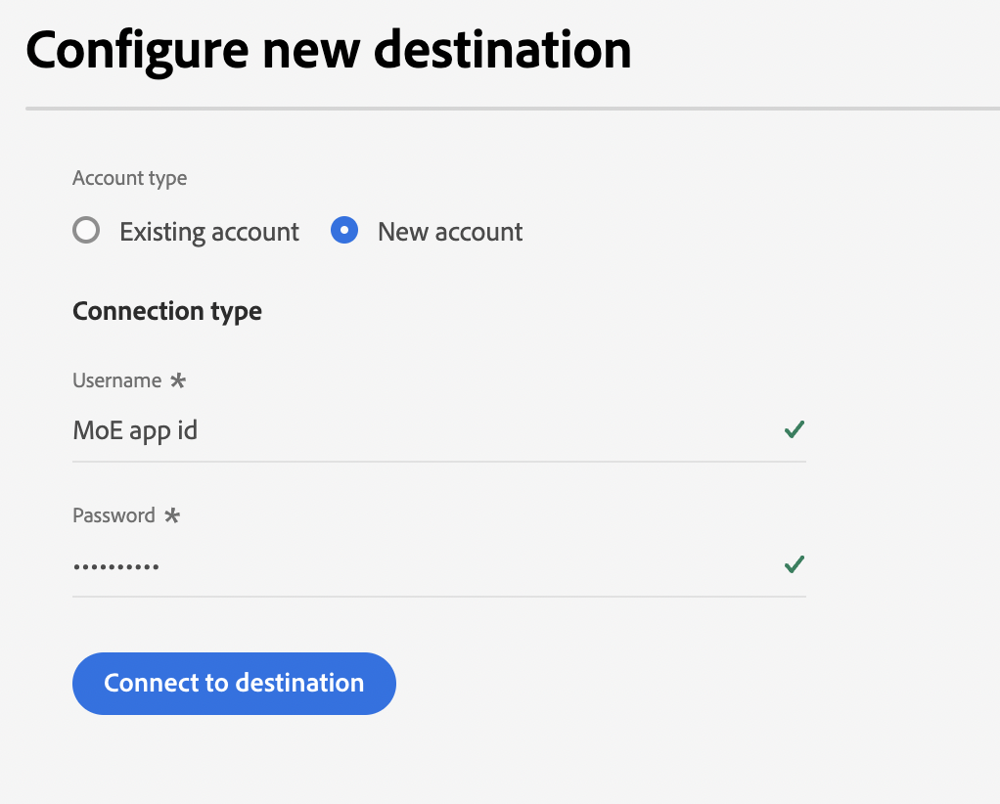
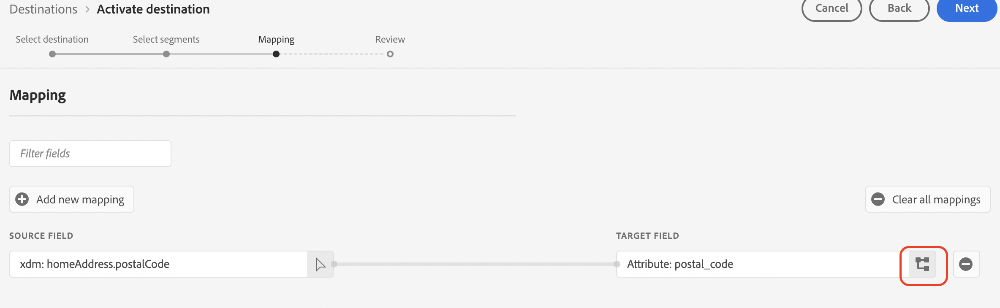
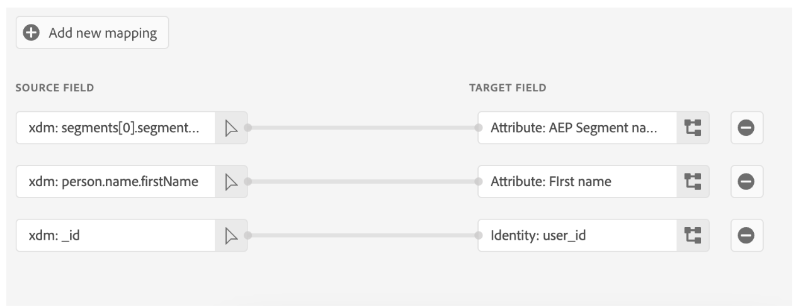
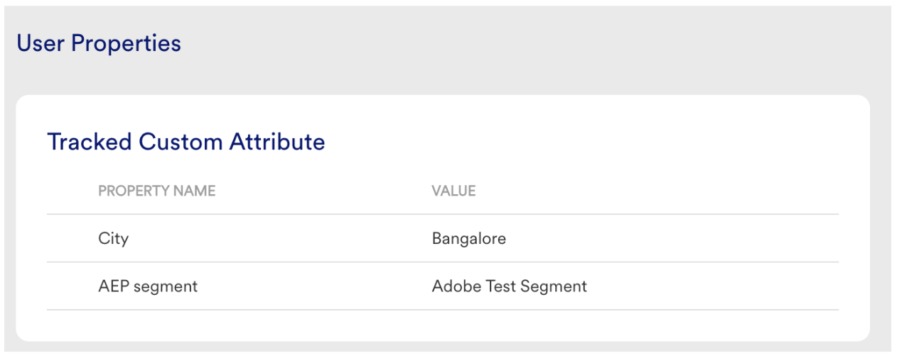

# [!DNL Moengage] 接続

## 概要 {#overview}

以下を使用します。 [!DNL Moengage] 宛先を使用して、Adobeデータ（ユーザー属性、セグメントおよびイベント）を MoEngage にリアルタイムで接続およびマッピングします。 その後、顧客はこのデータに基づいて行動し、パーソナライズされたターゲット設定されたエクスペリエンスを提供できます。

Adobeにより、統合は非常にシンプルで直感的です。 任意のAdobeユーザープロファイルを取得し、MoEngage ユーザー属性にマッピングするだけです。

>[!IMPORTANT]
>
>この宛先コネクタとドキュメントページは、 *Moengage* チーム。 お問い合わせや更新のリクエストについては、*`[amc-support@amazon.com](https://help.moengage.com/hc/en-us)`まで直接ご連絡ください。*

## ユースケース {#use-cases}

マーケターは、を介して (Adobe Experience Platformに組み込まれた ) ユーザーセグメントをターゲティングしたいと考えています。 [!DNL Moengage] キャンペーン。 また、Adobe Experience Platformプロファイルの属性に基づいてキャンペーンのコンテンツをパーソナライズする必要があります。 この統合により、Adobe Experience Platformでセグメントとプロファイルが更新されると、ユーザーと属性がすぐに MoEngage で更新されます。

## 前提条件 {#prerequisites}

にAdobe Experience Platformデータを送信する前に [!DNL Moengage]に設定する場合は、次の前提条件に注意します。

* Adobe Experience Platformで MoEngage の宛先を使用するには、最初にユーザーが、 [!DNL Moengage] アカウント。 MoEngage アカウントに登録またはログインするには、次のページにアクセスしてください。 https://app.moengage.com

## サポートされる ID {#supported-identities}

[!DNL Moengage] では、以下の表で説明する ID のアクティベーションをサポートしています。

| ターゲット ID | 説明 | 注意点 |
|---|------------------------------------------------------------------------------------------|----------------------------------------------------------------------------------------|
| user_id | 内のユーザープロファイルを一意に識別する一意の識別子 [!DNL Moengage] システム。 | この識別子は文字列タイプをサポートします。 user_id または anonymous_id のいずれかが必要です |
| anonymous_id | 不明なユーザープロファイルの別の識別子 — システムに存在しないプロファイルを表します。 | この識別子は文字列タイプをサポートします。 user_id または anonymous_id のいずれかが必要です |

{style="table-layout:auto"}

## 書き出しのタイプと頻度 {#export-type-frequency}

宛先の書き出しのタイプと頻度について詳しくは、以下の表を参照してください。

| 項目 | タイプ | メモ |
---------|----------|------------------------------------------------------------------------------------------------------------------------------------------------------------------------------------------------------------------------------------------------------------------------------------------------------------------------------------|
| 書き出しタイプ | **[!UICONTROL プロファイルベース]** | セグメント（オーディエンス）のすべてのメンバーを、識別子 (user_id、anonymous_id) と共に、に書き出した際に定義したカスタム属性と共に書き出します。 [!DNL Moengage]. |
| 書き出し頻度 | **[!UICONTROL ストリーミング]** | ストリーミングの宛先は常に、API ベースの接続です。セグメント評価に基づいて Experience Platform 内でプロファイルが更新されるとすぐに、コネクタは更新を宛先プラットフォームに送信します。詳しくは、[ストリーミングの宛先](/help/destinations/destination-types.md#streaming-destinations)を参照してください。 |

{style="table-layout:auto"}

## 宛先への接続 {#connect}

>[!IMPORTANT]
> 
>宛先に接続するには、**[!UICONTROL 宛先の管理]** [アクセス制御権限](/help/access-control/home.md#permissions)が必要です。詳しくは、[アクセス制御の概要](/help/access-control/ui/overview.md)または製品管理者に問い合わせて、必要な権限を取得してください。

この宛先に接続するには、[宛先設定のチュートリアル](../../ui/connect-destination.md)の手順に従ってください。宛先の設定ワークフローで、以下の 2 つのセクションにリストされているフィールドに入力します。

### 宛先に対する認証 {#authenticate}

宛先に対して認証するには、必須フィールドに入力し、「**[!UICONTROL 宛先に接続]**」を選択します。

### 宛先の詳細を入力 {#destination-details}

宛先の詳細を設定するには、以下の必須フィールドとオプションフィールドに入力します。UI のフィールドの横にアスタリスクが表示される場合は、そのフィールドが必須であることを示します。

* **[!UICONTROL ユーザー名]**：の設定ページのデータアプリ ID [!DNL Moengage] ダッシュボード。
* **[!UICONTROL パスワード]**：の設定ページのデータアプリキー [!DNL Moengage] ダッシュボード。

* **[!UICONTROL 名前]**：今後この宛先を認識するための名前。
* **[!UICONTROL 説明]**：今後この宛先を識別するのに役立つ説明。
* **[!UICONTROL 地域]**：アプリ *データセンター*.

### アラートの有効化 {#enable-alerts}

アラートを有効にすると、宛先へのデータフローのステータスに関する通知を受け取ることができます。リストからアラートを選択して、データフローのステータスに関する通知を受け取るよう登録します。アラートについて詳しくは、[UI を使用した宛先アラートの購読](../../ui/alerts.md)についてのガイドを参照してください。

宛先接続の詳細の入力を終えたら「**[!UICONTROL 次へ]**」を選択します。

## この宛先に対してセグメントをアクティブ化 {#activate}

>[!IMPORTANT]
> 
>データをアクティブ化するには、**[!UICONTROL 宛先の管理]**、**[!UICONTROL 宛先のアクティブ化]**、**[!UICONTROL プロファイルの表示]**&#x200B;および&#x200B;**[!UICONTROL セグメントの表示]**[に対するアクセス制御権限](/help/access-control/home.md#permissions)が必要です。詳しくは、[アクセス制御の概要](/help/access-control/ui/overview.md)または製品管理者に問い合わせて、必要な権限を取得してください。

この宛先にオーディエンスセグメントをアクティブ化する手順は、[ストリーミングセグメント書き出し宛先に対するオーディエンスデータのアクティブ化](../../ui/activate-segment-streaming-destinations.md)を参照してください。

### 属性と ID のマッピング {#map}

オーディエンスデータを次の場所から正しく送信するには： [!DNL Adobe Experience Platform] から [!DNL Moengage] の宛先に移動する場合は、フィールドマッピングの手順を実行する必要があります。

マッピングは、 [!DNL Experience Data Model] (XDM) スキーマフィールド ( [!DNL Platform] アカウントおよびターゲット宛先からの対応する同等物。

XDM フィールドを [!DNL Moengage] 宛先フィールドに正しくマッピングするには、次の手順に従います。

Adobe Analytics の [!UICONTROL マッピング] ステップ、選択 **[!UICONTROL チェックボックス]**.

[!UICONTROL マッピング]手順で、「**[!UICONTROL 新しいマッピングを追加]**」を選択します。

Adobe Analytics の [!UICONTROL ソースフィールド] 「 」セクションで、空のフィールドの横にある矢印ボタンを選択します。

Adobe Analytics の [!UICONTROL ソースフィールドを選択] ウィンドウで、次の 2 つのカテゴリの XDM フィールドを選択できます。
* [!UICONTROL 属性を選択]：このオプションを使用して、XDM スキーマの特定のフィールドをにマッピングします。 [!DNL Moengage] 属性。

ソースフィールドを選択し、「 」を選択します。 **[!UICONTROL 選択]**.

Adobe Analytics の [!UICONTROL ターゲットフィールド] 「 」セクションで、「 」フィールドの右側にあるマッピングアイコンを選択します。

Adobe Analytics の [!UICONTROL ターゲットフィールドを選択] ウィンドウで、次の 2 つのカテゴリのターゲットフィールドを選択できます。
* [!UICONTROL ID 名前空間を選択]：このオプションを使用して、マッピングします。 [!DNL Platform] ID 名前空間への変換 [!DNL Moengage] ID 名前空間。
* [!UICONTROL カスタム属性を選択]：このオプションを使用して、XDM 属性をカスタムにマッピングします [!DNL Moengage] 属性 [!DNL Moengage] アカウント。   また、このオプションを使用して、既存の XDM 属性の名前を [!DNL Moengage]. 例えば、 `lastName` カスタムの XDM 属性 `Last_Name` 属性 [!DNL Moengage]、を作成します。 `Last_Name` 属性 [!DNL Moengage]（まだ存在しない場合）、および `lastName` XDM 属性を含めています。

ターゲットフィールドを選択し、「 」を選択します。 **[!UICONTROL 選択]**.

これで、リストにフィールドマッピングが表示されます。

さらにマッピングを追加するには、上記の手順を繰り返します。

## 書き出されたデータ／データ書き出しの検証 {#exported-data}

データがに正常に書き出されたかどうかを確認するには、以下を実行します。 [!DNL Moengage] の宛先に移動するには、 [!DNL Moengage] アカウント。 AEP セグメントと呼ばれるユーザー属性が表示されます。

## データの使用とガバナンス {#data-usage-governance}

[!DNL Adobe Experience Platform] のすべての宛先は、データを処理する際のデータ使用ポリシーに準拠しています。[!DNL Adobe Experience Platform] がどのように データガバナンスを実施するかについて詳しくは、[データガバナンスの概要](/help/data-governance/home.md)を参照してください。

