# [!DNL Moengage] 接続

## 概要 {#overview}

[!DNL Moengage]の宛先を使用して、Adobe データ（ユーザー属性、セグメント、イベント）をリアルタイムでMoEngageに接続してマッピングします。 顧客はこのデータにもとづいて行動し、パーソナライズされたエクスペリエンスを提供できます。

Adobeは、シンプルで直観的な操作で連携できます。 任意のAdobeユーザープロファイルを取得し、MoEngage ユーザー属性にマッピングします。

>[!IMPORTANT]
>
>この宛先コネクタとドキュメント ページは、*Moengage* チームによって作成および管理されています。 問い合わせや更新のリクエストについては、*`https://help.moengage.com/hc/en-us`.*&#x200B;から直接連絡してください。

## ユースケース {#use-cases}

マーケターは、[!DNL Adobe Experience Platform]件のキャンペーンを通じて、（[!DNL Moengage]に組み込まれた）ユーザーセグメントをターゲットにしたい。 また、[!DNL Adobe Experience Platform]人のプロファイルの属性に基づいて、キャンペーンコンテンツをパーソナライズすることもできます。 この統合により、セグメントとプロファイルが[!DNL Adobe Experience Platform]で更新されるとすぐに、MoEngageでユーザーと属性が更新されます。

## 前提条件 {#prerequisites}

[!DNL Adobe Experience Platform] データを[!DNL Moengage]に送信する前に、次の前提条件に注意してください。

* [!DNL Adobe Experience Platform]でMoEngageの宛先を使用するには、最初にユーザーが[!DNL Moengage] アカウントにアクセスできる必要があります。 MoEngage アカウントにサインアップまたはログインするには、次のページにアクセスしてください。https://app.moengage.com

## サポートされる ID {#supported-identities}

[!DNL Moengage] では、以下の表で説明する ID のアクティベーションをサポートしています。

| ターゲット ID | 説明 | 注意点 |
|---|------------------------------------------------------------------------------------------|----------------------------------------------------------------------------------------|
| user_id | [!DNL Moengage] システム内のユーザープロファイルを一意に識別する一意の識別子。 | この識別子は文字列型をサポートしています。 user_idまたはanonymous_idのいずれかが必要です |
| anonymous_id | 不明なユーザープロファイルの別の識別子 – システムに存在しないプロファイルを意味します。 | この識別子は文字列型をサポートしています。 user_idまたはanonymous_idのいずれかが必要です |

{style="table-layout:auto"}

## サポートされるオーディエンス {#supported-audiences}

この節では、この宛先に書き出すことができるオーディエンスのタイプについて説明します。

| オーディエンスの由来 | サポートあり | 説明 |
|---------|----------|----------|
| [!DNL Segmentation Service] | ○ | Experience Platform [ セグメント化サービス ](../../../segmentation/home.md)を通じて生成されたオーディエンス。 |
| その他すべてのオーディエンスの生成元 | × | このカテゴリには、[!DNL Segmentation Service]を通じて生成されたオーディエンス以外のすべてのオーディエンスのオリジンが含まれます。 [様々なオーディエンスの起源](/help/segmentation/ui/audience-portal.md#customize)について読みます。 次に例を示します。 <ul><li> カスタムアップロードオーディエンス [がCSV ファイルからExperience Platformに](../../../segmentation/ui/audience-portal.md#import-audience)をインポートしました。</li><li> 類似オーディエンス， </li><li> 連合オーディエンス， </li><li> [!DNL Adobe Journey Optimizer]などの他のExperience Platform アプリで生成されたオーディエンス </li><li> その他。 </li></ul> |

{style="table-layout:auto"}

オーディエンスのデータタイプ別にサポートされるオーディエンス：

| オーディエンスのデータタイプ | サポートあり | 説明 | ユースケース |
|--------------------|-----------|-------------|-----------|
| [人物オーディエンス ](/help/segmentation/types/people-audiences.md) | ○ | 顧客プロファイルにもとづいて、マーケティング施策の特定のグループをターゲットにすることができます。 | 買い物客やカートの放棄が多い |
| [ アカウントオーディエンス ](/help/segmentation/types/account-audiences.md) | × | アカウントベースドマーケティング戦略のために、特定の組織内の個人をターゲットにします。 | B2B マーケティング |
| [見込みオーディエンス ](/help/segmentation/types/prospect-audiences.md) | × | まだ顧客ではないが、ターゲットオーディエンスと特徴を共有する個人をターゲットにします。 | サードパーティデータによる見込み顧客の開拓 |
| [ データセットの書き出し](/help/catalog/datasets/overview.md) | × | [!DNL Adobe Experience Platform] データ レイクに保存されている構造化データのコレクション。 | レポート，データサイエンスワークフロー |

{style="table-layout:auto"}

## 書き出しのタイプと頻度 {#export-type-frequency}

宛先の書き出しのタイプと頻度について詳しくは、以下の表を参照してください。

| 項目 | タイプ | メモ |
|---------|----------|------------------------------------------------------------------------------------------------------------------------------------------------------------------------------------------------------------------------------------------------------------------------------------------------------------------------------------|
| 書き出しタイプ | **[!UICONTROL Profile-based]** | 識別子（user_id、anonymous_id）が付いたセグメント（オーディエンス）のすべてのメンバーと、書き出したカスタム属性を[!DNL Moengage]に書き出します。 |
| 書き出し頻度 | **[!UICONTROL Streaming]** | ストリーミングの宛先は常に、API ベースの接続です。セグメント評価に基づいて Experience Platform 内でプロファイルが更新されるとすぐに、コネクタは更新を宛先プラットフォームに送信します。詳しくは、[ストリーミングの宛先](/help/destinations/destination-types.md#streaming-destinations)を参照してください。 |

{style="table-layout:auto"}

## 宛先への接続 {#connect}

>[!IMPORTANT]
>
>宛先に接続するには、**[!UICONTROL View Destinations]**&#x200B;および&#x200B;**[!UICONTROL Manage Destinations]** [ アクセス制御権限](/help/access-control/home.md#permissions)が必要です。 詳しくは、[アクセス制御の概要](/help/access-control/ui/overview.md)または製品管理者に問い合わせて、必要な権限を取得してください。

この宛先に接続するには、[宛先設定のチュートリアル](../../ui/connect-destination.md)の手順に従ってください。宛先の設定ワークフローで、以下の 2 つのセクションにリストされているフィールドに入力します。

### 宛先に対する認証 {#authenticate}

宛先に対して認証を行うには、必須フィールドに入力し、**[!UICONTROL Connect to destination]**&#x200B;を選択します。

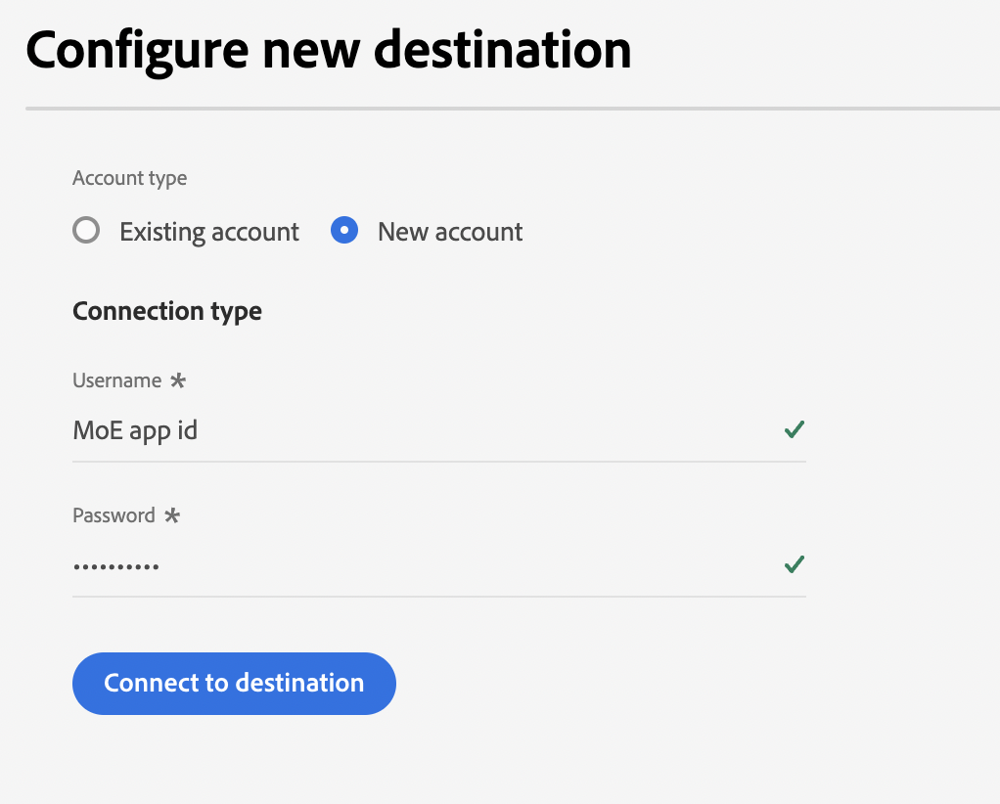

### 宛先の詳細を入力 {#destination-details}

宛先の詳細を設定するには、以下の必須フィールドとオプションフィールドに入力します。UI のフィールドの横にアスタリスクが表示される場合は、そのフィールドが必須であることを示します。
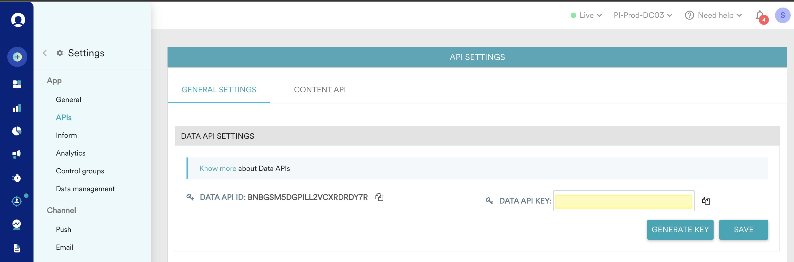

* **[!UICONTROL USERNAME]**: [!DNL Moengage] ダッシュボードの設定ページのDATA APP ID。
* **[!UICONTROL PASSWORD]**: [!DNL Moengage] ダッシュボードの設定ページのDATA APP KEY。

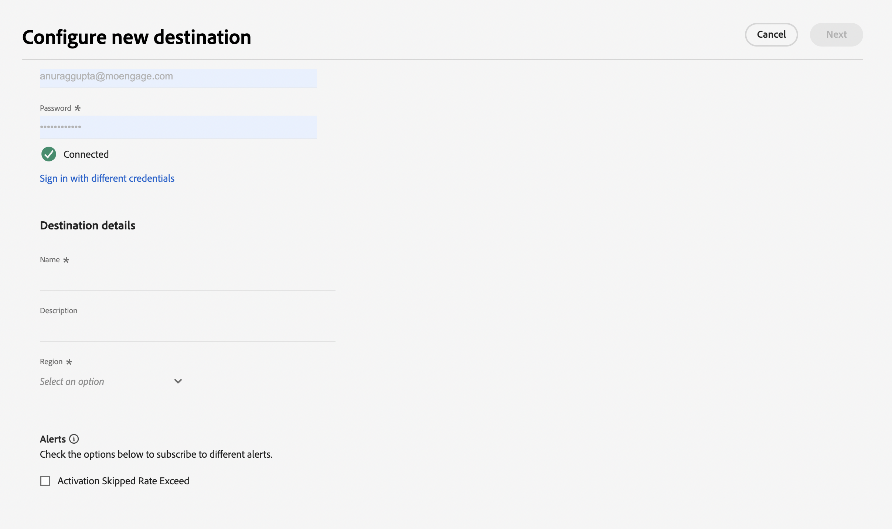

* **[!UICONTROL Name]**：今後この宛先を認識する際に使用する名前。
* **[!UICONTROL Description]**：今後この宛先を特定するのに役立つ説明です。
* **[!UICONTROL Region]**: アプリ *データセンター*。

### アラートの有効化 {#enable-alerts}

アラートを有効にすると、宛先へのデータフローのステータスに関する通知を受け取ることができます。リストからアラートを選択して、データフローのステータスに関する通知を受け取るよう登録します。アラートについて詳しくは、[UI を使用した宛先アラートの購読](../../ui/alerts.md)についてのガイドを参照してください。

宛先接続の詳細の提供が完了したら、**[!UICONTROL Next]**&#x200B;を選択します。

## この宛先に対してオーディエンスをアクティブ化 {#activate}

>[!IMPORTANT]
>
>データをアクティブ化するには、**[!UICONTROL View Destinations]**、**[!UICONTROL Activate Destinations]**、**[!UICONTROL View Profiles]**&#x200B;および&#x200B;**[!UICONTROL View Segments]** [ アクセス制御権限](/help/access-control/home.md#permissions)が必要です。 [アクセス制御の概要](/help/access-control/ui/overview.md)を参照するか、製品管理者に問い合わせて必要な権限を取得してください。

この宛先にオーディエンスセグメントをアクティブ化する手順は、[ストリーミングセグメント書き出し宛先に対するオーディエンスデータのアクティブ化](../../ui/activate-segment-streaming-destinations.md)を参照してください。

### 属性と ID のマッピング {#map}

オーディエンスデータを[!DNL Adobe Experience Platform]から[!DNL Moengage]宛先に正しく送信するには、フィールドマッピング手順を実行する必要があります。

マッピングは、[!DNL Experience Data Model] アカウントの[!DNL Experience Platform] （XDM） スキーマフィールドと、ターゲット宛先からの対応する同等のフィールドとの間にリンクを作成することで構成されます。

XDM フィールドを [!DNL Moengage] 宛先フィールドに正しくマッピングするには、次の手順に従います。

[!UICONTROL Mapping] ステップで、**[!UICONTROL Checkbox]**&#x200B;を選択します。

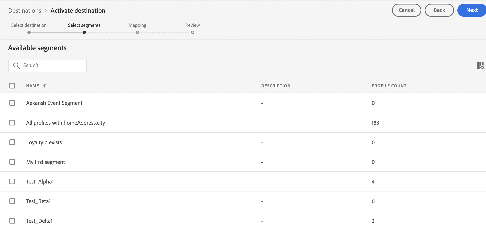

[!UICONTROL Mapping] ステップで、**[!UICONTROL Add new mapping]**&#x200B;を選択します。

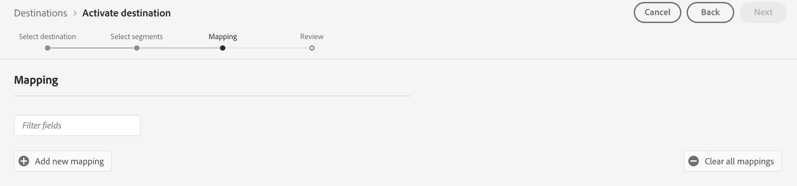

[!UICONTROL Source Field] セクションで、空のフィールドの横にある矢印ボタンを選択します。

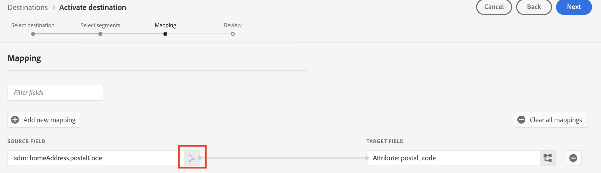

[!UICONTROL Select source field] ウィンドウでは、XDM フィールドの2つのカテゴリから選択できます。

* [!UICONTROL Select attributes]：このオプションを使用して、XDM スキーマから特定のフィールドを[!DNL Moengage]属性にマッピングします。

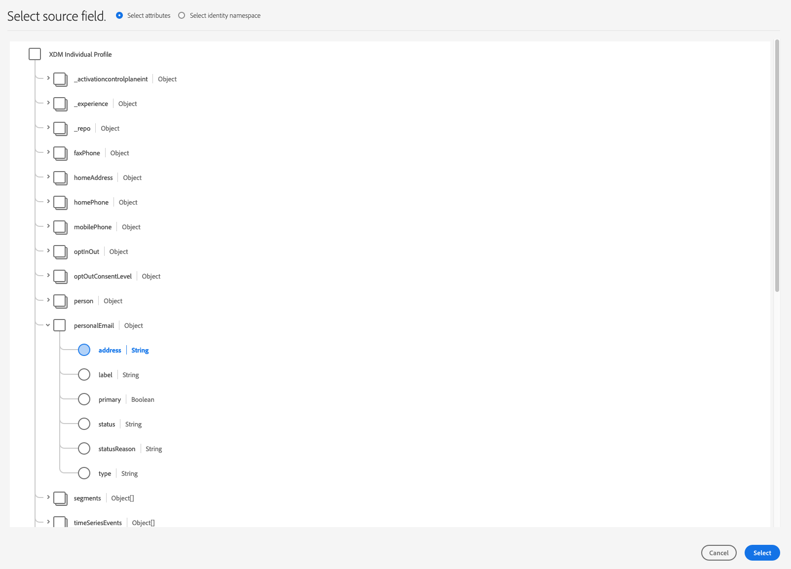

ソースフィールドを選択し、**[!UICONTROL Select]**&#x200B;を選択します。

[!UICONTROL Target Field] セクションで、フィールドの右側にあるマッピングアイコンを選択します。

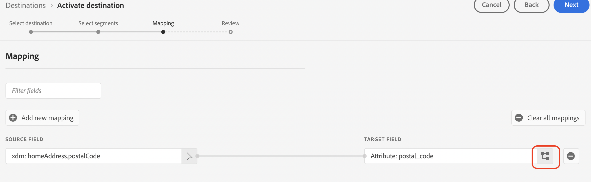

[!UICONTROL Select target field] ウィンドウでは、次の2つのカテゴリのターゲットフィールドから選択できます。

* [!UICONTROL Select identity namespace]：このオプションを使用して、[!DNL Experience Platform]個のID名前空間を[!DNL Moengage]個のID名前空間にマッピングします。
* [!UICONTROL Select custom attributes]：このオプションを使用して、XDM属性を[!DNL Moengage] アカウントで定義したカスタム [!DNL Moengage]属性にマッピングします。  このオプションを使用して、既存のXDM属性の名前を[!DNL Moengage]に変更することもできます。 例えば、`lastName` XDM属性を`Last_Name`のカスタム [!DNL Moengage]属性にマッピングすると、まだ存在しない場合は`Last_Name`に[!DNL Moengage]属性が作成され、`lastName` XDM属性がそれにマッピングされます。

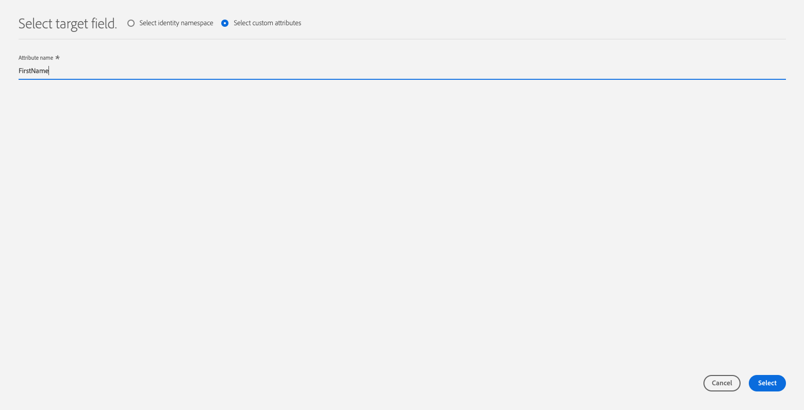

ターゲットフィールドを選択し、**[!UICONTROL Select]**&#x200B;を選択します。

これで、フィールドマッピングがリストに表示されます。

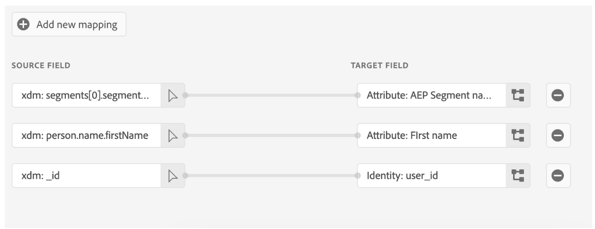

さらにマッピングを追加するには、前の手順を繰り返します。

## 書き出されたデータ／データ書き出しの検証 {#exported-data}

データが[!DNL Moengage]宛先に正常にエクスポートされたかどうかを確認するには、[!DNL Moengage] アカウントのユーザープロファイルに移動します。 ここでは、自動的に作成された`AEPSegments`という名前のユーザー属性と、[!DNL Adobe Experience Platform]の前の手順でマッピングされたその他のカスタム属性を見つける必要があります。

`AEPSegments`は[!DNL Moengage]の配列型属性です。 Experience Platformでユーザーが関連付けられているすべてのAdobe オーディエンス名が一覧表示されます。

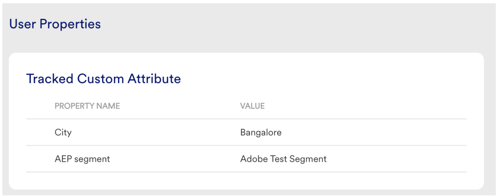

## データの使用とガバナンス {#data-usage-governance}

[!DNL Adobe Experience Platform] のすべての宛先は、データを処理する際のデータ使用ポリシーに準拠しています。[!DNL Adobe Experience Platform] がどのように データガバナンスを実施するかについて詳しくは、[データガバナンスの概要](/help/data-governance/home.md)を参照してください。
