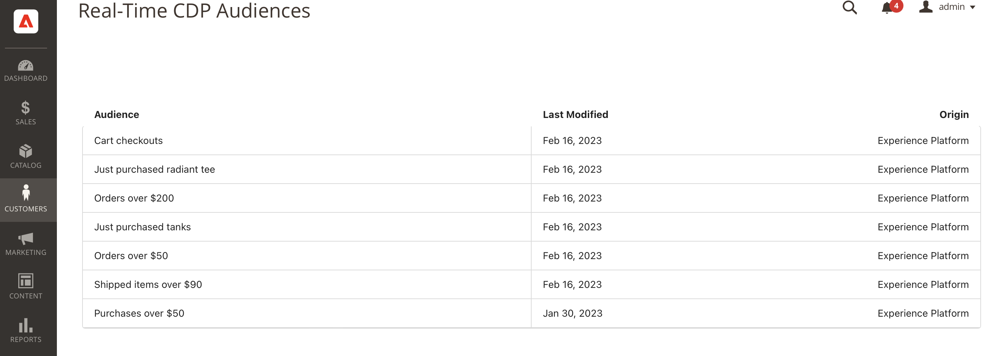

# Adobe Commerce Connection {#adobe-commerce}

## 概要 {#overview}

[!DNL Adobe Commerce]宛先コネクタを使用して、1つ以上の[!DNL Real-Time CDP] オーディエンスを選択し、[!DNL Adobe Commerce] アカウントにアクティベートして、動的にパーソナライズされたエクスペリエンスを買い物客に提供します。 [!DNL Adobe Commerce]内で、これらの[!DNL Real-Time CDP]人のオーディエンスを選択して、「購入2 get 1 free」など、カート内のユニークなオファーをパーソナライズできます。 また、Adobe [!DNL Real-Time CDP]のオーディエンスに合わせてカスタマイズしたヒーローバナーを表示したり、プロモーションオファーを通じて商品の価格を変更したりすることもできます。

## 前提条件 {#prerequisites}

このコネクタは、[!DNL Real-Time CDP] PrimeまたはUltimateとAdobe Commerceを購入したお客様の宛先カタログで利用できます。

この宛先接続を使用するには、次のアクセス権があることを確認します。

- [Adobe Experience Platform](https://experience.adobe.com/)
- [Adobe Developer Console](https://developer.adobe.com/developer-console/docs/guides/getting-started/)。 開発者コンソールにアクセスすると、[拡張機能の設定](https://experienceleague.adobe.com/docs/commerce-admin/customers/customers-menu/audience-activation.html?lang=ja#configure-the-extension)をAdobe Commerceで完了するために必要なサービスアカウントと資格情報を表示できます。
- [Adobe Commerce バージョン 2.4.4以降](https://business.adobe.com/jp/products/commerce.html)

Experience Platform で、以下を作成します。

- [スキーマ](../../../xdm/schema/composition.md)。作成するスキーマは、Adobe Commerce から取り込む予定のデータを表します。Commerce 固有のフィールドグループを含むスキーマの作成方法についての[詳細情報](https://experienceleague.adobe.com/docs/commerce-merchant-services/data-connection/fundamentals/update-xdm.html?lang=ja)。
- [ データセット ](../../../catalog/datasets/user-guide.md#create)。 データセットとは、データを収集するためのストレージと管理の構成要素です。 このデータセットは、上記で作成したスキーマから作成します。
- [データストリーム](../../../datastreams/configure.md#create)。[!DNL Adobe Experience Platform]から他のAdobe DX製品へのデータの流れを許可するID。 この ID は、特定の Adobe Commerce インスタンス内の特定の web サイトに関連付ける必要があります。このデータストリームを作成する場合は、上で作成した XDM スキーマを指定します。

前提条件を満たしたら、[!DNL Commerce] 宛先に接続します。

## サポートされるオーディエンス {#supported-audiences}

この節では、この宛先に書き出すことができるオーディエンスのタイプについて説明します。

| オーディエンスの由来 | サポートあり | 説明 |
|---------|----------|----------|
| [!DNL Segmentation Service] | ○ | Experience Platform [ セグメント化サービス ](../../../segmentation/home.md)を通じて生成されたオーディエンス。 |
| その他すべてのオーディエンスの生成元 | ○ | このカテゴリには、[!DNL Segmentation Service]を通じて生成されたオーディエンス以外のすべてのオーディエンスのオリジンが含まれます。 [様々なオーディエンスの起源](/help/segmentation/ui/audience-portal.md#customize)について読みます。 次に例を示します。 <ul><li> カスタムアップロードオーディエンス [がCSV ファイルからExperience Platformに](../../../segmentation/ui/audience-portal.md#import-audience)をインポートしました。</li><li> 類似オーディエンス， </li><li> 連合オーディエンス， </li><li> [!DNL Adobe Journey Optimizer]などの他のExperience Platform アプリで生成されたオーディエンス </li><li> その他。 </li></ul> |

{style="table-layout:auto"}

オーディエンスのデータタイプ別にサポートされるオーディエンス：

| オーディエンスのデータタイプ | サポートあり | 説明 | ユースケース |
|--------------------|-----------|-------------|-----------|
| [人物オーディエンス ](/help/segmentation/types/people-audiences.md) | ○ | 顧客プロファイルにもとづいて、マーケティング施策の特定のグループをターゲットにすることができます。 | 買い物客やカートの放棄が多い |
| [ アカウントオーディエンス ](/help/segmentation/types/account-audiences.md) | × | アカウントベースドマーケティング戦略のために、特定の組織内の個人をターゲットにします。 | B2B マーケティング |
| [見込みオーディエンス ](/help/segmentation/types/prospect-audiences.md) | × | まだ顧客ではないが、ターゲットオーディエンスと特徴を共有する個人をターゲットにします。 | サードパーティデータによる見込み顧客の開拓 |
| [ データセットの書き出し](/help/catalog/datasets/overview.md) | × | [!DNL Adobe Experience Platform] データ レイクに保存されている構造化データのコレクション。 | レポート，データサイエンスワークフロー |

{style="table-layout:auto"}

## 宛先への接続 {#connect}

>[!IMPORTANT]
>
>宛先に接続するには、**[!UICONTROL View Destinations]**&#x200B;および&#x200B;**[!UICONTROL Manage Destinations]** [ アクセス制御権限](/help/access-control/home.md#permissions)が必要です。 詳しくは、[アクセス制御の概要](/help/access-control/ui/overview.md)または製品管理者に問い合わせて、必要な権限を取得してください。

[!DNL Adobe Commerce] 宛先へ接続する手順は次のとおりです。

1. [Experience Platform インターフェイス ](https://experience.adobe.com/platform/)で、**[!UICONTROL Destinations]** > **[!UICONTROL Catalog]**&#x200B;に移動します。
1. **[!UICONTROL Personalization]** を選択します。
1. ハイライト表示するAdobe Commerceの保存先を選択し、**[!UICONTROL Set up]**&#x200B;を選択します。
1. [宛先設定のチュートリアル](../../ui/connect-destination.md)に示されている手順に従います。

### 接続パラメーター {#parameters}

この宛先を[設定](../../ui/connect-destination.md)するとき、次の情報を指定する必要があります。

- **[!UICONTROL Name]**：この宛先の優先名を入力します。
- **[!UICONTROL Description]**：宛先の説明を入力します。 例えば、この宛先を使用しているキャンペーンを指定できます。このフィールドはオプションです。
- **[!UICONTROL Integration alias]**：この値は、JSON オブジェクト名としてExperience Platform Web SDKに送信されます。
- **[!UICONTROL Datastream ID]**：これにより、ページへの応答に含まれるオーディエンスを含むデータ収集データストリームが決定されます。 ドロップダウンメニューには、宛先設定が有効になっているデータストリームのみが表示されます。詳しくは、[データストリームの設定](../../../datastreams/overview.md)を参照してください。

### アラートの有効化 {#enable-alerts}

アラートを有効にすると、宛先へのデータフローのステータスに関する通知を受け取ることができます。リストからアラートを選択して、データフローのステータスに関する通知を受け取るよう登録します。アラートについて詳しくは、[UI を使用した宛先アラートの購読](../../ui/alerts.md)についてのガイドを参照してください。

宛先接続の詳細の提供が完了したら、**[!UICONTROL Next]**&#x200B;を選択します。

## [!DNL Commerce]宛先に対するオーディエンスのアクティブ化 {#activate}

>[!IMPORTANT]
>
>データをアクティブ化するには、**[!UICONTROL View Destinations]**、**[!UICONTROL Activate Destinations]**、**[!UICONTROL View Profiles]**&#x200B;および&#x200B;**[!UICONTROL View Segments]** [ アクセス制御権限](/help/access-control/home.md#permissions)が必要です。 [アクセス制御の概要](/help/access-control/ui/overview.md)を参照するか、製品管理者に問い合わせて必要な権限を取得してください。

[宛先に対するオーディエンスのアクティブ化に関する手順については、](../../ui/activate-edge-personalization-destinations.md) プロファイルとオーディエンスをプロファイルリクエスト宛先[!DNL Commerce]に対してアクティブ化するを参照してください。

## [!DNL Adobe Commerce] での次の手順 {#next-steps-adobe-commerce}

Experience Platform内の[!DNL Commerce]宛先を設定したので、[!DNL Audience Activation]に[!DNL Commerce]拡張機能をインストールし、作成した[!DNL Commerce Admin] オーディエンスを読み込むように[!DNL Real-Time CDP]を設定する必要があります。 詳しくは、[[!DNL Commerce] ドキュメント](https://experienceleague.adobe.com/docs/commerce-admin/customers/customers-menu/audience-activation.html?lang=ja)を参照してください。

## Commerce における Audience Activation の検証 {#exported-data}

[!DNL Real-Time CDP] オーディエンスを[!DNL Adobe Commerce] アカウントにアクティブ化すると、_管理者_ サイドバーに移動し、**[!UICONTROL Customers]** > **[!UICONTROL Real-Time CDP Audience]**&#x200B;に移動すると、これらのオーディエンスが利用可能になります。

## データの使用とガバナンス {#data-usage-governance}

[!DNL Adobe Experience Platform] のすべての宛先は、データを処理する際のデータ使用ポリシーに準拠しています。[!DNL Adobe Experience Platform] がどのように データガバナンスを実施するかについて詳しくは、[データガバナンスの概要](/help/data-governance/home.md)を参照してください。
