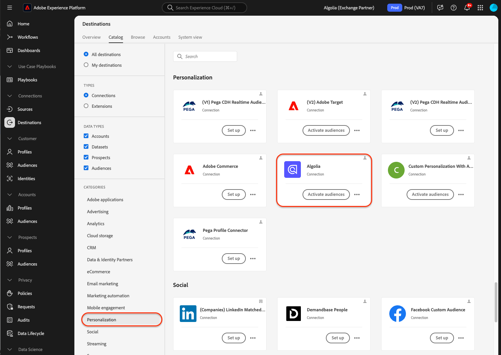
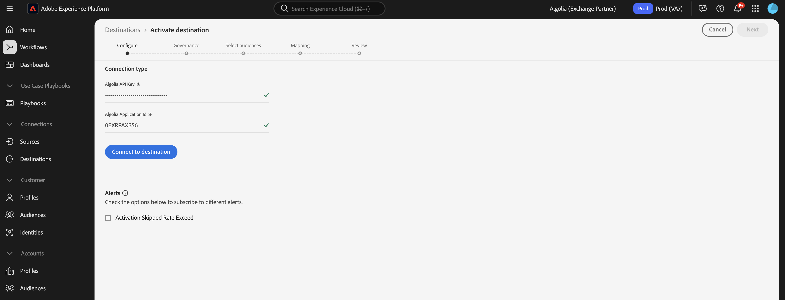
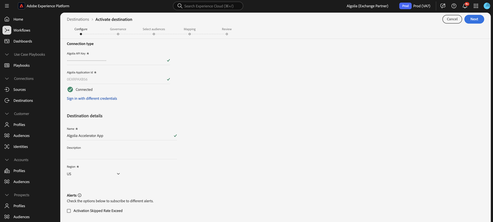
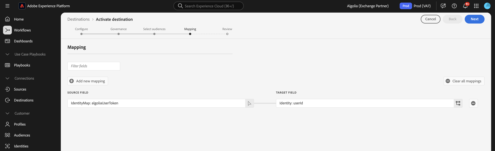
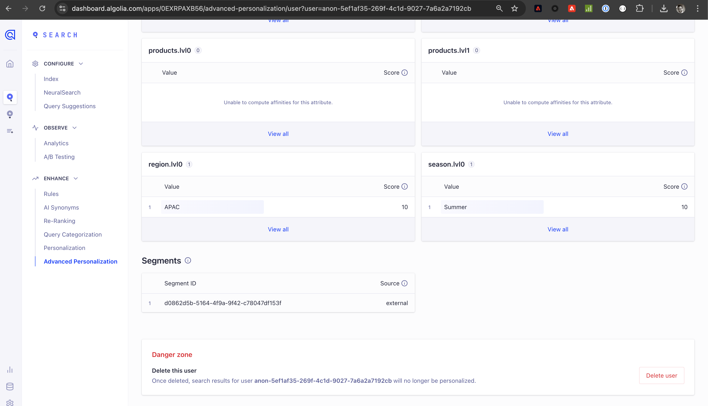

# [!DNL Algolia] 接続

## 概要 {#overview}

>[!IMPORTANT]
>
>[!DNL Algolia]宛先コネクタとドキュメント ページは、Algolia Integration Services チームによって作成および管理されます。 問い合わせや更新のリクエストについては、[adobe-algolia-solutions@algolia.com](mailto:adobe-algolia-solutions@algolia.com)までご連絡ください。

[!DNL Algolia]宛先接続を使用して、[!DNL Adobe Experience Platform]人のオーディエンスをAlgoliaに送信し、パーソナライズされた検索とレコメンデーションを行います。 [!DNL Algolia]宛先コネクタを使用する前に、まず[[!DNL Algolia User Profiles]](/help/sources/connectors/data-partners/algolia-user-profiles.md) ソースコネクタを設定する必要があります。 ソースコネクタの設定チュートリアルでは、Algolia ユーザートークン IDを作成します。 このIDは、宛先コネクタを設定する際のマッピングに必要です。

このチュートリアルでは、[!DNL Algolia] ユーザーインターフェイスを使用して[!DNL Adobe Experience Platform]宛先接続とデータフローを作成する手順を説明します。

## ユースケース {#use-cases}

[!DNL Algolia]宛先を使用する方法とタイミングをより理解しやすくするために、[!DNL Adobe Experience Platform]のお客様がこの宛先を使用して解決できるユースケースの例を次に示します。

### Personalizationの一貫性 {#personalization-consistency}

この宛先コネクタを使用すると、ホームページから検索まで、サイト全体で一貫性のあるパーソナライズされたコンテンツを提供できます。

例えば、マーケターは、[!DNL Adobe Experience Platform]で、Algoliaを含む複数のユーザーデータソースからリッチなオーディエンスを構築できます。 [!DNL Algolia]宛先コネクタを使用して、ターゲティング戦略のオーディエンスを共有すると、キャンペーンのパーソナライゼーションとコンバージョンが向上します。

この使用例を実装するには、[[!DNL Algolia User Profiles]](/help/sources/connectors/data-partners/algolia-user-profiles.md) ソースと[!DNL Algolia]宛先コネクタの両方を使用する必要があります。

まず、既存の[!DNL Algolia] ユーザープロファイルを[!DNL Adobe Experience Platform] [!DNL Real-Time CDP]およびその他のソースに読み込み、ソースコネクタを使用してリッチオーディエンスを作成します。 マーケターは、検索とレコメンデーションのパーソナライゼーションのためにAlgoliaに送信できるプロファイルデータを使用して、オーディエンスを作成します。

次に、対応する[[!DNL Algolia User Profiles]](/help/sources/connectors/data-partners/algolia-user-profiles.md) ソースコネクタを使用して、顧客プロファイルを[!DNL Real-Time CDP]に取り込み、拡張します。

## 前提条件 {#prerequisites}

>[!IMPORTANT]
>
>* 宛先に接続するには、**[!UICONTROL View Destinations]**&#x200B;および&#x200B;**[!UICONTROL Manage Destinations]**、**[!UICONTROL Activate Destinations]**、**[!UICONTROL View Profiles]**&#x200B;および&#x200B;**[!UICONTROL View Segments]** アクセス制御権限[が必要です。 &#x200B;](/help/access-control/home.md#permissions) [アクセス制御の概要](/help/access-control/ui/overview.md)を参照するか、製品管理者に問い合わせて必要な権限を取得してください。
>* *ID*&#x200B;をエクスポートするには、**[!UICONTROL View Identity Graph]** [&#x200B; アクセス制御権限](/help/access-control/home.md#permissions)が必要です。  {width="100" zoomable="yes"}

## サポートされている ID {#supported-identities}

[!DNL Algolia]は、次の表に示すIDのアクティブ化をサポートしています。 [ID](https://experienceleague.adobe.com/ja/docs/experience-platform/identity/features/namespaces) についての詳細情報。

| ターゲット ID | 説明 | 注意点 |
|---------|---------|----------|
| userId | [!DNL Algolia] ユーザートークン | このターゲット IDを選択して、`AlgoliaUserToken` ソース IDを`userToken` プラットフォームの[!DNL Algolia]にマッピングします。 |

{style="table-layout:auto"}

## サポートされるオーディエンス {#supported-audiences}

この節では、この宛先に書き出すことができるオーディエンスのタイプについて説明します。

| オーディエンスの由来 | サポートあり | 説明 |
|---------|---------|----------|
| [!DNL Segmentation Service] | ○ | Experience Platform [&#x200B; セグメント化サービス &#x200B;](../../../segmentation/home.md)を通じて生成されたオーディエンス。 |
| その他すべてのオーディエンスの生成元 | ○ | このカテゴリには、[!DNL Segmentation Service]を通じて生成されたオーディエンス以外のすべてのオーディエンスのオリジンが含まれます。 [様々なオーディエンスの起源](/help/segmentation/ui/audience-portal.md#customize)について読みます。 次に例を示します。 <ul><li> カスタムアップロードオーディエンス [がCSV ファイルからExperience Platformに](../../../segmentation/ui/audience-portal.md#import-audience)をインポートしました。</li><li> 類似オーディエンス， </li><li> 連合オーディエンス， </li><li> [!DNL Adobe Journey Optimizer]などの他のExperience Platform アプリで生成されたオーディエンス </li><li> その他。 </li></ul> |

{style="table-layout:auto"}

オーディエンスのデータタイプ別にサポートされるオーディエンス：

| オーディエンスのデータタイプ | サポートあり | 説明 | ユースケース |
|--------------------|-----------|-------------|-----------|
| [人物オーディエンス &#x200B;](/help/segmentation/types/people-audiences.md) | ○ | 顧客プロファイルにもとづいて、マーケティング施策の特定のグループをターゲットにすることができます。 | 買い物客やカートの放棄が多い |
| [&#x200B; アカウントオーディエンス &#x200B;](/help/segmentation/types/account-audiences.md) | × | アカウントベースドマーケティング戦略のために、特定の組織内の個人をターゲットにします。 | B2B マーケティング |
| [見込みオーディエンス &#x200B;](/help/segmentation/types/prospect-audiences.md) | × | まだ顧客ではないが、ターゲットオーディエンスと特徴を共有する個人をターゲットにします。 | サードパーティデータによる見込み顧客の開拓 |
| [&#x200B; データセットの書き出し](/help/catalog/datasets/overview.md) | × | [!DNL Adobe Experience Platform] データ レイクに保存されている構造化データのコレクション。 | レポート，データサイエンスワークフロー |

{style="table-layout:auto"}

## 書き出しのタイプと頻度 {#export-type-frequency}

宛先の書き出しのタイプと頻度について詳しくは、以下の表を参照してください。

| 項目 | タイプ | メモ |
|---------|----------|---------|
| 書き出しタイプ | **[!DNL Audience export]** | [!DNL Algolia] 宛先で使用される識別子（氏名、電話番号など）を使用して、オーディエンスのすべてのメンバーを書き出します。 |
| 書き出し頻度 | **[!UICONTROL Streaming]** | ストリーミングの宛先は常に、API ベースの接続です。オーディエンス評価に基づいて Experience Platform 内でプロファイルが更新されるとすぐに、コネクタは更新を宛先プラットフォームに送信します。詳しくは、[ストリーミングの宛先](/help/destinations/destination-types.md#streaming-destinations)を参照してください。 |

{style="table-layout:auto"}

## 宛先への接続 {#connect}

>[!IMPORTANT]
>
>宛先に接続するには、**[!UICONTROL View Destinations]**&#x200B;および&#x200B;**[!UICONTROL Manage and Activate Dataset Destinations]** [&#x200B; アクセス制御権限](/help/access-control/home.md#permissions)が必要です。 詳しくは、[アクセス制御の概要](/help/access-control/ui/overview.md)または製品管理者に問い合わせて、必要な権限を取得してください。

この宛先に接続するには、[宛先設定のチュートリアル](../../ui/connect-destination.md)の手順に従ってください。宛先の設定ワークフローで、以下の 2 つの節でリストされているフィールドに入力します。

### 宛先に対する認証 {#authenticate}

宛先に対して認証を行うには、必須フィールドに入力し、**[!UICONTROL Connect to destination]**&#x200B;を選択します。

* **[!UICONTROL Application ID]**: [!DNL Algolia] アプリケーション IDは、[!DNL Algolia] アカウントに割り当てられた一意のIDです。
* **[!UICONTROL API Key]**: [!DNL Algolia] API キーは、[!DNL Algolia]の検索およびインデックス サービスへのAPI リクエストを認証および承認するために使用される資格情報です。

これらの資格情報について詳しくは、[!DNL Algolia] [認証ドキュメント &#x200B;](https://www.algolia.com/doc/tools/cli/get-started/authentication/)を参照してください。

### 宛先の詳細を入力 {#destination-details}

宛先の詳細を設定するには、以下の必須フィールドとオプションフィールドに入力します。UI のフィールドの横のアスタリスクは、そのフィールドが必須であることを示します。

* **[!UICONTROL Name]**：この宛先の優先名を入力します。
* **[!UICONTROL Description]**：宛先の目的を簡単に説明します。
* **[!UICONTROL Region]**: オプションは&#x200B;**US**&#x200B;または&#x200B;**EU**&#x200B;です。 顧客データが保存されている地域を選択します。

### アラートの有効化 {#enable-alerts}

アラートを有効にすると、宛先へのデータフローのステータスに関する通知を受け取ることができます。リストからアラートを選択して、データフローのステータスに関する通知を受け取るよう登録します。アラートについて詳しくは、[UI を使用した宛先アラートの購読](../../ui/alerts.md)についてのガイドを参照してください。

宛先接続の詳細の提供が完了したら、**[!UICONTROL Next]**&#x200B;を選択します。

## この宛先に対してオーディエンスをアクティブ化 {#activate}

>[!IMPORTANT]
>
>* データをアクティブ化するには、**[!UICONTROL View Destinations]**、**[!UICONTROL Activate Destinations]**、**[!UICONTROL View Profiles]**&#x200B;および&#x200B;**[!UICONTROL View Segments]** [&#x200B; アクセス制御権限](/help/access-control/home.md#permissions)が必要です。 [アクセス制御の概要](/help/access-control/ui/overview.md)を参照するか、製品管理者に問い合わせて必要な権限を取得してください。
>* IDをエクスポートするには、ID グラフの表示[&#x200B; アクセス制御権限](https://experienceleague.adobe.com/ja/docs/experience-platform/access-control/home#permissions)が必要です。

この宛先にオーディエンスをアクティベートする手順は、[ストリーミングオーディエンスの書き出し宛先へのプロファイルとオーディエンスのアクティベート](https://experienceleague.adobe.com/ja/docs/experience-platform/destinations/ui/activate/activate-segment-streaming-destinations)を参照してください。

### 属性と ID のマッピング {#mapping-attributes-identities}

[!UICONTROL Mapping step]の間に、AlgoliaUserToken ソース IDをuserId ターゲット IDにマッピングする必要があります。

## データの書き出しを検証する {#exported-data}

オーディエンスがユーザープロファイルに正常にエクスポートされたかどうかを確認するには、[!DNL Algolia] ダッシュボードを確認し、**[!UICONTROL Advanced Personalization]**&#x200B;に移動して&#x200B;**[!UICONTROL User Inspector]**&#x200B;をクリックします。 書き出された[!DNL Adobe Experience Platform] オーディエンスに関連付けられているユーザープロファイルを検索し、ユーザーインスペクターで検索します。 セグメントのセクションにオーディエンス IDが表示されます。

## データの使用とガバナンス {#data-usage-governance}

[!DNL Adobe Experience Platform] のすべての宛先は、データを処理する際のデータ使用ポリシーに準拠しています。[!DNL Adobe Experience Platform] がどのように データガバナンスを実施するかについて詳しくは、[データガバナンスの概要](https://experienceleague.adobe.com/docs/experience-platform/data-governance/home.html?lang=ja)を参照してください。

## その他のリソース {#additional-resources}

詳しくは、次の[!DNL Algolia] ドキュメントを参照してください。

* [高度なPersonalizationとは何ですか？](https://www.algolia.com/doc/guides/personalization/advanced-personalization/what-is-advanced-personalization/)
* [&#x200B; ユーザープロファイル &#x200B;](https://www.algolia.com/doc/guides/personalization/advanced-personalization/what-is-advanced-personalization/concepts/user-profiles/)
* [&#x200B; ルールコンテキストを使用してユーザーをセグメント化](https://www.algolia.com/doc/guides/personalization/advanced-personalization/implement/guides/segment-users-with-rule-contexts/#assign-a-segment-context-at-query-time)

## 次の手順 {#next-steps}

このチュートリアルでは、Experience Platformから[!DNL Algolia] アプリケーションにオーディエンスを書き出すデータフローを正常に作成しました。 [!DNL Algolia] プラットフォームについて詳しくは、[Algolia ドキュメント &#x200B;](https://www.algolia.com/doc/)を参照してください。
