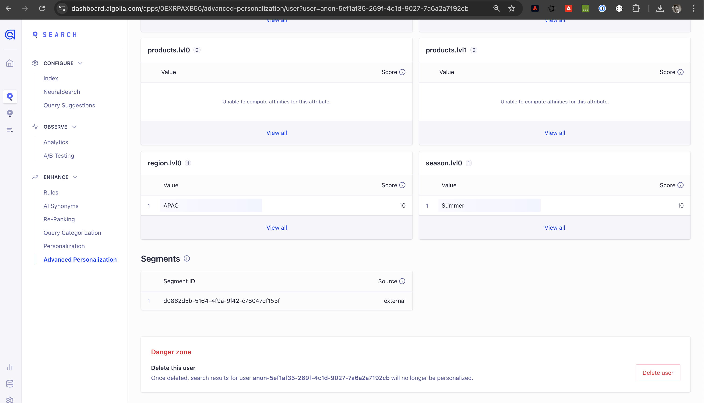

# [!DNL Algolia] 接続

## 概要 {#overview}

>[!IMPORTANT]
>
>[!DNL Algolia] の宛先コネクタとドキュメントページは、Algolia Integration Services チームによって作成および管理されます。 お問い合わせや更新のリクエストについては、[adobe-algolia-solutions@algolia.com](mailto:adobe-algolia-solutions@algolia.com) までお問い合わせください。

[!DNL Algolia] の宛先接続を使用すると、Adobe Experience Platform オーディエンスをアルゴリアに送信して、パーソナライズされた検索やお勧めを受け取ることができます。 [!DNL Algolia] の宛先コネクタを使用する前に、まず [[!DNL Algolia User Profiles]](/help/sources/connectors/data-partners/algolia-user-profiles.md) ソースコネクタを設定する必要があります。 ソースコネクタの設定チュートリアルでは、Algolia ユーザートークン ID を作成します。 この ID は、宛先コネクタを設定する際にマッピングに必要です。

このチュートリアルでは、Adobe Experience Platform ユーザーインターフェイスを使用して、[!DNL Algolia] しい宛先接続とデータフローを作成する手順を説明します。

## ユースケース {#use-cases}

[!DNL Algolia] の宛先を使用する方法とタイミングをより深く理解するために、Adobe Experience Platformのお客様がこの宛先を使用して解決できるユースケースのサンプルを以下に示します。

### Personalization整合性 {#personalization-consistency}

この宛先コネクタを使用すると、ホームページから検索まで、サイト全体で一貫したパーソナライゼーションを提供できます。

例えば、マーケターが、アルゴリアを含む複数のユーザーデータソースから、Adobe Experience Platformで豊富なオーディエンスを構築するとします。 [!DNL Algolia] の宛先コネクタを使用して、ターゲティング戦略のオーディエンスを共有し、キャンペーンのパーソナライゼーションとコンバージョンの向上につなげることができます。

このユースケースを実装するには、[[!DNL Algolia User Profiles]](/help/sources/connectors/data-partners/algolia-user-profiles.md) ソースコネクタと [!DNL Algolia] 宛先コネクタの両方を使用する必要があります。

まず、既存の [!DNL Algolia] ユーザープロファイルをAdobe Experience Platform Real-Time CDPおよびその他のソースに読み込み、ソースコネクタを使用してリッチオーディエンスの作成を開始します。 マーケターは、検索とレコメンデーションのパーソナライゼーションのためにアルゴリアに送信できるプロファイルデータを使用して、オーディエンスを作成します。

次に、対応する [[!DNL Algolia User Profiles]](/help/sources/connectors/data-partners/algolia-user-profiles.md) ソースコネクタを使用して、顧客プロファイルをReal-Time CDPに取り込んで拡張します。

## 前提条件 {#prerequisites}

>[!IMPORTANT]
>
>* 宛先に接続するには、**[!UICONTROL 宛先の表示]** および **[!UICONTROL 宛先の管理]**、**[!UICONTROL 宛先のアクティブ化]**、**[!UICONTROL プロファイルの表示]**、**[!UICONTROL セグメントの表示]**&#x200B;[ アクセス制御権限 ](/help/access-control/home.md#permissions) が必要です。 [アクセス制御の概要](/help/access-control/ui/overview.md)を参照するか、製品管理者に問い合わせて必要な権限を取得してください。
>* *ID* を書き出すには、**[!UICONTROL ID グラフの表示]**&#x200B;[ アクセス制御権限 ](/help/access-control/home.md#permissions) が必要です。  {width="100" zoomable="yes"}

## サポートされている ID {#supported-identities}

[!DNL Algolia] では、以下の表で説明する ID のアクティブ化をサポートしています。 [ID](https://experienceleague.adobe.com/ja/docs/experience-platform/identity/features/namespaces) についての詳細情報。

| ターゲット ID | 説明 | 注意点 |
|---------|---------|----------|
| userId | [!DNL Algolia] ユーザートークン | このターゲット ID を選択して、`AlgoliaUserToken` ソース ID を [!DNL Algolia] プラットフォームの `userToken` にマッピングします。 |

{style="table-layout:auto"}

## サポートされるオーディエンス {#supported-audiences}

この節では、この宛先に書き出すことができるオーディエンスのタイプについて説明します。

| オーディエンスオリジン | サポートあり | 説明 |
|---------|---------|----------|
| [!DNL Segmentation Service] | ✓ | Experience Platform [ セグメント化サービス ](../../../segmentation/home.md) を通じて生成されたオーディエンス。 |
| カスタムアップロード | ✓ | CSV ファイルから Experience Platform に[読み込まれた](../../../segmentation/ui/audience-portal.md#import-audience)オーディエンス。 |

{style="table-layout:auto"}

## 書き出しのタイプと頻度 {#export-type-frequency}

宛先の書き出しのタイプと頻度について詳しくは、以下の表を参照してください。

| 項目 | タイプ | メモ |
|---------|----------|---------|
| 書き出しタイプ | **[!DNL Audience export]** | [!DNL Algolia] 宛先で使用される識別子（氏名、電話番号など）を使用して、オーディエンスのすべてのメンバーを書き出します。 |
| 書き出し頻度 | **[!UICONTROL ストリーミング]** | ストリーミングの宛先は常に、API ベースの接続です。オーディエンス評価に基づいて Experience Platform 内でプロファイルが更新されるとすぐに、コネクタは更新を宛先プラットフォームに送信します。詳しくは、[ストリーミングの宛先](/help/destinations/destination-types.md#streaming-destinations)を参照してください。 |

{style="table-layout:auto"}

## 宛先への接続 {#connect}

>[!IMPORTANT]
>
>宛先に接続するには、**[!UICONTROL 宛先の表示]** および **[!UICONTROL データセット宛先の管理とアクティブ化]**&#x200B;[ アクセス制御権限 ](/help/access-control/home.md#permissions) が必要です。 詳しくは、[アクセス制御の概要](/help/access-control/ui/overview.md)または製品管理者に問い合わせて、必要な権限を取得してください。

この宛先に接続するには、[宛先設定のチュートリアル](../../ui/connect-destination.md)の手順に従ってください。宛先の設定ワークフローで、以下の 2 つの節でリストされているフィールドに入力します。

### 宛先に対する認証 {#authenticate}

宛先に対して認証するには、必須フィールドに入力し、「**[!UICONTROL 宛先に接続]**」を選択します。

* **[!UICONTROL アプリケーション ID]**:[!DNL Algolia] アプリケーション ID は、[!DNL Algolia] アカウントに割り当てられた一意の ID です。
* **[!UICONTROL API キー]**:[!DNL Algolia] API キーは、[!DNL Algolia] の検索およびインデックス作成サービスに対する API リクエストの認証および承認に使用される資格情報です。

これらの資格情報について詳しくは、[!DNL Algolia] [ 認証ドキュメント ](https://www.algolia.com/doc/tools/cli/get-started/authentication/) を参照してください。

### 宛先の詳細を入力

宛先の詳細を設定するには、以下の必須フィールドとオプションフィールドに入力します。UI のフィールドの横のアスタリスクは、そのフィールドが必須であることを示します。

* **[!UICONTROL 名前]**：この宛先に希望する名前を入力します。
* **[!UICONTROL 説明]**：宛先の目的に関する短い説明。
* **[!UICONTROL 地域]**：オプションは **米国** または **EU** です。 顧客データが保存される地域を選択します。

### アラートの有効化 {#enable-alerts}

アラートを有効にすると、宛先へのデータフローのステータスに関する通知を受け取ることができます。リストからアラートを選択して、データフローのステータスに関する通知を受け取るよう登録します。アラートについて詳しくは、[UI を使用した宛先アラートの購読](../../ui/alerts.md)についてのガイドを参照してください。

宛先接続の詳細の入力を終えたら「**[!UICONTROL 次へ]**」を選択します。

## この宛先に対してオーディエンスをアクティブ化 {#activate}

>[!IMPORTANT]
> 
>* データをアクティブ化するには、**[!UICONTROL 宛先の表示]**、**[!UICONTROL 宛先のアクティブ化]**、**[!UICONTROL プロファイルの表示]** および **[!UICONTROL セグメントの表示]**&#x200B;[ アクセス制御権限 ](/help/access-control/home.md#permissions) が必要です。 [アクセス制御の概要](/help/access-control/ui/overview.md)を参照するか、製品管理者に問い合わせて必要な権限を取得してください。
>* ID を書き出すには、ID グラフの表示 [ アクセス制御権限 ](https://experienceleague.adobe.com/en/docs/experience-platform/access-control/home#permissions) が必要です。

この宛先にオーディエンスをアクティベートする手順は、[ストリーミングオーディエンスの書き出し宛先へのプロファイルとオーディエンスのアクティベート](https://experienceleague.adobe.com/en/docs/experience-platform/destinations/ui/activate/activate-segment-streaming-destinations)を参照してください。

### 属性と ID のマッピング {#mapping-attributes-identities}

[!UICONTROL &#x200B; マッピング手順 &#x200B;] 中に、AlgoliaUserToken ソース ID を userId ターゲット ID にマッピングする必要があります。

## データの書き出しを検証する {#exported-data}

オーディエンスがユーザープロファイルに正常に書き出されたかどうかを確認するには、[!DNL Algolia] ダッシュボードを確認し、**[!UICONTROL 詳細Personalization]** に移動して、**[!UICONTROL ユーザーインスペクター]** をクリックします。 書き出されたAdobe Experience Platform オーディエンスに関連付けられているユーザープロファイルを見つけ、ユーザーインスペクターで検索します。 「セグメント」セクションにオーディエンス ID が表示されます。

## データの使用とガバナンス {#data-usage-governance}

[!DNL Adobe Experience Platform] のすべての宛先は、データを処理する際のデータ使用ポリシーに準拠しています。[!DNL Adobe Experience Platform] がどのように データガバナンスを実施するかについて詳しくは、[データガバナンスの概要](https://experienceleague.adobe.com/docs/experience-platform/data-governance/home.html?lang=ja)を参照してください。

## その他のリソース {#additional-resources}

詳しくは、次の [!DNL Algolia] ドキュメントを参照してください。

* [ 高度なPersonalizationとは ](https://www.algolia.com/doc/guides/personalization/advanced-personalization/what-is-advanced-personalization/)
* [ ユーザープロファイル ](https://www.algolia.com/doc/guides/personalization/advanced-personalization/what-is-advanced-personalization/concepts/user-profiles/)
* [ ルールコンテキストを持つセグメントユーザー ](https://www.algolia.com/doc/guides/personalization/advanced-personalization/implement/guides/segment-users-with-rule-contexts/#assign-a-segment-context-at-query-time)

## 次の手順 {#next-steps}

このチュートリアルでは、Experience Platformから [!DNL Algolia] アプリケーションにオーディエンスを書き出すデータフローを正常に作成しました。 [!DNL Algolia] プラットフォームについて詳しくは、[Algolia のドキュメント ](https://www.algolia.com/doc/) を参照してください。