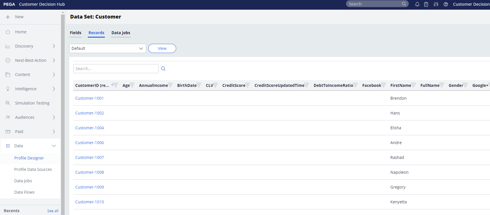
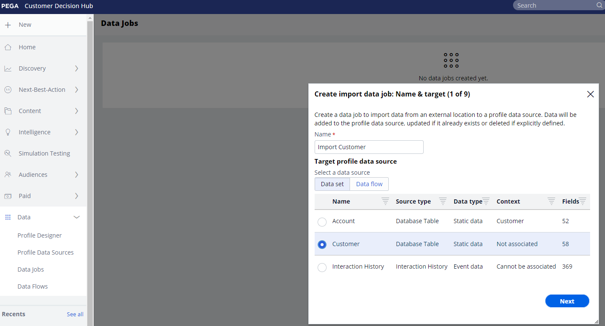

# Pega プロファイルコネクタ

## 概要 {#overview}

以下を使用： [!DNL Pega Profile Connector] Adobe Experience Platformで、 [!DNL Amazon Web Services] (AWS)S3 ストレージを使用し、Adobe Experience Platformから独自の S3 バケットにプロファイルデータを CSV ファイルに定期的に書き出します。 [!DNL Pega Customer Decision Hub] では、データジョブをスケジュールして、このプロファイルデータを S3 ストレージから読み込み、[!DNL Pega Customer Decision Hub] プロファイルを更新できます。

このコネクタは、プロファイルデータの初期書き出しを設定するのに役立ち、新しいプロファイルを定期的ににに同期するのに役立ちます。 [!DNL Pega Customer Decision Hub].  顧客の Decision Hub に最新のデータを持つことで、次に最適な判定をおこなうために、顧客ベースのより優れた最新の表示を提供します。

>[!IMPORTANT]
>
>このドキュメントページは Pegasystems によって作成されました。 お問い合わせや更新のご依頼は、Pega に直接お問い合わせください [ここ](mailto:support@pega.com).

## ユースケース

[!DNL Pega Profile Connector] 宛先を使用する方法とタイミングをより深く理解するために、Adobe Experience Platform のお客様がこの宛先を使用して解決できるサンプルユースケースを以下に示します。

### 使用例 1

マーケターが最初に [!DNL Pega Customer Decision Hub] Adobe Experience Platformから読み込まれたプロファイルデータを含む これは、最初のフル負荷に続いて、スケジュールに沿ったデルタ負荷が発生します。

### 使用例 2

マーケターがAdobe Experience Platformの最新のプロファイルデータを [!DNL Pega Customer Decision Hub] これにより、顧客プロファイルに関する Pega のインサイトが継続的に強化されます。

## 前提条件 {#prerequisites}

この宛先を使用してAdobe Experience Platformからデータを書き出し、プロファイルをに読み込む前に [!DNL Pega Customer Decision Hub]次の前提条件を満たしていることを確認します。

* 設定 [!DNL Amazon S3] バケットおよびデータファイルの書き出しと読み込みに使用するフォルダーパス。
* の設定 [!DNL Amazon S3] アクセスキーと [!DNL Amazon S3] 秘密鍵：In [!DNL Amazon S3]、 `access key - secret access key` ペアを使用して、 [!DNL Amazon S3] アカウント
* データを正常に接続してに書き出すには、以下を実行します。 [!DNL Amazon S3] ストレージの場所、次の IAM (Identity and Access Management) ユーザーを作成する [!DNL Platform] in [!DNL Amazon S3] 権限の割り当て： `s3:DeleteObject`, `s3:GetBucketLocation`, `s3:GetObject`, `s3:ListBucket`, `s3:PutObject`, `s3:ListMultipartUploadParts`
* 次を確認します。 [!DNL Pega Customer Decision Hub] インスタンスが 8.8 バージョン以降にアップグレードされています。

## サポートされている ID {#supported-identities}

[!DNL Pega Customer Decision Hub] では、以下の表で説明するカスタムユーザー ID のアクティベーションをサポートしています。 詳しくは、 [id](/help/identity-service/namespaces.md).

| ターゲット ID | 説明 |
|---|---|
| *CustomerID* | プロファイルを一意に識別する共通のユーザー ID [!DNL Pega Customer Decision Hub] とAdobe Experience Platform |

{style="table-layout:auto"}

## 書き出しのタイプと頻度 {#export-type-frequency}

宛先の書き出しのタイプと頻度について詳しくは、以下の表を参照してください。

| 項目 | タイプ | メモ |
|---------|----------|---------|
| 書き出しタイプ | **[!UICONTROL プロファイルベース]** | [宛先のアクティベーションワークフロー](../../ui/activate-batch-profile-destinations.md#select-attributes)のプロファイル属性選択画面で選択した目的のスキーマフィールド（例：メールアドレス、電話番号、姓）と共に、セグメントのすべてのメンバーを書き出します。 |
| 書き出し頻度 | **[!UICONTROL バッチ]** | バッチ宛先では、ファイルが 3 時間、6 時間、8 時間、12 時間、24 時間の単位でダウンストリームプラットフォームに書き出されます。 詳しくは、[バッチ（ファイルベース）宛先](/help/destinations/destination-types.md#file-based)を参照してください。 |

{style="table-layout:auto"}

## 宛先への接続 {#connect}

>[!IMPORTANT]
> 
>宛先に接続するには、**[!UICONTROL 宛先の管理]** [アクセス制御権限](/help/access-control/home.md#permissions)が必要です。詳しくは、[アクセス制御の概要](/help/access-control/ui/overview.md)または製品管理者に問い合わせて、必要な権限を取得してください。

この宛先に接続するには、[宛先設定のチュートリアル](../../ui/connect-destination.md)の手順に従ってください。宛先の設定ワークフローで、以下の 2 つの節でリストされているフィールドに入力します。

### 宛先に対する認証 {#authenticate}

宛先に対して認証するには、必須フィールドに入力し、「**[!UICONTROL 宛先に接続]**」を選択します。

* **[!DNL Amazon S3]アクセスキー** および **[!DNL Amazon S3]秘密鍵**:In [!DNL Amazon S3]、 `access key - secret access key` のペアでAdobe Experience Platformへのアクセスを許可 [!DNL Amazon S3] アカウント 詳しくは、[Amazon Web Services に関するドキュメント](https://docs.aws.amazon.com/ja_jp/IAM/latest/UserGuide/id_credentials_access-keys.html)を参照してください。

### 宛先の詳細の入力 {#destination-details}

への認証接続を確立した後 [!DNL Amazon S3]に設定し、宛先に次の情報を入力します。

宛先の詳細を設定するには、必須フィールドに入力し、「 」を選択します。 **[!UICONTROL 次へ]**. UI のフィールドの横のアスタリスクは、そのフィールドが必須であることを示します。

* **[!UICONTROL 名前]**：この宛先を識別するのに役立つ名前を入力します。
* **[!UICONTROL 説明]**：この宛先の説明を入力します。
* **[!UICONTROL バケット名]**：この宛先で使用する [!DNL Amazon S3] バケットの名前を入力します。
* **[!UICONTROL フォルダーパス]**：書き出したファイルをホストする宛先フォルダーへのパスを入力します。
* **[!UICONTROL 圧縮タイプ]**:「圧縮タイプ」として「GZIP」または「なし」を選択します。

>[!TIP]
>
>宛先の接続ワークフローでは、書き出したオーディエンスファイルごとにAmazon S3 ストレージにカスタムフォルダーを作成できます。 手順については、[マクロを使用して、ストレージの場所にフォルダーを作成する](/help/destinations/catalog/cloud-storage/overview.md#use-macros)を参照してください。

### アラートの有効化 {#enable-alerts}

アラートを有効にすると、宛先へのデータフローのステータスに関する通知を受け取ることができます。リストからアラートを選択して、データフローのステータスに関する通知を受け取るよう登録します。アラートについて詳しくは、[UI を使用した宛先アラートの購読](../../ui/alerts.md)についてのガイドを参照してください。

宛先接続への詳細の入力を終えたら「**[!UICONTROL 次へ]**」を選択します。

## この宛先に対するオーディエンスをアクティブ化 {#activate}

>[!IMPORTANT]
> 
>データをアクティブ化するには、**[!UICONTROL 宛先の管理]**、**[!UICONTROL 宛先のアクティブ化]**、**[!UICONTROL プロファイルの表示]**&#x200B;および&#x200B;**[!UICONTROL セグメントの表示]** [に対するアクセス制御権限](/help/access-control/home.md#permissions)が必要です。詳しくは、[アクセス制御の概要](/help/access-control/ui/overview.md)または製品管理者に問い合わせて、必要な権限を取得してください。

詳しくは、 [プロファイルの一括書き出し先に対するオーディエンスデータのアクティブ化](../../ui/activate-batch-profile-destinations.md) を参照してください。

### 属性と ID のマッピング {#map}

**[!UICONTROL マッピング]**&#x200B;手順では、プロファイルに書き出す属性および ID フィールドを選択できます。 また、書き出したファイル内のヘッダーを選択して、任意のわかりやすい名前に変更することもできます。詳しくは、「バッチの宛先をアクティベート」UI チュートリアルの[マッピング手順](/help/destinations/ui/activate-batch-profile-destinations.md#mapping)を参照してください。

## データの書き出しを検証する {#exported-data}

の場合 [!DNL Pega Profile Connector] 宛先、 [!DNL Platform] を作成 `.csv` 指定したAmazon S3 ストレージの場所にあるファイル。 ファイルの詳細については、 [プロファイルの一括書き出し先に対するオーディエンスデータのアクティブ化](../../ui/activate-batch-profile-destinations.md) （ audience activation チュートリアル）を参照してください。

S3 からのプロファイルデータのインポートが成功すると、 [!DNL Pega Customer] プロファイルデータストア。 インポートした顧客プロファイルデータは、 [!DNL Pega Customer Profile Designer] （次の図を参照）。

In [!DNL Pega Customer Decision Hub]に設定でき、データ管理者が [!DNL Customer Profile Designer] 次の図に示すように、S3 からプロファイルデータを定期的に読み込む。 詳しくは、 [その他のリソース](#additional-resources) プロファイルデータをインポートするデータジョブの設定方法の詳細 [!DNL Amazon S3].

## その他のリソース {#additional-resources}

詳しくは、 [データジョブのインポート](https://academy.pega.com/topic/import-data-jobs/v1) in [!DNL Pega Customer Decision Hub].

## データの使用とガバナンス {#data-usage-governance}

[!DNL Adobe Experience Platform] のすべての宛先は、データを処理する際のデータ使用ポリシーに準拠しています。[!DNL Adobe Experience Platform] がどのようにデータガバナンスを実施するかについて詳しくは、[データガバナンスの概要](/help/data-governance/home.md)を参照してください。
