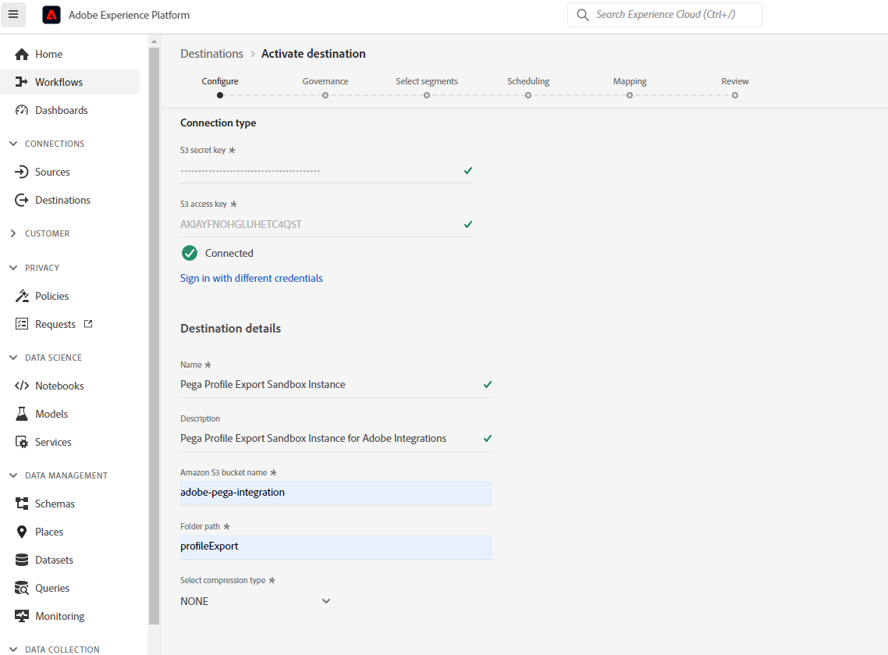
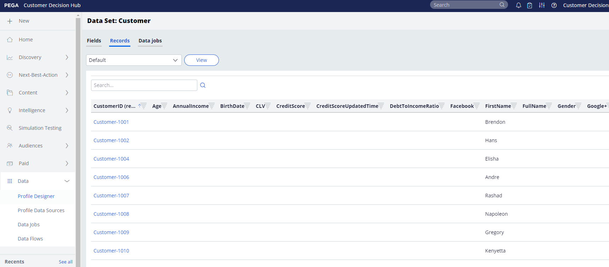

# Pega プロファイルコネクタ

## 概要 {#overview}

Adobe Experience Platformの [!DNL Pega Profile Connector] を使用して [!DNL Amazon Web Services] （AWS） S3 ストレージへのライブアウトバウンド接続を作成し、Adobe Experience Platformから CSV ファイルにプロファイルデータを定期的に書き出して、独自の S3 バケットに入れます。 [!DNL Pega Customer Decision Hub] では、データジョブをスケジュールして、このプロファイルデータを S3 ストレージから読み込み、[!DNL Pega Customer Decision Hub] プロファイルを更新できます。

このコネクタは、プロファイルデータの最初の書き出しを設定するのに役立ち、[!DNL Pega Customer Decision Hub] に新しいプロファイルを定期的に同期するのにも役立ちます。  Customer Decision Hub に最新のデータを含めることで、次善のアクションの意思決定のための、顧客ベースに関するより優れた更新ビューが提供されます。

>[!IMPORTANT]
>
>この宛先コネクタとドキュメントページは、Pegasystems が作成および管理します。 お問い合わせや更新のリクエストについては、Pega に直接お問い合わせください [&#x200B; こちら &#x200B;](mailto:support@pega.com)。

## ユースケース

[!DNL Pega Profile Connector] の宛先を使用する方法とタイミングをより深く理解するために、Adobe Experience Platformのお客様がこの宛先を使用して解決できるユースケースのサンプルを以下に示します。

### ユースケース 1

マーケターは、最初に、Adobe Experience Platformから読み込まれたプロファイルデータを使用して [!DNL Pega Customer Decision Hub] を設定したいと考えています。 これは、最初のフル・ロードと、スケジュールに従ったデルタ・ロードです。

### ユースケース 2

マーケターは、顧客プロファイルに関する Pega インサイトを継続的に強化する、Adobe Experience Platformの最新のプロファイルデータを [!DNL Pega Customer Decision Hub] で入手したいと考えています。

## 前提条件 {#prerequisites}

この宛先を使用してAdobe Experience Platformからデータを書き出し、プロファイルを [!DNL Pega Customer Decision Hub] に読み込む前に、次の前提条件を満たしていることを確認してください。

* バケット [!DNL Amazon S3]、データファイルのエクスポートおよびインポートに使用するフォルダーパスを設定します。
* [!DNL Amazon S3] アクセスキーと秘密鍵 [!DNL Amazon S3] 設定します。[!DNL Amazon S3] で `access key - secret access key` ペアを生成して、[!DNL Amazon S3] アカウントにExperience Platform アクセス権を付与します。
* [!DNL Amazon S3] ストレージの場所に正常に接続してデータを書き出すには、[!DNL Experience Platform] で [!DNL Amazon S3] の IAM （Identity and Access Management） ユーザーを作成し、`s3:DeleteObject`、`s3:GetBucketLocation`、`s3:GetObject`、`s3:ListBucket`、`s3:PutObject`、`s3:ListMultipartUploadParts` などの権限を割り当てます
* [!DNL Pega Customer Decision Hub] インスタンスが 8.8 バージョン以降にアップグレードされていることを確認します。

## サポートされている ID {#supported-identities}

[!DNL Pega Customer Decision Hub] では、以下の表で説明するカスタムユーザー ID のアクティベーションをサポートしています。 詳しくは、[ID](/help/identity-service/features/namespaces.md) を参照してください。

| ターゲット ID | 説明 |
|---|---|
| *顧客 ID* | [!DNL Pega Customer Decision Hub] およびAdobe Experience Platformでプロファイルを一意に識別する共通のユーザー ID |

{style="table-layout:auto"}

## サポートされるオーディエンス {#supported-audiences}

この節では、この宛先に書き出すことができるオーディエンスのタイプについて説明します。

| オーディエンスオリジン | サポートあり | 説明 |
|---------|----------|----------|
| [!DNL Segmentation Service] | ○ | Experience Platform [&#x200B; セグメント化サービス &#x200B;](../../../segmentation/home.md) を通じて生成されたオーディエンス。 |
| その他すべてのオーディエンスの接触チャネル | × | このカテゴリには、[!DNL Segmentation Service] を通じて生成されたオーディエンス以外のすべてのオーディエンスの接触チャネルが含まれます。 [&#x200B; 様々なオーディエンスのオリジン &#x200B;](/help/segmentation/ui/audience-portal.md#customize) について確認する。 次に例を示します。 <ul><li> csv ファイルからExperience Platformへのカスタムアップロードオーディエンス [&#x200B; 読み込み &#x200B;](../../../segmentation/ui/audience-portal.md#import-audience)</li><li> 類似オーディエンス、 </li><li> 連合オーディエンス、 </li><li> Adobe Journey Optimizerなど、他のExperience Platform アプリで生成されたオーディエンス。 </li><li> その他。 </li></ul> |

{style="table-layout:auto"}

オーディエンスデータタイプでサポートされるオーディエンス：

| オーディエンスデータタイプ | サポートあり | 説明 | ユースケース |
|--------------------|-----------|-------------|-----------|
| [&#x200B; 人物オーディエンス &#x200B;](/help/segmentation/types/people-audiences.md) | ○ | 顧客プロファイルに基づき、マーケティングキャンペーンの対象となる人物のグループを指定できます。 | 頻繁な購入、買い物かごの放棄 |
| [&#x200B; アカウントオーディエンス &#x200B;](/help/segmentation/types/account-audiences.md) | × | アカウントベースのマーケティング戦略では、特定の組織内の個人をターゲットに設定します。 | B2B マーケティング |
| [&#x200B; 見込み客オーディエンス &#x200B;](/help/segmentation/types/prospect-audiences.md) | × | まだ顧客ではないものの、ターゲットオーディエンスと特性を共有する個人をターゲットに設定します。 | サードパーティデータを使用した予測 |
| [&#x200B; データセットの書き出し &#x200B;](/help/catalog/datasets/overview.md) | × | Adobe Experience Platform Data Lake に保存された構造化データのコレクション。 | レポート、データサイエンスワークフロー |

{style="table-layout:auto"}

## 書き出しのタイプと頻度 {#export-type-frequency}

宛先の書き出しのタイプと頻度について詳しくは、以下の表を参照してください。

| 項目 | タイプ | メモ |
|---------|----------|---------|
| 書き出しタイプ | **[!UICONTROL Profile-based]** | [宛先のアクティベーションワークフロー](../../ui/activate-batch-profile-destinations.md#select-attributes)のプロファイル属性選択画面で選択した目的のスキーマフィールド（例：メールアドレス、電話番号、姓）と共に、セグメントのすべてのメンバーを書き出します。 |
| 書き出し頻度 | **[!UICONTROL Batch]** | バッチ宛先では、ファイルが 3 時間、6 時間、8 時間、12 時間、24 時間の単位でダウンストリームプラットフォームに書き出されます。 詳しくは、[バッチ（ファイルベース）宛先](/help/destinations/destination-types.md#file-based)を参照してください。 |

{style="table-layout:auto"}

## 宛先への接続 {#connect}

>[!IMPORTANT]
> 
>宛先に接続するには、**[!UICONTROL View Destinations]** および **[!UICONTROL Manage Destinations]**&#x200B;[&#x200B; アクセス制御権限 &#x200B;](/help/access-control/home.md#permissions) が必要です。 詳しくは、[アクセス制御の概要](/help/access-control/ui/overview.md)または製品管理者に問い合わせて、必要な権限を取得してください。

この宛先に接続するには、[宛先設定のチュートリアル](../../ui/connect-destination.md)の手順に従ってください。宛先の設定ワークフローで、以下の 2 つの節でリストされているフィールドに入力します。

### 宛先に対する認証 {#authenticate}

宛先に対する認証を行うには、必須フィールドに入力し、「**[!UICONTROL Connect to destination]**」を選択します。

* **[!DNL Amazon S3]アクセスキー** および秘密鍵 **[!DNL Amazon S3]:** で [!DNL Amazon S3] ペア `access key - secret access key` 生成して、[!DNL Amazon S3] アカウントにAdobe Experience Platform アクセス権を付与します。 詳しくは、[Amazon Web Services に関するドキュメント](https://docs.aws.amazon.com/ja_jp/IAM/latest/UserGuide/id_credentials_access-keys.html)を参照してください。

### 宛先の詳細の入力 {#destination-details}

[!DNL Amazon S3] への認証接続を確立したら、宛先の次の情報を指定します。

宛先の詳細を設定するには、必須フィールドに入力し、「**[!UICONTROL Next]**」を選択します。 UI のフィールドの横のアスタリスクは、そのフィールドが必須であることを示します。

* **[!UICONTROL Name]**：この宛先を識別するのに役立つ名前を入力します。
* **[!UICONTROL Description]**：この宛先の説明を入力します。
* **[!UICONTROL Bucket name]**：この宛先が使用する [!DNL Amazon S3] バケットの名前を入力します。
* **[!UICONTROL Folder path]**：書き出したファイルをホストする保存先フォルダーのパス。
* **[!UICONTROL Compression Type]**：圧縮タイプとして GZIP または NONE を選択します。

>[!TIP]
>
>宛先に接続ワークフローでは、書き出したオーディエンスファイルごとにAmazon S3 ストレージにカスタムフォルダーを作成できます。 手順については、[マクロを使用して、ストレージの場所にフォルダーを作成する](/help/destinations/catalog/cloud-storage/overview.md#use-macros)を参照してください。

### アラートの有効化 {#enable-alerts}

アラートを有効にすると、宛先へのデータフローのステータスに関する通知を受け取ることができます。リストからアラートを選択して、データフローのステータスに関する通知を受け取るよう登録します。アラートについて詳しくは、[UI を使用した宛先アラートの購読](../../ui/alerts.md)についてのガイドを参照してください。

宛先接続への詳細の入力を終えたら「**[!UICONTROL Next]**」を選択します。

## この宛先に対してオーディエンスをアクティブ化 {#activate}

>[!IMPORTANT]
> 
>* データをアクティブ化するには、**[!UICONTROL View Destinations]**、**[!UICONTROL Activate Destinations]**、**[!UICONTROL View Profiles]**、**[!UICONTROL View Segments]** [&#x200B; アクセス制御権限 &#x200B;](/help/access-control/home.md#permissions) が必要です。 [アクセス制御の概要](/help/access-control/ui/overview.md)を参照するか、製品管理者に問い合わせて必要な権限を取得してください。
>* *ID* を書き出すには、**[!UICONTROL View Identity Graph]** [&#x200B; アクセス制御権限 &#x200B;](/help/access-control/home.md#permissions) が必要です。  {width="100" zoomable="yes"}

この宛先に対してオーディエンスをアクティブ化する手順については、[&#x200B; プロファイル書き出しのバッチ宛先に対するオーディエンスデータのアクティブ化 &#x200B;](../../ui/activate-batch-profile-destinations.md) を参照してください。

### 属性と ID のマッピング {#map}

**[!UICONTROL Mapping]** の手順では、プロファイルに書き出す属性フィールドと ID フィールドを選択できます。 また、書き出したファイル内のヘッダーを選択して、任意のわかりやすい名前に変更することもできます。詳しくは、「バッチの宛先をアクティベート」UI チュートリアルの[マッピング手順](/help/destinations/ui/activate-batch-profile-destinations.md#mapping)を参照してください。

## データの書き出しを検証する {#exported-data}

[!DNL Pega Profile Connector] の宛先の場合、[!DNL Experience Platform] は、指定されたAmazon S3 ストレージの場所に `.csv` ファイルを作成します。 ファイルについて詳しくは、オーディエンスの有効化チュートリアルの [&#x200B; プロファイル書き出しのバッチ宛先に対するオーディエンスデータの有効化 &#x200B;](../../ui/activate-batch-profile-destinations.md) を参照してください。

S3 からプロファイルデータが正常に読み込まれると、[!DNL Pega Customer] プロファイルデータストアにデータが挿入されます。 次の図に示すように、読み込まれた顧客プロファイルデータを [!DNL Pega Customer Profile Designer] で検証できます。

ま [!DNL Pega Customer Decision Hub]、データ管理者は、次の図に示 [!DNL Customer Profile Designer] ように、S3 からプロファイルデータを定期的に読み込むように、データジョブを設定できます。 データジョブを設定して [&#x200B; からプロファイルデータをインポートする方法について詳しくは、](#additional-resources) その他のリソース [!DNL Amazon S3] を参照してください。

## その他のリソース {#additional-resources}

[&#x200B; の &#x200B;](https://academy.pega.com/topic/import-data-jobs/v1) データジョブのインポート [!DNL Pega Customer Decision Hub] を参照してください。

## データの使用とガバナンス {#data-usage-governance}

[!DNL Adobe Experience Platform] のすべての宛先は、データを処理する際のデータ使用ポリシーに準拠しています。[!DNL Adobe Experience Platform] がどのようにデータガバナンスを実施するかについて詳しくは、[データガバナンスの概要](/help/data-governance/home.md)を参照してください。
