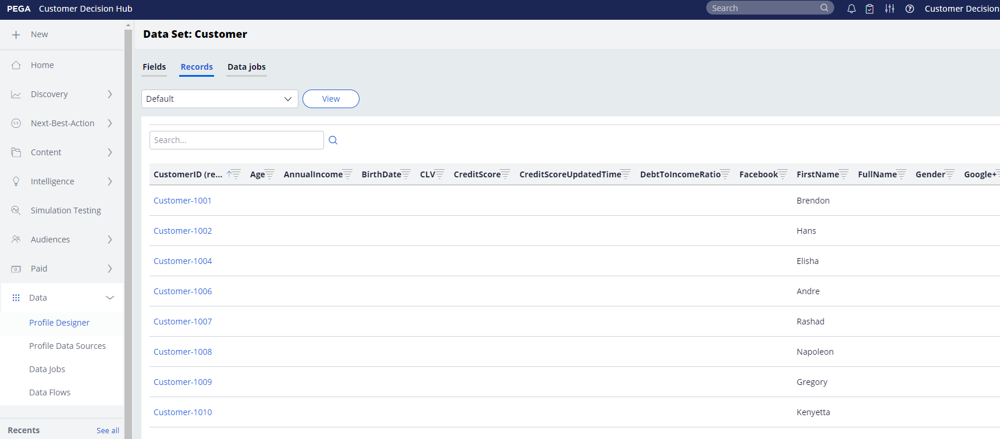
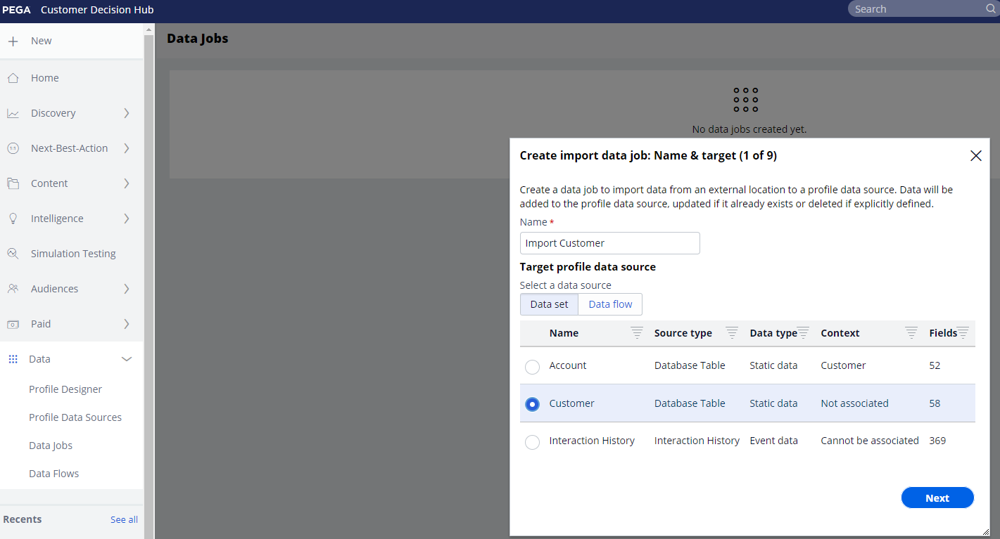

# Pega プロファイルコネクタ

## 概要 {#overview}

[!DNL Pega Profile Connector]の[!DNL Adobe Experience Platform]を使用して、[!DNL Amazon Web Services] （AWS） S3 ストレージへのライブアウトバウンド接続を作成し、プロファイルデータを[!DNL Adobe Experience Platform]から独自のS3 バケットにCSV ファイルに定期的にエクスポートします。 [!DNL Pega Customer Decision Hub] では、データジョブをスケジュールして、このプロファイルデータを S3 ストレージから読み込み、[!DNL Pega Customer Decision Hub] プロファイルを更新できます。

このコネクタは、プロファイルデータの初期エクスポートの設定に役立ち、新しいプロファイルを定期的に[!DNL Pega Customer Decision Hub]に同期するのにも役立ちます。  Customer Decision Hubに最新のデータがあれば、顧客基盤をより詳細に把握し、次善のアクションを決定できます。

>[!IMPORTANT]
>
>この宛先コネクタとドキュメントページは、Pegasystemsによって作成および管理されます。 問い合わせやアップデートのリクエストについては、Pegaに直接[こちら](mailto:support@pega.com)までお問い合わせください。

## ユースケース {#use-cases}

[!DNL Pega Profile Connector]宛先を使用する方法とタイミングをより理解しやすくするために、[!DNL Adobe Experience Platform]のお客様がこの宛先を使用して解決できるユースケースの例を次に示します。

### ユースケース 1 {#use-case-1}

マーケターは、最初に[!DNL Pega Customer Decision Hub]から読み込まれたプロファイルデータを使用して[!DNL Adobe Experience Platform]を設定したいと考えています。 これは、最初のフルロードに続いて、スケジュールに従って差分ロードを実行します。

### ユースケース 2 {#use-case-2}

マーケターは、顧客プロファイルに関するPegaのインサイトを継続的に強化するために、[!DNL Adobe Experience Platform]で利用可能な[!DNL Pega Customer Decision Hub]から最新のプロファイルデータを取得したいと考えています。

## 前提条件 {#prerequisites}

この宛先を使用して[!DNL Adobe Experience Platform]からデータをエクスポートし、[!DNL Pega Customer Decision Hub]にプロファイルをインポートする前に、次の前提条件を満たしていることを確認してください。

* データファイルのエクスポートとインポートに使用する[!DNL Amazon S3] バケットとフォルダーパスを設定します。
* [!DNL Amazon S3] アクセスキーと[!DNL Amazon S3]秘密鍵を設定します。[!DNL Amazon S3]で`access key - secret access key` ペアを生成して、Experience Platformに[!DNL Amazon S3] アカウントへのアクセス権を付与します。
* データを正常に接続して[!DNL Amazon S3] ストレージの場所に書き出すには、[!DNL Experience Platform]の[!DNL Amazon S3]のIDおよびアクセス管理（IAM） ユーザーを作成し、`s3:DeleteObject`、`s3:GetBucketLocation`、`s3:GetObject`、`s3:ListBucket`、`s3:PutObject`、`s3:ListMultipartUploadParts`などの権限を割り当てます
* [!DNL Pega Customer Decision Hub] インスタンスが8.8 バージョン以降にアップグレードされていることを確認します。

## サポートされている ID {#supported-identities}

[!DNL Pega Customer Decision Hub]は、次の表に示すカスタム ユーザーIDのアクティブ化をサポートしています。 詳しくは、[ID](/help/identity-service/features/namespaces.md)を参照してください。

| ターゲット ID | 説明 |
|---|---|
| *CustomerID* | [!DNL Pega Customer Decision Hub]および[!DNL Adobe Experience Platform]のプロファイルを一意に識別する共通ユーザー識別子 |

{style="table-layout:auto"}

## サポートされるオーディエンス {#supported-audiences}

この節では、この宛先に書き出すことができるオーディエンスのタイプについて説明します。

| オーディエンスの由来 | サポートあり | 説明 |
|---------|----------|----------|
| [!DNL Segmentation Service] | ○ | Experience Platform [ セグメント化サービス ](../../../segmentation/home.md)を通じて生成されたオーディエンス。 |
| その他すべてのオーディエンスの生成元 | × | このカテゴリには、[!DNL Segmentation Service]を通じて生成されたオーディエンス以外のすべてのオーディエンスのオリジンが含まれます。 [様々なオーディエンスの起源](/help/segmentation/ui/audience-portal.md#customize)について読みます。 次に例を示します。 <ul><li> カスタムアップロードオーディエンス [がCSV ファイルからExperience Platformに](../../../segmentation/ui/audience-portal.md#import-audience)をインポートしました。</li><li> 類似オーディエンス， </li><li> 連合オーディエンス， </li><li> [!DNL Adobe Journey Optimizer]などの他のExperience Platform アプリで生成されたオーディエンス </li><li> その他。 </li></ul> |

{style="table-layout:auto"}

オーディエンスのデータタイプ別にサポートされるオーディエンス：

| オーディエンスのデータタイプ | サポートあり | 説明 | ユースケース |
|--------------------|-----------|-------------|-----------|
| [人物オーディエンス ](/help/segmentation/types/people-audiences.md) | ○ | 顧客プロファイルにもとづいて、マーケティング施策の特定のグループをターゲットにすることができます。 | 買い物客やカートの放棄が多い |
| [ アカウントオーディエンス ](/help/segmentation/types/account-audiences.md) | × | アカウントベースドマーケティング戦略のために、特定の組織内の個人をターゲットにします。 | B2B マーケティング |
| [見込みオーディエンス ](/help/segmentation/types/prospect-audiences.md) | × | まだ顧客ではないが、ターゲットオーディエンスと特徴を共有する個人をターゲットにします。 | サードパーティデータによる見込み顧客の開拓 |
| [ データセットの書き出し](/help/catalog/datasets/overview.md) | × | [!DNL Adobe Experience Platform] データ レイクに保存されている構造化データのコレクション。 | レポート，データサイエンスワークフロー |

{style="table-layout:auto"}

## 書き出しのタイプと頻度 {#export-type-frequency}

宛先の書き出しのタイプと頻度について詳しくは、以下の表を参照してください。

| 項目 | タイプ | メモ |
|---------|----------|---------|
| 書き出しタイプ | **[!UICONTROL Profile-based]** | [宛先のアクティベーションワークフロー](../../ui/activate-batch-profile-destinations.md#select-attributes)のプロファイル属性選択画面で選択した目的のスキーマフィールド（例：メールアドレス、電話番号、姓）と共に、セグメントのすべてのメンバーを書き出します。 |
| 書き出し頻度 | **[!UICONTROL Batch]** | バッチ宛先では、ファイルが 3 時間、6 時間、8 時間、12 時間、24 時間の単位でダウンストリームプラットフォームに書き出されます。 詳しくは、[バッチ（ファイルベース）宛先](/help/destinations/destination-types.md#file-based)を参照してください。 |

{style="table-layout:auto"}

## 宛先への接続 {#connect}

>[!IMPORTANT]
>
>宛先に接続するには、**[!UICONTROL View Destinations]**&#x200B;および&#x200B;**[!UICONTROL Manage Destinations]** [ アクセス制御権限](/help/access-control/home.md#permissions)が必要です。 詳しくは、[アクセス制御の概要](/help/access-control/ui/overview.md)または製品管理者に問い合わせて、必要な権限を取得してください。

この宛先に接続するには、[宛先設定のチュートリアル](../../ui/connect-destination.md)の手順に従ってください。宛先の設定ワークフローで、以下の 2 つの節でリストされているフィールドに入力します。

### 宛先に対する認証 {#authenticate}

宛先に対して認証を行うには、必須フィールドに入力し、**[!UICONTROL Connect to destination]**&#x200B;を選択します。

* **[!DNL Amazon S3]アクセスキー**&#x200B;と&#x200B;**[!DNL Amazon S3]秘密鍵**: [!DNL Amazon S3]で`access key - secret access key` ペアを生成して、[!DNL Adobe Experience Platform]に[!DNL Amazon S3] アカウントへのアクセス権を付与します。 詳しくは、[Amazon Web Services に関するドキュメント](https://docs.aws.amazon.com/ja_jp/IAM/latest/UserGuide/id_credentials_access-keys.html)を参照してください。

### 宛先の詳細の入力 {#destination-details}

[!DNL Amazon S3]への認証接続を確立したら、宛先に次の情報を提供します。

宛先の詳細を設定するには、必須フィールドに入力し、**[!UICONTROL Next]**&#x200B;を選択します。 UI のフィールドの横のアスタリスクは、そのフィールドが必須であることを示します。

* **[!UICONTROL Name]**：この宛先を特定するのに役立つ名前を入力してください。
* **[!UICONTROL Description]**：この宛先の説明を入力します。
* **[!UICONTROL Bucket name]**：この宛先で使用する[!DNL Amazon S3] バケットの名前を入力します。
* **[!UICONTROL Folder path]**：書き出されたファイルをホストする宛先フォルダーへのパスを入力します。
* **[!UICONTROL Compression Type]**：圧縮タイプをGZIPまたはNONEとして選択します。

>[!TIP]
>
>接続先ワークフローでは、書き出されたオーディエンスファイルごとにAmazon S3 ストレージにカスタムフォルダーを作成できます。 手順については、[マクロを使用して、ストレージの場所にフォルダーを作成する](/help/destinations/catalog/cloud-storage/overview.md#use-macros)を参照してください。

### アラートの有効化 {#enable-alerts}

アラートを有効にすると、宛先へのデータフローのステータスに関する通知を受け取ることができます。リストからアラートを選択して、データフローのステータスに関する通知を受け取るよう登録します。アラートについて詳しくは、[UI を使用した宛先アラートの購読](../../ui/alerts.md)についてのガイドを参照してください。

宛先接続の詳細の提供が完了したら、**[!UICONTROL Next]**&#x200B;を選択します。

## この宛先に対してオーディエンスをアクティブ化 {#activate}

>[!IMPORTANT]
>
>* データをアクティブ化するには、**[!UICONTROL View Destinations]**、**[!UICONTROL Activate Destinations]**、**[!UICONTROL View Profiles]**&#x200B;および&#x200B;**[!UICONTROL View Segments]** [ アクセス制御権限](/help/access-control/home.md#permissions)が必要です。 [アクセス制御の概要](/help/access-control/ui/overview.md)を参照するか、製品管理者に問い合わせて必要な権限を取得してください。
>* *ID*&#x200B;をエクスポートするには、**[!UICONTROL View Identity Graph]** [ アクセス制御権限](/help/access-control/home.md#permissions)が必要です。  {width="100" zoomable="yes"}

この宛先に対するオーディエンスのアクティブ化の手順については、[ バッチプロファイル書き出し宛先に対するオーディエンスデータのアクティブ化](../../ui/activate-batch-profile-destinations.md)を参照してください。

### 属性と ID のマッピング {#map}

**[!UICONTROL Mapping]** ステップでは、プロファイルにエクスポートする属性フィールドとID フィールドを選択できます。 また、書き出したファイル内のヘッダーを選択して、任意のわかりやすい名前に変更することもできます。詳しくは、「バッチの宛先をアクティベート」UI チュートリアルの[マッピング手順](/help/destinations/ui/activate-batch-profile-destinations.md#mapping)を参照してください。

## データの書き出しを検証する {#exported-data}

[!DNL Pega Profile Connector]の宛先の場合、[!DNL Experience Platform]は、指定したAmazon S3 ストレージの場所に`.csv` ファイルを作成します。 ファイルについて詳しくは、オーディエンスアクティベーションのチュートリアルの「[ バッチプロファイル書き出し先にオーディエンスデータをアクティベートする](../../ui/activate-batch-profile-destinations.md)」を参照してください。

S3からプロファイルデータを正常に読み込むと、[!DNL Pega Customer] プロファイルデータストアにデータが挿入されます。 インポートされた顧客プロファイルデータは、次の図に示すように、[!DNL Pega Customer Profile Designer]で検証できます。

[!DNL Pega Customer Decision Hub]では、データ管理者は[!DNL Customer Profile Designer]のデータジョブを設定して、次の図に示すように、S3からプロファイルデータを定期的にインポートできます。 [からプロファイルデータをインポートするようにデータジョブを設定する方法について詳しくは、](#additional-resources)追加リソース [!DNL Amazon S3]を参照してください。

## その他のリソース {#additional-resources}

[の](https://academy.pega.com/topic/import-data-jobs/v1) データジョブの読み込み[!DNL Pega Customer Decision Hub]を参照してください。

## データの使用とガバナンス {#data-usage-governance}

[!DNL Adobe Experience Platform] のすべての宛先は、データを処理する際のデータ使用ポリシーに準拠しています。[!DNL Adobe Experience Platform] がどのようにデータガバナンスを実施するかについて詳しくは、[データガバナンスの概要](/help/data-governance/home.md)を参照してください。
