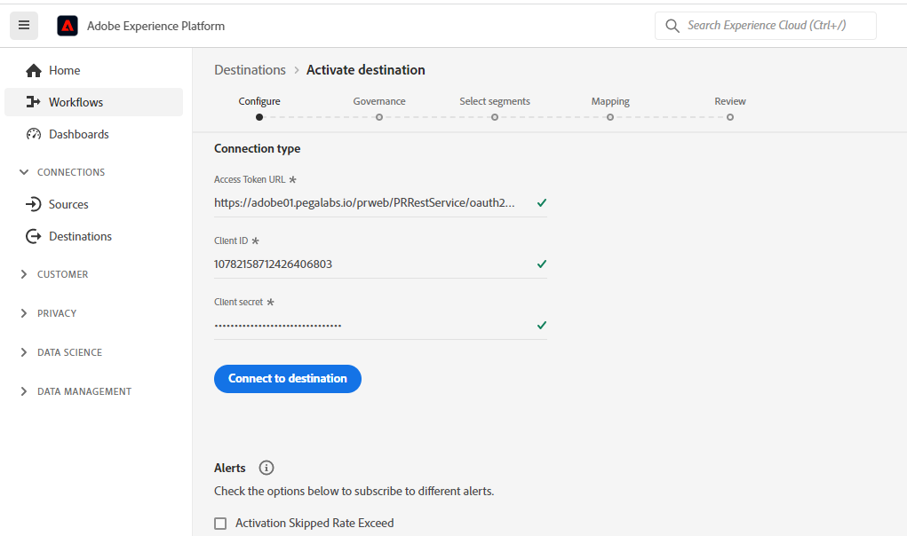
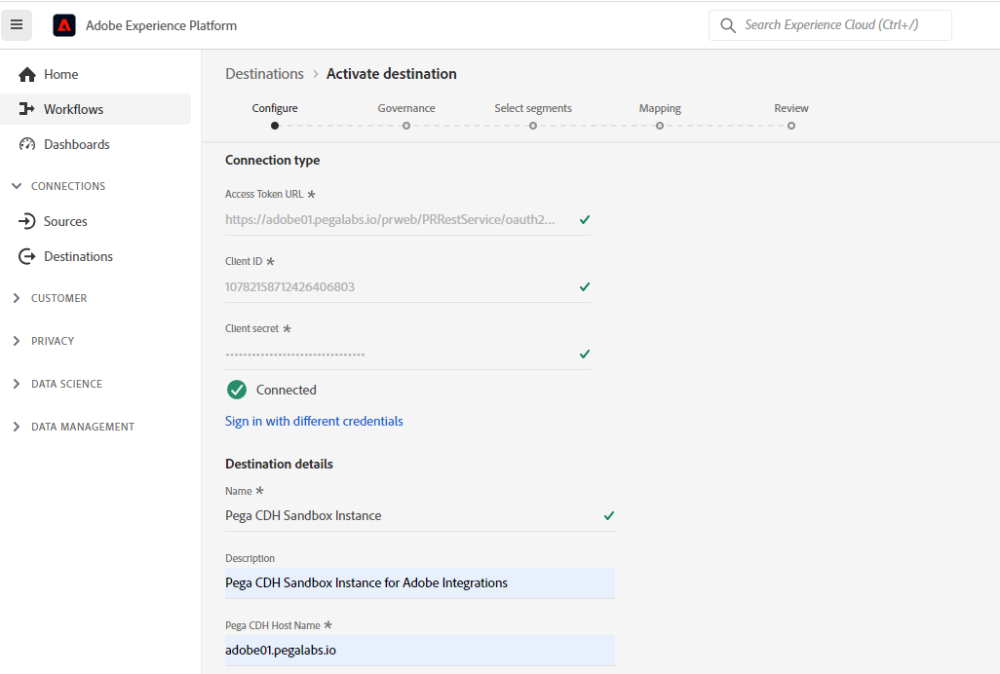
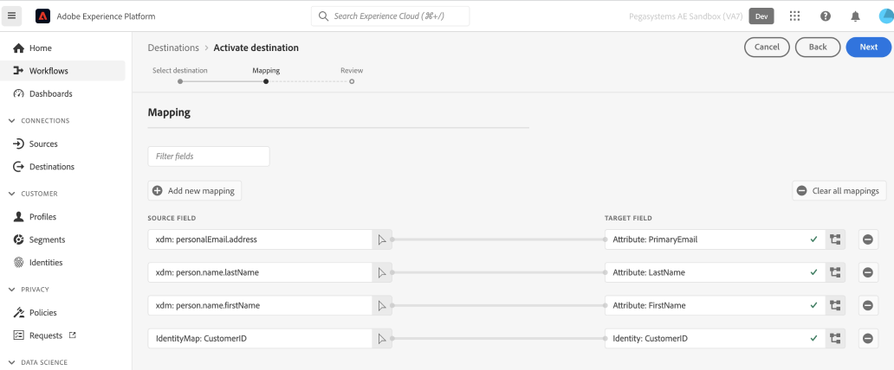
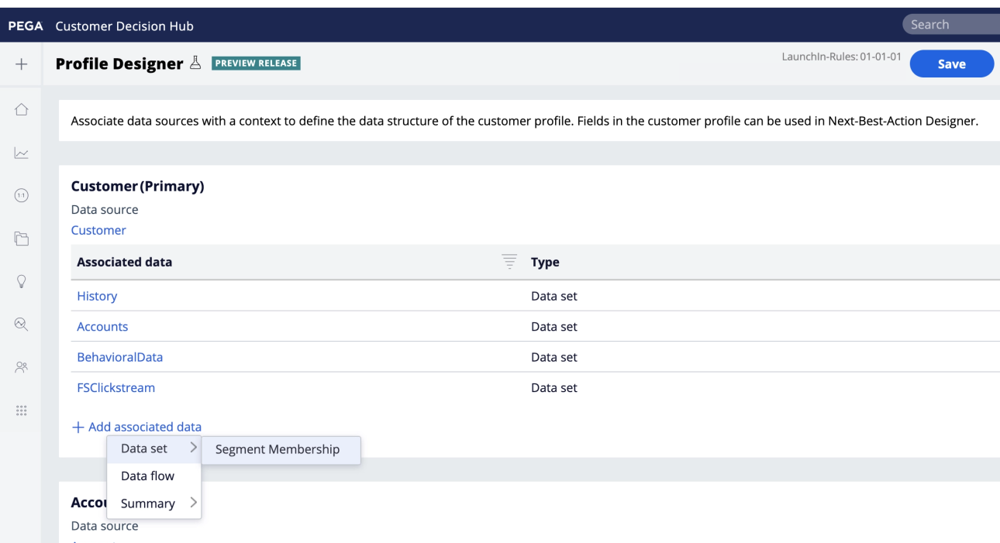
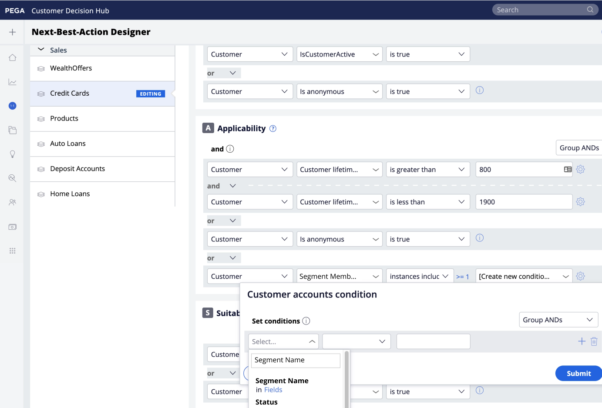
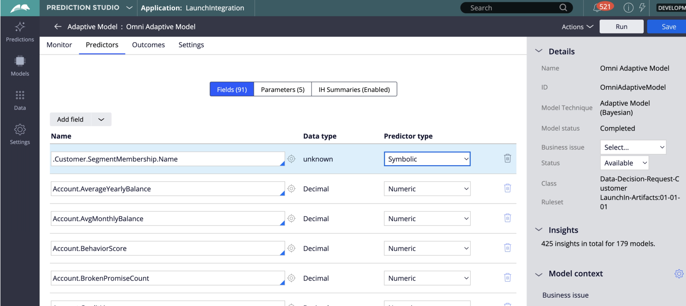

# Pega CDH Realtime Audience connection

>[!IMPORTANT]
>
>このバージョンのPega Customer Decision Hub Realtime Audience宛先は、単一のPega Customer Decision アプリケーションのみをサポートします。 複数のPega Customer Decision Hub アプリケーションを設定している場合は、[ （V2） Pega CDH Realtime Audience宛先コネクタ ](./pega-v2.md)を使用する必要があります。

## 概要 {#overview}

[!DNL Pega Customer Decision Hub]の[!DNL Adobe Experience Platform] Realtime Audience宛先を使用して、プロファイル属性とオーディエンスメンバーシップデータを[!DNL Pega Customer Decision Hub]に送信し、次善のアクションを決定します。

[!DNL Adobe Experience Platform]のプロファイルオーディエンスメンバーシップは、[!DNL Pega Customer Decision Hub]に読み込まれると、アダプティブモデルの予測子として使用でき、次善のアクション決定の目的のために適切なコンテクストデータと行動データを提供するのに役立ちます。

>[!IMPORTANT]
>
>この宛先コネクタとドキュメントページは、Pegasystemsによって作成および管理されます。 問い合わせやアップデートのリクエストについては、Pegaに直接[こちら](mailto:support@pega.com)までお問い合わせください。

## ユースケース {#use-cases}

[!DNL Customer Decision Hub]宛先を使用する方法とタイミングをより理解しやすくするために、[!DNL Adobe Experience Platform]のお客様がこの宛先を使用して解決できるユースケースの例を次に示します。

### 通信業 {#telecommunications}

マーケターは、顧客エンゲージメントのために[!DNL Pega Customer Decision Hub]が提供する、データサイエンスモデルベースの次善のアクションからのインサイトを活用したいと考えています。 [!DNL Pega Customer Decision Hub]はお客様の意図に大きく依存しています。例えば、「Interested_In_5G」、「Interested_in_Unlimited_Dataplan」、「Interest_in_iPhone_accessories」などです。

### 金融機関 {#financial-services}

マーケターは、年金プランまたは退職プランのニュースレターを購読または購読解除した顧客に対するオファーを最適化したいと考えています。 金融機関は、自社のCRMから複数の顧客IDを[!DNL Adobe Experience Platform]に取り込み、自社のオフラインデータからオーディエンスを構築し、オーディエンスに出入りするプロファイルを[!DNL Pega Customer Decision Hub]に送信して、アウトバウンドチャネルでの次善のアクション（NBA）決定を行うことができます。

## 前提条件 {#prerequisites}

この宛先を使用して[!DNL Adobe Experience Platform]からデータを書き出す前に、[!DNL Pega Customer Decision Hub]で次の前提条件を満たしていることを確認してください。

* [ インスタンスで](https://docs.pega.com/bundle/components/page/customer-decision-hub/components/adobe-membership-component.html)Adobe Experience Platform プロファイルとオーディエンスメンバーシップ統合コンポーネント [!DNL Pega Customer Decision Hub]を設定します。
* [ インスタンスのクライアント資格情報](https://docs.pega.com/bundle/platform/page/platform/security/configure-oauth-2-client-registration.html)付与タイプを使用して、OAuth 2.0 [!DNL Pega Customer Decision Hub] クライアント登録を設定します。
* [ インスタンスのAdobe Audience Membership データフロー用に](https://docs.pega.com/bundle/platform/page/platform/decision-management/data-flow-run-real-time-create.html) リアルタイム実行データフロー[!DNL Pega Customer Decision Hub]を設定します。

## サポートされている ID {#supported-identities}

[!DNL Pega Customer Decision Hub]は、次の表に示すカスタム ユーザーIDのアクティブ化をサポートしています。 詳しくは、[ID](/help/identity-service/features/namespaces.md)を参照してください。

| ターゲット ID | 説明 |
|---|---|
| *CustomerID* | [!DNL Pega Customer Decision Hub]および[!DNL Adobe Experience Platform]のプロファイルを一意に識別する共通ユーザー識別子 |

{style="table-layout:auto"}

## サポートされるオーディエンス {#supported-audiences}

この節では、この宛先に書き出すことができるオーディエンスのタイプについて説明します。

| オーディエンスの由来 | サポートあり | 説明 |
|---------|----------|----------|
| [!DNL Segmentation Service] | ○ | Experience Platform [ セグメント化サービス ](../../../segmentation/home.md)を通じて生成されたオーディエンス。 |
| その他すべてのオーディエンスの生成元 | × | このカテゴリには、[!DNL Segmentation Service]を通じて生成されたオーディエンス以外のすべてのオーディエンスのオリジンが含まれます。 [様々なオーディエンスの起源](/help/segmentation/ui/audience-portal.md#customize)について読みます。 次に例を示します。 <ul><li> カスタムアップロードオーディエンス [がCSV ファイルからExperience Platformに](../../../segmentation/ui/audience-portal.md#import-audience)をインポートしました。</li><li> 類似オーディエンス， </li><li> 連合オーディエンス， </li><li> [!DNL Adobe Journey Optimizer]などの他のExperience Platform アプリで生成されたオーディエンス </li><li> その他。 </li></ul> |

{style="table-layout:auto"}

オーディエンスのデータタイプ別にサポートされるオーディエンス：

| オーディエンスのデータタイプ | サポートあり | 説明 | ユースケース |
|--------------------|-----------|-------------|-----------|
| [人物オーディエンス ](/help/segmentation/types/people-audiences.md) | ○ | 顧客プロファイルにもとづいて、マーケティング施策の特定のグループをターゲットにすることができます。 | 買い物客やカートの放棄が多い |
| [ アカウントオーディエンス ](/help/segmentation/types/account-audiences.md) | × | アカウントベースドマーケティング戦略のために、特定の組織内の個人をターゲットにします。 | B2B マーケティング |
| [見込みオーディエンス ](/help/segmentation/types/prospect-audiences.md) | × | まだ顧客ではないが、ターゲットオーディエンスと特徴を共有する個人をターゲットにします。 | サードパーティデータによる見込み顧客の開拓 |
| [ データセットの書き出し](/help/catalog/datasets/overview.md) | × | [!DNL Adobe Experience Platform] データ レイクに保存されている構造化データのコレクション。 | レポート，データサイエンスワークフロー |

{style="table-layout:auto"}

## 書き出しのタイプと頻度 {#export-type-frequency}

宛先の書き出しのタイプと頻度について詳しくは、以下の表を参照してください。

| 項目 | タイプ | メモ |
|---------|----------|---------|
| 書き出しタイプ | **[!UICONTROL Profile-based]** | 識別子（*CustomerID*）、属性（姓、名、場所など）、オーディエンスメンバーシップデータを含むオーディエンスのすべてのメンバーを書き出します。 |
| 書き出し頻度 | **[!UICONTROL Streaming]** | ストリーミング宛先は、常にAPI ベースの接続です。 オーディエンスの評価に基づいてExperience Platformでプロファイルが更新されるとすぐに、コネクターは更新をダウンストリームの宛先プラットフォームに送信します。 詳しくは、[ ストリーミング宛先](/help/destinations/destination-types.md#streaming-destinations)を参照してください。 |

{style="table-layout:auto"}

## 宛先への接続 {#connect}

この宛先に接続するには、[宛先設定のチュートリアル](../../ui/connect-destination.md)の手順に従ってください。宛先の設定ワークフローで、以下の 2 つのセクションにリストされているフィールドに入力します。

### 宛先に対する認証 {#authenticate}

#### OAuth 2 クライアント資格情報認証 {#oauth-2-client-credentials-authentication}

以下のフィールドに入力し、**[!UICONTROL Connect to destination]**&#x200B;を選択します。

* **[!UICONTROL Access Token URL]**: [!DNL Pega Customer Decision Hub] インスタンスのOAuth 2 アクセストークン URL。
* **[!UICONTROL Client ID]**: [!DNL client ID] インスタンスで生成したOAuth 2 [!DNL Pega Customer Decision Hub]。
* **[!UICONTROL Client Secret]**: [!DNL client secret] インスタンスで生成したOAuth 2 [!DNL Pega Customer Decision Hub]。

### 宛先の詳細の入力 {#destination-details}

[!DNL Pega Customer Decision Hub]への認証接続を確立したら、宛先に次の情報を提供します。

宛先の詳細を設定するには、必須フィールドに入力し、**[!UICONTROL Next]**&#x200B;を選択します。

* **[!UICONTROL Name]**：今後この宛先を認識する際に使用する名前。
* **[!UICONTROL Description]**：今後この宛先を特定するのに役立つ説明です。
* **[!UICONTROL Pega CDH Host Name]**: プロファイルがJSON データとしてエクスポートされるPega Customer Decision Hub ホスト名。

## この宛先に対してオーディエンスをアクティブ化 {#activate}

>[!IMPORTANT]
>
>* データをアクティブ化するには、**[!UICONTROL View Destinations]**、**[!UICONTROL Activate Destinations]**、**[!UICONTROL View Profiles]**&#x200B;および&#x200B;**[!UICONTROL View Segments]** [ アクセス制御権限](/help/access-control/home.md#permissions)が必要です。 [アクセス制御の概要](/help/access-control/ui/overview.md)を参照するか、製品管理者に問い合わせて必要な権限を取得してください。
>* *ID*&#x200B;をエクスポートするには、**[!UICONTROL View Identity Graph]** [ アクセス制御権限](/help/access-control/home.md#permissions)が必要です。  {width="100" zoomable="yes"}

この宛先に対するオーディエンスのアクティブ化の手順については、[ ストリーミングプロファイル書き出し宛先に対するオーディエンスデータのアクティブ化](../../ui/activate-streaming-profile-destinations.md)を参照してください。

### 宛先属性 {#attributes}

[[!UICONTROL Select attributes]](../../ui/activate-streaming-profile-destinations.md#select-attributes) ステップでは、Adobeは[結合スキーマ ](../../../profile/home.md#profile-fragments-and-union-schemas)から一意のIDを選択することをお勧めします。 宛先に書き出す一意の ID およびその他の XDM フィールドを選択します。

### マッピングの例：[!DNL Pega Customer Decision Hub]でのプロファイル更新のアクティブ化 {#mapping-example}

以下は、プロファイルを[!DNL Pega Customer Decision Hub]に書き出す際の正しいID マッピングの例です。

ソースフィールドの選択：

* [!DNL Adobe Experience Platform]と[!DNL Pega Customer Decision Hub]のプロファイルを一意に識別するソース IDとして、識別子（CustomerIDなど）を選択します。
* [!DNL Pega Customer Decision Hub]で書き出して更新する必要があるXDM ソースプロファイル属性の変更を選択します。

ターゲットフィールドの選択：

* ターゲット IDとして`CustomerID`名前空間を選択します。
* 対応するXDM ソースプロファイル属性にマッピングする必要がある宛先プロファイル属性名を選択します。

## 書き出されたデータ／データ書き出しの検証 {#exported-data}

プロファイルのオーディエンスメンバーシップの更新が成功すると、Pega マーケティングオーディエンスメンバーシップデータストアにオーディエンス識別子、名前、ステータスが挿入されます。 メンバーシップ データは、次に示すように、[!DNL Pega Customer Decision Hub]のCustomer Profile Designerを使用しているお客様に関連付けられます。
を使用して、Adobe オーディエンスメンバーシップ データをお客様に関連付けることができるUI画面の画像

オーディエンスメンバーシップのデータは、次に示すように、次善のアクションの決定に関するPega Next-Best-Action Designer Engagement policiesで使用されます。

以下に示すように、顧客オーディエンスメンバーシップデータフィールドは、アダプティブモデルの予測子として追加されます。
を使用して、アダプティブモデルでオーディエンスメンバーシップフィールドを予測子として追加できるUI画面の画像

## その他のリソース {#additional-resources}

詳しくは、次の[!DNL Pega] ドキュメントのリソースを参照してください。

* [OAuth 2.0 クライアント登録の設定](https://docs.pega.com/bundle/platform/page/platform/security/configure-oauth-2-client-registration.html)
* [ データフローのリアルタイム実行の作成](https://docs.pega.com/bundle/platform/page/platform/decision-management/data-flow-run-real-time-create.html)
* [お客様プロファイル Designer](https://docs.pega.com/bundle/customer-decision-hub/page/customer-decision-hub/implement/profile-designer-data-management.html)で顧客レコードを管理する

## データの使用とガバナンス {#data-usage-governance}

[!DNL Adobe Experience Platform] のすべての宛先は、データを処理する際のデータ使用ポリシーに準拠しています。[!DNL Adobe Experience Platform] がどのようにデータガバナンスを実施するかについて詳しくは、[データガバナンスの概要](/help/data-governance/home.md)を参照してください。
