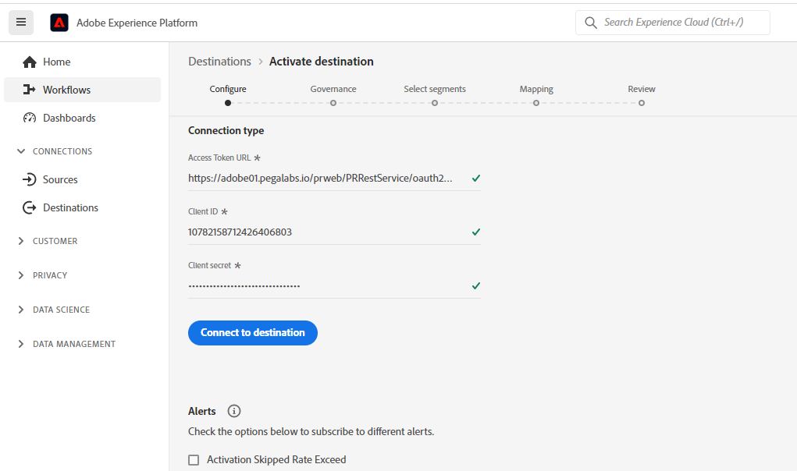

# Pega Customer Decision Hub 接続

## 概要 {#overview}

Adobe Experience Platformの [!DNL Pega Customer Decision Hub] の宛先を使用して、プロファイル属性とオーディエンスメンバーシップデータを [!DNL Pega Customer Decision Hub] に送信し、次善のアクションの意思決定を行います。

Adobe Experience Platformのプロファイルオーディエンスメンバーシップは、[!DNL Pega Customer Decision Hub] に読み込まれると、アダプティブモデルの予測因子として使用でき、次善のアクションの意思決定を目的とした適切なコンテキストデータや行動データを提供するのに役立ちます。

>[!IMPORTANT]
>
>この宛先コネクタとドキュメントページは、Pegasystems が作成および管理します。 お問い合わせや更新のリクエストについては、Pega に直接お問い合わせください [ こちら ](mailto:support@pega.com)。

## ユースケース

[!DNL Customer Decision Hub] の宛先を使用する方法とタイミングをより深く理解するために、Adobe Experience Platformのお客様がこの宛先を使用して解決できるユースケースのサンプルを以下に示します。

### 通信業

マーケターは、[!DNL Pega Customer Decision Hub] が顧客エンゲージメントのために提供する、データサイエンスモデルベースの次善のアクションからのインサイトを活用したいと考えています。 [!DNL Pega Customer Decision Hub] れは、お客様の意図に大きく依存しています。例えば、「Interested_In_5G」、「Interested_in_Unlimited_Dataplan」、「Interest_in_iPhone_accessories」などです。

### 金融機関

マーケターは、年金プランや退職金プランのニュースレターを購読または購読解除した顧客に対するオファーを最適化したいと考えています。 金融サービス企業は、自社の CRM からAdobe Experience Platformに複数の顧客 ID を取り込み、自社のオフラインデータからオーディエンスを作成し、オーディエンスをエントリおよび離脱するプロファイルを送信して、アウトバウンドチャネルでの次善の策 [!DNL Pega Customer Decision Hub] （NBA）を決定できます。

## 前提条件 {#prerequisites}

この宛先を使用してAdobe Experience Platformからデータを書き出す前に、[!DNL Pega Customer Decision Hub] で次の前提条件を満たしていることを確認してください。

* [Adobe Experience Platform プロファイルとオーディエンスメンバーシップの統合コンポーネント ](https://docs.pega.com/component/customer-decision-hub/adobe-experience-platform-profile-and-segment-membership-integration-component) を [!DNL Pega Customer Decision Hub] インスタンスに設定します。
* [!DNL Pega Customer Decision Hub] インスタンスで、OAuth 2.0[ クライアント資格情報を使用したクライアント登録 ](https://docs.pega.com/security/87/creating-and-configuring-oauth-20-client-registration) 付与タイプを設定します。
* [!DNL Pega Customer Decision Hub] インスタンスでAdobeのオーディエンスメンバーシップデータフローを使用するには、[ リアルタイム実行データフロー ](https://docs.pega.com/decision-management/87/creating-real-time-run-data-flows) を設定します。

## サポートされている ID {#supported-identities}

[!DNL Pega Customer Decision Hub] では、以下の表で説明するカスタムユーザー ID のアクティベーションをサポートしています。 詳しくは、[ID](/help/identity-service/features/namespaces.md) を参照してください。

| ターゲット ID | 説明 |
|---|---|
| *顧客 ID* | [!DNL Pega Customer Decision Hub] およびAdobe Experience Platformでプロファイルを一意に識別する共通のユーザー ID |

{style="table-layout:auto"}

## 書き出しのタイプと頻度 {#export-type-frequency}

宛先の書き出しのタイプと頻度について詳しくは、以下の表を参照してください。

| 項目 | タイプ | メモ |
---------|----------|---------|
| 書き出しタイプ | **[!UICONTROL プロファイルベース]** | 識別子（*顧客 ID*）、属性（姓、名、場所など）を持つオーディエンスのすべてのメンバーを書き出します。 およびオーディエンスメンバーシップデータ。 |
| 書き出し頻度 | **[!UICONTROL ストリーミング]** | ストリーミングの宛先は常にオンの API ベースの接続です。 オーディエンスの評価に基づいて、Experience Platform内でプロファイルが更新されるとすぐに、コネクタは更新を宛先プラットフォームに送信します。 詳しくは、[ ストリーミングの宛先 ](/help/destinations/destination-types.md#streaming-destinations) を参照してください。 |

{style="table-layout:auto"}

## 宛先への接続 {#connect}

この宛先に接続するには、[宛先設定のチュートリアル](../../ui/connect-destination.md)の手順に従ってください。宛先の設定ワークフローで、以下の 2 つのセクションにリストされているフィールドに入力します。

### 宛先に対する認証 {#authenticate}

#### OAuth 2 クライアント資格情報認証 {#oauth-2-client-credentials-authentication}

以下のフィールドに入力し、「**[!UICONTROL 宛先に接続]**」を選択します。

* **[!UICONTROL アクセストークン URL]**：お使いの [!DNL Pega Customer Decision Hub] インスタンスの OAuth 2 アクセストークン URL。
* **[!UICONTROL クライアント ID]**:[!DNL Pega Customer Decision Hub] インスタンスで生成した OAuth 2 [!DNL client ID]。
* **[!UICONTROL クライアント秘密鍵]**:[!DNL Pega Customer Decision Hub] インスタンスで生成した OAuth 2 [!DNL client secret]。

### 宛先の詳細の入力 {#destination-details}

[!DNL Pega Customer Decision Hub] への認証接続を確立したら、宛先の次の情報を指定します。

宛先の詳細を設定するには、必須フィールドに入力し、「**[!UICONTROL 次へ]**」を選択します。

* **[!UICONTROL 名前]**：今後この宛先を認識するための名前。
* **[!UICONTROL 説明]**：今後この宛先を識別するのに役立つ説明。
* **[!UICONTROL ホスト名]**：プロファイルが JSON データとして書き出される Pega Customer Decision Hub ホスト名。

## この宛先に対してオーディエンスをアクティブ化 {#activate}

>[!IMPORTANT]
> 
>* データをアクティブ化するには、**[!UICONTROL 宛先の表示]**、**[!UICONTROL 宛先のアクティブ化]**、**[!UICONTROL プロファイルの表示]** および **[!UICONTROL セグメントの表示]**[ アクセス制御権限 ](/help/access-control/home.md#permissions) が必要です。 [アクセス制御の概要](/help/access-control/ui/overview.md)を参照するか、製品管理者に問い合わせて必要な権限を取得してください。
>* *ID* を書き出すには、**[!UICONTROL ID グラフの表示]**[ アクセス制御権限 ](/help/access-control/home.md#permissions) が必要です。  {width="100" zoomable="yes"}

この宛先にオーディエンスをアクティブ化する手順については、[ ストリーミングプロファイル書き出し宛先に対するオーディエンスデータのアクティブ化 ](../../ui/activate-streaming-profile-destinations.md) を参照してください。

### 宛先属性 {#attributes}

[[!UICONTROL 属性を選択]](../../ui/activate-streaming-profile-destinations.md#select-attributes)の手順では、[和集合スキーマ](../../../profile/home.md#profile-fragments-and-union-schemas)から一意の ID を選択することをお勧めします。宛先に書き出す一意の ID およびその他の XDM フィールドを選択します。

### マッピングの例：[!DNL Pega Customer Decision Hub] でのプロファイル更新のアクティブ化 {#mapping-example}

プロファイルを [!DNL Pega Customer Decision Hub] に書き出す際の正しい ID マッピングの例を以下に示します。

ソースフィールドを選択中：

* ID （例：CustomerID）を、Adobe Experience Platformおよび [!DNL Pega Customer Decision Hub] でプロファイルを一意に識別するソース ID として選択します。
* [!DNL Pega Customer Decision Hub] で書き出しと更新が必要な XDM ソースプロファイル属性の変更を選択します。

ターゲットフィールドを選択：

* `CustomerID` 名前空間をターゲット ID として選択します。
* 対応する XDM ソースプロファイル属性にマッピングする必要がある宛先プロファイル属性名を選択します。

## 書き出されたデータ／データ書き出しの検証 {#exported-data}

プロファイルのオーディエンスメンバーシップが正常に更新されると、オーディエンスの識別子、名前およびステータスが Pega マーケティングオーディエンスメンバーシップデータストアに挿入されます。 以下に示すように、[!DNL Pega Customer Decision Hub] の顧客プロファイル Designerを使用して、メンバーシップデータがお客様に関連付けられます。

次に示すように、オーディエンスメンバーシップデータは、次善のアクションの意思決定のために、Pega の次善のアクションのDesigner エンゲージメントポリシーで使用されます。

以下に示すように、顧客オーディエンスメンバーシップデータフィールドがアダプティブモデルの予測因子として追加されます。

## その他のリソース {#additional-resources}

詳しくは、[OAuth 2.0 クライアント登録の設定 ](https://docs.pega.com/security/87/creating-and-configuring-oauth-20-client-registration) を参 [!DNL Pega Customer Decision Hub] してください。

詳しくは、[!DNL Pega Customer Decision Hub] の [ データフローのリアルタイム実行の作成 ](https://docs.pega.com/decision-management/87/creating-real-time-run-data-flows) を参照してください。

詳しくは、[ 顧客プロファイルDesignerでの顧客レコードの管理 ](https://docs.pega.com/whats-new-pega-platform/manage-customer-records-customer-profile-designer-86) を参照してください。

## データの使用とガバナンス {#data-usage-governance}

[!DNL Adobe Experience Platform] のすべての宛先は、データを処理する際のデータ使用ポリシーに準拠しています。[!DNL Adobe Experience Platform] がどのようにデータガバナンスを実施するかについて詳しくは、[データガバナンスの概要](/help/data-governance/home.md)を参照してください。
