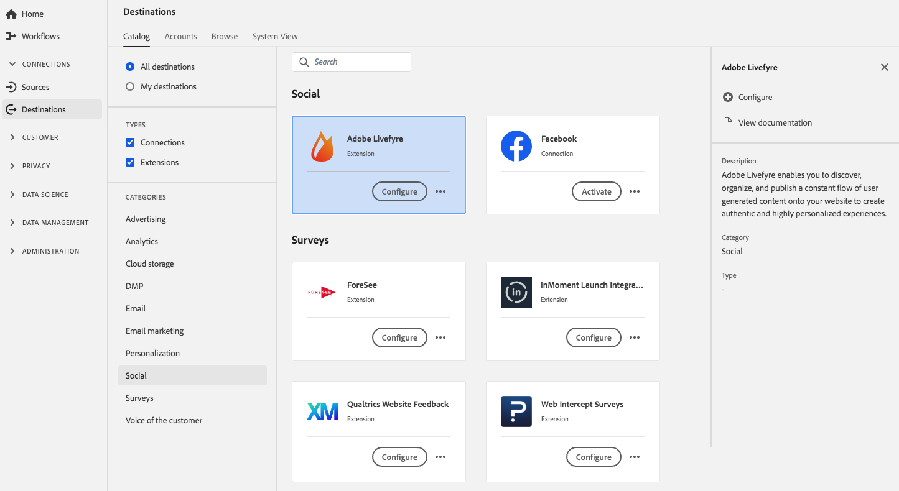

# Adobe Livefyre 拡張機能 {#adobe-livefyre-extension}

## 概要 {#overview}

Adobe Livefyre を使用すれば、一定量のユーザー作成コンテンツを発見、整理し、Webサイトに公開して、高度にパーソナライズされた本物のエクスペリエンスを作成することができます。

AdobeLivefyreは、Adobe Experience Platformのソーシャル拡張機能です。 拡張機能について詳しくは、[Adobe Exchange](https://exchange.adobe.com/experiencecloud.details.100464.html) の拡張機能のページを参照してください。

この宛先は[!DNL Adobe Experience Platform Launch]拡張です。 Platformでの[!DNL Platform Launch]Experience Platform Launchの動作について詳しくは、「[拡張機能の概要](../launch-extensions/overview.md)」を参照してください。

## 前提条件 {#prerequisites}

この拡張機能は、Platformを購入したすべての顧客の[!DNL Destinations]カタログで利用できます。

この拡張機能を使用するには、[!DNL Adobe Experience Platform Launch]にアクセスする必要があります。 [!DNL Platform Launch] は、Adobe Experience Cloud に付属の付加価値機能として提供されています。組織の管理者に問い合わせて[!DNL Platform Launch]へのアクセス権を取得し、拡張機能のインストールに必要な&#x200B;**[!UICONTROL manage_properties]**&#x200B;権限を付与するよう管理者に依頼します。

## 拡張機能のインストール {#install-extension}

Adobe Livefyre 拡張機能をインストールするには：

[Platformインターフェイス](http://platform.adobe.com/)で、**[!UICONTROL 宛先]**/**[!UICONTROL カタログ]**&#x200B;に移動します。

カタログから拡張機能を選択するか、検索バーを使用します。

宛先をクリックしてハイライトし、右側のレールで「**[!UICONTROL 設定]**」を選択します。 **[!UICONTROL Configure]**&#x200B;コントロールがグレー表示になっている場合は、**[!UICONTROL manage_properties]**&#x200B;権限がありません。 [前提条件](#prerequisites)を確認してください。

**[!UICONTROL 使用可能なPlatform launchプロパティを選択]**&#x200B;ウィンドウで、拡張機能をインストールする[!DNL Platform Launch]プロパティを選択します。 また、[!DNL Platform Launch]に新しいプロパティを作成することもできます。 プロパティは、ルール、データ要素、設定された拡張機能、環境およびライブラリの集まりです。プロパティについては、 ドキュメントの[「プロパティ」ページに関する節](../../../tags/ui/administration/companies-and-properties.md#properties-page)を参照してください。[!DNL Launch]

ワークフローで[!DNL Platform Launch]が開き、インストールが完了します。

拡張機能の設定オプションとインストールのサポートについて詳しくは、[Adobe Exchange の Adobe Livefyre](https://exchange.adobe.com/experiencecloud.details.100464.html) のページを参照してください。

拡張機能は、[Adobe Experience Platform Launchインターフェイス](https://launch.adobe.com/)に直接インストールすることもできます。  ドキュメントの[新しい拡張機能の追加](../../../tags/ui/managing-resources/extensions/overview.md#add-a-new-extension)に関するページを参照してください。[!DNL Platform Launch]

## 拡張機能の使用方法 {#how-to-use}

拡張機能をインストールしたら、[!DNL Platform Launch]で直接拡張機能のルールを設定できます。

[!DNL Platform Launch]では、特定の状況でのみ拡張機能の宛先にイベントデータを送信するように、インストールした拡張機能のルールを設定できます。 拡張機能のルールの設定について詳しくは、[ルールに関するドキュメント](../../../tags/ui/managing-resources/rules.md)を参照してください。

## 拡張機能の設定、アップグレード、削除 {#configure-upgrade-delete}

[!DNL Platform Launch]インターフェイスで、拡張機能の設定、アップグレード、削除を行うことができます。

>[!TIP]
>
>拡張機能が既にいずれかのプロパティにインストールされている場合、Platform UIには、拡張機能に対して&#x200B;**[!UICONTROL Install]**&#x200B;が表示されます。 「[拡張機能のインストール](#install-extension)」の説明にしたがってインストールワークフローを開始し、 に移動して拡張機能を設定または削除します。[!DNL Platform Launch]

拡張機能をアップグレードするには、 ドキュメントの「[拡張機能のアップグレード](../../../tags/ui/managing-resources/extensions/extension-upgrade.md)」を参照してください。[!DNL Platform Launch]
