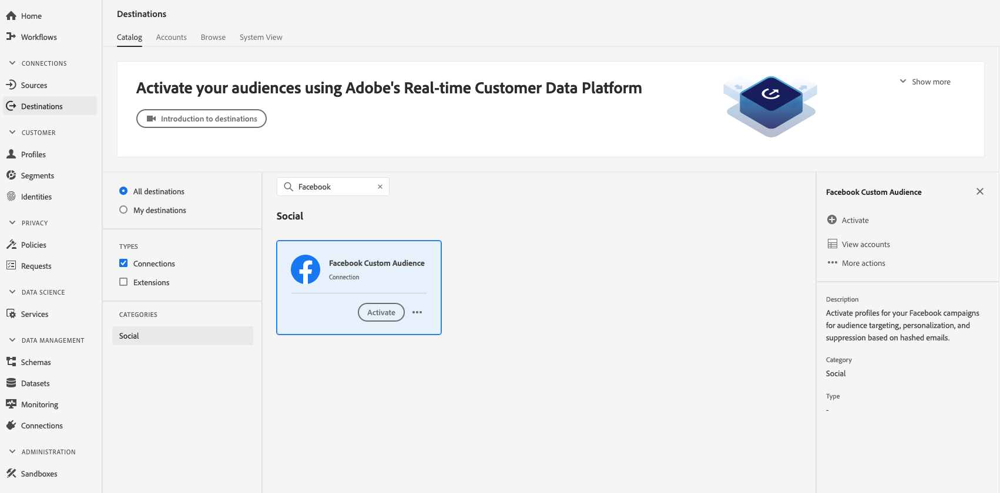
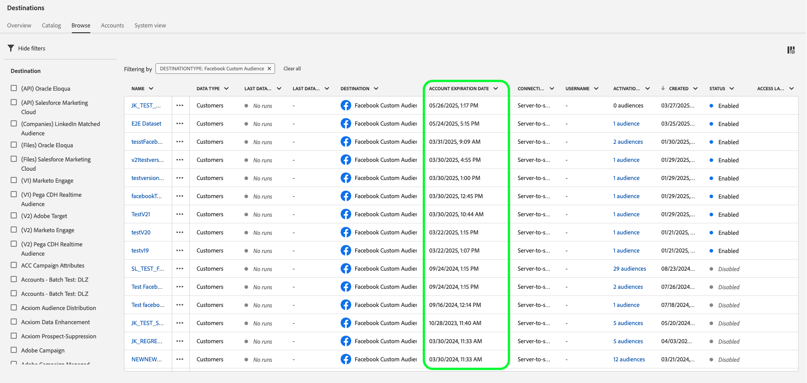
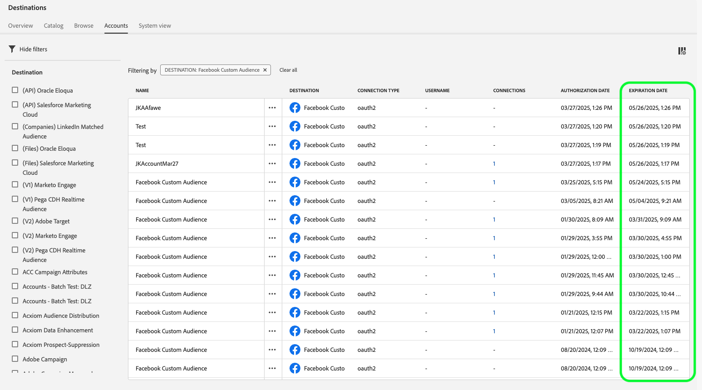
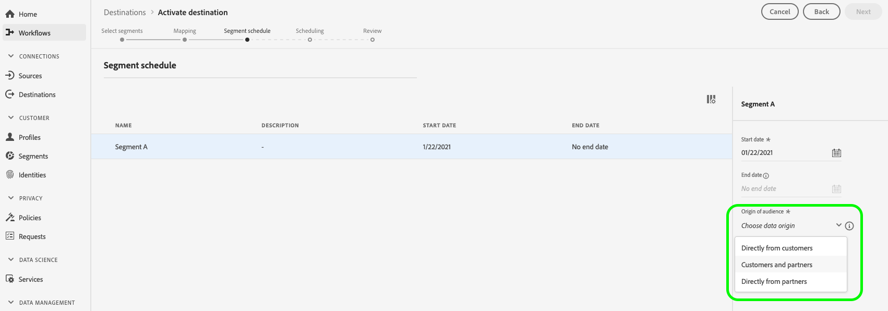
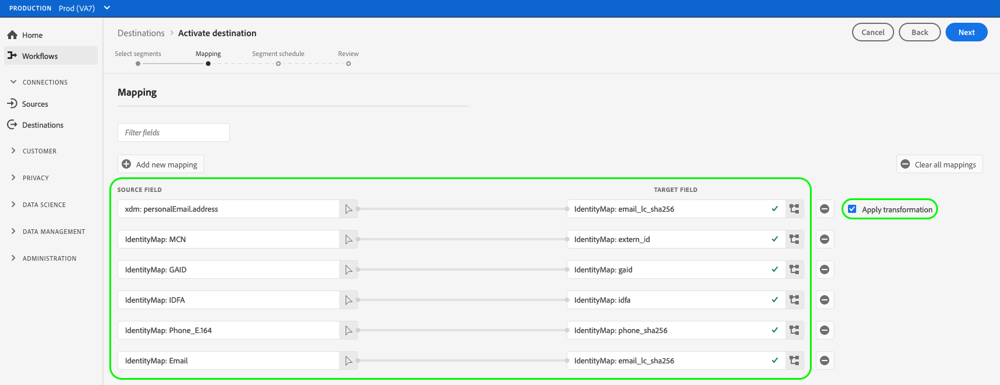

# [!DNL Facebook] 接続

## 概要 {#overview}

ハッシュ化されたメールに基づいて、オーディエンスのターゲティング、パーソナライゼーション、抑制を行うために、[!DNL Facebook] キャンペーンのプロファイルをアクティベートします。

この宛先は、[!DNL Facebook's]、[!DNL Custom Audiences]、[!DNL Facebook]、[!DNL Instagram]など、[!DNL Audience Network]でサポートされている[!DNL Messenger] ファミリのアプリ全体でオーディエンスターゲティングに使用できます。 キャンペーンを実行するアプリの選択は、[!DNL Facebook Ads Manager]のプレースメントレベルに示されます。

## ユースケース {#use-cases}

[!DNL Facebook]宛先を使用する方法とタイミングをより深く理解するために、[!DNL Adobe Experience Platform]のお客様がこの機能を使用して解決できる2つの使用例を次に示します。

### ユースケース #1 {#use-case-1}

オンラインのretailerでは、ソーシャルメディアを通じて既存顧客にリーチし、過去の注文にもとづいてパーソナライズされたオファーを提供したいと考えています。 オンライン retailerでは、独自のCRMから[!DNL Adobe Experience Platform]にメールアドレスを取り込み、独自のオフラインデータからオーディエンスを構築し、これらのオーディエンスを[!DNL Facebook] ソーシャルプラットフォームに送信して、広告費を最適化することができます。

### ユースケース #2 {#use-case-2}

ある航空会社では、様々な顧客層（ブロンズ、シルバー、ゴールド）があり、ソーシャルプラットフォームを通じて各層にパーソナライズされたオファーを提供したいと考えています。 しかし、すべてのお客様が航空会社のモバイルアプリを使用しているわけではなく、一部のお客様は航空会社のweb サイトにログインしていません。 これらの顧客について会社が持つ唯一の識別子は、メンバーシップ IDとメールアドレスです。

ソーシャルメディア全体でターゲティングするには、電子メールアドレスを識別子として使用して、CRMから[!DNL Adobe Experience Platform]に顧客データをオンボーディングできます。

次に、関連するメンバーシップ IDと顧客層を含むオフライン データを使用して、[!DNL Facebook]宛先を通じてターゲットにできる新しいオーディエンスを構築できます。

## サポートされている ID {#supported-identities}

[!DNL Facebook Custom Audiences]は、次の表に示すIDのアクティブ化をサポートしています。 [ID](/help/identity-service/features/namespaces.md) についての詳細情報。

| ターゲット ID | 説明 | 注意点 |
|---|---|---|
| `GAID` | GOOGLE ADVERTISING ID | ソース IDがGAID名前空間である場合は、GAID ターゲット IDを選択します。 |
| `IDFA` | Apple の広告主 ID | ソース IDがIDFA名前空間の場合は、IDFA ターゲット IDを選択します。 |
| `phone_sha256` | SHA256 アルゴリズムでハッシュ化された電話番号 | プレーンテキストとSHA256 ハッシュ化された電話番号の両方が[!DNL Adobe Experience Platform]でサポートされています。 「[IDに一致する要件](#id-matching-requirements-id-matching-requirements)」セクションの手順に従い、プレーンテキストとハッシュ化された電話番号にそれぞれ適切な名前空間を使用します。 ソースフィールドにハッシュ化されていない属性が含まれている場合は、**[!UICONTROL Apply transformation]** オプションをチェックして、[!DNL Experience Platform]がアクティベーション時にデータを自動的にハッシュします。 |
| `email_lc_sha256` | SHA256 アルゴリズムでハッシュ化されたメールアドレス | プレーンテキストとSHA256 ハッシュ化された電子メールアドレスの両方が[!DNL Adobe Experience Platform]でサポートされています。 「[IDに一致する要件](#id-matching-requirements-id-matching-requirements)」セクションの手順に従い、プレーンテキストとハッシュ化された電子メールアドレスにそれぞれ適切な名前空間を使用します。 ソースフィールドにハッシュ化されていない属性が含まれている場合は、**[!UICONTROL Apply transformation]** オプションをチェックして、[!DNL Experience Platform]がアクティベーション時にデータを自動的にハッシュします。 |
| `extern_id` | カスタムユーザーID | ソース IDがカスタム名前空間である場合は、このターゲット IDを選択します。 |
| `gender` | 性別 | 使用できる値： <ul><li>男性の`m`</li><li>女性の`f`</li></ul> Experience Platform **は、Facebookに送信する前に、この値を自動的に** ハッシュします。 この自動ハッシュ化は、Facebookのセキュリティおよびプライバシー要件に準拠するために必要です。 このフィールドには、**not**&#x200B;が事前にハッシュ化された値を指定します。これにより、一致するプロセスが失敗します。 |
| `date_of_birth` | 誕生日 | 使用可能な形式：`yyyy-MM-DD`。  Experience Platform **は、この値を自動的に** ハッシュしてからFacebookに送信します。 この自動ハッシュ化は、Facebookのセキュリティおよびプライバシー要件に準拠するために必要です。 このフィールドには、**not**&#x200B;が事前にハッシュ化された値を指定します。これにより、一致するプロセスが失敗します。 |
| `last_name` | 姓 | 使用可能な形式：小文字、`a-z`文字のみ、句読点なし。 特殊文字にはUTF-8 エンコーディングを使用します。   Experience Platform **は、この値を自動的に** ハッシュしてからFacebookに送信します。 この自動ハッシュ化は、Facebookのセキュリティおよびプライバシー要件に準拠するために必要です。 このフィールドには、**not**&#x200B;が事前にハッシュ化された値を指定します。これにより、一致するプロセスが失敗します。 |
| `first_name` | 名 | 使用可能な形式：小文字、`a-z`文字のみ、句読点なし、スペースなし。 特殊文字にはUTF-8 エンコーディングを使用します。   Experience Platform **は、この値を自動的に** ハッシュしてからFacebookに送信します。 この自動ハッシュ化は、Facebookのセキュリティおよびプライバシー要件に準拠するために必要です。 このフィールドには、**not**&#x200B;が事前にハッシュ化された値を指定します。これにより、一致するプロセスが失敗します。 |
| `first_name_initial` | 名（イニシャル） | 使用可能な形式：小文字、`a-z`文字のみ。 特殊文字にはUTF-8 エンコーディングを使用します。   Experience Platform **は、この値を自動的に** ハッシュしてからFacebookに送信します。 この自動ハッシュ化は、Facebookのセキュリティおよびプライバシー要件に準拠するために必要です。 このフィールドには、**not**&#x200B;が事前にハッシュ化された値を指定します。これにより、一致するプロセスが失敗します。 |
| `state` | 都道府県 | 小文字の[2文字のANSI省略形コード &#x200B;](https://en.wikipedia.org/wiki/Federal_Information_Processing_Standard_state_code)を使用します。 米国以外の州では、小文字、句読点なし、特殊文字なし、スペースは使用しません。   Experience Platform **は、この値を自動的に** ハッシュしてからFacebookに送信します。 この自動ハッシュ化は、Facebookのセキュリティおよびプライバシー要件に準拠するために必要です。 このフィールドには、**not**&#x200B;が事前にハッシュ化された値を指定します。これにより、一致するプロセスが失敗します。 |
| `city` | 市区町村 | 使用可能な形式：小文字、`a-z`文字のみ、句読点なし、特殊文字なし、スペースなし。   Experience Platform **は、この値を自動的に** ハッシュしてからFacebookに送信します。 この自動ハッシュ化は、Facebookのセキュリティおよびプライバシー要件に準拠するために必要です。 このフィールドには、**not**&#x200B;が事前にハッシュ化された値を指定します。これにより、一致するプロセスが失敗します。 |
| `zip` | 郵便番号 | 使用可能な形式：小文字、スペースなし。 米国の郵便番号の場合は、最初の5桁のみを使用します。 英国の場合は、`Area/District/Sector`形式を使用します。   Experience Platform **は、この値を自動的に** ハッシュしてからFacebookに送信します。 この自動ハッシュ化は、Facebookのセキュリティおよびプライバシー要件に準拠するために必要です。 このフィールドには、**not**&#x200B;が事前にハッシュ化された値を指定します。これにより、一致するプロセスが失敗します。 |
| `country` | 国 | 使用可能な形式：小文字の2文字の国コード （ISO 3166-1 alpha-2[形式）。  &#x200B;](https://en.wikipedia.org/wiki/ISO_3166-1_alpha-2) Experience Platform **は、この値を自動的に** ハッシュしてからFacebookに送信します。 この自動ハッシュ化は、Facebookのセキュリティおよびプライバシー要件に準拠するために必要です。 このフィールドには、**not**&#x200B;が事前にハッシュ化された値を指定します。これにより、一致するプロセスが失敗します。 |

## サポートされるオーディエンス {#supported-audiences}

この節では、この宛先に書き出すことができるオーディエンスのタイプについて説明します。

| オーディエンスの由来 | サポートあり | 説明 |
|---------|----------|----------|
| [!DNL Segmentation Service] | ○ | Experience Platform [&#x200B; セグメント化サービス &#x200B;](../../../segmentation/home.md)を通じて生成されたオーディエンス。 |
| その他すべてのオーディエンスの生成元 | × | このカテゴリには、[!DNL Segmentation Service]を通じて生成されたオーディエンス以外のすべてのオーディエンスのオリジンが含まれます。 [様々なオーディエンスの起源](/help/segmentation/ui/audience-portal.md#customize)について読みます。 次に例を示します。 <ul><li> カスタムアップロードオーディエンス [がCSV ファイルからExperience Platformに](../../../segmentation/ui/audience-portal.md#import-audience)をインポートしました。</li><li> 類似オーディエンス， </li><li> 連合オーディエンス， </li><li> [!DNL Adobe Journey Optimizer]などの他のExperience Platform アプリで生成されたオーディエンス </li><li> その他。 </li></ul> |

{style="table-layout:auto"}

オーディエンスのデータタイプ別にサポートされるオーディエンス：

| オーディエンスのデータタイプ | サポートあり | 説明 | ユースケース |
|--------------------|-----------|-------------|-----------|
| [人物オーディエンス &#x200B;](/help/segmentation/types/people-audiences.md) | ○ | 顧客プロファイルにもとづいて、マーケティング施策の特定のグループをターゲットにすることができます。 | 買い物客やカートの放棄が多い |
| [&#x200B; アカウントオーディエンス &#x200B;](/help/segmentation/types/account-audiences.md) | × | アカウントベースドマーケティング戦略のために、特定の組織内の個人をターゲットにします。 | B2B マーケティング |
| [見込みオーディエンス &#x200B;](/help/segmentation/types/prospect-audiences.md) | × | まだ顧客ではないが、ターゲットオーディエンスと特徴を共有する個人をターゲットにします。 | サードパーティデータによる見込み顧客の開拓 |
| [&#x200B; データセットの書き出し](/help/catalog/datasets/overview.md) | × | [!DNL Adobe Experience Platform] データ レイクに保存されている構造化データのコレクション。 | レポート，データサイエンスワークフロー |

{style="table-layout:auto"}

## 書き出しのタイプと頻度 {#export-type-frequency}

宛先の書き出しのタイプと頻度について詳しくは、以下の表を参照してください。

| 項目 | タイプ | メモ |
|---------|----------|---------|
| 書き出しタイプ | **[!UICONTROL Audience export]** | Facebookの宛先で使用されている識別子（名前、電話番号など）を使用して、オーディエンスのすべてのメンバーを書き出します。 |
| 書き出し頻度 | **[!UICONTROL Streaming]** | ストリーミングの宛先は常に、API ベースの接続です。オーディエンス評価に基づいて Experience Platform 内でプロファイルが更新されるとすぐに、コネクタは更新を宛先プラットフォームに送信します。[ストリーミングの宛先](/help/destinations/destination-types.md#streaming-destinations)の詳細についてはこちらを参照してください。 |

{style="table-layout:auto"}

## Facebook アカウントの前提条件 {#facebook-account-prerequisites}

オーディエンスを[!DNL Facebook]に送信する前に、次の要件を満たしていることを確認してください。

* お客様の[!DNL Facebook] ユーザーアカウントは、お客様が使用している広告アカウントを所有する[!DNL Facebook Business Account]への完全なアクセス権を持っている必要があります。
* [!DNL Facebook] ユーザーアカウントでは、使用するAd アカウントに対して&#x200B;**[!DNL Manage campaigns]**&#x200B;権限を有効にする必要があります。
* **[!DNL Adobe Experience Cloud]** ビジネス アカウントを[!DNL Facebook Ad Account]の広告パートナーとして追加する必要があります。 `business ID=206617933627973`.を使用します。詳しくは、Facebook ドキュメントの「[&#x200B; ビジネスマネージャーにパートナーを追加](https://www.facebook.com/business/help/1717412048538897)」を参照してください。

  >[!IMPORTANT]
  >
  > [!DNL Adobe Experience Cloud]の権限を設定する場合、**キャンペーンの管理**&#x200B;権限を有効にする必要があります。 [!DNL Adobe Experience Platform]統合に必要な権限。

* [!DNL Facebook Custom Audiences]の利用条件を読んで署名します。 これを行うには、`https://business.facebook.com/ads/manage/customaudiences/tos/?act=[accountID]&business_id=206617933627973`に移動します。ここで、`accountID`は[!DNL Facebook Ad Account ID]です。 利用規約に署名する際は、URLに`business_id=206617933627973` セクションが存在することを確認してください。

  >[!IMPORTANT]
  >
  >[!DNL Facebook Custom Audiences]利用規約に署名する際は、Facebook APIでの認証に使用したのと同じユーザーアカウントを使用してください。

## ID一致の要件 {#id-matching-requirements}

[!DNL Facebook]では、個人を特定できる情報（PII）が明確に送信されていないことが必要です。 したがって、[!DNL Facebook]にアクティブ化されたオーディエンスは、電子メールアドレスや電話番号などの&#x200B;*ハッシュ*&#x200B;識別子にキーを設定できます。

[!DNL Adobe Experience Platform]に取り込むIDの種類に応じて、対応する要件を遵守する必要があります。

## オーディエンスマッチ率の最大化 {#match-rates}

[!DNL Facebook]で最も高いオーディエンスの一致率を達成するには、`phone_sha256`および`email_lc_sha256`のターゲット IDを使用することを強くお勧めします。

これらの識別子は、[!DNL Facebook]がプラットフォームをまたいでオーディエンスを一致させるために使用する主要な識別子です。 ソースデータがこれらのターゲット IDに適切にマッピングされ、[!DNL Facebook's] ハッシュ要件に準拠していることを確認します。

## 電話番号のハッシュ要件 {#phone-number-hashing-requirements}

[!DNL Facebook]で電話番号をアクティブ化するには、次の2つの方法があります。

* **未加工の電話番号を取り込む**: [!DNL E.164]形式の未加工の電話番号を[!DNL Experience Platform]に取り込むことができます。 アクティベーション時に自動的にハッシュ化されます。 このオプションを選択した場合は、必ず未加工の電話番号を`Phone_E.164`名前空間に取り込んでください。
* **ハッシュ化された電話番号の取り込み**: [!DNL Experience Platform]に取り込む前に、電話番号を事前にハッシュ化できます。 このオプションを選択した場合は、ハッシュ化された電話番号を常に`Phone_SHA256`名前空間に取り込んでください。

>[!NOTE]
>
>`Phone`名前空間に取り込まれた電話番号は、[!DNL Facebook]ではアクティブ化できません。

## メールハッシュ要件 {#email-hashing-requirements}

メールアドレスを[!DNL Adobe Experience Platform]に取り込む前にハッシュ化するか、Experience Platformでクリアなメールアドレスを使用して、アクティベーション時に[!DNL Experience Platform]個ハッシュ化します。

Experience Platformでのメールアドレスの取り込みについて詳しくは、[&#x200B; バッチ取り込みの概要](/help/ingestion/batch-ingestion/overview.md)および[&#x200B; ストリーミング取り込みの概要](/help/ingestion/streaming-ingestion/overview.md)を参照してください。

自分でメールアドレスをハッシュ化することを選択した場合は、次の要件に必ず準拠してください。

* メール文字列からすべての先頭および末尾のスペースをトリミングします。例：`johndoe@example.com`ではなく`<space>johndoe@example.com<space>`。
* メール文字列をハッシュする場合は、必ず小文字の文字列をハッシュしてください。
   * 例：`example@email.com`ではなく`EXAMPLE@EMAIL.COM`;
* ハッシュ化された文字列がすべて小文字であることを確認します
   * 例：`55e79200c1635b37ad31a378c39feb12f120f116625093a19bc32fff15041149`ではなく`55E79200C1635B37AD31A378C39FEB12F120F116625093A19bC32FFF15041149`;
* 文字列をソルトしないでください。

>[!NOTE]
>
>ハッシュ化されていない名前空間からのデータは、アクティベーション時に[!DNL Experience Platform]によって自動的にハッシュ化されます。
> 属性ソースデータは自動的にハッシュ化されません。 ソースフィールドにハッシュ化されていない属性が含まれている場合は、**[!UICONTROL Apply transformation]** オプションをチェックして、[!DNL Experience Platform]がアクティベーション時にデータを自動的にハッシュします。
> **[!UICONTROL Apply transformation]** オプションは、ソースフィールドとして属性を選択した場合にのみ表示されます。 名前空間を選択しても表示されません。

## カスタム名前空間の使用 {#custom-namespaces}

`Extern_ID`名前空間を使用して[!DNL Facebook]にデータを送信する前に、[!DNL Facebook Pixel]を使用して独自の識別子を同期してください。 詳しくは、[Facebook公式ドキュメント &#x200B;](https://developers.facebook.com/docs/marketing-api/audiences/guides/custom-audiences/#external_identifiers)を参照してください。

## 宛先への接続 {#connect}

>[!IMPORTANT]
>
>宛先に接続するには、**[!UICONTROL View Destinations]**&#x200B;および&#x200B;**[!UICONTROL Manage Destinations]** [&#x200B; アクセス制御権限](/help/access-control/home.md#permissions)が必要です。 詳しくは、[アクセス制御の概要](/help/access-control/ui/overview.md)または製品管理者に問い合わせて、必要な権限を取得してください。

この宛先に接続するには、[宛先設定のチュートリアル](../../ui/connect-destination.md)の手順に従ってください。宛先の設定ワークフローで、以下の 2 つのセクションにリストされているフィールドに入力します。

以下のビデオでは、[!DNL Facebook]宛先を設定し、オーディエンスをアクティブ化する手順も示しています。

>[!VIDEO](https://video.tv.adobe.com/v/3411787/?quality=12&learn=on&captions=jpn)

>[!NOTE]
>
>Adobe Experience Platform のユーザーインターフェイスは頻繁に更新され、このビデオが録画された後に変更されている可能性があります。 最新の情報については、[宛先設定チュートリアル &#x200B;](../../ui/connect-destination.md)を参照してください。

### 宛先に対する認証 {#authenticate}

1. 宛先カタログでFacebookの宛先を検索し、**[!UICONTROL Set Up]**&#x200B;を選択します。
2. **[!UICONTROL Connect to destination]** を選択します。
   
3. Facebookの資格情報を入力し、**ログイン**&#x200B;を選択します。

### 認証情報を更新 {#refresh-authentication-credentials}

Facebook認証トークンは60日ごとに有効期限が切れます。 トークンの有効期限が切れると、宛先へのデータ書き出しが機能しなくなります。

トークンの有効期限は、**[!UICONTROL Account expiration date]** タブまたは&#x200B;**[[!UICONTROL Accounts]](../../ui/destinations-workspace.md#accounts)** タブの&#x200B;**[[!UICONTROL Browse]](../../ui/destinations-workspace.md#browse)**&#x200B;列から監視できます。

「参照」タブの「

「アカウント」タブの「

アクティベーションデータフローで中断が発生するトークンの有効期限を防ぐには、次の手順を実行して再認証します。

1. **[!UICONTROL Destinations]** > **[!UICONTROL Accounts]**&#x200B;に移動します
2. （オプション）ページで使用可能なフィルターを使用して、Facebook アカウントのみを表示します。
   
3. 更新するアカウントを選択し、省略記号を選択して&#x200B;**[!UICONTROL Edit details]**&#x200B;を選択します。
   
4. モーダルウィンドウで、**[!UICONTROL Reconnect OAuth]**&#x200B;を選択し、Facebookの資格情報で再認証します。
   OAuthの再接続オプションを含む

>[!SUCCESS]
>
>認証情報が更新され、有効期限が60日にリセットされます。

### 宛先の詳細の入力 {#destination-details}

>[!CONTEXTUALHELP]
>id="platform_destinations_connect_facebook_accountid"
>title="アカウント ID"
>abstract="Facebook 広告アカウント ID。この ID は、Facebook 広告マネージャアカウントで確認できます。この ID を入力する際には、常に接頭辞 `act_` を追加します。"

宛先の詳細を設定するには、以下の必須フィールドとオプションフィールドに入力します。UI のフィールドの横のアスタリスクは、そのフィールドが必須であることを示します。

* **[!UICONTROL Name]**：今後この宛先を認識する際に使用する名前。
* **[!UICONTROL Description]**：今後この宛先を特定するのに役立つ説明です。
* **[!UICONTROL Account ID]**：あなたの[!DNL Facebook Ad Account ID]。 このIDは[!DNL Facebook Ads Manager] アカウントで見つけることができます。 この ID を入力する際には、常に接頭辞 `act_` を追加します。

### アラートの有効化 {#enable-alerts}

アラートを有効にすると、宛先へのデータフローのステータスに関する通知を受け取ることができます。リストからアラートを選択して、データフローのステータスに関する通知を受け取るよう登録します。アラートについて詳しくは、[UI を使用した宛先アラートの購読](../../ui/alerts.md)についてのガイドを参照してください。

宛先接続の詳細の提供が完了したら、**[!UICONTROL Next]**&#x200B;を選択します。

## この宛先に対してオーディエンスをアクティブ化 {#activate}

>[!CONTEXTUALHELP]
>id="platform_destinations_activate_facebook_originofaudience"
>title="オーディエンスのオリジン"
>abstract="オーディエンス内の顧客データが最初に収集された方法を選択します。ユーザーがセグメントのターゲットになっている場合、このデータが Facebook に表示されます"

>[!CONTEXTUALHELP]
>id="platform_destinations_activate_facebook_originofaudience_customers"
>title="オーディエンスのオリジン"
>abstract="顧客からデータを直接収集した広告主。"

>[!CONTEXTUALHELP]
>id="platform_destinations_activate_facebook_originofaudience_partners"
>title="オーディエンスのオリジン"
>abstract="パートナーからデータを直接収集した広告主。"

>[!CONTEXTUALHELP]
>id="platform_destinations_activate_facebook_originofaudience_customersandpartners"
>title="オーディエンスのオリジン"
>abstract="顧客およびパートナーからデータを直接収集した広告主。"

>[!IMPORTANT]
>
>* データをアクティブ化するには、**[!UICONTROL View Destinations]**、**[!UICONTROL Activate Destinations]**、**[!UICONTROL View Profiles]**&#x200B;および&#x200B;**[!UICONTROL View Segments]** [&#x200B; アクセス制御権限](/help/access-control/home.md#permissions)が必要です。 [アクセス制御の概要](/help/access-control/ui/overview.md)を参照するか、製品管理者に問い合わせて必要な権限を取得してください。
>* *ID*&#x200B;をエクスポートするには、**[!UICONTROL View Identity Graph]** [&#x200B; アクセス制御権限](/help/access-control/home.md#permissions)が必要です。  {width="100" zoomable="yes"}

この宛先にオーディエンスをアクティブ化する手順については、[ストリーミングオーディエンス書き出し宛先に対するオーディエンスデータのアクティブ化](../../ui/activate-segment-streaming-destinations.md)を参照してください。

**[!UICONTROL Segment schedule]** ステップでは、オーディエンスを[!UICONTROL Origin of audience]に送信する際に[!DNL Facebook Custom Audiences]を指定する必要があります。

Facebook アクティベーション手順に表示される「

### マッピングの例：[!DNL Facebook Custom Audience]でのオーディエンスデータのアクティブ化 {#example-facebook}

以下は、[!DNL Facebook Custom Audience]でオーディエンスデータをアクティブ化する際の正しいID マッピングの例です。

ソースフィールドの選択：

* 使用している電子メールアドレスがハッシュ化されていない場合は、`Email`名前空間をソース IDとして選択します。
* `Email_LC_SHA256` [!DNL Experience Platform]電子メールハッシュ要件[!DNL Facebook]に従って、データ取り込み時に顧客の電子メールアドレスを[にハッシュ化した場合は、](#email-hashing-requirements)名前空間をソース IDとして選択します。
* データがハッシュ化されていない電話番号で構成されている場合は、ソース IDとして`PHONE_E.164`名前空間を選択します。 [!DNL Experience Platform]は、[!DNL Facebook]要件に準拠するために電話番号をハッシュします。
* `Phone_SHA256` [!DNL Experience Platform]電話番号ハッシュ要件[!DNL Facebook]に従って、[へのデータ取り込み時に電話番号をハッシュ化した場合、](#phone-number-hashing-requirements)名前空間をソース IDとして選択します。
* データが`IDFA` デバイス IDで構成されている場合は、[!DNL Apple]名前空間をソース IDとして選択します。
* データが`GAID` デバイス IDで構成されている場合は、[!DNL Android]名前空間をソース IDとして選択します。
* データが他のタイプのIDで構成されている場合は、ソース IDとして`Custom`名前空間を選択します。

ターゲットフィールドの選択：

* ソース名前空間が`Email_LC_SHA256`または`Email`の場合、`Email_LC_SHA256`名前空間をターゲット IDとして選択します。
* ソース名前空間が`Phone_SHA256`または`PHONE_E.164`の場合、`Phone_SHA256`名前空間をターゲット IDとして選択します。
* ソース名前空間が`IDFA`または`GAID`の場合、`IDFA`または`GAID`名前空間をターゲット IDとして選択します。
* ソース名前空間がカスタム名前空間の場合は、ターゲット IDとして`Extern_ID`名前空間を選択します。

>[!IMPORTANT]
>
>ハッシュ化されていない名前空間からのデータは、アクティベーション時に[!DNL Experience Platform]によって自動的にハッシュ化されます。
> 
>属性ソースデータは自動的にハッシュ化されません。 ソースフィールドにハッシュ化されていない属性が含まれている場合は、**[!UICONTROL Apply transformation]** オプションをチェックして、[!DNL Experience Platform]がアクティベーション時にデータを自動的にハッシュします。

## 書き出したデータ {#exported-data}

[!DNL Facebook]の場合、アクティベーションが成功すると、[!DNL Facebook][[!DNL Facebook Ads Manager]で](https://www.facebook.com/adsmanager/manage/)個のカスタムオーディエンスがプログラムで作成されます。 アクティベートされたオーディエンスに対してユーザーが適格または失格である場合、オーディエンスメンバーシップが追加および削除されます。

>[!TIP]
>
>[!DNL Adobe Experience Platform]と[!DNL Facebook]の統合は、過去のオーディエンスのバックフィルをサポートしています。 宛先に対してオーディエンスをアクティブ化すると、過去のすべてのオーディエンスの条件が[!DNL Facebook]に送信されます。

## トラブルシューティング {#troubleshooting}

### 400 Bad Request エラーメッセージ {#bad-request}

この宛先を設定する際に、次のエラーが発生する場合があります。

`{"message":"Facebook Error: Permission error","code":"400 BAD_REQUEST"}`

このエラーは、顧客が新しく作成したアカウントを使用しており、[!DNL Facebook]権限がまだアクティブでない場合に発生します。

>[!IMPORTANT]
>
>[!DNL Facebook Custom Audience Terms of Service] アカウントの前提条件`business ID 206617933627973` セクションのURL テンプレートに示すように、[の下の](#facebook-account-prerequisites)を受け入れることを確認してください。

`400 Bad Request`Facebook アカウントの前提条件[の手順に従った後、](#facebook-account-prerequisites) エラーメッセージが表示された場合は、[!DNL Facebook]権限が有効になるまでに数日かかります。

