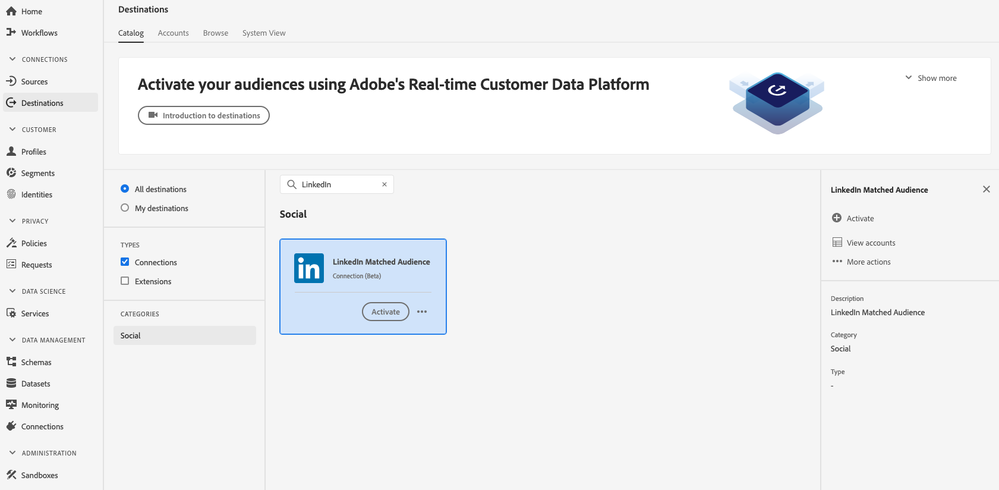

# [!DNL LinkedIn Matched Audiences] 接続

## 概要 {#overview}

ハッシュ化されたメールとモバイル IDに基づいて、オーディエンスのターゲティング、パーソナライゼーション、抑制のために[!DNL LinkedIn] キャンペーンのプロファイルをアクティブ化します。

Adobe Experience Platform UILinkedInの宛先

## ユースケース {#use-cases}

[!DNL LinkedIn Matched Audiences]宛先を使用する方法とタイミングをより深く理解するために、[!DNL Adobe Experience Platform]のお客様がこの機能を使用して解決できるユースケースを次に示します。

ソフトウェア企業は、会議を開催し、参加者と連絡を取り合い、会議への参加状況にもとづいてパーソナライズされたオファーを提供したいと考えています。 会社は、自分の[!DNL CRM]から[!DNL Adobe Experience Platform]にメールアドレスまたはモバイルデバイス IDを取り込むことができます。 次に、独自のオフラインデータからオーディエンスを構築し、これらのオーディエンスを[!DNL LinkedIn] ソーシャルプラットフォームに送信して、広告費を最適化できます。

## サポートされている ID {#supported-identities}

[!DNL LinkedIn Matched Audiences]は、次の表に示すIDのアクティブ化をサポートしています。 [ID](/help/identity-service/features/namespaces.md) についての詳細情報。

>[!IMPORTANT]
>
>2025年9月以降、[!DNL IDFA]は[!DNL IDFA]宛先でサポートされなくなったため、[!DNL LinkedIn Matched Audiences]をターゲット IDとしてマッピングできなくなります。 詳しくは、[!DNL LinkedIn Matched Audiences]統合[ ドキュメント ](https://learn.microsoft.com/en-us/linkedin/marketing/matched-audiences/create-and-manage-segment-users?view=li-lms-2025-07&tabs=http#idtypes)を参照してください。 この変更は、LinkedInの要件によるものであり、Experience Platformの宛先サービスのアップグレードとは関係ありません。

| ターゲット ID | 説明 | 注意点 |
|---|---|---|
| GAID | GOOGLE ADVERTISING ID | ソース ID が GAID 名前空間の場合は、このターゲット ID を選択します。 |
| email_lc_sha256 | SHA256 アルゴリズムでハッシュ化されたメールアドレス | プレーンテキストとSHA256 ハッシュ化された電子メールアドレスの両方が[!DNL Adobe Experience Platform]でサポートされています。 「[IDに一致する要件](#id-matching-requirements-id-matching-requirements)」セクションの手順に従い、プレーンテキストとハッシュ化されたメールにそれぞれ適切な名前空間を使用します。 ソースフィールドにハッシュ化されていない属性が含まれている場合は、**[!UICONTROL Apply transformation]** オプションをチェックして、[!DNL Experience Platform]がアクティベーション時にデータを自動的にハッシュします。 |

{style="table-layout:auto"}

## サポートされるオーディエンス {#supported-audiences}

この節では、この宛先に書き出すことができるオーディエンスのタイプについて説明します。

| オーディエンスの由来 | サポートあり | 説明 |
|---------|----------|----------|
| [!DNL Segmentation Service] | ○ | Experience Platform [ セグメント化サービス ](../../../segmentation/home.md)を通じて生成されたオーディエンス。 |
| その他すべてのオーディエンスの生成元 | ○ | このカテゴリには、[!DNL Segmentation Service]を通じて生成されたオーディエンス以外のすべてのオーディエンスのオリジンが含まれます。 [様々なオーディエンスの起源](/help/segmentation/ui/audience-portal.md#customize)について読みます。 次に例を示します。 <ul><li> カスタムアップロードオーディエンス [がCSV ファイルからExperience Platformに](../../../segmentation/ui/audience-portal.md#import-audience)をインポートしました。</li><li> 類似オーディエンス， </li><li> 連合オーディエンス， </li><li> [!DNL Adobe Journey Optimizer]などの他のExperience Platform アプリで生成されたオーディエンス </li><li> その他。 </li></ul> |

{style="table-layout:auto"}

オーディエンスのデータタイプ別にサポートされるオーディエンス：

| オーディエンスのデータタイプ | サポートあり | 説明 | ユースケース |
|--------------------|-----------|-------------|-----------|
| [人物オーディエンス ](/help/segmentation/types/people-audiences.md) | ○ | 顧客プロファイルにもとづいて、マーケティング施策の特定のグループをターゲットにすることができます。 | 買い物客やカートの放棄が多い |
| [ アカウントオーディエンス ](/help/segmentation/types/account-audiences.md) | × | アカウントベースドマーケティング戦略のために、特定の組織内の個人をターゲットにします。 | B2B マーケティング |
| [見込みオーディエンス ](/help/segmentation/types/prospect-audiences.md) | × | まだ顧客ではないが、ターゲットオーディエンスと特徴を共有する個人をターゲットにします。 | サードパーティデータによる見込み顧客の開拓 |
| [ データセットの書き出し](/help/catalog/datasets/overview.md) | × | [!DNL Adobe Experience Platform] データ レイクに保存されている構造化データのコレクション。 | レポート，データサイエンスワークフロー |

{style="table-layout:auto"}

## 書き出しのタイプと頻度 {#export-type-frequency}

宛先の書き出しのタイプと頻度について詳しくは、以下の表を参照してください。

| 項目 | タイプ | メモ |
|---------|----------|---------|
| 書き出しタイプ | **[!UICONTROL Audience export]** | [!DNL LinkedIn Matched Audiences]宛先で使用されている識別子（名前、電話番号など）を持つオーディエンスのすべてのメンバーを書き出します。 |
| 書き出し頻度 | **[!UICONTROL Streaming]** | ストリーミングの宛先は常に、API ベースの接続です。オーディエンス評価に基づいて Experience Platform 内でプロファイルが更新されるとすぐに、コネクタは更新を宛先プラットフォームに送信します。[ストリーミングの宛先](/help/destinations/destination-types.md#streaming-destinations)の詳細についてはこちらを参照してください。 |

{style="table-layout:auto"}

## LinkedIn アカウントの前提条件 {#LinkedIn-account-prerequisites}

[!UICONTROL LinkedIn Matched Audience]宛先を使用する前に、[!DNL LinkedIn Campaign Manager] アカウントが[!DNL Creative Manager]権限レベル以上であることを確認してください。

[!DNL LinkedIn Campaign Manager]のユーザー権限を編集する方法については、LinkedIn ドキュメントの「[Advertising アカウントのユーザー権限を追加、編集、削除](https://www.linkedin.com/help/lms/answer/5753)」を参照してください。

## ID一致の要件 {#id-matching-requirements}

[!DNL LinkedIn Matched Audiences]では、個人を特定できる情報（PII）が明確に送信されていないことが必要です。 したがって、[!DNL LinkedIn Matched Audiences]にアクティブ化されたオーディエンスは、電子メールアドレスやモバイルデバイス IDなどの&#x200B;*ハッシュ化*&#x200B;識別子にキーを設定できます。

[!DNL Adobe Experience Platform]に取り込むIDの種類に応じて、対応する要件を遵守する必要があります。

## メールハッシュ要件 {#email-hashing-requirements}

メールアドレスを[!DNL Adobe Experience Platform]に取り込む前にハッシュ化するか、Experience Platformでクリアなメールアドレスを使用して、アクティベーション時に[!DNL Experience Platform]個ハッシュ化します。

Experience Platformでのメールアドレスの取り込みについて詳しくは、[ バッチ取り込みの概要](/help/ingestion/batch-ingestion/overview.md)および[ ストリーミング取り込みの概要](/help/ingestion/streaming-ingestion/overview.md)を参照してください。

自分でメールアドレスをハッシュ化することを選択した場合は、次の要件に必ず準拠してください。

* メール文字列からすべての先頭と末尾のスペースをトリミングします。 例：`johndoe@example.com`ではなく`<space>johndoe@example.com<space>`;
* メール文字列をハッシュする場合は、必ず小文字の文字列をハッシュしてください。
   * 例：`example@email.com`ではなく`EXAMPLE@EMAIL.COM`;
* ハッシュ化された文字列がすべて小文字であることを確認します
   * 例：`55e79200c1635b37ad31a378c39feb12f120f116625093a19bc32fff15041149`ではなく`55E79200C1635B37AD31A378C39FEB12F120F116625093A19bC32FFF15041149`;
* 文字列をソルトしないでください。

>[!NOTE]
>
>ハッシュ化されていない名前空間からのデータは、アクティベーション時に[!DNL Experience Platform]によって自動的にハッシュ化されます。
> 属性ソースデータは自動的にハッシュ化されません。
> 
> [ID マッピング ](../../ui/activate-segment-streaming-destinations.md#mapping)の手順で、ソースフィールドにハッシュ化されていない属性が含まれている場合は、**[!UICONTROL Apply transformation]** オプションをオンにして、アクティベーション時に[!DNL Experience Platform]がデータを自動的にハッシュします。
> 
> **[!UICONTROL Apply transformation]** オプションは、ソースフィールドとして属性を選択した場合にのみ表示されます。 名前空間を選択しても表示されません。

## 宛先への接続 {#connect}

>[!IMPORTANT]
>
>宛先に接続するには、**[!UICONTROL View Destinations]**&#x200B;および&#x200B;**[!UICONTROL Manage Destinations]** [ アクセス制御権限](/help/access-control/home.md#permissions)が必要です。 詳しくは、[アクセス制御の概要](/help/access-control/ui/overview.md)または製品管理者に問い合わせて、必要な権限を取得してください。

この宛先に接続するには、[宛先設定のチュートリアル](../../ui/connect-destination.md)の手順に従ってください。宛先の設定ワークフローで、以下の 2 つのセクションにリストされているフィールドに入力します。

以下のビデオでは、[!DNL LinkedIn Matched Audiences]宛先を設定し、オーディエンスをアクティブ化する手順も示しています。

>[!VIDEO](https://video.tv.adobe.com/v/332599/?quality=12&learn=on&captions=eng)

>[!NOTE]
>
>Adobe Experience Platform のユーザーインターフェイスは頻繁に更新され、このビデオが録画された後に変更されている可能性があります。 最新の情報については、[宛先設定チュートリアル ](../../ui/connect-destination.md)を参照してください。

### 宛先に対する認証 {#authenticate}

1. 宛先カタログで[!DNL LinkedIn Matched Audiences]の宛先を検索し、**[!UICONTROL Set Up]**&#x200B;を選択します。
2. **[!UICONTROL Connect to destination]** を選択します。
   
3. LinkedInの資格情報を入力し、**ログイン**&#x200B;を選択します。

### 認証情報を更新 {#refresh-authentication-credentials}

LinkedInのトークンは60日ごとに有効期限が切れます。 トークンの有効期限は、**[!UICONTROL Account expiration date]** タブまたは&#x200B;**[[!UICONTROL Accounts]](../../ui/destinations-workspace.md#accounts)** タブの&#x200B;**[[!UICONTROL Browse]](../../ui/destinations-workspace.md#browse)**&#x200B;列から監視できます。

トークンの有効期限が切れると、宛先へのデータ書き出しが機能しなくなります。 この問題を回避するには、次の手順を実行して再認証します。

1. **[!UICONTROL Destinations]** > **[!UICONTROL Accounts]**&#x200B;に移動します
2. （オプション）ページで使用可能なフィルターを使用して、LinkedIn アカウントのみを表示します。
   
3. 更新するアカウントを選択し、省略記号を選択して&#x200B;**[!UICONTROL Edit details]**を選択します。
   
4. モーダルウィンドウで、**[!UICONTROL Reconnect OAuth]**を選択し、LinkedInの資格情報で再認証します。
   OAuthの再接続オプションを含む

>[!SUCCESS]
>
>認証情報が更新され、有効期限が60日にリセットされます。

### 宛先の詳細の入力 {#destination-details}

>[!CONTEXTUALHELP]
>id="platform_destinations_connect_linkedin_accountid"
>title="アカウント ID"
>abstract="LinkedIn キャンペーンマネージャーアカウント ID。この ID は、LinkedIn キャンペーンマネージャーアカウントで確認できます。"

宛先の詳細を設定するには、以下の必須フィールドとオプションフィールドに入力します。UI のフィールドの横のアスタリスクは、そのフィールドが必須であることを示します。

* **[!UICONTROL Name]**：今後この宛先を認識する際に使用する名前。
* **[!UICONTROL Description]**：今後この宛先を特定するのに役立つ説明です。
* **[!UICONTROL Account ID]**：あなたの[!DNL LinkedIn Campaign Manager Account ID]。 このIDは[!DNL LinkedIn Campaign Manager] アカウントで見つけることができます。

### アラートの有効化 {#enable-alerts}

アラートを有効にすると、宛先へのデータフローのステータスに関する通知を受け取ることができます。リストからアラートを選択して、データフローのステータスに関する通知を受け取るよう登録します。アラートについて詳しくは、[UI を使用した宛先アラートの購読](../../ui/alerts.md)についてのガイドを参照してください。

宛先接続の詳細の提供が完了したら、**[!UICONTROL Next]**&#x200B;を選択します。

## この宛先に対してオーディエンスをアクティブ化 {#activate}

>[!IMPORTANT]
>
>* データをアクティブ化するには、**[!UICONTROL View Destinations]**、**[!UICONTROL Activate Destinations]**、**[!UICONTROL View Profiles]**&#x200B;および&#x200B;**[!UICONTROL View Segments]** [ アクセス制御権限](/help/access-control/home.md#permissions)が必要です。 [アクセス制御の概要](/help/access-control/ui/overview.md)を参照するか、製品管理者に問い合わせて必要な権限を取得してください。
>* *ID*&#x200B;をエクスポートするには、**[!UICONTROL View Identity Graph]** [ アクセス制御権限](/help/access-control/home.md#permissions)が必要です。  {width="100" zoomable="yes"}

この宛先にオーディエンスをアクティブ化する手順については、[ストリーミングオーディエンス書き出し宛先に対するオーディエンスデータのアクティブ化](../../ui/activate-segment-streaming-destinations.md)を参照してください。

## 書き出したデータ {#exported-data}

アクティブ化が成功すると、[!DNL LinkedIn][[!DNL LinkedIn Campaign Manager]で](https://www.linkedin.com/campaignmanager/login)個のカスタムオーディエンスがプログラムによって作成されます。 オーディエンスメンバーシップは、アクティベートされたオーディエンスに対してユーザーが適格または失格になった場合に調整されます。

>[!TIP]
>
>[!DNL Adobe Experience Platform]と[!DNL LinkedIn Matched Audiences]の統合は、過去のオーディエンスのバックフィルをサポートしています。 宛先に対してオーディエンスをアクティブ化すると、過去のすべてのオーディエンスの条件が[!DNL LinkedIn]に送信されます。
