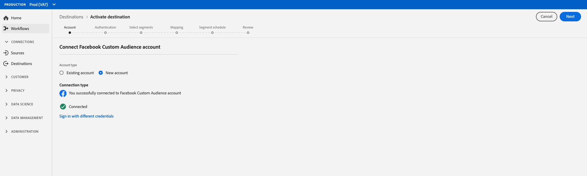

# ソーシャル宛先の作成{#social-network-destinations-workflow}

## 概要 {#overview}

このチュートリアルでは例として[!DNL Facebook]を使用しますが、Adobe Experience Platformのワークフローはすべてのソーシャルの宛先で同じです。

## ソーシャルのリンク先の設定 — ビデオチュートリアル{#video}

以下のビデオでは、Adobe Experience Platformでソーシャルターゲットを設定し、セグメントをアクティブ化する方法を示します。 手順は、次のセクションで順番にレイアウトされます。

>[!VIDEO](https://video.tv.adobe.com/v/332599/?quality=12&learn=on&captions=eng)

## ソーシャルターゲットを選択{#select-destination}

**[!UICONTROL 宛先]**/**[!UICONTROL カタログ]**&#x200B;で、**[!UICONTROL ソーシャル]**&#x200B;カテゴリまでスクロールします。 目的のソーシャルターゲットを選択し、**[!UICONTROL 設定]**&#x200B;を選択します。

>[!NOTE]
>
>この宛先との接続が既に存在する場合は、宛先カードに「**[!UICONTROL Activate]**」ボタンが表示されます。 「**[!UICONTROL アクティブ化]**」と「**[!UICONTROL 設定]**」の違いについて詳しくは、保存先のワークスペースドキュメントの「[カタログ](../../ui/destinations-workspace.md#catalog)」の節を参照してください。

## アカウントステップ{#account}

**アカウント**&#x200B;の手順で、ソーシャルリンク先への接続を事前に設定している場合は、「**[!UICONTROL 既存のアカウント]**」を選択し、既存の接続を選択します。 または、「**[!UICONTROL 新しいアカウント]**」を選択して、ソーシャルリンク先への新しい接続を設定できます。 「**[!UICONTROL リンク先に接続]**」を選択すると、選択したリンク先にログインし、Adobe Experience Cloudをソーシャル広告アカウントに接続します。

>[!NOTE]
>
>プラットフォームは、認証プロセスで資格情報の検証をサポートしており、ソーシャルアカウントIDに正しくない資格情報を入力すると、エラーメッセージを表示します。 このため、間違った資格情報を使用すると、ワークフローを完了することができません。

資格情報が確認され、Adobe Experience Cloudがソーシャルネットワークに接続されたら、「**[!UICONTROL 次へ]**」を選択して、**[!UICONTROL 認証]**&#x200B;の手順に進むことができます。

## 認証手順{#authentication}

**[!UICONTROL 認証]**&#x200B;手順で、アクティベーションフローの[!UICONTROL 名前]と[!UICONTROL 説明]を入力し、ソーシャルネットワーク広告アカウントの[!UICONTROL アカウントID]を入力します。

>[!IMPORTANT]
>
> * [!DNL Facebook]宛先の場合、**[!UICONTROL アカウントID]**&#x200B;は[!DNL Facebook Ad Account ID]です。 このIDは[!DNL Facebook Ads Manager]にあります。 IDの先頭に`act_`を付けます（下図を参照）。
> * [!DNL LinkedIn]宛先の場合、**[!UICONTROL アカウントID]**&#x200B;は[!DNL LinkedIn Campaign Manager Account ID]です。 このIDは[!DNL LinkedIn Campaign Manager]にあります。

この手順では、この宛先に適用する&#x200B;**[!UICONTROL マーケティングアクション]**&#x200B;を選択することもできます。 マーケティングアクションは、データをエクスポート先にエクスポートする意図を示します。 Adobe定義のマーケティングアクションから選択するか、独自のマーケティングアクションを作成することができます。 マーケティングアクションについて詳しくは、[データ使用ポリシーの概要](../../../data-governance/policies/overview.md)を参照してください。

上記のフィールドに入力した後、「**[!UICONTROL 宛先を作成]**」を選択します。

これで宛先が作成されました。後でセグメントをアクティブにする場合は、「**[!UICONTROL 保存して終了]**」を選択します。また、「**[!UICONTROL 次へ]**」を選択してワークフローを続行し、アクティブ化するセグメントを選択することもできます。どちらの場合も、残りのワークフローについては、次の[ソーシャル宛先に対するセグメントのアクティブ化](#activate-segments)の節を参照してください。

## ソーシャルリンク先に対するセグメントのアクティブ化{#activate-segments}

ソーシャルリンク先に対するセグメントをアクティブ化する方法については、[宛先へのデータをアクティブ化](../../ui/activate-destinations.md)を参照してください。
