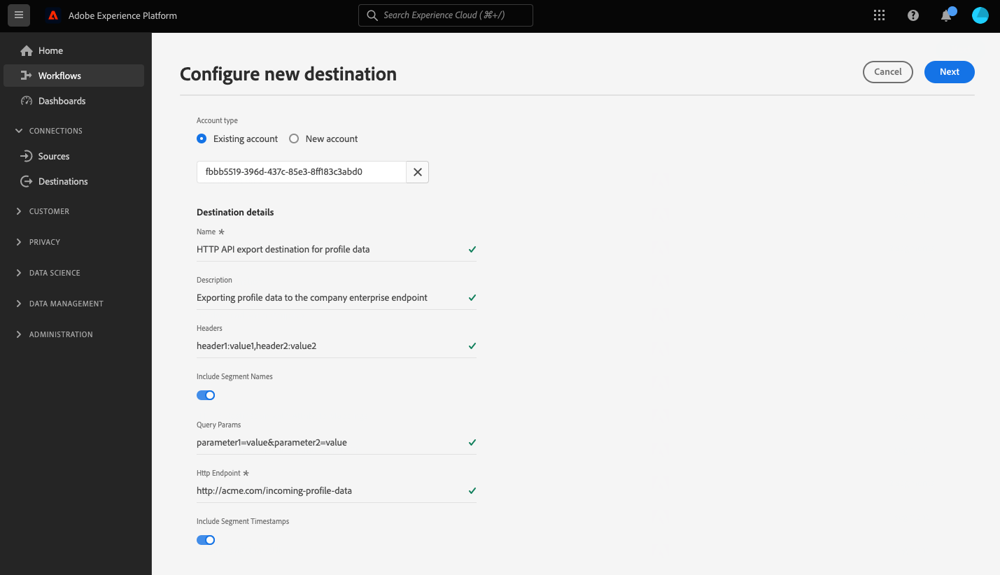

# HTTP API 接続

## 概要 {#overview}

>[!IMPORTANT]
>
> この宛先を使用できるのは [Adobe Real-time Customer Data Platform Ultimate](https://helpx.adobe.com/jp/legal/product-descriptions/real-time-customer-data-platform.html) の顧客のみです。

HTTP API 宛先は、プロファイルデータをサードパーティの HTTP エンドポイントに送信する際に役立つ [!DNL Adobe Experience Platform] ストリーミング宛先です。

プロファイルデータを HTTP エンドポイントに送信するには、まず [!DNL Adobe Experience Platform] で[宛先に接続](#connect-destination)する必要があります。

## ユースケース {#use-cases}

HTTP API の宛先を使用すると、XDM プロファイルデータとオーディエンスを汎用の HTTP エンドポイントに書き出すことができます。 そこで、Experience Platform から書き出されたプロファイル データに対して、独自の分析を実行したり、その他の必要な操作を行ったりできます。

HTTP エンドポイントとして設定できるのは、顧客独自のシステムまたはサードパーティソリューションのいずれかです。

## サポートされるオーディエンス {#supported-audiences}

この節では、この宛先に書き出すことができるすべてのオーディエンスについて説明します。

すべての宛先は、Experience Platformを通じて生成されたオーディエンスのアクティブ化をサポートします [セグメント化サービス](../../../segmentation/home.md).

また、この宛先では、以下の表で説明するオーディエンスのアクティブ化もサポートされます。

| オーディエンスタイプ | 説明 |
---------|----------|
| カスタムアップロード | CSV ファイルからExperience Platformに取り込まれたオーディエンス。 |

{style="table-layout:auto"}

## 書き出しのタイプと頻度 {#export-type-frequency}

宛先の書き出しのタイプと頻度について詳しくは、以下の表を参照してください。

| 項目 | タイプ | メモ |
---------|----------|---------|
| 書き出しタイプ | **[!UICONTROL プロファイルベース]** | セグメントのすべてのメンバーを、[宛先のアクティベーションワークフロー](../../ui/activate-segment-streaming-destinations.md#mapping)のマッピング画面で選択したように、必要なスキーマフィールド（例：メールアドレス、電話番号、姓）とともに書き出します。 |
| 書き出し頻度 | **[!UICONTROL ストリーミング]** | ストリーミングの宛先は常に、API ベースの接続です。オーディエンス評価に基づいてExperience Platform内でプロファイルが更新されるとすぐに、コネクタは更新を宛先プラットフォームに送信します。 [ストリーミングの宛先](/help/destinations/destination-types.md#streaming-destinations)の詳細についてはこちらを参照してください。 |

{style="table-layout:auto"}

## 前提条件 {#prerequisites}

Experience Platform からデータを書き出す際に HTTP API 宛先を使用する場合は、次の前提条件を満たす必要があります。

* REST API をサポートする HTTP エンドポイントが必要です。
* 使用する HTTP エンドポイントが、Experience Platform プロファイルスキーマをサポートする必要があります。HTTP API 宛先では、サードパーティのペイロードスキーマへの変換はサポートされていません。Experience Platform の出力スキーマの例については、[書き出されたデータ](#exported-data)の節を参照してください。
* HTTP エンドポイントはヘッダーをサポートする必要があります。

>[!TIP]
>
> また、[Adobe Experience Platform Destination SDK](/help/destinations/destination-sdk/overview.md) を使用して統合環境を設定し、HTTP エンドポイントに Experience Platform プロファイルデータを送信することもできます。

## IP アドレスの許可リスト {#ip-address-allowlist}

顧客のセキュリティおよびコンプライアンスの要件を満たすために、Experience Platform には HTTP API 宛先の許可リストに使用できる静的 IP のリストが用意されています。許可リストに使用できる IP のリストについて詳しくは、[ストリーミング宛先用 IP アドレスの許可リスト](/help/destinations/catalog/streaming/ip-address-allow-list.md)を参照してください。

## サポートしている認証タイプ {#supported-authentication-types}

HTTP API 宛先は、HTTP エンドポイントに対して、以下に示す複数の認証タイプをサポートしています。

* 認証なしの HTTP エンドポイント。
* ベアラートークン認証。
* 以下の例に示すように、HTTP リクエストの本文に [!DNL client ID]、[!DNL client secret] および [!DNL grant type] を含み、本文形式を持つ [OAuth 2.0 クライアント資格情報](https://www.oauth.com/oauth2-servers/access-tokens/client-credentials/)の認証。

```shell
curl --location --request POST '<YOUR_API_ENDPOINT>' \
--header 'Content-Type: application/x-www-form-urlencoded' \
--data-urlencode 'grant_type=client_credentials' \
--data-urlencode 'client_id=<CLIENT_ID>' \
--data-urlencode 'client_secret=<CLIENT_SECRET>'
```

* URL がエンコードされた [!DNL client ID] および [!DNL client secret] を含む認証ヘッダーを持つ、基本認証による [OAuth 2.0 クライアント資格情報](https://www.oauth.com/oauth2-servers/access-tokens/client-credentials/)。

```shell
curl --location --request POST 'https://some-api.com/token' \
--header 'Authorization: Basic base64(clientId:clientSecret)' \
--header 'Content-type: application/x-www-form-urlencoded; charset=UTF-8' \
--data-urlencode 'grant_type=client_credentials'
```

* [パスワード付与を使用した OAuth 2.0](https://www.oauth.com/oauth2-servers/access-tokens/password-grant/)。

## 宛先への接続 {#connect-destination}

>[!IMPORTANT]
> 
>宛先に接続するには、**[!UICONTROL 宛先の管理]** [アクセス制御権限](/help/access-control/home.md#permissions)が必要です。詳しくは、[アクセス制御の概要](/help/access-control/ui/overview.md)または製品管理者に問い合わせて、必要な権限を取得してください。

この宛先に接続するには、[宛先設定のチュートリアル](../../ui/connect-destination.md)の手順に従ってください。この宛先に接続する際は、次の情報を指定する必要があります。

### 認証情報 {#authentication-information}

>[!CONTEXTUALHELP]
>id="platform_destinations_connect_http_clientcredentialstype"
>title="クライアント資格情報のタイプ"
>abstract="「**エンコードされる本文形式**」を選択してリクエストの本文にクライアント ID とクライアント秘密鍵を含めるか、「**基本認証**」を選択して認証ヘッダーにクライアント ID とクライアント秘密鍵を含めます。ドキュメントの例を参照してください。"

#### ベアラートークン認証 {#bearer-token-authentication}

**[!UICONTROL ベアラートークン]**&#x200B;認証タイプを選択して、HTTP エンドポイントに接続する場合は、以下のフィールドを入力し、「**[!UICONTROL 宛先に接続]**」を選択します。


* **[!UICONTROL ベアラートークン]**：ベアラートークンを挿入して、HTTP ロケーションに対する認証を行います。

#### 認証なし {#no-authentication}

「**[!UICONTROL なし]**」の認証タイプを選択して HTTP エンドポイントに接続する場合：


この認証を開いた状態で選択する場合は、「**[!UICONTROL 宛先に接続]**」を選択するだけで、エンドポイントへの接続が確立されます。

#### OAuth 2 パスワード認証 {#oauth-2-password-authentication}

**[!UICONTROL OAuth 2 パスワード]**&#x200B;認証タイプを選択して HTTP エンドポイントに接続する場合は、以下のフィールドを入力し、「**[!UICONTROL 宛先に接続]**」を選択します。


* **[!UICONTROL アクセストークン URL]**：アクセストークンと必要に応じて更新トークンを発行する、ユーザー側の URL。
* **[!UICONTROL クライアント ID]**：システムが Adobe Experience Platform に割り当てる [!DNL client ID]。
* **[!UICONTROL クライアント秘密鍵]**：システムが Adobe Experience Platform に割り当てる [!DNL client secret]。
* **[!UICONTROL ユーザー名]**：HTTP エンドポイントにアクセスするユーザー名。
* **[!UICONTROL パスワード]**：HTTP エンドポイントにアクセスするためのパスワード。

#### OAuth 2 クライアント資格情報認証 {#oauth-2-client-credentials-authentication}

**[!UICONTROL OAuth 2 クライアント資格情報]**&#x200B;認証タイプを選択して HTTP エンドポイントに接続する場合は、以下のフィールドを入力し、「**[!UICONTROL 宛先に接続]**」を選択します。 


* **[!UICONTROL アクセストークン URL]**：アクセストークンと必要に応じて更新トークンを発行するユーザー側の URL。
* **[!UICONTROL クライアント ID]**：システムが Adobe Experience Platform に割り当てる [!DNL client ID]。
* **[!UICONTROL クライアント秘密鍵]**：システムが Adobe Experience Platform に割り当てる [!DNL client secret]。
* **[!UICONTROL クライアント資格情報の種類]**：お使いのエンドポイントでサポートされる OAuth2 クライアント資格情報付与の種類を選択します。
   * **[!UICONTROL エンコードされた本文]**：この場合、[!DNL client ID] と [!DNL client secret] は宛先に送信される&#x200B;*リクエストの本文*&#x200B;に含まれます。例については、[サポートされる認証タイプ](#supported-authentication-types)の節を参照してください。
   * **[!UICONTROL 基本認証]**：この場合、[!DNL client ID] と [!DNL client secret] は、base64 でエンコードして宛先に送信された後、*`Authorization` ヘッダー*&#x200B;に含まれます。例については、[サポートされる認証タイプ](#supported-authentication-types)の節を参照してください。

### 宛先の詳細を入力 {#destination-details}

>[!CONTEXTUALHELP]
>id="platform_destinations_connect_http_headers"
>title="ヘッダー"
>abstract="宛先の呼び出しに含めるカスタムヘッダーを、次の形式で入力します： `header1:value1,header2:value2,...headerN:valueN`"

>[!CONTEXTUALHELP]
>id="platform_destinations_connect_http_endpoint"
>title="HTTP エンドポイント"
>abstract="プロファイルデータの送信先の HTTP エンドポイントの URL。"

>[!CONTEXTUALHELP]
>id="platform_destinations_connect_http_includesegmentnames"
>title="セグメント名を含める"
>abstract="データの書き出しに、書き出すオーディエンスの名前を含める場合に切り替えます。 このオプションを選択したデータの書き出しの例に関するドキュメントを表示します。"

>[!CONTEXTUALHELP]
>id="platform_destinations_connect_http_includesegmenttimestamps"
>title="セグメントのタイムスタンプを含める"
>abstract="オーディエンスが作成および更新された際の UNIX タイムスタンプと、オーディエンスがアクティベーション用に宛先にマッピングされた際の UNIX タイムスタンプをデータエクスポートに含めるかどうかを切り替えます。 このオプションを選択したデータの書き出しの例に関するドキュメントを表示します。"

>[!CONTEXTUALHELP]
>id="platform_destinations_connect_http_queryparameters"
>title="クエリのパラメーター"
>abstract="オプションで、HTTP エンドポイント URL にクエリパラメーターを追加できます。 使用するクエリパラメーターを `parameter1=value&parameter2=value` のように書式設定します。"

宛先の詳細を設定するには、以下の必須フィールドとオプションフィールドに入力します。  UI のフィールドの横のアスタリスクは、そのフィールドが必須であることを示します。



* **[!UICONTROL 名前]**：今後この宛先を認識するための名前を入力します。
* **[!UICONTROL 説明]**：今後この宛先を識別するのに役立つ説明を入力します。
* **[!UICONTROL ヘッダー]**：宛先の呼び出しに含めるカスタムヘッダーを、「`header1:value1,header2:value2,...headerN:valueN`」の形式で入力します。 
* **[!UICONTROL HTTP エンドポイント]**：プロファイルデータの送信先の HTTP エンドポイントの URL。
* **[!UICONTROL クエリパラメーター]**：オプションで、HTTP エンドポイント URL にクエリパラメーターを追加できます。 使用するクエリパラメーターを `parameter1=value&parameter2=value` のように書式設定します。 
* **[!UICONTROL セグメント名を含める]**:データの書き出しに、書き出すオーディエンスの名前を含める場合に切り替えます。 このオプションを選択したデータの書き出しの例については、[書き出されたデータ](#exported-data)の節を参照してください。
* **[!UICONTROL セグメントのタイムスタンプを含める]**:オーディエンスが作成および更新された際の UNIX タイムスタンプと、オーディエンスがアクティベーション用に宛先にマッピングされた際の UNIX タイムスタンプをデータエクスポートに含めるかどうかを切り替えます。 このオプションを選択したデータの書き出しの例については、[書き出されたデータ](#exported-data)の節を参照してください。

### アラートの有効化 {#enable-alerts}

アラートを有効にすると、宛先へのデータフローのステータスに関する通知を受け取ることができます。リストからアラートを選択して、データフローのステータスに関する通知を受け取るよう登録します。アラートについて詳しくは、[UI を使用した宛先アラートの購読](../../ui/alerts.md)についてのガイドを参照してください。

宛先接続への詳細の入力を終えたら「**[!UICONTROL 次へ]**」を選択します。

## この宛先に対するオーディエンスをアクティブ化 {#activate}

>[!IMPORTANT]
> 
>データをアクティブ化するには、**[!UICONTROL 宛先の管理]**、**[!UICONTROL 宛先のアクティブ化]**、**[!UICONTROL プロファイルの表示]**&#x200B;および&#x200B;**[!UICONTROL セグメントの表示]** [に対するアクセス制御権限](/help/access-control/home.md#permissions)が必要です。詳しくは、[アクセス制御の概要](/help/access-control/ui/overview.md)または製品管理者に問い合わせて、必要な権限を取得してください。

詳しくは、 [ストリーミングプロファイルの書き出し先に対するオーディエンスデータのアクティブ化](../../ui/activate-streaming-profile-destinations.md) を参照してください。

### 宛先属性 {#attributes}

[[!UICONTROL 属性を選択]](../../ui/activate-streaming-profile-destinations.md#select-attributes)の手順では、[和集合スキーマ](../../../profile/home.md#profile-fragments-and-union-schemas)から一意の ID を選択することをお勧めします。宛先に書き出す一意の ID およびその他の XDM フィールドを選択します。

## プロファイルの書き出し動作 {#profile-export-behavior}

Experience Platformは、オーディエンスの選定または他の重要なイベントに従ってプロファイルに関連する更新が発生した場合にのみ、HTTP API 宛先へのプロファイルの書き出し動作を最適化します。 プロファイルは、以下の状況で宛先に書き出されます。

* プロファイルの更新は、宛先にマッピングされた少なくとも 1 つのオーディエンスのオーディエンスメンバーシップの変更によって決定されました。 例えば、プロファイルが宛先にマッピングされた 1 つのオーディエンスの対象として認定されたか、宛先にマッピングされた 1 つのオーディエンスから出たとします。
* プロファイルの更新は、[ID マップ](/help/xdm/field-groups/profile/identitymap.md)の変更によって決定します。例えば、宛先にマッピングされたオーディエンスの 1 つに対して既に資格を持っているプロファイルが、ID マップ属性に新しい ID として追加されたとします。
* プロファイルの更新は、宛先にマッピングされた属性のうち、少なくとも 1 つの属性が変更されたことで判断されました。例えば、マッピング手順で宛先にマッピングされた属性の 1 つがプロファイルに追加されます。

上記のすべての場合で、適切な更新が行われたプロファイルのみが宛先に書き出されます。例えば、宛先フローにマッピングされたオーディエンスのメンバーが 100 人で、5 つの新しいプロファイルがセグメントに認定された場合、宛先への書き出しは増分で、5 つの新しいプロファイルのみが含まれます。

変更箇所に関わらず、マッピングされたすべての属性がプロファイルに対して書き出されることに注意してください。 したがって、上の例では、属性自体が変更されていない場合でも、これら 5 つの新しいプロファイルに対してマッピングされた属性がすべて書き出されます。

### データの書き出しを決定する要素と、書き出しに含まれる内容 {#what-determines-export-what-is-included}

特定のプロファイルに対して書き出されるデータに関しては、*HTTP API 宛先へのデータ書き出しを決定する要素*、および&#x200B;*書き出しに含まれるデータ*&#x200B;という 2 つの異なる概念を理解することが重要です。

| 宛先の書き出しを決定する要素 | 宛先の書き出しに含まれる内容 |
|---------|----------|
| <ul><li>マッピングされた属性とオーディエンスは、宛先の書き出しのキューとなります。 つまり、マッピングされたオーディエンスが ( `null` から `realized` またはから `realized` から `exiting`) またはマッピングされた属性が更新されると、宛先の書き出しがキックオフされます。</li><li>ID は現在 HTTP API の宛先にマッピングできないので、特定のプロファイルの ID を変更すると、宛先の書き出しも決定されます。</li><li>属性の変更は、同じ値であるかどうかに関わらず、属性に対する更新として定義されます。 つまり、値自体が変更されていない場合でも、属性の上書きは変更と見なされます。</li></ul> | <ul><li>この `segmentMembership` オブジェクトには、activation データフローにマッピングされたオーディエンスが含まれます。このオーディエンスに対して、認定またはオーディエンスの終了イベント後にプロファイルのステータスが変更されます。 これらのオーディエンスが同じに属する場合、そのプロファイルが書き出し先のエクスポートに含めることができる、マッピングされていないオーディエンスが他にも存在することに注意してください [結合ポリシー](/help/profile/merge-policies/overview.md) activation データフローにマッピングされたオーディエンスとして。 </li><li>`identityMap` オブジェクト内のすべての ID も含まれます（Experience Platform は現在、HTTP API の宛先で ID マッピングをサポートしていません）。</li><li>マッピングされた属性のみが宛先の書き出しに含まれます。</li></ul> |

{style="table-layout:fixed"}

例えば、このデータフローを HTTP 宛先に対して考えてみましょう。この宛先では、3 つのオーディエンスがデータフローで選択され、4 つの属性が宛先にマッピングされます。


宛先へのプロファイルの書き出しは、*3 つのマッピングされたセグメント*&#x200B;のいずれかに適合またはいずれかを離脱するプロファイルによって決定されます。ただし、データエクスポートでは、 `segmentMembership` オブジェクト ( [書き出されたデータ](#exported-data) 以下の節を参照 )、その特定のプロファイルがメンバーであり、書き出しをトリガーしたオーディエンスと同じ結合ポリシーを共有している場合は、他のマッピングされていないオーディエンスが表示されることがあります。 プロファイルが **DeLorean Cars を使用するお客様** セグメントに含まれますが、このセグメントは **「未来に戻る」を視聴** 映画と **SF ファン** セグメントの場合、他の 2 つのオーディエンスも `segmentMembership` データエクスポートのオブジェクト（これらがデータフローで同じ結合ポリシーを共有している場合） **DeLorean Cars を使用するお客様** セグメント。

プロファイル属性の観点から、上記でマッピングした 4 つの属性に対する変更によって、書き出しの宛先が決定し、プロファイルに存在する 4 つのマッピング済み属性のいずれかがデータ書き出しに表示されます。

## 履歴データのバックフィル {#historical-data-backfill}

既存の宛先に新しいオーディエンスを追加する場合、または新しい宛先を作成してオーディエンスをマッピングする場合、Experience Platformは宛先にオーディエンスの資格履歴データをエクスポートします。 オーディエンスに適合するプロファイル *前* オーディエンスが宛先に追加され、約 1 時間以内に宛先に書き出されます。

## 書き出したデータ {#exported-data}

書き出された [!DNL Experience Platform] データは、JSON 形式で [!DNL HTTP] の宛先に格納されます。例えば、以下の書き出しには、特定のセグメントに適合し、別の 2 つのセグメントのメンバーであり、別のセグメントから離脱したプロファイルが含まれています。 書き出しには、プロファイル属性の名、姓、生年月日、個人メールアドレスも含まれます。 このプロファイルの ID は、ECID とメールです。

```json
{
  "person": {
    "birthDate": "YYYY-MM-DD",
    "name": {
      "firstName": "John",
      "lastName": "Doe"
    }
  },
  "personalEmail": {
    "address": "john.doe@acme.com"
  },
  "segmentMembership": {
   "ups":{
      "7841ba61-23c1-4bb3-a495-00d3g5fe1e93":{
         "lastQualificationTime":"2022-01-11T21:24:39Z",
         "status":"exited"
      },
      "59bd2fkd-3c48-4b18-bf56-4f5c5e6967ae":{
         "lastQualificationTime":"2022-01-02T23:37:33Z",
         "status":"realized"
      },
      "947c1c46-008d-40b0-92ec-3af86eaf41c1":{
         "lastQualificationTime":"2021-08-25T23:37:33Z",
         "status":"realized"
      },
      "5114d758-ce71-43ba-b53e-e2a91d67b67f":{
         "lastQualificationTime":"2022-01-11T23:37:33Z",
         "status":"realized"
      }
   }
},
  "identityMap": {
    "ecid": [
      {
        "id": "14575006536349286404619648085736425115"
      },
      {
        "id": "66478888669296734530114754794777368480"
      }
    ],
    "email_lc_sha256": [
      {
        "id": "655332b5fa2aea4498bf7a290cff017cb4"
      },
      {
        "id": "66baf76ef9de8b42df8903f00e0e3dc0b7"
      }
    ]
  }
}
```

書き出されたデータのその他の例を以下に示します。これらは「**[!UICONTROL セグメント名を含める]**」および「**[!UICONTROL セグメントのタイムスタンプを含める]**」オプションに対して接続データフローで選択した UI 設定によって異なります。

+++ 以下のデータエクスポートのサンプルでは、 `segmentMembership` セクション

```json
"segmentMembership": {
        "ups": {
          "5b998cb9-9488-4ec3-8d95-fa8338ced490": {
            "lastQualificationTime": "2019-04-15T02:41:50+0000",
            "status": "realized",
            "createdAt": 1648553325000,
            "updatedAt": 1648553330000,
            "mappingCreatedAt": 1649856570000,
            "mappingUpdatedAt": 1649856570000,
            "name": "First name equals John"
          }
        }
      }
```

+++

+++ 以下のデータエクスポートの例では、オーディエンスのタイムスタンプが `segmentMembership` セクション

```json
"segmentMembership": {
        "ups": {
          "5b998cb9-9488-4ec3-8d95-fa8338ced490": {
            "lastQualificationTime": "2019-04-15T02:41:50+0000",
            "status": "realized",
            "createdAt": 1648553325000,
            "updatedAt": 1648553330000,
            "mappingCreatedAt": 1649856570000,
            "mappingUpdatedAt": 1649856570000,
          }
        }
      }
```

+++

## 制限と再試行ポリシー {#limits-retry-policy}

Experience Platform は 95％ の確率で、HTTP 宛先の各データフローにおいて、送信に成功したメッセージのスループット待ち時間を 10 分未満、リクエスト数を 1 秒あたり 10,000 件未満で提供しようと試みます。

HTTP API 宛先へのリクエストが失敗した場合、Experience Platform は失敗したリクエストを保存し、リクエストをエンドポイントに送信するために 2 回再試行します。