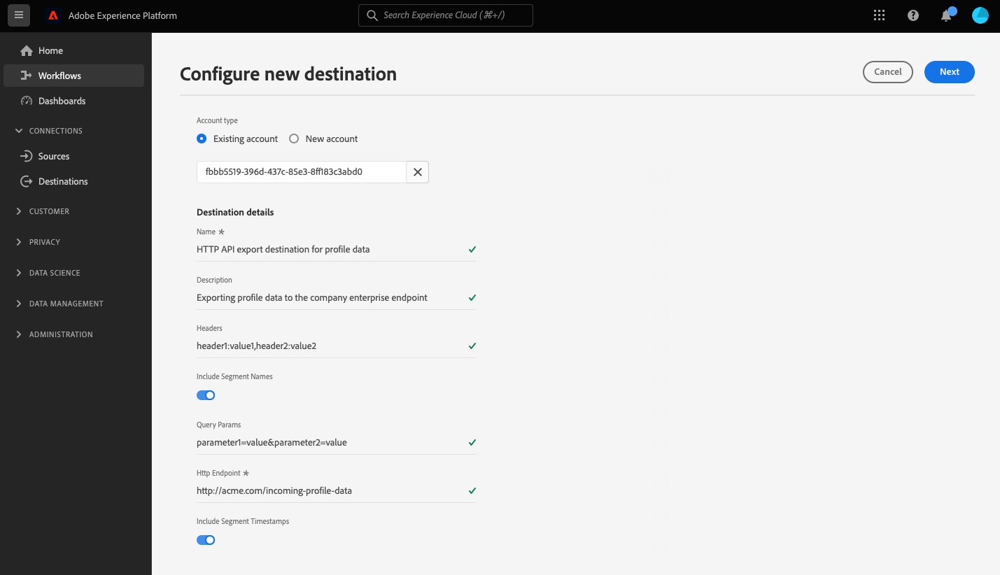

# HTTP API 接続

## 概要 {#overview}

>[!IMPORTANT]
>
> この宛先を使用できるのは [Adobe Real-time Customer Data Platform Ultimate](https://helpx.adobe.com/jp/legal/product-descriptions/real-time-customer-data-platform.html) の顧客のみです。

HTTP API宛先は、プロファイルデータをサードパーティのHTTP エンドポイントに送信するのに役立つExperience Platform ストリーミング宛先です。

プロファイルデータをHTTP エンドポイントに送信するには、まず[Experience Platformの宛先](#connect-destination)に接続する必要があります。

## ユースケース {#use-cases}

HTTP API宛先を使用して、XDM プロファイルデータとオーディエンスを汎用HTTP エンドポイントに書き出します。 そこで、Experience Platform から書き出されたプロファイル データに対して、独自の分析を実行したり、その他の必要な操作を行ったりできます。

HTTP エンドポイントとして設定できるのは、顧客独自のシステムまたはサードパーティソリューションのいずれかです。

## サポートされるオーディエンス {#supported-audiences}

この節では、この宛先に書き出すことができるオーディエンスのタイプについて説明します。

| オーディエンスの由来 | サポートあり | 説明 |
|---------|----------|----------|
| [!DNL Segmentation Service] | ○ | Experience Platform [ セグメント化サービス ](../../../segmentation/home.md)を通じて生成されたオーディエンス。 |
| その他すべてのオーディエンスの生成元 | ○ | このカテゴリには、[!DNL Segmentation Service]を通じて生成されたオーディエンス以外のすべてのオーディエンスのオリジンが含まれます。 [様々なオーディエンスの起源](/help/segmentation/ui/audience-portal.md#customize)について読みます。 次に例を示します。 <ul><li> カスタムアップロードオーディエンス [がCSV ファイルからExperience Platformに](../../../segmentation/ui/audience-portal.md#import-audience)をインポートしました。</li><li> 類似オーディエンス， </li><li> 連合オーディエンス， </li><li> [!DNL Adobe Journey Optimizer]などの他のExperience Platform アプリで生成されたオーディエンス </li><li> その他。 </li></ul> |

{style="table-layout:auto"}

オーディエンスのデータタイプ別にサポートされるオーディエンス：

| オーディエンスのデータタイプ | サポートあり | 説明 | ユースケース |
|--------------------|-----------|-------------|-----------|
| [人物オーディエンス ](/help/segmentation/types/people-audiences.md) | ○ | 最適な属性を選択できます。 マーケティングキャンペーンの特定のグループをターゲットにするのに使用できます。 | 買い物客やカートの放棄が多い |
| [ アカウントオーディエンス ](/help/segmentation/types/account-audiences.md) | × | アカウントベースドマーケティング戦略のために、特定の組織内の個人をターゲットにします。 | B2B マーケティング |
| [見込みオーディエンス ](/help/segmentation/types/prospect-audiences.md) | × | まだ顧客ではないが、ターゲットオーディエンスと特徴を共有する個人をターゲットにします。 | サードパーティデータによる見込み顧客の開拓 |
| [ データセットの書き出し](/help/catalog/datasets/overview.md) | × | [!DNL Adobe Experience Platform] データ レイクに保存されている構造化データのコレクション。 | レポート，データサイエンスワークフロー |

{style="table-layout:auto"}


## 書き出しのタイプと頻度 {#export-type-frequency}

宛先の書き出しのタイプと頻度について詳しくは、以下の表を参照してください。

| 項目 | タイプ | メモ |
| ---------|----------|---------|
| 書き出しタイプ | **[!UICONTROL Profile-based]** | [宛先アクティベーションワークフロー](../../ui/activate-segment-streaming-destinations.md#mapping)のマッピング画面で選択した目的のスキーマフィールド（電子メールアドレス、電話番号、姓など）と共に、オーディエンスのすべてのメンバーを書き出します。 |
| 書き出し頻度 | **[!UICONTROL Streaming]** | ストリーミングの宛先は常に、API ベースの接続です。オーディエンス評価に基づいて Experience Platform 内でプロファイルが更新されるとすぐに、コネクタは更新を宛先プラットフォームに送信します。[ストリーミングの宛先](/help/destinations/destination-types.md#streaming-destinations)の詳細についてはこちらを参照してください。 |

{style="table-layout:auto"}

## 前提条件 {#prerequisites}

Experience Platform からデータを書き出す際に HTTP API 宛先を使用する場合は、次の前提条件を満たす必要があります。

* REST API をサポートする HTTP エンドポイントが必要です。
* 使用する HTTP エンドポイントが、Experience Platform プロファイルスキーマをサポートする必要があります。HTTP API 宛先では、サードパーティのペイロードスキーマへの変換はサポートされていません。Experience Platform の出力スキーマの例については、[書き出されたデータ](#exported-data)の節を参照してください。
* HTTP エンドポイントはヘッダーをサポートする必要があります。
* HTTP エンドポイントは、適切なデータ処理を確保し、タイムアウトエラーを回避するために2秒以内に応答する必要があります。
* mTLSを使用する場合：データ受信エンドポイントでTLSを無効にし、mTLSのみを有効にする必要があります。

>[!TIP]
>
> また、[Adobe Experience Platform Destination SDK](/help/destinations/destination-sdk/overview.md) を使用して統合環境を設定し、HTTP エンドポイントに Experience Platform プロファイルデータを送信することもできます。

## mTLS プロトコルのサポートと証明書 {#mtls-protocol-support}

[!DNL Mutual Transport Layer Security] （mTLS）を使用して、HTTP API宛先接続へのアウトバウンド接続のセキュリティを強化できます。

mTLSは、情報を共有する両当事者が、データを共有する前に誰であると主張するかを保証する相互認証プロトコルです。 mTLSには、標準のTLSと比較した追加の手順が含まれており、サーバーはクライアントの証明書を要求および検証し、クライアントはサーバーの証明書を検証します。

### mTLSの考慮事項 {#mtls-considerations}

HTTP API宛先に対するmTLS サポートは、プロファイルの書き出しが送信されるデータ受信エンドポイント **にのみ**&#x200B;適用されます（**[!UICONTROL HTTP Endpoint]**&#x200B;宛先の詳細[の](#destination-details) フィールド）。

### データ書き出し用のmTLSの設定 {#configuring-mtls}

HTTP API宛先でmTLSを使用するには、**[!UICONTROL HTTP Endpoint]**&#x200B;宛先の詳細[ ページで設定する](#destination-details) （データ受信エンドポイント）でTLS プロトコルを無効にし、mTLSのみを有効にする必要があります。 エンドポイントで引き続きTLS 1.2 プロトコルが有効になっている場合、クライアント認証用の証明書は送信されません。 つまり、HTTP API宛先でmTLSを使用するには、データ受信サーバーエンドポイントがmTLS専用に有効な接続エンドポイントである必要があります。

### 証明書の詳細の取得と検査 {#certificate}

Common Name （CN）やSubject Alternative Names （SAN）などの証明書の詳細を検査してサードパーティによる検証を追加する場合は、APIを使用して証明書を取得し、応答からこれらのフィールドを抽出します。

詳しくは、[公開証明書エンドポイントのドキュメント ](../../../data-governance/mtls-api/public-certificate-endpoint.md)を参照してください。

## IP アドレスの許可リスト {#ip-address-allowlist}

顧客のセキュリティおよびコンプライアンスの要件を満たすために、Experience Platform には HTTP API 宛先の許可リストに使用できる静的 IP のリストが用意されています。許可リストに加えるするIPの完全なリストについては、[ ストリーミング宛先のIP アドレスの許可リストに加える](/help/destinations/catalog/streaming/ip-address-allow-list.md)を参照してください。

## サポートしている認証タイプ {#supported-authentication-types}

HTTP API 宛先は、HTTP エンドポイントに対して、以下に示す複数の認証タイプをサポートしています。

* 認証なしの HTTP エンドポイント。
* ベアラートークン認証。
* [OAuth 2.0 クライアント資格情報](https://www.oauth.com/oauth2-servers/access-tokens/client-credentials/)は、次の例に示すように、HTTP リクエストの本文に[!DNL client ID]、[!DNL client secret]、および[!DNL grant type]を含む本文フォームを使用した認証です。

```shell
curl --location --request POST '<YOUR_API_ENDPOINT>' \
--header 'Content-Type: application/x-www-form-urlencoded' \
--data-urlencode 'grant_type=client_credentials' \
--data-urlencode 'client_id=<CLIENT_ID>' \
--data-urlencode 'client_secret=<CLIENT_SECRET>'
```

* URL がエンコードされた [!DNL client ID] および [!DNL client secret] を含む認証ヘッダーを持つ、基本認証による [OAuth 2.0 クライアント資格情報](https://www.oauth.com/oauth2-servers/access-tokens/client-credentials/)。

```shell
curl --location --request POST 'https://some-api.com/token' \
--header 'Authorization: Basic base64(clientId:clientSecret)' \
--header 'Content-type: application/x-www-form-urlencoded; charset=UTF-8' \
--data-urlencode 'grant_type=client_credentials'
```

* [パスワード付与を使用した OAuth 2.0](https://www.oauth.com/oauth2-servers/access-tokens/password-grant/)。

## 宛先への接続 {#connect-destination}

>[!IMPORTANT]
>
>宛先に接続するには、**[!UICONTROL View Destinations]**&#x200B;および&#x200B;**[!UICONTROL Manage Destinations]** [ アクセス制御権限](/help/access-control/home.md#permissions)が必要です。 詳しくは、[アクセス制御の概要](/help/access-control/ui/overview.md)または製品管理者に問い合わせて、必要な権限を取得してください。

この宛先に接続するには、[宛先設定のチュートリアル](../../ui/connect-destination.md)の手順に従ってください。この宛先に接続する際は、次の情報を指定する必要があります。

### 認証情報 {#authentication-information}

>[!CONTEXTUALHELP]
>id="platform_destinations_connect_http_clientcredentialstype"
>title="クライアント資格情報のタイプ"
>abstract="「**エンコードされる本文形式**」を選択してリクエストの本文にクライアント ID とクライアント秘密鍵を含めるか、「**基本認証**」を選択して認証ヘッダーにクライアント ID とクライアント秘密鍵を含めます。ドキュメントの例を参照してください。"

#### ベアラートークン認証 {#bearer-token-authentication}

HTTP エンドポイントに接続する&#x200B;**[!UICONTROL Bearer token]**&#x200B;認証タイプを選択した場合は、以下の情報を入力し、**[!UICONTROL Connect to destination]**&#x200B;を選択します。

![[!UICONTROL Bearer token] フィールドを含むHTTP API認証画面。](../../assets/catalog/http/http-api-authentication-bearer.png)

* **[!UICONTROL Bearer token]**: HTTPの場所に対して認証するベアラートークンを入力します。

#### 認証なし {#no-authentication}

HTTP エンドポイントに接続する&#x200B;**[!UICONTROL None]**&#x200B;認証タイプを選択した場合：

![認証タイプ [!UICONTROL None]が選択されたHTTP API認証画面。](../../assets/catalog/http/http-api-authentication-none.png)

この認証オプションを選択すると、**[!UICONTROL Connect to destination]**&#x200B;を選択するだけで、エンドポイントへの接続が確立されます。

#### OAuth 2 パスワード認証 {#oauth-2-password-authentication}

HTTP エンドポイントに接続する&#x200B;**[!UICONTROL OAuth 2 Password]**&#x200B;認証タイプを選択した場合は、以下の情報を入力し、**[!UICONTROL Connect to destination]**&#x200B;を選択します。

![[!UICONTROL OAuth 2 Password] フィールドを含むHTTP API認証画面。](../../assets/catalog/http/http-api-authentication-oauth2-password.png)

* **[!UICONTROL Access Token URL]**: アクセストークンを発行し、必要に応じてトークンを更新する側のURL。
* **[!UICONTROL Client ID]**: システムがAdobe Experience Platformに割り当てる`client ID`。
* **[!UICONTROL Client Secret]**: システムがAdobe Experience Platformに割り当てる`client secret`。
* **[!UICONTROL Username]**: HTTP エンドポイントにアクセスするためのユーザー名。
* **[!UICONTROL Password]**: HTTP エンドポイントにアクセスするためのパスワード。

#### OAuth 2 クライアント資格情報認証 {#oauth-2-client-credentials-authentication}

HTTP エンドポイントに接続する&#x200B;**[!UICONTROL OAuth 2 Client Credentials]**&#x200B;認証タイプを選択した場合は、以下の情報を入力し、**[!UICONTROL Connect to destination]**&#x200B;を選択します。

![[!UICONTROL OAuth 2 Client Credentials] フィールドを含むHTTP API認証画面。](../../assets/catalog/http/http-api-authentication-oauth2-client-credentials.png)

>[!WARNING]
>
>[!UICONTROL OAuth 2 Client Credentials]認証を使用する場合、[!UICONTROL Access Token URL]には最大1つのクエリパラメーターを指定できます。 クエリパラメーターが多い[!UICONTROL Access Token URL]を追加すると、エンドポイントに接続する際に問題が発生する可能性があります。

* **[!UICONTROL Access Token URL]**: アクセストークンを発行し、必要に応じてトークンを更新する側のURL。
* **[!UICONTROL Client ID]**: システムがAdobe Experience Platformに割り当てる`client ID`。
* **[!UICONTROL Client Secret]**: システムがAdobe Experience Platformに割り当てる`client secret`。
* **[!UICONTROL Client Credentials Type]**: エンドポイントでサポートされているOAuth 2 クライアント資格情報付与のタイプを選択してください：
   * **[!UICONTROL Body Form Encoded]**：この場合、`client ID`と`client secret`は、宛先に送信されたリクエスト *の本文*&#x200B;に含まれます。 例については、[サポートされる認証タイプ](#supported-authentication-types)の節を参照してください。
   * **[!UICONTROL Basic Authorization]**：この場合、`client ID`と`client secret`は&#x200B;*ヘッダー`Authorization`に*&#x200B;含まれ、base64でエンコードされ、宛先に送信されます。 例については、[サポートされる認証タイプ](#supported-authentication-types)の節を参照してください。

### 宛先の詳細を入力 {#destination-details}

>[!CONTEXTUALHELP]
>id="platform_destinations_connect_http_headers"
>title="ヘッダー"
>abstract="宛先の呼び出しに含めるカスタムヘッダーを、次の形式で入力します： `header1:value1,header2:value2,...headerN:valueN`"

>[!CONTEXTUALHELP]
>id="platform_destinations_connect_http_endpoint"
>title="HTTP エンドポイント"
>abstract="プロファイルデータの送信先の HTTP エンドポイントの URL。 これはデータ受信エンドポイントであり、設定されている場合はmTLSをサポートします。"

>[!CONTEXTUALHELP]
>id="platform_destinations_connect_http_includesegmentnames"
>title="セグメント名を含める"
>abstract="書き出すオーディエンスの名前をデータの書き出しに含めるかどうかを切り替えます。このオプションを選択したデータの書き出しの例に関するドキュメントを表示します。"

>[!CONTEXTUALHELP]
>id="platform_destinations_connect_http_includesegmenttimestamps"
>title="セグメントのタイムスタンプを含める"
>abstract="オーディエンスが作成および更新された際の UNIX タイムスタンプと、アクティブ化のためにオーディエンスが宛先にマップされた際の UNIX タイムスタンプをデータの書き出しに含めるかどうかを切り替えます。このオプションを選択したデータの書き出しの例に関するドキュメントを表示します。"

>[!CONTEXTUALHELP]
>id="platform_destinations_connect_http_queryparameters"
>title="クエリのパラメーター"
>abstract="オプションで、HTTP エンドポイント URL にクエリパラメーターを追加できます。 使用するクエリパラメーターを `parameter1=value&parameter2=value` のように書式設定します。"

宛先の詳細を設定するには、以下の必須フィールドとオプションフィールドに入力します。UI のフィールドの横のアスタリスクは、そのフィールドが必須であることを示します。



* **[!UICONTROL Name]**：今後この宛先を認識する際に使用する名前を入力します。
* **[!UICONTROL Description]**：今後この宛先を特定するのに役立つ説明を入力します。
* **[!UICONTROL Headers]**：宛先呼び出しに含めるカスタムヘッダーを、次の形式で入力します：`header1:value1,header2:value2,...headerN:valueN`。
* **[!UICONTROL HTTP Endpoint]**: プロファイルデータを送信するHTTP エンドポイントのURL。 これがデータ受信エンドポイントです。 mTLSを使用している場合、このエンドポイントではTLSを無効にし、mTLSのみを有効にする必要があります。
* **[!UICONTROL Query parameters]**：必要に応じて、HTTP エンドポイント URLにクエリパラメーターを追加できます。 使用するクエリパラメーターを `parameter1=value&parameter2=value` のように書式設定します。
* **[!UICONTROL Include Segment Names]**: データの書き出しに、書き出すオーディエンスの名前を含めるかどうかを切り替えます。 **注意**：宛先にマッピングされたオーディエンスにのみ、オーディエンス名が含まれます。 書き出しに表示されるマッピングされていないオーディエンスには、`name` フィールドは含まれません。 このオプションを選択したデータの書き出しの例については、[書き出されたデータ](#exported-data)の節を参照してください。
* **[!UICONTROL Include Segment Timestamps]**: オーディエンスを作成および更新した際のUNIX タイムスタンプと、オーディエンスをアクティブ化する宛先にマッピングした際のUNIX タイムスタンプをデータ書き出しに含める場合に、切り替えます。 このオプションを選択したデータの書き出しの例については、[書き出されたデータ](#exported-data)の節を参照してください。

### アラートの有効化 {#enable-alerts}

アラートを有効にすると、宛先へのデータフローのステータスに関する通知を受け取ることができます。リストからアラートを選択して、データフローのステータスに関する通知を受け取るよう登録します。アラートについて詳しくは、[UIを使用した宛先アラートの購読](../../ui/alerts.md)に関するガイドを参照してください。

宛先接続の詳細の提供が完了したら、**[!UICONTROL Next]**&#x200B;を選択します。

## この宛先に対してオーディエンスをアクティブ化 {#activate}

>[!IMPORTANT]
>
>* データをアクティブ化するには、**[!UICONTROL View Destinations]**、**[!UICONTROL Activate Destinations]**、**[!UICONTROL View Profiles]**&#x200B;および&#x200B;**[!UICONTROL View Segments]** [ アクセス制御権限](/help/access-control/home.md#permissions)が必要です。 [アクセス制御の概要](/help/access-control/ui/overview.md)を参照するか、製品管理者に問い合わせて必要な権限を取得してください。
>* [同意ポリシー評価](/help/data-governance/enforcement/auto-enforcement.md#consent-policy-evaluation)は、現在、HTTP API宛先への書き出しではサポートされていません。 [詳細情報](/help/destinations/ui/activate-streaming-profile-destinations.md#consent-policy-evaluation)。

この宛先に対するオーディエンスのアクティブ化の手順については、[ ストリーミングプロファイル書き出し宛先に対するオーディエンスデータのアクティブ化](../../ui/activate-streaming-profile-destinations.md)を参照してください。

### 宛先属性 {#attributes}

[[!UICONTROL Select attributes]](../../ui/activate-streaming-profile-destinations.md#select-attributes) ステップでは、Adobeは[結合スキーマ ](../../../profile/home.md#profile-fragments-and-union-schemas)から一意のIDを選択することをお勧めします。 宛先に書き出す一意の ID およびその他の XDM フィールドを選択します。

## プロファイルの書き出し動作 {#profile-export-behavior}

Experience Platformは、プロファイルの書き出し動作をHTTP API宛先に最適化し、オーディエンスの選定やその他の重要なイベントの後にプロファイルに関連する更新が発生した場合にのみ、データをAPI エンドポイントに書き出します。 プロファイルは、以下の状況で宛先に書き出されます。

* プロファイルの更新は、宛先にマッピングされたオーディエンスの少なくとも1つのオーディエンスメンバーシップの変更によって決定されました。 例えば、プロファイルは、宛先にマッピングされたいずれかのオーディエンスに適合しているか、宛先にマッピングされたいずれかのオーディエンスから退出しています。
* プロファイルの更新が、[ID マップ](/help/xdm/field-groups/profile/identitymap.md)の変更によって決定する場合。例えば、宛先にマッピングされたオーディエンスのいずれかに対して既に修飾されているプロファイルに、ID マップ属性に新しいIDが追加されているとします。
* プロファイルの更新は、宛先にマッピングされた属性のうち、少なくとも 1 つの属性が変更されたことで判断されました。例えば、マッピング手順で宛先にマッピングされた属性の 1 つがプロファイルに追加されます。

上記のすべての場合で、適切な更新が行われたプロファイルのみが宛先に書き出されます。例えば、宛先フローにマッピングされたオーディエンスに100人のメンバーがあり、5つの新しいプロファイルがオーディエンスに適格である場合、宛先への書き出しは増分であり、5つの新しいプロファイルのみが含まれます。

>[!NOTE]
>
>変更の場所に関係なく、マッピングされたすべての属性がプロファイルに書き出されます。 したがって、上の例では、属性自体が変更されていない場合でも、これら 5 つの新しいプロファイルに対してマッピングされた属性がすべて書き出されます。

### データの書き出しを決定する要素と、書き出しに含まれる内容 {#what-determines-export-what-is-included}

特定のプロファイルに対して書き出されるデータに関しては、*HTTP API 宛先へのデータ書き出しを決定する要素*、および&#x200B;*書き出しに含まれるデータ*&#x200B;という 2 つの異なる概念を理解することが重要です。

| 宛先の書き出しを決定する要素 | 宛先の書き出しに含まれる内容 |
|---------|----------|
| <ul><li>マッピングされた属性とオーディエンスは、宛先の書き出しのキューとして機能します。つまり、プロファイルの`segmentMembership` ステータスが`realized`または`exiting`に変更されたり、マッピングされた属性が更新されたりすると、宛先の書き出しが開始されます。</li><li>ID は現在 HTTP API の宛先にマッピングできないので、特定のプロファイルの ID を変更すると、宛先の書き出しも決定されます。</li><li>属性の変更は、同じ値であるかどうかに関わらず、属性に対する更新として定義されます。 つまり、値自体が変更されていない場合でも、属性の上書きは変更と見なされます。</li></ul> | <ul><li>`segmentMembership` オブジェクトには、アクティブ化データフローでマッピングされたオーディエンスが含まれます。このオーディエンスについて、プロファイルのステータスが選定またはオーディエンス離脱イベントの後に変更されました。プロファイルが選定された他のマッピングされていないオーディエンスは、宛先の書き出しに含めることができます。これらのオーディエンスが、アクティベーションデータフローにマッピングされたオーディエンスと同じ[結合ポリシー](/help/profile/merge-policies/overview.md)に属している場合に注意してください。<br> **重要**: **[!UICONTROL Include Segment Names]** オプションが有効になっている場合、セグメント名は、宛先にマッピングされているオーディエンスにのみ含まれます。 このオプションが有効になっている場合でも、書き出しに表示されるマッピングされていないオーディエンスには、`name` フィールドは含まれません。 </li><li>`identityMap` オブジェクト内のすべての ID も含まれます（Experience Platform は現在、HTTP API の宛先で ID マッピングをサポートしていません）。</li><li>マッピングされた属性のみが宛先の書き出しに含まれます。</li></ul> |

{style="table-layout:fixed"}

例えば、HTTP 宛先に対するこのデータフローについて考えてみましょう。ここでは、3 つのオーディエンスがデータフローで選択され、4 つの属性が宛先にマッピングされます。


宛先へのプロファイル書き出しは、プロファイルが&#x200B;*3つのマッピングされたオーディエンス*&#x200B;のいずれかに適格または離脱したときにトリガーされます。 データの書き出しでは、そのプロファイルがそのメンバーであり、書き出しをトリガーしたオーディエンスと同じ結合ポリシーを共有している場合、`segmentMembership` オブジェクト（以下の[書き出されたデータ ](#exported-data)を参照）にマッピングされていないオーディエンスも含めることができます。 例えば、プロファイルが&#x200B;**Customer with DeLorean Cars**&#x200B;のオーディエンスに適格でありながら、**視聴した「Back to the Future」**&#x200B;映画と&#x200B;**Sf ファン**&#x200B;のオーディエンスのメンバーでもある場合、これらの2つのオーディエンスは`segmentMembership` オブジェクトにも表示されます。ただし、これらの2つのオーディエンスが&#x200B;**Customer with DeLorean Cars**&#x200B;のオーディエンスと同じ結合ポリシーを共有している場合です。

プロファイル属性の観点から、上記でマッピングした 4 つの属性に対する変更によって、書き出しの宛先が決定し、プロファイルに存在する 4 つのマッピング済み属性のいずれかがデータ書き出しに表示されます。

## 履歴データのバックフィル {#historical-data-backfill}

既存の宛先に新しいオーディエンスを追加する場合、または新しい宛先を作成してオーディエンスをマッピングする場合、Experience Platformは過去のオーディエンスの選定データを宛先に書き出します。 オーディエンスが宛先に追加された&#x200B;*前*&#x200B;のオーディエンスに適格なプロファイルは、約1時間以内に宛先に書き出されます。

## 書き出したデータ {#exported-data}

書き出されたExperience Platform データは、JSON形式でHTTP宛先に格納されます。 例えば、以下の書き出しには、特定のオーディエンスに適合し、別の2つのオーディエンスのメンバーであり、別のオーディエンスから離脱したプロファイルが含まれます。 書き出しには、プロファイル属性の名、姓、生年月日、個人メールアドレスも含まれます。 このプロファイルの ID は、ECID とメールです。

```json
{
  "person": {
    "birthDate": "YYYY-MM-DD",
    "name": {
      "firstName": "John",
      "lastName": "Doe"
    }
  },
  "personalEmail": {
    "address": "john.doe@acme.com"
  },
  "segmentMembership": {
   "ups":{
      "7841ba61-23c1-4bb3-a495-00d3g5fe1e93":{
         "lastQualificationTime":"2022-01-11T21:24:39Z",
         "status":"exited"
      },
      "59bd2fkd-3c48-4b18-bf56-4f5c5e6967ae":{
         "lastQualificationTime":"2022-01-02T23:37:33Z",
         "status":"realized"
      },
      "947c1c46-008d-40b0-92ec-3af86eaf41c1":{
         "lastQualificationTime":"2021-08-25T23:37:33Z",
         "status":"realized"
      },
      "5114d758-ce71-43ba-b53e-e2a91d67b67f":{
         "lastQualificationTime":"2022-01-11T23:37:33Z",
         "status":"realized"
      }
   }
},
  "identityMap": {
    "ecid": [
      {
        "id": "14575006536349286404619648085736425115"
      },
      {
        "id": "66478888669296734530114754794777368480"
      }
    ],
    "email_lc_sha256": [
      {
        "id": "655332b5fa2aea4498bf7a290cff017cb4"
      },
      {
        "id": "66baf76ef9de8b42df8903f00e0e3dc0b7"
      }
    ]
  }
}
```

**[!UICONTROL Include Segment Names]**&#x200B;および&#x200B;**[!UICONTROL Include Segment Timestamps]** オプションの接続先フローで選択したUI設定に応じて、書き出されたデータの詳細な例を次に示します。

+++ 以下のデータ書き出しサンプルには、`segmentMembership` セクションにオーディエンス名が含まれています

```json
"segmentMembership": {
        "ups": {
          "5b998cb9-9488-4ec3-8d95-fa8338ced490": {
            "lastQualificationTime": "2019-04-15T02:41:50+0000",
            "status": "realized",
            "createdAt": 1648553325000,
            "updatedAt": 1648553330000,
            "mappingCreatedAt": 1649856570000,
            "mappingUpdatedAt": 1649856570000,
            "name": "First name equals John"
          },
          "354e086f-2e11-49a2-9e39-e5d9a76be683": {
            "lastQualificationTime": "2020-04-15T02:41:50+0000",
            "status": "realized"
          }
        }
      }
```

>[!NOTE]
>
>この例では、最初のオーディエンス（`5b998cb9-9488-4ec3-8d95-fa8338ced490`）が宛先にマッピングされ、`name` フィールドが含まれています。 `354e086f-2e11-49a2-9e39-e5d9a76be683` オプションが有効になっているにもかかわらず、2番目のオーディエンス （`name`）は宛先にマッピングされておらず、**[!UICONTROL Include Segment Names]** フィールドは含まれていません。

+++

+++ 以下のデータ書き出しサンプルには、`segmentMembership` セクションにオーディエンスのタイムスタンプが含まれています

```json
"segmentMembership": {
        "ups": {
          "5b998cb9-9488-4ec3-8d95-fa8338ced490": {
            "lastQualificationTime": "2019-04-15T02:41:50+0000",
            "status": "realized",
            "createdAt": 1648553325000,
            "updatedAt": 1648553330000,
            "mappingCreatedAt": 1649856570000,
            "mappingUpdatedAt": 1649856570000
          }
        }
      }
```

+++

## 制限と再試行ポリシー {#limits-retry-policy}

Experience Platformでは、95%の確率で、HTTP宛先への各データフローに対して1秒間に10千回未満のリクエストを送信した場合、スループット待ち時間を10分未満に抑えようとします。

HTTP API宛先へのリクエストが失敗した場合、Experience Platformはそれらを保存し、2回再試行します。

## トラブルシューティング {#troubleshooting}

信頼性の高いデータ配信を確保し、タイムアウトの問題を回避するには、[前提条件](#prerequisites) セクションで指定されているように、HTTP エンドポイントがExperience Platform リクエストに2秒以内に応答することを確認します。 応答に時間がかかると、タイムアウトエラーが発生します。
