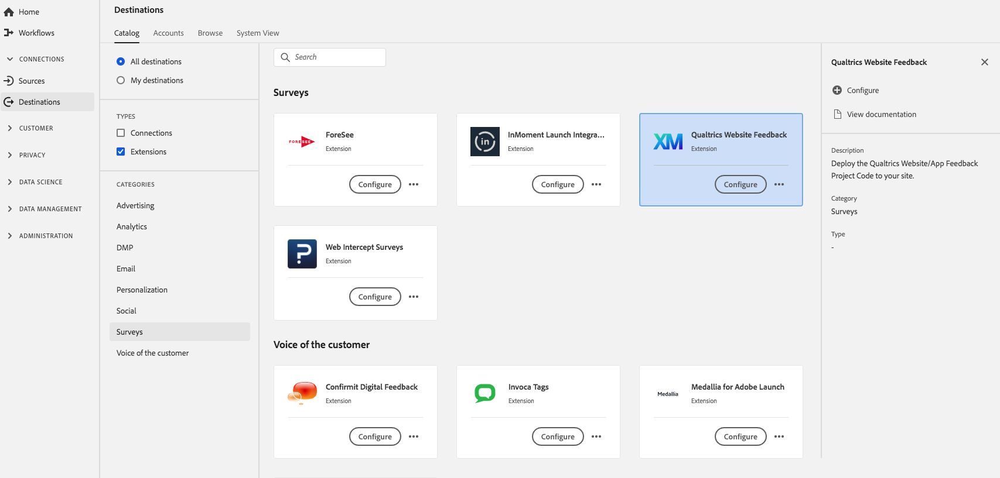

# [!DNL Qualtrics Website Feedback] 拡張機能 {#qualtrics-extension}

## 概要 {#overview}

[!DNL Qualtrics Website Feedback] を使用すると、適切なメッセージを適切なタイミングで web サイト訪問者に提供できます。 Web サイトのフィードバック調査を使用して訪問者のエクスペリエンスを向上させる場合でも、コンバージョンを向上させる場合でも、[!DNL Qualtrics Website Feedback] の点をカバーしています。

直感的なポイント＆クリックインターフェイスで、ターゲットを絞り込んだ、ブランド化された web メッセージを数分で作成して展開します。web サイトから収集したデータとインサイトは、すべてのチャネルの顧客フィードバックデータと共に表示され、1 つのプラットフォームで顧客体験の全体像が提示されます。

[!DNL Qualtrics Website Feedback] は、Adobe Experience Platformの調査拡張機能です。 拡張機能について詳しくは、[Adobe Exchange](https://exchange.adobe.com/experiencecloud.details.101569.qualtrics-website-feedback.html) の拡張機能のページを参照してください。

この宛先はタグ拡張機能です。 Experience Platformでのタグ拡張機能の仕組みについて詳しくは、[ タグ拡張機能の概要 ](../launch-extensions/overview.md) を参照してください。

## 前提条件 {#prerequisites}

Experience Platformを購入したすべての顧客は、この拡張機能を [!DNL Destinations] カタログから利用できます。

この拡張機能を使用するには、Adobe Experience Platform でタグにアクセスする必要があります。 タグは、標準装備の付加価値機能として Adobe Experience Cloud の顧客に提供されます。組織の管理者に問い合わせてタグへのアクセス権を取得し、拡張機能をインストールできるよう **[!UICONTROL manage_properties]** 権限の付与を依頼します。

## 拡張機能のインストール {#install-extension}

[!DNL Qualtrics Website Feedback] 拡張機能をインストールします。

[Experience Platform インターフェイス ](https://platform.adobe.com/) で、**[!UICONTROL Destinations]**/**[!UICONTROL Catalog]** に移動します。

カタログから拡張機能を選択するか、検索バーを使用します。

宛先をクリックしてハイライトしてから、右側のパネルで「**[!UICONTROL 設定]**」を選択します。**[!UICONTROL 設定]**&#x200B;コントロールがグレー表示になっている場合は、**[!UICONTROL manage_properties]** 権限がありません。[前提条件](#prerequisites)を確認してください。

拡張機能をインストールするプロパティを選択します。 また、新しいプロパティを作成するオプションもあります。プロパティは、ルール、データ要素、設定された拡張機能、環境およびライブラリの集まりです。プロパティについては、タグドキュメントの [「プロパティ」ページに関する節](../../../tags/ui/administration/companies-and-properties.md#properties-page) を参照してください。

このワークフローでは、インストールを完了する手順について説明します。

この拡張機能の設定オプションとインストールのサポートの詳細については、Adobe Exchange の「[Qualtrics Website Feedback](https://exchange.adobe.com/experiencecloud.details.101569.qualtrics-website-feedback.html)」のページを参照してください。

拡張機能は、[データ収集 UI](https://experience.adobe.com/#/data-collection/) で直接インストールできます。詳しくは、[新しい拡張機能の追加](../../../tags/ui/managing-resources/extensions/overview.md#add-a-new-extension) （タグドキュメント）を参照してください。

## 拡張機能の使用方法 {#how-to-use}

拡張機能をインストールしたら、ルールの設定を開始できます。

特定の状況でのみ拡張機能の宛先にイベントデータを送信するように、インストール済みの拡張機能のルールを設定できます。拡張機能のルールの設定について詳しくは、[ルールに関するドキュメント](../../../tags/ui/managing-resources/rules.md)を参照してください。

## 拡張機能の設定、アップグレード、削除 {#configure-upgrade-delete}

データ収集 UI で、拡張機能の設定、アップグレードおよび削除を行うことができます。

>[!TIP]
>
>拡張機能がいずれかのプロパティに既にインストールされている場合、Experience Platform UI ではその拡張機能に引き続き **[!UICONTROL インストール]** が表示されます。 [拡張機能のインストール](#install-extension)の説明に従ってインストールワークフローを開始し、拡張機能を設定または削除します。

拡張機能をアップグレードするには、[拡張機能のアップグレードプロセス](../../../tags/ui/managing-resources/extensions/extension-upgrade.md) （タグドキュメント）のガイドを参照してください。
