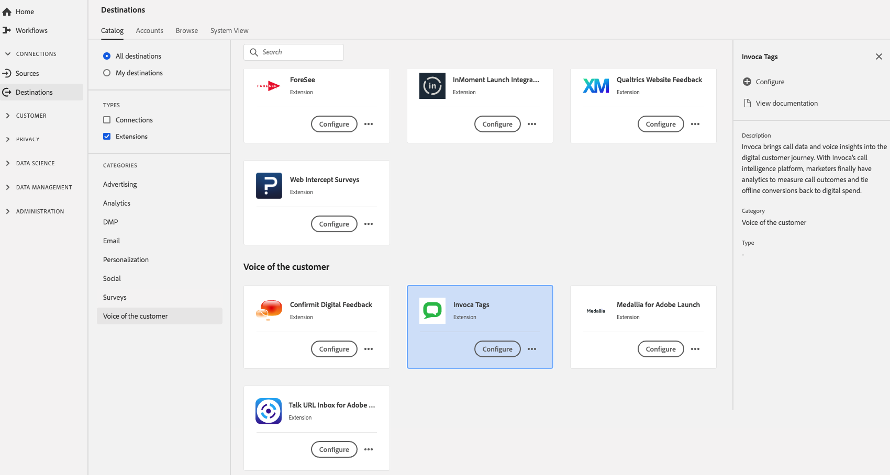

# [!DNL Invoca Tags] 拡張機能 {#invoca-extension}

## 概要 {#overview}

[!DNL Invoca] は、通話データと音声の洞察をデジタルカスタマージャーニーに提供します。を使用 [!DNL Invoca’s] コールインテリジェンスプラットフォームを使用すると、マーケターはついに、通話の結果を測定し、オフラインのコンバージョンをデジタル支出に結び付ける分析を行うことができます。

[!DNL Invoca Tags] は、Adobe Experience Platformの顧客の声拡張機能です。 拡張機能について詳しくは、[Adobe Exchange](https://exchange.adobe.com/experiencecloud.details.100067.invoca.html) の拡張機能のページを参照してください。

この宛先はタグ拡張機能です。 Platform でのタグ拡張の仕組みについて詳しくは、[タグ拡張機能の概要](../launch-extensions/overview.md)を参照してください。

## 前提条件 {#prerequisites}

プラットフォームを購入したすべての顧客は、この拡張機能を [!DNL Destinations] カタログから利用できます。

この拡張機能を使用するには、Adobe Experience Platform でタグにアクセスする必要があります。 タグは、標準装備の付加価値機能として Adobe Experience Cloud の顧客に提供されます。組織の管理者に問い合わせてタグへのアクセス権を取得し、拡張機能をインストールできるよう **[!UICONTROL manage_properties]** 権限の付与を依頼します。

## 拡張機能のインストール {#install-extension}

をインストールするには、以下を実行します。 [!DNL Invoca Tags] 拡張子：

[Platform インターフェイス](https://platform.adobe.com/)で、**[!UICONTROL 宛先]**／**[!UICONTROL カタログ]**&#x200B;に移動します。

カタログから拡張機能を選択するか、検索バーを使用します。

宛先をクリックしてハイライトしてから、右側のパネルで「**[!UICONTROL 設定]**」を選択します。**[!UICONTROL 設定]**&#x200B;コントロールがグレー表示になっている場合は、**[!UICONTROL manage_properties]** 権限がありません。[前提条件](#prerequisites)を確認してください。

拡張機能をインストールするプロパティを選択します。 また、新しいプロパティを作成するオプションもあります。プロパティは、ルール、データ要素、設定された拡張機能、環境およびライブラリの集まりです。プロパティについては、タグドキュメントの [「プロパティ」ページに関する節](../../../tags/ui/administration/companies-and-properties.md#properties-page) を参照してください。

このワークフローでは、インストールを完了する手順について説明します。

拡張機能の構成オプションとインストールのサポートについて詳しくは、[Adobe Exchange の Invoca Tags ページ](https://exchange.adobe.com/experiencecloud.details.100067.invoca.html)を参照してください。

拡張機能は、[データ収集 UI](https://experience.adobe.com/#/data-collection/) で直接インストールできます。詳しくは、[新しい拡張機能の追加](../../../tags/ui/managing-resources/extensions/overview.md#add-a-new-extension) （タグドキュメント）を参照してください。

## 拡張機能の使用方法 {#how-to-use}

拡張機能をインストールしたら、ルールの設定を開始できます。

特定の状況でのみ拡張機能の宛先にイベントデータを送信するように、インストール済みの拡張機能のルールを設定できます。拡張機能のルールの設定について詳しくは、[ルールに関するドキュメント](../../../tags/ui/managing-resources/rules.md)を参照してください。

## 拡張機能の設定、アップグレード、削除 {#configure-upgrade-delete}

データ収集 UI で、拡張機能の設定、アップグレードおよび削除を行うことができます。

>[!TIP]
>
>拡張機能がいずれかのプロパティに既にインストールされている場合、Platform UI ではその拡張機能に引き続き「**[!UICONTROL インストール]**」が表示されます。[拡張機能のインストール](#install-extension)の説明に従ってインストールワークフローを開始し、拡張機能を設定または削除します。

拡張機能をアップグレードするには、[拡張機能のアップグレードプロセス](../../../tags/ui/managing-resources/extensions/extension-upgrade.md) （タグドキュメント）のガイドを参照してください。
