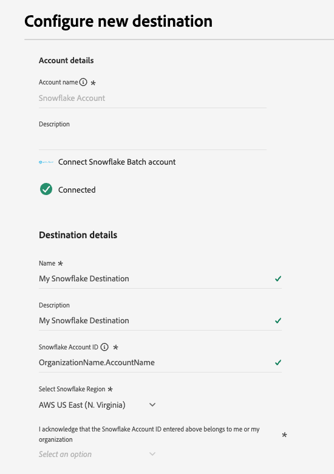
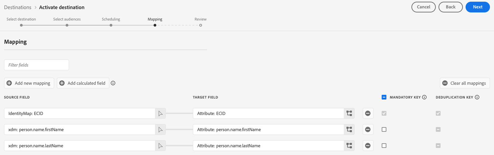
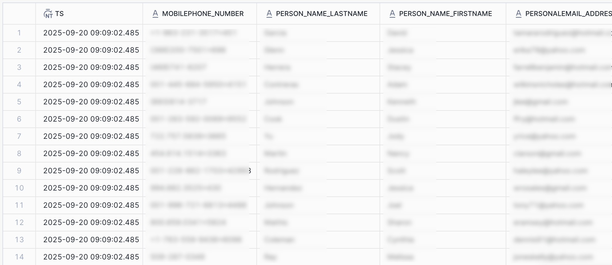

# Snowflake Batch connection {#snowflake-destination}

## 概要 {#overview}

この宛先を使用して、Snowflake アカウントの動的テーブルにオーディエンスデータを送信します。 動的テーブルでは、物理データのコピーを必要とせずにデータにアクセスできます。

次の節では、Snowflakeの宛先の仕組みと、AdobeとSnowflake間でのデータの転送方法について説明します。

### Snowflakeの仕組み {#data-sharing}

この宛先は[!DNL Snowflake] データ共有を使用します。つまり、データは物理的にエクスポートされず、独自のSnowflake インスタンスに転送されません。 代わりに、Adobeでは、Adobe Snowflake環境内でホストされているライブテーブルへの読み取り専用アクセス権が付与されます。 この共有テーブルは、Snowflake アカウントから直接クエリできますが、そのテーブルを所有しておらず、指定した保持期間を超えて変更または保持することはできません。 Adobeは、共有テーブルのライフサイクルと構造を完全に管理します。

AdobeからSnowflake アカウントへのデータフローを初めて設定すると、Adobeからのプライベートリストを受け入れるよう求めるメッセージが表示されます。

Snowflakeのプライベートリスト承認画面を示す

### データ保持とTTL （顧客生涯価値） {#ttl}

この統合を通じて共有されるすべてのデータには、7日間の固定有効期間（TTL）があります。 最後の書き出しから7日後、データフローがまだアクティブかどうかに関係なく、動的テーブルは自動的に期限切れになり、アクセスできなくなります。 データを7日以上保持する必要がある場合は、TTLの有効期限が切れる前に、独自のSnowflake インスタンスで所有しているテーブルにコンテンツをコピーする必要があります。

>[!IMPORTANT]
>
>Experience Platformでデータフローを削除すると、ダイナミックテーブルがSnowflake アカウントから消えます。

### オーディエンスの更新行動 {#audience-update-behavior}

オーディエンスが[&#x200B; バッチモード &#x200B;](../../../segmentation/methods/batch-segmentation.md)で評価された場合、共有テーブルのデータは24時間ごとに更新されます。 つまり、オーディエンスメンバーシップの変更と、それらの変更が共有テーブルに反映されるまでの間に、最大24時間の遅延が発生する可能性があります。

### バッチデータ共有ロジック {#batch-data-sharing}

データフローがオーディエンスに対して初めて実行されると、バックフィルが実行され、現在選定されているすべてのプロファイルが共有されます。 この最初のバックフィルの後、宛先はオーディエンスメンバーシップ全体の定期的なスナップショットを提供します。 各スナップショットは、共有テーブル内の以前のデータを置き換え、過去のデータを使用せずに常に最新のオーディエンスの完全なビューを表示します。

## ストリーミングとバッチデータ共有 {#batch-vs-streaming}

Experience Platformには、[Snowflake ストリーミング &#x200B;](snowflake.md)と[Snowflake バッチ &#x200B;](snowflake-batch.md)の2種類のSnowflake配信先があります。

両方の宛先では、アカウントに物理的にコピーすることなくSnowflakeのデータにアクセスできますが、各コネクタのユースケースに関して、推奨されるベストプラクティスがいくつかあります。

次の表では、各データ共有方法が最も適切なシナリオを概説することで、使用するコネクタを決定するのに役立ちます。

|  | 必要な場合は、[Snowflake バッチ &#x200B;](snowflake-batch.md)を選択してください | 必要な場合は、[Snowflake ストリーミング &#x200B;](snowflake.md)を選択してください |
|--------|-------------------|----------------------|
| **更新頻度** | 定期スナップショット | リアルタイムの継続的な更新 |
| **データ プレゼンテーション** | 過去のデータに代わる完全なオーディエンススナップショット | プロファイルの変更に基づく増分更新 |
| **ユースケースの焦点** | 待ち時間が重要ではない分析/マシンラーニングのワークロード | リアルタイムの更新が必要な即座のアクションシナリオ |
| **データ管理** | 常に最新の完全なスナップショットを表示 | オーディエンスメンバーシップの変更に基づく増分更新 |
| **シナリオ例** | ビジネスレポート、データ分析、マシンラーニングモデルのトレーニング | マーケティングキャンペーン抑制，リアルタイムのパーソナライゼーション |

ストリーミングデータの共有について詳しくは、[Snowflake Streaming Connection](snowflake.md)のドキュメントを参照してください。

## ユースケース {#use-cases}

バッチデータ共有は、オーディエンスの包括的なスナップショットが必要で、リアルタイムの更新が必要ないシナリオに最適です。次のようなものがあります。

* **分析ワークロード**: オーディエンスメンバーシップの全体像を必要とするデータ分析、レポート、またはビジネスインテリジェンスのタスクを実行する場合
* **機械学習ワークフロー**：完全なオーディエンススナップショットを活用したマシンラーニングモデルのトレーニングまたは予測分析の実行
* **データウェアハウス**：独自のSnowflake インスタンスでオーディエンスデータの現在のコピーを管理する必要がある場合
* **定期レポート**：過去の変更履歴を含めずに最新のオーディエンス状態が必要な通常のビジネスレポートの場合
* **ETL プロセス**：オーディエンスデータを一括変換または処理する必要がある場合

バッチデータ共有により、完全なスナップショットが提供されるため、増分的な更新や変更を手動で統合する必要がなくなり、データ管理が簡素化されます。

## 前提条件 {#prerequisites}

Snowflake接続を設定する前に、次の前提条件を満たしていることを確認してください。

* [!DNL Snowflake] アカウントにアクセスできます。
* Snowflake アカウントがプライベートリストに登録されています。 Snowflakeのアカウント管理者権限を持つ社内のユーザーは、これを設定できます。
* Snowflake アカウントのクラウドプロバイダーとリージョンを知っている。 宛先に接続するときに両方を入力する必要があります。

必要な権限について詳しくは、[[!DNL Snowflake]  ドキュメント &#x200B;](https://docs.snowflake.com/en/collaboration/consumer-listings-access#access-a-private-listing)を参照してください。

>[!IMPORTANT]
>
>この宛先は、ファイアウォールの背後にあるアカウントまたは[[!DNL Azure Private Link]](https://docs.snowflake.com/en/user-guide/privatelink-azure)を使用するSnowflake アカウントをサポートしていません。

## サポートされるオーディエンス {#supported-audiences}

この節では、この宛先に書き出すことができるオーディエンスのタイプについて説明します。 以下の2つの表は、このコネクタがサポートするオーディエンスを示しています。オーディエンスの由来&#x200B;_と_ オーディエンスに含まれるプロファイルタイプ _:_

| オーディエンスの由来 | サポートあり | 説明 |
|---------|----------|----------|
| [!DNL Segmentation Service] | ○ | Experience Platform [&#x200B; セグメント化サービス &#x200B;](../../../segmentation/home.md)を通じて生成されたオーディエンス。 |
| その他すべてのオーディエンスの生成元 | ○ | このカテゴリには、[!DNL Segmentation Service]を通じて生成されたオーディエンス以外のすべてのオーディエンスのオリジンが含まれます。 [様々なオーディエンスの起源](/help/segmentation/ui/audience-portal.md#customize)について読みます。 次に例を示します。 <ul><li> カスタムアップロードオーディエンス [がCSV ファイルからExperience Platformに](../../../segmentation/ui/audience-portal.md#import-audience)をインポートしました。</li><li> 類似オーディエンス， </li><li> 連合オーディエンス， </li><li> [!DNL Adobe Journey Optimizer]などの他のExperience Platform アプリで生成されたオーディエンス </li><li> その他。 </li></ul> |

{style="table-layout:auto"}

オーディエンスのデータタイプ別にサポートされるオーディエンス：

| オーディエンスのデータタイプ | サポートあり | 説明 | ユースケース |
|--------------------|-----------|-------------|-----------|
| [人物オーディエンス &#x200B;](/help/segmentation/types/people-audiences.md) | ○ | 顧客プロファイルにもとづいて、マーケティング施策の特定のグループをターゲットにすることができます。 | 買い物客やカートの放棄が多い |
| [&#x200B; アカウントオーディエンス &#x200B;](/help/segmentation/types/account-audiences.md) | × | アカウントベースドマーケティング戦略のために、特定の組織内の個人をターゲットにします。 | B2B マーケティング |
| [見込みオーディエンス &#x200B;](/help/segmentation/types/prospect-audiences.md) | × | まだ顧客ではないが、ターゲットオーディエンスと特徴を共有する個人をターゲットにします。 | サードパーティデータによる見込み顧客の開拓 |
| [&#x200B; データセットの書き出し](/help/catalog/datasets/overview.md) | × | [!DNL Adobe Experience Platform] データ レイクに保存されている構造化データのコレクション。 | レポート，データサイエンスワークフロー |

{style="table-layout:auto"}

## 書き出しのタイプと頻度 {#export-type-frequency}

宛先の書き出しのタイプと頻度について詳しくは、以下の表を参照してください。

| 項目 | タイプ | メモ |
|---------|----------|---------|
| 書き出しタイプ | **[!UICONTROL Audience export]** | [!DNL Snowflake] 宛先で使用される識別子（氏名、電話番号など）を使用して、オーディエンスのすべてのメンバーを書き出します。 |
| 書き出し頻度 | **[!UICONTROL Batch]** | この宛先は、Snowflakeのデータ共有を通じて、オーディエンスメンバーシップ全体の定期的なスナップショットを提供します。 各スナップショットは以前のデータに置き換わり、常に最新のオーディエンスの全体像を把握できます。 |

{style="table-layout:auto"}

## 宛先への接続 {#connect}

>[!IMPORTANT]
>
>宛先に接続するには、**[!UICONTROL View Destinations]**&#x200B;および&#x200B;**[!UICONTROL Manage Destinations]** [&#x200B; アクセス制御権限](/help/access-control/home.md#permissions)が必要です。 詳しくは、[アクセス制御の概要](/help/access-control/ui/overview.md)または製品管理者に問い合わせて、必要な権限を取得してください。

この宛先に接続するには、[宛先設定のチュートリアル](../../ui/connect-destination.md)の手順に従ってください。宛先の設定ワークフローで、以下の 2 つのセクションにリストされているフィールドに入力します。

### 宛先に対する認証 {#authenticate}

宛先に対して認証を行うには、**[!UICONTROL Connect to destination]**&#x200B;を選択し、アカウント名と、オプションでアカウントの説明を指定します。

宛先への認証方法を示す

### 宛先の詳細の入力 {#destination-details}

>[!CONTEXTUALHELP]
>id="platform_destinations_snowflake_batch_accountid"
>title="Snowflake Data Sharing アカウント識別子を入力してください"
>abstract="アカウントが組織にリンクされている場合は、`OrganizationName.AccountName`   という形式を使用します。アカウントが組織にリンクされていない場合は、`AccountName` という形式を使用します"

宛先の詳細を設定するには、以下の必須フィールドとオプションフィールドに入力します。UI のフィールドの横のアスタリスクは、そのフィールドが必須であることを示します。

宛先の詳細を入力する方法を示す

* **[!UICONTROL Name]**：今後この宛先を認識する際に使用する名前。
* **[!UICONTROL Description]**：今後この宛先を特定するのに役立つ説明です。
* **[!UICONTROL Snowflake Account ID]**: [Snowflake Data Sharing Account Identifier](https://docs.snowflake.com/en/user-guide/admin-account-identifier#label-account-name-data-sharing)。 アカウントが組織にリンクされているかどうかに応じて、次の形式を使用します。
   * アカウントが組織にリンクされている場合：組織名とアカウント名を&#x200B;**期間** （`.`）で区切って入力します。 例えば、組織名がACMEで、アカウント名がAsiaRegionの場合は、`ACME.AsiaRegion`と入力します。
   * アカウントが組織にリンクされていない場合：`AccountName`。
* **[!UICONTROL Snowflake Region]**: Snowflake インスタンスがプロビジョニングされているリージョンを選択します。 サポートされているクラウドリージョンについて詳しくは、Snowflake [&#x200B; ドキュメント &#x200B;](https://docs.snowflake.com/en/user-guide/intro-regions)を参照してください。
* **[!UICONTROL Account acknowledgment]**: **[!UICONTROL Snowflake Account ID]**&#x200B;を入力した後、このドロップダウンで「**[!UICONTROL Yes]**」を選択して、**[!UICONTROL Snowflake Account ID]**&#x200B;が正しく、自分に属していることを確認します。

>[!NOTE]
>
> 宛先を作成した後、**[!UICONTROL Snowflake Account ID]**&#x200B;宛先を編集&#x200B;**[!UICONTROL Snowflake Region]** ワークフローで[と](../../ui/edit-destination.md)を編集することはできません。 異なるアカウントまたは地域の値を使用するには、[新しい宛先接続を作成します](../../ui/connect-destination.md)。

>[!IMPORTANT]
>
> 宛先名とExperience Platform サンドボックス名で使用される特殊文字は、Snowflakeで自動的にアンダースコア（`_`）に変換されます。 混乱を避けるために、宛先名とサンドボックス名に特殊文字を使用しないでください。

### アラートの有効化 {#enable-alerts}

アラートを有効にすると、宛先へのデータフローのステータスに関する通知を受け取ることができます。リストからアラートを選択して、データフローのステータスに関する通知を受け取るよう登録します。アラートについて詳しくは、[UI を使用した宛先アラートの購読](../../ui/alerts.md)に関するガイドを参照してください。

宛先接続の詳細の提供が完了したら、**[!UICONTROL Next]**&#x200B;を選択します。

## この宛先に対してオーディエンスをアクティブ化 {#activate}

>[!IMPORTANT]
>
>* データをアクティブ化するには、**[!UICONTROL View Destinations]**、**[!UICONTROL Activate Destinations]**、**[!UICONTROL View Profiles]**&#x200B;および&#x200B;**[!UICONTROL View Segments]** [&#x200B; アクセス制御権限](/help/access-control/home.md#permissions)が必要です。 [アクセス制御の概要](/help/access-control/ui/overview.md)を参照するか、製品管理者に問い合わせて必要な権限を取得してください。
>* *ID*&#x200B;をエクスポートするには、**[!UICONTROL View Identity Graph]** [&#x200B; アクセス制御権限](/help/access-control/home.md#permissions)が必要です。  {width="100" zoomable="yes"}

この宛先に対してオーディエンスをアクティブ化する手順については、[バッチプロファイル書き出し宛先に対するオーディエンスデータのアクティブ化](/help/destinations/ui/activate-batch-profile-destinations.md)を参照してください。

### 属性のマップ {#map}

IDとプロファイル属性をこの宛先に書き出すことができます。

[計算フィールド コントロール &#x200B;](../../ui/data-transformations-calculated-fields.md)を使用して、配列の書き出しと操作を実行できます。

ターゲット属性は、**[!UICONTROL Attribute name]** フィールドで指定した属性名を使用して、Snowflakeで自動的に作成されます。

## 書き出されたデータ／データ書き出しの検証 {#exported-data}

データは、動的テーブルを介してSnowflake アカウントにステージングされます。 Snowflake アカウントを確認して、データが正しく書き出されたことを確認します。

### データ構造 {#data-structure}

動的テーブルには、次の列が含まれます。

* **TS**：共有テーブルの各行がいつ最後に更新されたかを示すタイムスタンプ列
* **結合ポリシーID**：アクティブ化されているオーディエンスが属する[結合ポリシー](../../../profile/merge-policies/overview.md)のID
* **マッピング属性**：アクティベーションワークフロー中に選択したすべてのマッピング属性は、Snowflakeの列ヘッダーとして表されます
* **オーディエンスメンバーシップ**: データフローにマッピングされたオーディエンスへのメンバーシップは、対応するセルの`active` エントリを介して示されます

動的なテーブルデータを含むSnowflake インターフェイスを示す {align="center" zoomable="yes"}

## データの使用とガバナンス {#data-usage-governance}

[!DNL Adobe Experience Platform] のすべての宛先は、データを処理する際のデータ使用ポリシーに準拠しています。[!DNL Adobe Experience Platform] がどのように データガバナンスを実施するかについて詳しくは、[データガバナンスの概要](/help/data-governance/home.md)を参照してください。
